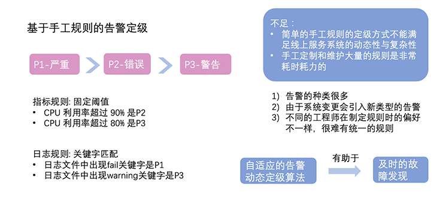
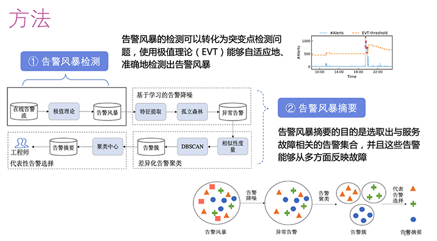
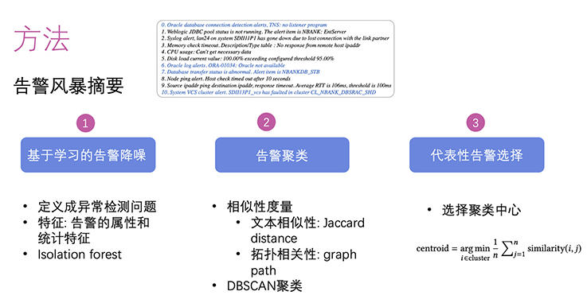
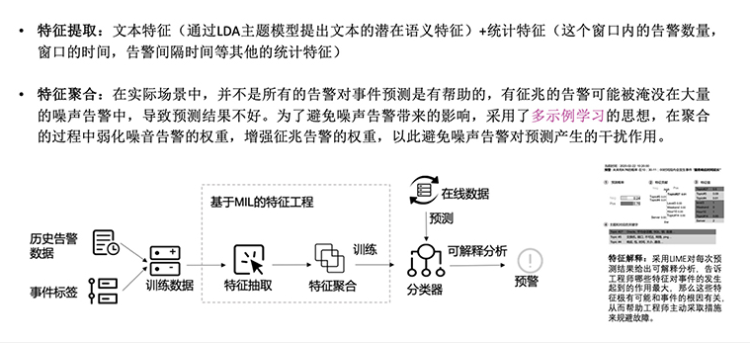

## 必示科技告警

### 自适应的告警动态定级
Automatically and Adaptively Identifying Severe Alerts for Online Service Systems

首先采用多特征（40）融合，不仅采用告警数据，还提取了一部分指标特征；
其次，对告警严重性进行排序，把识别告警严重性定义为排序模型。

数据：
- 告警数据
- KPI数据
- 工单数据

针对告警数据提取三类特征：
一是文本特征，包括告警语义的主题模型和文本熵IDF（Inverse document frequency），去看关键词的重要性；二是时间特征，包括频率、周期、告警数量和间隔时间等；
三是告警类型和发出时间等其他特征。比如发出时间就是一个关键特征，券商客户遇到的告警发生在开市期间还是闭市期间？不同时间同样的CPU告警级别是完全不同的。

告警所在的业务也有各种各样的黄金指标，特别是相应的业务指标。对此，我们提取了所在应用系统的关键业务指标，比如交易量、响应时间、成功率等。这里主要采用两种方式：一、对它们做异常检测，将异常分数作为评分；二、进行多指标异常检测，安全模拟一个实体的健康分数，作为特征融入模型。

特征完成后去训练排序模型，这里的标签主要来自于历史的告警数据的处置记录，也就是工单。

一共用到40个特征。采用了XGBoost ranking模型

使用三组工业界真实的告警数据来评估，用AlertRank方法去对比传统基于规则的方法和BUG报告定级算法BUG-KNN。结果表明， AlertRank方法可以达到平均90%的F1 -SCORE，是整体最优的方法。同时，我们评估了多特征融合方式的作用，分别看了告警特征和指标特征对结果的贡献，发现它们对模型起到正向作用。

问题：  典型机器学习思路， 特征提取，需要历史数据训练模型，然后预测
如何实时处理？
实时预测 + 周期性更新模型？

Online Summarizing Alerts through Semantic and Behavior Information

### 告警风暴摘要
Understanding and Handing Alert Storm for Online Service Systems

挑战：
- 固定阈值的告警风暴检测方法表现不好
- 混杂在故障中的不相关告警影响排障，需要做告警降噪
- 告警之间复杂的关联关系也需要建模来精炼

告警风暴检测
- 每天告警产生的数量的极值异常检测
告警风暴摘要
- 基于学习的告警降噪，将告警风暴中与此次故障无关的告警全部删除；
  - 定义成异常检测的问题，因为故障不常发生，经常发生的告警和这次故障没有关系。
- 差异化的告警聚类，总结告警里有多少告警簇；	
  - 文本相似性
  - 拓扑相似性，定义了软件层面和硬件部署层面两种拓扑，使用它们相连的最短路径去刻画拓扑相关性
- 代表性告警选择，在每一个簇找到代表性的告警选择，减少工程师看的数量。
最终的目的是通过告警风暴摘要，选取出与故障相关的告警集合，并且这些告警能够从多方面反映故障。

### 基于告警的事件预测
Real-time Incident Prediction for Online Service Systems
历史低级别告警去预测和故障相关的高级别告警，并提供可解释的预测分析

事件预测定义为一个窗口分类的问题，即在当前时刻t，拿过去一段历史告警数据（观测窗口），基于窗口内的告警数据去提取特征，来预测未来一段时间（预测窗口）会不会出现某个事件。

- 通过历史告警数据和事件的标签得到训练数据
- 再进行特征抽取和特征聚合
- 利用分类器建立模型对在线数据进行预测。
文本特征和统计特征
- 对观测窗口内的告警数据的文本，通过LDA主题模型提取文本的潜在语义特征，并且加入窗口内所有告警数量、窗口时间、告警间隔时间等其他统计特征。

多示例学习MIL思想

第一篇论文“自适应的告警动态定级”，提出了基于排序模型的告警动态定级算法，基于多特征融合，设计并从多源数据中提取了多种特征，用于表征告警的严重性。
 
第二篇论文“告警风暴摘要”，聚焦在告警风暴这一运维问题当中，提出了用动态剧变点检测方法准确检测告警风暴，并提出一套有效的告警风暴摘要算法，包括噪声告警过滤、告警聚类和典型告警选择。
 
第三篇论文“基于告警的事件预测”，我们采用了多示例学习的思想，去解决噪声告警对预测的干扰，基于有监督的分类算法构建了事件预测模型，提供可解释的结果去方便工程师主动采取措施规避故障。

### REF

- [必示科技2020年度告警数据挖掘方向顶会论文分享（一）](https://www.bizseer.com/index.php?m=content&c=index&a=show&catid=26&id=31)
- [必示科技2020年度告警数据挖掘方向顶会论文分享（二）](https://www.bizseer.com/index.php?m=content&c=index&a=show&catid=26&id=32)
- https://www.bizseer.com/index.php?m=content&c=index&a=show&catid=26&id=47
- https://www.bizseer.com/index.php?m=content&c=index&a=show&catid=26&id=105
- https://www.bizseer.com/index.php?m=content&c=index&a=show&catid=26&id=109 
- https://www.bizseer.com/index.php?m=content&c=index&a=show&catid=26&id=101 

- [AIOPS WORKSHOP](https://workshop.aiops.org/#2019%20AIOps%E6%8C%91%E6%88%98%E8%B5%9B%E5%86%B3%E8%B5%9B%20%E6%9A%A8%20%E7%AC%AC%E4%BA%8C%E5%B1%8AAIOps%E7%A0%94%E8%AE%A8%E4%BC%9A-div) 相关SLIDE
  - [aiopschallenge 新链接](https://www.aiops.cn/aiopschallenge/)

- [时间序列异常检测（三）—— 告警策略与根因定位](https://zhuanlan.zhihu.com/p/363254791)

- 金融场景下的根源告警分析 沈建林 @京东金融基础开发部  《企业级AIops 实施建议》
  - 根源告警分析是基于网络拓扑，结合调用链，通过时间相关性、权重、机器学习等算法，将告警进行分类筛选，快速找到告警根源的一种方式。它能从大量的告警中找到问题的根源，因此大大缩短了故障排查及恢复时间。

- 汤泳-苏宁大规模智能告警收敛与告警根因的实践
  - 基于运维知识图谱的告警收敛和根因定位：包括全局视角下的软硬件知识图谱和告警知识图谱，利用NLP技术对告警文本信息进
行分类，然后将告警收敛到软硬件知识图谱的相关节点上，再结合具有因果关系的告警知
识图谱，得出一条 “A –> B –> C –> D”的根因链路。