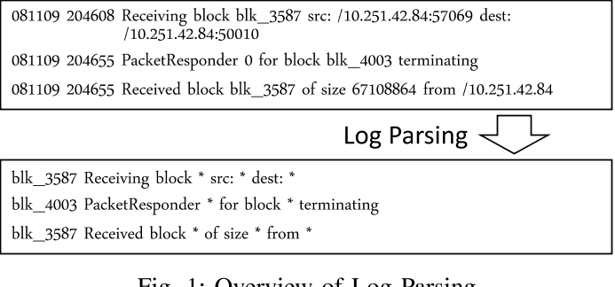
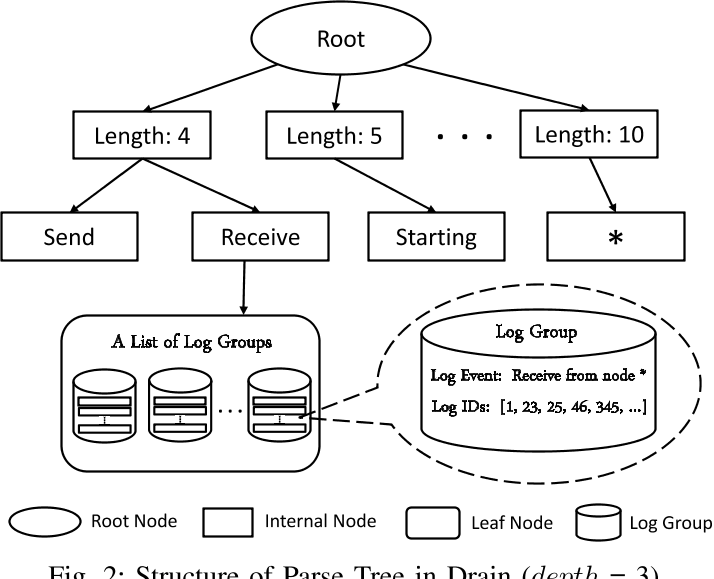
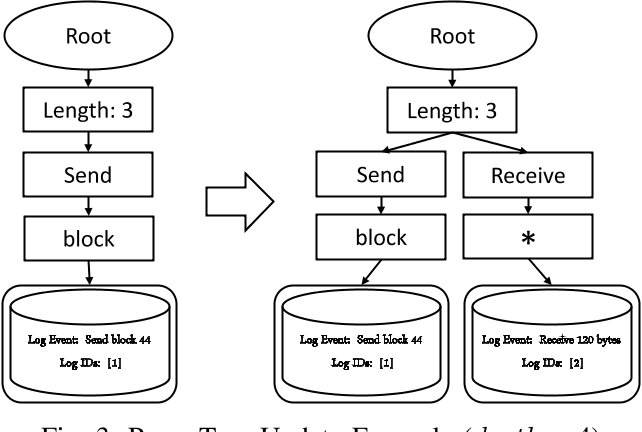

## 日志异常检测Log Anomaly Detection

## drain 模式识别算法

日志解析结果：

日志解析数据结构：

日志解析过程更新：

处理步骤：

1. 预处理，领域知识正则匹配。DRAIN允许用户基于表示常用变量(如IP地址和块ID)的域知识提供简单的正则表达式。然后，DRAIN将从原始日志消息中删除与这些正则表达式匹配的token。（删除或者用*替换？）

2. 第一层处理，解析树中的第一层节点表示日志消息具有不同日志消息长度的日志组。对于日志消息长度，我们指的是日志消息中的token数。在此步骤中，DRAIN基于经预处理的日志消息的日志消息长度来选择到第一层节点的路径。
   
   1. 基于具有相同日志事件的日志消息可能具有相同的日志消息长度的假设。尽管具有相同日志事件的日志消息可能具有不同的日志消息长度，但可以通过简单的后处理进行处理。此外，我们在第四-B节中的实验证明了即使在没有后处理的情况下，DRAIN在分析准确率方面也具有优势。

3. 在此步骤中，DRAIN从在步骤2中搜索的第1层节点遍历到叶节点。
   
   1. 此步骤基于这样的假设，即日志消息开始位置中的token更可能是常量。
   
   2. 具体地说，DRAIN根据日志消息开始位置中的标记选择下一个内部节点。
   
   3. 在这一步中，DRAIN遍历的内部节点数为(Depth−2)，其中Depth是限制所有叶节点的深度的解析树参数。因此，存在将日志消息中的第一个(Depth−2)token编码为搜索规则的(Depth−2)层。
   
   4. 为了避免分支爆炸，我们在此步骤中只考虑不包含数字的token。如果token包含数字，它将匹配特殊的内部节点“*”。
   
   5. 定义了一个参数MaxChild，它限制了节点的最大子节点数。如果某个节点已经有了MaxChild子节点，则任何不匹配的token都将在其所有子节点中匹配特殊的内部节点“*”。
   
   6. 例如，对于日志消息“从节点4接收”，排出从第一层节点“长度：4”遍历到第二层节点“接收”，因为在日志消息的第一个位置的token是“接收”。

4. 然后DRAIN将遍历到与内部节点RECEIVE链接的叶节点，并转到步骤4。
   
   1. 在此步骤之前，DRAIN已遍历到包含日志组列表的叶节点。这些日志组中的日志消息遵循路径沿线的内部节点中编码的规则。
   
   2. 在此步骤中，DRAIN从日志组列表中选择最合适的日志组。我们计算每个日志组的日志消息和日志事件之间的相似度simSeq。

5. **更新解析树**
   
   1. 如果在步骤4中返回合适的日志组，则DRAIN会将当前日志消息的日志ID添加到返回的日志组中的日志ID中。此外，还会更新返回日志组中的日志事件。
   
   2. 具体而言，DRAIN扫描位于日志消息和日志事件相同位置的token。
   
   3. **如果两个token相同，则不会修改该位置中的token。否则，我们通过日志事件中的通配符(即*)来更新该位置中的token。（&计算，相同保留，不同设置为*）**
   
   4. 如果DRAIN找不到合适的日志组，它将根据当前日志消息创建一个新的日志组，其中日志ID仅包含日志消息的ID，而日志事件正是日志消息。
   
   5. 然后，DRAIN将使用新的日志组更新解析树。

## REF

- [面向跨语言的操作系统日志异常检测技术研究与实现-51CTO.COM](https://www.51cto.com/article/714875.html)

- https://github.com/AICoE/log-anomaly-detector

- drain:
  
  - [GitHub - logpai/Drain3: Drain log template miner in Python3](https://github.com/logpai/Drain3)
  
  - [Drain算法：日志解析_就叫昵称吧的博客-CSDN博客_drain算法](https://blog.csdn.net/qq_39378221/article/details/121212682)
  
  - [知乎-日志解析算法总结](https://zhuanlan.zhihu.com/p/448098972) （drain + spell）
