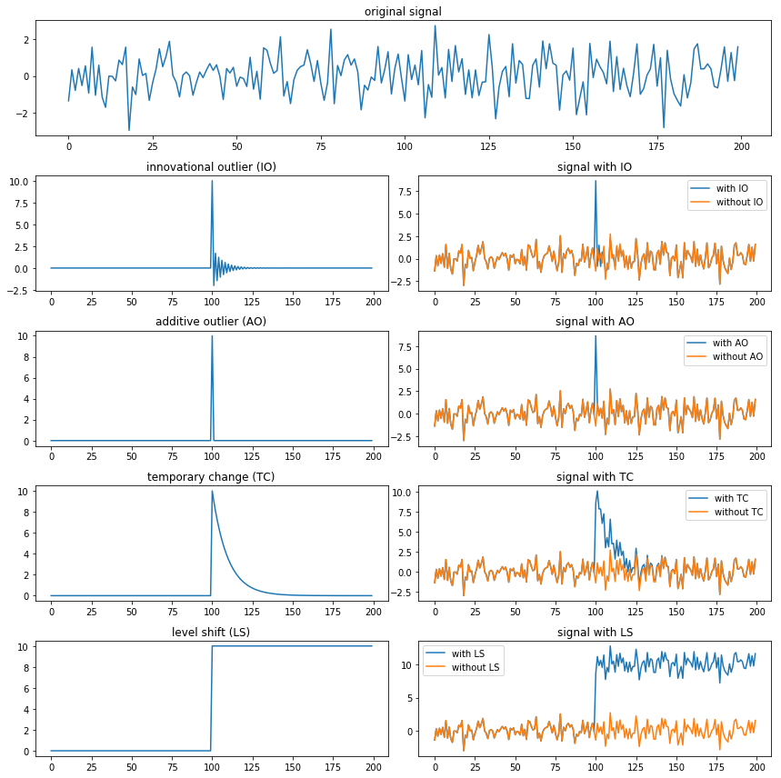

## 时序预测

### 时序异常分类

- innovational outlier (IO):造成离群点干扰不仅作用于X(T)，而且影响T时刻以后序列的所有观察值。
- additive outlier (AO):造成这种离群点的干扰，只影响该干扰发生的那一个时刻T上的序列值，而不影响该时刻以后的序列值。
- level shift (LS):造成这种离群点的干扰是在某一时刻T，系统的结构发生了变化，并持续影响T时刻以后的所有行为，在数列上往往表现出T时刻前后的序列均值发生水平位移。
- temporary change (TC)：造成这种离群点的干扰是在T时刻干扰发生时具有一定初始效应，以后随时间根据衰减因子的大小呈指数衰减。

阿里SLS对应用角度异常划分:

- 延时的毛刺、IO毛刺，存在**局部**峰值
- 业务系统调用量异常（断间隔的上升或下降）
  - 短时连续的IO类型异常
- 水位上升，新版本发布后，各个指标的形态与历史吻合，但是整体的平均水位有拔高
  - LS 类型异常

异常类型：

- 异常值（Outlier）
  - 给定输入时间序列x，异常值是时间戳值对$(t,x_t)$，其中观测值$x_t$与该时间序列的期望值$(E(x_t))$不同。
- 波动点（Change Point）
  - 给定输入时间序列x，波动点是指在某个时间t，其状态在这个时间序列上表现出与t前后的值不同的特性。
- 断层异常（Breakout）
  - 时序系统中某一时刻的值比前一时刻的值陡增或者陡降很多。
  - LS 类型异常
- 异常时间序列（Anomalous Time Series）
  - 给定一组时间序列$X={x_i}$，异常时间序列$x_i \in X$是在X上与大多数时间序列值不一致的部分。

### 时序预处理

- 推断时间间隔频率freq
  - 计算时间列最小的时间间隔作为时间频率
    - 间隔28-31 day的时间转为'M'
    - 间隔365-366 day的时间转为'Y'
- 异常值处理
- 补点padding
  - 填充缺失时间间隔
- 缺失值插值
  - linear：线性
    - 对于首部的na值，使用后面一个合法观测值代替，而末尾na值，使用前面一个合法观测值代替。
  - spline：三次样条插值。
    - 相对于线性插值保持趋势，而对于末尾值，使用线性插值。
  - nearest： 最近邻。
    - 缺失值选择最近索引的值，首尾null值使用第一个最近的合法观测值代替。
  - last：最后值。
    - 假设缺失值的增量为0，首尾null值使用第一个最近的合法观测值代替。
  - zero：填零。

离异值识别：

- MAP绝对值差中位数法（Median Absolute Deviation）
  - 支持对AO，大部分IO，TC异常值进行预处理。
    - LF的处理？时间序列异常点及突变点的检测算法
  - 删除离异点，之后可以使用线性，插值
- 3-Sigma拉依达准则
  - 假设一组检测数据只含有随机误差，对原始数据进行计算处理得到标准差，然后按一定的概率确定一个区间，认为误差超过这个区间的就属于异常值。
    - 支持对AO的检测，大部分IO，TC。
      - 前提是数据服从正态分布
      - 反例，线性递增。

### ARIMA

AR

- pdq : 非季节性
  - p : AR 项， 自相关性
  - d ： 差分阶数
  - q :  移动平均项

MA

- PDQ: 周期内季节性
  - s：周期样本数

### Exponential smoothing

20世纪50年代末提出了指数平滑法（Brown，1959;霍尔特，1957年; Winters，1960），并激发了一些最成功的预测方法。使用指数平滑法生成的预测是过去观测值的加权平均值，权重随着观测值的老化而呈指数衰减。换句话说，观察越近，关联的权重越高。该框架可以快速生成可靠的预测，并且适用于广泛的时间序列，这是一个很大的优势，对于工业应用具有重要意义。

基于预测算法的异常检测anomalies，使用sktime支持过去训练样本范围和区间预测的算法

- AutoETS
  - 时间相对ExponentialSmoothing 有50ms
- PMDARIMA
  - 缺点：PMDARIMA 第一个周期预测不准，上下界也很高
- StatsForecastAutoARIMA
  - 缺点：耗时相对较高  1s以上

## Q&A

### 1.预测未来时，区间预测的上下界经常看到开口越来越大

一般地，区间预测，基于标准差、方差乘以正态分布、t分布的百分比点值，来进行进行计算上下界。而方差或者[边际方差(marginal variance)](https://web.ma.utexas.edu/users/mks/384G06/condmargmeanvar.pdf)  `Var(Y) = E([Y - E(Y)]^2)`  ， 进行预测时，考虑到预测误差的累积，会相对预测水平而对标准差做一定调整，预测越远，标准差越大，从而开口越大。

例如，sktime STL Drift 是将趋势的方差乘以了系数，参考[多步预测](https://otexts.com/fpp3/prediction-intervals.html) 调整周期长度，从而降低Drift的方差的增长次数，缩小上下界开口。

## REF

- [wiki:ARIMA](https://en.wikipedia.org/wiki/Autoregressive_integrated_moving_average)

- [course: stat510](https://online.stat.psu.edu/stat510/) 宾夕法尼亚州立大学 应用时间序列分析 (网页更现代)

- [course: duke 411](https://people.duke.edu/~rnau/411home.htm) 杜克大学 统计预测： 回归和时间序列分析的注释

- **[预测： 方法与实践](https://otexts.com/fppcn/)  预测原理和实践中文版，第二版**
  
  - [预测区间](https://otexts.com/fppcn/prediction-intervals.html) 一步预测区间/多步

- [预测原理和实践（Rob Hyndman 和 George Athanasopoulos 的基于 R 的在线教科书）](https://www.otexts.org/fpp)第二版

- [Forecasting: Principles and Practice (3rd ed)](https://otexts.com/fpp3/) 预测原理和实践第3版

- [OpenIntro Statistics（David Diez、Christopher Barr、Mine Cetinkaya-Rundel）](https://www.openintro.org/stat/textbook.php?stat_book=os)

- [Online StatBook (David Lane)](http://onlinestatbook.com/2/index.html)
  
  - [International Institute of Forecasters](https://forecasters.org/resources/) 国际预测研讨会资源
  - [预测原理网站（J. Scott Armstrong 和 Kesten Green）](http://www.forecastingprinciples.com/)

- [刘岩-时间序列2018](http://www.liuyanecon.com/ug-ts-2018/)

- sktime
  
  - [AutoARIMA](https://www.sktime.org/en/stable/api_reference/auto_generated/sktime.forecasting.arima.AutoARIMA.html)
  - [ARIMA](https://www.sktime.org/en/stable/api_reference/auto_generated/sktime.forecasting.arima.ARIMA.html)

- [statsmodels.tsa.arima.model.ARIMA](https://www.statsmodels.org/devel/generated/statsmodels.tsa.arima.model.ARIMA.html)

- [PMDARIMA](http://alkaline-ml.com/pmdarima/)
  
  - [ARGS](https://alkaline-ml.com/pmdarima/modules/generated/pmdarima.arima.ARIMA.html#pmdarima.arima.ARIMA)

- [Anomaly-Detection-Using-ARIMA](https://github.com/atuljha23/Anomaly-Detection-Using-ARIMA)
  
  - https://github.com/atuljha23/Anomaly-Detection-Using-ARIMA/blob/master/Anomaly%20Detection%20Using%20ARIMA%20and%20Linear%20Regression.ipynb

- 模型解释
  
  - [使用 AIC、BIC 和 MDL 进行概率模型选择](https://machinelearningmastery.com/probabilistic-model-selection-measures/)
  - [如何解释 ARIMA 结果](https://analyzingalpha.com/interpret-arima-results)
  - [Statsmodel线性回归模型总结的简单解释](https://towardsdatascience.com/simple-explanation-of-statsmodel-linear-regression-model-summary-35961919868b)
  - [回归模型的评价指标比较](https://zhuanlan.zhihu.com/p/143169742)

- [分位数回归和预测区间](https://medium.com/analytics-vidhya/quantile-regression-and-prediction-intervals-e4a6a33634b4)

- [Time Series Analysis, Regression and Forecasting with tutiorials in python ](https://timeseriesreasoning.com/) Sachin Date

- 时序异常检测blogs
  
  - [异常检测综述](https://www.huhuapin.cn/2021/06/27/time-series-anomalies-detection/)
    
    - 异常分类，常见处理方法
  
  - [时间序列异常检测算法综述](https://www.biaodianfu.com/timeseries-anomaly-detection.html)
  
  - [时序异常检测算法概览](https://zhuanlan.zhihu.com/p/43413564)
  
  - [SLS机器学习介绍（03）：时序异常检测建模](https://developer.aliyun.com/article/669164)
  
  - [在R中使用异常化检测异常](https://www.srcmini.com/45906.html)

- 时序预处理
  
  - [预测:方法与实践-处理缺失值和离群值](https://otexts.com/fppcn/missing-outliers.html#missing-outliers)
  - [Pre-processing of Time Series Data](https://medium.com/enjoy-algorithm/pre-processing-of-time-series-data-c50f8a3e7a98)
  - [机器学习（三）：数据预处理--数据预处理的基本方法](https://zhuanlan.zhihu.com/p/100442371)
  - [多元时间序列缺失值处理方法总结](https://zhuanlan.zhihu.com/p/95459445)

- Datadog的算法
  
  - 异常检测outliers
    - [DBSCAN和MAP](https://www.datadoghq.com/blog/outlier-detection-algorithms-at-datadog/#toc-dbscan) 时间序列之间的异常划分
    - [扩展](https://www.datadoghq.com/blog/scaling-outlier-algorithms/) 而考虑到指标的整体幅度，上下文的意义，避免误报。

- [时间序列预测方法总结](https://zhuanlan.zhihu.com/p/67832773)

- [甩掉容量规划炸弹：用 AHPA 实现 Kubernetes 智能弹性伸缩](https://developer.aliyun.com/article/1078370)
  
  - *RobustPeriod*  周期识别
    - https://github.com/ariaghora/robust-period 非官方实现
  - *RobustSTL* 鲁棒的趋势，周期性分解
    - https://github.com/LeeDoYup/RobustSTL 非官方实现
      - 双边滤波降噪
      - 最小绝对偏差LAD 提取趋势

- 学时间序列分析有没有浅显易懂的书或视频？ - 张戎的回答 - 知乎 https://www.zhihu.com/question/280025347/answer/606794881

- 有什么好的关于时间序列分析的学习资料？ - Python与数据挖掘的回答 - 知乎 https://www.zhihu.com/question/26531019/answer/2688199336

- 时间序列笔记-专栏目录 - 冷泉望海遥的文章 - 知乎 https://zhuanlan.zhihu.com/p/374081618

- https://machinelearningmastery.com/start-here/#timeseries

- [机器学习笔记： 时间序列 分解 STL](https://blog.csdn.net/qq_40206371/article/details/122953379)

- [标准化和归一化什么区别？]( https://www.zhihu.com/question/20467170)
  
  - 标准化和归一化什么区别？ - 本空的回答 - 知乎 https://www.zhihu.com/question/20467170/answer/839255695

- [智能运维 | 故障诊断与根因分析论文一览](https://mp.weixin.qq.com/s/ILXnXQulDVFwmHdNtEcXng)

- [智能运维系列（二）| 智能化监控领域探索](https://mp.weixin.qq.com/s?__biz=MzIyOTYyNjMyNg==&mid=2247486650&idx=1&sn=7fef017e6a018eec6e72c890f85b683f)

- [alibi dectect](https://docs.seldon.io/projects/alibi-detect/en/latest/)
  
  - 开源 Python 库，专注于**异常值**、**对抗性**和**漂移**检测。
  - 大多数返回是否异常，以及异常分数， 基于正常，离群的比例，设置阈值。
  - 支持动态区间预测算法：仅prophet

## 数据集

- [离群值检测](https://paperswithcode.com/task/outlier-detection) 信息汇总，论文最新sota，数据集
  
  - [Outlier Detection DataSets (ODDS)](http://odds.cs.stonybrook.edu/)
    - [Yahoo - TSAD 的基准数据集](https://yahooresearch.tumblr.com/post/114590420346/a-benchmark-dataset-for-time-series-anomaly)
    - [Numenta 异常基准 (NAB)](https://github.com/numenta/NAB/tree/master/data)

- [tods](https://github.com/datamllab/tods/blob/master/README.zh-CN.md)

- - Kwei-Herng Lai et al. “Revisiting Time Series Outlier Detection: Definitions and Benchmarks” neural information processing systems(2021): n. pag.

- [M5 预测 - 准确性](https://www.kaggle.com/competitions/m5-forecasting-accuracy/data) 估计沃尔玛零售商品的单位销售额

- [一些过去的时间序列比赛](https://www.kaggle.com/competitions/m5-forecasting-accuracy/discussion/133463)
  
  - [网络流量时间序列预测](https://www.kaggle.com/competitions/web-traffic-time-series-forecasting/data)  预测维基百科页面的未来流量

- [AIOps-挑战-2020-数据](https://github.com/NetManAIOps/AIOps-Challenge-2020-Data)

- CCF国际AIOps挑战赛 似乎需要参赛才能获取

- [时间序列分类](http://www.timeseriesclassification.com/) 数据集
  
  - [数据集](https://timeseriesclassification.com/dataset.php)
  - [sktime 加载数据](https://github.com/alan-turing-institute/sktime/blob/master/examples/loading_data.ipynb)
  - [sktime 提供的数据集](https://www.sktime.org/en/stable/api_reference/datasets.html)

- [Monash Time Series Forecasting Archive](https://forecastingdata.org/) 莫纳什时间序列预测库
  
  - 我们的存储库包含 30 个数据集，包括公开可用的时间序列数据集（不同格式）和我们策划的数据集。许多数据集根据频率和缺失值的包含情况有不同的版本，使数据集变体总数达到 58。此外，它包括涵盖不同领域的真实世界和竞争时间序列数据集。
  - 使用方式，下载.tsf格式文件，然后借助[python/R](https://github.com/rakshitha123/TSForecasting/tree/master/utils) 脚本进行加载

- [NYC citi bike dataset](https://citibikenyc.com/system-data)
  
  - 经过预处理，可以得到如乘客数量的时序数据，按其他属性进行分组，例如开始站点。
  
  - [exploring-bike-share-data](https://towardsdatascience.com/exploring-bike-share-data-3e3b2f28760c)
  
  - （google bigquery ml 例子）

- [awesome-public-datasets#timeseries](https://github.com/awesomedata/awesome-public-datasets#timeseries)
  
  - [Hard Drive Failure Rates](https://www.backblaze.com/hard-drive-test-data.html) [[Meta](https://github.com/awesomedata/apd-core/tree/master/core//TimeSeries/Hard-Drive-Failure-Rates.yml)] 硬盘故障率

- [DataTalksClub/data-engineering-zoomcamp dataset](https://github.com/DataTalksClub/data-engineering-zoomcamp/blob/main/week_7_project/datasets.md) 数据集集合
  
  - https://cloud.google.com/solutions/datasets

- [Subseasonal Climate Forecasting - Microsoft Research](https://www.microsoft.com/en-us/research/project/subseasonal-climate-forecasting/) 次季节，未来2-4，4-6周

- [tslearn dataset](https://tslearn.readthedocs.io/en/stable/gen_modules/tslearn.datasets.html#module-tslearn.datasets)

- [data reader]([Remote Data Access &#8212; pandas-datareader v0.10.0 documentation](https://pydata.github.io/pandas-datareader/remote_data.html)) 访问金融相关数据集

- 异常检测 blog：
  
  - https://towardsdatascience.com/well-log-data-outlier-detection-with-machine-learning-a19cafc5ea37 异常检测方法的一些范例
  
  - https://www.projectpro.io/article/anomaly-detection-using-machine-learning-in-python-with-example/555

- [日志服务用户成长集合页面](https://promotion.aliyun.com/ntms/act/logdoclist.html?spm=a2c6h.12873639.article-detail.15.bf1926cdblWG2U) 阿里云SLS demo 集合
  
  - [aiops 异常检测demo](https://sls4service.console.aliyun.com/lognext/project/dashboard-demo/dashboard/dashboard-1539675149912-481923?isShare=true&hideTopbar=true&hideSidebar=true)

- [Getting started with anomaly detection | Machine Learning in the Elastic Stack [8.6] | Elastic](https://www.elastic.co/guide/en/machine-learning/current/ml-getting-started.html)

