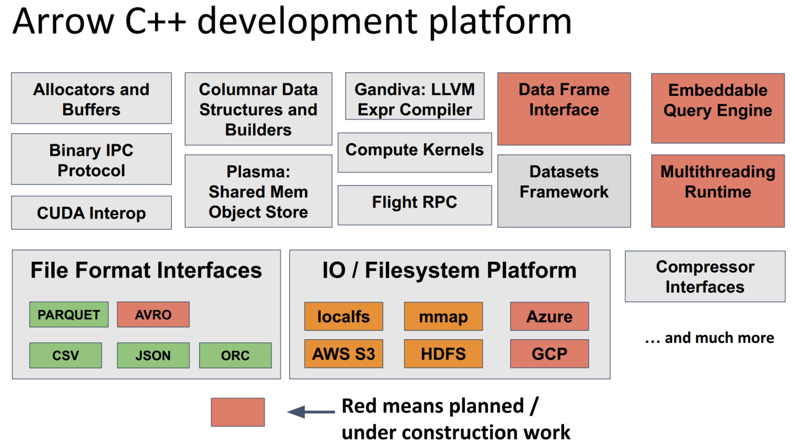
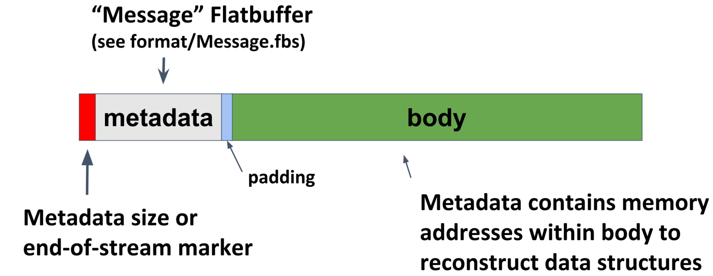
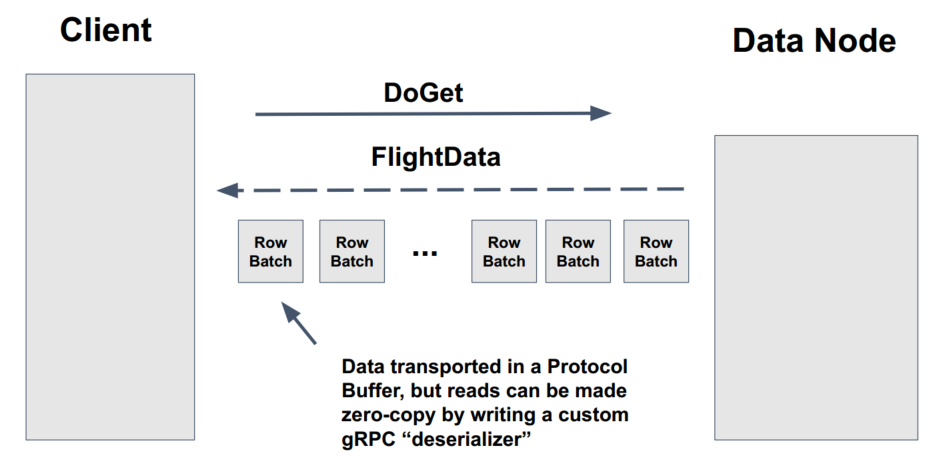

# Apache Arrow

[TOC]


说明：

Columnar  format在本文中被翻译为柱状格式、列存格式。

## 1. 整体

### **1.1 概念**

Apache Arrow 是一个跨语言的内存数据开发平台（内存分析），用于构建处理和传输大型数据集的高性能应用程序。它旨在提高分析算法的性能以及**将数据从一种系统或编程语言转移到另一种系统或编程语言的效率**。

Apache Arrow 的一个关键组件是其**内存中列格式**，这是一种标准化的、与语言无关的规范，用于表示内存中结构化的、类似表格的数据集。支持平面，或者嵌套的自定义数据格式。

它还提供计算库和零拷贝流消息传递和进程间通信。

官方提供了基于arrow规范的十多种语言（c++,java,rust,go）和系统的实现。




### **1.2 柱状格式（Columnar Format）**：

- 扫描和迭代大块数据时最大限度地提高效率
- SIMD向量化操作


### 1.3 **节省SerDe**

没有标准的列数据格式，每种数据库和语言都必须实现自己的内部数据格式，之前数据的相互联邦需要做昂贵的SerDe。还可能需要重写通用的算法（如果只是运算，这点感觉在SerDe成通用的数据类型如java object后，可以免除，但是代价是，必须经过SerDe后运算。这里应该是指原生系统而言，自己需要重复开发）。

Apache Arrow 由十多个开源项目开发者支持，包含 Calcite, Cassandra, Drill, Hadoop, HBase, Ibis, Impala, Kudu, Pandas, Parquet, Phoenix, Spark, 和 Storm等。

使用或支持 Arrow 的系统（目前更多的是为大数据分析系统OLAP）可以在它们之间以很少甚至免费的成本传输数据。

标准化的内存格式促进了**算法库的重用**，甚至可以**跨语言重用**。**跨系统的IO**。


### 1.4 **Arrow lib库**

Arrow 项目包含的库使能够以多种语言处理 Arrow 柱状格式的数据。


> Data as the ”new API“  ——McKinney


### **1.5 应用**

- nvidia RAPIDS open GPU Data Sience
- Pandas UDF
- google bigquery query results to DataFrame 31x fastrer 
- OLAP and data warehhousing ，influxDB IOx
- TiDB 参考arrow格式，实现自己的chunk的内部数据结构，用于减小内存分配开销、降低内存占用以及实现内存使用量统计/控制。（实际arrow官方也有go语言实现）
  - 只读
  - 不支持随机写
  - 只支持追加写
  - 列存，同一列的数据连续的在内存中存放


### 1.6 优缺点

Apache arrow 能够将原始磁盘的数据（parquet，csv，json格式）转换为可以高效（向量化）处理的内存格式，之后被不同的大数据计算引擎（spark，impala，drill）所使用，或者将arrow格式转换为具体的存储引擎的数据存储格式，写入到不同存储引擎，但是无SerDe开销。

但是，这种想法，这并非万能的银弹。

- 首先，目前支持的格式只是parquet，csv，json等格式，数据模型有限
- 另外，不同的系统，采用不同的数据模型，是各有其特点的，适配对应的计算引擎也会对其进行相应的优化，例如ES倒排索引，Hbase kv存储，图模型。


## 2. 组件介绍

### 2.1 列存的内存格式Columnar Format规范

Columnar Format包括与语言无关的内存数据结构规范、元数据序列化以及用于序列化和通用数据传输的协议。

使用 Google 的[Flatbuffers](http://github.com/google/flatbuffers)项目进行元数据序列化。

柱状格式有一些主要特点：

- 顺序访问（扫描）的数据邻接
- O(1)（恒定时间）随机访问
- SIMD 和矢量化友好
- 无需“指针混淆”即可重定位，允许在共享内存中实现真正的零拷贝访问

#### **2.1.1 术语**

- **Array**或**Vector**：具有相同类型的已知长度值序列。

- **Slot**：某个特定数据类型数组中的单个逻辑值。
- **缓冲区**Buffer或**连续内存区域**：具有给定长度的顺序虚拟地址空间。
  - 任何字节都可以通过小于区域长度的单个指针偏移量到达。
- **物理布局**：数组的底层内存布局，不考虑任何值语义。
  - 例如，32 位有符号整数数组和 32 位浮点数组具有相同的布局。
- **父**和**孩子数组**：名字来表达嵌套式结构物理值数组之间的关系。
  - 例如，一个`List<T>`-type 的父数组有一个 T 类型的数组作为它的子数组。
- **原始类型**：没有子类型的数据类型。
  - 诸如固定位宽、可变大小二进制和空类型等类型。
- **嵌套类型**：一种数据类型，其完整结构取决于一个或多个其他子类型。
  - 两个完全指定的嵌套类型相等当且仅当它们的子类型相等。
  - 例如，`List<U>` 和`List<V>`是不同类型，如果U 和V 是不同的类型。
- **逻辑类型**：使用某种相同物理布局实现的面向应用程序的语义值类型。
  - 例如，Decimal 值在固定大小的二进制布局中存储为 16 字节。同样，字符串可以存储为`List<1-byte>`。时间戳可以存储为 64 位固定大小的布局。


#### **2.1.2 物理内存布局**

数组由一些元数据和数据定义：

- 一种逻辑数据类型。
- 缓冲区序列。
- 一个64 位有符号整数的长度。实际实现限制为 32 位长度。
- 一个64 位有符号整数的 null 计数。
- 一个（可选）的**dictionary**，用于字典编码的数组。

嵌套数组还具有一组或多组这些项的序列，称为**子数组**。

每个逻辑数据类型都有一个明确定义的物理布局。以下是 Arrow 定义的不同物理布局：

- **原始类型（固定大小）**：一个值序列，每个值都具有相同的字节或位宽
- **变长二进制字节类型**：一个值序列，每个值都具有可变字节长度。使用 32 位和 64 位长度编码支持此布局的两种变体。
- **固定大小List类型**：嵌套布局，其中每个值都具有相同数量的取自子数据类型的元素。
- **可变大小List类型**：嵌套布局，其中每个值都是取自子数据类型的可变长度值序列。使用 32 位和 64 位长度编码支持此布局的两种变体。
- **Struct**：一个嵌套布局，由一组命名的子**字段**组成，每个子**字段**的长度相同，但类型可能不同。
- **稀疏**和**密集Union类型**：表示一系列值的嵌套布局，每个值都可以具有从子数组类型集合中选择的类型。
- **Null**：所有空值的序列，具有空逻辑类型

Arrow 列式内存布局仅适用于***data***而不是 *metadata*。实现可以自由地以任何方便的形式表示内存中的元数据。我们使用[Flatbuffers](http://github.com/google/flatbuffers)以独立于实现的方式 处理元数据**序列化**。


#### **2.1.3 缓冲区对齐和填充**

使用 64 字节对齐和填充。

- 将保证通过对齐访问来检索数字数组中的元素。
- 在某些架构上，对齐有助于限制部分使用的缓存行。


#### 2.1.4 有效性位图

除了联合类型（稍后会详细介绍），都使用专用的内存缓冲区，称为有效性（或“空”）位图，对每个值槽的空或非空进行编码。使用[最低有效位 (LSB) 编号](https://en.wikipedia.org/wiki/Bit_numbering)，数组长度为6，位图长度是以8字节分组（8,16,24,32...），从右到到左映射整个数组。

 计算是否非null：`is_valid[j] -> bitmap[j / 8] & (1 << (j % 8))`


#### 2.1.5 示例

- 原始类型int32的数组[1, null, 2, 4, 8]的布局：

```
* Length: 5, Null count: 1
* Validity bitmap buffer:

  |Byte 0 (validity bitmap) | Bytes 1-63            |
  |-------------------------|-----------------------|
  | 00011101                | 0 (padding)           |

* Value Buffer:

  |Bytes 0-3   | Bytes 4-7   | Bytes 8-11  | Bytes 12-15 | Bytes 16-19 | Bytes 20-63 |
  |------------|-------------|-------------|-------------|-------------|-------------|
  | 1          | unspecified | 2           | 4           | 8           | unspecified |
```

- 可变大小List类型数组List<Int8>，[[12, -7, 25], null, [0, -127, 127, 50], []]的布局：

```
* Length: 4, Null count: 1
* Validity bitmap buffer:

  | Byte 0 (validity bitmap) | Bytes 1-63            |
  |--------------------------|-----------------------|
  | 00001101                 | 0 (padding)           |

* Offsets buffer (int32)

  | Bytes 0-3  | Bytes 4-7   | Bytes 8-11  | Bytes 12-15 | Bytes 16-19 | Bytes 20-63 |
  |------------|-------------|-------------|-------------|-------------|-------------|
  | 0          | 3           | 3           | 7           | 7           | unspecified |

* Values array (Int8array):
  * Length: 7,  Null count: 0
  * Validity bitmap buffer: Not required
  * Values buffer (int8)

    | Bytes 0-6                    | Bytes 7-63  |
    |------------------------------|-------------|
    | 12, -7, 25, 0, -127, 127, 50 | unspecified |
```

List<List<Int8>>，[   [[1, 2], [3, 4]],     [[5, 6, 7], null, [8]],     [[9, 10]]  ]：

```
* Length 3
* Nulls count: 0
* Validity bitmap buffer: Not required
* Offsets buffer (int32)

  | Bytes 0-3  | Bytes 4-7  | Bytes 8-11 | Bytes 12-15 | Bytes 16-63 |
  |------------|------------|------------|-------------|-------------|
  | 0          |  2         |  5         |  6          | unspecified |

* Values array (`List<Int8>`)
  * Length: 6, Null count: 1
  * Validity bitmap buffer:

    | Byte 0 (validity bitmap) | Bytes 1-63  |
    |--------------------------|-------------|
    | 00110111                 | 0 (padding) |

  * Offsets buffer (int32) 偏移的个数比数组长度多1

    | Bytes 0-27           | Bytes 28-63 |
    |----------------------|-------------|
    | 0, 2, 4, 7, 7, 8, 10 | unspecified |

  * Values array (Int8):
    * Length: 10, Null count: 0
    * Validity bitmap buffer: Not required

      | Bytes 0-9                     | Bytes 10-63 |
      |-------------------------------|-------------|
      | 1, 2, 3, 4, 5, 6, 7, 8, 9, 10 | unspecified |
```

- Struct 数组Struct<VarBinary, Int32>，[{'joe', 1}, {null, 2}, null, {'mark', 4}]

```
* Length: 4, Null count: 1
* Validity bitmap buffer:

  |Byte 0 (validity bitmap) | Bytes 1-63            |
  |-------------------------|-----------------------|
  | 00001011                | 0 (padding)           |

* Children arrays:
  * field-0 array (`VarBinary`):
    * Length: 4, Null count: 2
    * Validity bitmap buffer:

      | Byte 0 (validity bitmap) | Bytes 1-63            |
      |--------------------------|-----------------------|
      | 00001001                 | 0 (padding)           |

    * Offsets buffer:

      | Bytes 0-19     |
      |----------------|
      | 0, 3, 3, 3, 7  |

     * Values array:
        * Length: 7, Null count: 0
        * Validity bitmap buffer: Not required

        * Value buffer:

          | Bytes 0-6      |
          |----------------|
          | joemark        |

  * field-1 array (int32 array):
    * Length: 4, Null count: 1
    * Validity bitmap buffer:

      | Byte 0 (validity bitmap) | Bytes 1-63            |
      |--------------------------|-----------------------|
      | 00001011                 | 0 (padding)           |

    * Value Buffer:

      |Bytes 0-3   | Bytes 4-7   | Bytes 8-11  | Bytes 12-15 | Bytes 16-63 |
      |------------|-------------|-------------|-------------|-------------|
      | 1          | 2           | unspecified | 4           | unspecified |
```

更多，参见[Arrow Columnar Format](https://arrow.apache.org/docs/format/Columnar.html)

缓冲区定义：


### 2.2 序列化和进程通信IPC

柱状格式序列化数据的原始单位是“记录批次record batch”。从语义上讲，一个记录批次是称为**字段**的数组的有序集合，每个字段的长度相同，但数据类型可能不同。

记录批次的字段名称和类型共同构成批次的**schema**。

- Schema
- RecordBatch
- DictionaryBatch


#### 2.2.1 封装的消息格式



它包括一个序列化的 Flatbuffer 类型以及一个可选的消息体。

- 一个 32 位连续指示符。该值`0xFFFFFFFF`指示有效消息。这个组件是在 0.15.0 版本中引入的，部分是为了解决 Flatbuffers 的 8 字节对齐要求
- 指示元数据大小的 32 位小端长度前缀
- 使用[Message.fbs 中](https://github.com/apache/arrow/blob/master/format/Message.fbs)`Message`定义的类型 的消息元数据
- 将字节填充到 8 字节边界
- 消息体，长度必须是8字节的倍数

```
<continuation: 0xFFFFFFFF>
<metadata_size: int32>
<metadata_flatbuffer: bytes>
<padding>
<message body>
```

`metadata_size`包括的`Message`大小加上填充。

`metadata_flatbuffer`

- 版本号
- 消息值（Schema`，`RecordBatch`或 `DictionaryBatch之一）
- 消息体的大小
- `custom_metadata`用于任何应用程序提供的元数据字段

消息类别（format/Message.fbs）：

- Schema消息
  - 有序的字段序列，类型元数据，不含有数据缓冲区。
- RecordBatch消息
  - 一个记录批次，对应一个字段的有序数组集合，具有被拉平的逻辑schema。
- DictionaryBatch消息
  - 使用字典编码的消息，消息带有字典id，根据字典id从schema中获取编码的字典，对照字典获取实际数据。


### 2.3 Flight RPC协议

基于 Arrow 数据的高性能数据服务的 RPC 框架，建立在[gRPC](https://grpc.io/)和[IPC 格式](https://arrow.apache.org/docs/format/IPC.html)之上。

Flight 定义了一组 RPC 方法，用于上传/下载数据、检索有关数据流的元数据、列出可用数据流以及实现特定于应用程序的 RPC 方法。

`FlightDescriptor` 数据流描述符标识，用来获取数据。可以自己构造或者`ListFlights`获取。

`GetFlightInfo(FlightDescriptor)`以获取`FlightInfo` 消息，其中包含有关数据所在位置的详细信息（以及其他元数据，如schma和数据集大小估计）。Flight 不要求数据与元数据位于同一服务器上。

`DoGet(Ticket)`以获取 Arrow 记录批次流。

`DoPut(FlightData)`并上传 Arrow 记录批次流。




### 2.4 库（如rust）

具体实现的库如rust包含的组件：

- 列存的数组/向量 和 类似表的容器(数据帧)，能够支持平面或嵌套的类型
- 快速、与语言无关的元数据消息传递层（使用 Google 的 Flatbuffers 库）
- 引用计数的堆外缓冲区内存管理，用于零拷贝内存共享和处理内存映射文件
- 本地和远程文件系统的 IO 接口
- 用于远程过程调用 (RPC) 和进程间通信 (IPC) 的自描述二进制线格式（流和批处理/类文件）
- 用于验证实现之间二进制兼容性的集成测试（例如，将数据从 Java 发送到 C++）
- 与其他内存数据结构之间的转换
- 各种广泛使用的文件格式（例如 Parquet、CSV，JSON）的读取器和写入器

Rust实现从arrow项目独立出来了，分别是[arrow-rs](https://github.com/apache/arrow-rs)（核心） 和 [arrow-datafusion](https://github.com/apache/arrow-datafusion) （DataFusion 和 Ballista组件）

四个箱子crate：

- Arrow： 核心功能，内存布局，数组，底层计算

- Parquet：支持parquet的读取和写入

- Arrow-flight：基于 gRPC 的协议，用于在进程之间交换 Arrow 数据

  - 特点：并行传输，允许数据同时流入或流出服务器集群

  - gRPC优化：

    - 生成 Protobuf 线格式以`FlightData`包含正在发送的 Arrow 记录批次，不需要中间内存复制和序列化
    - 从 Protobuf 表示重建 Arrow 记录批次， `FlightData`无需任何内存复制或反序列化

  - 基本请求类型： 

    - 握手，用于确定客户端是否被授权，在某些情况下，建立一个实现定义的会话令牌以用于未来的请求

    - **ListFlights**：返回可用数据流的列表

    - **GetSchema**：返回数据流的schema

    - **GetFlightInfo**：返回感兴趣的数据集的“访问计划”，可能需要使用多个数据流。请求可以指定参数。

    - **DoGet**：向客户端发送数据流

    - **DoPut** : 从客户端接收数据流

    - **DoAction**：通用函数调用，执行特定实现的操作并返回任何结果

    - **ListActions** : 返回可用操作类型的列表

      

  - 水平扩展：并行与分区数据访问

    - `GetFlightInfo` 请求，对数据集的客户端请求返回一个**端点**列表，每个**端点**都包含一个服务器位置和一张**票据**，用于在`DoGet`请求中发送该服务器 以获得完整数据集的一部分

    - 多断点模式好处：

      - client可以并行请求给所有端点

      - 端点角色可变，部分处理`GetFlightInfo`请求，部分只做DoGet和DoPut请求处理。

        

- DataFusion：支持SQL和DataFrame API的内存**查询引擎**，arrow作为内存格式，直译数据融合

  - DataFrame
    - 提供给用SQL不能，或者不能很好适合的分析负载处理系统
  - SQL支持（有完整tpch测试）
    - select语句
    - ddl （创建csv，parquet的外表），暂无insert，update，只能外表方式导入数据
    - 窗口函数functions
  - 优化器(只有逻辑优化，逐一重写sql的规则，输入是logicalplan，输出还是logicalplan)
    - 常量折叠（ColA && true → ColA ）
    - 谓词下推（filter，limit，project）
    - limit 0消除
    - join重排序（HashBuildProbeOrder）
  - 使用线程对分区数据源（CSV 和 Parquet）并行执行

- Ballista：分布式查询执行


#### 2.4.1 DataFusion  

Query Engine的通用架构：


DataFusion的架构


- 前端
  - SQLStatement
- 中间的查询表示
  - LogicalPlan
  - Expr
- 执行算子
  - ExecutionPlan
  - 输入/输出:RecordBatches
    - cols
    - schema


**Expr向量化计算**

eg：path = '/api/v2/write' OR path IS NULL  


**计划执行**

- 异步，避免阻塞 I/O
- 向量化，一次一个RecordBatch，可配置批大小
- 主动pull模式
- 分区，算子支持按分区进行并行处理（类似RDD风格）
- 多核
  - 异步任务


next方法（await 异步等待数据，让出cpu）


MergeStream会主动开始


#### 2.4.2 Ballista

分布式计算平台，与spark的巨大不同在于基于柱状格式的处理，具有arrow的优势，构成的底层技术：

- 用于高效处理数据的[Apache Arrow](https://arrow.apache.org/)内存模型和计算内核。
- [Apache Arrow DataFusion](https://github.com/apache/arrow-datafusion)查询计划和执行框架，由Ballista 扩展以提供分布式计划和执行。
- [Apache Arrow Flight 协议，](https://arrow.apache.org/blog/2019/10/13/introducing-arrow-flight/)用于进程之间的高效数据传输。
- 用于序列化查询计划的[Google Protocol Buffers](https://developers.google.com/protocol-buffers)。
- 用于打包执行器和用户定义代码的[Docker](https://www.docker.com/)。

Ballista 可以部署为独立集群，也支持[Kubernetes](https://kubernetes.io/)。在任何一种情况下，调度程序都可以配置为使用[etcd](https://etcd.io/)作为后备存储，以（最终）在调度程序失败的情况下提供冗余。

由于本质是对DataFusion的扩展，目前已经捐献给DataFusion，作为一个箱子。

rust目录，源码结构：

- client：对外的客户端

- core：核心类型，对象的定义（执行计划shuffleReader，shufflewriter，serde等）

- executor：执行器

- scheduler：任务调度器

  - 支持REST的请求，获取信息（如executors）
  - ui界面可查看`ui/scheduler`

  ballista 架构规划（当前还只实现了主体部分）:


**分布式查询计划器Distributed Query Planner：**

- 受spark的Adaptive Query Execution启发
- 查询分为多个阶段，其中每个阶段由具有相同分区的一系列运算符组成
- 分布式计划成为查询阶段的有向无环图（DAG）
- 每个完成的查询阶段都提供统计信息
  - 使能够基于统计信息重新优化剩下的查询阶段
- 数据需要在查询阶段之间“混洗”
  - 数据以 Arrow IPC 格式在执行器之间流式传输，当执行器位于同一位置或使用共享存储时，可优化直接从磁盘读取

**执行过程：**


与rust目录平行的，还有一个UI模块。


一个datafusion与spark的单点对比：[Rust Big Data Benchmarks - Andy Grove - 2019.10](https://andygrove.io/rust_bigdata_benchmarks/)

- DataFusion 性能非常一致
- DataFusion 只需 128 MB 即可运行这些基准测试，而 Spark 至少需要 1 GB
- 对于一次性查询，DataFusion 比 Spark 快
- 对于同一查询的重复运行，DataFusion 比 Spark 慢  （spark 受益jit优化？）
- 由于 JIT 的启动，Spark 性能随着多次运行而提高
- 由于 GC 暂停，Spark 性能也可能随着时间的推移变得不可预测


## 3.实现

### 3.1 数据结构

#### 3.1.1 Buffer

```rust
pub struct Buffer {
    /// the internal byte buffer.
    data: Arc<Bytes>,
    /// The offset into the buffer.
    offset: usize,
}
```

- buffer表示一段连续的不可变的内存区域，可以与其他buffer跨线程的共享。
- data
  - Arc类型，原子类型的指针指针，可以通过clone，获取引用，以共享缓冲区（但是不能修改），避免数据拷贝。
  - Bytes，结构体，存有原始指针，长度
- offset
  - 额外对这个缓存区的位置的指针
  - 因为使用的是共享缓冲区，原始整个共享的缓存区大小，起始位置是不能改变的，所以通过offset来调整当前缓冲区的所管理的数据位置。

```rust
// 一些方法
// 获取缓冲区，起始指针
pub fn as_ptr(&self) -> *const u8 {
    unsafe { self.data.ptr().as_ptr().add(self.offset) }
}
// 返回缓冲区的byte的切片（&[T]）
pub fn as_slice(&self) -> &[u8] {
    &self.data[self.offset..]
}
// 返回长度
pub fn len(&self) -> usize {
    self.data.len() - self.offset
}

// 根据Bytes创建新的缓冲区，缓冲区的大小，即Bytes的大小
pub fn from_bytes(bytes: Bytes) -> Self {
    Buffer {
        data: Arc::new(bytes),
        offset: 0,
    }
}

// 根据指针创建新的缓冲区
unsafe fn build_with_arguments(
    ptr: NonNull<u8>, // NonNull保证指针永远非null
    len: usize,
    deallocation: Deallocation,
) -> Self {
    let bytes = Bytes::new(ptr, len, deallocation);
    Buffer {
        data: Arc::new(bytes),
        offset: 0,
    }
}
```

#### 3.1.2 Bytes

```rust
pub struct Bytes {
    /// The raw pointer to be begining of the region
    ptr: NonNull<u8>,

    /// The number of bytes visible to this region. This is always smaller than its capacity (when avaliable).
    len: usize,

    /// how to deallocate this region
    deallocation: Deallocation,
}

// 创建Bytes
pub unsafe fn new(
    ptr: std::ptr::NonNull<u8>,
    len: usize,
    deallocation: Deallocation,
) -> Bytes {
    Bytes {
        ptr,
        len,
        deallocation,
    }
}
// rust标准库
//封装原始指针，具有永远非null特性
pub struct NonNull<T: ?Sized> {
    pointer: *const T, // 指向常量的原始指针
}
//创建NonNull指针
let mut x = [5,6,7];
// new方法接受一个可变对象的指针，然后检查其不是null，最后创建NonNull
let nonnull_pointter = NonNull::new(x.as_mut_ptr()).unwarp();
// 根据nonnull指针，创建slice
let slice - NonNull::slice_form_raw_parts(nonnull_pointer,3);
// 使用slice
assert_eq!(unsafe {slice.as_ref()[2]},7)
```

- 一个连续，固定大小，不可变的内存区域。被Buffer来共享
- ptr 
  - 永远非null的指针，即使永远不会被* 解引用
- len
  - 字节长度


### 3.2 数据类型


## 4.应用

### 4.1 pyspark enable apache arrow

问题：

 Spark 数据帧 API 在spark内部处理很快，但是当其从JVM 中移动到python进程时（spark将数据序列化为pickle格式，在driver端应用程序收集起来，然后python将其构造为Pandas数据帧），跨进程通信的SerDe成为巨大开销。

也即是，在python的进程中的执行UDF，运行很慢。无法将python生态的pandas的算法高性能的直接使用。（todo：pandas分布式执行框架modin；Dask； pandas on ray（基于arrow））


解决方法：

apache arrow。

在 JVM 中将数据转换为 Arrow 格式，然后发送到Python 进程直接使用。

Arrow 同时提供IPC进程通信机制，允许在套接字上读写，易于使用。

工作过程：

- 在executor端，将数据构造成arrow 的recordbatch格式
- driver端应用程序，调用arrow的库方法，将其直接转换为pandas数据帧


pandas数据帧转换为spark 数据帧时，也省去了原来需要遍历所有视为python对象的数据，逐一验证检查数据类型的操作。


处理免除serde，arrow在UDF使用上的优势：

- 向量化执行pandas定义的函数
- 分组映射的UDF （groupby  - apply）
  - 在jvm上分组分批传送到python


## REF

- [Apache Arrow官方](https://arrow.apache.org/overview/)
- [github: arrow](https://github.com/apache/arrow)
- [Apache Arrow 内存数据](https://www.cnblogs.com/smartloli/p/6367719.html)
- [Arrow Columnar Format](https://arrow.apache.org/docs/format/Columnar.html)
- [arrow-rs](https://github.com/apache/arrow-rs)
- [arrow-datafusion](https://github.com/apache/arrow-datafusion)
- [Ballista](https://github.com/apache/arrow-ballista)
- [arrow博客汇总](https://arrow.apache.org/blog/)
- [Apache Arrow Flight 简介：快速数据传输框架](https://arrow.apache.org/blog/2019/10/13/introducing-arrow-flight/)
- [Ballista：Apache Arrow 的分布式调度器](https://arrow.apache.org/blog/2021/04/12/ballista-donation/)
- [Ballista，一个用 Rust 和 Apache Arrow 制作的分布式计算平台](https://www.notamonadtutorial.com/ballista-a-distributed-compute-platform-made-with-rust-and-apache-arrow/)
- [DataFusion：Apache Arrow 的 Rust 原生查询引擎](https://arrow.apache.org/blog/2019/02/04/datafusion-donation/)
- [TiDB 源码阅读系列文章（十）Chunk 和执行框架简介](https://pingcap.com/blog-cn/tidb-source-code-reading-10/#tidb-%E6%BA%90%E7%A0%81%E9%98%85%E8%AF%BB%E7%B3%BB%E5%88%97%E6%96%87%E7%AB%A0%E5%8D%81chunk-%E5%92%8C%E6%89%A7%E8%A1%8C%E6%A1%86%E6%9E%B6%E7%AE%80%E4%BB%8B)
- [book: How query engines work (Ballista) - Andy Grove](https://leanpub.com/how-query-engines-work)
- [slides: arrow flight](https://www.slideshare.net/JacquesNadeau5/apache-arrow-flight-overview)
- [slides: InfluxDB IOx Tech Talks: Query Engine Design and the Rust-Based DataFusion in Apache Arrow](https://www.slideshare.net/influxdata/influxdb-iox-tech-talks-query-engine-design-and-the-rustbased-datafusion-in-apache-arrow-244161934?from_action=save)
- [slides: Ballista: Distributed Compute with Rust and Apache Arrow - Andy Grove](https://nyhackr.blob.core.windows.net/presentations/Ballista-Distributed-Compute-with-Rust-and-Apache-Arrow_Andy-Grove.pdf)
- [Rust Big Data Benchmarks - Andy Grove - 2019.10](https://andygrove.io/rust_bigdata_benchmarks/)
- [PySpark + arrow](https://spark.apache.org/docs/latest/api/python/user_guide/arrow_pandas.html)
- [arrow-integration-with-spark](https://www.dremio.com/webinars/apache-arrow-sf-meetup-may-2018-arrow-integration-with-spark/) 2018


