# ClickHouse-笔记

## 1. 架构

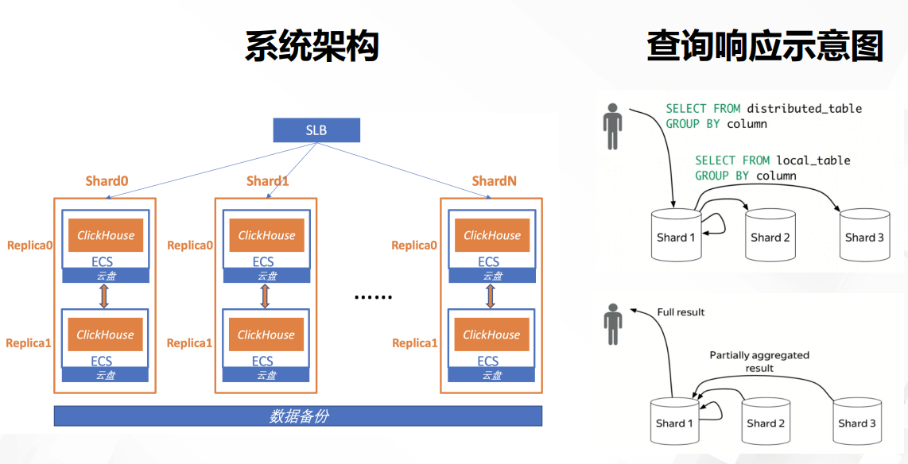

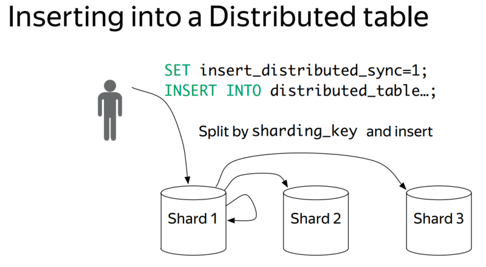

分布式表Distributed table

- 视图，逻辑概念，本身不存数据
- 对分布式表的操作，会查询所有的分片shards
- Distributed引擎做转发

缺点：

- 机制简单，只是满足查询，写，类似中间件的工作，新增节点，历史数据不会迁移，造成数据分布不均衡
- 汇总数据依赖单点，涉及大量数据交换时，可靠性不高
  - 本身是亚秒级场景，非大数据场景，无容错考虑，直接重启任务
    - （自动任务类型、时间判断？是否有必要容错模式）

## 2. 计算引擎

### 2.1 向量化执行

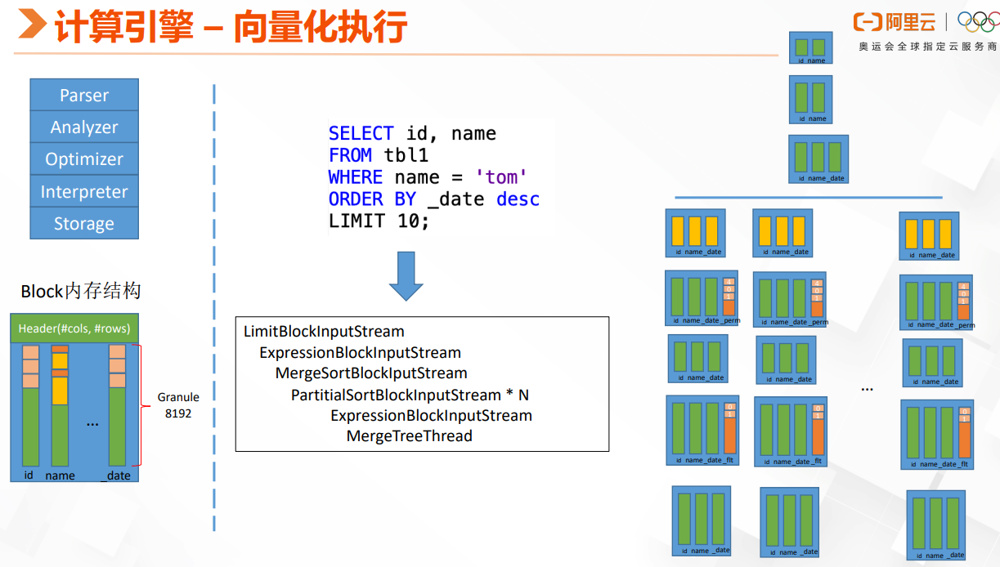

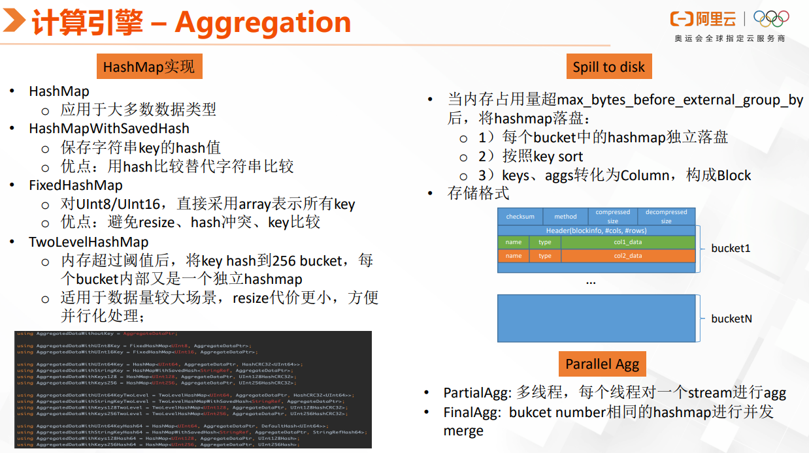

### 2.2 分布式执行

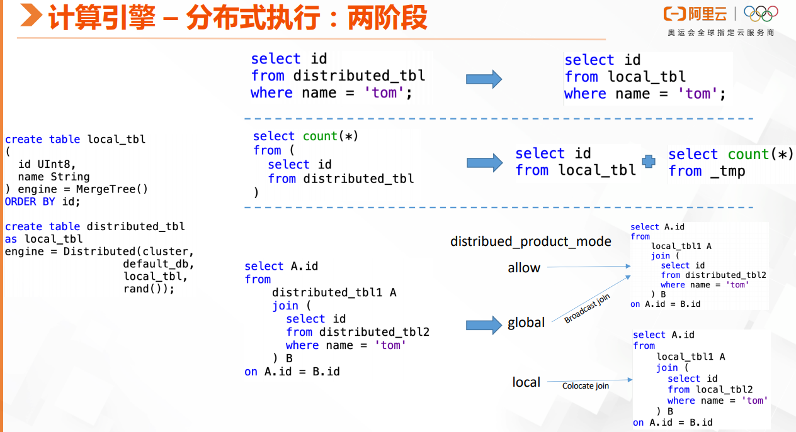

## 3. 表引擎

### 3.1 MergeTree

#### 3.1.1 原理 

MergeTree家族的表引擎是 ClickHouse 数据存储功能的核心。

提供柱状存储、定制分区、稀疏主索引、二级数据跳过索引等功能来保证CH的可扩展和高性能数据检索。

基本合并树表引擎是单节点 ClickHouse 实例的默认表引擎。其他MergeTree引擎是为某些特定用例添加了额外的功能。相对Log表引擎较重，如果是许多小表，例如用于临时数据，推荐使用Log表引擎。

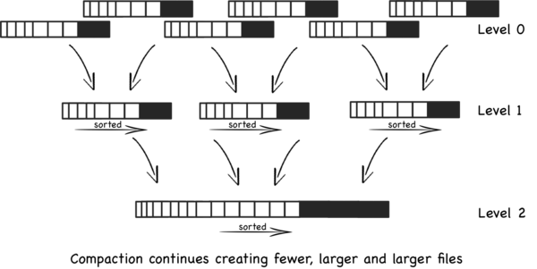

MergeTree 和 LSM 结构类似，可以解决随机写磁盘的性能问题，不过没有 MemTable 和 WAL。

- 设计用于快速插入
- 数据按照主键排序
  - Order by排序键（必选）
    - 再没有指定主键（可选）时，主键即为排序键
    - 主键可以与排序键不同，但是主键必选以排序键作为前缀
  - 每次写入根据数据分区形成一个个的 Parts 文件，Parts 内部有序，服务器后台不断地进行合并 Parts 来减少读放大。
  - 可以创建一个小型稀疏索引，更快的查找数据
  - 支持分区

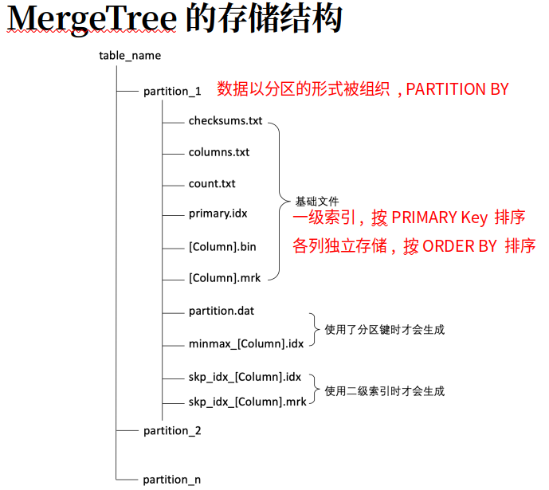

**合并树家族**（2*7）：

- ReplicatedMergeTree
  - 通过支持数据复制，保证高可用
    - 异步的master-master主主复制
    - 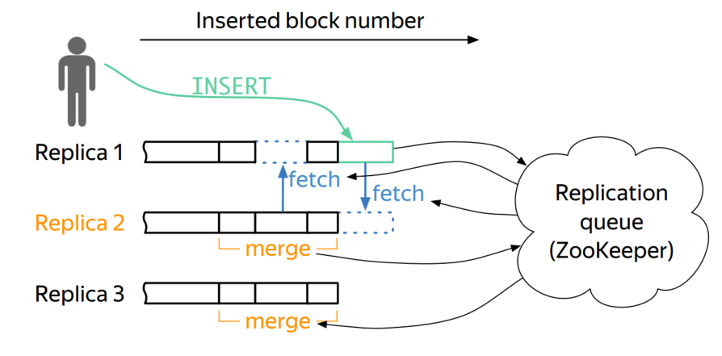
  - 可以和其他类型的MergeTree结合
- ReplacingMergeTree 替换合并树
  - 数据合并时，才会对排序键（注意是order by指定的列，而不是主键）进行去重
  - 不保证不存在重复数据
- SummingMergeTree 求和合并树
  - 当合并数据时，会把具有相同主键的记录合并为一条记录，聚合字段（数值类型）的值会汇总的值，非聚合字段使用第一条记录的值
- AggregatingMergeTree 聚合合并树
  - 合并时，在同一数据分区下，可以将具有相同主键（准确说是排序键）的数据进行聚合，存储。
- CollapsingMergeTree 折叠合并树
  - 合并时，删除（折叠）这些除了特定列 `Sign` 有 `1` 和 `-1` 的值以外，其余所有字段的值都相等的成对的行。没有成对的行会被保留。
    - `sign` — 类型列的名称： `1` 是«状态»行，`-1` 是«取消»行。
  - 数据折叠
    - 保存不断变化的数据，但是发生时更新，代价昂贵
    - 为了能快速写入数据，可以顺序的写入2行带有`sign` 列数据，删除旧行，增加新行。
- VersionedCollapsingMergeTree 版本折叠合并树
  - 基于 CollapsingMergeTree 引擎，增添了数据版本信息字段配置选项。
  - 允许以多个线程的任何顺序插入数据， `Version` 列有助于确定正确折叠行。
  - `CollapsingMergeTree` 只允许严格连续插入，以保证是正确的完成更新逻辑。
- GraphiteMergeTree
  - 存储Graphite数据，时序数据，并对数据做汇总

#### 3.1.2 主键索引

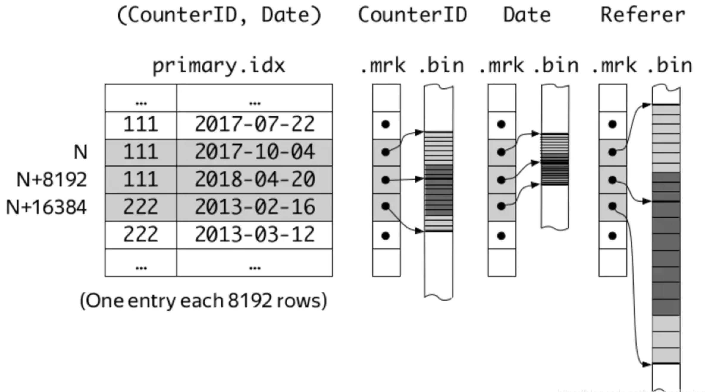

图表示，主键counterID列，Date列。单独存储，各自有.mrk,.bin文件

主键索引采用稀疏索引

- 按照 index granularity（默认8192行）进行划分
- 对稠密索引较少，能够将其加载到内存，建立索引的成本相对更小(kafka 日志索引文件也是稀疏索引)
  - 需要scan冗余的数据，所以点查询性能不够好
- 主键非唯一

列存储

- mrk 标记文件
  - 与主键索引对齐，数据在 bin 文件中的偏移量信息offset
- bin 文件
  - 数据文件
  - 按索引顺序排序
    - 插入时按主键排序
    - MergeTree保证每个部分文件都有序
      - 后台合并多个文件时，也保证文件内主键顺序

分区键索引：

分区内Data part的minmax，用于分区裁剪。

Skipping索引：

局部聚合的粗糙索（基于granularity，对每个Granule粒度计算如min，max的信息），常用的有minmax、set、bloom_filter、ngrambf_v1

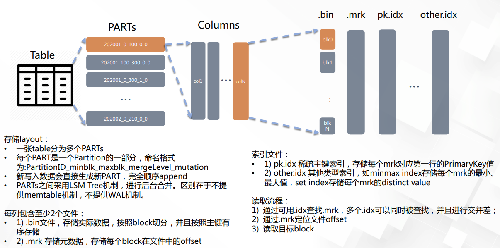

#### 3.1.3 查询

索引检索

- 提取出查询中的分区键和主键条件KeyCondition
- 先分区键裁剪数据分区
- 主键索引读取Mark Range
- 在用Skipping索引过滤Mark Range
  - 迭代分裂更细粒度的Mark Range，排除掉不满足条件的Mark Range
  - Mark Range到一定粒度时停止分裂

数据Sampling

数据扫描

三种不同的模式：

- Final模式
  - 该模式对CollapsingMergeTree、SummingMergeTree等表引擎提供一个最终Merge后的数据视图。
  - 异步Merge的过程，无法保证MergeTree的特性，在计算引擎增加数据处理逻辑
  - 在各个Data Part的多条BlockInputStream基础上套上Merge Stream，输入流可以是下面的sorted stream
- Sorted模式
  - order by下推存储的查询加速优化
  - 单Data part内有序，对各个Data Part的BlockInputStream上套一个做数据有序归并的InputStream实现全局有序
- Normal模式
  - 最常用，多个Data Part之间进行并行数据扫描，对于单查询可以达到非常高吞吐的数据读取。
  - 并行扫描
    - Data Part并行（数据文件间）
    - Mark Range并行（单个数据文件可以分配多个扫描线程）
  - 数据Cache
    - 不同数据有不同级别的缓存设计
    - 主键索引和分区键索引在load Data Part的过程中被加载到内存
    - Mark文件和列存文件有对应的MarkCache和UncompressedCache
      - MarkCache中缓存Mark文件中的binary内容
      - UncompressedCache中缓存的是解压后的Block数据
  - SIMD反序列化
    - 部分列类型的反序列化过程中采用了手写的sse指令加速
  - PreWhere过滤
    - 语法中增加preWhere过滤条件
    - 会先于Where条件进行数据过滤，减少每个Mark Range对应Granule中具体要扫描的行数

### 3.2 Log

### 3.3 数据访问块大小

一篇关于磁盘io性能的研究，数据访问特点，[io_uring、AIO 和现代存储设备之旅](https://clickhouse.tech/blog/en/2021/reading-from-external-memory/)

- **随机读取的最佳块大小是 HDD 256 KB，NVMe 和 SATA SSD 4 KB，英特尔傲腾 8 KB**
  - HDD
    - 小于256KB，寻道时间远大于数据传输时间，单次访问延迟一致，平均12ms
    - 不调大块大小，为了更好的提高缓存利用率。免cache冷数据
  - SATA SSD
    - 读取大小为 4 KB 的块平均需要 140 微秒，并且随着块大小的增加，时间增长呈线性。
    - 从 SSD 读取 4 KB 块的 HDD 相比，速度快 80 倍
    - 对于 256 KB 块，SSD 比 HDD 快十倍
    - 当块大小足够大（4MB）时，SSD 仅比 HDD 快两倍
  -  NVMe SSD
    - 延迟优于SATA SSD
    -  4 KB 的块大小，平均时间仅改善了一点，但 99 个百分位数要低两倍
    - 读1MB不到1ms，而STAT SSD 需要3ms
  - 英特尔傲腾Optane
    - 最小延迟为 12 微秒，比 NVMe SSD 低 10 倍（100us）。平均延迟比 HDD 低 1000
      - 小块(4kb)读取延迟有相当大的波动：即使平均时间非常低且接近最小延迟，但最大延迟甚至 99 个百分点都明显更差（接近100us）

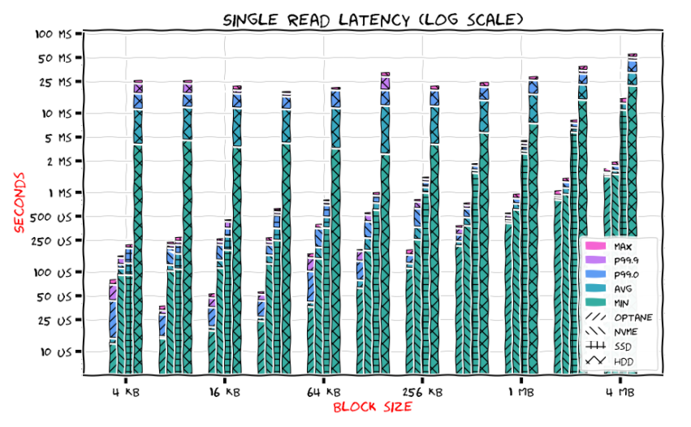

## 4. 最佳实践

- MessageBird 使用 pg+ clickhouse处理实时数据分析

  - clickhouse做存储，加单表的过滤查询
    - 虽然个人还是觉得异步复制的CH，高可用性还存疑?(日志同步机制)
  - pg做复杂的SQL分析

- clickhouse on kubernetes

  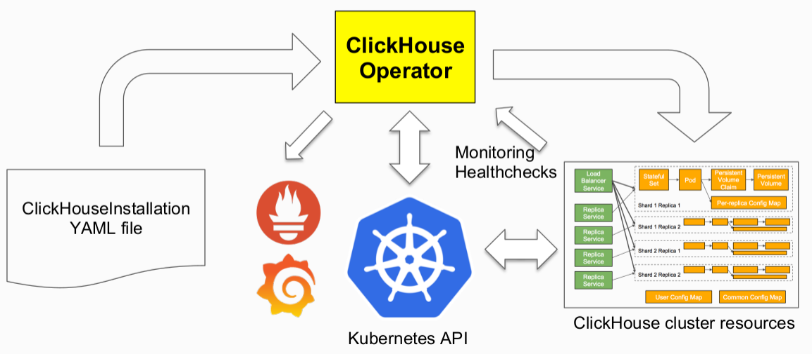

- SQLGraph：Graph process Engine + ClickHouse

  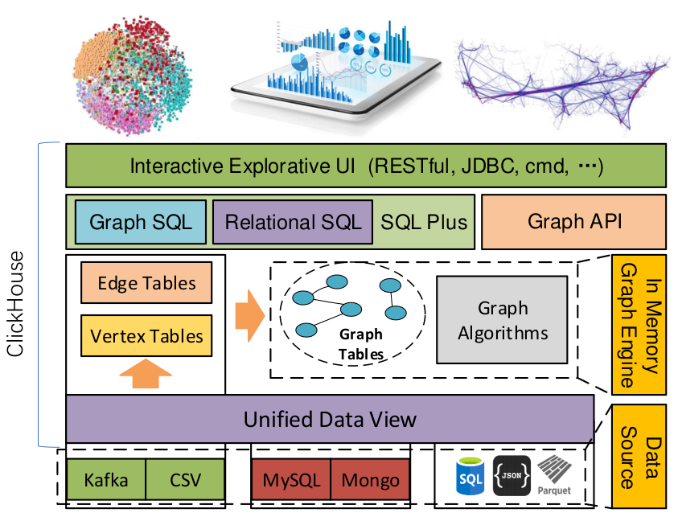

  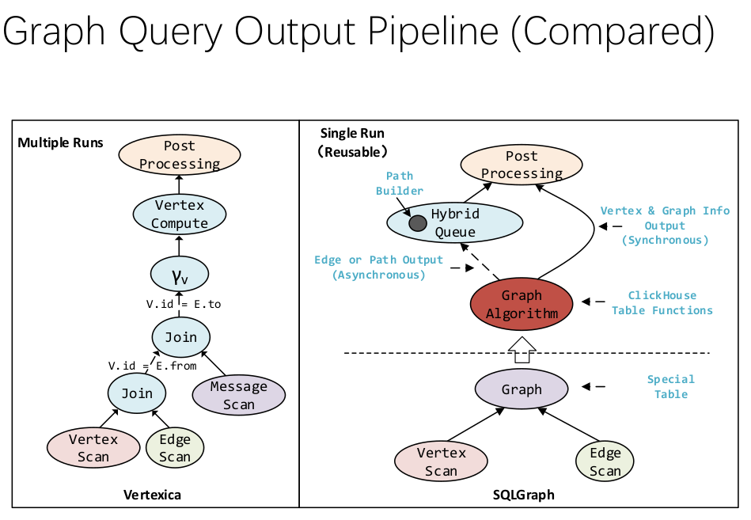

## 5. 用于构建可观测性系统

blogs:
  - [使用ClickHouse构建可观察性解决方案-第1部分-日志](https://clickhouse.com/blog/storing-log-data-in-clickhouse-fluent-bit-vector-open-telemetry)
  - [使用ClickHouse构建可观察性解决方案-第2部分-跟踪](https://clickhouse.com/blog/storing-traces-and-spans-open-telemetry-in-clickhouse) 
    - 使用OpenTelemetry来收集跟踪数据
  - [滴滴从Elasticsearch迁移到ClickHouse，打造新一代日志存储系统](https://clickhouse.com/blog/didi-migrates-from-elasticsearch-to-clickHouse-for-a-new-generation-log-storage-system)  
    - 峰值QPS约为200, 与Elasticsearch相比，查询速度提高了约4倍
    - 使用单独的Log和Trace集群, 防止日志上的高消耗查询（如LIKE查询）干扰跟踪上的高QPS查询
    - 日志 400个物理节点，峰值写入流量超过40 GB/s， 100MB/s 每个节点

  日志存储设计
  - 分区key：虽然大多数SQL查询只检索一个小时的数据，但按小时分区会导致HDFS中有太多的部分和大量的小文件。因此，分区是按天而不是按小时进行的。 
  - 排序键：为了快速定位特定小时的数据，通过将日志时间四舍五入到最近的小时来创建一个名为 logTimeHour 的新字段。然后将其用作主要排序键。由于大多数查询指定 odinLeaf 、 uri 和 traceid ，这些列分别用作第二、第三和第四排序键，基于它们从最小到最大的基数。这意味着查询特定 traceid 的数据只需要阅读少量的索引颗粒。通过这种设计，所有相等查询都可以在毫秒内完成。
  - Map列：引入Map类型是为了实现动态方案，允许将不用于过滤的列放置到Map中。这有效地减少了部分文件的数量，并防止在HDFS上出现大量小文件。

  跟踪表设计
  - AggregatingMergeTree：Trace表使用AggregatingMergeTree引擎，该引擎基于 traceid 聚合数据。这种聚合大大减少了跟踪数据的量，实现了5：1的压缩比，并显著提高了检索速度。
  - 分区和排序键：类似于日志表的设计。
  - index_granularity ：1024，减少此参数有助于最大限度地减少对颗粒内不匹配数据的扫描，从而加快“traceid”检索。

  跟踪索引表， 用于通过 order_id 提供快速查找 tace_id
  - AggregatingMergeTree
  - 分区和排序键：类似于日志表的设计
  - index_granularity ：1024

## REF

- ClickHouse原理解析与应用实战-朱凯
- [clickhouse 官方中文文档](https://clickhouse.tech/docs/zh/) 可下载
- [ClickHouse 在有赞的实践之路](https://tech.youzan.com/clickhouse-zai-you-zan-de-shi-jian-zhi-lu/)
- [大数据开发学习（Clickhouse）](http://guzhenping.com/2018/05/24/%E5%A4%A7%E6%95%B0%E6%8D%AE%E5%BC%80%E5%8F%91%E5%AD%A6%E4%B9%A0--Clickhouse/index.html)
- [适用于大数据的开源OLAP系统的比较：ClickHouse，Druid和Pinot](https://www.cnblogs.com/029zz010buct/p/12674287.html)
- [各个OLAP 引擎详细对比介绍](https://zhuanlan.zhihu.com/p/141145481)
- [官方一些presentations](https://github.com/ClickHouse/clickhouse-presentations)
  - [2018.1 北京 12th meetup](https://clickhouse.tech/blog/en/2018/clickhouse-community-meetup-in-beijing-on-january-27-2018/)
  - [2018.10 北京 meetup](https://clickhouse.tech/blog/en/2018/clickhouse-community-meetup-in-beijing-on-october-28-2018/)
- [ClickHouse 源码阅读 —— SQL的前世今生](https://developer.aliyun.com/article/765184)
- [ClickHouse 核心引擎 MergeTree 解读](https://www.infoq.cn/article/33p0kgzmhj2rffvycr44)
- [ClickHouse存储结构及索引详解](http://www.clickhouse.com.cn/topic/5ffec51eba8f16b55dd0ffe4) 文件结构，作用介绍
- [ClickHouse内核分析-MergeTree的存储结构和查询加速](https://developer.aliyun.com/article/762092)
- [ClickHouse内核分析-MergeTree的Merge和Mutation机制](https://developer.aliyun.com/article/762090)
- [阿里云数据库ClickHouse 架构原理和应用实践](http://developer.aliyun.com/live/43846?spm=a2c6h.12873581.0.0.51e8802fnoBH31&groupCode=clickhouse)
  - [slide-云数据库ClickHouse核心技术解析](https://developer.aliyun.com/topic/download?spm=a2c6h.12873622.0.0.229f7519vwaSZ1&id=841)
  - [slide-云数据库clickhouse最佳实践](https://developer.aliyun.com/topic/download?id=842) clickhouse表结构设计关联查询优化
  - [slide-ClickHouse在手淘流量分析应用实践](https://developer.aliyun.com/topic/download?id=843)

