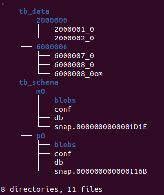

# TensorBase-笔记

## 1. 背景

[TensorBase](https://github.com/tensorbase/tensorbase)用开源的文化和方式，重新构建一个Rust编写的实时数据仓库，用于海量数据的存储和分析。


优点：

- All in Rust
  - 借助rust语言的高性能(c/c++)，无GC，内存、线程安全性。
- ClickHouse协议兼容
  - 用Rust实现了一个高性能的ClickHouse SQL方言解析器和TCP通讯协议栈
  - ClickHouse TCP客户端可以无缝连接TensorBase
- 基于Apache arrow-rs，DataFousion获取高性能分析能力。
  - 柱状的内存数据格式
  - 数据交换Copy-free，Rust语言机制带来的Lock-free，Async-free，Dyn-free
  - 项目外依赖减少（放到本地），以减少开发者重新编译时间


缺点：

- 还是起步的demo原型概念验证的阶段
  - 目前只是对于单表的聚合操作，相比clickhouse有明显的优势3X（并且数据完全加载进内存了，如果涉及磁盘读取，CH由于数据压缩，反而具有更好的性能，TB当前是原始数据）。
  - 之前在时间相关的函数处理上，会弱与CH，另外涉及列存个数的数据的shuffle，带有Join的SQL的性能是值得怀疑的。
    - TODO（CH，DataFusion的join原理）


## 2. 基本架构


- Base Server
  - 服务接口层，连接协议层，提供数据的写入和查询入口。（与clickhouse的Server层作用一致）
  - 基于改造的Actix事件循环，取代tokio默认async表达层的实现
- Meta/Runtime/Storage
  - 元数据层、运行时层和存储层
  - 存储层使用Partition Tree的数据结构，数据直接写入分区文件，不compaction
- Engine
  - 执行引擎层，使用改造过的Apache Arrow和DataFusion，免数据SerDe。
  - more [Apache Arrow 笔记](https://github.com/tianjiqx/notes/blob/master/big_data_system/Apache%20Arrow.md)
- 其他组件
  - base
    - 通用工具库
  - lang
    - 语言层，ClickHouse兼容解析和表示层
  - lightjit
    - 类表达式JIT引擎


[计划 issue114](https://github.com/tensorbase/tensorbase/issues/141)  和 [2021 夏季开源推广计划](https://github.com/tianjiqx/tensorbase/blob/main/docs/summer_2021_ospp.md)：

- 分布式集群。 

  - 基于DataFusion的Ballista，类ClickHouse的简易（半人工）分布式集群方案。已经完成。

- 存储层增强

  - 引入主键

- 查询引擎

  - Arrow和Data Fusion查询内核性能改进
  - TPC-H其他性能

- Server

  - MySQL协议支持
  - Clickhouse http协议增强

  

## 3. 使用

```shell
# debug 版本，(fast compilation but slow run),
# cargo run --bin server -- -c crates/server/tests/confs/base.conf
cargo run --bin server -- -c qxbase.conf
#（rust 编译确实太慢了，尝试支持multi statement，修改后，不清楚原理，有时依赖的公共包，依然需要重新编译）

# release 版本
cargo run --release --bin server -- -c crates/server/tests/confs/base.conf


# 连接
clickhouse-client --port 9528

```

测试sql：

```sql
create table employees (id UInt64, salary UInt64) ENGINE = BaseStorage
insert into employees values (0, 1000), (1, 1500)
select count(id) from employees
select avg(salary) from employees


show tables


-- join 测试 ,注意，当前部分关键字（列类型）大小写敏感，和clickhouse行为一致

create table employeeNames (id UInt64, name String) ENGINE = BaseStorage
insert into employeeNames values (0, 'Tom'), (1, 'Jack')
insert into employeeNames values (2, 'Jame')


-- bug: client崩溃，Server也崩溃，Exception on client:
-- Code: 32. DB::Exception: Attempt to read after eof: while receiving packet from -- localhost:9528
-- select count(1) from employeesName


select count(id) from employeeNames

select * from  employeeNames

-- 必须加inner
--  employees.id  nvalid identifier '#employees.id' for schema employees.employees.id,


-- Code: 7. DB::Exception: Received from localhost:9528. WrappingEngineError(WrappingDFError(Plan("Ambiguous reference to field named 'id'"))). Error during planning: Ambiguous reference to field named 'id'.

-- select id,name,salary from employees inner join employeeNames on employees.id = employeeNames.id


-- Code: 7. DB::Exception: Received from localhost:9528. WrappingEngineError(WrappingDFError(Plan("Invalid identifier '#a.id' for schema a.salary, b.name"))). Error during planning: Invalid identifier '#a.id' for schema a.salary, b.name.

-- select a.id,name,salary from employees a inner join employeeNames b on a.id = b.id

-- Code: 7. DB::Exception: Received from localhost:9528. WrappingEngineError(WrappingDFError(Plan("Invalid identifier '#a.id' for schema a.salary, b.name"))). Error during planning: Invalid identifier '#a.id' for schema a.salary, b.name.

-- select name,salary from employees as a inner join employeeNames as b on a.id = b.id


-- Code: 7. DB::Exception: Received from localhost:9528. WrappingEngineError(WrappingDFError(Plan("Invalid identifier '#employees.id' for schema employees.salary, employees.employees.id, employeeNames.employeeNames.id, employeeNames.name"))). Error during planning: Invalid identifier '#employees.id' for schema employees.salary, employees.employees.id, employeeNames.employeeNames.id, employeeNames.name.

-- select name,salary from employees inner join employeeNames on employees.id = employeeNames.id

-- Code: 7. DB::Exception: Received from localhost:9528. WrappingEngineError(WrappingDFError(Plan("Ambiguous reference to field named 'id'"))). Error during planning: Ambiguous reference to field named 'id'.

-- select name,salary from employees inner join employeeNames on id = id


drop table employeeNames


create table employeeNames ( employeeId UInt64, name String) ENGINE = BaseStorage
insert into employeeNames values (0, 'Tom'), (1, 'Jack')
insert into employeeNames values (2, 'Jame')

insert into employeeNames values (3, null)


select count(employeeId) from employeeNames

select count(*) from employeeNames

-- 会将 name为null的统计，right？
select count(name) from employeeNames

-- 直接写null 插入的结果为''
select * from  employeeNames
select * from  employeeNames where name=''


insert into employeeNames(employeeId) values (4)

-- bug: 插入 NULL值后 查询卡死
select * from  employeeNames
select name from employeeNames


-- 成功
select employeeId from employeeNames 


select name,salary from employees inner join employeeNames on id = employeeId


select * from employees inner join employeeNames on id = employeeId
┌─id─┬─salary─┬─employeeId─┬─name─┐
│  1 │   1500 │          1 │ Jack │
└────┴────────┴────────────┴──────┘
┌─id─┬─salary─┬─employeeId─┬─name─┐
│  0 │   1000 │          0 │ Tom  │
└────┴────────┴────────────┴──────┘
2 rows in set. Elapsed: 0.015 sec. 
-- 展示没有融合数据在一起，是因为独立计算展示的吗？


select id,name,salary from employees inner join -- xxx ;
employeeNames on id = employeeId;

select id,name,salary from employees inner join employeeNames on id = employeeId


-- 测试有分区键的表
create table employees_partby_id (id UInt64, salary UInt64) ENGINE = BaseStorage PARTITION BY id
insert into employees_partby_id values (0, 1000), (1, 1500)
insert into employees_partby_id values (2, 1000), (3, 1500)
insert into employees_partby_id values (4, 1000), (5, 1500)
insert into employees_partby_id values (6, 1000), (7, 1500)

-- 观察到分区数等于id数

select count(id) from employees_partby_id
select avg(salary) from employees_partby_id


-- 其他
-- unit test中给出了一个分区表达式是 PARTITION BY mod(uuid, 100000)，预先分配10w个分区，根据uuid随机分配到任意分区。

```


## 4.  源码分析

环境配置：

IDEA2021.1 + rust 插件 


代码版本2021.07.15：

commit id ：`c39cc0adc2ce46474f6addbc7f4bf2e16788df7d`


- 1） RUN/DEBUG配置:

run --bin server -- -c qxbase.conf

> qxbase.conf 是拷贝server/tests/confs/base.conf，修改内meta_dirs，data_dirs配置


建议现在本地 cargo build完成编译，避免idea 执行build，导致内存不足而卡死。

注意，社区版不支持debug方式运行！


- 2) 使用 [GDBUI](https://github.com/cs01/gdbgui)  进行调试 

使用Attach to Process模式，Ubuntu 20.04，直接下载二进制的gdbui包。

```shell
# 1. 运行TensorBase (debug)
cargo run --bin server -- -c qxbase.conf

# 2.clickhouse client连接
clickhouse-client --port 9528


#3. sudo权限下启动gdbgui， 非root权限可能导致无法attach上
sudo ./gdbgui_0.13.2.2

#4. 打开gdbui的web ui地址：http://127.0.0.1:5000/
# a.设置attach to process  pid为TensorBase的进程
# b.点击运行
# c. 打开文件crates/runtime/src/read.rs，设置点击行断点， 使用clickhouse client执行查询SQL
#   该文件是处理查询逻辑
```


### 4.1 SQL执行流程

- `crates/server/src/server.rs` 
  
  - 读取配置信息
  - 初始化读`    READ.get_or_init(|| query);` 和写`WRITE.get_or_init(|| write_block);` 数据的方法
    - SyncOnceCell::new() 保证是全局唯一函数对象？
  - 启动http服务器
  
- `crates/server/src/lib.rs` 

  - `runtime::ch::messages::response_to;` 消息处理，读取read_buf，写查询结果到write_buf
  - response_to处理完毕，检查write_buf不为空时，将数据（例如查询结果）flush到目标流

- `runtime/src/ch/messages.rs` client消息处理逻辑

  - `response_to`  

    - `ClientCodes::Query`  查询类型消息，进入`response_query`处理逻辑

      - 核心进入`crates/runtime/src/mgmt.rs` 的`run_commands` 方法执行查询

        - `run_commands`  当前只处理一条语句，返回一个`BaseCommandKind`

          虽然语法解析器本身`BqlParser::parse(Rule::cmd_list, cmds)`支持解析出多条语句。

- `crates/runtime/src/mgmt.rs`

  - 读取配置文件，创建`BaseMgmtSys`服务
  - `BaseMgmtSys`实现了各种命令的在`run_commands` 方法处理
    - 创建、显示、删除数据库、表，desc 表，truncate 表
    - insert into 语句
      - `command_insert_into` insert 语句处理
        - `InsertIntoContext.parse`() 将`Pair<Rule>`中信息填进InsertIntoContext
        - `command_insert_into_gen_block`  ，插入数据封装进`Block`
          - 暂时不支持部分列，个人测试ok，可能columns解析问题，不过读取异常
          - 根据建表的列顺序插入值
          - 会行转列格式，封装进Column   `runtime/ch/blocks.rs`
            - name 列名
            - BaseChunk 存储列数据（很类似Apache Arrow结构）
              - 类型
              - 大小
              - 字节数据
              - null值的数组Vec<u8>  ，bitmap
              - 偏移数组Vec<u32>
              - lc_dict_data 字典？ Vec<u8>
        - `command_insert_into_select` select...insert into 语法处理
          - BaseCommandKind::Query 执行子查询
            - 注意会跳转到`runtime/src/ch/messages.rs` 的`response_query()` 方法处理
              - `crates/runtime/src/ch/blocks.rs` 的Block类的encode_to方法，将数据填充进`BytesMut` 类型的缓冲区（实际是BaseSrvConn的write_buf）中
                - `Column.encode()`  逐列编码
            - `StageKind::DataEODPInsertQuery` 
            - `StageKind::DataPacket`  insert into 处理数据包
              - `process_data_blk` 预处理数据（例如消息有压缩，则解压缩），"拷贝"到read缓冲区
                - 如果没有压缩，拷贝实际是切片
              - `blk.decode_from(bs)` 将数据解码为Block格式
              - WRITE 对象写数据Block
                - `write_block()` `crates/runtime/src/write.rs`
          - BaseCommandKind::InsertFormatSelectValue 将子查询结果插入数据库
    - query（select）语句
      - 先`parse_table_place` 解析表的位置，目前只支持local表
        - `READ`: `SyncOnceCell<T> ` 封装的读取方法，会跳转到`crates/runtime/src/read.rs`的`query`函数
          - `SyncOnceCell<T> `  rust lazy 初始化 同步原语。表是只能写一次
          - 类似的有WRITE

- `crates/runtime/src/read.rs`
  
  - `query`函数，执行`crates/engine/src/lib.rs`的`run`函数
    - `parse_tables`  `crates/lang/src/parse.rs` 解析表TablesContext
    - `datafusions::run` 调用datafusion执行
      - `crates/datafusion/src/execution.context.rs` 的`sql`方法，执行SQL然后创建数据帧
        - `crates/datafusion/src/execution.context.rs`  `create_logical_plan` 创建逻辑计划
        - `crates/datafusion/src/execution.context.rs` 的`optimze`方法 做逻辑优化
        - `crates/datafusion/src/execution.context.rs`  `create_physical_plan` 创建物理计划


### 4.2 模块解构

#### 4.2.1 元信息 `crates/meta`

- `MetaStore` 元信息存储对象 `crates/meta/src/store/sys.rs`
  - 磁盘物理路径`.../tb_schema/m0`
  - 使用到的库sled（雪橇）
    - 嵌入式数据库，类似BTreeMap功能，支持插入kv，点查询，前缀范围查询，当前四棵树（0，1，ts，cs），使用到lsm-tree？
    - 优势是无锁树，领拷贝读取
    - 0存储名字与id的映射，1存储名字(id与名字的映射，数据库，表，列名)， ts表示表信息，cs表列信息
      - 表信息： 建表脚本cr，引擎en，分区表达式pa，分区列pc，setting信息（大概类似属性，以se开头），存储时加上tid作为前缀拼成key( Vec<u8>类型)，value以字节方式存储
- `PartStore` `crates/meta/src/store/parts.rs`
  - Partition Tree分区树，存储和管理分区数据的元信息
  - Column Partition列分区信息`CoPaInfo`，简写Copa，列存，数据按列管理
    - 内存地址addr
    - 内存地址addr_om ?
    - 大小size: usize
    - 字节大小len_in_bytes
  - 磁盘路径`.../tb_schema/p0`
  - 当前也是四棵树（ps，pt，pr，l），加上 存储数据路径字符串数组（测试配置只有一个数据目录，如果有多个数据目录，会根据ptk散列，获取数据路径）
    - `tree_part_size`分区大小ps， tid,ptk  -  size， tid,ptk都是u64,part_size是usize
    - `tree_parts`分区pt， cid,ptk -  siz_in_bytes: usize， Copa大小信息
    - `tree_prids`prid？ pr, 也是一份分区总行数， tid,ptk - part_size     usize 大小
    - `tree_locks`表锁l， tid - :IVec
  - 核心方法
    - `get_prid_int_ptk` 根据tid,ptk,reserved_len，CAS更新分区行数(tree_part_size)
      - 可能为了后面可以并行插入单个分区?
    - `set_copa_size_int_ptk` 根据tid,ptk,part_size 更新行数。（insert覆盖，tree_prids）
      - 一个分区，插入全部完成后，更新的行数
        - （实际插入数据时是先更新行数，之后才落盘，有一点危险)
      - 如果后面支持事务，倒是可以回滚插入的行数
      - 检查到`engine/src/datafusions.rs` 会用`fill_copainfos_int_by_ptk_range` 用到了`tree_prids` 读取的行，或许这个表/树是为了不影响读写不用加锁？
    - `insert_copa_int_ptk` 插入cid,ptk - siz_in_bytes 更新分区列文件长度 （tree_parts）
    - `get_copa_siz_in_bytes_int_ptk` 参数cid,ptk，获取分区列文件长度（tree_parts）
    - `get_part_dir` 获取分区的路径（用户配置的数据目录路径）
      - 直接散列，感觉配置后，导致无法再修改
    - `fill_copainfos_int_by_ptk_range`
- `BaseMgmtSys`  系统信息提供对象
  - `crates/runtime/src/mgmt.rs`
  - 静态变量，`BMS`， lazy加载
  - 读取配置文件初始化
  - 持有`MetaStore`  和`PartStore`，分区表达式函数指针的映射？(tid -  :SyncPointer<u8>)，时区信息
    - 这块涉及到分区表达式的计算，用到ligthjit模块


#### 4.2.2 写数据

 `crates/runtime/src/write.rs`

- 入口`write_block`
  - `MetaStore.get_table_info_partition_cols()` 根据表id（tid_pc）获取分区键信息ptks（HashMap<u64, Vec<(u32, u32)>>类型）
    - 注意，建表时，未指定分区列时，直接创建`0, vec![(0, (blk.nrows - 1) as u32)]` 也就是只有一个分区ptk=0
    - 
  - `gen_parts_by_ptk_names` 创建一个分区的HashMap<u64, Vec<(u32, u32)>
    - 先根据分区列列名获取分区列索引ptk_idx 
      - （这里看起来只支持单列的分区，这里分区键是等同是主键？如果数据分区不是按内部自己增的rowid，而是按照真实数据主键列，那么对于事实表的分区划分，是否可能会导致数据分布不均？）
    - `BaseMgmtSys.get_ptk_exps_fn_ptr` 获取分区表达式函数指针
    - 根据列类型，转换原始Vec[u8]类型的数据为实际类型的字节数组`cdata_ptk`，如Vec[u16]，Vec[u32] 通过`gen_part_idxs`生成分区数据索引HashMap<u64, Vec<(u32, u32)>>
      - 对于Block的每一行，都会调用分区函数`ptk_expr_fn`计算所属的分区id（ptk）
      - key： ptk， `ptk_expr_fn(cdata_ptk[j]), j是行idx`， 根据下面value的填充，会多行共用，在根据后面写parts前，检查不能超过1000，应该是分区标识分区id， `ptk_expr_fn` 应该是一个分区函数，接收行号，转为分区id。这只是内存中，一次写Block的分区划分，Block大小，看注释，假定不能不超过4G。（更新：已确认ptk就是分区id，u64）
      - value： 元组数组Vec<(u32, u32)（插入该分区的行的范围的数组）
        - 第一次初始化（数组为空），push 元组(行号:u32，行号:u32)，
        - 第二次插入，条件匹配，如果是连续的（前一行也是插入到这个分区），修改元组(第一次行号:u32，第二次行号:u32)，插入前检查是否连续。闭区间。否者插入一个新的单行范围的元组，之后插入该分区的数据，使用最后一个元组重复次过程。
  - 循环迭代parts，调用`write_part/write_part_locked(有大字段类型，String)`  写分区数据（一个分区，实际一个文件，单线程（单线程更好？），实际可以并行，不过可能是更新元信息，当前不好导致不好并发，或许封装CAS操作，更新分区大小）
    - `PartStore.get_part_dir(ptk)` 获取分区数据目录(xxx/tb_data)
      - 配置多块数据目录时，可以将数据按分区散列到不同的目录
    - `ensure_table_path_existed` 确保分区路径存在，创建目录
    - `PartStore.acquire_lock(tid)?`  加表锁
      - 很简单，死循环尝试加锁
      - 注意，`tree_locks` 表锁树，每次重启时会clear，用于处理遗留的锁
    - `PartStore.get_prid_int_ptk(tid, ptk, pt_len)` ， pt_len为此次插入的分区行数(Vec<(u32, u32)>范围求和)
      - `PartStore.tree_part_size.fetch_and_update()` 会从分区元信息中获取旧的分区行数，加上pt_len
        - u32(4 294 967 296)， 会导致有插入次数限制？每次插入，假设有1000个分区，这里分区函数怎么设置。如果有高频插入，即使每次只有1个分区，也只能插入42亿次？
          - 后续检查数据文件路径，多次插入，始终分区ptk为0
        - 
    - 逐列，插入数据
      - `get_part_path(tid, cid, ptk, dp)` 获取分区路径 
        - 表单独一级目录
        - 列id_分区ptk 作为一个文件名 例子：`tmp/tb_data/6000006/6000007_0,tmp/tb_data/6000006/6000008_0`
      - `open_file_as_fd` 根据路径名打开文件描述符
      - `gather_into_buf` 拷贝数据到缓冲区，合并Vec<(u32, u32)>的数据
        - 循环`copy_nonoverlapping`,虽然是个循环，但以目前看只有一个元组
      - `dump_buf()`  刷数据到文件（fd，文件偏移量，长度，buf），落盘
        - `libc::fallocate()`
        - `libc::pwrite()`
        - `libc::close()`
        - 对于字符串列，会额外增加一个_om的列文件，dump_buf两次
        - 文件偏移offset_in_bytes=prid * ctyp_siz;
          - prid 表示总行数，ctyp_siz为定长大小的列类型（数据没有压缩）
      - `PartStore.release_lock(tid)` 释放表锁
        - 实际就是覆盖写0
      - `PartStore.insert_copa_int_ptk`  更新分区列文件大小
    - `PartStore.set_copa_size_int_ptk` 更新分区数量大小（目前看起来，应该一直只是+1）

**总结**：

TB写数据的文件组织设计，目前非压缩，最大的级别单位是Block，Block下面分成Part，分区可以根据配置，写到不同的目录（不同磁盘ok，节点？如下图的tb_data），分区下面是表级目录（id，如2000000），表级目录下面是一个个该分区的列文件（2000001_0，构成tid，列id，下划线，分区键（或者id）ptk，如果在同一个目录下，不同分区的分区列文件应该形如`2000001_1`）。om文件目前是String列的数据。




插入数据的时候，未设置分区键，将只有一个分区，一直追加分区列文件。

- `tree_part_size` 记录了每个分区列文件的行数，用于计算分区列文件的大小
  - `get_prid_int_ptk` 在落盘前获取并CAS更新表分区行数`tree_part_size` 
  - 之后逐列追加分区列文件数据
  - 根据行数prid和列类型大小，计算出分区列文件的起始偏移
    - 这里的偏移地址，为什么不用`tree_parts` 中的地址呢？这才是真实落盘的大小，如果写文件突然被kill，下次获取prid将不正确，暂时没有看到有修正此prid机制
      - 或许可以考虑，`tree_prids` 中表分区的行数，修正`tree_part_size`中的行数。手动运维判断？
  - `insert_copa_int_ptk` 在所有的分区列文件数据完成落盘后，更新`tree_prids` 中表分区的行数
- `tree_parts` 存储每个分区列文件的当前大小
  - 分区列文件数据落盘后更新
    - insert方式，如果并发写一个分区列文件，可能导致大小不正确，不过有加锁机制，保证获取到的位置是正确的，并且单线程写分区列文件
  - 所以这里其实可以忽略插入失败情况，应该是先插入数据后更新行数？
    - `insert_copa_int_ptk` 是在每个分区列文件落盘后更新文件大小

在TB的架构设计说明：

> 在存储层，TensorBase非经典的列式存储。这其中最重要的，我们给出了一个反重力设计：No LSM。我们不再使用在目前开源数据库及大数据平台流行的LSM Tree（Log Structured Merge Tree）数据结构。而是使用一种我们自己称之为Partition Tree的数据结构，数据直接写入分区文件，在保持append only写入性能的同时，避免了LSM结构的后续compact开销。得益于现代Linux内核的支持和巧妙的写入设计，我们在用户态（User-space）核心读写链路上不使用任何锁（Lock-free），最大程度的发挥了高并发网络服务层所提供的能力，可以提供超高速数据写入服务。

当前不支持update，delete操作，也没有唯一主键。适用于一次性写，然后分析。

后续，可能考虑存储引擎，类似CH，折叠树。在计算引擎层，做数据的合并。

TB当前的这一个存储引擎`BaseStorage`不维持主键顺序，也没有什么排序键，单个分区文件也不会保证有序，看起来还是非常的原生态。没有任何索引，应该对点查询不够友好（本身OLAP，点查询到不是重点），但是缺少文件的统计信息，索引文件，没办法做任何的过滤，减少读取的磁盘数据，需要在内存中做过滤。更适合面向中小数据规模的全内存分析。（RAMCloud）

TB利用的Apache Arrow格式，实际上支持字典编码，压缩数据。

不过，考虑未来可以增加其他更复杂引擎，适应其他负载。（存储引擎层都还未成为独立的模块），

或者支持直接读写CH的存储文件能够扩展更多的应用场景。


#### 4.2.3 读数据

 `crates/runtime/src/read.rs`

- `query()` 入口
  - 调用`crates/engine/src/lib.rs`的`run`函数
    - `parse_tables`  `crates/lang/src/parse.rs` 解析表TablesContext
    - 
    - `datafusions::run` 调用datafusion执行（`crates/engine/src/datafusions.rs`）
      - `crates/engine/src/datafusions.rs`
        - `setup_tables`  将TB的表信息、数据注册到DataFusion，作为内存表使用
          - `gen_arrow_arraydata`生成 arrow格式的数据
      - `crates/datafusion/src/execution/context.rs` 的`sql()`方法，执行原始SQL然后创建数据帧
        -  `create_logical_plan` 创建逻辑计划
          - `DFParser::parse_sql(sql)` 解析sql成DFStatement
          - `SqlToRel.statement_to_plan(&statements[0])`  处理DFStatement，转成逻辑计划
            - `DFStatement::CreateExternalTable` 外表
            - `DFStatement::Statement` 标准SQL语句->`sql_statement_to_plan()`
              - `Statement::Query` ->  `query_to_plan()` 
                - `crates/datafusion/src/sql/planner.rs`
                  - `crates/datafusion/src/sql/planner.rs` `create_relation` 创建relation 算子 LogicalPlan::TableScan
        -  `optimze`方法 做逻辑优化
          - 逐一应用逻辑优化规则`OptimizerRule`
        - 创建`DataFrame` 结构df，封装了逻辑计划
          - `DataFrame`  本身还是一个逻辑计划
        - `crates/engine/src/datafusions.rs` `df.collect().await` 创建物理计划，并执行，异步等待结果Vec<RecordBath>
          - `crates/datafusion/src/execution/context.rs``create_physical_plan` 创建物理计划
            - `PhysicalOptimizerRule` 物理优化规则
          - `crates/datafusion/src/physical_plan/mod.rs` 异步函数`collect()` 执行计划
            - 这里会根据数据是否被分区（datafusion的分区概念）包装plan一个`MergeExec` 算子，合并多个结果到一个单分区
              - `plan.execute(0).await` 调用物理计划的`execute` 方法
                - 顶层物理算子，递归拉去下层算子的输入流进行处理。
                  - `crates/datafusion/src/physical_plan/hash_join.rs` hashJoin 算子
                  - `crates/datafusion/src/physical_plan/filter.rs` filter 算子，批量过滤
                  - `crates/datafusion/src/physical_plan/source.rs` source 算子，数据源
                    - `crates/datafusion/src/datasource/memory.rs` TB使用MemTable 作为数据源类型 `scan`
  - 将查询的结果放进Vec<Block> 中返回。
    - `Block::try_from()`  `crates/runtime/src/ch/blocks.rs` 转换arrow格式的`RecordBatch` 为`Block`


总结：

TensorBase的读数据的流程，实际上自身先解析一次sql，获取表信息，需要投影的列，然后将参与的表全部加载进内存，作为datafusion的数据源。datafusion会再次解析sql，完成诸如 filter，join等逻辑，数据源来自于之前setup进内存的表。

对于这种提供数据源的方式，需要将数据完全加载进内存才行，后续其实可以提供，类似datafusion自己带的csv，parquet文件格式的读取。


## REEF

- [TensorBase](https://github.com/tensorbase/tensorbase)
- [开源产品 | TensorBase，基于Rust的现代化开源数据仓库](https://rustmagazine.github.io/rust_magazine_2021/chapter_4/tensorbase.html)

