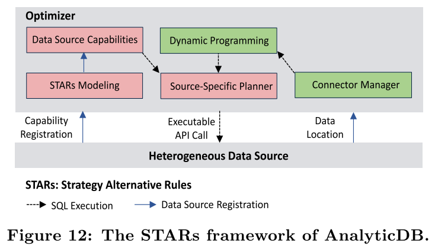

# AnalyticDB 笔记

## 1. 背景

ADB的挑战/问题：

- 实时分析
  - 在线化和高可用
- 数据规模
  - PB级别的分析负载，万级表数量，万亿级数据量
- 复杂查询
  - 全表扫描、点查、多表关联、多条件组合
  - 混合负载
    - 数据加工处理
    - **高并发、低延时**的交互式查询
- 复杂数据类型
  - 文本、json串、向量和其他多媒体资源的快速检索
  - 融合分析
- 高写入吞吐
  - 低延迟查询时，同时每秒数百万行在线写入请求

ADB主要创新：

- 高效索引管理
  - 异步的方式维护所有的列索引
  - 基于运行时过滤比的索引路径选择
- 存储结构
  - 混合行列的数据布局
  - 支持OLAP，点查询
- 读写分离架构
  - 读节点和写节点，独立扩容
  - 版本验证机制
- 存储感知的SQL优化器和执行引擎
  - 向量化执行

性能：

100万亿行记录，10PB+大小

10m+ w  100k+ r /s 

亚秒级的复杂查询。

## 2. 系统设计

- Pangu 分布式存储系统
  - 写节点会将写请求的数据刷到盘古上进行持久化
- Fuxi 资源管理和作业调度
  - 计算任务的异步调度执行
- ADB
  - JDBC/ODBC接口
  - Coordinator 协调者
    - 接收客户端查询请求，并分发到读写节点
    - （看起来不止一个，识别查询类型，转发任务，但是根据根据后面内容，也负责读节点任务调度，会是扩展性瓶颈？）
  - 写节点（计算）
    - dml
    - 单个主节点，其余未从节点，之间使用Zookeeper通信
      - 主节点决定每个节点负责哪些一级分区
    - log
      - 写SQL语句
      - 一定规模后，在fuxi启动MR任务，将log数据转换成真实存储数据+索引
  - 读节点（计算）
    - select
    - 每个读节点独立负责某些一级分区的数据
    - 读过程：
      - 读取pangu最新版本数据（包括索引）+ 写节点的内存buffer中将写请求log周期性地拉取过来，replay
      - 可见级别
        - 实时
          - 版本校验机制
            - 发送查询请求到协调者，协调节点线写节点获取最新版本，并将查询和版本发给读节点，读节点比较已经replay的版本号，落后时拉取版本replay后再查询。
            - 性能较差
        - 延时（默认）
          - 不查询最新版本号，依据读节点自己replay的结果查询，可能是旧数据

读写分离：

- 避免资源竞争
  - 哪些资源？（cache？）

表分区：

- 一级分区
  - 节点
  - 分区键：高基数（cardinality）的列
  - 二级分区
    - 节点内的分区
    - 具有最大分区数
    - 分区键：时间列（天、周或月）

可靠性：

- 写节点
  - 从节点失效，主节点将其负责的一级分区，均匀分配给其他正常从节点
  - 主节点失效，选举新主
  - 写节点只是计算节点，其失效，不影响数据持久性和读节点查询数据
    - log数据持久化在pangu
    - 写节点失效，读节点从pangu拉取log数据
      - 不一开始直接从pangu拉log，写节点的log数据在内存中，同步延迟更低
- 读节点
  - 用户可以指定读节点的副本个数（默认为2）
  - 读节点失效，协调节点将请求自动发到其他副本

扩展性：

- 写节点加入
  - 主节点调整一级分区分配，进行负载均衡
- 读节点加入
  - 协调者调整一级分区分配，进行负载均衡

多租户：

同一个集群部署多个ADB实例。

使用linux CGroup技术对不同AnalyticDB实例进行资源隔离（CPU核、内存、网络带宽）。

## 3. 存储

lambda架构：基线数据和增量数据

Detail是明细数据，来自于写入节点的日志数据。

### 3.1 写入和查询过程

Delete：bitset标记被删除的行。

Update：DELETE + INSERT

利用COPY-ON-WRITE，进行MVCC。

多个版本的bitset，允许正在允许的查询使用旧版本的delete bitset，读写互相不阻塞。

查询

### 3.2  数据合并

增量数据没有索引，随数据量增长而查询性能下降。

后台，伏羲启动MapReduce 任务，合并基线数据和增量数据成新的基线数据，和其索引。

- 将增量数据引擎标记为immutable，并创建新的增量数据引擎，接受实时写入数据
- 合并基线数据和immutable增量数据
- 等待所有旧查询结束，删除老基线数据和immutable增量数据

### 4.3 存储数据结构

为了支持高并发的插入，点查询和OLAP查询，ADB使用缓和行列存储。（大批量的数据导入呢）

每个表分区的数据都维护在一个单一的文件中（detail file）。

内部分为多个行组，每个行组包含固定行数（生产环境默认为30000，是可配置的）

一个行组中，同一列的所有值是连续存储，作为一个数据块。

数据块是ADB中基本的操作单元（拉取和缓存）。

OLAP查询：

取一整列，顺序IO，虽然需要扫描多个行组，但是查询延迟开销只占5%。

点查询：

查询的一行，在同一个行组中，不用跨整列查找。

（行，列存的tradeoff）

元数据：

AnalyticDB对每列构建一份元数据，保存在detail_meta的单独文件。（小于1MB）

首次查询时被加载在内存中。

- Header
  - 包括版本号，文件长度以及一些统计信息。
- 列统计信息
  - 包括行数，NULL值数，cardinality，SUM，MAX和MIN 值。
  - 优化器根据这些信息来生成最佳执行计划。
- 字典
  - 对于cardinality较少（小于1024）的列，AnalyticDB采用字典编码。
  - 数据文件里保存字典号码。字典保存在该字段中。
- 块地址信息
  - 保存块号到数据文件起始地址和长度的映射关系。

复杂数据类型：

- 长文本、JSON和向量数组等非结构化数据类型。
- 定长数据块（FBlock）组成Block
  - 32KB
    - （似乎有些太小）
  - 单独存储未一个文件，Block存储的数据是FBlock的块号和FBlock内的偏移位置

### 4.4 索引管理

B+树，中间节点过多，大量随机IO。

Druid的多列数据构建倒排索引，只能支持特定数据类型（字符串类型，不支持数值类型）。

构建索引，影响写入性能。

AnalyticDB的索引，支持结构化和非结构化数据类型，后台异步构建，支持对所有列构建索引。

(倒排)索引：

- key 列值
- value出现的行号集合

索引查询：

支持同时应用所有的条件。

优化：

- 多路流式归并
  - 支持多个集合并行归并，避免产生大量中间结果集合

- 索引选择CBO
  - 过滤率高的条件走索引查询，其他条件上层过滤。

- 索引结果缓存
  - 缓存过滤率高的索引结果。

复杂数据类型索引：

- json
  - 拉平为多个字段，为每个字段构建倒排索引
    - `{id, product_name, properties{color, size}}` -> `id, product_name, properties.color, properties.size`
  - PForDelta 压缩索引的row ids
  - 一个json对象的所有索引打包在一个单独的文件中，而非拉平的属性都有一个索引文件，限制索引文件个数
    - json对象可能有数千个属性
    - 普通数据类型，一列一个索引文件
- full-text
  - 存储更多的信息来扩展倒排索引
    - 词频、doc和term的映射
  - TF/IDF 相似度衡量
    - Term Frequency
    - Inverse Document Frequency
- vector data
  - 特征向量，for CV
  - 乘积量化 (PQ) 和邻近图 (k-NNG)

索引构建：

与写入流程分离。

数据合并，产生新的基线数据后，对新基线数据构建新的索引。

自适应索引存储格式（bitmap / integer array）

空间大小：

1T user data + 0.66T index data ， GP需要1T + 2.7 T 空间。

读节点的增量数据的轻量级索引：

通过有序数组，对增量数据进行二分查找。

条件索引缓存

key：查询条件

value： 查询结果 row ids

## 4. 优化器

- 基础优化规则
  -  裁剪规则：列裁剪、分区裁剪、子查询裁剪
  - 下推／合并规则：谓词下推、函数下推、聚合下推、Limit下推
  - 去重规则：Project去重、Exchange去重、Sort去重
  - 常量折叠／谓词推导
- join探测优化规则
  -  Joins：BroadcastHashJoin、RedistributedHashJoin、NestLoopIndexJoin
  - Aggregate：HashAggregate、SingleAggregate
  - JoinReorder
  - GroupBy下推、Exchange下推、Sort下推
- 高级优化规则
  - CTE 

### 4.1 存储感知的优化

执行下推。下推更多谓词。（不仅仅是单列，多列的过滤，下推function，join）

STARS（策略替换规则）框架

将异构数据源的执行能力按照关系代数的维度进行抽象，将存储的能力特征化为其所能处理的关系代数的能力。

利用动态规划的方式针对不同的数据源，将适合下推给存储执行的关系代数算子进行封装，转化为对应的存储的API调用。（基于代价）

- join下推
  - 避免数据重分布，选择重分布代价最小的计划
- 基于index的join和aggregation。
  - Join列是分区列且具有索引，避免bushytree

### 4.2 实时采样

查询驱动的动态统计信息收集机制：

- 根据查询工作负载和特点以提取其查询模式，并基于查询模式，分析缺失和有益的统计数据。

- 在此分析和预测之上，异步统计信息收集任务在后台执行。

## 5.执行引擎

MMP，流水线执行的DAG架构。

向量化执行引擎。

代码生成（CodeGen） ，基于ANTLR ASM来动态生成表达式的代码树。

整合内部数据表示形式，在存储层和执行引擎之间，AnalyticDB可以直接对序列化的二进制数据进行操作，而不是Java 对象。消除序列化和去序列化的开销，节省shuffle是的20%延迟开销。（apache arrow）

## 6. 实验

### 6.1 真实数据查询负载测试

测试sql：

1TB，三个查询，ADB最低延时（P50，P95），比其他系统至少快一个数据量级。

原因：

- Q1 scan
  - ADB有索引，下推order by和limit，实际不需要全表扫描
  - GP有索引，但是不能执行order by
  - Druid，建立范围分区，可以过滤部分数据，性能比GP好
- Q2 点查询
  - ADB，并行scan 3列的索引，缓存点查询的row ids，因此并发的后续查询，使用索引缓存结果
- Q3 多表连接
  - ADB，将join转为子查询，使用索引完成子查询，索引上应用order by，limit。
  - GP 构建hash表开销，ADB也使用hash join时，性能一致

数据量规模对ADB的影响很小，主要受制于索引的计算以及命中的行数。

Q3延时增长，是因为计算更多数据，高并发，频繁上下文切换导致性能下降。

### 6.2 写入吞吐

随着写节点数，增加而线性增长，直到pangu饱和。

单行，500B

10写节点，625K /s  * 500B  ~  300MB/s 

### 6.3 TPC-H测试

在TPC-H 的测试中，也时延也优于其他系统。

由于第二的GP，主要原因：

- 混合行列存储，GP是列存，而tpch中 涉及到一半的列
- 基于运行时的index成本，比GP使用统计信息更准确
- 谓词下推，k路归并
- 向量化执行引擎，CodeGen

## REF

- Zhan, C., Su, M., Wei, C., Peng, X., Lin, L., Wang, S., … Chai, C. (2018). AnalyticDB: Real-time OLAP database system at Alibaba Cloud. Proceedings of the VLDB Endowment, 12(12), 2059–2070. https://doi.org/10.14778/3352063.3352124
- [前沿 | VLDB论文解读：阿里云超大规模实时分析型数据库AnalyticDB](https://developer.aliyun.com/article/716784) 论文补充说明
- [VLDB 2019 笔记: AnalyticDB: Real-time OLAP Database System at Alibaba Cloud](https://www.jianshu.com/p/342a059af224)
- [Paper翻译 AnalyticDB Real-time OLAP Database System at Alibaba Cloud](https://changbo.tech/blog/e3ee66c7.html)
- [如何通过数据仓库实现湖仓一体数据分析？](https://mp.weixin.qq.com/s/Cy5UIpGg0oGxvU5nonM9CA)
- [关于AnalyticDB 3.0的调研和分析](https://blog.microdba.com/database/2020/01/15/about-aliyun-analyticdb-for-mysql/)

扩展阅读材料：

- [slides:Data warehousing in the cloud](https://bostonsql.org/wp-content/uploads/2017/04/2017-04-Dewitt.pptx)

