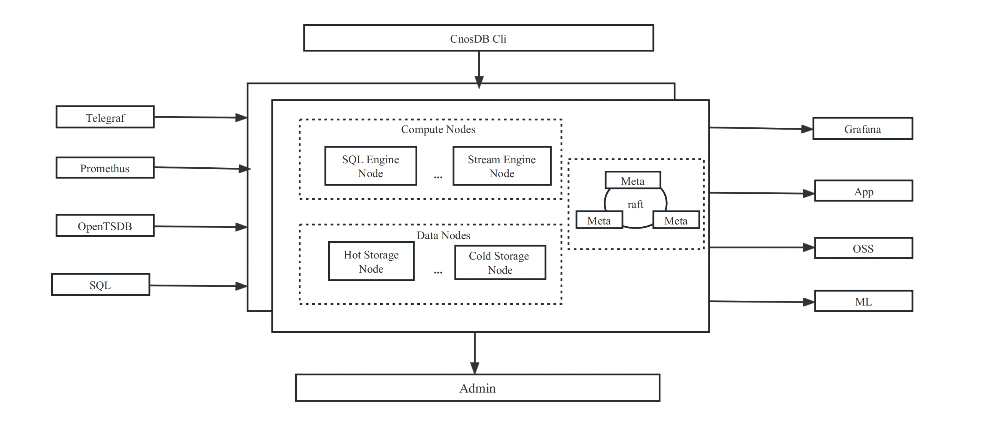
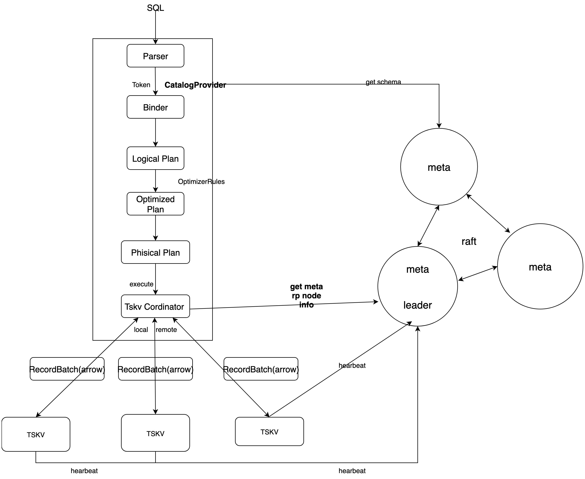
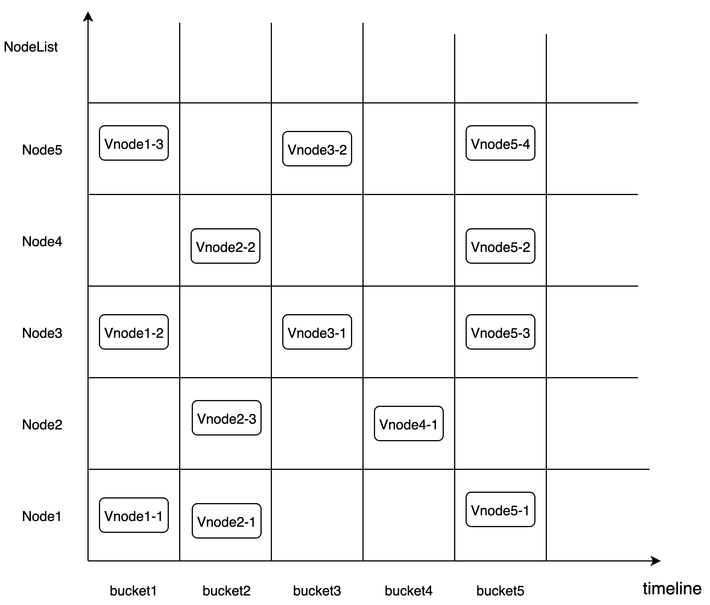
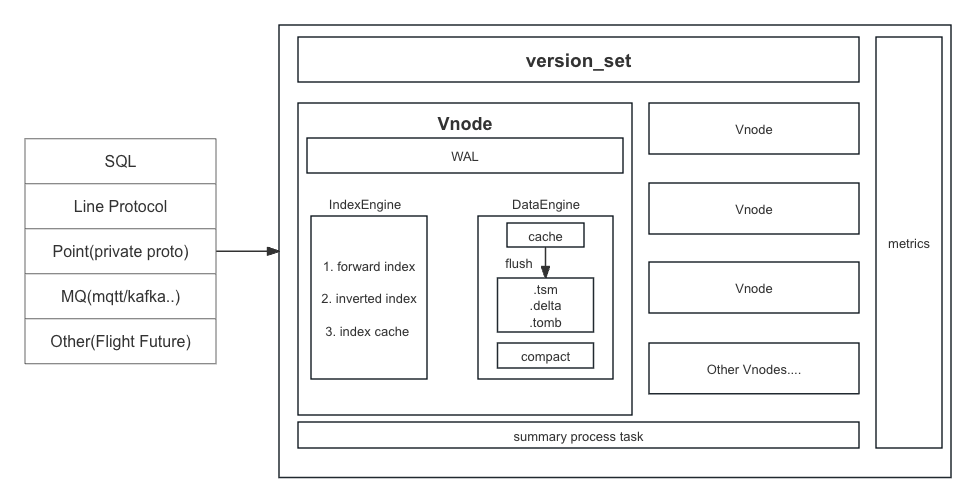

# CnosDB

## 介绍

## 设计

### 概念

- SeriesKey：由表名和多个 tag key-value 对组成
- SeriesID： 每个 Vnode 有一个从0开始的**自增变量 incr_id**，当某个 SeriesKey 第一次写入时，incr_id 自增加一，incr_id 的值代表这个 series 的 SeriesID

### 架构

- cnosdb meta 元数据服务
- Query：查询服务, 计算引擎
- Tskv：存储服务主要负责索引数据和时序数据的存储和数据读取过滤

云原生，更多在服务部署上，非存算分离架构，依然有WAL，Raft副本一致性等设计，只有分级存储，类似冷热温模式

### meta集群

基于raft

元数据存储
- 数据库 catalog 信息
- DDL操作资源管理
- 租户、用户信息与权限
- 数据分片与分布
- 集群节点信息

集群管理

- 节点探活
- 节点注册
- 分布式锁

变更通知
- Meta 存储信息的变更会异步通知到每个 CnosDB 节点
- 一致性要求较高的请求会透传到 Meta 集群请求一次数据

元数据的备份与还原

### 查询引擎

查询引擎使用了 DataFusion

### 数据分片

时间分片与Hash分片

- CnosDB 每隔一段时间创建一个 Bucket
- 按 SeriesKey 进行 Hash分片 可以分割成不同的 ReplicaSet（复制组），每个 ReplicaSet 内的一个副本称其为 Vnode，每个 Vnode 分散在不同的存储节点上

### 存储引擎TSKV

- TSKV 主要承担数据和索引的存储，对 Node 节点上所有 Vnode 进行管理
    - VNode 每个 Vnode 负责某个 Database 里的部分数据， LSM Tree， RaftNode
        - WAL
        - IndexEngine
        - DataEngine 

#### IndexEngine

功能
- 存储正排索引
- 存储倒排索引
- 缓存索引数据

索引数据结构
- HashMap<SeriesID, SeriesKey>：用于根据 SeriesID 获取 SeriesKey
- HashMap<SeriesKeyHash, SeriesID>: SeriesKeyHash 为 SeriesKey 的 hash 值，通过 SeriesKeyHash 获取 SeriesID。主要用于根据 SeriesKey 获取 SeriesID。
- HashMap<TableName, HashMap<TagKey, BtreeMap<TagValue, RoaringBitmap\<SeriesID>>>>: 倒排索引，根据给定的 TableName，以及 TagKey 和 TagValue 获取所有的 SeriesID。

类似influxdb设计，不过 SeriesKey 的膨胀问题，还是很容易导致内存问题，看起来是通过VNode做数据分治。

#### Compaction

- Flush
    - 将内存的 Memcache 按 series 切分
    - 将 DataBlock 编码转为 Chunk
    - 将 Chunk 写入 TSM 文件
- compaction
    - 合并小 tsm 文件
    - 清理已过期或被标记删除
    - 减小读放大

### 压缩编码

DELTA + zigzag + simple8b/RLE
- 时间戳，整型和无符号整型

GORILLA
- 浮点型

Pco
- 时间戳，整型，无符号整型以及浮点数

BITPACK
- 布尔类型

字符串压缩算法（通用）
- SNAPPY
- zstd
- GZIP/ZLIB
- BZIP

SDT压缩算法
- 有损
- 整型，无符号整型，浮点型

死区压缩算法
- 于整型，无符号整型，浮点型。
- 规定变量的变化限值（即死区，或称为阈值）

（PS：粗略看cnosdb的代码结构，文件内容，感觉很清晰，很舒服。哦，没有什么' 怪不得:D）

## REF

- [tskv 存储引起设计](https://docs.cnosdb.com/docs/reference/concept_design/tskv)