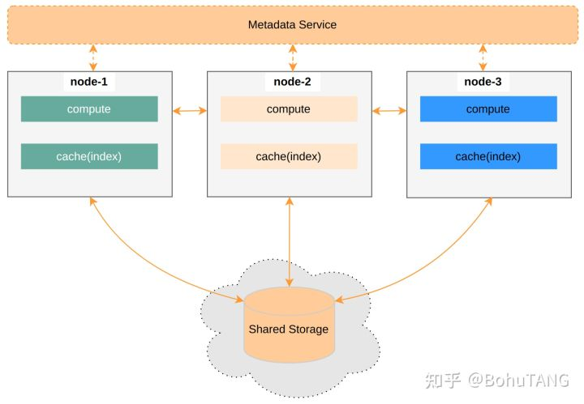
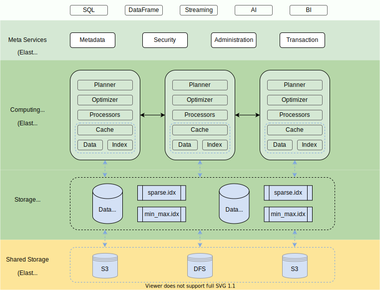

# DataFuse 笔记

[TOC]

## 1. 简介

Datafuse 是一个开源的**弹性**和**可扩展的**云数据仓库Cloud Warehouse，使用存储在云存储系统（例如 AWS S3 和 Azure Blob Storage 或其他）中的数据执行工作负载。

面向云环境的OLAP系统。最开始根据TensorBase作者的评价，以为对标的是rust的Clickhouse，但是根据最近Datafuse博客，它其实对标Snowflake，AWS Redshift。

特点：

- Rust语言编写
- 弹性，可扩展
  - 存储和计算资源可以按需动态扩展和缩减
  - 按资源付费
- 保护
  - 云环境，所有数据文件和网络流量都经过端到端加密
  - SQL级别基于角色的访问控制
    - K8S RBAC（Role-based access control）
- 支持MySQL，clickhouse 客户端

（PS：注意目前0.4.x版本， 一些特点可能还只是期望，或者实现中，无法用于生产）

Datafuse 对传统数仓架构的批评：

- Sharding Warehouse

  - 类似share nothing架构的，没有将计算和存储分离，不适合云环境（资源粒度控制）
    - (根据OB 的tpch测试报告，其也算是计算与存储分离，有专门的OFS文件系统作为其存储支持，ObServer节点只保留少量的的SSD)
  - 容易发生数据热点问题
  - 扩容，数据均衡，需要花费时间进行副本迁移

- Presto/spark + Shared Storage(AWS S3，Blob Storage)

  - 共享存储服务存在延迟、抖动问题
    - （OLTP型数据库要更重视这个问题，OLAP其实应该并不太需要在意才是）

  

  **设计理念**：

  Cloud Warehouse里的状态：

  - Persistent data
    - 用户数据，存储在Shared Storage
  - Intermediate data
    - 排序、join shuffle中间结果文件
  - Metadata
    - object catalogs, table schema, user 等元数据

  

  设计：

- 通过cache Shared Storage上的数据到计算层节点，避免网络抖动。

  - 失效，从S3查询，新增Latency抖动。
  - Snowflake 在计算和存储之间加了一个共享的Distributed Ephemeral Storage 存储Intermediate data
    - 资源隔离问题 （TODO：Distributed Ephemeral Storage简单搜索暂未找到说明，只VM 计算节点有cache模块，作者取名的吗）
    - Snowflake 使用的优势似乎是提供了强大的数据管理服务，开箱即用的数据湖，数据仓库
- Datafuse状态分离
  - 为Persistent data生成足够多的索引放到Metadata Service，计算节点进行订阅，更新本地cache
    - 海量索引块的同步
    - Persistent data 怎么处理？

## 2. 架构与设计

架构与Snowflake 架构图确实非常相似。

- Meta Services
  - 多租户、高可用的分布式 key-value 存储服务，支持事务
  - `Metadata` : 表的元信息、索引信息、集群信息、事务信息等
  - `Administration`：用户系统、用户权限等
  - `Security` ：用户登录认证、数据加密等
- Computing Services
  - 由多个集群（cluster）组成，不同集群可以承担不同的工作负载
    - 集群由多个节点组成
  - 执行计划 生成（Planner）
    - 处理SQL
  - 优化器（Optimizer）
    - 当前只有基于规则的优化
  - 处理器（processors）
    - 根据执行计划，处理器们被编排成一个流水线（Pipeline），用于执行计算任务
      - 是MR，不是MPP？
        - 分布式计划，使用了arrow-flight，应该会将shffle数据落盘
  - 缓存（cache）
    - 使用本地 SSD 缓存热点数据和索引
      - LOAD_ON_DEMAND - 按需加载索引或数据块（默认）。
      - LOAD_INDEX - 只加载索引。
      - LOAD_ALL - 加载全部的数据和索引，对于较小的表可以采取这种模式。
- Shared Storage
  - 存储格式
    - Parquet 数据文件，按主键排序
    - min_max.idx （整个文件的min max）, sparse.idx 索引文件
      - 学习clickhouse的存储设计
  - 文件系统（IFileSystem）抽象存储层
    - Local FS
      - 使用本地磁盘文件夹作为存储，单节点
    - DFS
      - aws-S3 的存储服务
    - Object Storage Adapters
      - 基于云上对象存储服务
  - 分布式文件系统 DFS
    - 元数据集群
      - 数据的位置信息
      - 每个节点都持有一份元信息的副本
        - raft组，大部分节点只是学习者，不参与选主
          - 学习tidb TiFlash？
    - 块存储集群
      - 提供读取，写入API

## 3. 实现

源码版本（2021.08.27）：

`72ec7e9cd5bc80849656b1a588cbca1ee43ededc`

### 3.1 源码结构

- cli
  - 命令行工具，用于datafuse的设置和管理
    - 查看帮助，版本管理
- deploy
  - datafuse 运行在K8S上的Helm的charts
- docker
  - docker image的构建脚本，支持多个平台（macos，linux）
- scripts
  - 编译代码、单元测试、安装、部署等的相关脚本
- website
  - 构建doc文档，的本地网站服务
- common
  - 公共模块源码定义
  - Datafuse 依赖的crate（如arrow）的声明
- query
  - 分布式查询引擎层
- store
  - 分布式存储层
- test
  - 集成测试，性能测试

### 3.1 元信息管理

###  3.2 查询引擎

- `query/src/bin/datafuse-query.rs` 入口
  - `mian()` 
    - `Config::load_from_args();` 加载配置参数
    - `Config::load_from_toml` 加载配置文件
    - `Config::load_from_env`  加载环境变量
    - `Cluster::create_global` 创建`Cluster` 对象
      - 集群信息，管理节点
    - `SessionManager::from_conf` 创建会话管理器
    - `ShutdownHandle::create` 停机服务
    - ` MySQLHandler::create` mysql 客户端请求处理
    - `ClickHouseHandler::create` clickhouse client 请求处理
    - `MetricService::create`  metric 服务
      - for prometheus
    - `HttpService::create` HTTP 服务
      - 集群、配置
    - `RpcService::create`  flight 服务
      - `DatafuseQueryFlightDispatcher` 查询的`FlightAction`分发器？
  - `query/src/servers/mysql/mysql_handler.rs` 
    - `MySQLHandler` mysql client 请求处理
      - `start()` 启动服务
        - `listener_tcp()`  监听tcp端口，默认3307
        - `listen_loop()` 循环处理监听到的socket请求
          - `accept_socket` 处理socket请求
            - `query/src/sessions/session.rs` SessionManager
              - `create_session` 创建会话
            - `MySQLConnection::run_on_stream(session, socket) ` 处理
              - 启动线程处理，` MySQLConnection::session_executor(session, blocking_stream);`
                - ` MysqlIntermediary::run_on_tcp(interactive_worker, blocking_stream) `
                  - `query/src/servers/mysql/mysql_interactive_worker.rs`
                    - `do_query` 处理查询语句

- `InteractiveWorkerBase::do_query`
  - `query/src/servers/mysql/mysql_interactive_worker.rs` or `query/src/servers/clickhouse/interactive_worker.rs`
  -  `query/src/sql/plan_parser.rs`语法解析 
    - `PlanParser.build_with_hint_from_sql()`  字符串转 `PlanNode` 树
      - PlanNode: `common/planners/src/plan_node.rs`
      - `DfParser::parse_sql(query);` 解析成`Statement`
      - `statement_to_plan` `Statement` 转 plannode
  - `InterpreterFactory.get(ctx: DatafuseQueryContextRef, plan: PlanNode) ` 根据计划，获取解释器
    - `SelectInterpreter` select 语句
      - `query/src/interpreters/interpreter_select.rs`
      - `execute()`
        - `schedule_query` 返回调度流`ScheduledStream` (`SendableDataBlockStream`)
          - `Optimizers.optimize` 逻辑优化
            - `query/src/optimizers/optimizer.rs`
          - `PlanScheduler.reschedule` 调度计划成local或者remote模式，stage（plan node） 转成task，返回Tasks
            - `query/src/interpreters/plan_scheduler.rs`
              - `visit_plan_node`  根据调度器的运行模式，处理节点，单点执行或者按分区进行并行执行
                - 后序遍历
                - 对于cluster mode，每个
          - `Tasks.get_tasks` 
            - 获取tasks中的`FlightAction`
          - 遍历action，并执行
            - `FlightClient.execute_action`
              - `query/src/api/rpc/flight_client.rs`
          - 构建pipeline，并执行，返回`SendableDataBlockStream`
            - `Tasks.get_local_task`  就是整个计划
            - `PipelineBuilder.build`
              - `query/src/pipelines/processors/pipeline_builder.rs` 
              - `visit` 后序遍历
                - `visit_read_data_source`   处理`ReadDataSourcePlan`，返回`pipeline`
                  - `SourceTransform::try_create` 创建数据源
                    - `SourceTransform` 实现了`Processor` trait
                    - `read_table` 读取数据，返回数据流`SendableDataBlockStream`
                      - `Table.read` tarit
                        - `MemoryTable`
                          - query/src/datasources/local/memory_table.rs
                        - `CsvTable`
                          - query/src/datasources/local/csv_table.rs
                        - `ParquetTable`
                        - `RemoteTable`
                          - `query/src/datasources/remote/remote_table.rs`
    - `InsertIntoInterpreter` 插入语句
      - `query/src/interpreters/interpreter_insert_into.rs`
    - `CreateTableInterpreter` 建表语句
      - `query/src/interpreters/interpreter_table_create.rs`
      - `execute()`
        - `DatafuseQueryContext.get_datasource`  返回`Arc<DatabaseCatalog>`
          - `query/src/sessions/context.rs`
        - `DatabaseCatalog.get_database` 获取数据库， `Arc<dyn Database> `
          - `query/src/catalogs/impls/database_catalog.rs`
        - `Database.create_table`
          - `query/src/datasources/database.rs`  tarit
            - 实现`SystemDatabase` 系统数据库， 系统库
            - 实现 `LocalDataBase` 用户数据库（只内存? 暂未看到持久化）
            - 实现 `RemoteDatabase` 用户数据库
              - `DBMetaStoreClient`  arrow_flight  rpc调用
                - `query/src/catalogs/meta_store_client.rs` tarit
  - 输出查执行结果
    - mysql: `query/src/servers/mysql/writers/query_result_writer.rs`
      - `DFQueryResultWriter.wirte`
    - clickhouse `query/src/servers/clickhouse/writers/query_writer.rs`
      - `QueryWriter.write()`

`PlanScheduler`  计划调度器

- `query/src/interpreters/plan_scheduler.rs`
- 作用将原单节点计划，根据分配的节点数量逐一生成要在对应节点执行的`PlanNode` 树的执行计划。
- 成员
  - `stage_id`  DAG的stage id
    - 遍历PlanNode树时，可能会增长
  - `cluster_nodes: Vec<PlanNode>`  集群所有的节点
    - （TODO，节点的加入和退出处理？）
  - `local_pos` 当前的节点在数组的位置
  - `nodes_plan: Vec<PlanNode>` 每个节点的计划根节点
    - visit是后续遍历，每次都会更新，所以最后持有的是每个节点待执行的root `PlanNode`
  - `running_mode` 计划的执行模式 local或者cluster
  - `query_context` 查询上下文
  - `subqueries_expressions`  子查询的语法树
- 成员方法
  - `try_create` 构造方法
    - 根据`context: DatafuseQueryContextRef` 查询上下文创建，并初始化
  - `reschedule()`  调度计划入口
    - `visit_plan_node()` 后序遍历处理输入的单节点计划PlanNode tree
  -  `visit_plan_node`
    - `visit_aggr_part` ，`visit_aggr_final` 等
    - stage,flightaction 相关
      - `visit_stage` cluster才有stagePlan
        - 产生新的stage id
        - `schedule_normal_tasks`
          - 产生`PrepareShuffleAction`
            - 包装`ShuffleAction`
          - 产生`PlanNode::Remote` 计划节点
            - 包装`RemotePlan`
        - `schedule_expansive_tasks`
          - 
        - `schedule_converge_tasks`

`Tasks`

- `query/src/interpreters/plan_scheduler.rs`
- 成员
  - `plan: PlanNode` 执行计划树根节点
  - `context: DatafuseQueryContextRef,`
  - `actions: HashMap<String, VecDeque<FlightAction>>,` 
    - k: 集群node名字
    - v：FlightAction 队列
- 方法：
  - `finalize` 设置最终的planNode
  - `get_local_task` 获取`plan` ，执行计划树根节点
  - `get_tasks` actions 相同内容，但是是Vec结构
  - `add_task` 添加 <nodename, flightaction>

`pipeline`

- `query/src/pipelines/processors/pipeline.rs`
  - 关键方法
    - `add_source`  添加一个数据源类型的 Processor 到头Pipe
    - `add_simple_transform` 在尾部添加一个新Pipe，其Processor的输入是原最后一个Pipe里的所有Processor
    - `merge_processor` 将最后的Pipe的多个Processor合并成一个Processor
    - mixed_processor 将最后的Pipe的多个Processor 混洗成指定n个Processor
  - 成员`Vec<Pipe>` 
    - Pipe 由`Vec<Arc<dyn Processor>>` 组成，包装类
      - 关键方法
        - `add` 添加Processor
      - Processor 处理器，表示执行单元，处理一个分区
        - `query/src/pipelines/processors/processor.rs`
          - 核心方法
            - `async fn execute(&self) -> Result<SendableDataBlockStream> `
              - 与spark rdd 的 execute 方法有些类似，但是processor 只是表示一个分区
              - `SendableDataBlockStream` 是一个future的 数据块流
                - `DataBlock` 是一个apache arrow 风格的 数据块，包含schema，列存组织，可以与apache arrow  `RecordBatch` 互转
            - `fn connect_to(&mut self, input: Arc<dyn Processor>) -> Result<()>;` 
              - 设置输入processor
        - 实现类：
          - `SourceTransform` 数据源
          - `FilterTransform` filter 处理

### 3.3 存储引擎

## REF

- [github:datafuse](https://github.com/datafuselabs/datafuse.git)
- [doc:datafuse](https://datafuse.rs/overview/architecture/)
- [Rust, Datafuse and the Cloud Warehouse（1）云时代数仓架构设计](https://zhuanlan.zhihu.com/p/402092313) 设计理念
- [Rust, Datafuse and the Cloud Warehouse（2）Datafuse 架构概览](https://zhuanlan.zhihu.com/p/402093492)
- [Best Software to Build a Data Warehouse in the Cloud: Features, Benefits, Costs](https://www.scnsoft.com/analytics/data-warehouse/cloud)
- [未来数据库应具备什么核心能力？](https://pingcap.com/zh/blog/core-competence-of-future-database)
- [云原生数据库设计新思路](https://pingcap.com/zh/blog/new-ideas-for-designing-cloud-native-database)
- [[Snowflake核心技术解读系列一]架构设计](https://developer.aliyun.com/article/780125)
- [存算分离/DB on K8s 论文/blog收集](https://zhuanlan.zhihu.com/p/377755864) 与palardb 架构对比

