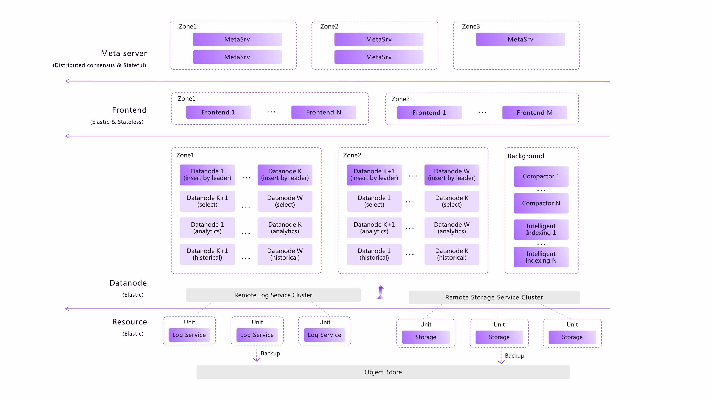
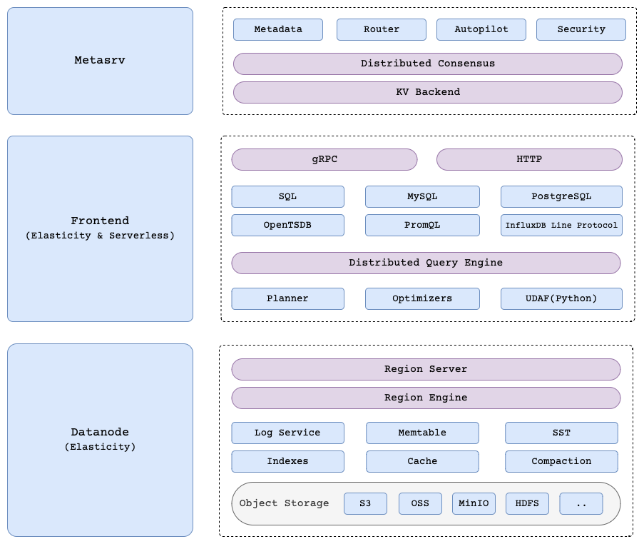
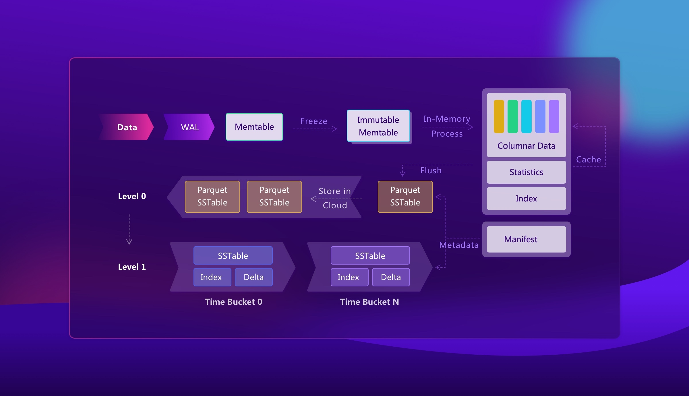
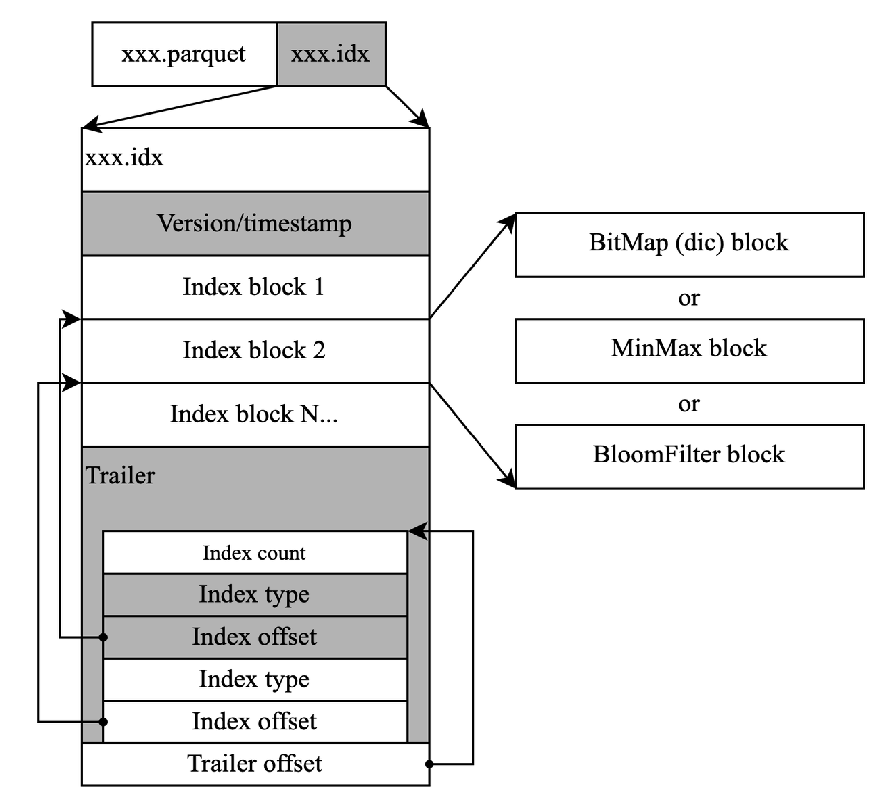

# GreptimeDB

## 架构



共享存储架构

- MetaServer集群(可选)
    - 存储和管理整个GreptimeDB集群的元数据，包括节点Meta信息（IP地址、端口、角色等），表的地址信息（区域和分布）、表的Meta信息（模式、选项等）集群状态管理（节点状态、各种全局状态、全局任务状态等）
- 前端集群
    - 作为代理和路由器，根据表的位置信息和负载均衡规则将读写请求路由到正确的后端节点
    - 承担了跨区域或跨表的分布式查询功能
    - 无状态
- Datanode集群
    - 处理读/写请求
    - 配置和角色分布到不同的计算能力池：读、写，分析，计算节点
        - Python co-processor: python 协处理器
        - Storage engine：Mito
            - 基于LSM树的时间序列数据表引擎
        - Query engine： datafusion
        - 每个函数都可以作为一个特定的计算池Datanode Computation pool 单独启动，并且读取，写入，分析和Python计算的负载可以隔离而不会相互影响
- Remote storage 远程存储(可选)
    - 数据和日志将存储在ObjectStore中（基于OpenDAL项目）
    - 将“冷”数据存储在S3中，将“热”数据存储在本地磁盘中
    - 共享的分布式WAL只需要少量的EBS来提供写容灾，在数据刷新到S3后即可清空




Storage engine：


- 数据首先写入WAL和memtable，然后当memtable中的数据达到某个阈值时，以Parquet格式持久化到级别0。这些文件可以存储在对象存储中
- Compaction
    - 按时间范围对文件进行分区，以便轻松实现TTL
    - 为parquet文件建立额外索引以提高查询效率


[灾难恢复（DR）](https://docs.greptime.com/user-guide/operations/disaster-recovery/overview)

- WAL：它可以是基于本地磁盘的（本地WAL）或基于Kafka集群的（[远程WAL](https://docs.greptime.com/user-guide/operations/remote-wal/quick-start)）
    - WAL组件是可插拔的，例如使用Kafka作为提供成熟DR解决方案的WAL服务

- SST: 对象存储中

- Active-Active Failover 主主同步复制


#### 智能索引

在时间序列的分析场景中，最常见的查询模式是根据给定的标签和时间范围来定位拟合序列。

传统：
- InfluxDB使用倒排索引， 当序列号增加时，最终会将内存溢出到磁盘
- MPP，并行加速

GreptimeDB混合的解决方案-构建智能索引和大规模并行处理（MPP）来增强修剪和过滤

独立的索引文件来记录统计信息，MinMax，Dictionary，Bloomfilter索引


通过内置的指标记录不同查询的工作负载，智能应用索引


#### 压缩

B在块的基数超过某个阈值时对字符串进行字典化

浮点数，GreptimeDB采用Chimp算法（增强版Gorilla）

Serverless 后台 异步Compaction


## 数据模型


- 表模型 + Schema 版本

- SQL

- 多值模型使其中一行数据可以具有多个指标列, 共用tag


GreptimeDB 如何解决高基数问题？（各自实现不同，高基数具体的问题）

- 分片：它将数据和索引分布在不同的 Region 服务器之间。阅读 GreptimeDB 的架构。
- 智能索引：它不强制为每个标签创建倒排索引，而是根据标签列的特性和负载类型选择合适的索引类型并自动构建
    - 认为所有tag都构建倒排，开销太大，而且异步构建
- MPP: 除了索引之外，查询引擎还会利用向量化执行和分布式并行执行等技术来加速查询。


## 性能


- [GreptimeDB vs. ClickHouse vs. ElasticSearch 日志引擎性能对比报告](https://greptime.cn/blogs/2024-08-21-report)
    -  v0.9 日志数据 

- [GreptimeDB vs. InfluxDB 性能测试报告](https://greptime.cn/blogs/2024-08-08-report)

    - tsbs 测试
        - GreptimeDB 的写入吞吐是 InfluxDB 的 2 倍以上。(scale=4000)
        - GreptimeDB 的查询性能在处理大数据量或者重运算场景时优势明显，部分查询速度可达 InfluxDB 的 11 倍以上。
        - GreptimeDB 在 S3 上的读写性能与本地存储相当，建议使用对象存储时启用本地缓存。
    ```
    数据库	写入吞吐(行/秒)
    InfluxDB	109356.73
    GreptimeDB 基于 EBS	234620.19
    GreptimeDB 基于 S3	231038.35
    ```

## REF

- [GreptimeTeam/greptimedb](https://github.com/GreptimeTeam/greptimedb)

- [docs: datanode/overview](https://docs.greptime.com/contributor-guide/datanode/overview)


- [2022-12-08-GreptimeDB-internal-design](https://greptime.com/blogs/2022-12-08-GreptimeDB-internal-design)

- [GreptimeDB存储引擎设计-迎合时间序列场景](https://greptime.com/blogs/2022-12-21-storage-engine-design)


- [GreptimeDB 0.9.1 vs. InfluxDB 2.77 性能测试报告](https://zhuanlan.zhihu.com/p/713321666)
    - GreptimeDB (23w/s) 的写入吞吐是 InfluxDB (10w/s)的 2 倍以上,  InfluxDB Line protocol 写入 
        - CK 14w/s
    - GreptimeDB 的查询性能在处理大数据量或者重运算场景时优势明显，部分查询速度可达 InfluxDB 的 11 倍以上
    - 查询涉及少量数据时，InfluxDB 查询略快，但两者查询时间都很短，在同一数量级
    - GreptimeDB 在 S3 上的读写性能与本地存储相当，建议使用对象存储时启用本地缓存