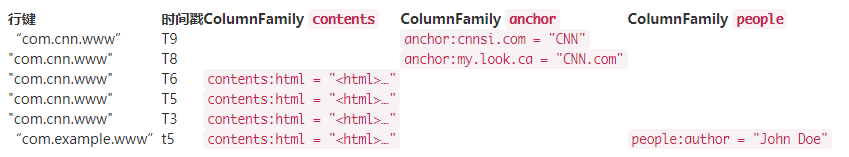

# HBase笔记

[TOC]

## 1. 场景、架构和优缺点

见[大数据系统鉴赏](https://github.com/tianjiqx/notes/blob/master/big_data_system/%E5%A4%A7%E6%95%B0%E6%8D%AE%E7%B3%BB%E7%BB%9F-%E9%89%B4%E8%B5%8F.md) hbase小节


## 2.数据模型

#### 2.1 逻辑视图

使用角度——表、行、列。

- table：表，一个表包含多行数据。

- row：行，一行数据包含一个唯一标识rowkey、多个column以及对应的值。表中按照rowkey的字典序由小到大排序。
- column：列，columnfamily（列簇）以及qualifier（列名）两部分组成，两者中间使用":"相连。
  - column family在表创建的时候需要指定，用户不能随意增减
  - qualifier可以动态增加
- timestamp：时间戳，每个cell在写入HBase的时候都会默认分配一个时间戳作为该cell的版本，用户也可指定
- cell：单元格，由五元组（row, column, timestamp, type, value）组成的结构，其中type表示Put/Delete这样的操作类型，timestamp代表这个cell的版本。这个结构在数据库中实际是以KV结构存储的，其中（row, column,timestamp, type）是K，value字段对应KV结构的V。




cell的KV存储结构：


多维稀疏排序Map

- 多维: key是复合结构
- 稀疏：null值不存，所以列理论上可以无限扩张
- 排序：KV在一个文件中，按key排序，不仅rowkey，其他组成也参与。


#### 2.2 物理视图

HBase中的数据是**按照列簇存储**的，即将数据按照列簇分别存储在**不同的目录**中。


注意，anchor列族有两列

列族存储：结语行存和列存之间，可以随意在行存（多列名），列存（1列族1列名）之间转换


列存优势：读取IO减少，压缩率高。

更多列存细节内容，见个人slide:[column-store-tutorial](https://github.com/tianjiqx/slides/blob/master/column-store-tutorial.pdf)


## 3.Client与服务端的交互

#### 3.1 hbase:meta 表


## ４.HBase读写流程

### 


### 4.1 hbase写


### 4.2 hbase flush

Flush：Memstore刷HFile到hdfs上的过程。

触发方式：

- 手动
  - shell命令 flush ‘tablename’或者flush ‘region name’分别对一个表或者一个Region进行flush。
- 超过阈值
  - Memstore级别限制：当Region中任意一个MemStore的大小达到了上限（hbase.hregion.memstore.flush.size，默认128MB），会触发Memstore刷新。
  - Region级别限制：当Region中所有Memstore的大小总和达到了上限（hbase.hregion.memstore.block.multiplier * hbase.hregion.memstore.flush.size，默认 2* 128M = 256M），会触发memstore刷新。
  - Region Server级别限制：当一个Region Server中所有Memstore的大小总和达到了上限（hbase.regionserver.global.memstore.upperLimit ＊ hbase_heapsize，默认 40%的JVM内存使用量），会触发部分Memstore刷新。
- HBase定期刷新Memstore：默认周期为1小时

**MemStore的最小flush单元是HRegion而不是单个MemStore。**Region->Stores（memstore+HFiles），Store对应一个列族。为什么不能单独刷新，因为可能涉及region 切分，所有列族必须统一。减少列族数量，可以减少每次flush的IO开销


#### REF

- [HBase Flush 解析](https://blog.csdn.net/u010039929/article/details/74253093)


### 4.3 hbase读


## 5. Compaction

Compaction是从一个Region的一个Store中选择部分HFile文件进行合并。

合并原理是，先从这些待合并的数据文件中依次读出KeyValue，再由小到大排序后写入一个新的文件。

之后，这个新生成的文件就会取代之前已合并的所有文件对外提供服务。

- Minor Compaction：指选取部分小的、相邻的HFile，将它们合并成一个更大的HFile。

- Major Compaction：指将一个Store中所有的HFile合并成一个HFile，这个过程还会完全清理三类无意义数据：被删除的数据、TTL过期数据、版本号超过设定版本号的数据。

作用：

- 合并小文件，减少文件数，稳定随机读延迟。文件速率多，IO次数也多。
- 提高数据的本地化率。
  - **Data Locality：region的HFile位于本地的百分比**
  - 合并小文件的同时读取远程DN上的数据写入大文件，合并的大文件会在本地保留一个副本。
  - 地化率越高，在HDFS上访问数据时延迟就越小；相反，本地化率越低，访问数据就可能大概率需要通过网络访问，延迟比较大。
- 清除无效数据，减少数据存储量。

Compaction使用短时间的IO消耗以及带宽消耗换取后续查询的低延迟。


#### REF

- [HBase1.x优化：数据本地化率？](https://my.oschina.net/u/2380815/blog/4453969)


## 6. Region负载均衡(迁移，合并，分裂)

### 6.1 Rowkey设计

HBase 中的行按行按**字典顺序排序**。对于顺序扫描有利。

但是Rowkey设计不好，导致热点问题。（大量客户端流量包括读取，写入或其他操作指向群集的一个节点或仅几个节点）

打散热点的rowkey设计方式：

- 添加随机前缀

  - 也被叫做slating加盐，引用自加密技术

  ```
  foo0001
  foo0002
  foo0003
  foo0004
  -> 分成4个区域，新增记录随机前缀
  a-foo0003
  b-foo0001
  c-foo0004
  d-foo0002 
  写快，扫描开销增加
  ```

- 哈希

  - 相同行始终在一个region，一定程度维持有序

- 反转固定宽度或数字行键

  - 例如最低位，改到第一个。会牺牲排序属性，读取时每次要扫描所有的region。

在维持有序性和分散热点之间取得tradoff。

更多[table设计](https://communities.intel.com/community/itpeernetwork/datastack/blog/2013/11/10/discussion-on-designing-hbase-tables)，[slated表（分桶）](https://phoenix.apache.org/salted.html)，[HBASE-11682 Explain hotspotting](https://issues.apache.org/jira/browse/HBASE-11682)


### 6.2 列族数量

官方推荐使用尽量少，一般1个。

> 在数据访问通常是列作用域的情况下，才引入第二和第三列族;即您查询一个列族或另一个列族，但通常不是同时查询两个列族。

原因是flush，压缩机制是以region为单位的。

一个列族突然插入大量数据，需要进行flush和压缩，其他未修改的列族也必须进行，产生没有必要的IO。

并且一个列族数量很多，另一个列族数据量很小时，小数据量的列族被分散到大量的region中，导致该列族的大规模扫描性能降低。


### 6.3 region 迁移

分片迁移，集群负载均衡、故障恢复等功能都是建立在分片迁移的基础之上的。

轻量级，HBase的数据实际存储在HDFS上，不需要独立进行管理，因而Region迁移只要将读写服务迁移即可。（当然可能会带来数据本地率的改变，上升或下降）

#### 6.3.1 迁移流程

region状态定义。

迁移相关状态：

offline

opening，open，failed_open

closing，closed，failed_close。


- unassign阶段


- Region从源RegionServer下线
  - 1）Master生成事件M_ZK_REGION_CLOSING并更新到ZooKeeper组件，同时将本地内存中该Region的状态修改为PENDING_CLOSE。
  - 2）Master通过RPC发送close命令给拥有该Region的RegionServer，令其关闭该Region。
  - 3）RegionServer接收到Master发送过来的命令后，生成一个RS_ZK_REGION_CLOSING事件，更新到ZooKeeper。
  - 4）Master监听到ZooKeeper节点变动后，更新内存中Region的状态为CLOSING。
  - 5）RegionServer执行Region关闭操作。如果该Region正在执行flush或者Compaction，等待操作完成；否则将该Region下的所有MemStore强制flush，然后关闭Region相关的服务。
  - 6）关闭完成后生成事件RS_ZK_REGION_CLOSED，更新到ZooKeeper。Master监听到ZooKeeper节点变动后，更新该Region的状态为CLOSED。

- assign阶段

  

  - 1）Master生成事件M_ZK_REGION_OFFLINE并更新到ZooKeeper组件，同时将本地内存中该Region的状态修改为PENDING_OPEN。
  - 2）Master通过RPC发送open命令给拥有该Region的RegionServer，令其打开该Region。
  - 3）RegionServer接收到Master发送过来的命令后，生成一个RS_ZK_REGION_OPENING事件，更新到ZooKeeper。
  - 4）Master监听到ZooKeeper节点变动后，更新内存中Region的状态为OPENING。
  - 5）RegionServer执行Region打开操作，初始化相应的服务。
  - 6）打开完成之后生成事件RS_ZK_REGION_OPENED，更新到ZooKeeper，Master监听到ZooKeeper节点变动后，更新该Region的状态为OPEN。

各节点作用职责：

- master发起region状态改变，并维护管理的region的状态(4)
- zookeeper存储操作过程中的事件，用于宕机恢复。(3)
- regionServer接受master指令执行，打开或关闭region（2）

#### 6.3.2 Region In Transition

Region状态的存储:meta表，Master内存，ZooKeeper的region-in-transition节点

- meta(zookeeper)：持久化存有Region与RegionServer的对应关系
- master：存储整个集群所有的Region状态信息，变更由zookeeper通知，一定的滞后
  - HBaseMaster WebUI上看到的Region状态都来自于Master内存信息
- zookeeper：临时性的状态转移信息

三个位置的状态一致时，才是正常工作状态，不一致状态，被叫Region In Transition(RIT)

> 例子：RegionServer已经将Region成功打开，但是在远程更新hbase:meta元数据时出现异常（网络异常、RegionServer宕机、hbase:meta异常等），此时Master上维护的Region状态为OPENING，ZooKeeper节点上Region的状态为RS_ZK_REGION_OPENING，hbase:meta存储的信息是Region所在rs为null。但是Region已经在新的RegionServer上打开了，此时在Web UI上就会看到Region处于RIT状态。

如果在迁移状态，出现短暂的RIT状态，无需人工干预，是正常现象。


### 6.4 Region合并

场景：清除空闲Region，减少集群运维成本。或者region切分的过多，数据量小，数量多，改进扫描性能。

空闲Region：在某些业务中本来接收写入的Region在之后的很长时间都不再接收任何写入，而且Region上的数据因为TTL过期被删除。这种场景下的Region实际上没有任何存在的意义。

过程：

- 1）客户端发送merge请求给Master。
- 2）Master将待合并的所有Region都move到同一个RegionServer上。
- 3）Master发送merge请求给该RegionServer。
- 4）RegionServer启动一个本地事务执行merge操作。
- 5）merge操作将待合并的两个Region下线，并将两个Region的文件进行合并。
- 6）将这两个Region从hbase:meta中删除，并将新生成的Region添加到hbase:meta中。
- 7）将新生成的Region上线。

命令：

`hbase>merge_region 'encoded_regionname'  'encoded_regionname'` 异步操作。


### 6.5 Region分裂

#### 6.5.1 region分裂触发策略


- ConstantSizeRegionSplitPolicy：region阈值超过触发
  - 缺点，大表友好，小表不友好。小表常常只有一个region。产生热点。阈值调小又会导致region数量过多。
- IncreasingToUpperBoundRegionSplitPolicy：阈值可变，与regionserver上个数有关。(#regions) *(#regions) * (#regions)* flush size * 2，存在最大阈值，MaxRegionFileSize。自适应大小表。小表分散，扫描性能有降低。（todo refine）
- SteppingSplitPolicy：分裂阈值大小和待分裂Region所属表在当前RegionServer上的Region个数有关系，如果Region个数等于1，分裂阈值为flush size * 2，否则为MaxRegionFileSize。小表region个数相对减少，不产生过小region。（todo refine）

#### 6.5.2 分裂点

- 用户手动分裂是，指定
- 自动：整个Region中最大Store中的最大文件中最中心的一个Block的首个rowkey。
  - 只有一个block时，无分裂点。

#### 6.5.3 分裂过程

分裂事务：prepare、execute和rollback

- prepare：内存中初始化两个子Region，具体生成两个HRegionInfo对象，包含tableName、regionName、startkey、endkey等。同时会生成一个transactionjournal，这个对象用来记录分裂的进展

- execute:

  

- rollback: 执行阶段发生异常时执行。


## 7.宕机恢复


## 8. 副本同步(跨集群)

基本思路利用WAL logging 同步到备集群，避免主集群宕机，备集群丢失数据。（对比MySQL同步）


#### REF

- [HBASE-20422](https://issues.apache.org/jira/browse/HBASE-20422)
- [HBase Synchronous Replication](https://docs.google.com/document/d/193D3aOxD-muPIZuQfI4Zo3_qg6-Nepeu_kraYJVQkiE/edit#) 方案设计


## 9.备份恢复


#### REF

- [备份和恢复指令](http://hbase.org.cn/docs/113.html)


## Q&A

### 1. HBase只支持单行事务，稀疏存储，是不是完全设计成大宽表就好？

HBase对列族没有限制，但是，按行进行切分region的，memstore,HFile大小有限（需要保障读取性能，不能完全一个大文件），列多意味着需要切分的region多。如果region数量过多，hmaster 内存无关管理，并且影响性能，所以不是越宽越好。（在星环时，甚至只推荐一个列族）

Region数量与大小的最佳实践

> 官方指出每个RegionServer大约100个regions的时候效果最好.
>
> - [HBase](https://cloud.tencent.com/product/hbase?from=10680)的一个特性MSLAB，它有助于防止堆内存的碎片化，减轻垃圾回收Full GC的问题，默认是开启的。但是每个MemStore需要2MB（一个列簇对应一个写缓存memstore）。所以如果每个region有2个family列簇，总有1000个region，就算不存储数据也要3.95G内存空间。
> - 如果很多region，它们中Memstore也过多，内存大小触发Region Server级别限制导致flush，就会对用户请求产生较大的影响，可能阻塞该Region Server上的更新操作。
> - HMaster要花大量的时间来分配和移动Region，且过多Region会增加ZooKeeper的负担。
> - 从HBase读入数据进行处理的mapreduce程序，过多Region会产生太多Map任务数量，默认情况下由涉及的region数量决定。


## REF

- [HBase原理与实践-胡争](https://weread.qq.com/web/reader/632326807192b335632d09ckc81322c012c81e728d9d180) 微信读书网页版，微信刷码即可，**推荐分析原理解析时阅读**
- 《HBase实战》
- [HBase官方中文文档](http://hbase.org.cn/)
- [Hbase最佳实战：Region数量与大小的重要影响](https://zhuanlan.zhihu.com/p/27800787)

