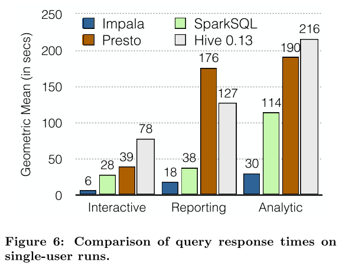
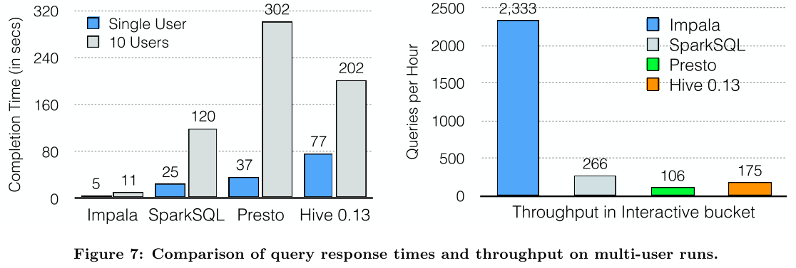
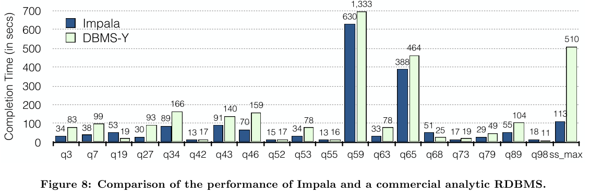

# 论文笔记 - Impala: A Modern, Open-Source SQL Engine for Hadoop

## 0.阅读动机

- 看到一篇关于impala介绍过其批处理和MPP融合的文章，对其细节感兴趣（不过论文是2015年的，估计没有相关内容，但是了解原始设计理念吧）
  - （补：记混是Apache HAWQ）
- SQL on Hadoop的一个典型，观察如何做查询执行，以及一些设计考虑（MPP）
- 试验（Jiri Srba）[论文阅读步骤](https://github.com/tianjiqx/notes/blob/master/%E7%A8%8B%E5%BA%8F%E5%91%98%E7%9A%84%E8%87%AA%E6%88%91%E4%BF%AE%E5%85%BB/%E6%80%8E%E6%A0%B7%E8%AF%BB%E6%96%87%E7%8C%AE%E5%92%8C%E5%81%9A%E9%99%88%E8%BF%B0-%E7%AC%94%E8%AE%B0.md)

## 1. 概览

（摘要，引言，结论）

### 1.1 论文针对的问题

解决**Hadoop** 上的 BI/分析（主要是查询），提供**低延迟**和**高并发性**。（支持多用户）

### 1.2 论文作者的认为的贡献、优势

贡献：

- 为Hadoop环境，构建了一个开源的、完全的，先进的MPP SQL查询引擎。
  - 非批处理hive、spark的系统
  - 引入并行DBMS技术（MPP，运行时代码生成）

优势：

- 性能与商业OLAP一样或者更好，同时保留灵活性和Hadoop的成本
- 良好的开放模块化架构，混合文件格式、处理框架，能够更广泛的支持其他业务
  - 多样的存储支持
  - 可以与其他处理引擎协作（spark，hive，hbase）

### 1.3 现实意义

更高性能、并发的SQL on Hadoop，并且是开源产品可以实际尝试，部署应用，并且到现在（2021）依然在维护。

## 2. 整体了解

（基础Preliminaries，主体Body）

（问题定义，相关工作，系统设计，实验）

### 2.1 Impala与传统RDBMS的区别（用户角度）

商业环境集成，支持行业标准：

- 客户端可以通过 ODBC 或 JDBC 连接
- 使用 Kerberos 或 LDAP 完成身份验证
- 授权遵循标准的 SQL 角色和权限
- 标准SQL查询语法
  - 建表时特殊有额外语句

区别：

#### 2.1.1 物理schema设计

建表时，用户可以指定存储路径，分区列，存储格式。（与hive类似）

- 无分区，根目录
- 有分区，增加分区目录。（HDFS的路径）
  - 特别的可以修改分区格式，原始text，后期批处理为parquet

存储格式：

- 压缩、非压缩的文本文件
- RCFile（列存格式）
- Avro（二进制格式）
- Parquet（性能最好，列存格式）

#### 2.1.2 SQL支持

由于 HDFS 作为存储管理器的限制。

不支持传统UPDATE 或 DELETE行，只能批量插入（INSERT INTO ... SELECT ...）。

按分区删除。

后来支持Kudu的UPDATE 或 DELETE。

### 2.2 架构设计

impala自身是一个大规模并行查询执行引擎，无存储引擎，依赖于HDFS、HBASE。

与一般的MPP不同，计算与存储是分离的。

Hadoop 上的无共享并行数据库架构。

-  Impalad守护进程（对称架构）
  - 接受来自客户端进程的查询并协调它们在整个集群中的执行，以及处理其他 Impala守护进程执行单个查询片段
  - 每个节点部署一个Impalad，同时节点上也有一个HDFS的DataNode
  - 组件
    - Query Planner
    - Query Coordinator
    - Query Executor
- Statestore守护进程
  -  Impala 的元数据发布订阅服务，它将集群范围的元数据传播到所有 Impala 进程
- catalogd目录守护进程
  - Impala 的目录存储库和元数据访问网关
  - 反应Hive Metastore的变更，对catalogd的更改，通过 statestore 广播

要解决的核心问题：

- 状态分发
  - 集群范围元数据的协调和同步
  - 对称节点都能够接受和执行查询
    - 需要具有最新版本的系统catalog和 Impala集群成员的最新视图，以安排查询
  - 解决方案：发布订阅系统statestore
- 统一、全局的的元信息管理
  - Catalog服务，提取第三方元数据存储信息，聚合到Impala的Catalog中

架构分层

- 前端
  - 负责将 SQL 文本编译为 Impala 后端可执行的查询计划
  - Java
  - 组件
    - SQL 解析器
    - 基于成本的查询优化器
    - 两阶段优化
      - 解析树翻译为不可执行的单节点计划树
      - 单节点计划，生成分布式执行计划
        - 总体目标是**最小化数据移动**并**最大化扫描局部性**
- 后端
  - 从前端接收查询片段并负责它们的快速执行
  - C++
  - 运行时代码生成
  - Volcano执行模型+Exchange算子
    - 每个next是一批记录
    - 尽量pipeline，最大限度地减少存储中间结果的内存消耗
  - 可溢出的算子（刷磁盘）
    - 散列连接
    - （基于散列的）聚合
    - 排序
    - 分析函数的eval
  - 高效的IO管理器
    - 近磁盘带宽的读取
    - 吞吐量比其他测试系统高 4 到 8 倍

- 资源负载管理
  - 用以支持每秒数千个查询的工作负载
    - 直接使用原生的yarn服务，集中决策无法满足需求，资源请求和响应周期过长
  - 独立的准入控制机制，进行低延迟决策
    - 避免集中决策
  - Llama服务
    - 资源缓存
    - 未命中再向yarn申请

### 2.3 实验

#### 2.3.1 单用户查询响应

以零思考时间重复提交查询测试。

 Impala 的性能优势从 2.1 倍到 13.0 倍不等，平均快 6.7 倍。

#### 2.3.2  多用户查询响应

 10 个并发用户，Impala 的性能比其他系统高 6.7 倍到 18.7 倍，吞吐量比其他系统高 8.7 倍到 22 倍。。

#### 2.3.3 与商业关系数据库比较

30TB的TPC-DS，平均性能高出 2 倍（这里的比较是每个测试case的性能倍数取平均，非测试集总时间倍数），只有三个查询的执行速度更慢。

## 3. 精读

（主体的每一处细节，参考文献）

### 3.1 元信息管理

Impala是架构在HDFS、HBase之上的OLAP系统，需要管理自己维护的表、统计信息等元数据，也可以通过外部机制如Hive的Metastore的信息，加载元信息。除了数据信息外，本身是分布式系统，需要维护集群的节点元信息，以便可以正确安排查询。

元信息管理由2个进程管理：

- catalogd

  - 元数据协调服务，将 Impala DDL 和 DML 语句的更改通过statestored广播到所有受影响的 Impala 节点，以便新表、新加载的数据等对通过任何 Impala 节点提交的查询立即可见。
  - catalogd服务能够从第三方元数据存储（如，Hive Metastore 或 HDFS Namenode）中提取信息，并将该信息聚合到与 Impala 兼容的目录结构中。
  - 使用Impala 特定的信息
    - 只注册UDF信息到Impala ，而不复制到Metastore
  - 延迟加载元信息
    - 完整的catalog很大，启动时只加载表的主干信息
    - 需要时，更详细的信息，从其第三方存储在后台延迟加载
  - 一般与与 statestored部署在同一个节点。

- statestored

  - 跟踪集群中所有impalad 实例的位置和状态的名称服务。
  - 实际是一个发布订阅服务，将元数据更改传播给一组订阅者。（推送模式）
    - 主动推送模式，比用到时查询catalogd，具有更低的延时，免RPC调用。
    - 主题
      - 包含一组（键、值、版本）三元组条目
        - “键”和“值”是字节数组，“版本”是 64 位整数
      - 生命周期与statestored进程一致，不会持久化到磁盘
    - 消息类型
      - 主题更新
        - 上次更新日期成功发送给订阅者，对主题的所有更改（新条目、修改条目和删除）
        - 订阅者维护每个主题的最新版本标识符，进行增量更新
      - keepalive 消息
        - 心跳消息，维护与每个订阅者的连接，超时，订阅者需要重新注册
        - 多次发送keepalive失败的订阅者，被移除
    - statestored不会将任何元数据保存到磁盘，所有当前元数据都由实时订阅者（笔误？应该叫发布者）推送到statestore
      -  statestore 重新启动，在初始订阅者注册阶段恢复其状态
        - 换节点重启，可以通过DNS重定向。
  - 一般与NN部署在一起。

（impala元信息更新频率比SQL执行频率更高，保证新鲜度。

2.5版本以前，元信息更新似乎有坑，根据一个2.5版本的slides，对于insert select /alter table set location 改善明显4x。TODO）

### 3.2 执行计划生成

可执行的查询计划分两个阶段构建

- 单节点计划
  - 算子：HDFS/HBase scan, hash join, cross join, union, hash aggregation, sort, top-n, and analytic evaluation
  - 优化
    - 根据等价类推断谓词
    - 分区裁剪，列裁剪
    - limit 下推
    - 基于成本的计划优化
      - 排序
      - 合并分析窗口函数
      - 调整连接顺序
- 计划并行化与分段
  - 总体目标是**最小化数据移动**并**最大化扫描局部性**
    - HDFS的远程读取比本地读取慢得多
    - 分布式：添加必要的Exchange节点，局部聚合节点
    - 决定连接算法
      - 广播
        - 小表
      - 重分区
        - 按连接列
    - 聚合操作
      - 本地聚合
      - 然后在单个协调节点合并聚合结果
    - Sort，Top-N类似的并行化：分布式本地 sort/top-n 之后是单节点合并操作。
    - 分析表达式
      - 根据 partition-by/order-by 表达式对输入进行排序
      - 基于分区表达式并行化
  - 根据Exchange节点进行拆分布式计划树，每个部分作为一个执行片段
    - 每个执行片段，作为后端执行单元
      - 表示，在单个机器上的同一数据分区上运行的计划树的一部分

左图：连接两个 HDFS 表 (t1, t2) 和一个 HBase 表 (t3)，聚合和 order by with limit（top-N）

右图：分布式的执行计划片段

- 圆角矩形：表示片段边界
- 箭头：表示数据交换

t1和t2 通过按id重分区进行连接。

scan自己是一个片段，scan的结果会立即交换给连接节点，连接节点基于哈希的数据分区上进行操作。

t3使用广播连接，将t3发送到所有的连接节点，并且与t1和t2的连接放在同一个片段，因为广播连接保留现有数据分区。

连接完成后，执行2阶段分布式聚合：

- 在与最后一个连接相同的片段中计算预聚合
- 根据分组键对预聚合结果进行哈希交换
- 然后再次聚合以计算最终聚合结果
  - 每个节点持有一部分最终聚合结果

2阶段分布式TopN：

- 计算每个分区，局部的top-N
  - 局部top-n不会与其他局部top-n重复，因为已经Hash分组，局部top-n中的结果就是聚合最终结果
- 在协调者节点，执行最后的片段，合并每个局部Top-N结果，得到最终的Top-N，返回给客户端

PS，MPP问题：

- 依赖分区，需要重视数据倾斜，产生的长尾任务
- 在大规模数据集执行连接等操作、耗时长的批处理查询类型，缺少容错机制。（节点崩溃）

TODO：MPP与MR的融合

### 3.3 运行时代码生成

Impala后端，采用LLVM的运行时代码生成。

LLVM 是一个编译器库和相关工具的集合，是模块化和可重用的，允许应用在运行的进程中执行即时 (JIT) 编译，充分利用现代优化器的优势和为许多架构生成机器代码的能力。

运行时开销：

- 虚函数调用
  - 被调用的函数非常简单时，尤其明显，因为无法内联。
    - 而Rust天然是具体的对象实例，是直接函数调用，然后可以内联
  - 关键应用，表达式树的eval调用
    - 之前如TensorBase这样的系统也通过JIT编译，来改进表达式的执行效率
    - 根据之前的SparkSQL笔记，SparkSQL不止在表达式进行运行时代码生成，更在算子级别完成代码生成。

通过使用代码生成解析虚函数调用，然后内联结果函数调用，可以直接评估表达式树，而没有函数调用开销。

此外，内联函数增加了指令级并行性，并允许编译器进行进一步优化。

JIT 编译的效果类似于自定义编码查询，例如，消除了分支、展开循环、传播常量、偏移量和指针、内联函数。

并非所有的地方都能JIT，比如扫描，编译时未知文件的模式，必须使用通用函数。

测试：

代码生成最多可将执行速度提高 5.7 倍（TPC-H Q1），并且随着查询复杂度的增加而增加。

### 3.4 IO管理器

为了以或接近硬件速度从磁盘和内存执行数据扫描，Impala 使用称为短路本地读取的 HDFS 功能在从本地磁盘读取时绕过 DataNode 协议。通常能够使所有可用磁盘饱和。

测试数据：

12 个磁盘，1.2GB/秒 IO

HDFS 缓存，允许 Impala 以内存总线速度访问内存驻留数据（无需复制、校验）。

实现：

I/O 管理器

- 为每个物理磁盘分配固定数量的工作线程（每个HDD盘一个线程，每个 SSD 八个）
- 为客户端提供异步接口（如扫描线程）
  - 可能这里是高性能访问HDFS的关键
    - 根据之前的经验，HDFS需要一块一块的写，并且3副本都成功后才能写下一块，这样的IO过程，有很长的空闲等待时间，异步IO，可能是高性能HDFS IO的原因。
      - 异步IO（联想到rust async/awit）
- 吞吐量比其他测试系统高 4 到 8 倍

数据格式：

impala测试，Parquet提供高压缩和扫描效率。

带有 snappy 压缩的 Parquet 实现了其中最好的压缩。

在tpcds测试中，始终优于所有其他格式（Avro, RCFile,Sequence, plain text）的 5 倍。

（稍微奇怪没有和ORC比较，ORC官网称自己最好）

### 3.5 资源管理

Impala 以每秒数千个查询的工作负载为目标。查询之间需要协调资源调度，保证延迟和吞吐。

**Llama进程**

- 单独的进程standalone
- 接受Impalad的每个查询的资源请求（例如，每个节点1GB内存）
  - 每个资源请求都与一个资源池相关联
  - 资源池定义了查询可能使用的集群可用资源的公平份额
- 如果资源池的资源可用，返回给查询，绕过 YARN 的资源分配算法
  - 否则，转发给YARN 的资源管理器，等待资源返回。

**准入控制Admission Control**

准入控制机制用来限制传入的请求。

请求被分配到一个资源池，并根据定义每个池限制的最大并发请求数和请求的最大内存使用量的策略允许、排队或拒绝。

准入控制器时分布式、本地决策的，每个 Impalad 守护进程都能够基于其全局状态（被statestored推送到的）的聚合视图做出准入决策。

### 3.6 参考文献

A. Floratou, U. F. Minhas, and F. Ozcan. SQL-on- Hadoop: Full circle back to shared-nothing database architectures. PVLDB, 2014. 本文多处引用此文的一些测试结论。hive MR和impala MPP的测试对比

结论：

当工作负载的工作集适合内存时，Impala 比 Hive 提供了显着的性能优势。

原因：

- Impala 非常高效的 I/O 子系统
- 类似于无共享并行数据库的流水线查询执行
  - 无需写磁盘（物化中间结果）
  - 更好的调度
  - Tez 上的 Hive避免调度和物化的开销，但是在扫描操作期间都受CPU限制。

C. Lattner and V. Adve. LLVM: A compilation frame- work for lifelong program analysis & transformation. In CGO, 2004. 代码生成技术LLVM

T. Willhalm, N. Popovici, Y. Boshmaf, H. Plattner, A. Zeier, and J. Schaffner. SIMD-scan: ultra fast in- memory table scan using on-chip vector processing units. PVLDB, 2, 2009. 代码生成 SIMD

[Runtime Code Generation in Cloudera Impala](http://sites.computer.org/debull/A14mar/p31.pdf) - *Wanderman-Milne and Li, Bulletin of the IEEE Computer Society Technical Committee on Data Engineering, 2014*

V. K. Vavilapalli, A. C. Murthy, C. Douglas, S. Agarwal, M. Konar, R. Evans, T. Graves, J. Lowe, H. Shah, S. Seth, B. Saha, C. Curino, O. O’Malley, S. Radia, B. Reed, and E. Baldeschwieler. Apache Hadoop YARN: Yet another resource negotiator. In SOCC, 2013. yarn的资源调度

[Parallel Database Systems: The Future of High Performance Database Processing](https://pdfs.semanticscholar.org/0435/41bc339eb3fd0e22f436b12b96abb4547684.pdf) (DeWitt, Gray，1992) MPP

SCOPE: Parallel Databases Meet MapReduce (Zhou et. al. 2012)

## 4. 个人总结

读本文的收获，或者说对个人而言的贡献

- 了解一种SQL on Hadoop 系统的实现方式
  - MPP架构怎么在Hadoop上面执行的
    - 元信息管理，节点状态管理，用订阅发布系统来实现
    - 共享存储的HDFS，变成share nothing节点
    - 对MPP分布式计划生成和执行原理理解加深
    - 发现盲点问题，SQL任务调度，在大数据系统上，如何支持高并发。
  - impala的性能优势原因
    - MPP的流水线查询执行
      - 无数据物化
    - 高效的IO管理（细节，具体实现TODO分析源码）
      - 对Hadoop数据的高效访问
        - （与自己之前导入导出，备份恢复工作与HDFS的IO可以学习地方）

impala不足

- 完成了MPP架构，但是没有提对MPP明显问题的改进（或者说没有解决）
  - 数据倾斜，长尾任务
  - 节点失败，大规模数据的处理
    - tpcds 10t，query59 用时630s，query65 用时388s，要是中途一个节点挂掉，就必须重新来过。
      - 因为本身不存储数据，其实可以换计算引擎，或许使用其他计算引擎比如sparkSQL来克服
- 对内存要求较高
  - MPP架构，数据不会物化，都需要再内存中。
- 单点问题
  - catalogd和statestored是单点，挂掉后，无法保证高可用
  - 单一的协调者
    - 一般case似乎满足，考虑大规模数据输出，如导出呢？
  - 单点引起的集群扩展性

评分：7.3/10

（试验体会：文献阅读的技巧，只是阅读，但是最后的笔记结果，组织起来还是需要重新组织、调整把精读的内容填充进文章整体了解，不能会划分太散，以及不够清晰，并且有时会插入一些最新的内容，其他相关比较内容。

第2,3节应该合并在一起。

另外，文献阅读技巧，简单讲，就是从浅到深，由易到难，摘要，结论很简单，可以先看，了解框架，论文结构，相关名词，实验结果，也相对容易，最后是深入细节，原理实现，参考文献，在整个过程中，逐渐判断论文价值，符不符合自己的看这篇论文的动机、兴趣，及时止损。）

## 5. MPP与MR融合

#### 概念与特征

MPP:

MPP是由多台SMP服务器通过一定的节点互联网络进行连接，协同工作，完成相同的任务，从用户的角度来看是一个服务器系统。每个节点只访问自己的资源，所以是一种**完全无共享（Share Nothing）结构**。

特点：数据广播，数据重分布

MPP架构特征：

- 任务并行执行;
- 数据分布式存储(本地化);
- 分布式计算;
- 高并发，单个节点并发能力大于300用户;
- 横向扩展，支持集群节点的扩容;
- **Shared Nothing（完全无共享）架构**。

批处理架构:

核心：Map，reduce计算框架。

批处理系统 - 使用场景分钟级、小时级以上的任务，目前很多大型互联网公司都大规模运行这样的系统，稳定可靠，低成本。

MPP系统 - 使用场景秒级、毫秒级以下的任务，主要服务于即席查询场景，对外提供各种数据查询和可视化服务。

#### 比较

相同点：

**批处理架构与MPP架构都是分布式并行处理**，将任务并行的分散到多个服务器和节点上，在每个节点上计算完成后，将各自部分的结果汇总在一起得到最终的结果。

不同点：

批处理架构和MPP架构的不同点可以举例来说：我们执行一个任务，首先这个任务会被分成多个task执行，**对于MapReduce来说，这些tasks被随机的分配在空闲的Executor上（但是会尽力数据本地化，搬计算）；而对于MPP架构的引擎来说，每个处理数据的task被绑定到持有该数据切片的指定Executor上**。

批处理的任务（task）功能性更单一，有很多阶段处理。MPP的任务功能性更丰富，范围更大，对数据处理集中，节点的数据，尽力pipeline处理。

- 批处理的优势：

对于批处理架构来说，**如果某个Executor执行过慢，那么这个Executor会慢慢分配到更少的task执行**，批处理架构有个推测执行策略，推测出某个Executor执行过慢或者有故障，则在接下来分配task时就会较少的分配给它或者直接不分配，这样就不会因为某个节点出现问题而导致集群的性能受限。

- 批处理的缺陷：

任何事情都是有代价的，对于批处理而言，它的优势也造成了它的缺点，**会将中间结果写入到磁盘中**，这严重限制了处理数据的性能。

- MPP的优势：

**MPP架构不需要将中间数据写入磁盘**(不考虑容错，执行失败)，因为一个单一的Executor只处理一个单一的task，因此可以简单直接将数据stream到下一个执行阶段。这个过程称为`pipelining`，它提供了很大的性能提升。

- MPP的缺陷：

对于MPP架构来说，因为task和Executor是绑定的，如果某个Executor执行过慢或故障，将会导致**整个集群的性能就会受限于这个故障节点的执行速度**(所谓木桶的短板效应)，所以MPP架构的最大缺陷就是——**短板效应**。另一点，集群中的节点越多，则某个节点出现问题的概率越大，而一旦有节点出现问题，对于MPP架构来说，将导致整个集群性能受限，所以一般实际生产中**MPP架构的集群节点不易过多**。

**缺少容错机制**，失败则重启。

数据就地计算，某些请求，并发度会受单机限制。

举个例子来说下两种架构的数据落盘：要实现两个大表的join操作，对于批处理而言，如Spark将会写磁盘三次(第一次写入：表1根据`join key`进行shuffle；第二次写入：表2根据`join key`进行shuffle；第三次写入：Hash表写入磁盘)， 而MPP只需要一次写入(Hash表写入)。**这是因为MPP将mapper和reducer同时运行，而MapReduce将它们分成有依赖关系的tasks(DAG),这些task是异步执行的，因此必须通过写入中间数据共享内存来解决数据的依赖**。

#### 将MPP和Batch进行结合

MPP是更快的，但是有两个关键痛点——短板效应和并发限制

MapReduce这样的批处理系统，需要花费时间来存储中间数据到磁盘上

新的**Apache HAWQ**的架构

> 不需要在固定的节点上处理本地存在的数据。
>
> Apache HAWQ提出了”virtual segments”的概念——GreenPlum中的”segment” 是改进版的PostgreSQL数据库中的一个单一实例，它在每个节点上存在一个，并且在每次查询中产生”executor”进程。如果你有一个小的查询，它可以被4个executors执行甚至是一个。如果你有一个大的查询，你可以用100个甚至1000个executor执行。每个查询仍然是以MPP风格对本地数据进行处理，而且不需要将中间数据写入到HDD上，但是”virtual segments”允许executor运行在任何地方。

特性：

[1] 减轻MPP系统的短板问题：因为我们可以动态的添加节点和删除节点。因此，严重的磁盘故障将不会影响整个集群的性能，系统可以拥有比传统MPP更大量级的集群。现在，我们可以暂时的将一个故障节点从集群中移除，那么就不会有更多的executor在上面开始运行。并且，移除节点时不会有停机时间。

[2] 一次查询现在被一个动态数量的executors进行执行，这也就带来了更高的并发度，缓和了MPP系统的限制并加入了batch系统的灵活性。想象一下拥有50个节点的集群，每个节点最多可以运行200个并行的进程。这就意味着你一共拥有了”50*200=10,000”个”execution slot”。你可以对20个查询每个执行500个executor，也可以对200个查询每个执行50个executor，甚至于你可以对1个查询运行10000个executor。在这里是完全灵活可控的。你也可能有一个大的查询要使用4000个segments和600个小的查询每个需要10个executors，这也是可以的。

[3] 数据管道的完美应用：实时的从一个executor中将数据转移到另一个executor中。在执行阶段，单独的查询仍然是MPP的，而不是batch。因此，不需要将中间数据存储到本地磁盘中(无论何时，操作都允许数据管道)。这意味着我们离MPP的速度更近一步了。

[4] 像MPP那样，我们仍然尽可能的使用本地数据来执行查询，这一点可以通过HDFS的short-circuit read(当client和数据在同一节点上，可以通过直接读取本地文件来绕过DataNode，参考HDFS Short-Circuit Local Reads)来实现。每个executor会在拥有该文件最多块数的节点上创建并执行，这也最大化了执行效率。

（HAWQ 通过类似DAG 任务调度执行方式，解决短板效应和并发限制，不过还是对大查询缺少容错。应该是pull数据的模式？）

TODO：MPP的扩展性问题，不宜超过50

> 在一个确定的量级，你的MPP系统将总会有一个节点的磁盘队列出现问题，这将导致该节点的性能降低，从而像上面所说的那样限制整个集群的性能。这也是为什么在这个世界上没有一个MPP集群是超过50个节点服务器的。

OceanBase 是如何支撑双11，打榜tpch的？类似分库分表,数据切分？读取副本？类似发起推测执行的task？

mpp，批处理融合？

（OB tpch测试，使用的OB Server 节点数量也只用了64台，所以也还在50节点的集群规模左右，但是已经可以估计执行每小时执行1526w 的事务，每秒4240）

TODO：星环的架构方案

OLAP 分析查询优势（容错，资源利用率，短板效应低），点查询劣势（语法解析时间，DAG图异步执行，结果落盘等时间，比不过MPP架构）

TPC-DS 成绩

当前最新：阿里ADB(AnalyticDB)，transwarp

实际都是spark内核为基础，进行一定的优化。

#### REF

- [MPP大规模并行处理架构详解](https://mp.weixin.qq.com/s/C3zSGT_u_JbM2H-ayI0BxQ)

- [MPP 的进化：深入理解 Batch 和 MPP 优缺点](https://toutiao.io/posts/2a9ayg/preview)

## REF

- Kornacker, M., Behm, A., Bittorf, V., Bobrovytsky, T., Ching, C., Choi, A., … Yoder, M. (2015). Impala: A modern, open-source SQL engine for Hadoop. CIDR 2015 - 7th Biennial Conference on Innovative Data Systems Research.
- [Codegen](https://cwiki.apache.org/confluence/display/IMPALA/Codegen)
- [[笔记] Impala: A Modern, Open-Source SQL Engine for Hadoop](https://fuzhe1989.github.io/2020/12/23/impala-a-modern-open-source-sql-engine-for-hadoop/) 其他他人的论文笔记，供丰富、对比理解，纠错
- [Impala笔记](https://zhuanlan.zhihu.com/p/301842241) 同上
- [Hive/Impala 学习笔记](https://jiaxiangbu.github.io/learn_hive/analysis/main.html)  语法、使用
- [slides:apache-impala-incubating-25-performance-update](https://www.slideshare.net/cloudera/apache-impala-incubating-25-performance-update)
- [slides:performance-of-apache-impala](https://www.slideshare.net/cloudera/performance-of-apache-impala) 2018
- [slides: sql on hadoop tutorial ](http://www.cs.toronto.edu/~koudas/courses/csc2508/SQL-on-Hadoop-Final.pdf)VLDB2015  推荐
- [SQL on Hadoop 系统分析](https://zhuanlan.zhihu.com/p/25252054)

