# Kafka笔记

[TOC]

## 1. 场景、架构和优缺点

参考笔记[大数据系统鉴赏](https://github.com/tianjiqx/notes/blob/master/big_data_system/大数据系统-鉴赏.md) kafka 小节。

接下来的内容，将从外围介绍，然后抵达kafka核心，数据存储broker。

## 2. 生产者Producer

内置java版(0.9以后)，第三方有go,c++,python等。

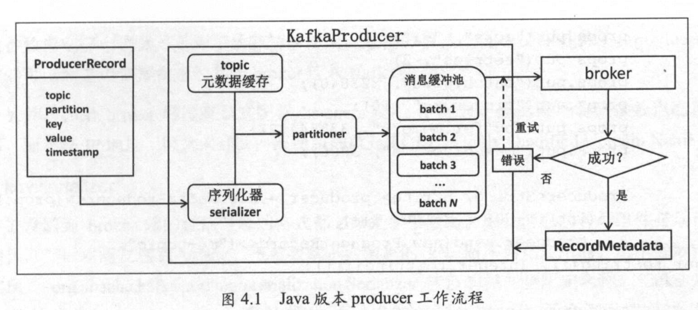

### 2.1 工作流程

- producer用户主线程，将待发送的消息封装进ProduceRecord对象
- 序列化器，将ProduceRecord对象序列化后，发送给分区器partitioner
  - partitioner：用于划分消息被发送到主题的哪个分区。默认分区器时hash消息的key。无key轮询分区。
    - 并且确保相同的key在同一个分区。（TODO坏处：数据倾斜问题？）
    - 一个主题有多个分区，分区作为并行处理单元。
    - 分区在物理存储路径上对应一个目录，格式:${topicName}-${partitionId}
      - 分区目录下是该分区的日志段LogSegment，包括日志数据文件和两个索引文件。
        - 一个日志段对应一个日志文件，索引文件.index和.timeindex分别是消息偏移和消息时间戳索引文件
      - 分区数可以大于节点数，但是副本数不能大于节点数。
  - 用户可以跳过分区器自定义目标分区，或者自定义分区器。
  - 在客户端进行分区选择，比先发给broker端，然后broker路由到master减少一次网络传输开销
- 确定目标分区后，消息先进入到一个消息缓冲队列。
  - 先去队列最后一个位置，不存在或队列满，创建一个新的批记录，再加入队尾
- 另一个工作线程(I/O发送线程，Sender线程)负责实时的从缓存区提取消息，封装进一个batch，统一发送给对于的broker。
  - 目标broker是分区所在的leader副本的broker。
  - 按照节点发送（迭代所有分区，相同节点上的分区统一发送）
- 服务器收到消息后，写入成功，返回RecordMetaData 对象，包含主题，分区，消息在分区的偏移量offset。
  - 失败，生产者会尝试重试，超过重试次数，抛出异常。

生产者的api send方法发送给支持同步和异步两种。

- 同步：等待消息返回成功，发送下一条
  - 实现Futrue.get()
- 异步：直接发下一条，返回消息异步处理(如打印日志，错误重发等)。
  - 传递匿名回调类对象，处理返回结果。new Callbackuk(){}

生产者使用push模型，推送消息给broker。

**消息通信**

为了处理客户端与多个broker节点的消息通信，kafka使用java NIO的选择器模式

生产者客户端只需要使用一个选择器，就可以同时和Kafka集群的多个服务端进行网络通信（监听，轮询）。  

具体内容见kafka技术内幕2.1.4节。

Selector ---(SelectKey)-- SocketChannel (多)

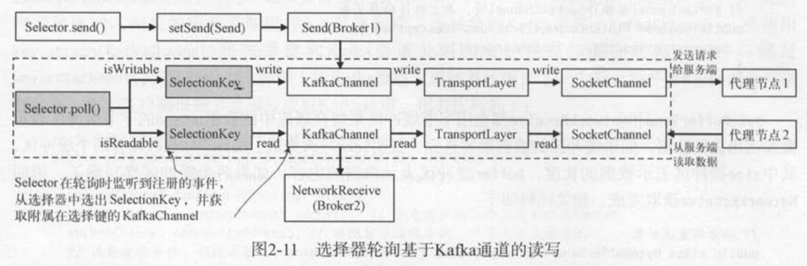

（星环BAR client连接master请求的改进，master备份，恢复，查询请求的处理分开）

### 2.2 无消息丢失配置

消息使用异步发送后，如果生产者宕机，但是消息还在缓冲队列里，就产生数据丢失问题。而同步发送性能太差。

```shell
##### producer端配置
# deprecated,max.block.ms替代了,缓冲区满后阻塞并停止接受新消息，但是不抛出异常
# block.on.buffer.full = true 
# 必须等待所有follower都响应发送消息后才能认为提交成功
acks = all
# 生产者无限重试,只重试可以恢复的异常
retries = MAX_VALUE
# 避免同分区消息乱序，避免消息乱序问题（消息发送顺序与实际存储顺序不一致）。
max.in.flight.requests.per.connection = 1
# 使用KafkaProducer.send(record, callback)
# callback逻辑中显式关闭producer：close(0) ，防止消息乱序
#####　broker端配置
# 不允许非ISR的副本选举为leader，避免broker端因日志水位截断导致消息丢失
unclean.leader.election.enable=false
replication.factor = 3
# 写入成功数
min.insync.replicas = 2
replication.factor > min.insync.replicas
# 消息处理完成之后再提交位移
enable.auto.commit=false
```

### 2.3 消息压缩

用CPU资源换取IO性能（磁盘和网络带宽）。

将一批消息压缩成一条发送，broker存储，消费者自动解压缩。

（更好的性能，Zstandard 压缩算法？）

推荐压缩算法LZ4。

（星环导入导出时，是使用gzip很好，数据量原因？）

性能提升：

多线程处理，推荐多线程多kafkaProducer实例，分区少可以单KafkaProducer。

## 3. 消费者Consumer

读取Kafka数据。自带java版本实现(0.9+)。

#### 消费者组

消费者组consumerGroup：topic的消息只会发送到订阅它的消费者组里面的一个消费者中。

topic的消费可以发送到多个消费者组。

group.id唯一标识一个consumer group。

消费者分组的作用：

- 容错，组内单一消费者挂掉不影响服务
- 提升性能，加快消费速度，横向扩展

(一定程度(分区级别，单个分区内)保证消息处理的顺序性)

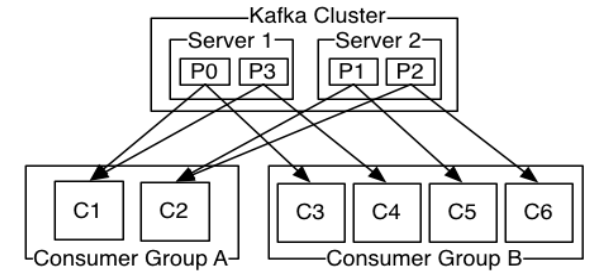

注意：组内消费者数量超过主题的分区数，将导致消费者闲置。

分区所有权从一个消费者转移到另一个消费者——再均衡rebalance。

根据分组的个数，消息模型可以分成：

- 队列模式：所有消费者在一个组里
- 发布/订阅模式：多个消费者组，消息被广播多次。消息平均分配给组里的消费者。

#### push vs. pull

消费者采用pull模式，从broker拉取数据。

- 如果使用broker push模式，缺点在于很难适配不同消费速率的消费者。提升push速度，容易产生拒绝服务和网络拥塞
- pull模式，可以根据消费者消费速度，精细调整。
- 此外，可以批处理消息。
- pull缺点，在于消费者轮询，可能盲等待。

消费端的位移offset，Kafka选择让consumerGroup 保存offset。也有checkpoint。

- broker 无消费者的状态，扩展性增强
- 无需消费者应答，确认消费者消费成功
- 无状态，减去存储压力

**消息轮询**

消费者的工作流程，是在一个无限循环中，处理群组协调，分区再平衡，发送心跳和获取数据。

**消费消息**

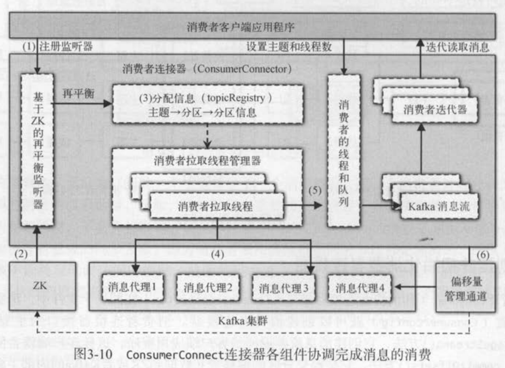

详细见kafka技术内幕 第3，4章。

注意zk已经在2.8取消。

队列作为消息缓存。

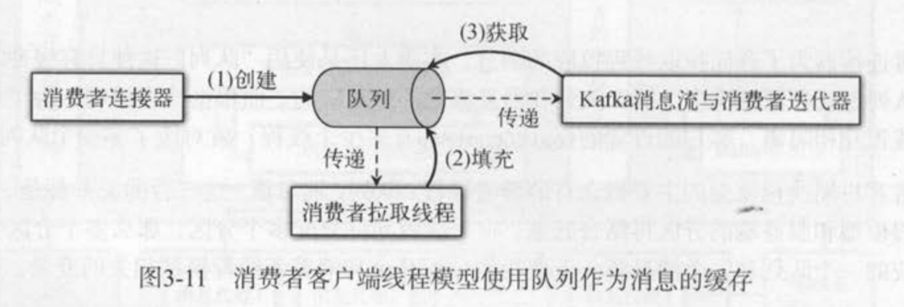

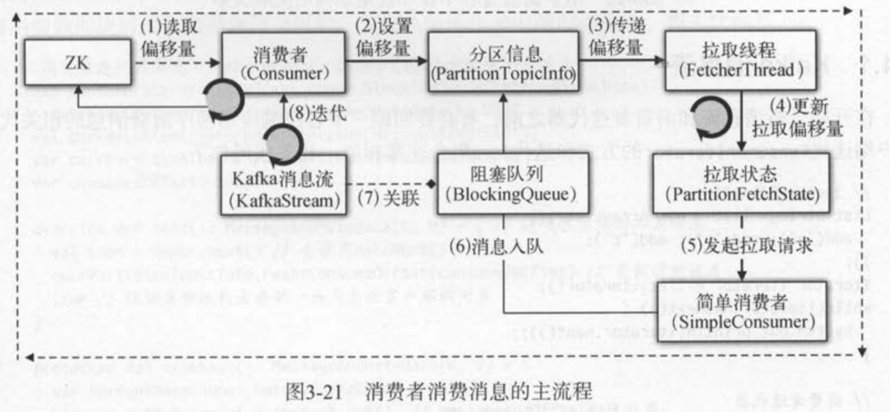

（TODO 新旧API实现考量）

多消费者实现：

- 一个线程一个消费者kafkaConsumer
  - 简单，快，无线程交互开销，offset管理方便
  - socket开销，consumer数受限与分区数，broker端负载高
- 单consumer，多worker(线程池)
  - 消息获取与处理解耦；扩展性好
  - 分区内消息顺序处理问题难；线程异常导致消费数据丢失；offset管理问题

#### 提交

消费者更新分区当前位置的操作 。

broker不负责管理消息的消费情况。

而是kafka自定义了一个内部特殊主题_consumer_offset。消费者会向这个主题发送消息，消息包含每个分区的偏移量。

在消费者崩溃或者新的消费者加入群组，触发再平衡时。消费者可能被分配到新的分区。为了能继续处理新的分区，消费者读取这个分区最后一次提交的偏移量，然后从这里开始继续处理。

提交的偏移量小于客户端处理的最后一个消息的偏移量，导致消息会被重复处理。（相反大于，将导致消息丢失）

##### 自动提交

`enable.auto.commit=true` 默认每过5s。消费者将从poll接收到最大的偏移量提交。自动提交逻辑在轮询内。

缺点：可能重复处理消息。

缓解：减少时间间隔

##### 提交当前偏移量

`auto.commit.offset=false` 应用程序通过commitSync() 提交。

发生再均衡，还是存在消息重复处理。

并且提交时会阻塞，降低吞吐量。

##### 异步提交

commitASync() 不等待broker响应。无阻塞。支持回调方法。

##### 同步和异步组合提交

先异步，产生异常后再使用同步。同步失败，关闭消费者。

##### 提交特定偏移量

不按处理消息的批次频率，批次已处理的，更快提交。

批次中每处理n条(1000)就提交一次。

独立消费者，无需分区、再平衡。

## 4. 消息代理Broker

### 4.1 消息存储

#### 4.1.1 消息结构设计

朴素设计，继承java Serializable，自定义key，value，消息码，压缩编码消息等内容。缺点，java对象存储，空间膨胀（2X+）。

Kafka的消息，使用NIO的ByteBuffer保存。使用文件系统页缓存，非java堆缓存。

（google的PB呢？）

消息格式存在3个版本：V0,V1,V2。

REF: [一文看懂Kafka消息格式的演变-朱小厮](https://mp.weixin.qq.com/s?__biz=MzU0MzQ5MDA0Mw==&mid=2247483983&idx=1&sn=1c2bd11df195f84e5433512f6b2695e8)

### 4.2 存储层

kafka将消息按主题topic进行组织，主题有多个分区（线性扩展，负载均衡），为了保证分区的可用性（容错），分区具有多副本（leader提供服务）。最终消息以commit log提交消息追加方式作为数据存储格式。

消息如果没有key写入和读取顺序一致，如果有相同的key将在后台compaction，只保留最近的一条。

#### 4.2.1 分区和副本

分区包含的信息

- 所属主题引用
- 分区编号
- 主副本引用
- 已经分配给分区的副本AR(Assign Replic)，副本的集合
- 正在同步的副本ISR(In-Sync-Replic)，副本的集合
  - 不是所有的AR都是ISR
  - 只有在ISR集合中的副本才可以被选举为leader副本
  - 只有所以ISR中的副本都收到消息，才会设置消息已提交，以保证不丢失
  - 消息滞后太多的副本，会被kafka踢出ISR

副本包含的信息

- 代理节点编号
- 所属分区引用
- 是否主副本
- 副本关联的本地日志文件引用
  - 非本地的，无日志引用
- 最近提交消息的偏移量
- 日志文件结束位置偏移量

分区逻辑概念下面（一个副本，对应一个日志Log），还有多个日志分段LogSegment（避免log文件越来越大，分段条件：超过1GB/超过滚动创建时间/索引文件满）

LogSegment在物理结构

- 一个数据文件
- 索引文件.index和.timeindex
  - 重新处理消息，随机读取

#### 4.2.2 写日志

很容易理解，写入日志时，任意时刻都只有一个活动的日志分段，并且通过追加文件的方式。

消息的存储

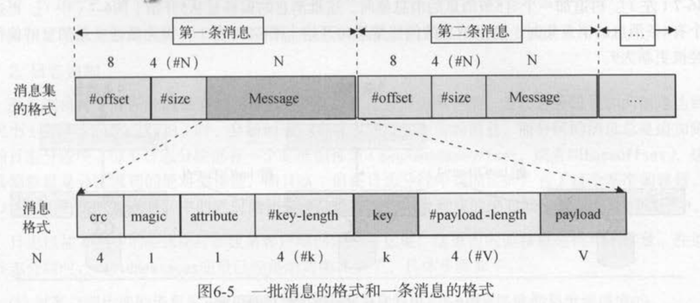

- 偏移：在这一批消息的相对位置，每一批都从0开始
  - 服务端存储时，会计算真正的偏移量。
  - 客户端设置偏移值，也是为了占位，可以直接设置，服务端设置真实偏移不需要修改消息缓冲区大小
- 消息长度：不固定，方便跳过这条消息
- message：具体消息内容。

每次追加一批消息到日志分段时，都会写数据文件，并检查间隔再超过一定字节大小，才会写索引文件。（稀疏索引，非全部消息的索引）

offset索引文件

- 建立消息的绝对偏移量与消息在数据文件中的物理位置的映射。
- 实际存储是相对baseoffSet偏移4字节，物理地址4字节
  - baseoffSet偏移，没个日志段都有一个自己基准偏移量，便于减少索引大小，选择拉取时的日志段

time索引文件

- 时间戳和相对偏移的映射
- 时间戳占用8字节，相对offset占用4字节

#### 4.2.4 读日志

kafka读写的日志都是主副本的日志。

客户端请求服务端消息时，会知道拉取偏移量startOffset和拉取数据量fetchSize（默认1MB）。

读取过程:

根据startOffset，找到日志分段，读取索引文件最近的偏移对应的物理位置；

从最近偏移的数据文件的物理位置开始，根据startOffset，找到对应的startPosition；

根据startPosition，开始读数据，最多读取到maxPosition。

TODO：日志压缩compaction

ISR机制

#### 4.3 请求处理

同样使用reactor模式，一个主线程监听请求，发送到任务队列。处理线程池，处理，处理的结果放入响应队列。

TODO：more

## 5. 高可用设计

### 5.1 成员管理

zookeeper版本：

每个broker启动时，会自己注册到ZK上(/brokers)，json格式存储。

> /brokers：里面保存了 Kafka 集群的所有信息，包括每台 broker 的注册信息，集群上所
> 有 topic 的信息等
> 
> /controller：保存了 Kafka controller 组件的注册信息，同时也负责 controller 的动态选举。
> /admin ：保存管理脚本的输出结果，比如删除 topic ，对分区进行重分配等操作。
> /isr_change_notification：保存 ISR 列表发生变化的分区列表。 controller 会注册一个监
> 听器实时监控该节点下子节点的变更。
> /config ：保存了 Kafka 集群下各种资源的定制化配置信息，比如每个 topic 可能有自己
> 专属的一组配置，那么就保存在／config/topics/<topic＞下。
> /cluster：保存了 Kafka 集群的简要信息，包括集群的 ID 信息和集群版本号。
> /controller_epoch：保存了 controller 组件的版本号 。 Kafka 使用该版本号来隔离无效的
> controller 请求。  

注册的节点是一个临时节点，临时节点的生命周期与客户端会话绑定。broker崩溃，会话失效，临时节点被删除。创建临时节点时，还创建了一个监听器，监听到节点的状态。临时节点被创建/删除，触发监听器，处理broker上下线事务。

其他监听器：主题改变（增删），分区改变（增删）。

TODO

kraft版本：

### 5.2 副本管理

#### 5.2.1 Kafka控制器

Kafka中broker可以竞争选举为控制器角色，控制器是Kafka副本机制的核心组件。

用来处理分区的主副本选举，管理分区状态机，管理副本状态机，管理各种监听器等等。

选举：

每个kroker都会尝试在ZK上创建/controller 临时节点，但只有一个会成功，成功的当选控制器。

控制器宕机后，其他broker会再次尝试这个过程。

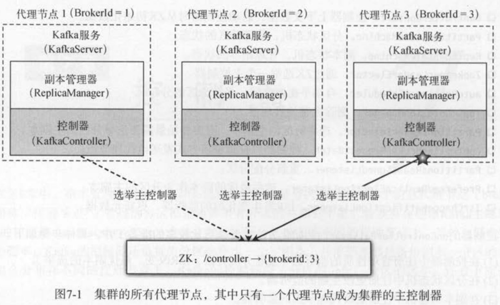

PS：

kafka节点具备成为所有角色的功能，只看是否开启。

这一点，与其他大数据系统，分化出各种角色，形成对比。

这种保留所有能力的设计哲学，符合P2P精神，适用于功能不复杂，允许一定资源损失场景。

这让人联想到生物的细胞分化。干细胞可以分化为肌肉，各个，毛发等细胞，变成单功能性。

或许系统的设计，也可以参考，保留一部分具备所有功能的节点以保障容错性，另一些节点是具体分化的节点，无法再分化为其他类型的节点。

#### 5.2.2 分区状态机和副本状态机

分区状态机和副本状态机，分别管理集群的所有分区和副本状态。

状态：新建new，在线online，下线offline，不存在。

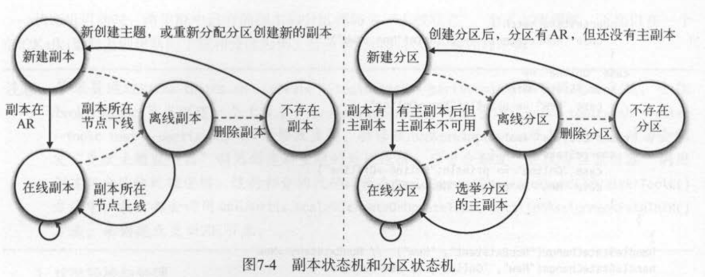

#### 5.2.3 副本leader选举

触发1：

- 创建分区（创建主题，新增分区）

- 分区上线（原leader副本下线）

（优先副本）选举：

遍历AR集合中第一个存活的副本，并且这个副本在ISR集合。（如果配置运行从非ISR中选举，那么ISR中没有可用的副本，AR第一个存活的副本就是leader）（分区平衡）

优先副本：

- AR集合列表中第一个副本
- kafka保证所有主题优先副本在集群均匀分布，就可以保证所有分区的leader分布均衡

分区平衡，不意味着负载均衡，可能分区在集群的分配不均衡，分区leader副本的负载也可能不同，导致负载不均和。

触发2：

- 分区重新分配
  - leader节点宕机，follower节点成为新leader，导致集群负载不均衡，影响集群健壮性和稳定性
  - 新增broker，也不会将原主题的分区分配到新节点，只有新主题分区才会被分配到这个节点，也导致负载不均衡
  - 原理：先通过控制器增加副本因子，新副本从leader拷贝数据，完成后，控制器删除旧副本，恢复原来的副本因子。

选举：

从重分配的AR列表中找到第一个存活副本，并且这个副本再目前的ISR列表中。

触发3：

- 节点(优雅)下线
  - 这个节点leader副本都下线，对应分区副本需要选举

选举：

从AR列表找到第一个存活的副本，并且这个副本再目前的ISR列表中，还要保证这个副本不出于正在关闭的节点上。

（TODO：副本选举，还需要更进一步了解，AR变化，执行过程时机；这一套选举流程，也是所有多副本存储系统选举都需要处理的问题）

#### 5.2.3 follower副本同步

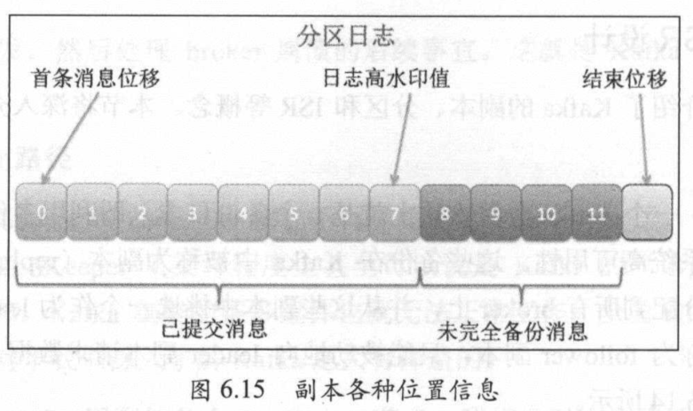

- 起始偏移base offset: 该副本当前所含第一条消息的offset
- High watermak，HW： 副本高水印值。该副本最新一条已提交消息的偏移。
  - leader副本的HW值决定了副本已提交消息的范围，consumer消费的上限
  - follower副本也有HW值
- 日志末端偏移log end offset，LEO：副本日志中下一条**待写入**（日志）消息的偏移。
  - 每个副本维护自己的LEO
  - ISR中所有副本更新对应LEO后，leader副本才右移HW。

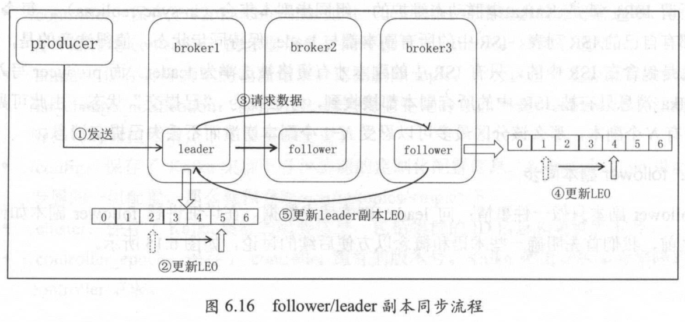

基于HW同步机制的缺陷

(1) 数据丢失

leader回复已经写好，follower的HW未来得及更新，重启LEO退回前HW，leader又宕机，导致HW跟随回退，从而丢失数据。（followerHW也更新再回复客户端？）

(2)数据不一致

leader A HW2，follower B HW1，同时挂掉，然后 B重启成为leader，接收消息HW 2，A重启，本应该截断，但是HW 也是2，导致数据不一致。

0.11.0.0 版本引入 leader epoch值 （参考了raft的任期概念？）

详细见apache kafka实战-胡夕 6.1.4.4 节。

## 6. 高性能设计

### 6.1 顺序读写磁盘批量消息追加日志文件。

顺序消费日志中的消息。

### 6.2 使用PageCache

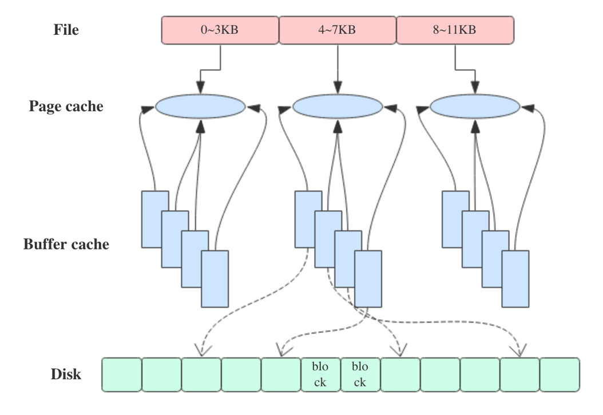

- page cache & buffer cache
  
  - page cache用于缓存文件的页数据，buffer cache用于缓存块设备（如磁盘）的块数据
  - Linux2.4后合并（free -m）

- block size大小为1KB

- page size大小为4KB

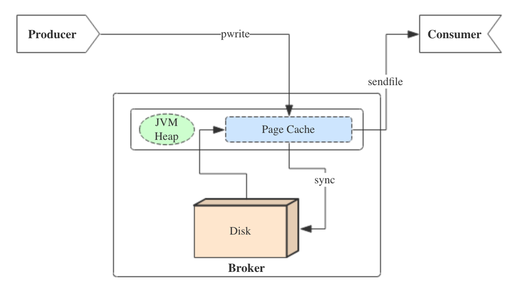

- Pwrite
  
  - FileChannel.write()

- 写message
  
  - 消息从java堆转入page cache(即物理内存)。
  - 由异步线程刷盘，消息从page cache刷入磁盘。（linux刷盘未成功前，不应该提交消息）

- 读message
  
  - 消息直接从page cache转入socket发送出去。
  - 当从page cache没有找到相应数据时，此时会产生磁盘IO，从磁盘Load消息到page cache，然后直接从socket发出去

- PageCahe优势
  
  - 减少java对象包装开销
  - 减轻jvm GC
  - Kafka崩溃，不影响pagecahe，不丢缓存

生成和消费速度合适时，消息的接受与发送，全在pagecache中，达到内存交换的速度。

### 6.3 零拷贝

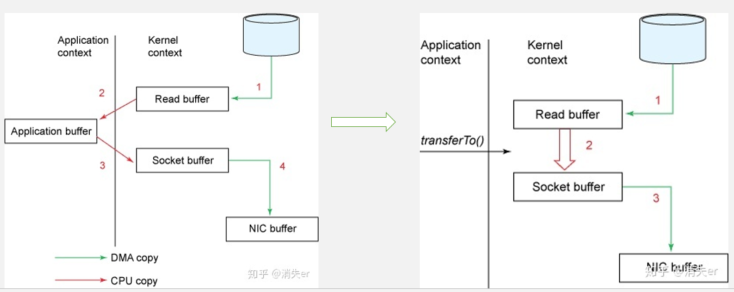

buffer = File.read 

Socket.send(buffer)  => FileChannel.transferTo()/transferFrom() 

原始方式的4次拷贝(同时伴随着4次上下文切换，用户态与内核态)：

- 系统调用将文件数据读入到内核态 Buffer（DMA 拷贝）
  - 用户态到内核态
- 应用程序将内核态Buffer数据读入到用户态Buffer（CPU 拷贝）
  - 内核态到用户态
- 用户程序通过Socket发送数据时将用户态Buffer数据拷贝到内核态 Buffer（CPU拷贝）
  - 用户态到内核态
- 通过DMA拷贝将数据拷贝到 NIC Buffer
  - 下一个周期处理，内核态到用户态

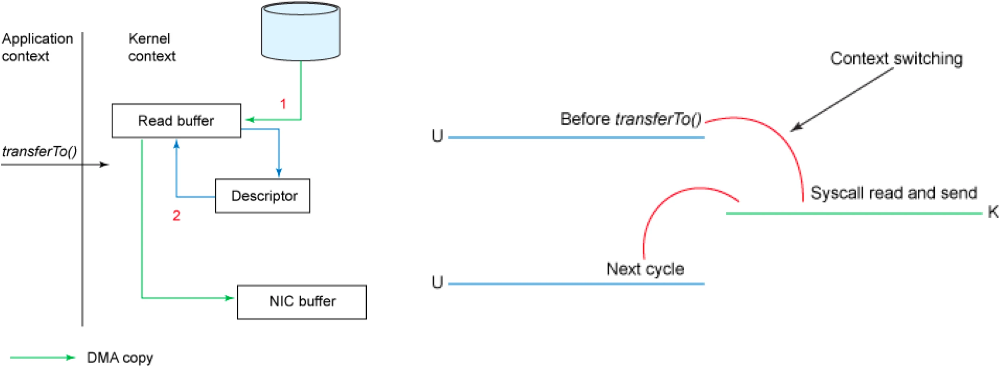

零拷贝（无CPU拷贝，2次上下文切换）：

- 数据通过DMA拷贝到内核态Buffer （DMA 拷贝）
- 通过DMA拷贝将数据拷贝到 NIC Buffer

整个读文件-网络发送由一个 sendfile 调用完成。

REF: [Kafka 设计解析（六）：Kafka 高性能关键技术解析](https://www.infoq.cn/article/kafka-analysis-part-6)

### 6.4 减少网络开销

#### 6.4.1 消息批处理

消息的批量发送

#### 6.4.2 数据压缩

消息单独压缩，消息批量压缩。消息压缩存储。

#### 6.4.3 序列化

自定义消息kv的SerDe，使用快速，更紧凑格式。

## 7.运维

### 7.1 监控指标

#### 7.1.1 broker 度量指标

**非同步分区数量**

作为leader的broker有多少个分区出于非同步状态。

broker崩溃、资源不足，硬件问题(disk，network)。

集群问题

- 负载不均衡
  - 定位：
    - 分区数量
    - leader分区数量
    - topic流入字节速率
    - topic流入消息字节速率
- 资源过度消耗（容量瓶颈）
  - 定位
    - CPU使用
    - 网络输入吞吐量
    - 网络输出吞吐量
    - 磁盘平均等待时间
    - 磁盘使用百分比

主机问题。单个broker。

- 硬件问题
  - dmesg查看内核缓存区日志
  - 磁盘故障
  - SMART工具监控和测试磁盘
  - 网络配置，路由问题
- 进程冲突
- 本地配置不一致

**活跃控制器数量**

集群应该只有一个为1，其余为0

**请求处理器空闲率**

- 网络处理器线程池
  - 网络IO
- 请求处理器线程池
  - disk IO
  - 一般数量与处理器核数一致
  - 数值越低，负载越高

**主题流入/出字节**

**主题流入/出消息**

**分区数量**

**leader数量**

各broker应该均衡。

**离线分区**

**请求度量指标**

各类请求的指标，如整个事件，队列事件，每秒请求数等。

### 7.2 主题和分区的度量指标

**主题、分区实例的度量指标**

集群整体的情况。

### 7.3 JVM指标

**GC**

Full GC、Yong GC 次数，时间

**FD当前数量和最大值**

每一个logsegment和网络连接都会打开一个FD文件描述符

网络连接未正常关闭，导致FD消耗光。

### 7.4 操作系统指标

CPU 的使用 、 内存的使用、磁盘的使用、磁盘 IO 和网络的使用。

内存，长期占用的较小，更多是缓存，一般不担心。

主要关心的是磁盘。监控磁盘的每秒种读写速度、读写平均队列大小、平均等待时间和磁盘的使用百分比 。  

网络IO，由于副本复制关系，流入流量很容易比输出流量高出一个数量级 。

### 7.5 日志

控制器日志kafka.controller，INFO级别，主题创建，修改，broker状态变更，副本选取，分区移动信息。

ClientQuotaManager日志，INFO级别，与生产和消费配额活动相关的信息  。

kafka.log.LogCleaner,kafka.log.Cleaner,kafka.log.LogCleanerManager, 可以默认开始DEBUG，日志的compaction线程运行状态。

调试时：

kafka.request.logger,DEBUG/TRACE，发送给broker的每个请求详细信息。

### 7.6 客户端监控

#### 7.6.1 生产者

**生产者整体度量指标** 

record-error-rate: 一般为0，非零，说明生产者正在丢弃无法发送的消息。告警指标。

request-latency-avg: 生产者请求发送到broker的平均时间。告警指标。

outgoing-byte-rate:每秒消息字节数

record-send-rate:每秒消息数量

request-rate:每秒请求数。

records-per-request-avg:单个请求包含消息的平均数。

record-queue-time-avg：消息发送给broker前，在生产者端平均等待毫秒数。

触发生产者发送请求。

- 一批消息满
- 发送间隔超时

**Per-broker和Per-topic度量指标**

与每个broker连接，主题的度量指标。

用于调试问题。

request-latency-avg

#### 7.6.1 消费者

**Fetch Manager度量指标**

fetch-latency-avg：消费者向broker发送请求需要的平均时间。告警指标。

bytes-consumed-rate:客户端每秒读取字节数

records-consumed-rate:客户端每秒读取消息数

**Per-broker和Per-topic度量指标**

request-latency-avg

**Coordinator度量指标**

消费者群组，协调者。

sync-time-avg:同步活动平均毫秒数。

sync-rate:没秒钟群组同步次数。

commit-latency-avg:提交偏移量平均时间

assigned-partitions: 分配给消费者客户端的分区数量。识别负载不均衡。

### 7.7 管理工具

- **[Kafka Manager](https://github.com/yahoo/kafka-manager)** - A tool for managing Apache Kafka.
- [kafkat](https://github.com/airbnb/kafkat) - Simplified command-line administration for Kafka brokers.
- [Kafka Web Console](https://github.com/claudemamo/kafka-web-console) - Displays information about your Kafka cluster including which nodes are up and what topics they host data for.
- [**Kafka Offset Monitor**](http://quantifind.github.io/KafkaOffsetMonitor/) - Displays the state of all consumers and how far behind the head of the stream they are.
- [Capillary](https://github.com/keenlabs/capillary) – Displays the state and deltas of Kafka-based [Apache Storm](https://storm.incubator.apache.org/) topologies. Supports Kafka >= 0.8. It also provides an API for fetching this information for monitoring purposes.
- [Doctor Kafka](https://github.com/pinterest/doctorkafka) - Service for cluster auto healing and workload balancing.
- [Cruise Control](https://github.com/linkedin/cruise-control) - Fully automate the dynamic workload rebalance and self-healing of a Kafka cluster.
- [Burrow](https://github.com/linkedin/Burrow) - Monitoring companion that provides consumer lag checking as a service without the need for specifying thresholds.
- [Chaperone](https://github.com/uber/chaperone) - An audit system that monitors the completeness and latency of data stream.
- [Sematext](https://sematext.com/) integration for [Kafka monitoring](https://sematext.com/docs/integration/kafka/) that collects and charts 200+ Kafka metrics

REF: https://cwiki.apache.org/confluence/display/KAFKA/Ecosystem

集群同步工具MirrorMaker

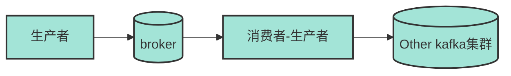

uReplicator

### 7.8 性能调优

选择合适的分区数

TODO

## 8. 流处理

kafka为每一个流出处理框架提供了**可靠的数据来源**（像数据库一样持久化数据），并且提供了强大的**流式处理类库**（低级的Processor API，高级流式DSL），作为客户端类库的一部分。允许应用程序读取、处理和生成事件，不必依赖外部处理框架。

kafka自己处理processor节点在Kafka集群上的部署和管理，高可用等问题。（相对于其他框架Storm，sparkStreaming，flink，需要集群管理框架如yarn，数据本地性会更好？）

### 8.1 流式处理

**数据流/事件流/流数据**：无边界数据集的抽象表示。随着事件推移，数据集中的新纪录不断增加。

- 有序的
  - 事件发生有先后顺序（时间戳）
- 不可变的数据记录
  - 事件一旦发生，不可改变。交易取消，实际是发生交易事件，再增加取消交易事件。
- 可重播
  - 业务需要重新分析（审计）历史事件流。

**流式处理**是指实时地处理一个或多个事件流。 编程范式。

- 请求与响应范式
  - 延迟最小。毫秒级。OLTP。阻塞等待结果。
- 批处理范式
  - 高延迟，高吞吐。OLAP。
- 流式处理
  - 介于两者之间。不要求亚毫秒，也无接受几天。
  - 业务报告需要持续更新。
  - 持续性，非阻塞。
- 流的处理大小
  - 一条一条的处理
    - Storm，Kafka
  - 一次一批
    - SparkStreaming

#### 8.1.1 概念

**时间**

- 事件时间
  - 指所追踪事件的发生时间和记录的创建时间 
- 日志追加时间
  - 指事件保存到 broker 的时间
  - 事件发生时间未记录，采样日志追加时间
- 处理时间
  - 指应用程序在收到事件之后要对其进行处理的时间

**状态**

事件与事件之间的信息。（每小时各类型事件个数，需要合并的事件。）

- 本地状态或内部状态
  - 只能被单个应用程序实例访问 ，一般使用内嵌在应用程序里的数据库进行维护和管理
  - 优点：速度
  - 缺点：受内存大小限制
- 外部状态
  - 使用外部的数据存储来维护，如NoSQL系统Cassadra
  - 优点：无大小限制，可被多个应用程序访问
  - 缺点：增加延迟。复杂性。

**流与表的二元性**

流包含了变更。

- 表转化为流
  
  - 将insert，update，delete事件写到流中。数据库捕捉变更CDC（change data capture）。kafka连接器将这些变更发送到kafka，产生流。

- 流转化为表
  
  - “应用”流中的所有变更，“物化”。先在 内存里 、 内部状态存储或外部数据库里创建一个表，然后从头到尾遍历流里的所有事件，逐个地改变状态。  

**时间窗口**

大部分针对流的操作都是基于时间窗口。移动平均数、 一周内销量最好的产品、系统的 99 百分位等。

两个流的合并。合并相同时间片段的事件。

- 窗口大小
- 窗口移动频率，“移动间隔”
- 可更新时间
  - 晚到事件的处理

### 8.2 流式处理的设计模式

- 单事件处理
  - map、ilter模式
- 使用本地状态
  - 基于时间窗口的聚合，维护流的状态，本地
    - 状态的内存使用，持久化，分区再均衡的处理
- 多阶段处理和重分区
  - 全局状态，多阶段处理
- 外部查找——流表连接
  - 点击事件与用户信息表的关联
  - 将数据库信息缓存到流处理应用程序中
    - 缓存一致性管理
    - 数据表转换为流
- 流流连接
  - 基于时间窗口的连接  ，两个流里具有相同键和发生在相同时间窗口内的事件匹配；用户搜索事件流，用户搜索结果点击事件流
- 乱序事件
- 重新处理

场景例子：

字数统计，股票市场统计

信用卡欺诈，异常行为检测，网络入侵检测。

### 8.3 连接器

为了解决不同系统之间的数据同步（**数据导入/导出**）， Kafka连接器用一个标准框架来解决这些问题。

解决的故障容错、分区扩展、偏移量管理、发送语义（正好一次，至少一次，至多一次）、管理和监控等问题。

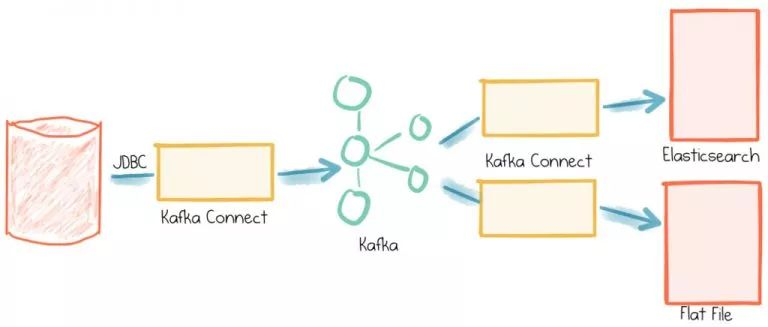

TODO：架构模型，实现，单机模式，分布式模式

### 8.4 流处理框架

#### 8.4.1 低级 Processor API

- 构建流处理拓扑：添加源处理节点。业务处理节点，目标处理节点
  - DAG图
  - 自定义处理器
  - 状态存储
- 创建KafkaStreams流处理实例
- 启动实例
  - 运行模式：单机模式，分布式模式

#### 8.4.2 高级流式DSL

- 内置了常用的流处理算子操作 ， 比如映射 、过滤、选择键、分组、分支和遍历等
- 支持有状态算子操作，count，REduce，Aggregate，Windows。
- 区分记录流record stream，变更流changelog stream
  - 对应Kstream，KTable

**Kafka流处理线程模型**

- 流实例KafkaStrreams：一个节点一个实例
  - 流线程StreamThread：一个流实例可以配置多个流线程
    - 流任务StreamTask：一个流线程可以处理多个流任务，主题的分区数为任务数。

### 8.5 Kafka流的起源

#### 8.5.1 从MR获得的启示

- 将数据分布在整个集群，以达到规模处理
  - 是问题可计算，数据可处理
- 使用KV对和分区，将数据组合在一起
  - KV简单数据结构，分散的数据可管理，可重新组合（关键在于key）
- 不是避免失败failure，而是通过副本允许失败（容错）
  - 磁盘，服务器故障问题，不需要昂贵的稳定硬件（硬件问题，软件解决）

#### 8.5.1 批处理MR的局限

- IO开销，导致的实时性问题
- 短时间趋势
- 数据处理跟上数据生产的速度

流处理：数据到达时立即报告或采取行动

（推荐系统，及时响应事件，反馈新的推荐）

（叠处理器，处理事件流，数据库火山处理模型？）

(游戏/云游戏的应用：用户点击/操作事件，事件流，流处理+副本一致性+状态机应用？)

## 9. 高级特性

TODO：

事务，幂等性

## REF

- Kafka权威指南 （设计动机，如何推导出设计的）
- Kafka stream实战-(英) （如何用kafka stream 设计Zmark 用户购买系统）
- Kafka 技术内幕-郑奇煌 （源码分析，完整架构细节实现）
- Kafka源码解析与实战-王亮 (源码分析比例最重，分析源码时再看，与内幕相互补充)
- Apache Kafka 实战-胡夕 (kafka1.0.0，带有一定使用上的介绍) 
