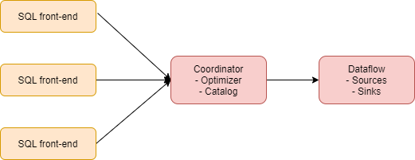
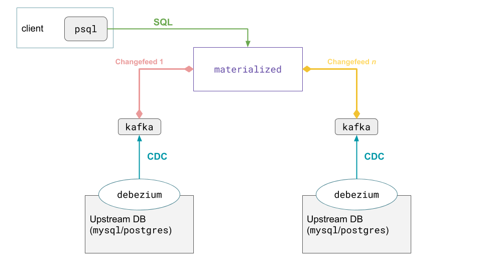
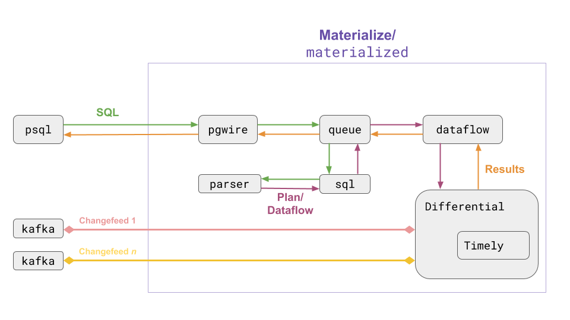

# Materialize-笔记

## 1. 简介

Materialize 是用于实时应用程序的**流式数据库**，当前还在活跃状态中。同类[noria](https://github.com/mit-pdos/noria)（原型系统，未继续在开发），[Timely Dataflow](https://github.com/TimelyDataflow/timely-dataflow) ，[Differential Dataflow](https://github.com/timelydataflow/differential-dataflow/blob/master/differentialdataflow.pdf) ，[Singularity data](https://www.singularity-data.com/)。

功能上与stream + OLAP的实时数仓（Flink）很接近，但是背后的实现原理，具有更强的流处理理论的指导。类似竟品 [risingwave](https://github.com/risingwavelabs/risingwave)

特点：

- rust编写

## 2.原理

### 2.1 Timely Dataflow
一种低延迟的循环数据流计算模型。

### 2.2 Materialize 架构

## REF

- [github:materialize](https://github.com/MaterializeInc/materialize)
- [slides:noria](https://www.usenix.org/sites/default/files/conference/protected-files/osdi18_slides_gjengset.pdf) osdi 2018
- Johansson, T., & Bergvik, A. (1975). Naiad: A Timely Dataflow System Derek. Acta Neurologica Scandinavica, 52(1), 63–70. https://doi.org/10.1111/j.1600-0404.1975.tb02828.x sosp2013
- [slides:Naiad](https://www.cl.cam.ac.uk/~ey204/teaching/ACS/R212_2013_2014/presentation/S2/Derek_NAIAD.pptx)
- [paper:noria](https://www.usenix.org/system/files/osdi18-gjengset.pdf) Noria: dynamic, partially-stateful data-flow for high-performance web applications
- [【论文】Dataflow 模型：一种能平衡准确性、延迟、成本的大规模、无限、乱序的数据处理的实践方法](https://zhuanlan.zhihu.com/p/59876058)

- [materialize blog](https://materialize.com/blog/)