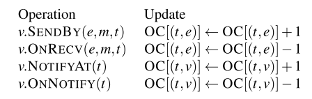

Naiad A Timely Dataflow System 论文笔记

[TOC]

## 1. 背景

Naiad 是一个分布式系统，用于执行数据并行、循环数据流程序。它提供了**批处理器的高吞吐量**、**流处理器的低延迟**以及**执行迭代**和**增量计算**的能力。


现有系统，需要依赖于多个平台，以牺牲效率、可维护性和简单性为代价。

- 流处理系统可以为非迭代算法产生低延迟结果
  - 不适合数据重算
- 批处理系统以延迟为代价进行同步迭代
- 基于触发器的方法仅支持弱一致性保证的迭代


组合多个现有系统（类似lamda架构，一个大数据平台），可以完成功能，但是，单一系统，会更加高效，简洁，易维护。


于是，提出一个新的计算模型，A Timely Dataflow，通过Naiad 的低级原语，完成：

- 流数据分析
- 迭代机器学习
- 交互式图形挖掘


Naiad 特性：

- 允许在数据流中进行反馈的结构化循环
  - 支持低延迟执行迭代
- 能够在没有全局协调的情况下消费和生成记录的有状态数据流顶点
  - 支持进行增量计算
- 在接收到给定一轮输入或循环迭代的所有记录后通知顶点
  - （精确一次？）
  - 保证计算的输出和中间阶段产生一致的结果


数据流图

- 有向
- 支持循环
- 有状态的顶点异步接收全局进度的消息和通知
- 边携带带有逻辑时间戳的记录，可以衡量全局进度
  - 逻辑时间戳反映了图拓扑中的结构
    - 循环，跟踪进度


挑战：

- 以低开销协调分布式进程
- 设计系统以避免停顿
  - 锁争用，丢弃的数据包和垃圾回收


## 2. Timely dataflow 及时数据流

及时数据流是一种基于**有向图**的计算模型，有状态的**顶点**沿着**有向边**发送和接收带有逻辑时间戳的**消息**。

### 2.1 图结构

顶点Vertice

- 输入顶点
  - 从外部生产者接收一系列消息
    - 外部生产者给每条消息加上一个integer的epoch（时期，纪元，代表一段时间）
    - 并且会通知输入顶点，某个epoch的消息是否已经没有了
    - 生产者也可以`close` 一个输入顶点来表示某个epoch已经没有任何新消息
- 输出顶点
  - 将一系列消息发送回外部消费者
    - 每条输出消息都标有其epoch
    - 并且，当所有输出完成时，输出顶点会通知外部消费者，不再输出该epoch的消息

循环上下文loop context：


- 入口顶点（I，ingress）
  - 只能通过入口顶点进入循环上下文
- 出口顶点（E，egress）
  - 只能通过出口顶点离开循环上下文
- 反馈顶点（F，Feedback）
  - 未嵌套在任何内部循环上下文
  - 至少有一个


逻辑时间戳：

- 每条消息都带有一个逻辑时间戳
- 时间戳格式
  - `e` 是epoch，integer
  - `<C1,...Ck> ∈ N^k ` loop counters循环计数器
    - 区分不同的迭代
    - 跟踪数据流图处理状态（全部循环上下文处理完毕，最后输出的消息，循环计数器应该是空集，只剩epoch）
  - k一个数据流图中的循环上下文个数

顶点对逻辑时间戳的处理：


- 输入顶点
  - 增加一个循环计数器，从0开始
- 输入顶点
  - 删除队尾的循环计数器
- 反馈顶点
  - 队尾的循环计数器加1

时间戳的比较

`t1 = (x1,c1) ` <=  `t2 = (x2,c2)`  当且仅当 `x1 <= x2 && c1 <= c2`


### 2.2 顶点计算

- 回调方法（继承顶点的类需要实现的方法，默认为空）
  - `v.OnRecv(e:Edge, m:Message, t:Timestamp)`
    - 接受到消息时被回调
  - `v.OnNotify(t:Timestamp)`
    - 接受到生产者通知epoch 结束？
    - 表示对于顶点v，t的所有工作以及完成
    - 表示具有给定时间（或更早）的所有消息都已传递
  - 约束：`OnRecv` 和 `OnNotify` 处理的时间戳必须顺序执行，保证没有任何Timestamp先执行了OnNotify再OnRecv，保证消息顺序处理
- 主动方法
  - `tihis.sendBy(e:Edge, m:Message, t:Timestamp)`
    - 发送消息 u -> v， 导致v产生回调`OnRecv()`
  - `this.notifyAt(t:Timestamp)`
    - v 调用通知，导致v产生回调`OnNotify()` ？
    - 通知消费者，epoch结束？
    - 在传递给定时间或更早的所有消息后请求通知
      - 通知请求放入调度器队列

```scala
// 计算不同值个数的顶点
class DistinctCount<S,T> : Vertex<T> {
    // 存储的状态，key：时间， value：<消息,次数>的map
    Dictionary<T, Dictionary<S,int>> counts; 
    // 实现OnRecv回调方法，一个输入顶点
    void OnRecv(Edge e, S msg, T time) {
        // 检查时间是否存在，不存储添加
        if (!counts.ContainsKey(time)) {
            counts[time] = new Dictionary<S,int>();
            // 新的epoch，通知time之前的已经结束
            this.NotifyAt(time);
        }
        // 检查消息是否存在，不存在添加，并传递
        if (!counts[time].ContainsKey(msg)) {
            counts[time][msg] = 0;
            // 将消息发送到下一个顶点处理，输出顶点1，不同元素的集合
            // 低延迟获取结果
            this.SendBy(output1, msg, time);
        }
        // 消息出现次数+1
        counts[time][msg]++;
    }
    // 实现OnNotify回调方法
    void OnNotify(T time) {
        // 遍历所有time的消息，输出结果
        foreach (var pair in counts[time]) {
            // 输出顶点2，map，元素和频率
            // 延迟，精确的获取计数频率
        	this.SendBy(output2, pair, time); 
        }
        // GC,释放本地空间
        counts.Remove(time);
    }
}
```

 REF 

- [Vertex class](http://microsoftresearch.github.io/Naiad/html/T_Microsoft_Research_Naiad_Dataflow_Vertex_1.htm) API
- [Github: Naiad](https://github.com/MicrosoftResearch/Naiad)


为了正确的传递通知，及时的数据流系统必须推断未来消息不可能带有给定的时间戳。

- 即消息或者通知可能乱序到达下一个顶点，及时流系统，需要保证传递通知是正确顺序到达的，或者是正确顺序处理的。


正在执行的顶点，未来的消息的约束：

- 当前未处理事件集
  - 消息message
  - 通知notify
- 图结构

通过计算未处理事件集的时间戳下限，来确保产生正确的通知。


Pointstamp 点戳：

- 事件/消息的时间戳和位置
- Pointstamp结构：
- 例子
  - `v.sendBy(e,m,t)` 消息m的Pointstamp 是 `(t,e)`
  - `v.notifyAt(t)` 通知的Pointstamp 是`(t,v)`


通知会产生新的epoch，即顶点  (t1, l1) can-result-in (t2, l2) 

- 当且仅当存在路径 ψ = <l1, . . , l2> 在数据流图中，使得根据该路径上发生的每个入口、出口或反馈顶点调整 t1 产生的时间戳 ψ(t1) 满足 ψ(t1) ≤ t2。

... 暂时略过这段算法

(TODO 理解 通知的正确处理)


单线程调度器，传递事件机制：

- 调度器维护一组活动点戳，这些点戳对应于至少一个未处理的事件
  - 每个活动点戳，调度程序维护两个计数
    - occurrence count 未完成事件带有点戳计数器
    - precursor count 在可能结果顺序中在它之前有多少活动点戳的前导计数器
  - 计数器更新
    - `sendby` 和 `notifyat` 调用开始时更新
    - `onrecv` 和 `onnotify` 调用完成时更新
    - 

当计算开始时，系统在每个输入顶点的位置初始化一个活动点戳，用第一个epoch打上时间戳，出现计数为 1，前驱计数为 0。

当一个纪元 e 被标记为完成时，输入顶点为 e + 1 添加一个新的活动点戳，然后删除 e 的点戳，允许为纪元 e 传递下游通知。

点戳活动状态：

- 当点标记 p 变为活动时，调度程序将其先驱计数初始化为可能导致 p 的现有活动点标记的数量

- 当它的出现计数下降到零时，点戳 p 离开活动集

（PS：论文不够细节详细，再结合slides，推测保证消息能够顺序处理，似乎是通过调度器全局汇总各节点处理状态，即节点的OC[(t,e)] =0 时，可以认为所有节点都完成onrecv了消息，可以安全的执行onnotify消息了。）


## 3. 分布式执行引擎

Naiad 作为及时数据流的高性能分布式实现。

架构：


- 进程组
  - 多个worker，管理一部分数据流中的分区（实际每个worker再细分处理的分区）
    - worker 间通过共享内存，交换消息
      - 具有调度器，维护活动点戳状态
  - 进程间通过基于tcp/ip的分布式进度跟踪协议，协调通知的传递

### 3.1 数据并行化

分区函数，对消息分区到各个顶点


### 3.2 workers

根据点戳大小，优先发送小的消息，减少延迟

workers间通过共享队列，在一个顶点只有一个线程内执行。


### 3.3 分布式进度跟踪协议


### 3.4 容错和高可用

每个顶点可以定义checkpoint()，在失败时Restore()。系统会根据需要调用这些接口以在所有workers之间生成一致的检查点。（定期停机，每个顶点执行写检查点）

顶点是有状态的，导致无法向spark/MR 重新执行任务，任何节点失败，Naiad必须停止所有节点并从最后一个全系统检查点恢复。


### 3.5 延迟处理

优化--防止微掉队Micro-Stragglers

- 针对此工作负载调优TCP（例如，减少重传超时）
  - 延迟确认超时减少到 20 毫秒
- 调整GC以减少停止世界的次数
  - 使用缓冲池来回收消息缓冲区和瞬态算子状态
  - 使用值类型，将一组值类型对象分配为具有单个指针的单个内存区域
- 共享内存争用，并发队列和轻量级自旋锁
  - 休眠 1 毫秒来，默认15.6 ms
  - 保持消息队列小

## 4. Naiad开发

- 定义一个数据流图
  - 输入阶段
  - 计算阶段
  - 输出阶段
- 重复向输入stage提供数据

LINQ风格的增量计算例子:

```scala
// 1a. Define input stages for the dataflow. 
var input = controller.NewInput<string>();
// 1b. Define the timely dataflow graph. 
// Here, we use LINQ to implement MapReduce. 
var result = input.SelectMany(y => map(y)) .GroupBy(y => key(y), (k, vs) => reduce(k, vs));
// 1c. Define output callbacks for each epoch 
result.Subscribe(result => { ... });

// 2. Supply input data to the query. 
input.OnNext(/* 1st epoch data */); 
input.OnNext(/* 2nd epoch data */); 
input.OnNext(/* 3rd epoch data */);
// 输出消息，并关闭计算
input.OnCompleted();
```


## 5. 实验

### 5.1 吞吐


a) 一个循环数据流，该数据流重复执行固定数量记录的全对全数据交换。

- Ideal 理论网络带宽支持聚合吞吐
- .NET Socket
  -  64KB 消息，TCP连接
- Naiad
  - 进程间，8B大小的消息，50M / node

结论：Naiad 的吞吐量能力呈线性扩展，尽管，记录过小存在序列化，分区计算的开销

### 5.2 延迟

测试全局协调所需的最短时间

b) 一个简单的循环数据流图，但在这种情况下，顶点不交换数据，只是请求和接收完整性通知。

结论：迭代的中位时间仍然很小，为 753 微秒，但是95% 分位数，随节点数增加而增加。

作者认为，实际生产中，请求完成通知的阶段中的顶点子集可能相对较小，所以可以协调成本可以降低。

### 5.3 扩展性

c) 测试§3.3 中描述的进度跟踪协议的优化


结果：

优化将协议流量减少一个或两个数量级。

具体取决于累积是在节点级别（“LocalAcc”）、集群级别（“GlobalAcc”）还是两者兼而有之

实践中，节点级别，即可以放在进度跟踪流量成为瓶颈。

> 虽然我们没有通过实验观察到它，但我们知道当前的协议可能会限制可扩展性，并预计更深的积累和分发树将有助于在更大的集群中更有效地传播进度更新。


d)  wordcount 测试线性扩展， 随机图上的弱连通分量计算WCC扩展性弱一点。

e) 弱缩放 todo


### 5.4 真实负载


Naiad 与最先进的分布式机器学习自定义实现具有竞争力，并且编程非常简单。


## 6.相关工作

- dataflow
  - CIEL, Spark Streaming,Optimus 扩展非循环批处理数据流，允许动态修改数据流图，从而支持迭代和增量计算而不向数据流添加周期
    - 优点：继承容错和并行恢复
    - 缺点：需要数据流图进行集中修改，导致延迟开销，1s左右的增量更新，而Naiad只需要几十毫秒内迭代和执行增量更新
  - 流处理系统，延迟可以满足，可以实现阻塞运算符，例如 GROUP BY，但是缺少迭代功能
- 异步计算
  - 异步更新分布式共享数据结构的模型，以实现低延迟增量更新和细粒度计算依赖
  - Percolator等
  - 缺点
    - 不是为了执行数据流图而设计，缺乏完整性通知使得编写异步计算变得困难


## REF

- Johansson, T., & Bergvik, A. (1975). Naiad: A Timely Dataflow System Derek. Acta Neurologica Scandinavica, 52(1), 63–70. https://doi.org/10.1111/j.1600-0404.1975.tb02828.x 2013
- [slides: naiad](https://cs.stanford.edu/~matei/courses/2015/6.S897/slides/naiad.pdf)  Matei Zaharia, stamford  6.S89, 2015
- [Github: Naiad](https://github.com/MicrosoftResearch/Naiad)

