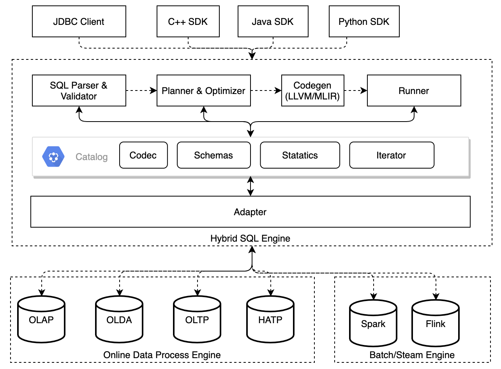

# OpenMLDB-笔记

## 1. 简介

背景，论文基本原理相关，见[大数据系统-鉴赏](https://github.com/tianjiqx/notes/blob/master/big_data_system/%E5%A4%A7%E6%95%B0%E6%8D%AE%E7%B3%BB%E7%BB%9F-%E9%89%B4%E8%B5%8F.md) 22 节。 

分析源码版本（2021.09.28）：

`432da3afbed240eb0b8d0571c05f233b1a5a1cd4`

源码核心目录结构：

- `hybridse`: sql引擎，解析sql字符串，生成执行计划
- `java`:  java 语言项目相关的模块
  - spark api
  - 批处理执行模块，将hybridse 的逻辑执行计划，翻译成物理执行计划
  - 导入
  - task 管理器
  - nearline tablet ？
- `src`主要源码部分
  - api server
  - tablet server
    - 存储，rpc，log，副本等
  - nameserver

项目依赖：

- [zetasql](https://github.com/google/zetasql)  google 开源的语言 解析器和分析器。openmldb 用来做语法解析

## 2. 架构

- 执行引擎Hybridse
  - 实时+ 批处理
- 存储引擎
  - tablet  server  存储服务
- 元信息管理
  - nameserver
    - 管理tablet 的元信息，表schema等服务
  - zookeeper
    - 先猜测是提供一致性，为nameserver选主
- api server
  - 提供 resutful api 访问nameserver

sql执行入口：

`src/cmd/sql_cmd.h`

- `HandleSQL()`  处理sql
  - `hybridse::plan::PlanAPI::CreatePlanTreeFromScript()` 解析sql，生成逻辑计划
    - (稍微有点奇怪，解析完的计划，只是用来简单分别sql类型，检查db是否存在。之后还是使用sql，重新解析一遍，可能是之前没有db信息? 后续再次解析时，添加上了，但是感觉实现稍暴力)
  - `hybridse::node::kPlanTypeCmd` 
    - `HandleCmd()`  show/desc database, table，use db , create、drop db, table 等语句
  - ` hybridse::node::kPlanTypeCreate` | ` hybridse::node::kPlanTypeCreateSP` ddl类型
    - `SQLClusterRouter::ExecuteDDL()`
      - `src/sdk/sql_cluster_router.cc`
        - ` NsClient::CreateDatabase()` 等
        - `NsClient::ExecuteSQL()`  DDL， 包括create，drop等操作
          - `src/client/ns_client.cc`
          - `PlanAPI::CreatePlanTreeFromScript()`
          - `HandleSQLCmd()`
            - `DropTable()`
            - `DeleteIndex()`
            - `DropProcedure()`
  - ` hybridse::node::kPlanTypeQuery` 查询类型
    - `SQLClusterRouter::ExecuteSQL()`  DDL， 包括create，drop等操作。
      - `src/sdk/sql_cluster_router.cc`
      - `SQLClusterRouter::ExecuteSQLParameterized()`
        - `GetTabletClient()`  根据请求的行，选择tablet
        - `TabletClient::Query()` 将sql发送送 tablet server上执行 （看起来只支持单机？）
          - `src/client/tablet_client.cc`
        - ` ResultSetSQL::MakeResultSet()`
    - `PrintResultSet()`
  - `hybridse::node::kPlanTypeInsert` 插入类型
    - `ExecuteInsert`

（应该有分布计划类型的分支，当前分析的分支Query，直接走到tablet server上了，或者批量，实时的类型查询应该会跳到java目录下）

## 3.  执行引擎HybridSE

HybridSE(Hybrid SQL Engine)是基于C++和LLVM实现的高性能混合SQL执行引擎，为AI应用、OLAD数据库、HTAP系统、SparkSQL、Flink Streaming SQL等提供一致性的SQL加速优化。

源码结构：

- `docker`  HybridSQL 的 docker image 构建脚本
- `examples`
  - 包含基于HybridSE实现的内存表SQL引擎toydb
- `include` 部分模块头文件定义（`src` 也有有文件）
- `java`  java sdk，当前内容基本没有
- `python` python sdk，同样为应用开发人员的sdk，内容暂时也基本没有，可能实现在`src/sdk`
- `tools`  打包测试相关工具，具体功能看该目录下的readme
  - 编译检查
  - 编译，功能测试
  - 集成测试，性能测试
- `src` 主要的源代码

(当前一些文档连接，似乎由于项目名更改，已经无法访问)

`hybridse/src/planv2/plan_api.cc`

- `PlanAPI::CreatePlanTreeFromScript()`  接收字符串，然后解析成执行计划树
  - ` zetasql::ParseScript()` 词法，语法解析，sql字符串 -> `zetasql::ASTScript`
  - `SimplePlannerV2::CreateASTScriptPlan()`  `zetasql::ASTScript` -> `PlanNode`
    - `hybridse/src/planv2/planner_v2.cc`
      - `ConvertASTScript()`  `zetasql::ASTScript` -> `SqlNodeList`
        - `hybridse/src/planv2/ast_node_converter.cc`
      - `SimplePlanner::CreatePlanTree(()`
        - `hybridse/src/plan/planner.cc`
        - `QueryNode` -> `PlanNode`  通过`node::NodeManager` 创建逻辑计划节点

最终逻辑计划节点会被各个后续具体的执行引擎转换为物理执行计划（批，流方式执行）。

## 4. ApiSever

## 5. NameSever

## 6. tablet server

tablet client 接口：

`src/client/tablet_client.h`

- DDL，元信息操作
  - `CreateTable()`
  - `DropTable()`
  - `UpdateTableMetaForAddField()`
  - `GetCatalog()`
  - `AddIndex()`
  - `DeleteIndex()`
  - `UpdateTTL()`
- 读写数据
  - `Query()`
  - `SQLBatchRequestQuery()`
  - `SubQuery()` 似乎会有分布式子计划执行？
  - `Put()`
  - `Get()`
  - `Delete()`
  - `Count()`
  - `Scan() `  返回kv迭代结果
  - `AsyncScan()`
  - `LoadTable`
- 副本管理
  - `AddReplica()` 
  - `DelReplica()`
  - `ChangeRole()`
- 快照
  - `MakeSnapshot()`
  - `SendSnapshot()`
  - `RecoverSnapshot()`
- 存储过程
  - `CreateProcedure()`
  - `CallProcedure()`

tabet server

`src/tablet/tablet_impl.cc`

- `TabletImpl::Query()`  TabletImpl 继承TabletServer
  - `TabletImpl::ProcessQuery()`
    - `hybridse::vm::BatchRunSession.run()`  执行查询

（因其他事情暂停分析，TODO，当前未知，分布式计划如何执行。认为应该还是tablet server之上有一层工作，应该在java目录下（批处理，流处理），tabletserver 应该还是单点上执行子计划。并且使用hybridse 的vm模块。）

## REF

- [github: openMLDB](https://github.com/4paradigm/OpenMLDB)

