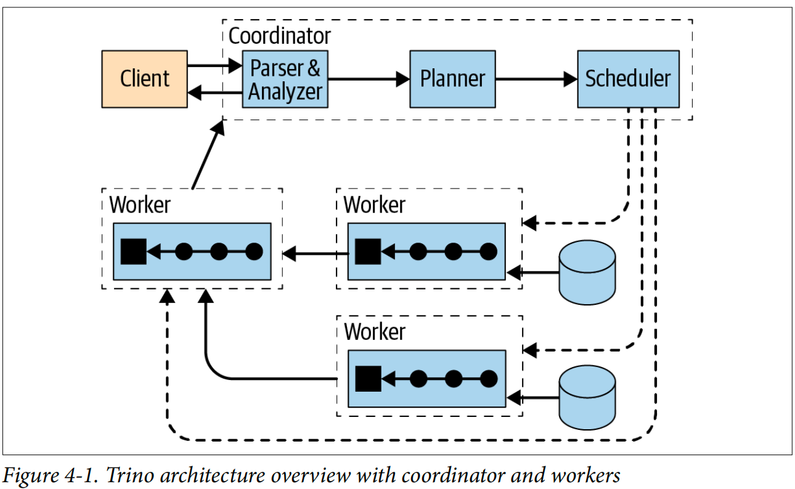
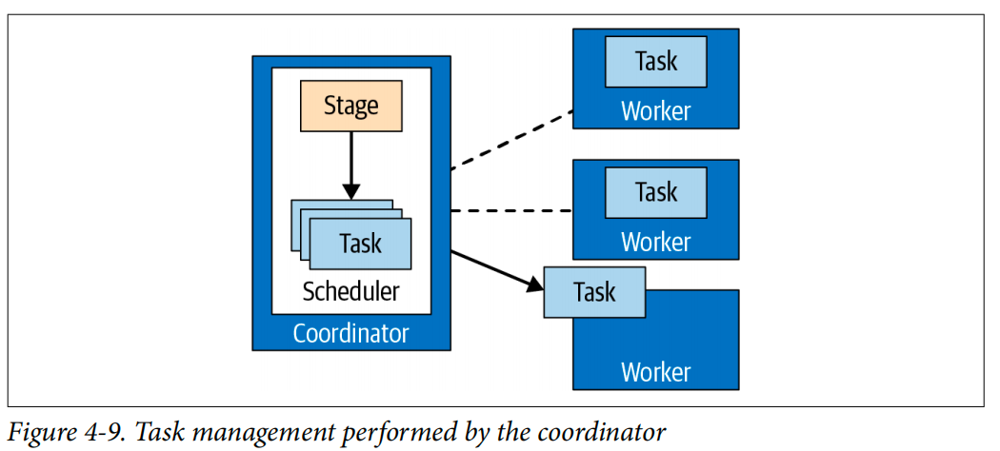
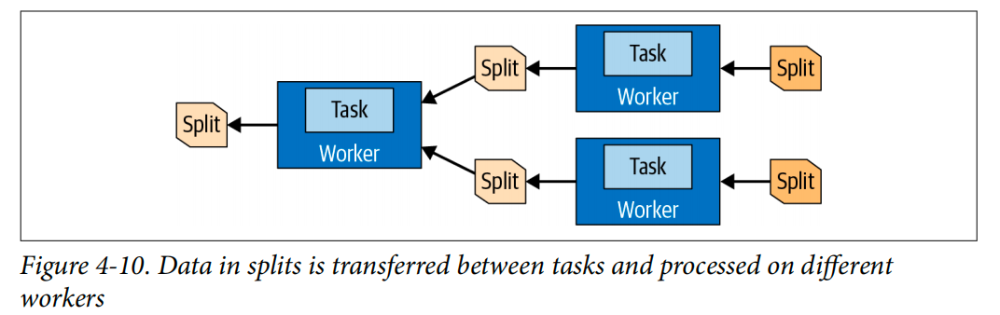

# Presto & Trino

## 场景

Trino（原名Presto）是一个开源的分布式 SQL 查询引擎，旨在为大数据环境提供快速、高效、统一的查询服务。

其特点包括：

- 无需预先的数据聚合或物化视图，即可实现快速查询
- 支持标准 SQL 访问各种数据源，如 Hadoop、S3、Cassandra、MySQL 等
- 提供高并发、低延迟的查询能力
  - MPP

应用场景：

- 大数据分析
- 实时数据仓库
- 机器学习和人工智能数据查询

Trino 适用于需要跨多个数据源进行即时分析的场景。Trino 通过提供一个统一的查询接口，极大地简化了大数据处理的复杂性，使得用户能够专注于数据分析而不是底层数据存储的细节。

### 优缺点

优点：

- 快速：优化的查询性能，尤其适合交互式分析
- 易于使用：支持标准 SQL 语法，易于上手
- 灵活性：支持多种数据源和连接器，易于扩展

缺点：

- 资源消耗：在处理大规模数据时，可能需要较多的内存资源来保证性能
- MPP，无容错， Coordinator节点不可用
- 对某些数据源的优化不足

## 基本原理

Trino 使用了一个 **分布式的架构**，由多个节点组成，包括 **协调器（Coordinator）** 和 **工作节点（Workers）**。

### 架构组件

- 协调器：负责接收 SQL 查询，创建查询计划，并分发任务给工作节点
  - 协调器使用REST API与工作者和客户端通信
- 工作节点：执行具体的查询任务，并将结果返回给协调器
  - 工作节点从连接器获取数据并相互交换中间数据。
  - REST API
  - 启动时自注册到协调器中的发现服务器

- 连接器connector
  - Trino 通过 **连接器（Connectors）** 连接不同类型的数据源，并使用 **基于成本优化器（CBO）** 来优化查询。
    - 默认内置，JMX的连接器，对内置系统表的访问的System连接器，Hive连接器，TPC-H基准数据的TPCH连接器

- S3, ES, kafka( topic 作为表，解析各种格式内容) etc.

（注意：实际我们的系统实现时，往往不区分协调者和工作者，每个节点都可以当做是协调者，处理用户的请求，将其他节点，以及本节点当做是worker分发任务）

### 查询执行模型

- Query 分布式查询计划
  - Stage 一个Query，分成几个层次结构的Stage
    - 例如，Presto需要从存储在Hive中的10亿行中聚合数据，它会创建一个root stage来聚合其他几个stage的输出，所有这些阶段都旨在实现分布式查询计划的不同部分。
    - Task
      - stages对分布式查询计划的特定部分进行建模，stages本身不会在Presto worker上执行，而是转换成Task再各个worker上执行，即一个stage可能，并行分成多个task再不同节点执行
      - Split (pipeline) 分割数据
        - 分割是一个描述符，用于描述可以由worker检索和处理的底层数据的一个片段。它是并行性和工作分配的单位。连接器对数据执行的具体操作取决于底层数据源。
        - Driver 一个或多个并行线程
          - Operator 消费、转换和产生数据，具体物理执行算子，比如Scan，Project  线程内算子流水线执行
- Exchange 算子
  - Remote 基于内存缓冲区，节点之间为查询的不同Stage交换传输数据
  - Local 基于内存缓冲区，节点内，为不同的pipeline 交换传输数据

### 执行计划调度

二级调度

- remote exchange 不同节点间并行
  - join 
    - hash 分布相同可以co-partition
    - 否则，build表广播 插入xchg(remote, borcadcast)
  - union
    - 插入xchg(remote, borcadcast) 生成单分区（单节点）
  - sort,top
    - 要求数据输出单分区，不满足插入remote xchg single parttion
    - 生成part + merge
  - agg
    - part + final
    - 一般要求单分区输出，有时也hash分布
  - project 
    - 可能有些要求表达式要求单分区

- local exchange 节点内并行
  - scan
    - 数据源数据是否进行本地重分布，需要则插入，产生随机分区
  - xchg(remote) -> local exchange
    - 需要hash，random分布
      - 插入 local remote 并发
    - 数据需要广播
      - 多分区，插入本地xchg
    - 顺序要求
      - 非单分区，插入 local xchg 并发
    - 其他
      - 还是只有remote xchg

- stage 的 split -> Task 
  - Stage schedule result node Tree  stage是一颗树，调度结果也是一颗树，stage内的执行计划片段不做跨节点的数据shuffle
    - stage 基于 remote xchg 进行切分query
    - Stage schedule result node 
      - taskplacements
        - task + node
  - Stage 分布属性：single， source (by data placement),  partitioned ( hash, ranom reparttion)
  - 先调度child stages

- Task 的 split -> pipeline
  - 基于 local xchg split 出 pipeline

### 管理

#### 内存管理

节点级别
- 用户内存
  - 诸如聚合和排序之类的用户查询控制用户内存分配。
- 系统内存
  - 系统内存分配基于查询引擎本身的执行实现，包括缓冲区的读、写和混洗、表扫描和其他操作。

特定工作线程

### REF

- [Trino 官网](https://trino.io/)
- [GitHub - Trino - 原名 PrestoSQL](https://github.com/trinodb/trino)
- [官方文档 - 架构](https://trino.io/docs/current/overview/concepts.html))
- Trino: The Definitive Guide
- [prestodb docs](https://prestodb.io/docs/0.286/overview/concepts.html#query-execution-model)
- [Presto Scheduler](https://aaaaaaron.github.io/2022/07/11/Presto-Scheduler/)
- [生成查询计划](https://mumu-presto.readthedocs.io/zh/latest/core/createqueryplan.html#id16)