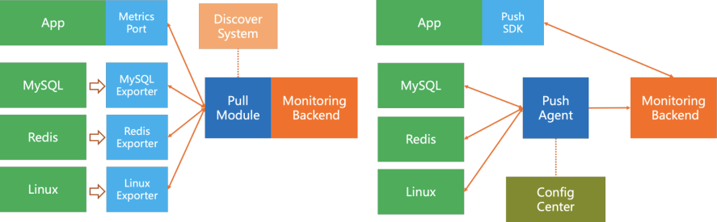

# Prometheus 普罗米修斯

## 简介

Prometheus 是云原生计算基金会的一个项目，是一个系统和服务监控系统。它以给定的时间间隔从配置的目标收集指标，评估规则表达式，显示结果，并在观察到指定条件时触发警报。

#### 场景
Prometheus 是一个开源的监控和警报工具集，旨在为复杂系统提供实时监控和警报服务。它特别适用于云原生和微服务架构，能够监控各种服务和应用程序的性能和健康状况。

功能特性：

- multi-dimensional 多维数据模型，指标+key/value维度集合的时间序列

- 查询语言 PromQL，用于检索和分析时间序列数据

- 单个服务器节点是自治的

- 支持推送时间序列以进行批处理作业

- 支持多种图形和仪表板模式

- 支持分层和水平联邦

- 支持服务发现

优点：
- 数据模型 +  PromQL
- 易于部署和维护，独立的二进制文件 没有外部依赖
- 基于pull模式，对应用需求低，解耦后端存储部署等信息，集中管理配置设置/拉取间隔，降低服务负载
- exporter生态丰富，支持导出各种应用指标

缺点：
- 存储限制， 原生单实例，存储时间限制 15 天左右
- 资源消耗， pull 模式对目标集群服务器资源使用？push 模式实际也需要部署 push agent
    - pull模式，要求被监控对象能够提供exporter服务给Prometheus
- 依赖服务发现机制

## 基本原理

### Storage

演化：

#### 1.x版本

- 每个时间序列都对应一个文件
- 在内存中批量处理1kb的的chunk

问题：
- chunk保存在内存中，如果应用程序或节点崩溃，它可能会丢失
- 由于时间序列的维度很多，对于的文件个数也会很多，这可能耗尽操作系统的inode
- 上千的chunk保存在硬盘需要持久化，可能会导致磁盘I/O非常繁忙
- 磁盘I/O打开很多的文件，会导致非常高的延迟
- 旧数据需要清理，这可能会导致SSD的写放大
- 非常高的CPU、内存、磁盘资源消耗
- 序列的丢失和变动
    - 例如k8s中应用程序的连续自动扩展和频繁滚动更新带来的实例的ip等变化，每天可能会创建数万个新应用程序实例，以及全新的时间序列集

#### 2.x

- 数据存储分块，替代文件，时间块
>  将数据分成互不重叠的块
> 每个块都充当一个完全独立的数据库
> 包含其时间窗口的所有时间序列数据
> 有自己的索引和块文件集
> 当前块可以追加数据, lsm 思想

- index 数据索引，通过标签找到数据，保存了Label和Series的数据
    - 正向索引，为每个序列分配一个唯一的ID，通过它可以在恒定的时间内检索
    - 倒排索引，label(tag) 的数据项的快速查找
- meta.json 可读元数据
- tombstone 墓碑文件，删除的数据将被记录到这个文件中，而不是从块文件中删除
- mmap的wal 预写日志 Write-Ahead Log
- chunks_head，在内存中的数据，即最近查询最多的块总是在内存中的
- 数据将每2小时保存到磁盘中
- block合并

## REF

- [可观测｜时序数据降采样在Prometheus实践复盘](https://zhuanlan.zhihu.com/p/538199455) 
    - ARMS Prometheus 采用了处理 TSDB 存储块的方式，由后台自动将原始数据块处理为降采样数据块，一方面能取得一个较好的处理性能，另一方面对于终端用户来说，不需要关心参数配置规则维护等等，尽可能的减轻用户运维负担。
    - M3 Aggregator： 写入时，按照配置降采样规则，另存一份物理独立的数据，配置不同过期时间，查询时按照查询时间间隔，路由不同数据，以加速查询

- [高性能、高可用、免运维-云原生 Prometheus 方案与实践](https://zhuanlan.zhihu.com/p/188249493)
    - 社区提供的Prometheus分布式扩展方式（cortex、thanos、m3db、FiloDB、VictoriaMetrics）
    - SLS的MetricStore原生提供了对PromQL的支持，所有的数据通过Shard的方式分散在多台机器分布式存储，计算层集成Prometheus的QueryEngine模块，实现存储计算分离

- [一文带你了解 Prometheus](https://zhuanlan.zhihu.com/p/512696957) 

- [Pull or Push: How to Select Monitoring Systems?](https://www.alibabacloud.com/blog/pull-or-push-how-to-select-monitoring-systems_599007)
    - 主机、进程和中间件监控使用 Push Agent
    - Kubernetes 和其他直接公开的拉取端口使用拉取模式

- 存储
    - [存储](https://icloudnative.io/prometheus/3-prometheus/storage.html)
    - [浅谈Prometheus的数据存储](https://cloud.tencent.com/developer/article/1870694)

    - [Time series database behind Prometheus](https://zhuanlan.zhihu.com/p/702329117)

- 应用

    - [云原生时代如何用 Prometheus 实现性能压测可观测-Metrics 篇](https://zhuanlan.zhihu.com/p/495082415)     
    - [手把手教你使用 Prometheus 监控 JVM](https://zhuanlan.zhihu.com/p/265307982)
    - [手把手教你使用 Prometheus 监控 MySQL 与 MariaDB.md](https://zhuanlan.zhihu.com/p/271682642)
    - [使用 Prometheus + Grafana 打造 TiDB 监控整合方案](https://zhuanlan.zhihu.com/p/378497303) 

    - [TiKV 源码解析系列文章（三）Prometheus（上）](https://zhuanlan.zhihu.com/p/58699359)
    - [TiKV 源码解析系列文章（四）Prometheus（下）](https://zhuanlan.zhihu.com/p/59165478)

