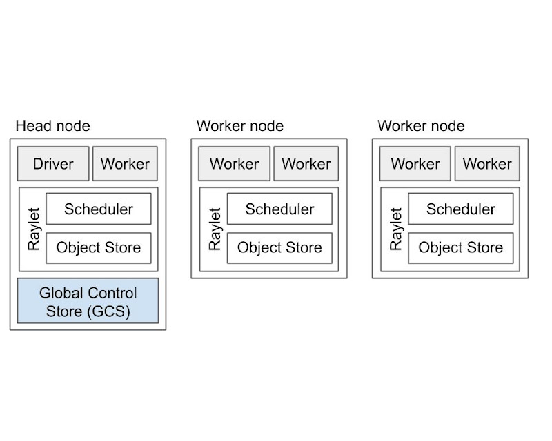

# RAY

## 目标

Ray旨在为分布式计算提供一个通用的API。 实现这一目标的核心部分是提供简单但通用的编程抽象，让系统完成所有繁重的工作。这种哲学使开发人员能够将Ray与现有的Python 库 和系统一起使用。

Ray的API的第二个目标是允许应用程序对系统行为进行细粒度的控制。这是通过一组可配置的参数来实现的，这些参数可用于修改系统行为，如任务放置、故障处理和应用程序生存期。

Scope：包括粗粒度弹性工作负载（即，无服务器计算的类型），机器学习训练（例如，Ray AIR）、在线服务（例如，Ray Serve）、数据处理（例如、 Ray Datasets、Modin、 Dask-on-Ray）和临时计算（例如并行化Python应用程序，将不同的分布式框架粘合在一起）。

- 性能：分布式**共享内存**、分布式并行执行，actors可动态提供轻量级的服务；性能匹敌gRPC
- 可靠性：低开销ref count 保证内存正确、丰富的options保证failure重启策略

## 架构

### 概念

- Task 远程函数调用。
    - 这是一个单一的函数调用，在与调用者不同的进程上执行，并且可能在不同的机器上执行。
    - 任务可以是无状态的（一个`@ray.remote`函数）或有状态的（一个`@ray.remote`类的方法--参见下面的Actor ）。
    - 任务与调用者异步执行：`.remote（）`调用立即返回一个或多 个 可用于检索返回值的` ObjectRefs `（future）。

- Object 应用程序值。
    - 这些是由任务返回或通过`ray.put`创建的值。
    - 对象是不可变的：它们一旦创建就不能被修改。
    - worker 可以使用` ObjectRef `引用对象。

- Actor 一个有状态的工作进程 （`@ray.remote`类的实例）。
    - Actor任务必须使用句柄或对Actor特定实例的Python引用提交，并且可以在执行期间修改Actor的内部状态 。

- Driver “主”程序。这是运行`ray.init（）`的代码。
- Job 作业
    - 来自同一驱动程序及其运行时环境的任务、对象和参与者的集合（递归）。
    - Driver 和 Job 之间存在1：1映射。

### 组件

Ray集群由一个或多个工作节点组成，每个工作节点由以下物理进程组成:
- 一个或多个**工作进程(work process)**：负责任务的提交和执行。
    - 工作进程要么是无状态的（可以被重用来执行任何@ray.remote函数），要么是一个actor （只能根据它的@ray.remote类执行方法）。
    - 默认数量和node cpu数量相同。
    - work存储：
        - owership表，来存储引用计数和对象位置 objects->[worker list哪些worker持有]
        - in-process store 进程的内存储区，用于存储小 对象。

- Raylet：管理每个节点上的共享资源。（类似kubelet， 负责管理节点资源和任务的组件）
    - Raylet有两个主要组件，在单独的线程上运行：
        - Scheduler 负责资源管理、任务放置和实现存储在分布式对象存储区中的任务参数。集群中的各个调度器组成了Ray分布式调度器。
        - Object Store 共享内存对象存储（也称为Plasma对象存储）。负责储存、转移和溢出大型对象。集群中的各个对象存储组成Ray分布式对象存储。

每个工作进程和Raylet都被分配了一个唯一的28字节标识符以及IP地址和端口。
相同的地址和端口可以由后续组件重用（例如，如果先前的工作进程死亡），但是唯一ID从不被重用（即，它们在进程死亡时被埋葬）。
工作进程与其本地raylet进程共享生命周期。

其中一个工作节点被指定为头节点。头节点托管：
- 全局控制服务 Global Control Service (GCS)。
    - GCS是管理集群级元数据的服务器，例如参与者的位置，这些元数据存储为可以由工作者本地缓存的键值对。GCS还管理一些集群级别的操作，包括安排放置组 和参与者 以及确定集群节点成员。2.0 支持多点容错。
- 驱动程序是执行顶级应用程序（例如，Python中的`__main__`）。它可以提交任务，但不能自己执行任何任务。
-  处理 作业提交、自动缩放等的其他集群级服务。

## REF

- [[分布式框架Ray] 框架原理 - WhitePaper 阅读](https://zhuanlan.zhihu.com/p/721715828)

- [Ray v2架构](https://docs.google.com/document/u/0/d/1tBw9A4j62ruI5omIJbMxly-la5w4q_TjyJgJL_jN2fI/mobilebasic)

- [github:ray](https://github.com/ray-project/ray)

- [ray docs](https://docs.ray.io/en/latest/ray-overview/index.html)

- [通用分布式计算引擎Ray](https://qiankunli.github.io/2023/08/23/ray.html)

- [Ray 源码解析（一）：任务的状态转移和组织形式](https://www.qtmuniao.com/2019/07/28/ray-source-reading-1/)

- [Ray 源码解析（二）：资源抽象和调度策略](https://www.qtmuniao.com/2019/08/10/ray-source-reading-2/)

- [使用 ray.data 进行大规模数据处理（二）：全局视角](https://www.qtmuniao.com/2024/07/07/ray-data-2/)

- [Ray分布式计算框架详解](https://zhuanlan.zhihu.com/p/460600694?utm_psn=1721305804152393728)