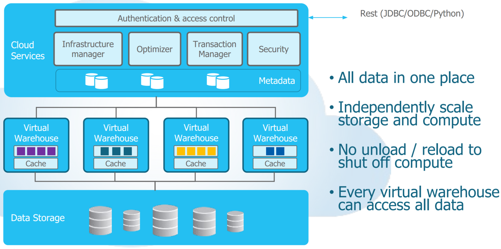
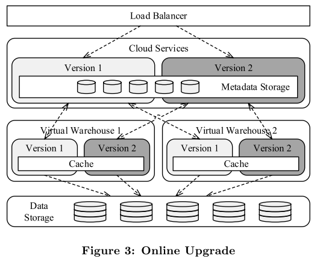

# Snowflake-笔记

## 1. 云环境特点

### 1.1 AWS S3

Amazon Simple Storage Service (Amazon S3) 是一种对象存储服务，可提供业界领先的可扩展性、数据可用性、安全性和性能。

典型应用：湖内数仓、网站、移动应用程序、备份和还原、存档、企业级应用程序、IoT 设备和大数据分析的数据存储


特性：

- 易于使用
  - 有基于 Web 的管理控制台和移动应用程序
  - 提供REST API 和软件开发工具包，与第三方集成
- 高持久性
  - 99.999999999％ (11 个 9)
- 可扩展
- 安全性
  - 数据上传加密,SSL/TLS
  - Amazon Identity and Access Management (IAM) 管理对象权限并控制对数据的访问
- 高可用
  - 年度99.99% 可用 协议
- 低成本
  - 存储：每 GB ¥ 0.1755 / 月  （50TB内，使用更多，价格降低）
    - 分层管理服务，自动冷热数据优化
  - 请求：
    - PUT、COPY、POST 或 LIST 请求：每 1000 个请求 ¥ 0.00405
    - GET、SELECT 及所有其他请求：每 10000 个请求 ¥ 0.0135
      - 扫描数据：每 GB ¥ 0.01433
      - 返回的数据：每 GB ¥ 0.0051
  - 数据传输：
    - 传出到互联网，每 GB ¥ 0.933（促销）
  - （计费很复杂，但是在短期使用上相对于自购服务器应该会是比较便宜的价格）
- 集成其他服务
  - 如Redshift


性能：

- 每秒至少支持 3500 个添加数据请求
- 每秒至少支持 5500 个检索数据请求
- 较小的请求（例如，小于 512 KB）时，中间延迟通常在几十毫秒范围内
- 高吞吐
  - 8-16 MB 粒度的并发请求，85–90 MB/s
  - 大约 15 个并发请求，打满25 Gb/s 或 100 Gb/s NIC


缺点：

（TODO）

延迟和并发？

目标未提及高性能，只有在缓存命中比较高时，性能接近本地的OLAP分析，或许更适合拥有极大规模数据，但是分析时只分析部分区间的数据。

或者是对性能要求不高的场景。


（单纯只被动适应云服务提供商提供的服务，或者说简单的直接使用器服务，来设计系统，或者取代部分模块（存储）可能是不够的，可能还是需要向云服务提供商提供需求，或者可能需要再组织一套系统，为上层系统提高数据等内容）


## 2. 动机

云环境下传统数据仓库的问题：

- 为固定资源设计的，因此无法利用云的弹性。
  - 指非面向云环境，而是面向由单机物理节点的集群，计算与存储绑定
- 外部来源数据，依赖复杂的ETL，reshard，不符合云的新型半结构化数据和快速扩展的工作负载的灵活性和新鲜度要求
  - 假设数据源是来自可预测，缓慢移动，容易分类的数据（OLTP，ERP，CRM）
  - 但是云数据越来越多地源于不断变化的外部来源
    - 日志、点击流、移动设备、社交媒体、传感器数据
    - 通常以无模式、半结构化的形式（JSON、XML、Avro）


大数据系统解决方案

- Hive、Spark、BigQuery、Impala、Blink……
- 数据中心规模的批处理和/或流处理
  - 有各种SQL风格的前端
- 缺点
  - 缺乏传统 DW 技术的效率和功能集
    - 安全，备份，事务
    - （与lakehouse论文观点一致）
  - 需要大量的工程努力来推动完成业务逻辑


vision：

- 数据仓库 as a Service
  - 不需要管理基础设施和调参
- 多维度的弹性扩展
  - 根据数据，查询，用户数的需求
- 所有的业务数据
  - 关系，半结构化数据


Snowflake目标:

- 多租户
- 事务
- 安全
  - SQL粒度的角色访问控制
- 可扩展，弹性
- SQL支持
- 半结构化，无结构数据
-  为使用付费


Shared-nothing 架构，主导了数据仓库的设计（Teradata, Vertica, Netezza等）:

- 可扩展性
  - 表跨节点水平分区，每个节点只负责其本地磁盘上的行
    - 适用于星型模式查询，小表（维度表）广播，与大表（分区表）连接，带宽要求低
- 廉价的商业机器，不需要额外定制
- 缺点：
  - 计算资源和存储资源紧密耦合，根据负载不同，拉低平均利用率（no pay-per-use  ）
    - 批量加载（高 I/O 带宽、轻计算）
    - 复杂查询（低 I/O 带宽、重计算）
  - 成员管理
    - 节点故障，或者调整集群规模，大量数据需要重新混洗，影响正常业务性能
      - 多副本，缓解该问题
  - 
  - 同步的在线（软件、硬件）升级困难


Snowflake的基本想法：

云环境本身可以提供各种类型的节点，或者自定义资源配置。

将存储和计算分开，由两个松散耦合、独立可扩展的服务处理（专用Shared-nothing引擎+AWS S3）。

使用计算节点的本地磁盘（SSD）缓存一些表数据，减少计算节点和存储节点之间的网络流量，达到接近Shared-nothing架构的性能。（冷热分离）


## 3. 架构



多集群、共享数据，面向服务的架构，服务通过 RESTful 接口进行通信，共有三层：

- 数据存储
  - 存储表数据和查询结果
    - Table 是一组不可变的微分区micro-partition构成（~16 MB ）
  - 存储底层使用Amazon S3 的分层存储
    - 对象存储（KV）与 HTTP(S) PUT/GET/DELETE 接口
    - 高可用，11个9
- 虚拟仓库
  - 由 EC2 实例集群组成，纯计算资源，无状态
    - 按需创建、销毁、调整大小
    - 用户可以同时运行多个仓库
    - 每个仓库都可以访问所有数据，但性能独立
    - 用户可以关闭所有仓库
  - 具有本地缓存
    - 文件不变性
    - LRU淘汰
- 云服务
  - 多租户
    - 多用户共享服务
  - 提供访问控制、查询优化器、事务管理器等服务


### 3.1 数据存储

选择Amazon S3的原因：

- 成熟
- 潜在的用户
  - 数据已经在S3的用户
- 高可用性、耐用性胜于自己开发的基于 HDFS 或类似的存储服务
  - 性能存在差异


Amazon S3与本地磁盘的重要区别：

- 性能
  - 访问延迟更高
  - 个 I/O 请求相关的 CPU 开销更高，尤其是HTTPS 连接
- 非原地更新，对象必须完整写入
- 允许部分读（字节范围）


这些区别，影响表微分区格式和并发控制的设计。


微分区micro-partition：

- 表被水平分割成大的、不可变的文件（~16 MB），相当于传统数据库系统中的块或页面。
- 列存格式，高度压缩
  - PAX  [Ailamaki01]  或者混合列存
- 具有头
  - 列偏移等元信息
  - 用于读取感兴趣的部分(header + needed columns)


本地磁盘空间耗尽，查询的临时数据会溢出到S3。

查询结果也存储在S3中。

- 任何大的查询，磁盘空间永远足够
- 检索和重用以前的查询结果


元信息的存储在事务事务KV存储引擎（不在S3）

- catalog对象、表的S3 文件、统计信息、锁、事务日志等组成
- 作为云服务层的一部分。


### 3.2 虚拟仓库

虚拟仓库层由 EC2 实例集群组成。

组成 VW 的各个 EC2 实例称为工作程序节点。

用户从不直接与工作节点交互。用户不知道也不用关心VW的构成。


#### 3.2.1 弹性和隔离性

VW 是纯计算资源。

每个单独的查询都在一个 VW 上运行。

工作节点不跨 VW 共享，所以查询是性能隔离的。


对于每一个查询，VM中每个（部分）工作节点会启动一个工作进程，查询期间存活。

由于用的是不可变对象，是幂等的，可以失败重试（但目前没有做）。

更新操作，不直接修改微分区，而是队列移除或添加微分区。


用户可以在任何给定时间运行多个 VW，而每个 VW 又可能运行多个并发查询。

每个 VW 都可以访问相同的共享表，而无需物理复制数据。


弹性的优势，例子：

数据加载，使用4节点需要15小时，而使用32节点可能只需要2小时。计费是按时间进行计算，所以花费基本一致，但是用户体验截然不同。


#### 3.2.2 本地缓存

每个工作节点维护本地表缓存（缓存保存文件头和文件的各个列），生命周期与工作节点一致，支持并发，后续工作进程共享使用。 (LRU) 替换策略。


提高缓存命中率，以及避免VM工作节点冗余缓存：

- 查询优化器使用表文件名的一致哈希，将输入文件集分配给工作节点 
- 访问同一个表文件的后续或并发查询将在同一个工作节点上执行此操作
- VM工作节点故障、调整大小
  - 通过LRU自然淘汰，非手动全部一下清空


#### 3.2.3 文件偷取File Stealing处理倾斜

倾斜：由于虚拟化问题或网络争用，某些节点的执行速度可能比其他节点慢得多。

文件偷取File Stealing:

- 每当工作进程完成扫描其输入文件集时，它会从其他peers工作节点请求额外的文件
- 慢工作节点通过在当前查询的持续时间和范围内转移一个剩余文件的所有权来回答请求
- 然后，请求者直接从 S3 下载文件


#### 3.2.4 执行引擎

- 列存
  - 高效的CPU缓存，SIMD执行，轻量级压缩
- 向量化
  - 不用MR方式物化中间结果，pipeline
  - 批量处理数千行，避免行迭代开销过大
- 基于推送模式
  - 算子的执行结果推送给下游运算符，而非火山模式的pull。
    - 移除了控制流逻辑，提高缓存效率
    - （spark WSCG model，也是push模式， 取代火山模式）
    - 为中间结果的共享和流水线化创造机会

注意：

- 无事务管理，因为读的是只读文件。
- 无内存缓存区，OLAP型大表scan，缓冲区反而是额外的开销
- join、group by、sort，允许内存溢出到磁盘


### 3.3 云服务

虚拟仓库是临时的、特定于用户的资源。

云服务层是多租户的。多租户提高了利用率并减少了管理开销。

每个服务都被复制以实现高可用性和可扩展性。

- 状态在事务KV存储

服务节点故障，导致的失败查询，会被透明地重新执行。


#### 3.3.1 查询管理和优化

查询处理：解析、对象解析、访问控制和计划优化。

Cascades风格，自上而下的基于成本的优化器。

统计信息：数据加载和更新时自动维护。


计划空间相对较小：

- 不使用索引
- 决策推迟到运行时
  - 减少优化错误


支持metrics 跟踪，故障检测。


**裁剪、过滤**

传统技术：索引，B+树等

- 依赖随机访问对S3和压缩文件不够友好。
- 维护索引，有额外开销，增加数据冗余和数据加载时间。
- 需要手动添加。


替代技术：基于min-max 裁剪

维护给定数据块（记录集、文件、块等）的数据分布信息，特别是块内的最小值和最大值。

根据谓词，过滤需要访问的数据块。（parquet，orc文件都自带类似的统计信息）


Snowflake 为每个单独的表文件/微分区micro-partition，保留与裁剪相关的元数据。

- 关系
- 半结构化数据

支持复杂的表达式谓词。


动态剪枝：

hash连接时，根据构建的hash表中的统计信息，下推到探测表跳过某些文件的扫描。

（类似mapjoin、filterjoin中对小表构建minmaxfilter，infilter下推到大表）


#### 3.3.2 并发控制

快照隔离 (SI) ，多版本并发控制 (MVCC) 

元数据，版本文件集合，维护表的文件添加和删除。

快照来实现时间旅行和数据库对象的高效克隆。


## 4. 功能特性

### 4.1 Software-as-a-Service

- 支持标准数据库接口（JDBC、ODBC、Python PEP-0249）并与各种第三方工具和服务（如 Tableau、Informatica 或 Looker）配合使用
- 丰富功能的Web UI 
  - 易于使用，可视化用户友好，无需任何下载软件
  - 操作
    -  SQL 操作
    - 访问数据库catalog，用户和系统管理、监控、使用信息
- 完全自动化自我运维（调优，恢复），不提供调参设置，故障运维模式等复杂使用


### 4.2 持续可用

实时分析处理，成为必要。故障，停机升级将影响对外客户的运营服务。

#### 4.2.1 容错

用户数据，S3，跨多个数据中心复制

元数据，也可以跨多个 AZ 分布和复制

其他云服务，无状态，多AZ，负载均衡，失败查询重定向。

虚拟仓库，为了性能考虑，不跨AZ。工作节点失败，透明重新执行。


#### 4.2.2 在线升级

软件升级，允许并行部署各种服务的多个版本，包括云服务组件和虚拟仓库。

所有硬状态都保存在事务键值存储中，通过负责元数据版本控制和模式演变的映射层访问。

元信息schema，保证版本向后兼容。



- 部署新版本的服务
- 用户帐户逐渐切换到新版本，每个点上由相应用户发出的所有新查询都被定向到新版本
- 等待先前版本执行的所有查询运行完成
- 退役旧版本的服务


生产版本发现严重错误，可以同样的过程进行降级。


（每周升级一次所有服务，发布功能和改进）


### 4.3 半结构，无结构化数据

**半结构化数据类型**：

- VARIANT
  -  SQL 类型（DATE、VARCHAR 等），可变长度的数组值
- ARRAY 
  - 对 VARIANT 类型的限制，特化
- OBJECT
  - 对 VARIANT 类型的限制，特化

内部表示是相同的，自描述的、紧凑的二进制序列化，支持快速键值查找，以及高效的类型测试、比较和散列。

可以用作连接键、分组键和排序键。

可以 将JSON、Avro 或 XML 格式的输入数据直接加载到 VARIANT 列中。Snowflake自动解析和推断。


**文档数据的操作**：

通过字段名称，偏移量访问数据。

- Snowflake 以函数式 SQL 表示法和类似 JavaScript 的路径语法提供提取操作。

```sql
SELECT sensor.measure.value, sensor.measure.unit
FROM sensor_events
WHERE sensor.type = ‘THERMOMETER’;
```

展平，嵌套文档旋转为多行

- 使用 SQL 横向视图来表示展平操作

```sql
SELECT p.contact.name.first AS "first_name",
p.contact.name.last AS "last_name",
(f.value.type || ': ' || f.value.contact) AS "contact"
FROM person p,
LATERAL FLATTEN(input => p.contact) f;
------------+-----------+---------------------+
first_name | last_name | contact |
------------+-----------+---------------------+
“John" | “Doe" | email: john@doe.xyz |
“John" | “Doe" | phone: 555-123-4567 |
“John" | “Doe" | phone: 555-666-7777 |
------------+-----------+---------------------+
```

聚合

- 引入了一些新的聚合和分析函数，例如 ARRAY_AGG 和 OBJECT_AGG。


**列存格式**

存储时，打散对象，列存存储，支持minmax。

扫描时，将不同的列重新组合成一个 VARIANT 类型的列。

- 将投影和转换表达式下推到扫描运算符，仅访问必要的列

布隆过滤器，改进扫描。


日期/时间值的处理，外部常是字符串。字符串处理，效率极低。

区分普通字符串和时间列：

 Snowflake 通过执行乐观数据转换并在单独的列中保留转换结果和原始字符串（除非存在完全可逆的转换）来解决该问题。


性能测试：

对具有相对稳定和简单模式的半结构化数据的查询性能几乎与传统关系数据的性能相当，享有所有列式存储、列式执行和修剪的作用。


### 4.4 时间旅行和克隆

文件被新版本删除时，它们会保留一段可配置的持续时间（目前最多 90 天）。

AT 或 BEFORE 语法用SQL 进行时间旅行。

UNDROP 快速恢复意外删除的表、模式或整个数据库。


CLONE，克隆表会快速创建一个具有相同定义和内容的新表，而无需制作表文件的物理副本。

克隆操作只是复制源表的元数据，引用了同一组文件，但此后可以独立修改这两个表。


### 4.5 安全性

- 两因素身份验证
  -  AES 256 位加密，基于 AWS Cloud HSM 的分层密钥模型
  - 定期轮换等

- （客户端）加密数据导入和导出
  - 云提供商 (Amazon) 看不到数据

- 安全数据传输和存储
- 对数据库对象的基于角色的访问控制（RBAC）。


## 5. 相关工作

**基于云的并行数据库系**

- Amazon Redshift
  - 经典的无共享架构，在可扩展的同时，添加或删除计算资源需要数据重新分配。

- BigQuery
  - Dremel的实现。
  - 从其学习对 JSON 和嵌套数据的支持。
  - 类 SQL 的语言，非标准SQL，只支持查询。不支持DML，ACID事务，需要定义半结构化数据schema。

- Azure SQL DW
  - 类似snowflake，计算资源可以通过数据仓库单元 (DWU) 进行扩展。
  - 并发度受限，并发执行查询的最大数量为 32。
  - 无对半结构化数据内置VARIANT 类型和相关优化


**文档存储和大数据**

- MongoDB、Couchbase Server、Apache Cassandra
  - 缺乏复杂查询支持
- Apache Hive，Spark，Drill，Cloudera Impala，Facebook Presto
  - 支持对嵌套数据的查询


## 6.教训与展望

教训：

- SQL on Hadoop确实不能满足需求，面向云符合需求
-  SaaS 模式，极大地帮助了我们的开发和测试。提供改进和修复问题。
- 用户喜欢无调参，性能能够满足客户需求
- 半结构化数据的扩展，使用超出预期
  - 取代了hadoop集群
-  最大问题：SaaS 和多租户是一个hard问题
  - 一个可以同时支持数百个用户的元数据层
  - 与处理各种类型的节点故障、网络故障和支持服务斗争

（基本都是夸自己:D，不是教训）

展望：

- 元数据结构和数据重组任务来提高数据访问性能
- 继续改进和扩展核心查询处理功能
  - SQL，半关系
- 改进偏斜处理和负载平衡策略
- 为用户简化工作负载管理的解决方案
- 外部系统集成
  - 高频数据加载等问题
- 最大期望：完全自助服务模式


## REF

- [doc](https://docs.snowflake.com/en/)
- [Snowflake 架构讨论 《The Snowflake Elastic Data Warehouse》](http://ilongda.com/2020/01/05/snowflake/)
- [paper: The Snowflake Elastic Data Warehouse](http://pages.cs.wisc.edu/~yxy/cs839-s20/papers/snowflake.pdf) sigmod 2016
- [slides: The Snowflake Elastic Data Warehouse SIGMOD 2016 and beyond](https://15721.courses.cs.cmu.edu/spring2018/slides/25-snowflake.pdf)
- [云原生OLAP数据引擎](https://zhuanlan.zhihu.com/p/200955929)
- [存算分离/DB on K8s 论文/blog收集](https://zhuanlan.zhihu.com/p/377755864) 
- [美团内部讲座｜周烜：华东师范大学的数据库系统研究](https://zhuanlan.zhihu.com/p/275870856) 分布式事务，拆分，基于新硬件的， 高速缓存系统
- [Amazon S3 功能](https://aws.amazon.com/cn/s3/features/)
- [Amazon S3](https://www.amazonaws.cn/s3/?nc2=h_ql_prod_st_s3) 功能，定价
- [一文读懂 AWS S3](https://zhuanlan.zhihu.com/p/112057573)
- [Amazon S3 的性能设计模式](https://docs.aws.amazon.com/AmazonS3/latest/userguide/optimizing-performance-design-patterns.html)
- [Amazon Web Services 概述](https://d1.awsstatic.com/whitepapers/zh_CN/aws-overview.pdf)

