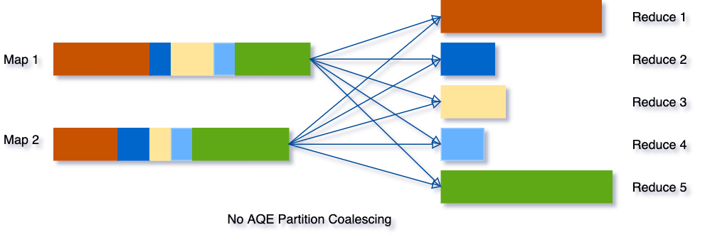

# Spark笔记

[TOC]

## 1. Spark简介

### 1.1 spark技术背景

**集群编程模型**，处理大规模数据，如MapReduce，Dryad。将分布式编程简化为自动提供位置感知的**调度**、**容错**以及**负载均衡**。

非循环的数据流模型：从稳定的物理存储（分布式文件系统）加载数据，传入一组确定性操作构成的DAG（有向无环图），然后写回稳定存储(保证容错)。DAG数据流图能够在运行时，自动实现任务的调度和故障恢复。

无法满足的场景：

- 机器学习和图应用中常用的迭代算法（每一步对数据执行相似的函数）
- 交互式的数据挖掘工具（用户反复查询一个数据子集）。基于数据流框架不明确支持工作集。需要将数据输出到磁盘，每次查询是重新加载。

RDD：弹性分布式数据集。支持基于工作集的应用，同时具有数据流模型特点：自动容错、位置感知调度和可伸缩性。

允许用户执行多个查询时，显示将工作集缓存在内存中（即RDD），供后续查询重用（RDD可以被多个子RDD处理），极大提升了查询速度。

RDD提供高度受限的共享内存模型，RDD是只读记录分区的集合。只能通过其他RDD只需确定的转换操作（map，join，groupBy）而创建。与分布式共享内存系统需要昂贵的检查点和回滚机制不同，RDD通过lineage重建丢失的分区：一个RDD包含了如何重其他RDD衍生所必须的相关信息。

RDD在性能上获取优势，**在于利用RDD之间的继承关系（宽窄依赖），保证容错性，对于窄依赖的关系，RDD之间无需持久化，直接内存重算。宽依赖视情况，持久化。**

### 1.2 优势

- 速度。基于内存运算，减少落盘次数。
- 易用。广泛的编程语言API接口，丰富的高级算法，便于快速构建不同的应用。支持shell模式，快速验证。
- 通用性。统一的解决方案，批处理，交互式查询（Spark SQL），实时流处理（Spark streaming）、机器学习，图计算，并且不损失性能。
- 可融合性。开源生态。可以使用YARN，Mesos作为资源管理和调度器，并处理所有Hadoop支持的数据，HDFS，Hbase，Cassandra等。也可以使用内置资源管理器和调度框架Standalone。


## 2.基本原理

### 2.1 Adaptive Query Execution (AQE) 自适应查询执行

Spark 3.0 Adaptive Query Execution (AQE) 是指在查询执行期间发生的查询重新优化。

基于运行时统计的动态规划和重新规划查询的框架，支持多种优化：

- 动态切换连接策略
- 动态合并 Shuffle 分区
- 动态处理倾斜连接


#### 2.1.1 动态切换连接策略

Spark 支持多种连接策略，其中广播哈希连接（broadcast hash join）通常是性能最高的，如果连接的一侧可以很好地适应内存（广播小表）。

Spark在生成计划时，依赖统计信息、推导，可能导致估计错误。导致计划决策的连接算法错过或者误用。

AQE，能够根据最准确的连接关系大小，在运行时重新规划，还未执行的连接策略。


#### 2.1.2 动态合并 Shuffle 分区

shuffle是一个昂贵的操作，影响shuffle效果的一个关键属性是分区的数量，最佳分区数取决于数据，但数据大小可能因阶段、查询到查询而有很大差异：

- 如果分区太少，那么每个分区的数据量可能非常大，处理这些大分区的任务可能需要将数据溢出到磁盘（例如，当涉及排序或聚合时），因此，减慢查询速度。
- 如果分区太多，那么每个分区的数据量可能会很小，并且会有很多小的网络数据来读取shuffle块，这也会因为I/O效率低下而导致查询速度变慢。拥有大量任务也会给 Spark 任务调度器带来更多负担。

为了解决这个问题，可以在开始时设置比较多的shuffle partition，然后在运行时通过查看shuffle文件的统计信息，将相邻的小分区合并成更大的分区。



例子：

`SELECT max(i) FROM tbl GROUP BY j;`

输入数据 tbl 相当小，因此在分组之前只有两个分区。

初始shuffle分区数设置为5，所以本地分组后，将部分分组的数据shuffle成5个分区。spark启动5个任务进行最终的聚合。


AQE 将中间三个小分区合并为一个，task数量。


#### 2.1.3 动态处理倾斜连接

数据倾斜在大规模数据上的连接是一种非常常见的现象。严重的倾斜，导致长尾任务的产生，降低查询性能。

AQE 倾斜连接优化会从随机文件统计信息中自动检测此类倾斜。

然后它将倾斜的分区拆分为更小的子分区，这些子分区将从另一侧分别连接到相应的分区。


上面的例子，表A的A0分区明显大于其他分区，AQE会将A0拆分成2个子分区，并将他们与B0都进行连接。


### 2.2 SparkSQL

**动机**：

- 支持声明式查询（SQL），给用户提供自动优化体验
- 衔接关系处理与高级分析（ML），半结构化、非结构化数据的ETL
  - 关系型系统与程序型系统


主要的模块：

- DataFram API
  - 以columns组织的数据的集合，可以与RDD相互转化，类似关系数据库中的表，可以支持关系操作。
    - 对外部数据源执行关系操作
    - 在现有的程序系统中使用关系操作
      - 可以通过编程，控制SQL操作的生成，不必是完整SQL
    - 被catalyst分析结构（创建、处理过程），优化执行
      - 代表逻辑计划
      - 执行输出操作时，才构建物理计划，经过优化后执行
  - 用于java, scala api 编程，ML
    - 将关系表转换为DataFrame，可以复用ML的算法。（混合编程）
    - UDF
  - 底层基于RDD
    - 也是惰性求值
    - 可以通过反射推断Schema，获取RDD的数据的类型、名称，构造DataFrame
  - 与Dataset的区别
    - DataFram = Dataset[row]
- Catalyst
  - 解析SQL的优化器框架，类似hive的calcite，可扩展。
    - 进行自动优化
      - 规划
      - 代码生成
    - 可扩展
      - 通过添加特定于数据源的规则，可以将过滤或聚合推送到外部存储系统中，或者支持新的数据类型
  - 使用sql编程的接口


- 前端
  - Parser
  - Analysis
  - Logical Optimization
- 后端
  - Physical Planning
    - 转换逻辑算子为物理算子
    - 挑选候选的物理执行计划（比如连接算法broadcast-hash-join, sort-merge-join）
    - 单个算子，产生多个具体的物理算子
      - partial agg -> shuffle -> final agg
  - Code Generation
    - WSCG model代替Volcano iterator model （Pull model; Driven by the final operator）
      - Push model; Driven by the head/source operator
      - 
    - 将原来的一串操作（next连接），融合成执行生成的代码的单个WSCG操作
      - 实现
        - WSCG节点（WholeStageCodegen）包含的操作都是窄依赖
    - 优点：
      - 减少虚函数调用
      - 数据在CPU寄存器
      - SIMD
  - Execution
    - 物理计划的调度
      - 标量子查询Scalar subquery 切分成为单独的job
      - shuffle操作作为stage划分边界
      - 对本地分区的操作，在同一个stage中
      - 
    - 执行
      - Stage
        - 一个Stage产生一个TaskSet，每个分区，对应一个该TaskSet的task
        - Task被发送到Executor上执行


**数据模型**：

- 基于hive的嵌套数据模型来处理表和数据帧
- 支持所有主要SQL数据类型
- 复杂和嵌套结构类型（list，array，map，union）
- 自定义类型UDT


#### 2.2.1 catalyst

基于Scala语言（模式匹配）构建的查询优化器。支持基于规则和基于成本的优化。外部开发人员可以扩展优化器。

好处：

- 用户自定义新的优化规则时，可以直接使用scala编写，不需要有额外的理解和学习特定领域语言，编写规则，并编译为可执行的代码。

主要组成:

- 表示树以及操作规则
- 关系查询处理相关对象（表达式、逻辑查询计划）
- 查询处理（分析，逻辑优化，物理优化规则，代码生成）
- 通用扩展点
  - 外部数据源
  - 用户定义类型

**trees**

catalyst中的主要数据类型是由节点对象组成的树。

每个节点都有一个节点类型和零个或多个子节点。新的节点类型在 Scala 中定义为`TreeNode[T]`类的子类。

表达式x+(1+2)，对应的Scala表示的树：Add(Attribute(x), Add(Literal(1), Literal(2)))

cast(l8, bigint) 折叠为Literal(l8 , bigint)

节点类型：

- Literal(value: Int)： 常量值
- Attribute(name: String)：一行输入的一个属性（列）
- Add(left: TreeNode, right: TreeNode)：两个表达式的求和


`org.apache.spark.sql.catalyst.trees.TreeNode[T]` 体系

- `org.apache.spark.sql.catalyst.expressions.Expression` 表达式
  - 表达式一般指的是不需要触发执行引擎而能够直接进行计算的单元，可以被各种算子（QueryPlan）调用
    - 四则运算，逻辑运算，转换，过滤操作等
    - 属性
      - `foldable` 能否在查询执行之前直接静态计算，用于常量合并优化
        - Literal 类型（字面量，常量），子表达式都是foldable
      - `deterministic`表达式是否为确定性的，即每次执行eval 函数的输出是否
        都相同，用于判断谓词是否能够下推
        - 非确定的例子：Rand 表达式，`SparkPartitionID`依赖于TaskContext 返回的分区ID。
        - 表达式是确定的，要求所有的孩子也是确定的
          - 叶子节点，一般是确定的
      - `nullable`表达式是否可能输出 Null 值
      - `references`AttributeSet 类型, 所有子节点中属性值的集合
      - `resolved` 表达式和孩子节点是否都解析了schema，数据类型检查
    - 方法
      - `eval()` 返回对给定输入行计算此表达式的结果
      - `genCode()`  返回`ExprCode` 类型，通过代码生成，对表达式生成的java源代码
- `org.apache.spark.sql.catalyst.plans.QueryPlan[T]` 查询计划
  - 成员
    - 输入。输出 `inputSet`/`output`
      - 节点的输入，输出属性
    - `schema` 输出结果行的模式，StructType类型
    - `expressions()` 返回节点中所有的表达式
      - 需要注意这里使用了scala的`Product` trait的方法，遍历类的所有成员，检查Expression类型相关的成员
  - 子类
    - `org.apache.spark.sql.catalyst.plans.logical.LogicalPlan` 逻辑查询计划
    - `org.apache.spark.sql.execution.SparkPlan` 物理查询计划


`TreeNode[T]` 通用方法

- `collectLeaves()` 返回所有叶子节点
- `collectFirst()` 返回第一一个满足给定条件的节点
- `withNewChildren()`用给定的节点替换孩子节点
- `transform()` 返回一个递归应用了给定规则，的树的副本，不符合规则的节点不变
  - `transformDown()` 先序遍历，应用规则，也是transform
  - `transformUp()` 后序遍历，应用规则，也是transform
- `transformWithPruning()` 先序遍历，带剪枝规则和剪枝条件，减少不必要的遍历

up表示自底向上，后序；down表示自顶向下，先序；


**Rules**

规则是从一棵树到另一棵树的函数。

常见规则函数：使用一组模式匹配，来查找和替换具有特定结构的子树的函数。

例如常量合并规则`ConstantFolding`：

```scala
tree.transform { 
    case Add(Literal(c1), Literal(c2)) => Literal(c1+c2)
    case Add(left, Literal(0)) => left 
    case Add(Literal(0), right) => right
}
```

x+(1+2) 转换为x+3

特点：

- 一棵树转成另一颗树
  - 规则自己递归处理
- 可以在同一个转换调用中匹配多个模式
- 多次执行同一个规则
  - Catalyst 将规则分组，并执行每个批次，直到达到固定点（树不再变化）(代码`RuleExecutor.execute()`方法)
    - 例如(x+0)+(3+3)，重复应用，折叠更大的树（PS：论文中这个例子，觉得不好，事实上还是只需要一次折叠就能推出x+6，或许x+0+3+3更合适，这时需要多次应用）
- 规则条件及其主体可以包含任意 Scala 代码


**Catalyst工作流程：**

- Analysis
  - 输入是ast，或者DF，包含包含未解析的属性引用或关系（列名，表名）
  - 使用Catalog对象和规则解析属性，先创建“unresolved logical plan“，然后
    - 从catalog中通过名查找关系
    - 映射属性名，设置提供输入的孩子节点
    - 表达式传播，强制类型（推导表达式计算的类型）
  - 输出是“Resolved  LogicalPlan”
- Logical Optimization
  - 基于规则的优化，应用在逻辑计划上，包括常量折叠、谓词下推、列修剪、空值传播、布尔表达式简化等
  - `org.apache.spark.sql.catalyst.plans.logical.LogicalPlan`逻辑计划
    - 继承`QueryPlan[LogicalPlan]`
      - 继承`TreeNode[LogicalPlan]`
  - `org.apache.spark.sql.catalyst.rules.Rule` 和 `org.apache.spark.sql.catalyst.rules.RuleExecutor`
    - Expression =>  Expression
      - `Rule[Expression]`
    - Logical Plan => Logical Plan
      - `Rule[LogicalPlan]`
    - Physical Plan => Physical Plan （规则的应用并不在逻辑优化阶段）
      - `Rule[SparkPlan]`
        - `RemoveRedundantProjects`
        - `org.apache.spark.sql.execution.QueryExecution` AQE中使用的物理计划转换规则
  - `org.apache.spark.sql.execution.SparkOptimizer`优化器（逻辑优化，也包含传统数据库里面的物理优化，只是在逻辑计划上转换，统一为逻辑优化）
    - 继承`org.apache.spark.sql.catalyst.optimizer.Optimizer`
      - 继承`org.apache.spark.sql.catalyst.rules.RuleExecutor[LogicalPlan]`
        - 关键方法
          - `defaultBatches()` 定义的逻辑计划转换规则
    - 代价模型选择
      - 选择连接顺序，连接算法（代价（行数，字节数））
        - `org.apache.spark.sql.catalyst.optimizer.JoinReorderDP.search()`
          - `JoinReorderDPFilters` 搜索空间剪枝（TODO理解）
          - `betterThan` 方法
            - pow(relativeRows , weight) * pow(relativeSize, 1- weight) < 1
              - （weight 默认0.7）
        - join行数估计`org.apache.spark.sql.catalyst.plans.logical.statsEstimation.JoinEstimation`
          - `estimateInnerOuterJoin`
            - `val card = BigDecimal(leftStats.rowCount.get * rightStats.rowCount.get) / BigDecimal(maxNdv)`  行数
            - `val newNdv = Some(leftKeyStat.distinctCount.get.min(rightKeyStat.distinctCount.get))`
          - `org.apache.spark.sql.catalyst.plans.logical.statsEstimation.EstimationUtils`  
          - `org.apache.spark.sql.catalyst.plans.logical.ColumnStat` 统计信息更新，如根据filter等过滤后，ndv值个数推导（按选择率直接乘）
            - `updateCountStats`
            - （PS: 可以的优化，考虑null值，直方图等信息，假设局部均匀而非全局均匀来计算）
- Physical Planning
  - 获取一个逻辑计划并生成一个或多个物理计划
    - 阶段1：转换优化后的逻辑计划为物理计划（当前只挑选第一个，best plan还在TODO）
    - 阶段2：应用物理计划转换规则，调整计划
  - `org.apache.spark.sql.execution.SparkStrategy`(Strategy) 逻辑计划转换成物理计划的策略
    - 继承`GenericStrategy[SparkPlan]`
      - `PlanLater` 特殊的`SparkPlan`,起占位符作用，对于策略无法处理的节点，转成`PlanLater`待其他策略处理
    - Logical Plan => Physical Plan
      - 物理计划在spark中实现类型是`org.apache.spark.sql.execution.SparkPlan`
      - 将strategies应用到逻辑计划，生成候选物理执行计划集合，集合中存在`PlanLater` 时，取出逻辑计划，递归应用plan，替换`PlanLater` 为物理计划，最后对物理计划列表剪枝，去掉不高效的计划（剪枝还是TODO）
  - `org.apache.spark.sql.execution.SparkPlanner` 物理计划生成器
    - 继承`org.apache.spark.sql.execution.SparkStrategies`
      - 继承`org.apache.spark.sql.catalyst.planning.QueryPlanner[SparkPlan]`  抽象类
        - 关键方法`plan()`逻辑计划转物理计划（迭代器）
        - 抽象方法`strategies` 提供转换策略，`SparkPlanner` 实现了方法，提供了策略
          - join算法选择
            - `org.apache.spark.sql.execution.JoinSelection` 根据size阈值和启发式条件决策
        - `extraPlanningStrategies` 开放的扩展策略，用户可以继承`SparkStrategy`实现自己的转换策略（将逻辑计划转物理计划），通过该接口添加进去。
          - 例如`HiveSessionStateBuilder` 返回的planner 继承`SparkPlanner`扩展策略；
        - 策略都是使用模式匹配，所以用户自定义的一些类型，不会影响已有策略，只有自定义的策略会处理用户定义的逻辑计划节点，产生相应的物理计划
- Code Generation
  - 见2.3


`org.apache.spark.sql.execution.QueryExecution` 工作流代码入口

- `executePhase` 包装了各个执行阶段
  - ANALYSIS
  - OPTIMIZATION
  - PLANNING
- PLANNING包含2个阶段
  - `QueryExecution.createSparkPlan`  返回一个物理计划
  - `QueryExecution.prepareForExecution` 做`preparations`的物理计划调整
    - `EnsureRequirements` 属性强制，添加必要的shuffle算子，分区、order要求
    - `InsertAdaptiveSparkPlan` AQE优化
    - 等


扩展：

- `org.apache.spark.sql.SparkSessionExtensions`
- experimental 接口
  - `spark.experimental.extraStrategies = IntervalJoin :: Nil  ` 扩展自定义的策略IntervalJoin 
  - `spark.experimental.extraOptimizations` 扩展逻辑优化规则


**公共扩展点（非规则的扩展）：**

- DataSource
  - 见3.1
- User-Defined Types (UDTs)
  - 将用户定义的类型映射到由 Catalyst 的内置类型组成的结构（双向转换）


#### 2.2.2 catalog

在 SparkSQL 中， Catalog 主要用于各种函数资源信息和元数据信息（数据库、数据表、数据视图、数据分区与函数等）的统一管理。   

**关键类：**

`org.apache.spark.sql.catalyst.catalog.SessionCatalog`

- 底层元信息存储的代理（例如Metastore），必须线程安全
- 通过 `org.apache.spark.sql.SparkSession`(Spark SQL程序入口）提供给外部调用
  - 一个 SparkSession 对应 一个 SessionCatalog
- 成员
  - `ExternalCatalog` 外部系统Catalog
    - 用来管理数据库（ Databases ）、数据表 （ Tables ）、数据分区（ Partitions）和函数（ Functions）的接口，抽象类
      - 默认实现
        - `InMemoryCatalog`
        - `HiveExternalCatalog`
  - `FunctionRegistry` 函数注册接口
  - `TableFunctionRegistry` 表函数注册接口
  - `FunctionResourceLoader` 函数资源加载器
    - 用户定义函数，hive函数jar、文件资源
  - `GlobalTempViewManager` 全局临时视图管理
    - 对应DF中createGlobalTempView方法创建的视图，跨Session管理
      - 创建，更新，删除，重命名


spark 3.0 版本新增`org.apache.spark.sql.connector.catalog.CatalogPlugin` 体系。

- `org.apache.spark.sql.connector.catalog.TableCatalog`
- `org.apache.spark.sql.connector.catalog.FunctionCatalog`
- `org.apache.spark.sql.connector.catalog.CatalogExtension`


#### 2.2.3 高效的表达式计算

对于`a+b`这样的表达式计算，解释执行，通常需要如下7步。


解释执行的缺点：

- 虚函数调用
- 存在基于表达式类型的分支（分支预测失败问题）
- 创建对象，封装原生类型，额外的内存开销

利用运行时反射，进行代码生成，方式执行`a+b`:


```scala
val	left:	Int =	inputRow.getInt(0)	
val	right:	Int	=	inputRow.getInt(1)	
val	result:	Int	=	left	+	right	
resultRow.setInt(0,	result)	
```

代码生成方式执行优势：

- 更少的函数调用
- 不需要对原生类型进包装计算


### 2.3 spark 内存管理

- RDD storage（RDD cache()操作）
  - LRU
  - RDD cache在内存中，用于交互式查询，ML反复迭代算法
- Execution memory（shuffle ,agg buffer）
- 用户代码申请的内存空间

内存使用改进:

- Dynamic occupancy，共享，运行时借用其他区域的空闲内存
  - `spark.memory.storageFraction  `
- Off-Heap Memory  JVM堆外内存
  - spark.memory.offHeap.enabled  
  - spark.memory.offHeap.size  


### 2.4 向量化读

支持读取列存格式的数据

- parquet
- orc
- arrow
  - PySpark

DataSource v2 API提供对其他数据源的相互化读取。


### 2.5 高级特性

- 半结构化数据的schema推理
  - json数据（非嵌套数据结构）
- 集成ML lib
  - DataFrame
    - 一列代表一个特征
- 数据管道集成其他数据源


### 2.6 RDD

提出的背景：

- MapReduce、Dryad的数据流编程模型，缺少高效率的数据共享（每个步骤，都基于磁盘文件共享数据）。
- Pregel、HaLoop 只支持特定计算模式


RDD的表达能力：

- 继承MR模型
  - MR模型可以模仿任何分布式计算任务（虽然有效率问题）
    - 分布式计算系统，由执行本地算和进行消息交换的节点组成
    - Map操作执行本地计算
    - Reduce操作用来所有节点间相互通信
  - 低效率原因
    - 共享数据的方式——可复制的外部存储系统，而每一步都需要输出状态
    - MR步骤的网络延迟
- 不变性
  - 无更新，导致一致性性问题
  - 操作集，处理数据
    - 高级别的编程接口
- 对多条记录执行相同的操作
- 对数据共享的抽象（更高效）
  - 划分宽窄依赖，避免复制，内存数据共享
  - 相比传统MR系统低延迟(100ms)
    - “优先位置” ，避免跨节点搬数据，减少网络传输开销
- 基于lineage的恢复机制
  - 常驻内存
  - shuffle操作提供检查点，作为恢复起点，减少恢复代价
  - 分区划分，减少需要恢复的数据


RDD中的数据格式

- 扁平的数据记录（行）
  - 但是可以一条记录中存储多个数据项（列存、向量化处理）
    - 10000,10w条记录的压缩存储接近列存压缩比率


RDD的数据分区作为任务粒度，提供并发处理能力。


数据的遍历接口：迭代器


RDD通信模式

- 点对点
- 广播


离散流模型（D-Stream），数据流转化为一系列短时间间隔无状态、确定性的批计算：

- 处理大规模数据流
  - 提供必要的容错
- 处理straggler慢任务问题（推测执行）
  - 故障节点
- 时序问题
  - 使用到达系统时间，而非时间发生时间
    - 外部时间处理
      - 等待有限时间
      - 应用级别，定期纠正


## 3.开放生态

源码版本2021.07.22：

3a1db2ddd439a6df2a1dd896aab8420a9b45286b

### 3.1 DataSource 

Spark SQL 支持通过 DataFrame 接口对多种数据源进行操作。将DataFrame注册为临时视图，允许对其数据运行SQL查询。

`DataSource`是Spark SQL 中的**Pluggable Data Provider Framework**的重要组成部分。

**关键接口**（`sql/core/src/main/scala/org/apache/spark/sql/sources/interfaces.scala`）:

- `CreatableRelationProvider` 保存接口（trait）
  - 根据保存模式，保存结构化查询的结果（DataFrame）并返回带有schema的`BaseRelation`
- `RelationProvider` 创建接口
  - 接收用户的设置参数，创建`BaseRelation`
- `SchemaRelationProvider` 通过给定参数和用户定义的Schema创建`BaseRelation`
  - 需要用户定义的schema
- `BaseRelation` 抽象类，作为逻辑计划中使用的数据源的表示
  - 提供数据的schema信息、SQL上下文信息
  - 各个数据源，需要继承该类，作为其数据源表在spark中的表示
- `TableScan`  读数据接口
  - 配合`BaseRelation` ，返回行迭代的RDD[Row]
  - 其他`PrunedFilteredScan` 支持filter，列裁剪
  - 该接口被`DataSourceStrategy` 的`apply`方法调用，做filter，列裁剪功能
- `InsertableRelation` 写数据的接口
  - 接受DataFrame参数，写到数据源
- 流相关接口
  - `StreamSinkProvider`
    - 流接收器提供者，用于结构化流
  - `StreamSourceProvider`
    - 流数据源提供者，用于结构化流


DataSource

- 创建
  - 使用需要使用别名或者完全限定的类名（完整类名）来加载类
    - 别名需要实现`DataSourceRegister` trait
  - 需要`SparkSession` 提供配置信息，来解析数据源provider
  - 数据路径列表（默认是空）
    - 不同数据源，是不同的
      - Hive表，是uri
      - mysql表，是表名
- 被使用的地方
  - `HiveMetastoreCatalog` 转换`HiveTableRelation`为 `LogicalRelation`
    - 实际转换为`HadoopFsRelation`
  - `DataFrameReader` 装载一个数据源
    - 通过`SparkSession.read`方法获取reader对象
  - `DataFrameWriter`写入到一个数据源
    - `DataFrameWriter`是一个以批处理方式将[数据集](https://jaceklaskowski.gitbooks.io/mastering-spark-sql/content/spark-sql-Dataset.html)持久化到外部存储系统的接口。
    - 通过`DataSet.write`方法获取writer对象
  - `CreateDataSourceTableCommand` 等命令执行时
- 内置Datasource API的实现
  - jdbc jdbc数据源，可以算是最基本通用的方式连接其他数据库，其他数据库只要支持jdbc，就能接入spark，但是jdbc连接性能不行（单点查询），无法支持大规模数据，还是需要通过自己实现的Datasource接口获得更好的性能。
    - 检查3.0版本源码，允许提供一些分区信息，来生成分区，对此有所改进
    - jdbc内置，支持的数据库，mysql，db2，mariadb，pg，orcacle，mssql
    - 关键实现类
      - `JDBCRelation` 继承`BaseRelation`,实现`PrunedFilteredScan`, `InsertableRelation` 接口
        - 提供schema信息
        - 支持对jdbc表的读、写
          - 读返回的RDD是`JDBCRDD`
            - 包含schema，要读取的列，filter信息，url信息，jdbc参数，分区
            - 执行依赖`JdbcUtils` 提供的方法，对jdbc连接的数据库进行查询
      - `JdbcRelationProvider` 实现`CreatableRelationProvider`,`RelationProvider`,`DataSourceRegister` 接口
        - 支持根据DF创建jdbc表，即将DF保存
        - 支持根据指定参数，构造jdbc表
      - `JdbcUtils` 工具类，通过jdbc连接，执行一些ddl，dml操作
  - hive(hadoop fs表)
  - kafka
  - 官方demo：`SimpleScanSource`


### 3.2 DataSource V2

[SPARK-25186](https://issues.apache.org/jira/browse/SPARK-25186)


### 3.3 Spark on K8S

理由：

- Docker与容器生态系统
  - 业务使用统一的容器运行环境，解除环境依赖。
  - 机器资源利用更充分，不用再划分某些机器给spark，一些给stream，kafka等服务。
  - 使用完即释放资源
- Kubernets是容器事实编排标准
  - 插件服务：日志、监控（Prometheus）、UI(Grafana仪表盘)、安全工具
  - lstio 提供服务网格，授权，跟踪，容器通信。
- 资源共享，无两层调度，利用更合理
  - 取消yarn调度机制，直接使用k8s的资源调度器


#### 3.3.1 spark-submit方式

[SPARK-18278](https://issues.apache.org/jira/browse/SPARK-18278?spm=a2c6h.12873639.0.0.35f321c4iFmFJI)

提交Spark应用程序到 Kubernetes 集群


- spark-submit 想k8s api server提交创建spark driver的pod
  - cluster mode
    - client mode，driver运行在提交作业节点，不以Pod方式运行在K8S集群
- spark driver的pod，调用K8s API，创建executor的pod
  - driver也是向api server提交创建Executor pods的请求，然后被Scheduler调度
- 当应用程序完成时，executor pod 终止并被清理
  - driver的pod的清理，通过垃圾回收或者手动清理。
    - onwer reference机制，driver pod 被删除的时候，关联的 executor pod也被删除


K8S需要spark的镜像，需要提前构建并push，之后通过submit的-conf 参数传入

```shell
$ ./bin/docker-image-tool.sh -r <repo> -t my-tag build
$ ./bin/docker-image-tool.sh -r <repo> -t my-tag push
```

Spark on Kubernetes 设计：

- K8S配置：spark conf提供
- Executor的动态扩展
  - Driver pod 作为控制器，发布需要创建的Executor Pod数
    - 不直接通过ReplicaSet pod的副本管理
- Shuffle Service
  - 持久化executor写的文件的组件，生命周期长于executors
  - executor被kill，无丢数据风险，触发重算


#### 3.3.2 spark-kubernetes operator方式


- SparkApplication控制器
  - 用于创建、更新、删除SparkApplication对象,同时控制器还会监控相应的事件,执行相应的动作;
- Submission Runner
  - 负责调用spark-submit提交Spark作业, 作业提交的流程完全复用Spark on K8s的模式;
- Spark Pod Monitor
  - 监控Spark作业相关Pod的状态,并同步到控制器中;
- Mutating Admission Webhook
  - 可选模块
  - 基于注解来实现Driver/Executor Pod的一些定制化需求;
- SparkCtl
  - 用于和Spark Operator交互的命令行工具


Spark Operator集成了Spark on K8s的方案，遵循K8S的 [operator](https://coreos.com/blog/introducing-operators.html) 模式，管理 Kubernetes 集群上 Spark 应用程序生命周期，提供了更全面管控特性：

- 声明式的作业管理;
- 支持更新SparkApplication对象后自动重新提交作业;
- 支持可配置的重启策略;
- 支持失败重试;
- 集成prometheus, 可以收集和转发Spark应用级别的度量和Driver/Executor的度量到prometheus中.


### 3.4 Structured Streaming


## REF

- [Spark底层执行原理详细解析](https://mp.weixin.qq.com/s/qotI36Kx3nOINKHdOEf6nQ)
- High performance spark 
- [如何在 Kyuubi 中使用 Spark 自适应查询执行 (AQE)](https://kyuubi.readthedocs.io/en/latest/deployment/spark/aqe.html)
- [自适应查询执行：在运行时加速 Spark SQL](https://databricks.com/blog/2020/05/29/adaptive-query-execution-speeding-up-spark-sql-at-runtime.html)
- [slides:Scaling your Data Pipelines with Apache Spark on Kubernetes](https://www.slideshare.net/databricks/scaling-your-data-pipelines-with-apache-spark-on-kubernetes)
- [slides:Spark on Kubernetes - Advanced Spark and Tensorflow Meetup - Jan 19 2017 - Anirudh Ramanthan from Google Kubernetes Team](https://www.slideshare.net/cfregly/spark-on-kubernetes-advanced-spark-and-tensorflow-meetup-jan-19-2017-anirudh-ramanthan-from-google-kubernetes-team)
- [slides:Apache Spark on Kubernetes Anirudh Ramanathan and Tim Chen](https://www.slideshare.net/databricks/apache-spark-on-kubernetes-anirudh-ramanathan-and-tim-chen)
- [slides:Spark day 2017 - Spark on Kubernetes](https://www.slideshare.net/jerryjung7/spark-day-2017seoul)
- [spark datasource](https://jaceklaskowski.gitbooks.io/mastering-spark-sql/content/spark-sql-DataSource.html) datasource 接口说明
- [spark官方datasource 使用教程](https://spark.apache.org/docs/latest/sql-data-sources.html)
- [slides:Data Source API in Spark](https://www.slideshare.net/databricks/yin-huai-20150325meetupwithdemos)datasource api主要开发者的slide
- [slides:Anatomy of Data Source API : A deep dive into Spark Data source API](https://www.slideshare.net/datamantra/anatomy-of-data-source-api) CSV具体示例
- [slides:spark sql-2017](https://www.slideshare.net/joudkhattab/spark-sql-77435155)
- [slides:Intro to Spark and SparkSQL-2014](https://cseweb.ucsd.edu/classes/fa19/cse232-a/slides/Topic7-SparkSQL.pdf)
- [slides:A Deep Dive into Query Execution Engine of Spark SQL-2019](https://www.slideshare.net/databricks/a-deep-dive-into-query-execution-engine-of-spark-sql)  WSCG
- [slides:A Deep Dive into Spark SQL's Catalyst Optimizer with Yin Huai-2017](https://www.slideshare.net/databricks/a-deep-dive-into-spark-sqls-catalyst-optimizer-with-yin-huai)
- [slides:Understanding Query Plans and Spark UIs-2019](https://www.slideshare.net/databricks/understanding-query-plans-and-spark-uis)
- [Spark SQL架构和原理](https://zhuanlan.zhihu.com/p/107904954)
- [是时候放弃 Spark Streaming, 转向 Structured Streaming 了](https://github.com/legendtkl/paper_reading/blob/main/realtime-compute/structured_streaming.md)
- [slides:Intro to Apache Spark(1.0.0)](https://stanford.edu/~rezab/sparkclass/slides/itas_workshop.pdf) 194页，spark编程导论
- [SHORE, M. F. (2015). Spark SQL: Relational Data Processing in Spark. American Journal of Psychiatry, 142(12), 1500-a-1501.](https://doi.org/10.1176/ajp.142.12.1500-a)
- [Spark SQL源码剖析（一）SQL解析框架Catalyst流程概述](https://www.cnblogs.com/listenfwind/p/12724381.html)
- [Spark SQL源码解析（四）Optimization和Physical Planning阶段解析](https://www.cnblogs.com/listenfwind/p/12886205.html)
- Spark SQL内核剖析-朱峰-2018 spark2.1，推荐
- [slides:Cost-Based Optimizer in Apache Spark 2.2](https://www.slideshare.net/databricks/costbased-optimizer-in-apache-spark-22)
- [Spark SQL 源码分析系列文章](http://blog.csdn.net/oopsoom/article/details/38257749) 2014
- [官方：在k8s上运行spark](https://spark.apache.org/docs/latest/running-on-kubernetes.html)
- [Spark Operator浅析](https://developer.aliyun.com/article/726791)
- [Kubernetes Operator for Apache Spark Design](https://github.com/GoogleCloudPlatform/spark-on-k8s-operator/blob/master/docs/design.md?spm=a2c6h.12873639.0.0.35f321c4iFmFJI&file=design.md)
- [分布式计算引擎 Flink/Spark on k8s 的实现对比以及实践](https://zhuanlan.zhihu.com/p/404171594)

