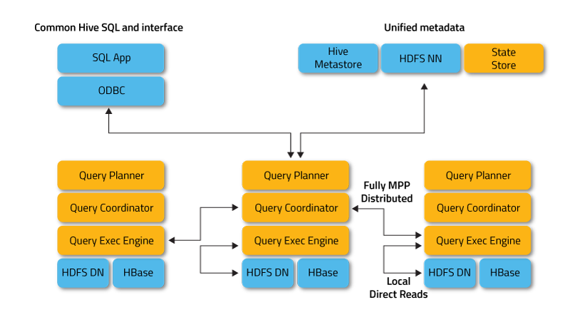
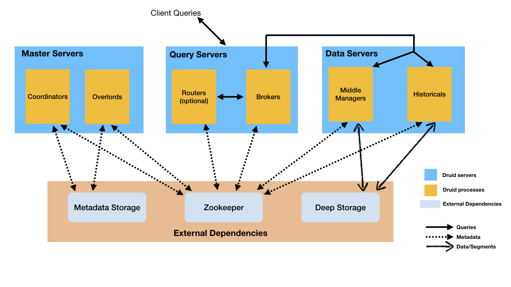
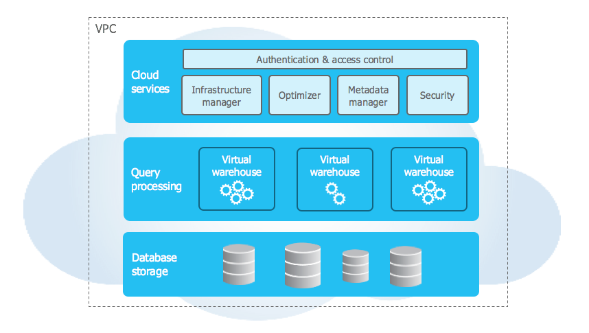

# 大数据系统-鉴赏

鉴赏系列：

回答一下几个问题：

- 使用场景，起源问题

- 核心原理、架构
- 优、缺点，竞品比较

[TOC]


## 1. Hadoop

### 1.1 目标场景

Hadoop是Google File System理念的开源版本，其分布式文件系统HDFS，依然是当前大数据系统生态的事实基础。MR的批处理模型，被其他大数据计算引擎如Spark所吸收，仍是重要的计算模式。（资源管理器YARN单独，hadoop自身的MR已经退环境了，不在此处谈论）

**GFS设计目标**（文件系统）

- 性能（吞吐）
- 可伸缩性
- 可靠性
  - 面临的环境
    - 组件失效是常态（廉价商业PC）(bug,硬件,人为)
- 可用性
- 适应google的应用负载（读写模式）和硬件环境
  - 大量的流式读，少量的随机读
  - 大文件普遍，数个G大小，数百万个文件
  - 修改操作，大部分是文件尾追加，而非覆盖
  - 应用原子操作文件系统API（高并发）


### 1.2 架构与原理


- Client
  - 控制流与数据流解耦
    - 与namenode元信息交互
    - 与datanode的读写IO
  - 就近访问
- NameNode
  - NameNode 负责管理文件系统命名空间，控制客户端对文件的访问。此外，它还执行诸如打开、关闭和重命名文件和目录之类的任务。
    - **FSImage –** HDFS 元数据的时间点快照。它包含文件权限、磁盘配额、修改时间戳、访问时间等信息。
    - **Edits log- ** 它包含对 FSImage 的修改。它记录增量更改，例如重命名文件、将数据附加到文件等。
  - Secondary NameNode
    - HA节点，容错，通过应用Edits log进行同步。
- DataNode
  - 数据的存储节点。
  - 一个文件被分成多个数据块并存储在一组DN上。
    - 块
      - 最小的存储单元。默认128MB/256MB。
        - 如果设计过小，导致元信息膨胀。
        - 扩展：关于数据分布有一致性hash，统一公式定位数据块，元信息不随数据量膨胀。但是节点有变更相关问题，数据迁移。（结合？)
  - 容错
    - 副本因子3


### 1.3 优缺点

HDFS存储引擎的优点

- 大数据集的存储
  - 传统的 RDBMS 无法存储大量数据。可用 RDBMS 中的数据存储成本非常高。因为它会产生硬件和软件的成本。（TB，PB级）
  - 可扩展，低成本
- 处理不同格式的数据
  - RDBMS 能够以结构化格式存储和操作数据。但在现实世界中，我们必须以结构化、非结构化和半结构化格式处理数据。
- 容错
  - 三副本

缺点：

- 小文件问题
  - 小文件小于hadoop块大小的文件。大量的小文件带来NN元信息管理负担。
- 


**缺点**

**计算框架MRv1的缺点**

- 扩展性问题，jobTacker同时具有资源管理和作业控制功能，导致成为瓶颈制约扩展性
- 可靠性，mastr/slave ，单点故障。
- 资源利用率低，槽位机制，map，reduce不共享
- 无法支持其他计算框架，内存计算，流计算，迭代计算，只用于磁盘的离线计算。


### REF

- [data-flair: Hadoop Tutorial](https://data-flair.training/blogs/hadoop-tutorial/) 推荐


## 2.Spark

### 2.1 目标场景


### 2.2 基本原理

#### 2.2.1 执行流程


具体运行流程如下：

1. SparkContext 向资源管理器注册并向资源管理器申请运行Executor

2. 资源管理器分配Executor，然后资源管理器启动Executor

3. Executor 发送心跳至资源管理器

4. SparkContext 构建DAG有向无环图

5. 将DAG分解成Stage（TaskSet）

6. 把Stage发送给TaskScheduler

7. Executor 向 SparkContext 申请 Task

8. TaskScheduler 将 Task 发送给 Executor 运行

9. 同时 SparkContext 将应用程序代码发放给 Executor

10. Task 在 Executor 上运行，运行完毕释放所有资源

Spark Application中可以因为不同的Action触发众多的job，一个Application中可以有很多的job，每个job是由一个或者多个Stage构成的，后面的Stage依赖于前面的Stage，也就是说只有前面依赖的Stage计算完毕后，后面的Stage才会运行。

Stage划分的依据就是宽依赖，像reduceByKey，groupByKey等算子，会导致宽依赖的产生。

#### 2.2.2 spark on yarn


application的spark-context在本机。


shuffle write：stage，task结果输出到本地文件系统。

shuffle read：stage读取依赖的stage的数据

本地读，远程读。（bar work）


### REF

- [Spark底层执行原理详细解析](https://mp.weixin.qq.com/s/qotI36Kx3nOINKHdOEf6nQ)

- Spark技术内幕 深入解析spark内核架构设计与实现原理-张安站


## 3.Yarn

### 3.1 场景

MR v1的改进版本，独立的资源管理框架，可以支持不同的计算框架，MR，Spark等。


### 3.2 Yarn原理

#### 3.2.1 基本架构


#### 3.2.2 yarn工作流程


1. 步 骤 1 用 户 向 YARN 中 提 交 应 用 程 序， 其 中 包 括 ApplicationMaster 程 序、 启 动ApplicationMaster 的命令、 用户程序等。
2. 步骤 2 ResourceManager 为 该 应 用程 序 分 配 第 一 个 Container， 并 与 对应 的 NodeManager 通信， 要求它在这个 Container 中启动应用程序的 ApplicationMaster。
3. 步 骤 3 ApplicationMaster 首 先 向 ResourceManager 注 册， 这 样 用 户 可 以 直 接 通 过
   ResourceManage 查看应用程序的运行状态， 然后它将为各个任务申请资源， 并监控它的运
   行状态， 直到运行结束， 即重复步骤 4~7。
4. 步骤 4 ApplicationMaster 采用轮询的方式通过 RPC 协议向 ResourceManager 申请和
   领取资源。
5. 步骤 5 一旦 ApplicationMaster 申请到资源后， 便与对应的 NodeManager 通信， 要求
   它启动任务。
6. 步骤 6 NodeManager 为任务设置好运行环境（包括环境变量、 JAR 包、 二进制程序
   等） 后， 将任务启动命令写到一个脚本中， 并通过运行该脚本启动任务。（与ArgoDBBAR的导入导出脚本，异曲同工）
7. 步骤 7 各个任务通过某个 RPC 协议向 ApplicationMaster 汇报自己的状态和进度， 以
   让 ApplicationMaster 随时掌握各个任务的运行状态， 从而可以在任务失败时重新启动任务。
   在应用程序运行过程中， 用户可随时通过 RPC 向 ApplicationMaster 查询应用程序的当
   前运行状态。
8. 步骤 8 应用程序运行完成后，ApplicationMaster 向 ResourceManager 注销并关闭自己。


#### 3.2.3 容错

app master 容错：RM 心跳检查，重启

container 容错：RM+AM处理

RM容错：HA


### 3.3 优缺点

### 3.3.1 相比MRv1优点

-  资源利用率提升。不同框架计算引擎，可以共用一套物理集群，运维成本降低。
-  数据共享，不同框架共用hdfs资源数据。
-  


### REF

- hadoop技术内幕：深入解析yarn架构设计与实现原理-董西成
- 


## 4.Delta Lake

### 4.1 场景

Delta Lake, 在 S3、ADLS、GCS 和 HDFS 等现有存储系统之上构建[Lakehouse 架构](http://cidrdb.org/cidr2021/papers/cidr2021_paper17.pdf)。 

数据湖/流批处理（取代lambda架构）。


主要特性：

- ACID 
  - 对于多个数据管道访问数据湖，可以保证ACID事务，serializability，[Diving into Delta Lake: Unpacking the Transaction Log](https://databricks.com/blog/2019/08/21/diving-into-delta-lake-unpacking-the-transaction-log.html)
- 可扩展的元数据处理
  - 在大数据系统中，元信息本身也是大数据（hadoop namenode的痛苦），Delta Lake将元信息分布式存储（或者说本地化，元信息与数据共址），使其可扩展。
- 提供时间旅行
  - 元信息管理的好处
- 开放格式
  - 数据使用parquet格式存储，易于接入hadoop 生态，并且高效压缩和编码。
- 统一批处理和流处理
  - 同时是数据流/数据表
- 支持Update、delete和merge
- 完全兼容Spark API
  - spark使用delta表非常简单
- 支持其他连接器：rust，python，hive，presto等


最佳实践：

COMCAST： PB级任务，640 server node -> 64; ETL job数量从 84 -> 3。


### 4.2 基本原理

Delta lake 采用将事务日志和元数据直接存储在云存储对象（论文针对的云对象存储，实际就是表）中，并在对象存储操作上使用一组协议来实现可序列化。


#### Delta表

表= 操作的集合 （当前的元信息、文件列表，事务列表，版本）

操作：

- 元信息变更（name，schema，分区等）
- 添加文件（可选，统计信息）
- 删除文件


#### 原子性

所有的变更，都会以有序，原子性的提交。

`.json` 文件是日志记录对象。包含一系列对的表操作，将其从一个状态，转移到下一个状态。如图所示，（对数据信息了变更，删除文件，增加文件）


为了改进读取大量commit log文件生成当前表状态的性能，引入检查点`.parquet`文件，定期存储之前所有非冗余的操作集合（parquet格式，高压缩的日志记录）。


采用乐观并发控制，提交时检测commit log文件是否冲突，冲突，读取变更，重试。

其他优化：Z-order格式，统计信息维护。


### 4.3 优缺点

传统lambda架构缺点：

- 架构复杂，批流处理分别引擎
- 并发处理，数据错误，验证
- 单点的元信息获取
  - 从hive metastore查询百万级的分区信息，namenode查询每个分区下的大量文件，千万，亿级
- 延迟数据需要再全部处理一遍。

优势：

- 是支持单表ACID的插件库，方便集成到现有hadoop生态。
- 支持同时的读写，并且保证数据一致性
- 高性能的大表读取
  - 元信息在本地，可以分布式处理
  - 向量化parquet读
- 错误写入可以回滚和删改
- 同时处理历史数据
- 处理迟到的数据，无需推迟下个阶段的数据处理
  - 通过update/merge into操作

缺点:

- 只是单表跨行事务


**对比**：apache  hive orc事务表，见 #6 节


### REF

- [官网](https://delta.io/)
- [github: delta](https://github.com/delta-io/delta)
- [delta-rs](https://github.com/delta-io/delta-rs)  rust访问delta lake 表
- [VLDB 2020 论文：delta lake: high-performance acid table storage over cloud object stores](https://databricks.com/wp-content/uploads/2020/08/p975-armbrust.pdf)
- [CIDR 2021：Lakehouse: A New Generation of Open Platforms that Unify Data Warehousing and Advanced Analytics](http://cidrdb.org/cidr2021/papers/cidr2021_paper17.pdf)
- [slide:Delta Lake：Open Source Reliability for Data Lake with Apache Spark 李潇](https://www.slideshare.net/XiaoLi8/delta-lake-architecture-delta-lake-apache-spark-structured-streaming)


## 5.HBase

### 5.1 场景

hbase是bigtable的开源版本，而bigtable是google为了存储大规模结构化、半结构化数据如（url,文档，图像，日志文件、二进制文件）的数据库系统。

提供随机访问的存储和检索。

行即一致性，水平扩展。

高可用（hdfs提供多副本），高性能（KV存储，列存，方便点查询，写入，数据量增长，时间增不明显），可扩展。

起源: google 互联网的搜索

根据关键词搜索，需要建立索引。索引根据MR计算出来。不停的通过爬虫抓取互联网上的文档，并存储进系统，单个文档能够插入，更新。用户搜索时，根据索引，查到到存储引擎中的文档。

场景：

- 抓取增量数据
  - 监控指标（用户的交互，服务流量等）
  - 遥测数据，存储用户计算机上生成的软件崩溃报告
  - 广告效果，点击流，待批处理分析，生成报表
- 内容服务
  - 存储各个用户生成内容，Twitter的贴子、图片等，并提供给自己和其他用户显示
  - URL短链，生成用户特征
- 信息交换
  - 短信系统
  - （hbase集群上千台，region管理，上下线问题处理。在星环处理20,30台的集群就容易出现各种问题）


### 5.2 基本原理

#### 5.2.1 基本架构


- Hbase client
  - Shell命令行接口、原生Java API编程接口、Thrift/REST API编程接口以及MapReduce编程接口
  - 提供DML/DDL操作，表管理等
- zookeeper
  - 监控master servers，并宕机时选举新master
  - 系统核心元信息，RegionServer地址(hbase:meta)
  - 参与RegionServer宕机恢复：ZooKeeper通过心跳可以感知到RegionServer是否宕机，并在宕机后通知Master进行宕机处理。
  - 实现分布式表锁：HBase中对一张表进行各种管理操作（比如alter操作）需要先加表锁，防止其他用户对同一张表进行管理操作，造成表状态不一致。
- Master
  - 处理client管理请求，建表，修改表，权限，切分表、合并数据分片以及Compaction等
  - 管理RegionServer，RegionServer中Region的负载均衡、RegionServer的宕机恢复以及Region的迁移等
  - 清理过期日志以及文件，Master会每隔一段时间检查HDFS中HLog是否过期、HFile是否已经被删除，并在过期之后将其删除
- RegionServer
  - 响应用户的IO请求
    - WAL(HLog)：持久化，hbase集群主从复制
    - BlockCache：读缓存。
    - Region：数据表的一个分片，负载均衡的基本单位
      - Store：数量对应表中列族的个数，推荐IO特性相同的放在一个列族
        - MemStore:1个，LSMtree的内存实现结构。
        - HFile:1或多个，MemStore写满后（默认128M），异步刷新到磁盘的结构。定期compact合并成大的文件
- HDFS
  - hbase实际存储系统，HFile，HLog都会写入hdfs。


### 5.3 优缺点

优点：

- 存储容量大
  - 单表支持千亿行，百万列，数据容量达TB，PB级别
- 良好的扩展性
  - 数据存储节点Datanode，读写服务节点regionserver扩展容易
  - 当然还是存储单点，nn，master
- 稀疏存储
  - kv存储，允许大量列为null值，不占用空间
- 高性能
  - oltp场景，随机单点查询，小范围扫描性能好。大范围使用MR的接口。
- 多版本
  - 拥有时间戳，可以时间旅行的读取
- 支持过期
  - 自动清理过期数据
- hadoop生态
  - 存储直接使用hadoop，很容易接入其他系统


缺点：

- 聚合性能很差
  - group by，join
- 本身没有二级索引
  - 第三方Phoenix提供的二级索引功能
- 只支持单行事务
  - 第三方Phoenix提供的全局事务模型组件


竞品比较：

HBase与TiKV 对比。

功能。支持的存储。

成本(服务硬件需求)


### REF

- [HBase原理与实践-胡争](https://weread.qq.com/web/reader/632326807192b335632d09ckc81322c012c81e728d9d180) 微信读书网页版，微信刷码即可，**推荐分析原理解析时阅读**
- 《HBase实战》
- 


## 6. Hive

### 6.1 场景


### 6.2 基本原理


#### 6.2.2 ACID

hive acid特性用来处理的**场景**：

- 流式摄取数据。

  - kafka等数据流每秒数百行或更多行的速度写入数据，但 Hive 只能每十五分钟到一小时添加一次分区。
  - 更频繁地添加分区会导致，分区数量过多，产生元信息管理负担。
  - 若直接写到现有分区，产生脏读，并且产生大量小文件，加重namenode的负担。

- 维度表的更新

- 数据纠正

- 使用merge进行批量更新

  

**基本设计**

遵从HDFS的特点，不对文件就地修改，新纪录，更新和删除都存储在增量文件中。

写入时，为每个更改表或分区的事务创建一组新的增量文件。

读取时，读取器合并基本文件和增量文件，在读取时应用任何更新和删除。

```shell
# 原始普通表的文件结构
00000_0	#桶0
00000_1	#桶1

# orc事务表文件结构
00000_0	#桶0
00000_1	#桶1
delta_0000005_0000005/bucket_00000	#事务5到5，桶0 delta
delta_0000005_0000005/bucket_00001	#事务5到5，桶1 delta

# delta文件过多时，将多个事务compaction成一个
00000_0	#桶0
00000_1	#桶1
delta_0000005_0000015/bucket_00000	#事务5到15，桶0 delta
delta_0000005_0000015/bucket_00001	#事务5到15，桶1 delta
```


行的唯一标识符：(原始事务id，bucket号，自动分配的行id) 并且文件以此排序。

增加和删除操作分别使用不同的目录保存，（ 0 表示插入，1 表示更新，2 表示删除）

读取过程：

```
+----------+    +----------+    +----------+
| base_1   |    | delete_2 |    | delta_2  |
+----------+    +----------+    +----------+
| 1-0-0-1  |    | 1-0-1-2  |    | 2-0-0-2  |
| 1-0-1-1  |    | 1-0-2-2  |    | 2-0-1-2  |
| 1-0-2-1  |    +----------+    +----------+
+----------+

解释：
base_1是原始文件数据；
delete_2是第二个事务merge，删除的行；
delta_2是第二个事务增加的文件

文件数据合并：
1. 对所有数据行按照 (originalTransaction, bucketId, rowId) 正序排列，
(currentTransaction) 倒序排列：
	1-0-0-1
	1-0-1-2
	1-0-1-1
	...
	2-0-1-2
2. 处理每一行，
如果当前记录的 row__id 和上条数据一样，则跳过（因为是旧事务的内容，被覆盖）；
如果当前记录的操作类型为 DELETE，也跳过；
否则输出

代码实现原理：
Hive 会将所有文件打开，预读第一条记录，并将 row__id和currentWriteId信息存入到 ReaderKey类型中，自定义，排序键。
ReaderKey会和文件句柄一起存入到TreeMap结构中。根据该结构的特性，每次获取第一个元素时就能得到排序后结果。

```

并行执行:

广播所有delete文件，使mapper输出的结果，以无删除的记录，最后在reducer 合并多个update。


支持向量化，批量记录处理优化（delete 文件全部读取内存）


事务管理器：DbTxnManager 用于分配事务id。具体实现是向Hive Metastore，递增的事务id表查询并更新（使用事务）。


delta lake区别：

都是在表/分区级别实现事务，但是具有全局的事务管理器，更加重量级，并且数据无法与普通orc表格式一样容易迁移（有额外失败的事务信息，确定哪些事务非法）。

但是能够更加细粒度的管理事务（行），delta lake是文件粒度管理表的更新，为了性能考虑，控制小文件数量，不适合只是少量修改。


### 6.3 优缺点


### REF

- [apache hive acid](https://docs.cloudera.com/HDPDocuments/HDP3/HDP-3.1.4/using-hiveql/content/hive_3_internals.html)
- [hive transaction](https://cwiki.apache.org/confluence/display/Hive/Hive+Transactions)
- [apache orc acid](https://orc.apache.org/docs/acid.html)
- [深入理解 Hive ACID 事务表](http://shzhangji.com/cnblogs/2019/06/11/understanding-hive-acid-transactional-table/)


## 7.Presto

Presto是一个分布式的采用**MPP架构**的查询引擎，本身并不存储数据，但是可以接入多种数据源，并且**支持跨数据源的级联查询**。Presto是一个OLAP的工具，擅长对海量数据进行复杂的分析；但是对于OLTP场景，并不是Presto所擅长，所以不要把Presto当做数据库来使用。

Presto是一个低延迟高并发的**内存计算引擎**。需要从其他数据源获取数据来进行运算分析，它可以连接多种数据源，包括Hive、RDBMS（Mysql、Oracle、Tidb等）、Kafka、MongoDB、Redis等。


额外:为了支持多源，也使用classloader方式，支持不同的数据源client，依赖的不同版本的jar包


TODO：比较星环联邦计算方案

spark 批处理架构，sql，谓词等下推（dblink技术，jdbc），数据源（oracle，cdh，TD等）


和Apache HAWQ（MPP和批处理融合）差异？

支持的数据源。

## 8.Impala

### 8.1 场景

Apache Impala是采**用MPP架构**的查询引擎，本身不存储任何数据，**直接使用内存进行计算**，兼顾数据仓库，具有实时，批处理，多并发等优点。

提供了类SQL（类Hsql）语法，在多用户场景下也能拥有较高的响应速度和吞吐量。它是由Java和C++实现的，Java提供的查询交互的接口和实现，C++实现了查询引擎部分。


Impala支持共享Hive Metastore，但没有再使用缓慢的 Hive+MapReduce 批处理，而是**通过使用与商用并行关系数据库中类似的分布式查询引擎**（由 Query Planner、Query Coordinator 和 Query Exec Engine 三部分组成），可以直接从 HDFS 或 HBase 中用 SELECT、JOIN 和统计函数查询数据，从而大大降低了延迟。

Impala经常搭配存储引擎Kudu一起提供服务，这么做最大的优势是查询比较快，并且支持数据的Update和Delete。


场景：

- 基于HDFS、HBase存储数据的OLAP分析
  - 与spark、hive区别基于MPP框架而非MR执行框架
- 批、实时处理统一平台
  - 支持实时的原因使用MPP


### 8.2 原理



架构优势：

- 数据本地处理，避免网络瓶颈
  - 依然有数据广播
  - 群居聚合节点是单点
- 单个、开放和统一的元数据存储
  - （没get到，个人觉得只是因为实现简单，也不考虑高可用）
  - 简化部署
- 查询引擎直接访问数据，无数据格式转换开销
  - 本地节点直接读，不经过HDFS网络传输
- HDFs、HBase数据立即查询，没有ETL延迟
- 支持代码生成
  - tpc-h q1 提升5.7x


TODO：（MPP与MR的融合）


### 8.3 优缺点

优点：

- SQL on hadoop可以很容易在现有的HDFS、HBase、Hive架构基础上构建起来
- MPP架构性能比hive好（宣称快一个数量级）
- 更高的查询吞吐比例（相比sparksql，presto，hive）
- 支持delete、update、delete（only Kudu tables）


缺点：

- 内存依赖较大？
- 分区数限制，超过1w性能下降严重？
  - 分区元信息，metastore查询延迟?


### REF

- [Impala](https://impala.apache.org/)
- Kornacker, M., Behm, A., Bittorf, V., Bobrovytsky, T., Ching, C., Choi, A., … Yoder, M. (2015). Impala: A modern, open-source SQL engine for Hadoop. CIDR 2015 - 7th Biennial Conference on Innovative Data Systems Research.
- [Apache Impala Guide 4.0](https://impala.apache.org/docs/build/impala-4.0.pdf)


## 9.Elasticsearch

### 9.1 场景

Elasticsearch 为**所有类型的数据**提供近乎实时的搜索和分析。结构化或非结构化文本、数值数据，地理空间数据，都能快速搜索的方式高效地存储和索引。


Elasticsearch 是位于 Elastic Stack 核心的分布式搜索和分析引擎。

- Eslastic新的产品套件名叫 Elastic Stack，另外两个组件：
  - Logstash 和 Beats用于收集数据
  - Kibana 用于交互方式查询、可视化和管理和监控

应用:

- 向应用或网站添加搜索框
- 存储和分析日志、指标和安全事件数据
  - 维基百科全文搜索并高亮显示关键词，搜索建议等功能
  - github 检索代码
- 使用机器学习实时自动建模数据的行为
- 使用 Elasticsearch 作为存储引擎自动化业务工作流
- 使用 Elasticsearch 作为地理信息系统 (GIS) 管理、集成和分析空间信息
  - 当做nosql数据库，读写性能上优于MongoDB
- 使用 Elasticsearch 作为生物信息学研究工具存储和处理遗传数据


### 9.2 原理

整体架构


- RESTful API 用户接口
- 传输模块和JMX
  - 传输模块
    - 支持Thrift、Memcached、HTTP，默认使用HTTP传输。
  - JMX
    - Java管理框架，管理Elasticsearch应用
- Discovery、Scripting和第三方插件
  - 发现模块，负责集群master选举
  - Scripting，支持JavaScript、Python等多种语言，在查询语句中嵌入
- ES功能模块
  - 索引模块、搜索模块、映射解析模块等
- 分布式的Lucene框架
  - 维护各个节点上的Lucene引擎
- Gateway
  - Elasticsearch用来存储索引的文件系统，支持多种文件系统类型


- 集群
  - 一个或多个ES服务器节点构成的集群
  - 集群名cluster name唯一标识
- 节点
  - 主节点
    - 每个集群在任何时间点都有一个主节点，负责维护集群的健康和状态
    - 主节点负责所有集群范围的操作，包括索引的创建和删除
    - master-eligible节点，候选节点
  - 数据节点
    - 保存实际的索引数据并处理数据的摄取、搜索和聚合
    - 建议堆大小最大为30GB
  - 客户端节点
    - 集群的网关，负责负载均衡，帮助均衡传入的摄取和搜索请求，将传入请求路由到各个集群节点
  - 摄取节点
    - 数据预处理，（CPU密集型），隔离数据节点的查询


与关系数据概念对比


- 索引
  - 拥有**相似特征**（并不要求完全一致）的文档的集合，数据结构是**倒排索引**
    - 客户索引，产品目录索引，订单数据索引等。
  - 索引可以分片shard，横向扩展
- 类型
  - 索引的逻辑分类，分区。通常为具有一组共同字段的文档定义一个类型。
- 文档
  - 一个可被索引的基础信息单元
  - JSON格式
- 分片
  - 索引划分的一部分数据。创建是指定
- 副本
  - 分片的复制分片，进行容错


### 9.3 优缺点

优点：

- 分布式，通过shards支持横向扩展
- 全文检索，基于lucene提供强大的全文检索
- 近实时搜索和分析，支持聚合分析
- 高可用，节点容错，负载均衡
- 模式自由
  - 动态mapping机制可以自动检测数据的结构和类型，创建索引，并使数据可搜索
- RESTful API
  - json的http请求


### REF

- [github: ElasticSearch](https://github.com/elastic/elasticsearch)
- [doc:ElasticSearch](https://www.elastic.co/guide/en/elasticsearch/reference/current/index.html)
- [从Lucene到Elasticsearch：全文检索实战](https://weread.qq.com/web/reader/f2132080719b1f87f2167b1kc81322c012c81e728d9d180)
- [A Comprehensive Guide to OpenSearch and Elasticsearch Architecture](https://www.instaclustr.com/opensearch-and-elasticsearch-architecture/)


## 10.Clickhouse

### 10.1 场景

#### BI 背景

传统BI问题：生成业务决策的各种报表，需要花费大量时间，实时性不足。

一些改进的措施，引入数据仓库的概念，汇总数据，避免信息孤岛（后来的，多样格式的数据，数据湖）。

- 对数据进行分层，通过层层递进形成数据集市，从而减少最终查询的数据体量；

- 提出数据立方体的概念，通过对数据进行预先处理，以空间换时间，提升查询性能；

新BI：轻量级，Excel文件也能分析。数据分析师角色增加，不再只是高策决策查看。数据分析的普及化（个人用户，查询自己的统计，网易云音乐，支付宝年度总结）。互联网用户对实时性的要求增加，立即得到。


#### OLAP 架构分类

多维分析: 立方体cube操作

- 下钻：从高层次向低层次明细数据穿透。例如从“省”下钻到“市”，从“湖北省”穿透到“武汉”和“宜昌”。
- 上卷：和下钻相反，从低层次向高层次汇聚。例如从“市”汇聚成“省”，将“武汉”“宜昌”汇聚成“湖北”。
- 切片：观察立方体的一层，将一个或多个维度设为单个固定值，然后观察剩余的维度，例如将商品维度固定为“足球”。
- 切块：与切片类似，只是将单个固定值变成多个值。例如将商品维度固定成“足球”“篮球”和“乒乓球”。
- 旋转：旋转立方体的一面，如果要将数据映射到一张二维表，那么就要进行旋转，这就等同于行列置换。


实现这些操作的，OLAP架构：

- ROLAP，关系型OLAP。关系模型，数据模型常使用星型模型或者雪花模型。SQL查询。
- MOLAP，多维型OLAP。预先聚合结果，间换取时间，典型Kylin。（更新问题，数据存储空间膨胀问题，无法查询明细信息，下钻操作）
- HOLAP，混合架构OLAP。ROLAP和MOLAP两者的集成。

OLAP演进，大数据的兴起，ROLAP 关系数据库 -> Hive，SparkSQL。（批处理，大规模数据，实时性不足，亚毫秒级，并发）

MOLAP演进，利用MR，Spark作为计算引擎，加速cube的构建。聚合结果，存储在hbase等分布式数据库。

（仍未解决维度爆炸、数据同步实时性不高）

>## OLAP场景的关键特征[ ](https://clickhouse.tech/docs/zh/#olapchang-jing-de-guan-jian-te-zheng)
>
>- 绝大多数是读请求
>- 数据以相当大的批次(> 1000行)更新，而不是单行更新;或者根本没有更新。
>- 已添加到数据库的数据不能修改。
>- 对于读取，从数据库中提取相当多的行，但只提取列的一小部分。
>- 宽表，即每个表包含着大量的列
>- 查询相对较少(通常每台服务器每秒查询数百次或更少)
>- 对于简单查询，允许延迟大约50毫秒
>- 列中的数据相对较小：数字和短字符串(例如，每个URL 60个字节)
>- 处理单个查询时需要高吞吐量(每台服务器每秒可达数十亿行)
>- 事务不是必须的
>- 对数据一致性要求低
>- 每个查询有一个大表。除了他以外，其他的都很小。
>- 查询结果明显小于源数据。换句话说，数据经过过滤或聚合，因此结果适合于单个服务器的RAM中

#### ClickHouse的起源

俄罗斯的Yandex（搜索引擎），业务背景在线流量分析Yandex.Metrica（支持广告投放，用户行为分析）。

发展阶段

- 早期的Yandex.Metrica以提供固定报表的形式帮助用户进行分析，例如分析访问者使用的设备、访问者来源的分布之类。使用了MySQL数据库作为统计信息系统的底层存储和分析引擎的解决方案。
  - 关心写入和查询，不关系事务，使用MyISAM表引擎
  - B+树存储，多点并行，随机写入。产生大量磁盘碎片。
  - 经过许多优化，控制在26s内。但是数据越来越大（2011年，5800亿行）
- Metrage系统。
  - Key-Value模型（键值对）代替了关系模型。
  - LSM树代替了B+树。写入性能增强。顺序写。
  - 由实时查询的方式改为了预处理。MOLAP路线。
  - 结果：超过3万亿行的数据，超过60台服务器，查询性能1s以内。（解决了性能瓶颈）
  - 缺点，数据膨胀10-20倍。
- OLAPServer系统。
  - 需要支持自定义分析报告服务（ad-hoc查询）。无法预聚合。
  - 关系模型。
  - SQL。
  - 存储结构和索引。结合MyISAM和LSM树。索引文件和数据文件。索引，lsm树稀疏索引定位数据段。数据文件，数据段内有序。索引文件和数据文件按照列字段的粒度进行了拆分，每个列字段各自独立存储。（列存）
  - 缺点，只支持定长数值类型，无DDL支持。
  - 解决ad-hoc实时聚合的性能问题。
- ClickHouse系统。
  - ROLAP架构。实时聚合。
  - **Click**Stream + Data Ware**House**
  - 列存，SQL，实时。
  - 20万亿行，90%查询在1s内。

适合场景：

ClickHouse非常适用于商业智能领域（也就是我们所说的BI领域），除此之外，它也能够被广泛应用于广告流量、Web、App流量、电信、金融、电子商务、信息安全、网络游戏、物联网等众多其他领域。

不适合场景——OLTP事务性操作的场景：

- 不支持事务。

- 不擅长根据主键按行粒度进行查询（虽然支持），故不应该把ClickHouse当作Key-Value数据库使用。

- 不擅长按行删除数据（虽然支持）。


现实应用：

欧洲核子研究中心（CERN）将它用于保存强对撞机试验后记录下的数十亿事件的测量数据，并成功将先前查找数据的时间由几个小时缩短到几秒。


### 10.2 基本架构与原理

ClickHouse是单一角色节点的设计，但是支持分布式的集群部署。与kafka的选择相同。（全网暂无一张架构图，仅源码模块组织图）


- Columns模块

  - ClickHouse按列存储数据，内存中的一列数据由一个Column对象（继承IColumn，例如ColumnString，ColumnArray）表示，定义了对数据进行各种关系运算的方法（create，insert，filter，getData）。Field对象代表一个单值，内部聚合了Null、UInt64、String和Array等13种数据类型及相应的处理逻辑

- DataTpye模块

  - 数据的序列化和反序列化。继承IDataType，获取各种数据类型的SerDe实例。

- DataStreams模块

  - ClickHouse内部的数据操作是面向Block对象进行，并且采用了流的形式。
  - 包含数据的类型及列的名称。Column、DataType。使用ColumnWithTypeAndName获得引用。
  - IBlockInputStream负责数据的读取和关系运算，IBlockOutputStream负责将数据输出到下一环节。
  - 实现类
    - 处理数据定义的DDL操作，DDLQueryStatusInputStream
    - 处理关系运算的相关操作，LimitBlockInputStream，JoinBlockInputStream
    - 处理表引擎访问，MergeTreeBaseSelectBlockInputStream（MergeTree表引擎）

- Storages模块

  - 表引擎。使用IStorage接口指代数据表。数据访问（指定列的原始数据）。
  - 不同的表引擎由不同的子类实现，例如IStorageSystemOneBlock（系统表）、StorageMergeTree（合并树表引擎）和StorageTinyLog（日志表引擎）等。 
  - IStorage接口定义了DDL，read和write方法。
  - 存储：mysql，pg，mergeTree，kafka，hdfs，rocksdb等等。

- Parser与Interpreter模块

  - Parser分析器负责创建AST对象
  - Interpreter解释器则负责解释AST，并进一步创建查询的执行管道（以线程的形式），返回IBlock对象。

- Functions与Aggregate Functions模块

  - 普通函数
    - 无状态，作用每一行。向量化执行。
  - 聚合函数
    - 有状态。聚合函数的状态支持序列化与反序列化，能够在分布式节点之间进行传输，以实现增量计算

- Server模块

  - 连接协议层。http，tcp，grpc，mysql，pg，prometheus

- Cluster与Replication模块

  - ClickHouse的集群由分片（Shard）组成（逻辑概念），而每个分片又通过副本（Replica）组成（物理）。

  - 1个节点只能拥有1个分片。1分片、1副本，对应实际1个物理副本（ES概念，则是2个分片，副本是特殊的分片）。


极度关注底层实现性能，通过各种数据结构和算法优化等，代码级优化（Aggregator 针对不同的数据类型使用不同的 Hash 表进行优化）。


### 10.3 优缺点

优点：

- 列存
- 数据压缩
- 向量化执行，SIMD，编译执行
- 多核并行处理
- 支持分布式查询处理，多节点
- 较完备的SQL
- 实时数据更新MergeTree
- 索引，主键索引（稀疏索引），二级索引
- 自适选择应连接算法


性能指标：

- 单个大查询的吞吐量：
  - page cache命中：2-10GB／s 处理
  - 否则，取决于磁盘系统和数据的压缩率，磁盘400MB／s的速度读取数据，数据压缩率是3，则数据的处理速度为1.2GB/s
- 处理短查询的延迟时间
  - page cache命中： < 50ms（10ms）
  - 未命中： 查找时间（10 ms） * 查询的列的数量 * 查询的数据块的数量
- 处理大量短查询的吞吐量
  - 单服务器，建议100 qps
- 数据的写入性能
  - 建议，每批1000行以上，1 qps 
  - 单insert，写入速度大约为50到200MB/s，可以多insert 并行，线性提高。

缺点：

- 无完整事务支持
- 仅批量删除或修改数据，无法高频，低延迟修改，删除单行数据。
- 不适合点查询，由于使用的是稀疏索引。
- 运维，不太方便，用户手动分片，**扩容/缩容后数据无法自动平衡，只能通过低效的数据重新导入的方式来进行人工平衡**
- 单表查询性能高，但是 Join 性能不高
  - 分布式 Join 处理方式不进行 Shuffle exchange， 不适合数据量大
  - 子查询的join，导致单点join。


### REF

- ClickHouse原理解析与应用实战-朱凯
- [clickhouse 官方中文文档](https://clickhouse.tech/docs/zh/) 可下载
- [ClickHouse 在有赞的实践之路](https://tech.youzan.com/clickhouse-zai-you-zan-de-shi-jian-zhi-lu/)


## 11.Kafka

### 11.1 场景

LinkedIn开发的分布式消息（中间件）系统，后独立成立Confluent公司，现刚上市(2021.6.25)。

kafka最新版本2.8.0。

> 起源：
>
> 开始时是用作活动流（Activity Stream）和运营数据处理管道（Pipeline），现在被广泛用于多种类型的数据管道和消息系统使用。
>
> Linked的问题——《权威指南》1.5.1节

现在定位为分布式事件流平台，用于**高性能数据管道**、**流分析**、**数据集成**和关键任务应用程序。

> 活动数据：
>
> 站点在对其网站使用情况，包括页面访问量（Page View）、被查看内容方面的信息以及搜索情况等
>
> 运营数据：
>
> 服务器的性能数据（CPU、IO 使用率、请求时间、服务日志等等数据)
>
> 传递消息：
>
> 应用程序向用户发送通知，邮件。（原神邮箱）
>
> 应用成组件只负责生成消息，不关心消息个事，何时发送。
>
> 一个公共应用程序，负责格式化消息，多个消息，同一个通知发送，根据用户配置的首选项发送数据。
>
> 日志存储：
>
> 把数据库的更新发布到Kafka上，应用程序的产生的事件流对数据库进行实时的更新。变更日志流，把对数据的更新操作，复制到远程系统，或者合并多个更新，统一更新数据库。kafka为变更日志提供缓存区，在消费者应用故障，重放日志，恢复系统状态。


#### 设计目标

- 高吞吐率。用于处理庞大的消息事件。即使在非常廉价的商用机器上也能做到单机支持每秒 100K 条以上消息的传输。
- 高性能。以时间复杂度为 O(1) 的方式提供消息持久化能力，即使对 TB 级以上数据也能保证常数时间复杂度的访问性能。处理效率不随数据量增加而降低。
- Scale out：支持在线水平扩展。
- 高可用，数据不丢。数据存储。kafka集群的服务器可跨数据中心。运行部分机器故障的存在。
- 消息传输。解耦生产者和消费者，通过持久化，允许支持多个消费者。发布与订阅能力。
- 支持离线数据处理（批量消息处理）和实时数据处理（实时流处理）。


### 11.2 基本架构


Kafka组件由client端的API和部署在服务器上运行的Broker集群构成。与一般的大数据系统不一样，作为消息中间件系统，Client是一个很重要的组件。

Client API:

- Producer API：发布消息到1个或多个topic（主题）中
- Consumer API：来订阅一个或多个topic，并处理产生的消息
- Streams API ：充当一个流处理器，从1个或多个topic消费输入流，并生产一个输出流到1个或多个输出topic，有效地将输入流转换到输出流。
- Connector API ：可构建或运行可重用的生产者或消费者，将topic连接到现有的应用程序或数据系统。例如，连接到关系数据库的连接器可以捕获表的每个变更。

Client与服务器集群的通信，使用TCP协议。

2.8版本kraft模式（旧版本还有一个Zookeeper组件，管理集群配置，选举leader。新版本已经去除，无需依赖zk，而是自己管理，更加轻量级）（服务集群只有一种broker角色，很有p2p的精神:D）


#### 基础概念

- kafka作为一个集群运行在一个或多个服务器上。

- kafka集群存储的消息是以topic为类别记录的。
  - Topic：Kafka将消息分门别类，每一类的消息称之为一个主题（Topic）

- kafka的消息结构
  - key
  - value
  - timestamp
- Broker代理
  - 消息存储器

##### 事件流

> 从技术上讲，事件流是从数据库、传感器、移动设备、云服务和软件应用程序等事件源以事件流的形式实时捕获数据的做法；
>
> 持久地存储这些事件流以供以后检索；
>
> 实时和回顾性地操作、处理和响应事件流；
>
> 并根据需要将事件流路由到不同的目标技术。

事件流应用

> - 实时处理支付和金融交易，例如在证券交易所、银行和保险中。
> - 实时跟踪和监控汽车、卡车、车队和货物，例如物流和汽车行业。
> - 持续捕获和分析来自物联网设备或其他设备（例如工厂和风电场）的传感器数据。
> - 收集客户互动和订单并立即做出反应，例如在零售、酒店和旅游行业以及移动应用程序中。
> - 监测住院病人并预测病情变化，以确保在紧急情况下得到及时治疗。
> - 连接、存储和提供公司不同部门产生的数据。
> - 作为数据平台、事件驱动架构和微服务的基础。


生产者向kafka写入事件。

消费者订阅（读取和处理）这些事件。生产者和消费者完全解耦，互不可知。

事件被组织并持久地存储在**主题**中。主题类似于文件系统中的文件夹，事件就是该文件夹中的文件。

Kafka 中的主题总是多生产者和多订阅者：一个主题可以有零个、一个或多个向其写入事件的生产者，以及零个、一个或多个订阅这些事件的消费者。

与传统消息传递系统不同，事件在消费后不会被删除。可以配置过期时间。


主题是**分区的**，一个主题分布在位于不同 Kafka  broker的多个“桶”上。分区的好处，在于**允许客户端应用程序同时从/向多个broker读取和写入数据**。具有相同事件key的时间被写入同一个分区。

Kafka[保证](http://kafka.apache.org/documentation/#intro_guarantees)给定主题分区的任何消费者将始终以与写入事件完全相同的顺序读取该分区的事件。

为了数据的容错性和高可用，每个主题都可以**复制**（分区级别），甚至可以跨地理区域或数据中心**复制**，以便始终有多个代理拥有数据副本。


### 11.3 优缺点

优点：

kafka作为消息系统。

天然具有解耦系统，数据的生产和使用；持久化冗余数据、日志，保证数据安全性；

扩展性，不单自己可扩展，借助消息队列，外部队列也可以根据需要调整。

削峰，应对突然的流量，避免关键组件崩溃。

异步通信；缓冲，合并消息处理；

独特优点：

顺序性的保证：分区内，消息有序；容错，允许少量机器宕机。


缺点：

kafka的高性能，一大原因是利用pagecache。

但是在单机topic和partition数量过多时，不同partition竞争pagecache。

导致整个 Broker 的处理延迟上升、吞吐下降。


挑战者：

Pulsar


### REF

- [Kafka官网](http://kafka.apache.org/)
- [Kafka 设计解析（一）：Kafka 背景及架构介绍](https://www.infoq.cn/news/kafka-analysis-part-1)
- Kafka权威指南
- Kafka stream实战-(英)
- Kafka 技术内幕-郑奇煌
- Kafka源码解析与实战-王亮
- [Kafka教程-OrcHome](https://www.orchome.com/5) 中文版翻译，持续保持更新


## 12.Flink

### 12.1 场景

Flink前身柏林理工大学的一个研究性项目，目标是要让大数据的处理看起来更加地简洁，2014年被Apache孵化器接受，是Apache社区最活跃的大数据项目。一个框架和**分布式处理引擎**（专为流处理的spark），用于对***无界和有界***数据流进行**有状态计算**。Flink 被设计为在*所有常见的集群环境中*运行，*以**内存速度***和***任何规模***执行计算

解决的问题：

- 事件时间处理语义
- 状态的一次性处理一致性保证

场景：

- 事件驱动的应用
  - 监听事件，触发异步任务完成
  - 欺诈检测，异常检测，基于规则的报警，业务流程监控
- 数据分析
  - 实时分析，低延迟；支持故障恢复，避免复杂组件的运维，故障处理逻辑
  - 电信网络质量监控，移动应用产品更新与实验评估分析，实时推荐
  - 双11成交额实时汇总，包括PV、UV的统计
- 数据管道应用
  - 有非常丰富的Connector，支持多种数据源和数据Sink，囊括了所有主流的存储系统
  - 比ETL，延迟更低，满足**实时数仓**、数据湖的需求
  - 电子商务中的实时搜索索引构建，电子商务中的持续 ETL


### 12.2 基本架构与原理

#### 架构


#### Flink编程


分布式执行


#### 流批一体的处理架构


- **SDK 层**。Flink 的 SDK 主要有两类，第一类是关系型 Relational SDK 也就是 SQL/Table，第二类是物理型 Physical SDK 也就是 DataStream。这两类 SDK 都是流批统一，即不管是 SQL 还是 DataStream，用户的业务逻辑只要开发一遍，就可以同时在流和批的两种场景下使用；
- **执行引擎层**。执行引擎提供了统一的 DAG，用来描述数据处理流程 Data Processing Pipeline(Logical Plan)。不管是流任务还是批任务，用户的业务逻辑在执行前，都会先转化为此 DAG 图。执行引擎通过 Unified DAG Scheduler 把这个逻辑 DAG 转化成在分布式环境下执行的Task。Task 之间通过 Shuffle 传输数据，我们通过 Pluggable Unified Shuffle 架构，同时支持流批两种 Shuffle 方式；
- **状态存储**。状态存储层负责存储算子的状态执行状态。针对流作业有开源 RocksdbStatebackend、MemoryStatebackend，也有商业化的版本的GemniStateBackend；针对批作业我们在社区版本引入了 BatchStateBackend。


#### 利用内存性能

任务的状态始终保留在内存中，超过存储在磁盘。

定期和异步地对本地状态进行持久化存储来保证故障场景下精确一次的状态一致性。


### 12.3 优缺点

优点：

- 可扩展，支持上千节点，吞吐量更高，延迟更低，准确 （相比storm）
- 高性能，内存计算
- 支持SQL，有状态计算
- 高可用，无单点故障
- 容错，“Exactly-Once”处理
- 易部署，可以被yarn，k8s调度或独立集群运行
- 事件级粒度的处理，实时（相比spark  streaming  mini-bacth）
- 流批一体处理（有界，无界数据流）


### REF

- [Flink官网-中文介绍](https://flink.apache.org/zh/flink-architecture.html)
- [阿里云-Flink 必知必会经典课程1：走进 Apache Flink](https://developer.aliyun.com/article/782689) 推荐，是一个系列
- [Flink 必知必会经典课程2：Stream Processing with Apache Flink](https://developer.aliyun.com/article/782945?spm=a2c6h.12873581.0.0.6f6d2634okYVLn&groupCode=sc)
- [Flink 执行引擎：流批一体的融合之路](https://developer.aliyun.com/article/783112?spm=a2c6h.12873581.0.0.6f6d2634okYVLn&groupCode=sc)
- [七大经典技术场景！Apache Flink 在多维领域应用的 40+ 实践案例](https://developer.aliyun.com/article/783020?spm=a2c6h.12873581.0.0.6f6d2634okYVLn&groupCode=sc)
- Flink原理与实践/鲁蔚征
- Flink内核原理与实现/冯飞，崔鹏云


## 13.Pulsar


## 14.Kylin


## 15. Apache Doris/DorisDB/StarRocks

### 15.1 场景

原百度广告业务的实时分析场景业务开发的Palo，捐赠给Apache 更名的Doris。  Doris的成员，成立的商业公司，在Doris基础上，扩展开发DorisDB（鼎石数据库）。

DorisDB更新，并且文档更详细，下面以DorisDB介绍为主。

DorisDB是面向OLAP业务，兼容MySQL协议，列存储，MPP执行框架，分布式数据库。

--- 2021.09.08 更新

DorisDB再次更名为StarRocks（同时暴露出，DorisDB与Apache Doris并非一路，产生巨大争议）。

旨在“新一代流批融合的极速湖仓（Lakehouse）”，认为snowflake 仅仅完成了离线分析。（当前也一些面向云环境的实时流系统）

roadmap：

- 设计全新实时和离线融合的云原生架构，可以同时高效管理实时数据和离线数据
- 全新流批融合的向量化计算引擎，可以同时进行极速的批处理和流处理

（当前应该还只是愿景，从开源的StarRocks，与Apache Doris代码结构一致，还没有发现有特别为云环境，做的特别的设计）


面向企业级用户分析需求：

- OLAP多维分析
- 定制报表
- 实时数据分析
- Ad-hoc数据分析
- 亚秒级查询


适用业务场景：

- 数据仓库建设
- OLAP/BI分析
- 用户行为分析
- 广告数据分析
- 系统监控分析
- 探针分析 APM（Application Performance Management）


特性功能：

- 前端java，后端C++
- 标准SQL支持
- MPP执行框架
  - 支持亚秒级查询、查询QPS可以10000以上
- 流批导入
  - 支持数据源kafka实时导入，HDFS，本地文件批量导入
  - 支持数据格式ORC， Parquet和CSV
- 智能物化视图
  - 创建物化视图，生成预聚合表用于加速聚合类查询请求
  - 智能
    - 数据导入时，自动完成聚合
    - 查询自动选择
- 高可用
  - 元信息和数据多副本
- 性能
  - 数据分区、分桶
  - Bitmap，Bloom Filter索引
  - 内置HyperLogLog类型以及Bitmap类型
    - 支持数据快速的近似去重，或者精确去重功能


### 15.2 基本原理


DorisDB集群由FE和BE构成, 可以使用MySQL客户端访问DorisDB集群。

- FE(FrontEnd)前端节点
  - 负责管理元数据，管理客户端连接，进行查询规划，查询调度等工作。
    - 用Catalog记录库, 表, 分区，job，节点状态, tablet副本等信息
  - FE高可用部署
    - FE节点分为follower和observer
      - observer 扩展元信息读服务能力
    - 通过bdbje（[BerkeleyDB Java版](http://www.oracle.com/technetwork/database/database-technologies/berkeleydb/overview/index-093405.html)）进行leader选择，数据同步等工作
  - SQL layer
    - 对用户提交的SQL进行解析, 分析, 改写, 语义分析和关系代数优化, 生产逻辑执行计划
  - Planner
    - 逻辑计划转化为可分布式执行的物理计划, 分发给一组BE
- BE(BackEnd)后端节点
  - 负责数据存储，计算执行，以及compaction，副本管理等工作。
  - tablet
    - table经过分区分桶形成的子表，列式存储
  - 计划执行
    - 接收FE分发的物理执行计划并指定BE coordinator节点


### 15.3 优缺点

DorisDB对ClickHouse的批评

- ClickHouse过度依赖大宽表
  - 数据冗余，业务需要适配宽表编写SQL
- 难以支持高并发场景
  - 扩展并发，要通过复制clickhouse集群，产生冗余
- 运维复杂
  - 依赖第三方支持副本机制
  - Zookeeper瓶颈
- 缺少企业级支持


（DorisDB）优点：

- 统一的OLAP分布式架构、可扩展，高可用
- DorisDB标准版本在SSB测试性能，单表上与Clickhouse基本接近，多表支持更好
  - 从文档现实的技术点看，暂不如Clickhouse使用到的技术多，如果考虑更多场景，可能会略弱与CH，但可能也还是相差不大。


缺点：

- 传统OLAP系统，无行级别更新支持，无OLTP能力？(不清楚是否能否delete与insert组合完成更新)
  - 支持分区删除按条件删除
    - 后台compaction


### REF

- [github:incubator-doris](https://github.com/apache/incubator-doris) 当前正式名称Apache Doris
- [apache doris 文档](https://doris.apache.org/master/zh-CN/internal/metadata-design.html)
- [DirisDB企业版文档](http://doc.dorisdb.com/2140965)
- [致ClickHouse用户的一封信](https://zhuanlan.zhihu.com/p/344031483)
- [DorisDB vs Clickhouse SSB性能测试对比报告](https://www.dorisdb.com/zh-CN/blog/1.8)
- [DorisDB 初调研之一](https://www.jianshu.com/p/9163c610ec2e)
- [DorisDB1.11、TiDB/TiFlash 4.0、ClickHouse20.3性能对比- SSB测试-单多表场景](https://forum.dorisdb.com/t/topic/105) DorisDB 表现最好，ClickHouse次之
- [github: StarRocks](https://github.com/StarRocks/starrocks)
- [如何评价StarRocks开源？](https://www.zhihu.com/question/485718919)  


## 16. Apache Druid

### 16.1 场景

Apache Druid 是一个实时分析数据库，专为大型数据集OLAP分析而设计。适用于面向**时序事件**的数据。

适用业务：

- 点击流分析（网络和移动分析）
- 网络遥测分析（网络性能监控）
- 服务器指标存储
- 供应链分析（制造指标）
- 应用程序性能指标
- 数字营销/广告分析
- 商业智能/OLAP


适用场景：

- 插入高，但更新少
- 聚合、报告查询；搜索，扫描查询
- 100+ ，数s的延迟
- 记录具有时间属性
- 大宽表
- 需要对高基数数据列，快速计数和排名
- 数据源来自kafka，HDFS，本地文件，对象存储


结合数据仓库、时间序列数据库和日志搜索系统的思想，特性：

- 列式存储
- 可扩展的分布式系统
- MPP
- 实时或批量导入
- 高性能
  - [Roaring](https://roaringbitmap.org/)或 [CONCISE](https://arxiv.org/pdf/1004.0403)压缩位图索引，跨多列的快速过滤
  - 基于时间分区（可增加额外字段分区）
  - 近似算法
  - 导入时预聚合


### 16.2 基本原理



- Master
  - Coordinator
    - 管理集群上的数据可用性
  - Overlord
    - 控制数据摄取工作负载的分配
- Query
  - Broker（代理）
    - 处理来自外部客户端的查询
  - Router
    - 可选进程
    - 将请求路由到 Brokers、Coordinators 和 Overlords
- Data
  - MiddleManager 
    - 负责摄取数据
  - Historicals
    - 存储可查询的数据
- 外部依赖
  - Metadata Storage
    - 元数据存储，类似hive的metastore角色，如PostgreSQL 或 MySQL
  - Zookeeper
    - 用于内部服务发现、协调和领导者选举
  - Deep Storage
    - 共享文件存储，如HDFS，S3，单机本地磁盘


表结构设计

- 时间分区
  - 块chunk（一个时间分区）
    - 段segment（一个文件，推荐300MB-700MB）
      - 由MiddleManager创建，定期提交和发布段，写入Deep Storage
        - 不可变，移动到Historicals
      - 柱状格式（类parquet）
        - 时间戳
          - lz4压缩
        - 维度列
          - 字典编码
          - 位图（倒排索引）
            - 允许快熟过滤
        - 指标列metrics
          - lz4压缩
        - 
      - 使用位图索引进行索引
      - 使用压缩算法
        - 字典编码
        - 位图索引，位图压缩
        - 列类型感知的压缩


### 16.3 优缺点

优点：

适用场景：

- 插入高，但更新少
- 聚合、报告查询；搜索，扫描查询
- 100+ ，数s的延迟
- 记录具有时间属性
- 大宽表
- 需要对高基数数据列，快速计数和排名
- 数据源来自kafka，HDFS，本地文件，对象存储


缺点：

- 对现有记录进行低延迟更新
  - 只能流式插入，需要后台批处理更新
- 不适合大表间关联


### REF

- [Druid 设计文档](https://druid.apache.org/docs/latest/design/)
- [Druid: A real-time analytical data store](https://dl.acm.org/doi/abs/10.1145/2588555.2595631) 论文
- [[笔记] Druid: A real-time analytical data store](https://fuzhe1989.github.io/2020/11/21/druid-a-real-time-analytical-data-store/)


## 17. Apache HAWQ

### 17.1 场景

HAWQ 是一个 Hadoop 原生 SQL 查询引擎，它结合了 **MPP** 数据库的关键技术优势和 **Hadoop** 的可扩展性和便利性。


特点：

- 本地或者云部署
- 高性能，比其他hadoop sql引擎快
  - （暂无法评价，看其他各种系统的论文，或者官网测试宣称，都比竞品的某个版本更快，性能结果一直是动态的）
  - （竞品：presto，DorisDB，impala）
- 标准SQL支持
- 并行优化器（ORCA）
- 事务支持（ACID）
- 基于高速 UDP 的互连的动态数据流引擎
- 基于按需虚拟段和数据本地化的弹性执行引擎
- 压缩支持
  - snappy，gzip
- HDFS 和 YARN 的高级 C/C++ 访问库：libhdfs3 和 libYARN


应用：用来取代Hive。


### 17.2 基本原理


典型的主从架构

- Master
  - 系统的入口，接受客户端连接并处理发出的 SQL 命令
    - 解析查询、优化查询、将查询分派到段并协调查询执行
  - 存在standby 节点
  - Catalog 服务，存储了系统元信息
  - 资源管理器
    - 从 YARN 获取资源并响应资源请求
    - 使用资源缓冲区，减轻查询延迟
    - 可独立部署，不依赖YARN
  - 容错服务（FTS）
    - 负责检测段故障并接受来自段的心跳
  - 调度器Dispatcher
    - 将查询计划调度到选定的段子集并协调查询的执行
- Segment
  - 并行处理数据的单元
    - 接受master发送的查询片段和元信息
      - 元数据包含所需表的 HDFS url，Segment通过url访问数据
    - 数据
      - DataNode
        - 为虚拟段分配数据块时考虑
          - 本地读取比例
          - 文件读取的连续性
          - 虚拟段之间的数据平衡
      - 存储格式
        - AO (Append-Only) 和 Parquet
        - 可拆分，可以分配多个虚拟段来同时消费一个数据文件
      - 默认随机分布
        - 不散列分布，避免节点失败需要重新分布
        - 相比散列重新分布后，局部性更好
  - 每个节点上只有一个物理段
    - 无状态
    - 每个段可以为每个查询切片启动许多查询执行器 (QE)
      - QE也即像虚拟段，虚拟段数决定了查询的并行度 (DOP)
      - 动态分配虚拟段的数量
        - 分配策略因素：
          - 可用资源
          - 查询代价
          - 表分布
          - 定制的参数配置
- Interconnect
  - 互连是网络层，表示段之间的进程间通信
    - UDP协议
      - 如果是TCP协议限制集群规模在1000个段
- 扩展框架 (PXF) 
  - 允许 HAWQ 以可读或可写的 HAWQ 表的形式访问外部源中的数据
    - 内置连接器，访问 HDFS 文件、Hive 表和 HBase 表中的数据


### 17.3 优缺点

优点：

- SQL on hadoop
- 并行优化器
- MPP性能
- 支持访问外部数据（HDFS,Hive,HBase）
- 支持ACID

缺点：

- 存储格式自己改造过，不再遵循Hadoop生态标准，其他引擎无法直接使用
- 单点的master，并发性能不够好
- 基于GP代码，历史包裹挺多
- 缺少自己的存储层，无法做更多的存储上的优化，例如像clickhouse增加index文件


根据一些测试文章，性能似乎不如同样类似的执行引擎presto，单表上远不如clickhouse，相对的DorisDB性能接近clickhouse，作为一个更完整的系统，应当更具有前途。

HAWQ可以学的是，并行优化器，动态virtual segment的实现和分配，容错机制。


### REF

- [HAWQ Overview](http://hawq.incubator.apache.org/docs/userguide/2.3.0.0-incubating/overview/HAWQOverview.html)
- [github:HAWQ](https://github.com/apache/hawq)
- [Apache HAWQ(sigmod 2014)论文笔记](https://zhuanlan.zhihu.com/p/23167162)
- [百分点大数据评测报告：开源OLAP引擎综评（HAWQ、Presto、ClickHouse）](https://zhuanlan.zhihu.com/p/103545665)
- [slides:Apache HAWQ Architecture](https://www.slideshare.net/AGrishchenko/apache-hawq-architecture) 2015


## 18. Snowflake

### 18.1 场景

Snowflake是一个软件即服务 (SaaS) 的高级数据平台。

建立在全新的 **SQL 查询引擎**与**云原生设计**的创新架构。


SaaS 特点：

- 无需选择、安装、配置或管理硬件（虚拟或物理）
- 几乎不需要安装、配置或管理软件
- 持续的维护、管理、升级和调整由 Snowflake 处理


应用场景：

作为云环境上的统一的数据平台（数据云），支撑数据湖，数据仓库，数据科学。数据共享等业务负载。

Snowflake支持在AWS，GCP，Azure 三个云平台提供账号。


### 18.2 基本原理



架构分层：

- 云服务
  - 协调 Snowflake 活动的服务集合
    - 将不同组件联系在一起，处理从登录到查询调度的用户请求
  - 管理服务
    - 验证
    - 基础设施管理
    - 元数据管理
    - 查询解析和优化
    - 访问控制
- 查询处理
  - 使用“虚拟仓库”处理查询
    - 每个虚拟仓库都是一个独立的 MPP 计算集群
- 数据库存储
  - Snowflake会将加载的数据重新组织为其内部优化、压缩的列格式
    - 优化数据存储在云存储中
  - Snowflake 存储的数据对象不能直接被客户看到和访问，只能通过使用 Snowflake 运行的 SQL 查询操作访问


连接到Snowflake 方式：

- Web 用户界面
- 命令行客户端，SnowSQL
- ODBC 和 JDBC 驱动程序
- 应用开发的Python、Spark 等连接器
- 第三方连接器， ETL 工具（例如 Informatica）和 BI 工具（例如 ThoughtSpot）连接器


### 18.3 优缺点

优点：

- SaaS 服务，作为一个数据平台服务，支持多项业务负载，减轻用户心智负担
  - 而此前的类似阿里云上的各种SaaS（数据库，大数据产品），还是需要自己根据业务负载选型购买各种类型的服务，不够统一，也无法共享。


缺点：

- 底层使用对象存储，适用于大数据和数据仓库类业务，对于性能要求高的OLTP、图查询，全文搜索等一些专业业务，恐无法满足
  - （one fit all 确实现在也没有，也很难有）


（可以看出，Snowflake的秘诀或者商业模式是自己开发出一个适配与云环境的统一数据平台，然后与各云厂商合作，租借他们的物理机器，提供云产品服务，客户产生订单，自己再向云厂商下订单，扩充机器。所以这样来看，传统的数据库厂商，不建立自己的云，也还是能够存活下去。基础软件开发人员也不一定非得头部云厂商才行了。datafuse还是有搞头:XD）


### REF

- [doc](https://docs.snowflake.com/en/)
- [Snowflake 架构讨论 《The Snowflake Elastic Data Warehouse》](http://ilongda.com/2020/01/05/snowflake/)
- [paper: The Snowflake Elastic Data Warehouse](http://pages.cs.wisc.edu/~yxy/cs839-s20/papers/snowflake.pdf)
- [slides: The Snowflake Elastic Data Warehouse SIGMOD 2016 and beyond](https://15721.courses.cs.cmu.edu/spring2018/slides/25-snowflake.pdf)


## 19. Amazon Redshift


### REF

- [Amazon Redshift](https://aws.amazon.com/cn/redshift/?whats-new-cards.sort-by=item.additionalFields.postDateTime&whats-new-cards.sort-order=desc)
- [Redshift doc](https://docs.aws.amazon.com/redshift/index.html)


## 20. Apache Hudi

### 20.1  场景

> Hudi 是一个丰富的平台，用于在自我管理的数据库层上构建具有增量数据管道的流数据湖，同时针对湖引擎和常规批处理进行了优化。

来自Uber的增量处理框架。

spark 库。流式摄取作业运行，并以小批量（通常大约一到两分钟）的形式摄取数据。（微批）

作为数据湖 delta lake/Iceberg/hudi 常见的数据湖开源方案之一。

适用于在大规模原始数据（数据湖）上，持续微小更新业务。

当前0.9版本。


特点：

- 支持快速更新，删除，可插拔的索引
- 增量查询，记录级别的改变**流**
  - 增量摄取（CDC），增量ETL处理
- 支持事务ACID
- 自动优化，调整文件大小，数据聚类、压缩、清理
- 可扩展的元数据
- 支持 Spark、Presto、Trino、Hive 等的 SQL 读/写
- 向后兼容


### 20.2 基本原理


设计思想：

- 流式读写
  - 增量摄取（CDC），增量ETL处理
  - 利用数据库索引思想，加快upsert
- 自管理
  - 数据的调整，compaction，文件大小，行列存格式
  - 元信息，本地化管理
- 基于日志
  - 日志即数据
  - append only，云友好
- KV数据模型，多模型
  - K记录键，V记录，行存，写优化
  - 列存格式，读优化


概念：

**时间线Timeline：**

Hudi 的核心工作是维护`timeline`在不同`instants`时间在表上执行的所有操作，提供表的即时视图，支持按到达顺序检索数据（非事件发生顺序）。保证在时间线上执行的操作是基于即时时间的原子和时间线一致。

`instants` 瞬间

- `Instant action` : 执行的动作类型
  - `commit` 原子写入
  - `cleans` 清楚无用的旧版本
  - `delta_commit`  增量提交，将一批记录**原子写入**MergeOnRead 类型表（只允许写入增量）
  - `COMPACTION` 压缩文件，行存改为列存
  - `rollback` 提交/增量提交不成功并回滚，删除在此类写入过程中产生的任何部分文件
  - `SAVEPOINT` 将某些文件组标记为“已保存”， cleans 不会删除，发生灾难/数据恢复情况时，用以恢复到某个点
- `Instant time` : 时间戳
  - 按动作开始时间的顺序单调增加
- `state` :  瞬间的当前状态
  - `REQUESTED`  动作被安排，但尚未启动
  - `INFLIGHT` 表示当前正在执行操作
  - `COMPLETED`  表示在时间线上完成了一个动作


迟到数据的处理：upsert 将新数据生成到更旧的时间段/文件夹中

增量查询：仅使用更改的文件


**文件布局**（元数据/数据管理）

HDFS路径 `basepath` （存储元数据，日志数据）

- 表
  - 分区（文件夹）
    - 唯一标识 `partitionpath`  相对路径
    - `file groups`   文件组，包含一组记录的所有版本
      - `file id`
      - 包含多个`file clices`
        - 每个切片包含base 文件`*.parquet`， 一系列log文件`*.log.*`
          - log文件，是对base的inserts/updates
        - 文件格式
          - parquet 列存
          - avro 行存
      - MVCC设计
        - 压缩操作合并日志、base文件以生成新的文件切片
        - 清理操作清除未使用/较旧的文件切片，回收空间

**索引**

hoodie key (record key + partition path)  支持高效的upset，可插拔。

- K: 记录key+ 分区路径   
- V:  `file id`


**表类型：** 定义组织模式，支持的查询类型

- Copy On Write写时复制
  - Snapshot Queries + Incremental Queries 快照+ 增量查询
    - 快照查询
      - 查询看到表在给定提交或压缩操作时的最新快照。
    - 增量查询
      - 查询只看到写入表的新数据，提供变更流以启用增量数据管道
- Merge On Read 读取时合并
  -  Snapshot Queries + Incremental Queries + Read Optimized Queries 
    - 快照查询
      - 通过即时合并最新文件切片的基本文件和增量文件来近实时读取数据（几分钟）
    - Read Optimized Queries 读取优化查询
      - 查询给定提交/压缩操作时表的最新快照，公开最新文件切片。


查询：

- 增量视图
- 快照视图
- 实时视图


**写表时复制**

Copy-On-Write 表中的文件切片仅包含基本/列存文件，每次提交都会生成基本文件的新版本。


优点：

- 文件级别的自动更新，不需要重新整个分区
- 写时有放大，但是读放大为0
  - 完整的文件数据，不需要合并
- 严格控制文件大小以保持查询性能


**读取时合并**


- 支持更快频率的提交（1m）
- file id组中，增加增量日志文件，存对基本列文件中记录的传入更新
  - 同样使多版本
- 定期压缩过程会协调增量日志中的这些更改并生成新版本的基本文件
  - 10.5 发生compaction


InputFormat

- *HoodieReadOptimizedInputFormat*  只读快照，过滤日志
- *HoodieRealtimeInputFormat* 合并日志与快照


（TODO： MR任务处理的优化？）


### 20.3 优缺点

优点：

- 支持事务，acid
- 支持增量摄取
- 增量查询，获取增量数据更改流/日志方便

缺点：

- 单用户写


###  REF

- [paper:Hudi](https://eng.uber.com/hoodie/)
- [Hudi 官网](https://hudi.apache.org/)
- [github: Hudi](https://hudi.apache.org/)
- [Apache Hudi 设计与架构最强解读](https://www.cnblogs.com/leesf456/p/12710118.html)
- [Uber 使用 Apache Hudi 构建了一个大规模事务型数据湖](https://www.infoq.cn/article/vmgku9rkkjmavdzolppe)
- [使用Apache Hudi构建大规模、事务性数据湖](https://bbs.huaweicloud.com/blogs/179136)
  - PB级数据湖需求
    - 增量摄取（CDC）
      - 从OLTP等源获取数据的更新
    - log event 去重
      - 至少一次到精确一次性
    - 存储管理（自动管理DFS上文件）
      - 元信息管理压力（如Namenode，小文件）
    - 事务写（ACID）
    - 增量处理，基于窗口的join
    - 法律合规/数据删除（更新&删除）
      - 原始记录删除，修复数据正确性


## 21. Apache Iceberg

### 21.1 场景

Netflix 开发。

问题背景：

hive解决了HDFS上，数据没有元信息定义问题。通过SQL接口，代替自己写MR。

解决的方式是，使用hive表格式。

**Hive 表格式**

表被定义为一个或多个目录的全部内容。分区表，多个目录。

构成表的数据在目录级别进行跟踪，跟踪在 Hive metastore中完成。

分区值通过目录路径定义。


优点：

- 基本上适用于所有的处理引擎
- 支持分区，分桶访问，避免了全表扫描
- 与文件格式无关
  - 支持parquet，orc
- 统一存储在metastore，提供给整个hadoop生态系统
- 支持分区级别的原子性


缺点：

- 更改数据效率低下
  - 非事务的，添加，删除文件，只分区级别
  - 因此，需要覆盖整个分区
- 无法保证多分区操作的原子性
- 无冲突机制，保证单写
  - 最后写获胜
- 大表的，元信息获取延迟很高
  - 分区信息
  - （另外，hdfs文件去一个个获取，更加耗时）
- 用户感知物理布局
  - 手动设置分区，并在查询时，根据分区，编写查询
- 统计信息陈旧
- **文件系统布局在云对象存储上性能不佳**
  - S3 这样的云对象存储，期望具有尽可能多的不同前缀，来使它们由云对象存储中的不同节点处理
  - 但是，Hive 表格式中，分区中的所有数据都具有相同的前缀，导致使用相同云对象存储节点，降低读操作的性能


Iceberg的构成：

- 一个表格格式规范
- 一组 API 和库，用于引擎与遵循该规范的表进行交互


### 21.2 原理

hive表问题，根源在于**表中的数据在文件夹级别进行跟踪**

Iceberg的思路改进思路：**在文件级别跟踪表中的数据**

将一个表定义为一个规范的文件列表。


文件级别的跟踪的优点：

- 提供始终正确且始终一致的表格视图
- 实现更快的查询计划和执行
- 为用户提供良好的响应时间，而无需他们了解数据的物理布局
- 实现更好、更安全的表格式演变


#### 21.2.1 架构


- Iceberg Catalog
  - 存储表名和其对应的元数据指针
    - catalog的服务提供者，可以是HDFS，Metastore，Nessie，根据存储引擎的不同具有不同的形式。
  - 更新是原子操作
- Metadata层
  - 元数据文件
    - 存储表的元数据，如schema，分区，快照，当前快照id，清单列表的位置等
  - 清单列表
    - 一个清单列表对应一个快照
    - 清单列表包含有关构成该快照的每个清单文件的信息
      - 清单文件的信息
        - 清单文件的位置，添加的快照id，所属分区，分区信息，分区上下界，跟踪的数据文件
  - 清单文件
    - 并不是只对应单个分区，可以被复用
    - 清单文件跟踪数据文件以及有关每个文件的其他详细信息和统计信息，文件格式
      - 文件级别的跟踪
      - 行数，块大小，列大小，null值个数，列值上下界
- 数据层
  - 用户数据文件


#### 21.2.2 插入


- 创建数据文件`table1/data/order_ts_hour=2021-01-26-08/00000-5-cae2d.parquet`
- 创建指向数据文件的清单文件`table1/metadata/d8f9-ad19-4e.avro`
- 创建指向此清单文件的清单列表 `table1/metadata/snap-2938-1-4103.avro`
  - 如果有历史数据，清单列表包含之前的清单文件
- 基于最新快照`s1`和之前元数据文件，创建最新的元数据文件 `table1/metadata/v2.metadata.json`
  - 并会跟踪先前快照`s0`
- 最后，更新当前元数据指针，指向新的元数据文件。
  - 原子操作，完成前使用旧元数据文件。


 **MERGE INTO / UPSERT**

- 根据条件查询数据，在内存中更新，写新版本的数据文件
- 不匹配的记录，单独写一个文件
- 创建新清单文件，指向这两个数据文件
- 创建一个指向此清单文件的新清单列表


#### 21.2.3 查询


- 查询引擎转到 Iceberg 目录
- 检索当前元数据文件位置条目 `db1.table1` 获取该 表的metadata文件
- 打开元数据文件并检索当前快照的清单列表位置，`s2`
- 打开清单列表，检索唯一清单文件的位置
- 打开清单文件，检索两个数据文件的位置
  - 此处可以过滤分区
- 读取数据文件，返回给客户端
  - 过滤读取列，minmax过滤


**时间旅行**

根据快照时间戳，选择


**合并compaction**

异步后台合并小文件。


（TODO：metadata文件何时回收？如何判断无查询使用）

### 21.3 优缺点

iceberg表优势：

- 支持事务，快照隔离
  - 读写互不干扰
  - 乐观并发控制
  - 原子写入
- 性能相对hive表更好，更快的计划和执行
  - case: hive 9.6 m， iceberg 42s
- 抽象物理布局，展示逻辑布局
- 写后立即看到，无延迟
- 高效的文件级别更新，非分区级别


缺点：

- 多级元信息管理，并且是文件级别，带来的全表扫描的查询负载延迟问题（怀疑）
  - 是否有类似B+ 树 直接全表扫描的链表？（TODO，阅读代码）


------

Delta lake在论文中认为自己区别与iceberg，hudi的，地方在于，提供了更多的功能（具有时效性，可能目前已经被这两者支持，TODO）：

- Z-order 数据分布
- 支持流数据源
  - 现在都支持了
- hudi只支持单用户写，多个读
  - MVCC，计划调度，单写着。
  - OPTIMISTIC CONCURRENCY  (实验性，v0.9)
- 支持Redshift， Snowflake等商业数据仓库以及商业ETL工具的连接器

个人认为，各自关注重点，实现原理不一，具有各自的优势。

Delta lake ，Iceberg只能单表，hudi？（commit操作好像也是只能针对单表/分区？）。

hudi 更多旨在处理增量查询，Delta lake 能够比较好的做MR任务，修改原始数据。

iceberg 功能、实现上与delta更加接近，并且实现路径也是库。写入也没有延迟，立即可见。

更多的细节，功能上的对比，可参考ref的博客。

从项目关注度上来说，delta 更多人使用，不过Hudi也有自己独特的优势。


### REF

- [github: iceberg](https://github.com/apache/iceberg)
- [blogs](https://iceberg.apache.org/blogs/#iceberg-blogs)
- [深度对比 Delta、Iceberg 和 Hudi 三大开源数据湖方案](https://www.infoq.cn/article/fjebconxd2sz9wloykfo)


## 22. openMLDB

### 22.1 场景

OpenMLDB是一个开源机器学习数据库，面向机器学习应用提供正确、高效数据供给。

动机：

- 关注个性化推荐系统中最费时的**特征抽取**过程，从SQL优化执行器层面以及下层存储引擎做了针对性的设计和优化。
  - 信用卡反欺诈特征提取为例
    - 发生刷卡时，需要再短时间内决策该次消费是否合法
    - 特征提取，即关注这张卡的关联账号信息，基于时间窗口，在最后10s，1min，5min，10min内的消费总额等情况，进行预测
    - 产生的特点
      - 刷卡行为会触发数千个数据库查询请求
      - 最近刷卡记录，金额差信息，需要实时产生，回传后才能提取出来，无法预计算
      - 实时特征，涉及大量不同维度的时间窗口查询，与传统OLTP，OLAP负载不同
        - 最先进的商用内存数据库，在窗口数大于4（远小于需求）情况下时延都超过100ms

利用PMem(持久化内存)解决OpenMLDB在真实场景中遇到的长尾延迟，恢复慢等问题


相关背景：

spark是大数据处理的事实标准，但是存在不足：

- 擅长的是存储在HDFS上的大数据
- 对特征提取的功能支持不足
- 时间序列特征计算性能不足
- 只支持离线分析，实时分析能力不足
  - 同时导致数据科学家们在离线系统开发的特征提取功能（训练过程），上线时，需要数据工程师翻译一遍，在实时系统中部署（推理过程），两套系统，对于运维，处理变更将是痛苦
- 对于迭代执行的UDF/UDAF需求，spark与ai的融合还有提升空间

原生执行引擎的开始出现，Databricks的Photon模块、Intel的OAP项目、Nvidia的Spark-rapids项目、阿里巴巴的EMR服务等。（CPU向量化，GPU并行计算，LLVM IR执行）对性能方面有改进，但是没有解决功能，AI场景使用的需求。

不足：

- 只能支持离线计算和在线特征计算，以及AI场景落地所需的在线模型估计服务
- 对于常用的时间序列计算特征（SQL Over Window）没有进一步优化
- 缺乏对特征提取功能的支持


OpenMLDB 特点：

- 一致性
  - 在线和离线特征计算一致性（训练和推理一致性）
- 高性能
  - LLVM 编译执行
  - 在线实时特征计算性能提升9倍
  - 离线批处理计算性能比同类产品也提升6倍以上
- 高可用
  - 多副本
- SQL支持
  - 标准SQL，以及扩展语法
- 面向AI优化
  - 支持AI应用负载，如特征提取UDF/UDAF支持，拼表操作（LastJoin）
- 易使用，与普通数据库使用方式一致


### 22.2 基本原理

架构


**优化多窗口查询**

- FESQL支持，定义多个时间窗口，一次性把最大窗口的数据提取出来，然后单独处理，提升效率


**两套执行引擎**

- 实时
  - 推理
- 批处理
  - 训练


**两层skiplist数据结构**

- 第一层skiplist
  - 基于主键排序
- 第二层skiplist
  - 特定主键的基于时间排序


（因为选择的是，全内存的数据库，所以不使用B+数作为索引。B+树索引，对磁盘友好，一块可以存储很多的非叶子节点，减少IO次数。）

github: [pskiplist](https://github.com/4paradigm/pskiplist)

**内存数据库的问题**：

- 内存消耗大
  - 3个月10亿条信用卡记录，超过3TB，再加上多副本。以及更长的时间。
- 恢复时间
  - 离线节点，新节点上线，装载数据进内存，需要重构内存中的数据结构
- 长尾延迟
  - 系统压力高时，定期刷日志，快照到SSD，HDD产生查询延迟


解决办法：引入持久化内存

- 持久化内存相对内存价格更低，容量更大，（但是速度会低）
- 大大缩短节点离线后的恢复时间
- 无需刷日志，快照到低速存储，解决长尾延迟


持久化内存操作模式

- [ ] 内存模式
  - 当内存使用，无持久化能力
- [x] 应用程序直接模式（或AD模式）
  - 使用 Intel 提供的 PMDK 库编程，可以利用数据持久性
    - 编程难点：数据持久化的正确性和效率
      - 多线程，CAS操作，可能会导致数据不一致
      - 提出持久比较和交换（PCA）技术


最终效果：

- 改善性能长尾延迟，减少20%
- 数据恢复时间，减少99.7%，从6h -> 1min
- 硬件成本，为全内存的41%


### 22.3 优缺点

优点：

- 基于LLVM优化，高性能性能比原Spark提升6倍以上
- AI 特征的负载，相比传统内存数据库系统，最高可达84倍
  - 接近亚秒级的延时
- 针对AI，扩展SQL语法，支持更多FE（特征提取执行引擎）函数和时序特征计算
  - 时间窗口（2000条）的计算，保证低时延
- 在线，离线一致性，基于时序数据库的窗口特征聚合计算
  - 避免线下效果好，线上效果差问题
- 良好的兼容性，之前的spark应用，都可以无需修改


### REF

- [github: openMLDB](https://github.com/4paradigm/OpenMLDB)
- [VLDB 2021 有哪些值得关注的论文？ - chencheng1560的回答 - 知乎](https://www.zhihu.com/question/480933862/answer/2072526337)
- [Compared to Native Spark 3.0, We Have Achieved Significant Optimization Effects in the AI Application Field](https://towardsdatascience.com/we-have-achieved-significant-optimization-effects-in-the-ai-application-field-compared-to-native-2a055e47250f)
- [用 C++ 实现 Spark 有意义吗？ - tobe的回答 - 知乎](https://www.zhihu.com/question/31250150/answer/1743573800) Runtime层的工作
  - 阿里 Weld 的 codegen， C++实现
  - intel OAP  重写执行算子，java应用逻辑计划转换
  - Nvidia  GPU加速 部分执行算子
  - 第四范式 LLVM-based Spark Native Execution Engine，llvm ir代码
- Chen, C., Yang, J., Lu, M., Wang, T., Zheng, Z., Chen, Y., … Rudoff, A. (2021). Optimizing in-memory database engine for ai-powered on-line decision augmentation using persistent memory. Proceedings of the VLDB Endowment, 14(5), 799–812. https://doi.org/10.14778/3446095.3446102
  - [paper 解读](https://medium.com/@fengxindai0/in-depth-interpretation-of-the-latest-vldb-2021-paper-artificial-intelligence-driven-real-time-f2a818bcf2b2)


## 23. TDengine

### 23.1 场景

背景：

- 物联网设备的快速出现，工业生产数据，边缘计算等的兴起。（数据来源）

- 企业需要实时监控，设备状态，生成各种维度的报表，通过大数据分析和机器学习，对业务进行预测和预警，帮助社会或企业进行科学决策、节约成本并创造新的价值。（商业价值，计算需求）

**物联网、工业互联网大数据的特点**

- 数据是时序的，具有时间戳
  - 设备周期性的产生数据，并且一直持续
- 数据结构化
  - 数值型，非文字，图片，视频，如智能电表采集的电流、电压
    - （这里其实如果扩宽场景，视频流，图片流其实也是会有的，比如监控产品质量，拍照，推理是否有瑕疵）
- 数据少有更新
  - 日志数据，不允许，无必要修改
- 数据源唯一
  - 一台设备的数据只有一个生产者，单写者，无并发要求
  - (基于k8s，Serverless这样的服务系统，其实就有局限，因为缺少对节点的识别)
- 相对互联网应用，写多读少
  - 对原始数据的计算、分析次数不多
- 用户关注一段时间的趋势
- 数据有保留期限
  - 天，周，月，年，需要过期策略，自动删除
- 数据的查询分析往往是**基于时间段**和**某一组设备**
  - 局部分析，维度分析
- 实时分析计算
  - 即可反馈，实时报警，处理
- 流量平稳、可预测
- 特殊函数处理、计算
  - 领域udf，如插值处理，数据函数计算
- 数据量巨大
  - 每台智能电表，15m, 96/day，全国5亿台，500亿/day
    - 不过分析和存储，都在端点、节点。-> 边缘计算
  - 智能驾驶汽车，10-15s/次，一车 1000/ day，全国2亿台，2000亿/day

TDengine 认为的大数据平台的需求：

- 高效的分布式系统
  - 支持节点的快速写入，快速查询
- 实时处理
  - 亚秒级时延，预警、决策
- 高可靠，高可用
  - 需要避免系统宕机，服务中断，直接导致停产
  - 数据实时备份、支持异地容灾，软件，硬件在线升级，在线IDC机房迁移
- 高效的缓存
  - 高效获取全部、或符合过滤条件的部分设备的最新状态
- 实时流式计算
  - 基于时间窗口计算
- 支持数据订阅
  - 个性化订阅
  - 一份数据，多项使用
- 实时数据和历史数据的处理要合二为一
  - 实时数据在缓存，历史数据在持久化存储介质
  - 计算层屏蔽两者的区别，统一的接口访问
- 持续稳定写入
  - 保留足够的资源处理写入，写优先
  - 避免即席查询资源消耗光
- 支持灵活多维度分析，ad-hoc查询
  - 根据业务需要添加分析维度
- 支持数据降频、插值、特殊函数计算等操作
- 支持灵活的数据管理策略
  - 保留时间，副本数，访问效率
- 开放
  - SQL标准
  - 各语言开发接口
- 支持异构环境
  - 不同版本的服务器，存储设备
- 支持边云协同
  - 将边缘计算节点的数据上传到云端
- 提供单一的后台管理系统（Manger）
  - 查看系统运行状态、管理集群、管理用户、管理各种系统资源等
  - 与第三方IT运维监测平台
- 便于私有化部署
  - 企业的安全性
  - 减少IT运维成本

总体：高效、可伸缩、实时、可靠、灵活、开放、简单、易维护。


对haoop大数据系统的批评：

- 开发效率低
  - 组件多，开发人员的学习成本，会遇到各种bug，搭建起平台，需要耗费很高的人力资源
- 运行效率低
  - 关注处理非结构化的数据
    - （这一点，觉得博客表述容易让人误会，实际处理结构化数据的系统更多，猜测TDengine本意还是是指，工业数据特点的执行优化不够，文章举例是用hbase来存储）
  - 对时序的、结构化的数据处理不高
- 运维成本高
  - 同样是组件问题。（不同现在有一站式大数据平台如CDH，TDH等）
- 应用推出慢、利润低
  - 研发效率低，运维成本高导致的
- 小数据量场景，私有化部署太重
  - 数百台规模情况下，大数据解决方案，又过重，无法弹性伸缩


> TDengine是涛思数据专为物联网、车联网、工业互联网、IT运维等设计和优化的大数据平台。
>
> 除核心的快10倍以上的时序数据库功能外，还提供缓存、数据订阅、流式计算等功能，最大程度减少研发和运维的复杂度，且核心代码，包括集群功能全部开源（开源协议，AGPL v3.0）。


特点：

- 10 倍以上性能提升，相对于通用数据库
  - 数据存储模式的设计
  - 单核每秒 处理 2w/次 请求，插入数百万个数据点，读出一千万以上数据点
- 硬件或云服务成本降至1/5
  - 计算资源高效利用，1/5，降低成本
  - 列式存储和先进的压缩算法，1/10，降低成本
- 全栈时序数据处理引擎
  - 数据库、消息队列、缓存、流式计算等功能
- 强大的分析功能
  - 基于时间范围的查询分析
  - 在时间轴上或多个设备上进行聚合
- 与第三方工具无缝连接
  - Telegraf, Grafana, EMQ X, Prometheus, Matlab, R
- 零运维成本、零学习成本
  - 安装
  - 无分库分表
  - 实时备份
  - 标准SQL
  - 支持JDBC,RESTful
  - 开发语言Python/Java/C/C++/Go/Node.JS


### 23.2 基本原理

#### 23.2.1 数据模型

- 关系数据模型

- 一个采集点，一张表
  - 同时提供插入和查询的性能
- 超级表，统一类型数据采集点的集合
  - 与采集点表结构一致，每个采集点静态属性（标签）不同
  - 对多个具有相同数据类型的数据采集点进行聚合操作时，基于超级表，使用标签进行过滤，需要的表，再聚合
    - 类似索引表功能

#### 23.2.2 集群与基本逻辑单元 


TDengine 系统组成：数据节点(dnode)、TDengine应用驱动(taosc)以及应用(app)

- **物理节点(pnode)**
  - pnode是一独立运行、拥有自己的计算、存储和网络能力的计算机，可以是物理机，虚拟机，容器
  - FQDN(Fully Qualified Domain Name)标识
- **数据节点(dnode)**
  - 在物理节点上的一个运行实例
  - 包含零到多个逻辑的**虚拟节点(vnode)**
    - 是时序数据存储的基本单元，具有独立的运行线程、内存空间与持久化存储的路径
    - 一个 vnode 只属于一个DB，但一个DB可以有多个 vnode
    - 数据
      - 表的schema、标签值等
      - 时序数据
    - 支持数据分片、负载均衡，防止数据过热或倾斜
    - EP + VGroup ID 唯一标识
  - 包含零或者至多一个逻辑的**管理节点(mnode)**
    - 一个虚拟的逻辑单元
      - 负责所有数据节点运行状态的监控和维护，以及节点之间的负载均衡
      - 负责元数据(包括用户、数据库、表、静态标签等)的存储和管理
      - 集群最多3个，构成虚拟管理节点组
  - End Point (EP) 唯一标识
- **虚拟节点组(VGroup)：**
  - 高可用，类似raft组，但是粒度是虚拟节点
  - 副本数


通信：TCP/UDP

- TDengine实现了自己的超时、重传、确认等机制，以确保UDP的可靠传输
  - 数据量不到15K的数据包，采取UDP的方式进行传输
- 对于数据节点之间的数据复制，只采用TCP方式进行数据传输

#### 23.2.3 存储模型

- 时序数据
  - vnode
  - data、head和last三个文件组成
- 标签数据
  - vnode
  - meta文件
  - 有N张表，就有N条记录，全内存
  - 支持增删改查
  - 支持多核多线程并发查询
- 元数据
  - mnode
  - 包含系统节点、用户、DB、Table Schema等信息
  - 支持增删改查
  - 可以全内存保存
  - 支持客户端缓存

标签数据与时序数据完全分离存储（数据解耦）

- 降低标签数据存储的冗余度
- 支持高效的多表之间的聚合查询


**数据分片、分区**

- vnode为分片粒度
  - 一个时间段一个分区文件

**负载均衡**

- vnode 迁移到其他dnode上
- 离线vnode剔除，添加新vnode


#### 23.2.4 写入流程

先写入WAL、之后写入缓存，再给应用确认，支持多副本

最新数据缓存在内存中，但落盘时采用列式存储、超高压缩比


WAL 写入


类raft主从日志同步


#### 23.2.5 异地容灾、IDC迁移

异步复制，支持异地容灾

动态修改副本数，支持IDC机房迁移

异步复制风险：

master，slave 数据丢失。

（三副本方式，有网络性能问题，比如时延，带宽）

### 23.3 优缺点

优点：

- 大幅度提升数据插入和查询性能
  - 结构化存储，并且为每个采集设备建独立表，保证采集点的数据是连续存储的，并且按时间排序
    - 实现了高效的修改表结构，KV存储优势不明显
  - 不同设备到达时间乱序，但是同一设备是顺序的，因此能够保证是追加写。
  - 查询
    - 标准函数，设置过滤条件，时间段查询
    - 多表聚合，超级表，设置标签过滤条件，进行高效聚合查询
    - 按时间段分段聚合，支持插值
- 大幅简化系统架构
  - 内部实现简单消息队列等功能，避免依赖其他系统
  - 实现流式是计算
- 历史数据分析
  - 所有数据带有时间戳，天然支持对基于时间的分析
- 零运维成本、零学习成本
- 第三方工具集成


缺点：

- 支持SQL功能不全，也缺少查询优化模块（即使是逻辑优化），不支持高性能的复杂的sql查询（带有join）
  - 可能工业互联网的查询较简单，只有简单的过滤、聚合，或者特定领域函数计算？


### REF

- [github: TDengine](https://github.com/taosdata/TDengine)
- [TDengine Doc](https://www.taosdata.com/cn/documentation20/)
- 物联网大数据，工业大数据
  - [物联网、工业互联网大数据的特点](https://www.taosdata.com/blog/2019/07/09/105.html)
  - [物联网大数据平台应具备的功能和特点](https://www.taosdata.com/blog/2019/07/29/542.html)
  - [通用大数据架构为什么不适合处理物联网数据？](https://www.taosdata.com/blog/2019/07/09/107.html)
  - [物联网、车联网、工业互联网大数据平台，为什么推荐使用TDengine？](https://www.taosdata.com/blog/2019/07/09/109.html)


## 24. Crate

### 24.1 场景

CrateDB 是一个分布式 SQL 数据库，用于实时存储和分析大规模机器数据。


特征：

- 标准SQL
  - postgresql / http api
- 支持时间序列数据、实时全文搜索、地理空间数据类型和搜索功能
  - 底层ES存储提供
- 动态表schema，面向文档查询
- 水平可扩展、高可用
- 容器化部署
- 分布式执行引擎
- 分布式服务能力
  - 自动分区、自动分片和自动复制
  - 自我修复和自动重新平衡


### 24.2 基本原理

#### 24.2.1 架构

CrateDB是一个share nothing的架构。

所有节点都是具有相同的功能。（P2P风格，与kafka，CRDB等系统类似）

多个节点构成一个集群。


节点的主要组件：

- SQL 处理程序
  - 处理传入的客户端请求
  - 解析和分析请求中的 SQL 语句，生成语法树
  - 根据语法树创建执行计划
- 作业执行服务
  - 负责执行计划（“作业” job）
    - 一个job 由多个Operators构成
    - 执行计划通过传输协议分发到涉及的节点
    - job维护各个Operators的IDs，通过IDs进行跟踪或者kill分布式查询
- 集群状态服务
  - 集群状态管理
  - 主节点的选举
    - 集群内唯一
  - 节点发现
    - 使用rpc协议
- 数据存储
  - 数据分片
    - 每个分片都是一个单独的 Lucene 索引


**集群状态**

- 全局集群设置
- 发现的节点及其状态
- 表的Schema
- 主分片和副本分片的状态和位置


当主节点更新集群状态时，它会将新状态发布到集群中的所有节点，并等待所有节点响应，然后再处理下一次更新。

（所有的节点都持有全局的集群状态）


**ACID**

- 文档级别（单行级别）的原子性
- 不支持事务，文档具有递增的版本号
  - 乐观并发控制
  - 最终一致性（近实时）
    - 延迟1s （来源于ES配置）
- 分片具有WAL


### 24.3 优缺点


### REF

- [github: crate](https://github.com/crate/crate)
- [doc:crate](https://crate.io/docs/crate/reference/en/master/)


## 25. Splunk

### 25.1 场景

Splunk公司的主要产品， Splunk Enterprise，可以**搜索**、**分析**和**可视化**从 IT 基础架构或业务的组件收集的数据。

Splunk Enterprise 从网站、应用程序、传感器、设备等接收数据。定义数据源后，Splunk Enterprise 会索引数据流并将其解析为一系列可以查看和搜索的单个事件。

主要的7项功能：

- 索引
  - 对各个数据源收集到的数据，进行分段、存储、压缩数据并维护支持元数据以加速搜索。
    - 将数据流分成单独的、可搜索的事件（分行）
    - 创建或识别时间戳
    - 提取主机、源和源类型等字段。（字段提取）
    - 对传入数据执行用户定义的操作（识别自定义字段，数据脱敏，过滤，将事件路由到指定的索引或服务器）
  - 索引类型
    - 事件索引 （非结构化数据），可以容纳指标数据，默认索引类型
    - 指标索引（结构化的数据，用于满足低延迟计算，压缩存储等需求）
  - 索引器主要功能
    - 创建和管理索引的组件
    - 负责索引传入数据，搜索索引数据（应该可以视为一个lucene服务）
- 搜索
  - 通过SPL，查询数据，并且可以将搜索另存为报告，并作为仪表板面板的数据
    - SPL是splunk定义的搜索语法
  - 作用
    - 从索引中检索事件
    - 计算指标
    - 在滚动时间窗口内搜索特定条件
    - 识别数据中的模式
    - 预测未来趋势
- 告警
  - 当历史和实时搜索的搜索结果满足配置条件时，产生告警信息，通知客户处理
- 仪表盘
  - 用来显示已完成搜索的结果，后台实时搜索的结果
- Pivot数据透视
  - 允许用户将数据模型对象定义的属性映射到表格、图表或数据可视化，无需使用SPL
- 报告
  - 将搜索和数据透视保存为报告，然后将报告作为仪表板面板添加到仪表板
- 数据模型
  - 对关于一组或多组索引数据的专业领域知识进行编码，使无需生成搜索，即可创建报告和仪表盘


### 25.2 基本原理

#### 25.2.1 分布式部署的索引器

单节点的索引器，可以完成完整的功能：

- 数据导入
- 建立索引
- 搜索管理

分布式部署，进行了功能的拆分：

- 搜索头（Search Head）：协调一组索引器中的搜索 
  - 负载均衡
  - 可以独立、或者构成集群
- 转发器/路由器（Forwarder）
  - 将数据转发到远程索引器以进行数据处理和存储的 Splunk 实例
  - 可以理解为数据采集器
  - 类型
    - 通用转发器
      - 转发在源收集的原始数据
    - 重型转发器
      - 在源头进行解析和索引，并智能地将数据路由到 Indexer，从而节省带宽和存储空间
      - 索引器只需要处理索引阶段，而无需解析
- 索引器（Indexer）：为数据建立索引，并搜索数据
  - 索引文件类型
    - 压缩形式的原始数据
    - 指向原始数据的索引（索引文件，也称为 tsidx 文件），以及一些元数据文件
  - 按桶（目录）组织
  - 通过索引复制，完成数据复制


- 部署服务器
  - 将配置、应用程序和内容更新分发到 Splunk Enterprise 实例组的工具
  - 作为License Master
- 主节点：

#### 25.2.2 分布式搜索

分布式搜索，也即是执行分布式计划。

- 并行化简搜索处理（单个聚合节点，多个下推了的搜索处理节点）
  - map阶段
    - indexers上执行，找到匹配搜索查询的事件数据，并将其分类至字段值对  
  - reduce阶段
    - 搜索头上执行
    - 通过搜索中的命令处理结果并将它们聚合以产生最终结果组  
- 三阶段并行化
  - 在map阶段和reduce阶段增加中间reduce阶段，搜索头做最终reduce阶段
  - （实质，两阶段聚合）


### 25.3 优缺点

优点：

- 全文索引能力
- 支持分布式部署
- 具有高可用

缺点：

- 性能？非结构化数据
- join，复杂spl查询操作，似乎完全直接管道计算，过程式或者函数式语句，而非sql这样声明式的查询语句，有更大的优化空间，是否有物理查询优化？
  - 多种的物理算子的实现


#### REF

- [splunk](https://www.splunk.com/zh-hans_cn)
- [splunk 中文翻译手册汇总](https://docs.splunk.com/Documentation/Splunk/8.2.3/Translated/SimplifiedChinesemanuals)
- [Splunk 最佳实践](https://www.aplura.com/splunk-best-practices/)
- [slides: splunk overview](https://www.slideshare.net/Splunk/splunk-overview-16281396) 2013

