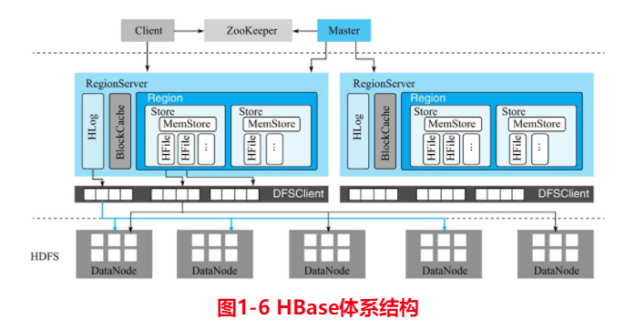

# 大数据系统-鉴赏

鉴赏系列：

回答一下几个问题：

- 使用场景，起源问题

- 核心原理、架构
- 优、缺点，竞品比较

## 1. Hadoop

### 1.1 目标场景

hadoop是作为目前大数据生态的海量数据存储基础设施，hadoop的分布式文件系统HDFS，

1.3 优缺点

1.3.2 缺点

1.3.2.1 计算框架MRv1的缺点

- 扩展性问题，jobTacker同时具有资源管理和作业控制功能，导致成为瓶颈制约扩展性
- 可靠性，mastr/slave ，单点故障。
- 资源利用率低，槽位机制，map，reduce不共享
- 无法支持其他计算框架，内存计算，流计算，迭代计算，只用于磁盘的离线计算。

## 2.Spark

### 2.1 目标场景

### 2.2 基本原理

#### 2.2.1 执行流程

具体运行流程如下：

1. SparkContext 向资源管理器注册并向资源管理器申请运行Executor

2. 资源管理器分配Executor，然后资源管理器启动Executor

3. Executor 发送心跳至资源管理器

4. SparkContext 构建DAG有向无环图

5. 将DAG分解成Stage（TaskSet）

6. 把Stage发送给TaskScheduler

7. Executor 向 SparkContext 申请 Task

8. TaskScheduler 将 Task 发送给 Executor 运行

9. 同时 SparkContext 将应用程序代码发放给 Executor

10. Task 在 Executor 上运行，运行完毕释放所有资源

Spark Application中可以因为不同的Action触发众多的job，一个Application中可以有很多的job，每个job是由一个或者多个Stage构成的，后面的Stage依赖于前面的Stage，也就是说只有前面依赖的Stage计算完毕后，后面的Stage才会运行。

Stage划分的依据就是宽依赖，像reduceByKey，groupByKey等算子，会导致宽依赖的产生。

#### 2.2.2 spark on yarn

application的spark-context在本机。

shuffle write：stage，task结果输出到本地文件系统。

shuffle read：stage读取依赖的stage的数据

本地读，远程读。（bar work）

### REF

- [Spark底层执行原理详细解析](https://mp.weixin.qq.com/s/qotI36Kx3nOINKHdOEf6nQ)

- Spark技术内幕 深入解析spark内核架构设计与实现原理-张安站

## 3.Yarn

### 3.1 场景

MR v1的改进版本，独立的资源管理框架，可以支持不同的计算框架，MR，Spark等。

### 3.2 Yarn原理

#### 3.2.1 基本架构

#### 3.2.2 yarn工作流程

1. 步 骤 1 用 户 向 YARN 中 提 交 应 用 程 序， 其 中 包 括 ApplicationMaster 程 序、 启 动ApplicationMaster 的命令、 用户程序等。
2. 步骤 2 ResourceManager 为 该 应 用程 序 分 配 第 一 个 Container， 并 与 对应 的 NodeManager 通信， 要求它在这个 Container 中启动应用程序的 ApplicationMaster。
3. 步 骤 3 ApplicationMaster 首 先 向 ResourceManager 注 册， 这 样 用 户 可 以 直 接 通 过
   ResourceManage 查看应用程序的运行状态， 然后它将为各个任务申请资源， 并监控它的运
   行状态， 直到运行结束， 即重复步骤 4~7。
4. 步骤 4 ApplicationMaster 采用轮询的方式通过 RPC 协议向 ResourceManager 申请和
   领取资源。
5. 步骤 5 一旦 ApplicationMaster 申请到资源后， 便与对应的 NodeManager 通信， 要求
   它启动任务。
6. 步骤 6 NodeManager 为任务设置好运行环境（包括环境变量、 JAR 包、 二进制程序
   等） 后， 将任务启动命令写到一个脚本中， 并通过运行该脚本启动任务。（与ArgoDBBAR的导入导出脚本，异曲同工）
7. 步骤 7 各个任务通过某个 RPC 协议向 ApplicationMaster 汇报自己的状态和进度， 以
   让 ApplicationMaster 随时掌握各个任务的运行状态， 从而可以在任务失败时重新启动任务。
   在应用程序运行过程中， 用户可随时通过 RPC 向 ApplicationMaster 查询应用程序的当
   前运行状态。
8. 步骤 8 应用程序运行完成后，ApplicationMaster 向 ResourceManager 注销并关闭自己。

#### 3.2.3 容错

app master 容错：RM 心跳检查，重启

container 容错：RM+AM处理

RM容错：HA

### 3.3 优缺点

### 3.3.1 相比MRv1优点

-  资源利用率提升。不同框架计算引擎，可以共用一套物理集群，运维成本降低。
- 数据共享，不同框架共用hdfs资源数据。
- 

### REF

- hadoop技术内幕：深入解析yarn架构设计与实现原理-董西成
- 

## 4.Delta Lake

支持单表ACID的插件库，方便集成到现有hadoop生态

## 5.HBase

### 5.1 场景

hbase是bigtable的开源版本，而bigtable是google为了存储大规模结构化、半结构化数据如（url,文档，图像，日志文件、二进制文件）的数据库系统。

提供随机访问的存储和检索。

行即一致性，水平扩展。

高可用（hdfs提供多副本），高性能（KV存储，列存，方便点查询，写入，数据量增长，时间增不明显），可扩展。

起源: google 互联网的搜索

根据关键词搜索，需要建立索引。索引根据MR计算出来。不停的通过爬虫抓取互联网上的文档，并存储进系统，单个文档能够插入，更新。用户搜索时，根据索引，查到到存储引擎中的文档。

场景：

- 抓取增量数据
  - 监控指标（用户的交互，服务流量等）
  - 遥测数据，存储用户计算机上生成的软件崩溃报告
  - 广告效果，点击流，待批处理分析，生成报表
- 内容服务
  - 存储各个用户生成内容，Twitter的贴子、图片等，并提供给自己和其他用户显示
  - URL短链，生成用户特征
- 信息交换
  - 短信系统
  - （hbase集群上千台，region管理，上下线问题处理。在星环处理20,30台的集群就容易出现各种问题）

### 5.2 基本原理

#### 5.2.1 基本架构

- Hbase client
  - Shell命令行接口、原生Java API编程接口、Thrift/REST API编程接口以及MapReduce编程接口
  - 提供DML/DDL操作，表管理等
- zookeeper
  - 监控master servers，并宕机时选举新master
  - 系统核心元信息，RegionServer地址(hbase:meta)
  - 参与RegionServer宕机恢复：ZooKeeper通过心跳可以感知到RegionServer是否宕机，并在宕机后通知Master进行宕机处理。
  - 实现分布式表锁：HBase中对一张表进行各种管理操作（比如alter操作）需要先加表锁，防止其他用户对同一张表进行管理操作，造成表状态不一致。
- Master
  - 处理client管理请求，建表，修改表，权限，切分表、合并数据分片以及Compaction等
  - 管理RegionServer，RegionServer中Region的负载均衡、RegionServer的宕机恢复以及Region的迁移等
  - 清理过期日志以及文件，Master会每隔一段时间检查HDFS中HLog是否过期、HFile是否已经被删除，并在过期之后将其删除
- RegionServer
  - 响应用户的IO请求
    - WAL(HLog)：持久化，hbase集群主从复制
    - BlockCache：读缓存。
    - Region：数据表的一个分片，负载均衡的基本单位
      - Store：数量对应表中列族的个数，推荐IO特性相同的放在一个列族
        - MemStore:1个，LSMtree的内存实现结构。
        - HFile:1或多个，MemStore写满后（默认128M），异步刷新到磁盘的结构。定期compact合并成大的文件
- HDFS
  - hbase实际存储系统，HFile，HLog都会写入hdfs。

### 5.3 优缺点

优点：

- 存储容量大
  - 单表支持千亿行，百万列，数据容量达TB，PB级别
- 良好的扩展性
  - 数据存储节点Datanode，读写服务节点regionserver扩展容易
  - 当然还是存储单点，nn，master
- 稀疏存储
  - kv存储，允许大量列为null值，不占用空间
- 高性能
  - oltp场景，随机单点查询，小范围扫描性能好。大范围使用MR的接口。
- 多版本
  - 拥有时间戳，可以时间旅行的读取
- 支持过期
  - 自动清理过期数据
- hadoop生态
  - 存储直接使用hadoop，很容易接入其他系统

缺点：

- 聚合性能很差
  - group by，join
- 本身没有二级索引
  - 第三方Phoenix提供的二级索引功能
- 只支持单行事务
  - 第三方Phoenix提供的全局事务模型组件

竞品比较：

HBase与TiKV 对比。

功能。支持的存储。

成本(服务硬件需求)

### REF

- [HBase原理与实践-胡争](https://weread.qq.com/web/reader/632326807192b335632d09ckc81322c012c81e728d9d180) 微信读书网页版，微信刷码即可，**推荐分析原理解析时阅读**
- 《HBase实战》
- 

## 6. Hive

## 7.Presto

Presto是一个分布式的采用**MPP架构**的查询引擎，本身并不存储数据，但是可以接入多种数据源，并且**支持跨数据源的级联查询**。Presto是一个OLAP的工具，擅长对海量数据进行复杂的分析；但是对于OLTP场景，并不是Presto所擅长，所以不要把Presto当做数据库来使用。

Presto是一个低延迟高并发的**内存计算引擎**。需要从其他数据源获取数据来进行运算分析，它可以连接多种数据源，包括Hive、RDBMS（Mysql、Oracle、Tidb等）、Kafka、MongoDB、Redis等。

额外:为了支持多源，也使用classloader方式，支持不同的数据源client，依赖的不同版本的jar包

TODO：比较星环联邦计算方案

spark 批处理架构，sql，谓词等下推（dblink技术，jdbc），数据源（oracle，cdh，TD等）

和Apache HAWQ（MPP和批处理融合）差异？

支持的数据源。

## 8.Impala

Apache Impala是采**用MPP架构**的查询引擎，本身不存储任何数据，**直接使用内存进行计算**，兼顾数据仓库，具有实时，批处理，多并发等优点。

提供了类SQL（类Hsql）语法，在多用户场景下也能拥有较高的响应速度和吞吐量。它是由Java和C++实现的，Java提供的查询交互的接口和实现，C++实现了查询引擎部分。

Impala支持共享Hive Metastore，但没有再使用缓慢的 Hive+MapReduce 批处理，而是**通过使用与商用并行关系数据库中类似的分布式查询引擎**（由 Query Planner、Query Coordinator 和 Query Exec Engine 三部分组成），可以直接从 HDFS 或 HBase 中用 SELECT、JOIN 和统计函数查询数据，从而大大降低了延迟。

Impala经常搭配存储引擎Kudu一起提供服务，这么做最大的优势是查询比较快，并且支持数据的Update和Delete。

## 9.Elasticsearch

## 10.Clickhouse

## 11.Kafka

### 11.1 场景

LinkedIn开发的分布式消息（中间件）系统，后独立成立Confluent公司，现刚上市(2021.6.25)。

kafka最新版本2.8.0。

> 起源：
>
> 开始时是用作活动流（Activity Stream）和运营数据处理管道（Pipeline），现在被广泛用于多种类型的数据管道和消息系统使用。
>
> Linked的问题——《权威指南》1.5.1节

现在定位为分布式事件流平台，用于**高性能数据管道**、**流分析**、**数据集成**和关键任务应用程序。

> 活动数据：
>
> 站点在对其网站使用情况，包括页面访问量（Page View）、被查看内容方面的信息以及搜索情况等
>
> 运营数据：
>
> 服务器的性能数据（CPU、IO 使用率、请求时间、服务日志等等数据)
>
> 传递消息：
>
> 应用程序向用户发送通知，邮件。（原神邮箱）
>
> 应用成组件只负责生成消息，不关心消息个事，何时发送。
>
> 一个公共应用程序，负责格式化消息，多个消息，同一个通知发送，根据用户配置的首选项发送数据。
>
> 日志存储：
>
> 把数据库的更新发布到Kafka上，应用程序的产生的事件流对数据库进行实时的更新。变更日志流，把对数据的更新操作，复制到远程系统，或者合并多个更新，统一更新数据库。kafka为变更日志提供缓存区，在消费者应用故障，重放日志，恢复系统状态。

#### 设计目标

- 高吞吐率。用于处理庞大的消息事件。即使在非常廉价的商用机器上也能做到单机支持每秒 100K 条以上消息的传输。
- 高性能。以时间复杂度为 O(1) 的方式提供消息持久化能力，即使对 TB 级以上数据也能保证常数时间复杂度的访问性能。处理效率不随数据量增加而降低。
- Scale out：支持在线水平扩展。
- 高可用，数据不丢。数据存储。kafka集群的服务器可跨数据中心。运行部分机器故障的存在。
- 消息传输。解耦生产者和消费者，通过持久化，允许支持多个消费者。发布与订阅能力。
- 支持离线数据处理（批量消息处理）和实时数据处理（实时流处理）。

### 11.2 基本架构

Kafka组件由client端的API和部署在服务器上运行的Broker集群构成。与一般的大数据系统不一样，作为消息中间件系统，Client是一个很重要的组件。

Client API:

- Producer API：发布消息到1个或多个topic（主题）中
- Consumer API：来订阅一个或多个topic，并处理产生的消息
-  Streams API ：充当一个流处理器，从1个或多个topic消费输入流，并生产一个输出流到1个或多个输出topic，有效地将输入流转换到输出流。
- Connector API ：可构建或运行可重用的生产者或消费者，将topic连接到现有的应用程序或数据系统。例如，连接到关系数据库的连接器可以捕获表的每个变更。

Client与服务器集群的通信，使用TCP协议。

2.8版本kraft模式（旧版本还有一个Zookeeper组件，管理集群配置，选举leader。新版本已经去除，无需依赖zk，而是自己管理，更加轻量级）（服务集群只有一种broker角色，很有p2p的精神:D）

#### 基础概念

- kafka作为一个集群运行在一个或多个服务器上。

- kafka集群存储的消息是以topic为类别记录的。
  - Topic：Kafka将消息分门别类，每一类的消息称之为一个主题（Topic）

- kafka的消息结构
  - key
  - value
  - timestamp
- Broker代理
  - 消息存储器

##### 事件流

> 从技术上讲，事件流是从数据库、传感器、移动设备、云服务和软件应用程序等事件源以事件流的形式实时捕获数据的做法；
>
> 持久地存储这些事件流以供以后检索；
>
> 实时和回顾性地操作、处理和响应事件流；
>
> 并根据需要将事件流路由到不同的目标技术。

事件流应用

> - 实时处理支付和金融交易，例如在证券交易所、银行和保险中。
> - 实时跟踪和监控汽车、卡车、车队和货物，例如物流和汽车行业。
> - 持续捕获和分析来自物联网设备或其他设备（例如工厂和风电场）的传感器数据。
> - 收集客户互动和订单并立即做出反应，例如在零售、酒店和旅游行业以及移动应用程序中。
> - 监测住院病人并预测病情变化，以确保在紧急情况下得到及时治疗。
> - 连接、存储和提供公司不同部门产生的数据。
> - 作为数据平台、事件驱动架构和微服务的基础。

生产者向kafka写入事件。

消费者订阅（读取和处理）这些事件。生产者和消费者完全解耦，互不可知。

事件被组织并持久地存储在**主题**中。主题类似于文件系统中的文件夹，事件就是该文件夹中的文件。

Kafka 中的主题总是多生产者和多订阅者：一个主题可以有零个、一个或多个向其写入事件的生产者，以及零个、一个或多个订阅这些事件的消费者。

与传统消息传递系统不同，事件在消费后不会被删除。可以配置过期时间。

主题是**分区的**，一个主题分布在位于不同 Kafka  broker的多个“桶”上。分区的好处，在于**允许客户端应用程序同时从/向多个broker读取和写入数据**。具有相同事件key的时间被写入同一个分区。

Kafka[保证](http://kafka.apache.org/documentation/#intro_guarantees)给定主题分区的任何消费者将始终以与写入事件完全相同的顺序读取该分区的事件。

为了数据的容错性和高可用，每个主题都可以**复制**（分区级别），甚至可以跨地理区域或数据中心**复制**，以便始终有多个代理拥有数据副本。

### 11.3 优缺点

优点：

kafka作为消息系统。

天然具有解耦系统，数据的生产和使用；持久化冗余数据、日志，保证数据安全性；

扩展性，不单自己可扩展，借助消息队列，外部队列也可以根据需要调整。

削峰，应对突然的流量，避免关键组件崩溃。

异步通信；缓冲，合并消息处理；

独特优点：

顺序性的保证：分区内，消息有序；容错，允许少量机器宕机。

缺点：

挑战者：

Pulsar

### REF

- [Kafka官网](http://kafka.apache.org/)
- [Kafka 设计解析（一）：Kafka 背景及架构介绍](https://www.infoq.cn/news/kafka-analysis-part-1)
- Kafka权威指南
- Kafka stream实战-(英)
- Kafka 技术内幕-郑奇煌
- Kafka源码解析与实战-王亮
- [Kafka教程-OrcHome](https://www.orchome.com/5) 中文版翻译，持续保持更新

## 12.Flink

## 13.Pulsar

## 14.Kylin

