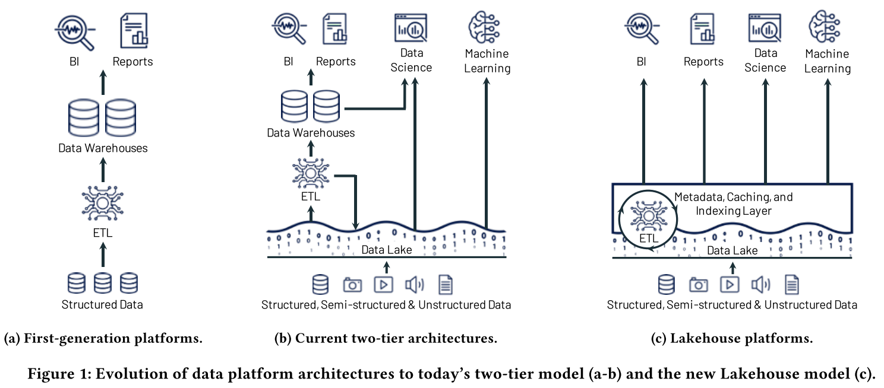
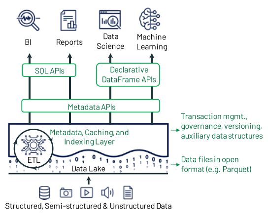
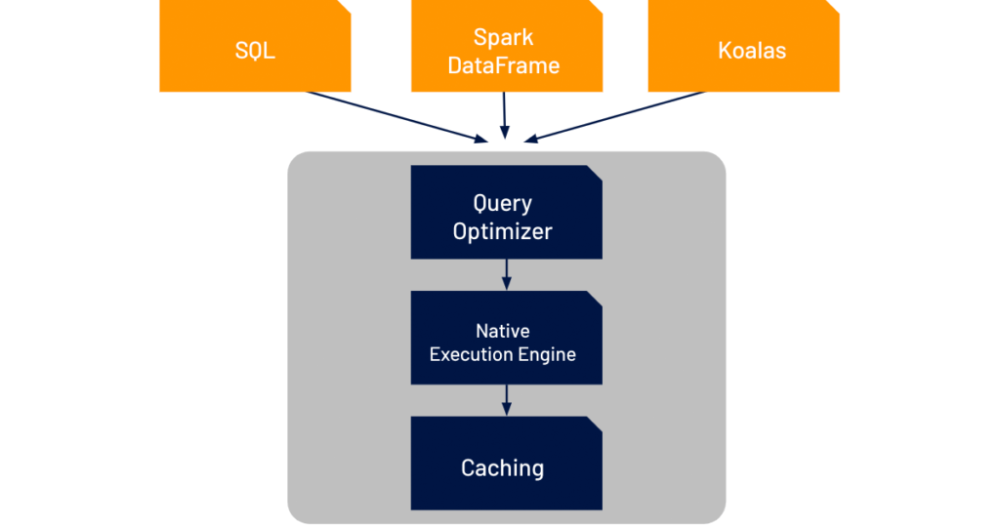

# 论文笔记-Lakehouse

[TOC]

题目：

Lakehouse：A New Generation of Open Platforms that Unify Data Warehousing and Advanced Analytics

CIDR 2021

这篇论文是DataBricks 在Delta Lake架构的后续发展。

主题：

新一代的数据仓库架构Lakehouse：

-  开放的直接访问数据格式，例如 Apache Parquet 和 ORC
- 对机器学习和数据科学工作负载的一流支持
- 最好的性能

**Lakehouse= data lake + data house**

## 1.背景

第一代数据仓:

将数据从运营数据库收集到**集中式仓库**中来帮助业务决策者的分析，用于决策支持和商业智能 (BI)。

“schema-on-write” 数据写入的数据模型，根据BI的查询特点，进行优化设计。

问题：

- 计算和存储耦合，企业为峰值用户负载和管理的数据进行配置和付费，随着数据集的增长，费用昂贵
  - 云服务商，对偶然的峰值收费。
    - 相关：关于关闭linux swap，导致的需要为一些偶尔内存峰值付费。但是不关闭，可能存在如ETCD，出现超时频繁服务注册的问题。不过看阿里云，有突发型服务器方案，突发总量超过一定积分后额外收费，对此收费更加合理了。
- 越来越多的数据集完全是非结构化，视频、音频和文本文档，数据仓库根本无法存储和查询这些数据

第二代数据分析平台（数据湖 + 仓库两层架构）：

将所有原始数据卸载到**数据湖**中：具有文件 API 的低成本存储系统（不只HDFS），以通用且通常开放的文件格式保存数据，例如 Apache Parquet 和 ORC。

- 数据湖是一种读取模式架构，它能够以低成本灵活地存储任何数据，但另一方面，将数据这种质量和治理问题推向了下游。
  - 从2015年开始，S3、ADLS、GCS等云数据湖开始替代HDFS，具有高可用性（>10个9）、异地复制，低成本，自动化等优势（存储）

- 湖中的一小部分数据稍后将通过 ETL 传输到下游数据仓库（例如 Teradata），用于最重要的决策支持和 BI 应用程序。
  - 下游数据仓库： Redshift 或 Snowflake（计算）

- 开放格式的使用，使数据湖数据可以直接访问各种其他分析引擎，例如机器学习系统

缺点：

增加构架复杂度，两次ETL过程，ETL->数据湖->ETL->数据仓库，增加延迟和故障可能性

- 可靠性
  - 数据湖和仓库一致性难以保证，每个ETL步骤，都增加了发生故障或引入降低数据质量的错误的风险
    - 数据湖与数据仓库的一些细微差异，如类型兼容性、SQL方言等等。
- 数据陈旧
  - 与数据湖的数据相比，仓库中的数据陈旧，新数据经常需要数天才能加载
    - 对于这一点，流系统+数据仓库，替代传统ETL，可以改进（如Flink+TiDB等这样的模式）。
- 对高级分析的支持有限
  - ML与仓库的融合
  - 没有一个领先的机器学习系统，如 TensorFlow、PyTorch 和 XGBoost，可以在仓库之上运行良好
    - 与提取少量数据的 BI 查询不同，ML系统需要使用复杂的非SQL代码处理大型数据集
    - 通过 ODBC/JDBC 读取这些数据效率低下，并且无法直接访问内部仓库专有格式
    - 使用开放格式的数据湖数据运行ML系统，又失去数据仓库的丰富管理功能，例如 ACID 事务、数据版本控制和索引。
- 持续的ETL开销，以及双倍存储成本（开发格式、专有格式）

提出的问题：

**是否有可能将基于 Parquet 和 ORC 等标准开放数据格式的数据湖，转变为既能提供数据仓库的性能和管理特性，又能满足来自高级分析工作负载的快速、直接 I/O？**

满足这样的需求的系统，称之为 Lakehouse。

（觉得这样的架构，在支持数据格式上能力上讲，和数据库领域的多模数据库要求相似，新增的内容是对计算引擎的新要求，ML支持）

当前系统：

- 现有的数据仓库（Azure Synapse，BigQuery，Redshift，Snowflake），都增对Parquet、ORC格式的外部表支持，允许用户通过同一个SQL引擎查询数据湖，但是没有使数据湖表更易于管理，也不会消除仓库中数据的 ETL 复杂性、陈旧性和高级分析问题。并且连接器的性能也不佳，由于他们的SQL引擎主要是对内部格式进行优化。

- 针对开放格式的进行优化的SQL引擎（Spark SQL、Presto、Hive 和 AWS Athena），也没有解决所有问题，数据湖仍然缺乏ACID事务等基本管理功能和索引等高效访问方法来匹配数据仓库性能。

## 2. 实现Lakehouse架构

 Lakehouse定义为基于低成本和可直接访问的存储的数据管理系统，它还提供传统的分析DBMS管理和性能特性，例如 ACID 事务、数据版本控制、审计、索引、缓存和查询优化

 Lakehouse特性优势：

- 数据湖上可靠的数据管理
  - 没有多层架构，改善了数据质量和可靠性
  - 提供事务、回滚回滚到旧表版本和零拷贝克隆（Delta Lake，Apache Iceberg）
- 一个系统，无ETL/ELT，保证了数据新鲜度
- 支持对非结构化数据的管理
- 通过开放格式直接访问数据，支持ML和数据科学
  - 适合计算存储分离的云环境，独立ML的GPU集群，按需运行
- 大规模数据上的SQL的性能
  - 基于 Parquet 的 SQL 引擎（Databricks Delta Engine），在 TPC-DS上的表现优于领先的云数据仓库

Lakehouses 结合了数据湖和数据仓库的主要优势：前者的各种系统都可以访问的开放格式的低成本存储，以及后者的强大管理和优化功能。

### 2.1 实现

首先，使用**标准文件格式**（例如 Apache Parquet）将数据存储在低成本对象存储（例如 Amazon S3）中，但在顶部实现一个**事务性元数据层**定义哪些对象是表版本的一部分的对象存储。

如果只是元数据层增加了管理能力，但不足以实现良好的 SQL 性能。

数据仓库使用多种技术来获得最先进的性能，例如将热数据存储在SSD等快速设备上、维护统计数据、构建高效的访问方法（如索引）以及协同优化数据格式和计算引擎。

在基于现有存储格式的Lakehouse中，无法更改格式，但论文表明可以实现其他优化而使数据文件保持不变，包括缓存、辅助数据结构（例如索引和统计信息），和数据布局优化。

基于声明性 DataFrame API，Lakehouses 既可以加速高级分析工作负载，又可以为它们提供更好的数据管理功能。

-  DataFrames 是由 R 和 Pandas推广，它简单地为用户提供了具有各种转换运算符的表抽象，其中大部分映射到关系代数。

### 2.2 元数据层

Delta lake的主要工作，以及其他类似的系统（iceberge），将元信息存储在对象（**结构化、半结构化，非结构化数据**）中。 而hive 的acid则将元信息部分，存储在数据库。

- 提供与原始 Parquet/ORC 数据湖相似或更好的性能，同时增加了非常有用的管理功能，例如事务、零复制克隆（只复制日志）和时间旅行到表的过去版本。并且对于已经有数据湖的组织而言，很容易添加进去。

- 可以实施数据质量强制功能，如模式强制，确保上传到表的数据与其模式相匹配。
- 实现治理功能（例如访问控制和审计日志）
  - 元数据层可以在授予客户端从云对象存储读取表中原始数据的凭据之前，检查是否允许客户端访问表，并且可以可靠地记录所有访问。

缺点：

事务日志存储在它运行的同一个对象存储中。

- 而由于对象存储的高延迟，限制了它可以支持的每秒事务率。
- 一次只支持一张表上的事务

（优化事务日志的格式和管理对象的大小也是TODO）

### 2.3 SQL性能（引擎层）

针对**结构化数据**，传统数据库，放弃数据独立性，使用专有格式。

Lakehouse必须使用开放的数据格式（Parquet 和 ORC），而对这些格式的新设计改进不断出现，当前样的开放格式也并不是绝对的完美数据格式。

Delta Engine，对与格式无关的优化进行了研究，提出了几种技术来在独立于所选数据格式的Lakehouse中实现 SQL 性能优化。并经过TPC-DS测试，已经与云数据仓库相比产生了具有竞争力的性能。（但是，相信也只是一种整体性能上的缓解，专用的优化，肯定还是在一些场景更具有优势）

- 缓存
  - 缓存热数据文件
  - 当使用事务性元数据层（例如 Delta Lake）时，Lakehouse 系统可以安全地将云对象存储中的文件缓存到处理节点上的更快存储设备（例如 SSD 和 RAM）上。运行事务可以轻松确定缓存文件何时仍然有效。
  - 缓存可以采用转码格式，以便查询引擎运行更高效
- 辅助数据Auxiliary data
  - 统计信息（min，max）
  - 索引（布隆过滤器，二级索引）
- 数据布局（减少IO）
  - 记录排序，将更容易一起读到的数据聚集在一起
    - 支持使用单个维度或空间填充曲线（例如 Z-order和 Hilbert 曲线）对记录进行排序，以提供跨多个维度的局部性
    - 各列，采样不同的顺序，不同的压缩策略
- 向量化执行
  - C++编写

TODO需要探索：

- 为下一代工作负载设计高质量的可直接访问的开放格式
- 更低延迟的计算引擎

### 2.4 支持高级分析的高性能访问

高级分析库通常使用命令式代码编写，这些代码不能作为 SQL 运行，但它们需要访问大量数据。

ML框架支持直接读取parquet。

Lakehouse 提供DataFrame API 的声明性版本，将数据准备计算映射到Spark SQL查询计划中，并且可以从 Delta Lake 和 Delta Engine中的优化中受益。

局限：

机器学习ML社区，更多在研究专注于 CPU 上重叠的数据加载与 CPU 到 GPU 的传输和 GPU 计算，并不将查询语义推送到底层存储系统。

而数据库仓库系统，并没有太多关注对现代加速器的充分利用。

TODO的探索方向：

- “分解 ML”框架，将 ML 逻辑推入 SQL 连接，以及可应用于 SQL [36] 中实现的 ML 算法的其他查询优化
- 特征存储抽象，作为数据管理层来存储和更新 ML 应用程序中使用的特征（Lakehouse支持事务、多版本能力具有优势）

## 3.需要研究的问题

### 3.1 其他的实现LakeHouse目标的方式？

- 在数据仓库上构建一个大规模并行服务层，该层可以支持来自高级分析工作负载的并行读取？
  - 论文认为，与让工作负载直接访问对象存储相比，此类基础架构的运行成本更高，更难管理，而且性能可能更低。
  - 将选择一种高效的数据格式进行读取的问题，推给了服务层，而这种格式需要内部转码
  - 云对象存储的主要吸引力在于其低成本、弹性工作负载的高带宽访问以及极高的可用性，在对象存储前面有一个单独的服务层，将会使前面的优势降低。
  - 标准化开放的数据格式，能够免于绑定到特定的供应商

其他如星环TDH的堆叠的方式：

统一的计算引擎（支持向量化执行，或者独立的更加轻量级的引擎），多存储引擎，针对各种查询负载，使用各种专有格式（列存，全文索引，图）

优点：

- 支持多模的数据格式，并且能够协同工作
- 能够提供数仓的管理能力（对自研引擎表，也支持事务）

缺点：

- 两层的元信息（计算引擎，底层存储引擎），但是对hadoop表（orc，parquet）未提供事务管理能力
  - TDH本身支持parquet格式，但是是hive原生能力，无事务管理
  - 也许后面可以统一起来，提供不同client 接口如metastore

- SerDe开销（底层不同引擎的专有格式，转换成计算引擎统一格式（java），全表扫描，SerDe开销占比超过30%）
- ML直接分析未满足（需要数据中间格式转换），但机器学习的数据格式能否all in parquet？
  - lakehouse是否也只是将数据中间格式的转换再往前推？

### 3.2 什么是正确的存储格式和访问 API？

Lakehouse的访问接口包括原始存储格式、直接读取这种格式的客户端库和高级SQL接口。

其他的想法：要求读者执行更复杂的“可编程”解码逻辑，为系统提供更大灵活性的存储。

### 3.3 其他数据管理的研究和趋势

 Polystore旨在解决跨不同存储引擎查询数据的难题。（presto也是）（数据联邦，解决数据孤岛问题）

（计算联邦，计算能力的联合）

## 4.总结

本文提出lakehouse架构，可以作为基于Parquet 和ORC等标准开放数据格式的数据湖，但是既能提供数据仓库的性能和管理特性，又能满足来自高级分析工作负载的快速、直接 I/O。

给出databricks实现lakehouse架构的一种方式：

- 利用delta lake的元信息管理层，管理任意的对象，基于对象提供事务的管理能力
- 利用delta engine引擎，缓存，向量化执行，辅助结构，加速对开放格式的结构化数据（parquet）的SQL查询性能
- 提供DataFrames API接口，满足对ML的分析支持

## REF

- Armbrust, M., Ghodsi, A., Xin, R., & Zaharia, M. (2021). Lakehouse: A New Generation of Open Platforms that Unify Data Warehousing and Advanced Analytics. 11th Annual Conference on Innovative Data Systems Research (CIDR ’21).
- [slides:lakehouse architecture](https://www.slideshare.net/databricks/introduction-sql-analytics-on-lakehouse-architecture) 可以算作对论文的精简slide，不过确实ML相关部分
- [slides:Making Data Timelier and More Reliable with Lakehouse Technology](https://www.slideshare.net/matei/making-data-timelier-and-more-reliable-with-lakehouse-technology)  Matei Zaharia，与上面合起来，论文的补充
- [Delta engine 介绍](https://databricks.com/blog/2020/06/24/introducing-delta-engine.html)
- [slides:Achieving Lakehouse Models with Spark 3.0](https://www.slideshare.net/databricks/achieving-lakehouse-models-with-spark-30)

