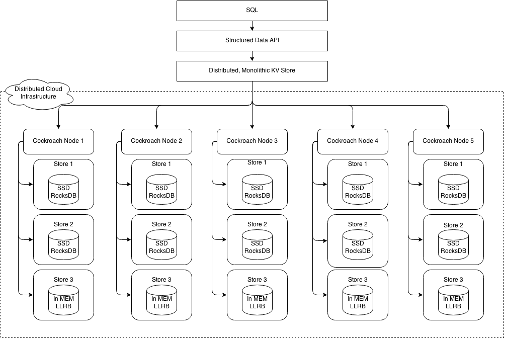

# CockroachDB-笔记

## 1. 概述

CockroachDB 是一个分布式 SQL 数据库。

主要设计目标是**可扩展性**、**强一致性**和**生存能力** （因此得名）。

目标：

- 简单，易运维，自动化，自动容错；开发人员易于理解
- 强一致性
  - （之前粗略看过的一些文章，非常推崇其分布式事务的实现）
  - 快照隔离SI，可序列化快照隔离SSI
    - 外部一致、无锁的读取和写入
- 多点读写
- 任何环境灵活部署，减少外部依赖，同构部署
  - 角色不做太多切分，kafka这样的p2p风格。
- 支持SQL

## 2. 原理

### 2.1 架构

[设计](https://github.com/cockroachdb/cockroach/blob/master/docs/design.md)

分层架构

- SQL层
  - 将客户端 SQL 查询转换为 KV 操作
- 事务层
  - 支持对多个 KV 条目进行原子更改
- 分布式层
  - 将复制的 KV 范围作为单个实体呈现
- 复制层
  - 在许多节点上一致且同步地复制 KV 范围
  - 使用一致性算法实现一致性读取
- 存储层
  - 在磁盘上读写 KV 数据
  - 架构图中的Store，一个物理节点一个或者多个

### 2.2 SQL层

### 2.3 事务层

无锁分布式事务

可串行化

快照隔离 (SI) 

可序列化快照隔离 (SSI) 

### 2.4 分布式层

CockroachDB 将数据存储在键-值对的整体排序映射中。键key，任意字节数组。

这个键空间描述了集群中的所有数据及其位置，并且被划分为我们称为“ range”的区域，即键空间中的连续块，因此每个键总是可以在单个区域中找到。

实现了一个**有序map**来完成:

- **Simple lookups 简单的查找**: 因为我们确定了哪些节点负责数据的某些部分，所以查询能够快速定位到它们需要的数据的位置
- **Efficient scans 高效的扫描**: 通过定义数据的顺序，在扫描过程中很容易找到特定范围内的数据

key类型

- 系统key
  - 用于内部数据结构和元数据
  - 类型
    - Global
      - 存储集群range的数据
      - “meta1”和“meta2”键
      - 节点和存储 ID 分配器
    - Store local
      - 未复制的存储元数据，与存储的声明周期相关的数据
    - Range local
      - 存储与全局键关联的范围元数据
        - 特殊的前缀+全局键+特殊的后缀 `\x01k<global-key>txn-<txnID>`
    - Replicated Range ID local
      - 存储range元数据，存在于range的所有副本上
    - Unreplicated Range ID local
      - 存储副本本地的范围元数据
        - Raft 状态和 Raft 日志
- 表数据key
  - 表数据
  - 索引数据

#### Meta ranges 元范围

[2级空间](https://www.cockroachlabs.com/docs/v21.1/architecture/distribution-layer.html)

这个两级索引加上用户数据可以可视化为一棵树，根位于 meta1，第二级位于 meta2，树的叶子由保存用户数据的范围组成。

### 2.5 复制层

multi-raft 完成副本的复制，管理。

### 2.6 存储层

已经从RocksDB（c++）切换为自己实现的pebbleDB（go）。

定义的engine：

pkg/kv/kvnemesis/engine.go

## 3. 优缺点

## REF

- [github: CockroachDB](https://github.com/cockroachdb/cockroach)
- [CockroachDB doc](https://www.cockroachlabs.com/docs/)
- [CockroachDB  overview](https://www.cockroachlabs.com/docs/stable/architecture/overview.html)

扩展材料：

- [CockroachDB特性](https://zhuanlan.zhihu.com/p/190197543) 

- [CockroachDB的SQL工作原理](https://zhuanlan.zhihu.com/p/150562326) 
- [CockroachDB之本地以及分布式查询处理](https://zhuanlan.zhihu.com/p/139191683) 
- [Cockroach的MVCC实现机制](https://zhuanlan.zhihu.com/p/85996983) 
- [CockRoachDB 的事务实现与优化](https://zhuanlan.zhihu.com/p/394547522) 
- [CockroachDB 源码闲逛 - III (Schema Change)](https://zhuanlan.zhihu.com/p/336683597) 
- [CockroachDB DistSQL 小记 - III (Vectorized Flow)](https://zhuanlan.zhihu.com/p/149736332) 
- [CockroachDB Transaction 小记 - IV(新并发控制)](https://zhuanlan.zhihu.com/p/139551710) 
- [CockroachDB DistSQL 小记 - II (分发 & 执行)](https://zhuanlan.zhihu.com/p/111552614) 
- [CockroachDB DistSQL 小记 - I (基本流程 & 物理计划)](https://zhuanlan.zhihu.com/p/103541226) 
- [CockroachDB Transaction 小记 - IV (重试)](https://zhuanlan.zhihu.com/p/102368271) 
- [CockroachDB 源码闲逛 - II (insert a row)](https://zhuanlan.zhihu.com/p/73448057) 
- [CockroachDB Transaction 小记 - III(时间戳并发控制)](https://zhuanlan.zhihu.com/p/98626684) 
- [CockroachDB Transaction 小记 - II (优化流程)](https://zhuanlan.zhihu.com/p/89915479) 
- [CockroachDB Transaction 小记 - I (简单流程)](https://zhuanlan.zhihu.com/p/85001198) 
- [CockroachDB 源码闲逛 - I (meta ranges)](https://zhuanlan.zhihu.com/p/75452389) 
- [CockroachDB 文档学习 (SQL & Txn & Dist)](https://zhuanlan.zhihu.com/p/72467962) 
