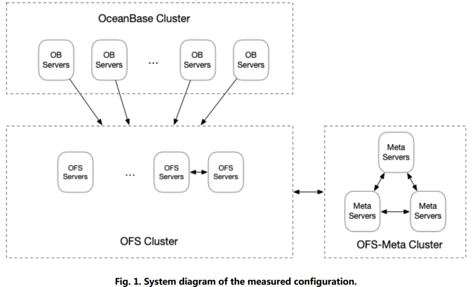
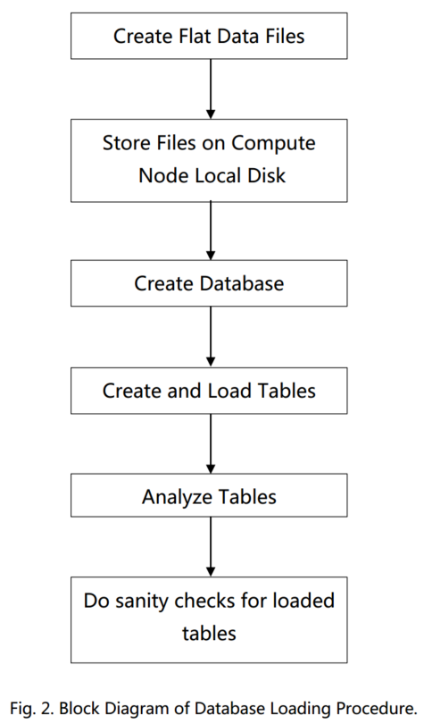

# OceanBase 2021.05 TPC-H性能测试报告分析

## 1. 测试配置

测试集：TPC-H  30TB  3.0v

数据版本：OceanBase V3.2

操作系统：alibaba cloud linux server 2.19

集群节点：64

节点:

vcpu:  80         总：5120

内存：768GB  总：49,152GB （大于数据集的大小，理论上可以完全cache）

存储：40 GB  总：2,560 GB   （SSD）

OFS(OceanBase File System) Storage Service ：38000 GB （HDD）

总存储：40,560GB

网络：32 Gbits/s

3年造价：7000万

## 2. 测试结果

### 2.1 load性能

原始数据平面文件是使用 DBGen 创建并存储在 Cloud OceanBase 的 Compute Instance 的本地磁盘上。

数据加载时间：02:47:41， 10061s

Start of Database Load Time 2021-05-16 11:45:24 

End of Database Load Time 2021-05-16 14:33:05

加载速度：2.98GB/s

（是因为测试数据在单个节点上吗？，网络速度32GB/s，单点的磁盘速度限制了load速度？）

### 2.2 SQL性能

30TB   10个查询流，每个查询执行都会顺序执行22条SQL测试时间，平均值是10个查询流在对于sql的平均查询时间：

| **Query ID** | 平均响应时间（单位：秒） | min   | max    |
| ------------ | ------------------------ | ----- | ------ |
| 1            | 69.80                    | 10.22 | 151.41 |
| 2            | 24.96                    | 1.95  | 43.71  |
| 3            | 53.04                    | 5.63  | 120.54 |
| 4            | 35.09                    | 4.43  | 101.73 |
| 5            | 58.44                    | 13.15 | 98.98  |
| 6            | 28.75                    | 1.26  | 66.32  |
| 7            | 67.11                    | 14.36 | 105.03 |
| 8            | 67.57                    | 12.32 | 131.26 |
| 9            | 104.35                   | 36.68 | 137.02 |
| 10           | 51.34                    | 9.98  | 83.52  |
| 11           | 51.90                    | 9.64  | 87.30  |
| 12           | 45.89                    | 5.91  | 107.05 |
| 13           | 63.83                    | 13.36 | 134.84 |
| 14           | 57.93                    | 5.79  | 177.03 |
| 15           | 37.10                    | 4.69  | 83.82  |
| 16           | 44.65                    | 5.58  | 121.28 |
| 17           | 61.33                    | 7.25  | 107.08 |
| 18           | 69.74                    | 8.72  | 181.21 |
| 19           | 58.08                    | 5.63  | 130.48 |
| 20           | 73.20                    | 11.69 | 133.91 |
| 21           | 87.34                    | 16.05 | 188.51 |
| 22           | 45.65                    | 6.89  | 65.84  |

算术平均值：61.89s

观察到测试时间波动挺大的，是每次sql的参数不一样吗？还是说资源任务调度的原因？

查看详细的测试结果文件，发现每个查询流的sql执行顺序是乱的，并不是都是用query1到query22。

然后在run1result.zip\RUN\run1\substitution_parameters.txt 文件中 验证确实每个查询流的参数不一样。

开源版本 100GB测试结果：

| **Query ID** | OBServer V3.1.0 查询响应时间（单位：秒） |
| ------------ | ---------------------------------------- |
| 1            | 13.28                                    |
| 2            | 0.60                                     |
| 3            | 14.35                                    |
| 4            | 2.44                                     |
| 5            | 13.77                                    |
| 6            | 6.23                                     |
| 7            | 15.99                                    |
| 8            | 9.32                                     |
| 9            | 33.50                                    |
| 10           | 6.94                                     |
| 11           | 1.39                                     |
| 12           | 8.71                                     |
| 13           | 6.04                                     |
| 14           | 1.64                                     |
| 15           | 2.54                                     |
| 16           | 2.54                                     |
| 17           | 7.49                                     |
| 18           | 6.90                                     |
| 19           | 8.22                                     |
| 20           | 8.97                                     |
| 21           | 14.46                                    |
| 22           | 3.58                                     |

### 2.3 吞吐

15,265,305 QphH@30000GB （每小时综合查询数的指标）

未理解这个是怎么计算出来的？

 QphH(Query-per-Hour H)

H表示这个结果是按照TPC-H标准测得

$/QphH 即Price/Q

测试报告文档，10个吞吐流， speed （这个结果是什么？）基本在 516 143 306 ， 总用是在00:22:17 左右。

Measurement Interval in Throughput Test (Ts) 1,507.81  总用时？

但是15,265,305/3600=4,240.36 对不上。

DELL 刷新了 OB的记录 22,664,825 QphH@30000GB

18台服务器（2 * 32 cpu,1024GB RAM,2 * 480 GB SSD SATA, 2 * 3200GB NVMe? ）

装载时间：02h 48m 59s

和OB一致，都是3GB/s

11 个吞吐流，speed在 513 142 729， 每个流查询总时间在19:27 左右。

Measurement Interval in Throughput Test (Ts) 1,225.51 seconds

1,225.51 * 22,664,825  = 27,775,969,685.75

1,507.81 * 15,265,305 = 23,017,179,532.05

## REF

- [TPC-H 性能测试排行](http://tpc.org/tpch/results/tpch_perf_results5.asp?resulttype=all)
- [OceanBase 数据库 TPC-H 测试](https://open.oceanbase.com/docs/community/oceanbase-database/V3.1.0/tpch-test-for-oceanbase)
- [OceanBase TPC-H 100G 性能测试报告](https://open.oceanbase.com/docs/community/oceanbase-database/V3.1.0/wtu4kv)
- [OceanBase开源版与TiDB对比测试报告](https://mp.weixin.qq.com/s/1_4z1qU0EfM4Bimk5ddh2Q) 文中有误，OB官网是100G测试，文章使用10G做对比测试
- [你的数据库，能撑起多少并发，有数吗？](https://zhuanlan.zhihu.com/p/265188868)
- [开源如何先不说但我有两个疑问：小议“OceanBase登顶TPC-H”](https://zhuanlan.zhihu.com/p/377843752)

