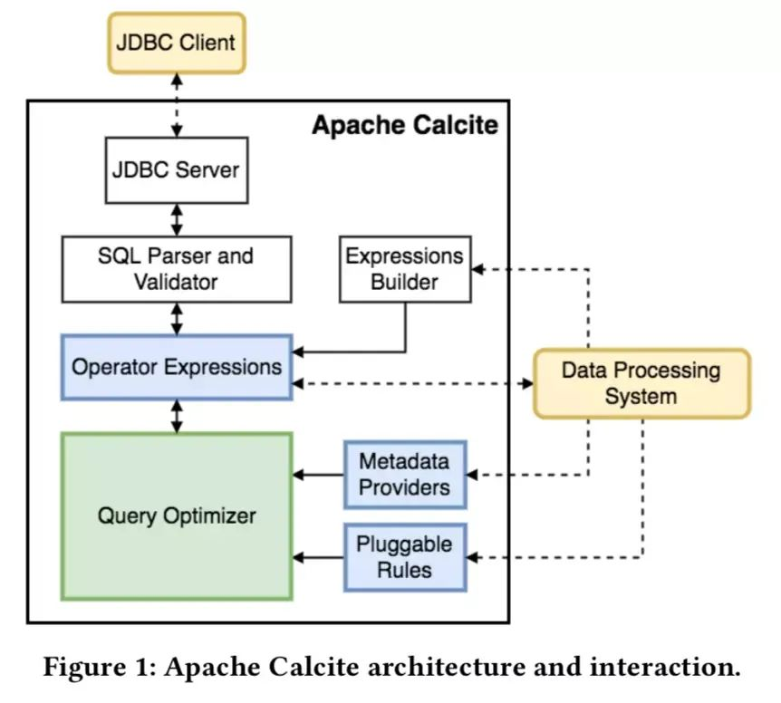

# Apache Calcite笔记

[TOC]

## 1. 简介

A Foundational Framework for Optimized Query Processing Over Heterogeneous Data Sources

一个用于优化异构数据源的查询处理的基础框架。

诞生时间2014.09。

- 标准SQL解析（还可以优化后反响生成，返回给原系统执行）
- 查询优化
- 数据源连接

工作流程：SQL->AST->优化(Rule+Cost)->plan（物理计划转特定应用的执行计划）

面向问题：

异构数据源（RDMS,ES,MongoDB）的底层数据存储格式，处理量级，是否支持谓词下推，谓词下推过滤效率，访问代价差异巨大。（非统一的代价模型；完整的计划生成后，才能计算代价）

（spark，行数估计连接次序代价，启发式规则，选择执行的算法）

对数据源的访问通过adapter 实现。

组件：

- **Catalog** - Defines metadata and namespaces that can be accessed in SQL queries
- **SQL parser** - Parses valid SQL queries into an abstract syntax tree (AST)
- **SQL validator** - Validates abstract syntax trees against metadata provided by the catalog
- **Query optimizer** - Converts AST into logical plans, optimizes logical plans, and converts
  logical expressions into physical plans
- **SQL generator** - Converts physical plans to SQL  

## 2. 数据组织对比

HAWQ：统一的数据源视图，提供原生数据的api访问，自己提供MPP执行框架。

Calcite：独立的插件，可以集成到各个执行框架中如Flink，Spark，Kylin等中，提供SQL优化和数据访问的Adapter。可以允许下推计算（投影，谓词过滤，sort等等）。

## 3. 设计与实现

TODO：

代码实现，设计

## REF

- Begoli, E., Rodríguez, J. C., Hyde, J., Mior, M. J., & Lemire, D. (2018). Apache Calcite: A Foundational Framework for Optimized Query Processing Over Heterogeneous Data Sources.
- [Apache Calcite 论文学习笔记](https://cloud.tencent.com/developer/article/1468664?from=article.detail.1589009)
- [calcite 理论](https://www.cnblogs.com/WCFGROUP/p/9595733.html) linkList
- [apache calcite tutorial](https://calcite.apache.org/docs/tutorial.html)  官方文档
- [NTRODUCTION TO  APACHE CALCITE  - JORDAN HALTERMAN]([https://www.slideshare.net/JordanHalterman/introduction-to-apache-calcite](https://archive.fosdem.org/2017/schedule/event/hpc_bigdata_calcite/attachments/slides/1823/export/events/attachments/hpc_bigdata_calcite/slides/1823/FOSDEM2017ChristianTzolov_v3.pdf)) calcite实现中的名词，概念，代码解析
- [SQL for NoSQL and how Apache Calcite can help - FOSDEM2017](https://speakerdeck.com/implydatainc/nosql-no-more-sql-on-druid-with-apache-calcite-strata-sj-2018?slide=39) calcite实现的设计图
- 

  
