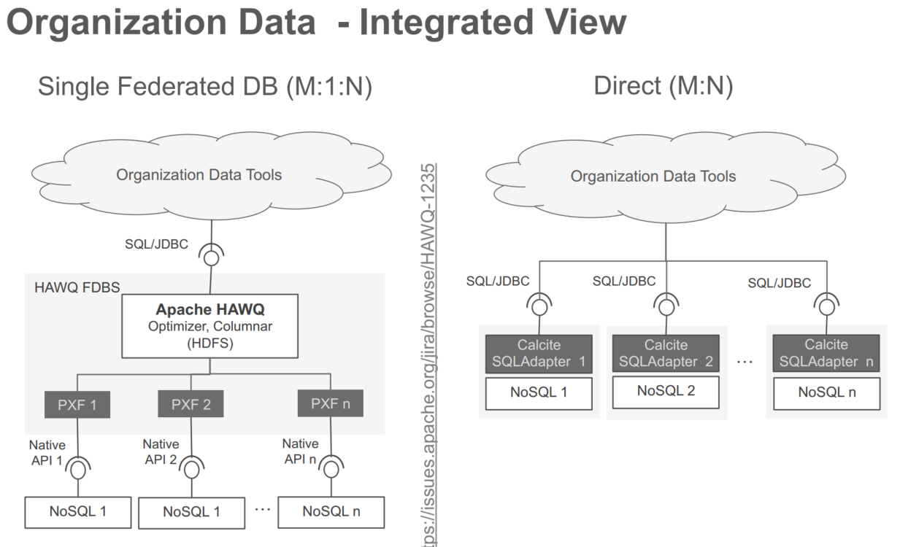

# Apache Calcite笔记

[TOC]

## 1. 简介

A Foundational Framework for Optimized Query Processing Over Heterogeneous Data Sources

一个用于优化异构数据源的查询处理的基础框架。

诞生时间2014.09。

- 标准SQL解析（还可以优化后反响生成，返回给原系统执行）
- 查询优化
  - 扩展：
    - 自定义算子
    - 可插拔的代价
- 数据源连接

工作流程：SQL->AST（SqlNode）->优化(Rule+Cost)->plan（物理计划转特定应用的执行计划）。

可执行的计划实现方式：

- 代码生成code generate，完成对具体执行器的调用（数据源适配器访问数据，上层执行算子的逻辑calcite提供）
- 转换成sql，处理引擎自己再翻译执行
- 处理引擎，接受逻辑计划，执行

面向问题：

异构数据源（RDMS,ES,MongoDB）的底层数据存储格式，处理量级，是否支持谓词下推，谓词下推过滤效率，访问代价差异巨大。（非统一的代价模型；完整的计划生成后，才能计算代价）

（spark，行数估计连接次序代价，启发式规则，选择执行的算法）

对数据源的访问通过adapter 实现。

组件：

- **Catalog** - Defines metadata and namespaces that can be accessed in SQL queries
- **SQL parser** - Parses valid SQL queries into an abstract syntax tree (AST)
- **SQL validator** - Validates abstract syntax trees against metadata provided by the catalog
  - sqlNode -> relNode
- **Query optimizer** - Converts AST into logical plans, optimizes logical plans, and converts
  logical expressions into physical plans
- **SQL generator** - Converts physical plans to SQL

## 2. 数据组织对比

HAWQ（ORCA）：统一的数据源视图，提供原生数据的api访问，自己提供MPP执行框架。

Calcite：独立的插件，可以集成到各个执行框架中如Flink，Spark，Kylin等中，提供SQL优化和数据访问的Adapter。可以允许下推计算（投影，谓词过滤，sort等等）。 但是整个计划是单一类似的数据源系统。

各自的优缺点：

- HAWQ，统一的入口接口层，支持业务使用更简单，基于原生接口的访问，只是将存储系统当做一个存储，忽略了存储自身的能力和特点，无法最大化利用存储的特性，可能还存在serde的开销。
- Calcite，为现有系统（NoSQL），优化执行计划，改进现有系统的查询性能，但是至少case by case的为每个系统提供优化，无法集合各个系统一起工作，同时也无法优化跨系统的查询计划。

## 3. 设计与实现

TODO：

代码实现，设计

谓词下推：

- limit
- project
- filter
- join
  - 共址连接
- aggregate
  - 局部聚合，上层合并， avg= sum/count
- sort

典型的volcano 模型，可以自定义规则集，物理算子的实现，calcite自行探索可能的计划，并不过程式，逐条应用规则。（时间开销比，手动设置优化决策顺序要高）

官方的一种实现（执行方式）：[Avactica](https://calcite.apache.org/avatica/docs/)

## REF

- Begoli, E., Rodríguez, J. C., Hyde, J., Mior, M. J., & Lemire, D. (2018). Apache Calcite: A Foundational Framework for Optimized Query Processing Over Heterogeneous Data Sources.
- [Apache Calcite 论文学习笔记](https://cloud.tencent.com/developer/article/1468664?from=article.detail.1589009)
- [github: Calcite](https://github.com/apache/calcite)
- [calcite 理论](https://www.cnblogs.com/WCFGROUP/p/9595733.html) linkList
- [apache calcite tutorial](https://calcite.apache.org/docs/tutorial.html)  官方文档
- [NTRODUCTION TO  APACHE CALCITE  - JORDAN HALTERMAN]([https://www.slideshare.net/JordanHalterman/introduction-to-apache-calcite](https://archive.fosdem.org/2017/schedule/event/hpc_bigdata_calcite/attachments/slides/1823/export/events/attachments/hpc_bigdata_calcite/slides/1823/FOSDEM2017ChristianTzolov_v3.pdf)) calcite实现中的名词，概念，代码解析
- [SQL for NoSQL and how Apache Calcite can help - FOSDEM2017](https://speakerdeck.com/implydatainc/nosql-no-more-sql-on-druid-with-apache-calcite-strata-sj-2018?slide=39) calcite实现的设计图
- Calcite 处理一条SQL 推荐
  - [Calcite 处理一条SQL - IV (Implement & Execute)](https://zhuanlan.zhihu.com/p/61516449) 
  - [Calcite 处理一条SQL - III (Find Best Rel)](https://zhuanlan.zhihu.com/p/60223655) 
  - [Calcite 处理一条SQL - II (Rels Into Planner)](https://zhuanlan.zhihu.com/p/58801070) 
  - [Calcite 处理一条SQL - I (SQL to Rel)](https://zhuanlan.zhihu.com/p/58139279) 

