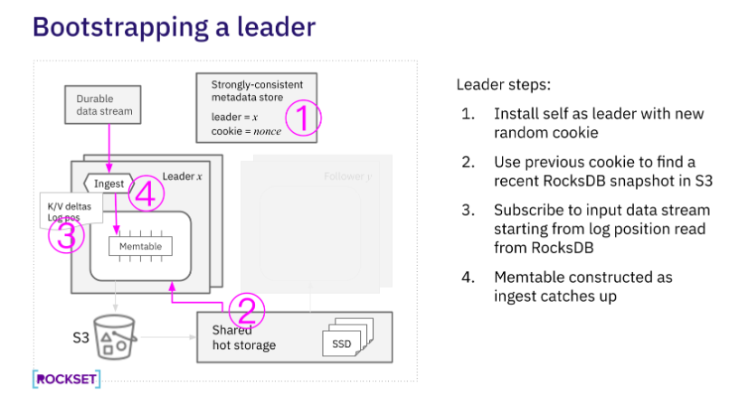

# Rocksdb

## 概念

#### WAL
Write Ahead Log 预写日志, 保存当前 rocksdb 的 memtable 中的文件信息，当 immutable memtable 中的数据刷到 L0 之后即之前的会被删除 — 即于 DB/WAL 目录下的 000xx.log.

#### MANIFEST
Rocksdb 状态变化的事务日志文件. MANIFEST 文件用于在重启的时候, 恢复实例到上一次关闭前的最后一个一致的状态. 其内容主要是 SST 文件的各个版本信息 (当 sst 文件被改动, 即会生成对应的 versionEdit, 并触发 sync 写 manifest 文件）, 用于异常断电后恢复 — 即 DB 目录下 MANIFEST-00000x 的文件.

#### CURRENT
记录当前最新的 manifest 文件编号.

#### Memtable
常驻于内存中, 用于在写完 WAL 之后, 再接收具体的 key-value 数据. 

#### SST文件
key-value 的存储文件. DB 目录下的 0000xx.sst 形态.


## RocksDB-Cloud


- 持久化：当有新的 SST 生成时，RocksDB-Cloud 会把它上传到 S3，以确保持久性。
- 热存储层: 发现和存储新建的 SST 文件，并淘汰旧的 SST 文件
    - 热存储层可根据使用情况弹性扩展，并将SST文件提供给执行数据摄取、查询处理或数据压缩的虚拟存储器
    - 与Amazon S3等冷存储相比，热存储层的访问速度约为100- 200倍，允许Rockset提供低延迟，高吞吐量的查询处理
- 元信息：在 MANIFEST 文件中存储元数据信息，以跟踪代表当前数据库版本的数据文件，存储在本地和S3，不存储在热存储层中，只是用于恢复，不用查询。
- 查询：在执行查询时，RocksDB-Cloud 会从热存储层请求数据块，每个数据块在文件中以偏移量和大小表示。
- 缓存: 计算节点中缓存最近访问过的数据块，以便快速检索


计算与计算分离


- Rockset 中的数据写入、转换和索引代码路径与查询解析、优化和执行完全独立
- Rockset 会将 RocksDB leader 中的 memtable 复制到查询数据的 follower 实例的 memtable 中。
    - follower 实例都能在个位数毫秒内获得新数据
    - 只在 leader 上进行一次索引和压缩等计算密集型的写入工作，从而避免了 follower 的冗余计算


#### Rockset的leader-follower架构 
实现一致性和持续性


- 摄入数据input流是**一致且持久的**。它实际上是一个持久的逻辑重做日志，使Rockset能够在发生故障时返回日志以检索新生成的数据。
- Rockset使用外部强一致性元数据存储来执行领导者选举, 每次选出领导者时，它都会选择一个cookie
- Cookie确保即使旧的leader仍在运行，其S3写入也不会干扰新的leader，并且其操作将被followers忽略
- 持久逻辑重做日志的输入日志位置, 存储在RocksDB键中，以确保输入流只处理一次。

- 复制日志是RocksDB写前日志的超集，用诸如leader election之类的附加事件来扩充WAL条目。
    - 复制日志中的键/值更改直接插入到follower的memtable中。
    - 不需要写WAL到磁盘上
    - 当日志指示leader已经将memtable写入磁盘（S3）时，follower可以开始阅读leader创建的文件-leader已经在共享存储上创建了文件。
    - 类似地，当跟随器得到压缩已经完成的通知时，它可以直接开始使用新的压缩结果，而不进行任何压缩工作。
- 共享热存储完成RocksDB SST文件字节的实时物理复制，包括压缩导致的物理文件更改，而leader/follower复制日志仅携带逻辑更改。



- 使用之前的cookie 找到S3上最近的一个快照
- 订阅输入流，起始位置从rocksDB数据中读取
- 从摄取的数据分钟构造memtable


- 追随者使用领导者的cookie在共享热存储中查找最新的RocksDB快照，并订阅领导者的复制日志。
- follower使用leader的复制日志中最近生成的数据构造一个memtable。


## SourceCode

idea clion 配置，可以参考[pika](https://github.com/OpenAtomFoundation/pika/blob/unstable/docs/ops/SetUpDevEnvironment.md)

可能缺少相关依赖（libgflags-dev），需要参考INSTALL.md文件自行安装

```
rocksdb-cloud：

db/db_impl/db_impl_write.cc

DBImpl::WriteImpl()

immutable_db_options_.replication_log_listener->OnReplicationLogRecord()

// leader
ReplicationLogListener


// ReplicationLogListener provides a mechanism to implement physical replication
// in RocksDB. A leader registers the ReplicationLogListener through which it
// captures the replication events, which are then applied on the follower
// using DB::ApplyReplicationLogRecord().
// What is replicated in this method?
// * Manifest writes, which means the LSM trees of the leader and follower are
// identical.
// * Memtable writes.
// * Memtable switches.
//
// S3 files are not replicated. Follower needs to be able to locate the leader's
// SST files, which is usually done by overriding its Env.
//
// The support for physical replication is experimental and currently does not
// support any of the following options:
// * unordered_write
// * enable_pipelined_write
// * two_write_queues
// * write-ahead logging, i.e. WriteOptions::disableWAL needs to be set to true.
// Replication log provides write durability.
//
// In addition, atomic_flush needs to be true and any manual Flush() call will
// flush all the existing column families.
//
// Follower DB should not be written to and compaction and flushes should be
// disabled. The only changes to its internal state should happen through
// ApplyReplicationLogRecord().

// follower 应用日志
db/db_impl/db_impl.cc
DBImpl::ApplyReplicationLogRecord()


```


## REF

- [tikv rocksdb-overview](https://docs.pingcap.com/zh/tidb/stable/rocksdb-overview)
- [RocksDB-Overview](https://github.com/facebook/rocksdb/wiki/RocksDB-Overview) lsm-tree, 官方技术说明，推荐
    - [Read only and Secondary instances](https://github.com/facebook/rocksdb/wiki/Read-only-and-Secondary-instances)
- [Introducing Compute-Compute Separation for Real-Time Analytics](https://rockset.com/blog/introducing-compute-compute-separation/)
    - 实时数据库系统：Elasticsearch、Clickhouse、Apache Druid和Apache Pinot
    - 计算竞争的应对策略
        - 过度配置计算：以同时处理峰值摄取和峰值查询突发
        - 数据复制：一个主数据库执行所有的摄取，一个副本服务于所有的应用程序查询
            - 当 > 10个TiB的数据时（大规模数据），这种方法开始变得非常不可行。复制数据不仅会增加存储成本，还会增加计算成本，因为数据摄取成本也会增加一倍
            - 主服务器和副本服务器之间的数据滞后将引入应用程序必须处理的讨厌的数据一致性问题
    - 存算分离实现
        - 分离计算和存储
            - 将SST文件备份到云存储
            - 由NVMe SSD存储支持的自动扩展热存储层
        - 分离数据摄取和查询处理代码路径: 将Rockset的SQL引擎设计为与所有执行数据摄取的模块完全分离
            - 写入处理任务
                - 数据解析：从数据源或网络下载数据、支付网络RPC开销、数据解压缩、解析和解组等等
                - 数据转换：数据验证、丰富、格式化、类型转换和汇总形式的实时聚合
                - 数据索引：数据被编码在数据库的核心数据结构中，用于存储和索引数据以进行快速检索。
                - 压缩（或清理）：LSM引擎压缩器在后台运行，以删除过时的数据版本。
            - RocksDB支持多版本并发控制，快照，并有大量的工作使各种子组件多线程，完全消除锁并减少锁争用。
        - 复制内存中状态 （ TryCatchUpWithPrimary ？）
            - 低数据延迟：从RocksDB memtables 在摄取的虚拟磁盘中更新到相同的更改复制到远程虚拟磁盘的额外数据延迟可以保持在个位数毫秒。
            - 强大的复制机制：RocksDB是一个可靠、一致的存储引擎，可以发出一个“可记忆的复制流”，即使流由于任何原因断开或中断，也可以确保正确性。
            - 低冗余计算费用：与原始数据摄取所需的计算总量相比，复制内存中状态只需要很少的额外计算。
            - 相对“双写”， 避免了流式数据摄取、转换和索引和开销
        - WAL 的容错？是否会写到S3？        

- [Tech Overview of Compute-Compute Separation- A New Cloud Architecture for Real-Time Analytics](https://rockset.com/blog/tech-overview-compute-compute-separation/)

- [How Rockset Separates Compute and Storage Using RocksDB](https://rockset.com/blog/separate-compute-storage-rocksdb/)

    - Rendezvous hashing  哈希算法，在热存储层中分发RocksDB数据
    - 基于持久性二级缓存（PSC persistent secondary cache）来扩展计算节点上可用的缓存空间，缓存层
    - 计算节点包含内存块缓存和PSC
    - 保持性能
        - 提高缓存层命中率
            - 每次创建新SST文件时，计算节点都会向热存储层发送同步预取请求
            - 当存储节点发现新切片时，由于计算节点发送针对属于该切片的文件的预取或读取块请求，它主动扫描S3以下载该切片的其余文件。一个切片的所有文件在S3中共享相同的前缀。
            - 存储节点定期扫描S3以保持它们拥有的切片同步。将下载本地丢失的任何文件，并删除本地可用的过时文件。
        - 查询执行被设计为使用预取和并行来限制通过网络的请求的性能损失
            - 计算节点可以并行地从本地PSC（可能使SSD带宽饱和）和从热存储层（使网络带宽饱和）获取块
        - 保证可靠性而冗余副本
            - 在热存储层的不同存储节点上存储多达两个文件副本
                - 主所有者使用由计算节点发出的预取RPC并通过扫描S3
                - 第二所有者仅在计算节点读取文件后才下载文件
            - 热存储层中分配固定数量的磁盘空间作为二级副本文件的LRU缓存
            - 除了计算节点上的内存块缓存和PSC之外，存储约30-40%数据的辅助副本足以避免转到S3检索数据，即使在存储节点崩溃的情况下也是如此
    - 缓存层设计优点
        - 通过其热存储层实现与紧耦合系统相似的性能
        - 可以在共享的实时数据上运行多个应用程序，新的虚拟实例可以立即启动或关闭，以满足不断变化的摄取和查询需求

- [How We Use RocksDB at Rockset](https://rockset.com/blog/how-we-use-rocksdb-at-rockset/)       

- [Remote Compactions in RocksDB-Cloud](https://rockset.com/blog/remote-compactions-in-rocksdb-cloud/)

- [Rocksdb Secondary Instances 使用调研](https://juejin.cn/post/7299668106132619316)
    - Secondary 实例可以共享 Primary 实例的 SST 文件
    -  Secondary 通过不断的 TryCatchUpWithPrimary 还能获得 Primary WAL 中的数据用来填充自己的 memtable  v7.1.1 
        - （memtable 一致性？， compact影响，sst 文件生成，发生更新时丢弃？使用序列号？） 

- [Rockset 产品白皮书解读](https://liujiacai.net/blog/2024/03/03/rockset-intro/)

    

- [从 SIGMOD 23 看 RocksDB 的存算分离实践](https://blog.csdn.net/weixin_43778179/article/details/134281246)


