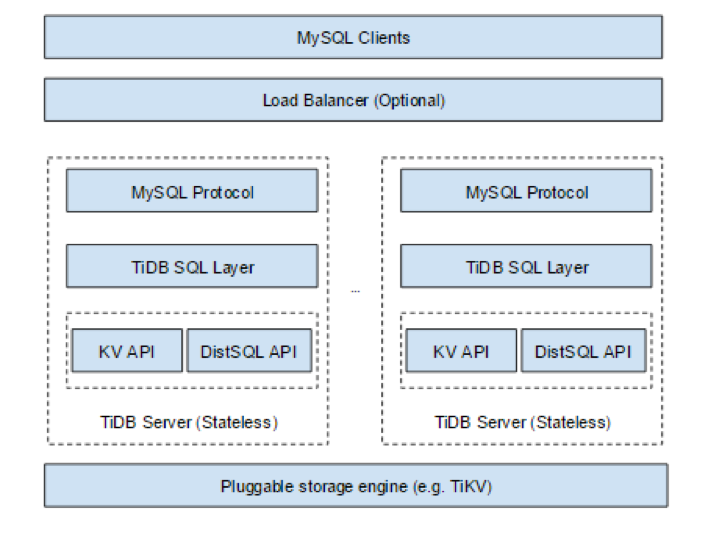

# TiDB原理笔记

[TOC]

## 1.分布式执行计划

###　1.1 背景

> 我们做 TiDB 的 SQL 层时，一开始做的很简单，就是通过最简单的 KV 接口(Get/Set/Seek)去存数据、取数据，做一些非常直白、简单的计算。然而后来我们发现，这个方案在性能上不可接受，可能行不通，我们就重新思考了这个事情。

通过最简单的 KV 接口(Get/Set/Seek)去存数据、取数据，性能无法接受。

- 这里应该指，单节点的TiDB进行 通过kv接口处理数据，无法计算能力扩展，所以性能无法接受。

 OLTP类型的query：通过一些索引（以及filter推导），就能过滤到大部分数据，在单点的TiDB计算引擎可以满足大部分需求。

OLAP类型的query：大量的数据及复杂的 query（Join，SubQuery 以及 Aggregate ），单点计算能力不足。

大数据规模下， OLTP的query的需求也向OLAP靠拢。

**需要对计算进行优化和提速。**

思路：

- MMP（大规模并行执行）， share nothing，数据划分，叶子节点初步处理，汇总节点处理中间数据
  - 汇总节点存在压力
  - 数据重分布问题，数据倾斜问题
  - 网络带宽的需求
    - MR一样，只是与SMP对比
- SMP ，share everything，共享内存、IO，多核。
  - 不需要搬数据，扩展性取决于核数
  - 并行,多核间数据交换开销
- MR 批处理
  - 搬数据，但是初步处理阶段任务，尽量本地化的分发，减少网络开销
  - shuffle划分的stage，中间数据持久化，带来落盘开销

### 1.2 TiDB的早期优化

- KV API

  - 支持范围scan，点查询

- DistSQL 与TiKV的coprocessor

  - 下推算子到TiKV,并行的计算，提供给上层聚集算子，计算最后的结果

  

TiDB对计算的优化：

- 提高并发度，利用Goroutine调度开销小，提高对多核机器的利用
- 吸收hbase的coprocessor协处理器，提出并行的、分布式的计算框架

框架分层：

- Executor 制定计划，完成SQL语义逻辑，如count，filter等
- DistSQL 中间层，Executor的承受者，屏蔽存储类型
  - Select API接口，接受client，请求，并发读，顺序要求作为参数
    - 并发度，对regions同时访问的个数
    - 顺序，是否保持请求（先请求的region可能不是先返回）
      - 场景，order by列有索引，需要按序返回
    - SelectResult 迭代器
      - PartialResult每次next的结果，无序要求是，下一个next来自的region可以不同
    - 请求
      - 可以携带filter，count、sum等请求
        - TiKV的coprocessor进行具体的处理
      - 聚合，需要在TiDB做最终的聚合
- TiClient存储客户端
  - TiKV Client 访问tikv，获取数据分布，进行数据路由，数据请求，通过RPC发送请求
- Regions存储单元
  - TiKV上，或者其他存储单元的抽象

提高并发度例子

**Hash Join**

大小表连接，对小表建hash表。

优化，并行的读取大小表（传统需要先完成小表的构建）

- 单线程读取小表，并构建hash表
- 同时启动另一个线程读取大表（数据的读取和join分开）
-  Hash 表只有完全建好之后，一堆join worker进行join

**Pipeline** 

串行，通过索引读取数据，需要2次RPC

- 第一次读所有的RowID
- 用RowID，访问真正的数据

index data和 row data数据分散在很多region，网络开销较大。

改进：

在无顺序要求时，拿到部分rowID时，构造job，起Goroutine读row data。通过piepline减少读index造成的启动代价。

总结：多map，单reduce框架。

单reduce的节点，通过Goroutine提高并发度进行处理。

### 1.3 TiFlash 与 MPP

>  在TiDB 5.0 通过TiFlash 节点，引入了MPP架构，使得大型表连接类查询可以由不同 TiFlash 节点共同分担完成。（支持数据shuffle）
>
> MPP 模式下，表连接将通过对 JOIN Key 进行数据计算时重分布（Exchange 操作）的方式把计算压力分摊到各个 TiFlash 执行节点(引入ClickHouse 高效实现的协处理器层)

TiFlash 是是 TiKV 的列存扩展，列存副本通过 **Raft Learner 协议异步复制**，但是在读取的时候通过 **Raft 校对索引**配合 **MVCC** 的方式获得 **Snapshot Isolation 的一致性隔离级别**。

- Region 
  - TiFlash依然以region为单位，因为数据是从TiDB region学习
  - 不阻塞 TiKV 写入（异步复制），跟随 TiKV 中的 Leader 副本同时进行分裂与合并

- 计算引擎
  - 支持TiDB、TiSpark
- 保证一致性的读取，计算和存储的资源隔离，所以AP查询负载不影响TP负载
  - 每次收到读取请求，TiFlash 中的 Region 副本会向 Leader 副本发起进度校对（一个非常轻的 RPC 请求），只有当进度确保至少所包含读取请求时间戳所覆盖的数据之后才响应读取。
- 组件
  - 存储引擎组件
    - 列式存储
    - 协处理器ClickHouse？
      - 支持下推的算子，TableScan，Selection（filter过滤），HashAgg，StreamAgg，TopN，limit，project，hash join（mpp）
        - 包含的表达式支持下推
      - 一个算子能下推到 TiFlash 的前提条件，孩子节点都能下推到TiFlash。
  -  Tiflash proxy
    - 处理 Multi-Raft 协议通信
  - pd buddy
    - 与 PD 协同工作，将 TiKV 数据按表同步到 TiFlash

写入性能：

TiFlash 暂时无法直接接受数据写入，任何数据必须先写入 TiKV 再同步到 TiFlash。

所以，大规模数据写入需要先写TiKV，若是完全AP负载场景，写入性能应该不是优势。

（一些ETL处理场景，处理原始数据，在大规模写回）

数据聚合算法：

- Hash Aggregation 算法在执行聚合时使用 Hash 表存储中间结果
  - 需要内存
- Stream Aggregation 算法
  - 预先对数据排序
  - 适合对索引列的group by

MPP 模式目前支持的物理算法：

Broadcast Hash Join、Shuffled Hash Join、 Shuffled Hash Aggregation、Union All、 TopN 和 Limit。

一行算子，支持数据shuffle的关键孩子算子：

- ExchangeSender 读取数据并将数据根据分区算法广播到各个节点
- ExchangeReceiver 读取shuffle后，属于该节点的数据

（由于无源码，未知是否存在落盘）

Broadcast Hash Join的选择：

- 表的字节大小低于阈值
- 子查询结果集的行数低于阈值

总结：

TiDB的MPP，在存储上通过学习行存的TiKV，创建列存副本。

在计算上，一方面沿用之前协处理器思想，用clickhouse适配列存格式的计算。

另一方面，通过ExchangeSender 和ExchangeReceiver  支持数据的shuffle，横向扩展需要处理一些大数据量的算子的计算节点的数量。

## REF

- [MPP and SMP in TiDB](https://pingcap.com/blog-cn/mpp-smp-tidb) 2016年11月，早期并行计划框架（多map，单reduce）
- [TiDB 中文文档](https://docs.pingcap.com/zh/tidb/stable/overview)
- [TiFlash](https://docs.pingcap.com/zh/tidb/stable/tiflash-overview)

