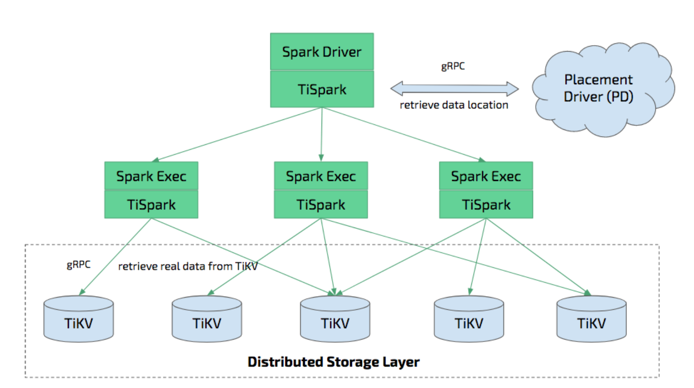

# TiSpark笔记

## 1. 背景

正如在TiDB原理提到，TiSpark为了提升OLAP能力，而引入，同时将TiDB也接入了Spark生态。

TiSpark实际上继承Spark的DataSource接口，来支持Spark读取TiKV的数据。实际是一个driver。


## 2. 架构



- Spark集群
  - 通过TiSpark **事务**的读/写取TiKV数据
- TiKV集群
  - 存储集群
- PD集群
  - TiSpark 获取region信息
- TiDB集群（可选）
  - 为了保证多写（tidb写）一致性，需要加表锁，应该是必选


源码版本2021.05.31：

6eb662cf12744741478ce8a97eb8b00af003beac


源码结构：

- core
  - datasource接口实现相关，完成写功能
  - Spark Strategy 和 Spark Optimizer接口hook sparkSQL的优化器和物理执行计划生成，完成数据的读的优化
    - 可以转换为索引访问的，谓词
    - 计算下推（filter），计算key range
      - 聚合下推，avg 改写为 sum/count
    - 基于代价的 join reorder
    - Data location，数据本地化
      - 与PD沟通获取
- tikv-client
  - 是一个完整的 TiKV 的独立的 Java 实现的接口，负责解析对 TiKV 进行读取和数据解析，谓词处理等等
    - 不需要管spark接口的变更，不用担心spark升级产生兼容性问题
  - 与TIDB、TIKV集群通信的客户端（基于gRPC）
  - 与PD通信，请求region
  - 与TiKV通信，读写数据，结果数据的SerDe
  - 计算下推到coprocessor
- tipb （构建后自动生成）
  - protobuf 定义生成的文件


## 3.实现

### 3.1 执行环境

执行环境TiContext 是对SparkSession的包装，持有关键的TiSession和TiSessionCatalog

- TiSession
  - 维持与TiKV、PD通信的会话信息。缓存Catalog，region元信息。
- TiSessionCatalog
  - TiCompositeSessionCatalog ddl操作，spark SessionCatalog 接口实现


### 3.2 元信息

TiSessionCatalog

TiCatalog 继承spark TableCatalog，具体DDL实现。

`TiDBDataSource`

- 实现了`DataSourceRegister`,`RelationProvider`,`SchemaRelationProvider`,`CreatableRelationProvider`接口
  - 提供别名
  - 根据参数，创建`TiDBRelation`
  - 根据用户定义的Schema创建`TiDBRelation`
  - 根据DF，保存数据并创建`TiDBRelation`

`TiDBRelation`

- 继承`BaseRelation`，实现`InsertableRelation`接口
  - 支持将DF写入TiDB(实际TiKV)
    - `TiDBWriter.write()`


### 3.3 读


### 3.4 写

TiDBWriter

- 表是否存在的检查，通过jdbc 接口查询TiDB集群
- `TiBatchWrite.write` 将DataFrame批量追加到TiDB
  - 使用jdbc接口，加表锁，释放表锁，更新统计信息
    - 锁表，为了避免tispark事务冲突，产生大量回滚
  - `preCalculate`  
    - `sparkRow2TiKVRow`将spark row转为tikv的row
      - 具体类型转换实现在tikv-client的`DataType`实现类中将java对象转换为TiDB的使用的java对象类型（MySQL）
    - 生成rowID
  - 待写数据RDD切分region
    - 预先切分region，避免热点写，和region分裂
  - **挑选primarykey， percolator模型2pc提交**

### 

Spark的DataFrame是针对单表概念，只能完成单表的事务ACID。

对于多表的事务写，Tispark给出的方案是，将多表融合成一个DataFrame进行写。

提供额外的接口:

```scala
def write(
    dataToWrite: Map[DBTable, DataFrame], // 待写入的多表
    sparkSession: SparkSession,
    parameters: Map[String, String]): Unit 
```

整个最终的DataFrame，并不是以传统的单表column关系组织，而是KV的集合。最后通过`TiBatchWrite.write` 写入时，没一行实际都是一个KV，并不特定的写某张表，所以，能够保证对多表的写入，也可以使用2阶段提交的方式，对多表进行写入。


## REF

- [Giithub:TiSpark](https://github.com/pingcap/tispark)
- [演讲实录|马晓宇：When TiDB Meets Spark](https://zhuanlan.zhihu.com/p/29052313)
- [基于 TiSpark 的海量数据批量处理技术](https://zhuanlan.zhihu.com/p/264173698)

