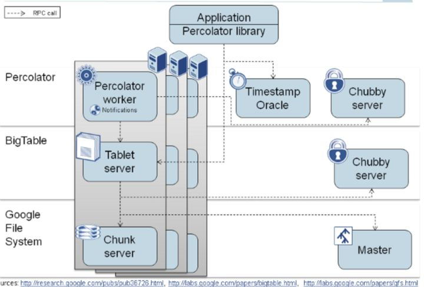
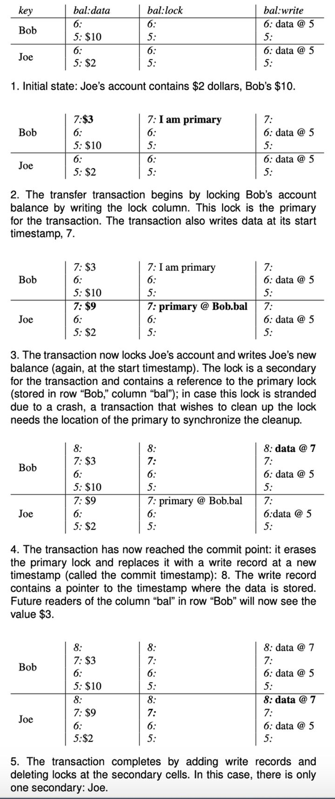

# 事务

[TOC]

分布式一致性问题相关解决技术

- 2pc，3pc，解决分布式事务一致性
- raft，paxos，解决多副本数据一致性

## 分布式事务

### 1. 2PC&3PC

#### 1.1 两阶段提交协议2PC

保障分布式环境下，跨节点事务的ACID性。

节点：

- 协调者：一个
- 参与者：多个

执行过程：

- 准备（投票）阶段： 协调者询问参与者事务是否执行成功；  
- 提交阶段： 如果事务在每个参与者上都执行成功， 协调者发送通知让参与者提交事务； 否则， 协调者发送通知让参与者回滚事务。  

问题：

网络通信阻塞、单点故障，部分提交。**（归纳问题出现原因，1.节点挂掉，不同功能节点挂掉影响。2.网络通信问题，脑裂影响）**

- 参与者故障，准备，提交阶段的协调者，一直等待。（网络通信阻塞）
  - 解决方法：设置事务超时时间，参与者不响应，认为事务执行失败，abort
- 协调者故障，发生在提交阶段，参与者一直阻塞，等待协调者的commit/abort
  - 引入备协调者？，操作日志同步
  - 重新选举协调者，参与者，超时，用类似raft任期？
- 数据不一致。提交阶段，调者向参与者发送commit，然后发生局部网络异常，导致只有一部分参与者接受到commit。
  - **互询机制**，向其他参与者，获取事务是否可以提交

#### 1.2 三阶段提交3PC

在2PC基础上，引入一个 **预提交** 阶段，以及**超时策略**来减少整个集群的阻塞时间，提升系统性能。“非阻塞”协议。

> 预提交阶段：解决原先在两阶段提交中，参与者在投票之后，由于协调者发生崩溃或错误，而导致参与者处于无法知晓是否提交或者中止的“不确定状态”所产生的可能相当长的延时的问题。

执行过程：

- 第一阶段，准备（询问）阶段CanComint，询问各个参与者是否能够正常执行事务（未执行），参与者回复。
  - 不执行事务，减少资源锁定
- 第二阶段，预提交PreCommit，根据第一阶段回复结果，协调者发送pre_commit/abort给参与者，是cam_commit参与者执行事务，但不提交。参与者发ack。
  - 统一状态，知道所有参与者都在pre_commit阶段了，而2PC不知道其他节点是否在准备阶段
- 第三阶段，提交阶段doCommit，所有参与者都完成正常执行事务后，协调者发送提交通知，参与者提交事务。否则回滚事务。

解决的问题：

- 单点故障。协调者在第三阶段无响应时，收到pre_commit的参与者超时，自动提交。

仍然存在的问题：

- 数据不一致。部分节点在pre_commit阶段失败，协调者需要回滚，但是网络问题，导致超时提交的节点，提交而未回滚。

2PC到3PC的启示：

所有计算机软件问题，都可以通过再引入一个中间层，来解决问题。

类似，降维思想。

#### TCC（Try-Confirm-Cancel）

#### REF

- [分布式事务：两阶段提交与三阶段提交](https://segmentfault.com/a/1190000012534071) 更加详细的2阶段实现过程
- [三阶段提交-wiki](https://zh.wikipedia.org/wiki/%E4%B8%89%E9%98%B6%E6%AE%B5%E6%8F%90%E4%BA%A4)
- [分布式一致性之两阶段提交协议、三阶提交协议](https://zhuanlan.zhihu.com/p/35616810)
- [分布式事务，这一篇就够了-小米信息部技术团队-李文华](https://xiaomi-info.github.io/2020/01/02/distributed-transaction/)

### 2. Google Percolator事务

目的：针对bigTable（Hbase），使其支持并行随机读写，支持跨行事务（bigtable只支持单行事务，增加分布式事务能力）。

#### 架构实现

Bigtable依靠Chubby（等同于ZooKeeper）提供分布式协调服务。图中的每一个大矩形表示一台服务器，其上运行的服务包括Tablet Server（等同于HBase RegionServer）、Chunk Server（等同于HDFS DataNode），以及新加入的Percolator Worker。另外，还引入了Timestamp Oracle（简称TSO）作为全局授时服务。

#### 组件

- Client：事务的发起者和协调者，
- TSO：分布式服务器提供一个精确的，严格单调递增的时间戳服务。
- [BigTable](https://static.googleusercontent.com/media/research.google.com/zh-CN/archive/bigtable-osdi06.pdf)是Google实现的一个多维持久化Map，格式如下：

- key：row+column+timestamp
- value：列值（扩展了2列，因为是列存，不影响旧版本）
  - data列： 存储 value
    - {key,start_ts}->{value}
  - lock列： 存储用于分布式事务的锁信息（也可以叫做precommit列）
    - {key,start_ts}->{primary_key,locak_type,...}
  - write列：存储用于分布式事务的提交时间（commit_timestamp）（也可以叫commit列）
    - {key,commit_ts}->{start_ts}，读请求可根据key + start_ts在DATA COLUMN中找到数据value
    - 只有该列正确写入后，事务的修改才会真正被其他事务可见

#### 分布式事务流程（改进版2PC）

一个事务的所有 Write 在提交之前都会先缓存在 Client，然后在提交阶段一次性写入；

- 预写（Pre-write）
- 提交（Commit）

Client写`Write{Row row, Column col, string value}`；

bigtable操作：GET，SET，COMMIT

**Prewrite**

1. 在事务开启时会从 TSO 获取一个 timestamp 作为 start_ts。

2. 选择一个 Write 作为 primary，其它 Write 则是 secondary；primary 作为事务提交的 sync point 来保证故障恢复的安全性（详情见 Failover 章节）。

3. 先 Prewrite primary，成功后再 Prewrite secondaries；先 Prewrite primary 是 failover 的要求（详情见 Failover 章节）。 对于每一个 Write:

    3.1. **Write-write conflict 检查**： 以 Write.row 作为 key，检查 Write.col 对应的**write列**在 [start_ts, max) 之间是否存在相同 key 的数据 。如果存在，则说明存在 write-write conflict ，直接 Abort 整个事务。
    3.2. **检查lock列**中该 Write 是否被上锁，如果锁存在，Percolator 不会等待锁被删除，而是选择直接Abort 整个事务。这种简单粗暴的冲突处理方案避免了死锁发生的可能。
    3.3. 步骤 3.1，3.2 成功后，以 start_ts 作为 Bigtable 的 timestamp，将**数据写入 data 列**。由于此时 write 列尚未写入，因此数据对其它事务**不可见**。（因为需要通过write列查找data列）
   3.4. 对**Write上锁**：以 start_ts 作为 timestamp，以 {primary.row, primary.col} 作为 value，**写入 lock列** 。{Priamry.row, Primary.col} 用于 failover 时定位到 primary Write。

对于一个 Write，3 中多个步骤都是在同一个 Bigtable 单行事务中进行，保证原子性，避免两个事务对同一行进行并发操作时的 race；任意 Write Prewrite 失败都会导致整个事务 Abort；Prewrite 阶段写入 data 列的数据对其它事务并不可见。

**Commit**

如果 Prewrite 成功（所有的write列都已经上锁，即写完lock列），则进入 Commit 阶段：

1. 从 TimeOracle 获取一个 timestamp 作为 commit_ts。

2. 先 Commit primary , 如果失败则 Abort 事务：

    2.1. 检测 lock 列 primary 对应的锁是否存在，如果锁已经被其它事务清理（触发 failover 可能导致该情况），则失败。
   ​ 2.2. 步骤 2.1 成功后以 commit_ts 作为 timestamp，以 start_ts 作为 value 写 write 列。（读操作会先读 write 列获取 start_ts，然后再以 start_ts 去读取 data 列中的 value。​）
   ​ 2.3. 删除 lock列中对应的锁。

3. 步骤 2 成功意味着事务已提交成功，此时 Client 可以返回用户提交成功，再异步的进行 Commit secondary 。Commit secondary 无需检测 lock 列锁是否还存在，一定不会失败，只需要执行 2.2 和 2.3。

简易写事务流程：

- 冲突检测（write列，lock列）-先写数据（不可见，多行，data列）-加锁(lock列)-(多行)-<!--2PC分割-->-

- 检查锁(primary行，lock列)-提交事务/写事务开始时间kv(commit_ts->start_ts )到**write列**(primary行)-删除锁(primary行，lock列)

改进点:

- **数据不一致**: 提交阶段主只需要一个参与者（primary）提交，即提交事务，提交是原子的，不会有不一致。
- **单点故障**：事务管理器记录操作日志，重新选举新的事务管理器后通过日志，继续工作。后台线程，可以扫描事务状态，回滚参与者事务。

**转账示例：**（建议，参考silde中的转账，过程更清晰）

冒号前是时间戳，后面是存储的值。

#### 快照隔离级别

- commit_ts大于所有已存在的 commit-ts 和start_ts，单调性
- First-committer-wins。存在写写冲突的事务，只有第一个事务能够提交成功，其他abort。
  - 预提交阶段的上锁和全局有序时间戳，进行冲突检测，保证
- Snapshot-read。事务的读操作都满足 Snapshot-read：即对于一个事务T1而言，所有 commit_ts <= T1.start_ts的事务的修改都对T1可见，所有commit_ts > start_ts的事务的修改都对T1不可见。

##### 快照读

- 从TSO获取当前start_ts，然后检查lock列，判断早于当前start_ts的区间内是否有锁。
- 无锁，则从write列根据commit_ts获取到最新提交的start_ts，再根据获取到的start_ts从data列中获取数据
- 有锁，表示存在未提交的事务，等待事务提交/abort
  - 不会无限等待，超时后，认为存在崩溃的事务，导致锁残留，清除锁
    - 读的行是primary 锁，回滚之前的事务，清理锁
    - 读到secondary锁，查找对应primary行的锁，存储在恢复，否则前滚，提交前事务（清理锁的同时更新对应的write列）

需要注意的是分布式事务并不是按照commit_ts的顺序提交的，存在T1.commit_ts < T2.commit_ts，但是T1提交完成在T2之前的可能(从TSO获取commit_ts在前，但是真正完成提交是在之后)。

Percolator是快照读保证：

- 事务包含的所有Write 均Prewrite成功，必定发生在获取commit_ts 之前
- 全局 TSO 的单调递增

证明：

- 快照读机制可以保证如果T1是提交，那么T1.commit_ts < T2.start_ts
  - 事务结束，或者等待提交或abort。
    - TODO：关于延迟的情况？会很严重吗
- T1.commit_ts < T2.start_ts，即可以保证，T1的全部修改已经完成，并且已经提交，可以安全读取
- 反之，如果T1未提交，那么T2不应该读取到T1的修改。T1.commit_ts > T2.start_ts，只有通过T1.commit_ts 才能查看T1的修改，也可以保证这一点。

#### 故障恢复Failover

关键位置：事务的commit point——“写primary的write列、清理lock列”

事务提交状态的检查——Chubby上的节点是否存在+lock是否超时

一致性：primary + secondary锁，只与primary lock有关，无数据不一致性问题

读事务，处理节点崩溃，超时的锁，决定是commit还是abort。

事务角度优缺点：

优点：

- 事务扩展性好，锁分散到具体行

缺点：

- 持有锁时间变长，先写primary，再写其他，冲突概率增加
- 持久化次数多（加锁，写data列，写lock列）

#### MR VS percolator

google用percolator取代MR更新索引

好处：

- 新鲜：索引延迟从天变成分钟
- 可扩展性
  - 吞吐，只需要用更多的CPU
  - 存储，增加磁盘
  - MR方式全量更新，随着数据量增多。。。（原神，只能查询最近3月的抽卡记录，抽卡记录延迟1小时，结合招聘信息说明，所以原神抽卡数据实际存储在hbase？没有支持percolator）
- 利用率：不受慢task影响

缺点：

- 需要考虑并发
- 每个文档的处理更加昂贵（2X,2阶段提交）

#### REF

- Percolator Paper: 

  http://www.usenix.org/events/osdi10/tech/full_papers/Peng.pdf

  Percolator Slides: 

  https://docs.google.com/present/view?id=dg2vfspf_17gx825cdd 作者从现实谷歌indexing system的更新需求谈设计，有动态转账例子

- [Percolator - 分布式事务的理解与分析](https://zhuanlan.zhihu.com/p/261115166)

- [大佬漫谈Google Percolator分布式事务](https://zhuanlan.zhihu.com/p/333967331)

- [Database · 原理介绍 · Google Percolator 分布式事务实现原理解读](http://mysql.taobao.org/monthly/2018/11/02/)

- 小米开源的hbase percolator实现[themis](https://github.com/XiaoMi/themis/)

- [Percolator分布式事务解决方案](https://longfangsong.github.io/2020/05/23/Percolator%E5%88%86%E5%B8%83%E5%BC%8F%E4%BA%8B%E5%8A%A1%E8%A7%A3%E5%86%B3%E6%96%B9%E6%A1%88/)  快照隔离，write-skew问题

- [Google Percolator事务](https://zhuanlan.zhihu.com/p/53197633)

- 郁白-[两阶段提交的工程实践](https://zhuanlan.zhihu.com/p/22594180) 对percolator优化 

