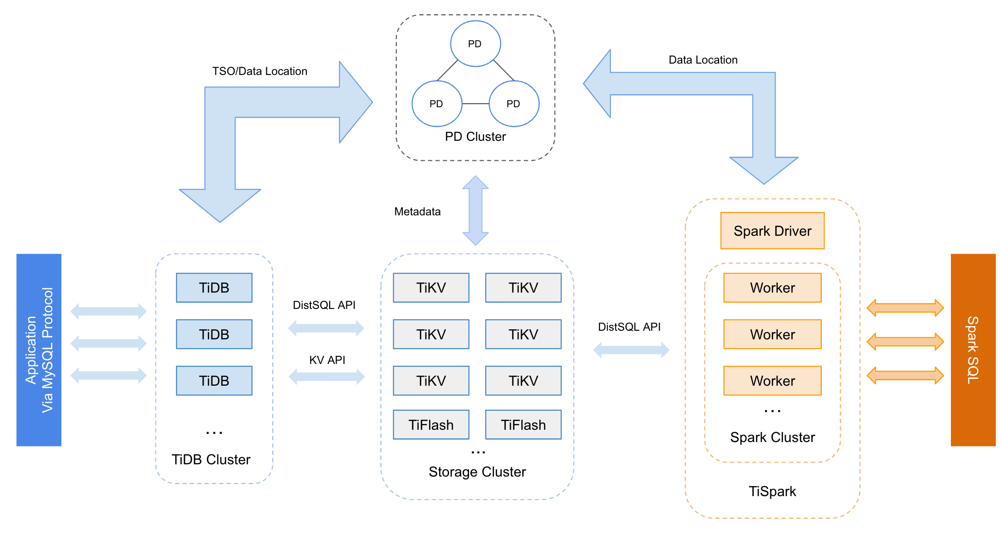
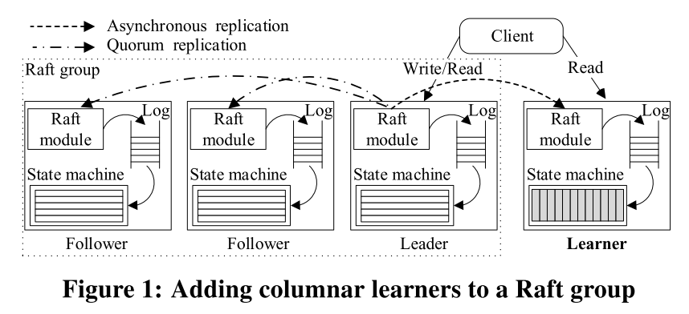
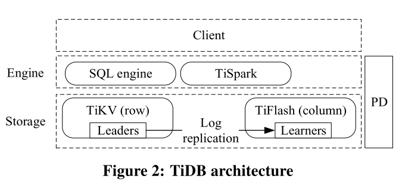
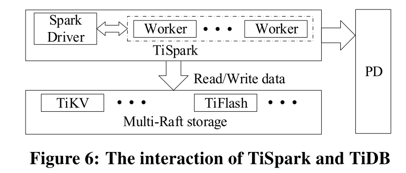
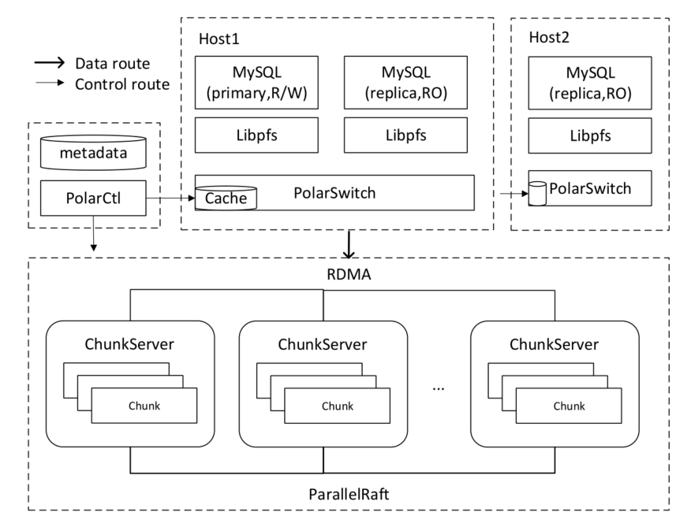
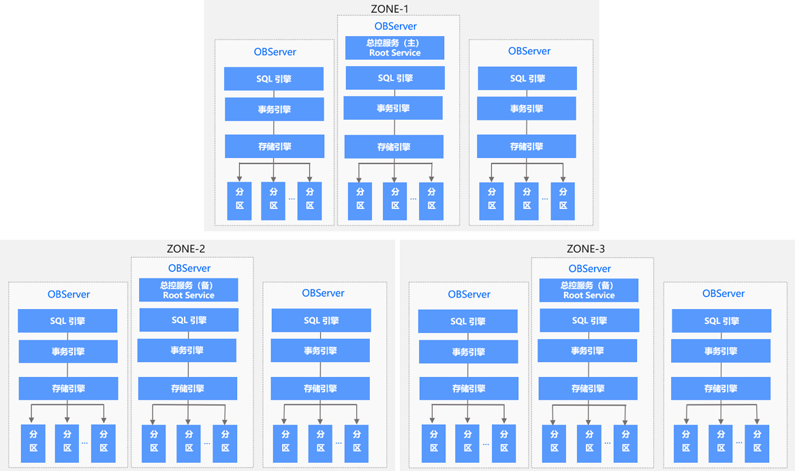
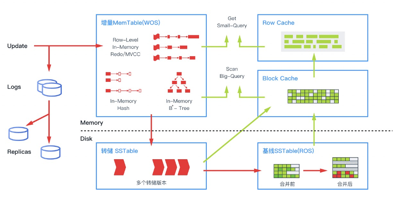

# 分布式数据库系统-鉴赏

## 1.TiDB

### 1.1 架构

TiDB是PingCAP设计的开源分布式HTAP(Hybrid Transactional and Analytical Processing)数据库，支持传统RDBMS的特性，同时吸收NoSQL系统的优点，采用KV系统作为存储节点，获得高性能和可扩展性，其架构如图所示。

TiDB实际上由三个组件构成完整的分布式数据库系统，其中PD(Placement Driver) Server是整个集群的管理组件，主要负责提供全局递增事务时间戳、TiKV的主键范围位置等元信息的存储和TiKV存储数据的调度与负载均衡，TiDB Server是数据库的计算节点，负责SQL的解析、优化、执行等工作，本身无状态，通过负载均衡组件对外提供统一的接入地址。TiKV是系统的存储节点，本身是支持事务的KV数据库，通过mutil-Raft协议实现集群节点间多副本数据的一致性，使用percolator事务模型通过把事务信息保存在key上替代传统2PC的事务管理器，提高了分布式事务的线性扩展能力。类似的系统还包括CockroachDB，同样也是以KV组件作为存储引擎。

TiDB以region为单位将数据分布在TiKV集群的raft组内，一个region包含了一定主键范围内的数据，PD维护了各个Region的TiKV地址信息，当TiKV上发生region分裂后，将会发送请求更新PD的上的region位置信息。TiKV底层存储引擎是RocksDB，使用LSM树替换B+树的避免磁盘随机写入问题。

对于TiDB的查询执行而言，TiDB Server本身无数据，数据需要从TiKV上获取，与TiKV的通信模块是TiDB Server内部的TiClient，它基于gRPC提供KV API和DistSQL API两套接口用于访问存储节点TiKV。其中KV API用于发起已知主键的GET查询请求，而DistSQL用于发起对单表的SCAN请求，一条查询中可能包含多个DistSQL请求，一个DistSQL可能涉及TiKV集群的多个region，每个region又对应一个coprocessor请求，coprocessor是可下压到TiKV的单表操作的执行接口。DistSQL对应的实现接口是copIterator，会并发的发起coprocessor请求，然后等待TiKV返回结果。

### 1.2 HTAP

TiDB对于HTAP能力的实现路线：**扩展基于复制状态机的共识算法，以为HTAP工作负载提供一致的副本。**（RAFT可理解性的好处，便于根据需求扩展）

支持行存储和列存储。

行存储基于Raft算法构建。它具有可伸缩性，可以实现具有高可用性的事务请求的更新。特别是，它**异步地将Raft日志复制到学习者**，从而将行格式转换为元组的列格式，从而形成**实时可更新的列存储（TiFlash）**。

允许分析查询有效地读取新的且一致的数据，并且与行存储上的事务进行强烈隔离。（计算资源隔离）

并且，SQL引擎，根据代价选择访问的数据格式。

支持扩展查询执行引擎TiSpark（实现Spark的datasource接口，增加访问tiflash、tikv数据的能力）。接入大数据生态（计算引擎相关，完成联邦计算）

（hadoop数据迁移，数据联邦能力？有导入导出工具）

(星环联邦计算，与[hive 3.0 跨库联邦查询](https://cloud.tencent.com/developer/article/1545732?from=article.detail.1468664)思路类似，都是尽可能的下推sql（谓词，join）到具体的引擎执行，减少jdbc读取整表的代价)

迁移：

Aurora 、MySQL SQL文件迁移： TiDB Lightning

csv格式数据文件导入（需要自己提供表结构，创建DDL文件，暂无直接其他hadoop系统直接迁移能力）

批评的场景

OLTP数据库+ETL+数据仓库

TiDB 5.0 增加 MPP处理架构

> TiDB 通过 TiFlash 节点引入了 MPP 架构。这使得大型表连接类查询可以由不同 TiFlash 节点共同分担完成。当 MPP 模式开启后，TiDB 将会根据代价决定是否应该交由 MPP 框架进行计算。MPP 模式下，表连接将通过对 JOIN Key 进行数据计算时重分布（Exchange 操作）的方式把计算压力分摊到各个 TiFlash 执行节点(引入ClickHouse 高效实现的协处理器层)，从而达到加速计算的目的。经测试，TiDB 5.0 在同等资源下，MPP 引擎的总体性能是 Greenplum 6.15.0 与 Apache Spark 3.1.1 两到三倍之间，部分查询可达 8 倍性能差异。

验证3节点，TPC-H 100GB大小下优于 Creenplumn 6.15.0 和apache spark 3.1.1 (ps:意外有较多case GP 用时超spark，100GB大小的MPP环境验证HTAP能力似乎数据量过小，是否会有所谓MPP<50节点问题)  

[TiFlash 使用](https://docs.pingcap.com/zh/tidb/stable/use-tiflash) 介绍了能下推执行的计算（MPP下的hash join+单表的处理）

### 1.3 事务

### REF

- Huang, D., Liu, Q., Cui, Q., Fang, Z., Ma, X., Xu, F., … Tang Pingcap, X. (2020). TiDB: A Raft-based HTAP Database. Pvldb, 13(12), 3072–3084. Retrieved from https://doi.org/10.14778/3415478.3415535
- [TiDB 中文Doc](https://docs.pingcap.com/zh/tidb/stable/overview)
- [一图读懂 TiDB HTAP](https://www.modb.pro/db/71467)
- 

## 2. PolarDB

在PolarDB中，使用一写多读的架构，可在同一台机器上部署多个PolarDB实例，重用了MySQL的查询引擎，完成SQL的解析、优化和执行。**Libpfs为用户态的文件系统，提供类POSIX的操作系统文件接口，减少数据库与操作内核上下文切换的的开销。**PolarSwitch为存储系统的客户端，接收Libpfs发送的I/O请求，通过查找与PolarCtrl同步的本地元数据缓存来找出属于块（Chunk）的所有副本的位置。ChunkServer负责存储Chunk并提供对Chunk的随机访问，通过**ParallelRaft**协议完成副本状态复制，并且使用NVMe接口的SSD作为物理存储介质。PolarSwitch与ChunkServer的通信通过RDMA，并且ChunkServer之间也通过RDMA网络进行通信，保证数据副本的一致性。另一个类似的使用共享存储的云服务数据库系统是Aurora，但是**Aurora的主要聚焦在减少网络传输开销和写日志流程的优化，大幅提高了单机写的吞吐量**，而**PolarDB主要改进的是读的吞吐量**。

支持数据量：100T

#### ParallelRaft:

传统Raft要求必须leader提交，按序应用到所有的副本。

> Raft不太适合使用多个连接在领导者和跟随者之间传输日志的环境。当一个连接阻塞或变慢时，日志条目将无序到达跟随者。换句话说，队列前面的一些日志条目实际上晚于后面的日志条目。但是Raft跟随者必须按顺序接受日志条目，这意味着它不能发送确认通知领导者后续日志条目已经记录到磁盘，直到那些先前丢失的日志条目到达。此外，当大多数跟随者在一些丢失的日志条目上被阻止时，领导者会陷入困境。但实际上，对于高度并发的环境，使用多个连接是常见的。

并发执行的事务，也必须顺序提交，增加延迟（ps：很熟悉的感觉，mysql binlog同步，关于binlog同步的优化技术，见slide：[DataBase备份，恢复和同步技术](https://github.com/tianjiqx/slides/blob/master/DataBase备份，恢复和同步技术.pdf)，slide理解不易，结合slide后的参考文献），降低吞吐。

（对于这个问题，有multi-raft，通过切分region，形成多个raft组，来缓解顺序提交的问题，但是存在热点区间的话，还是无法解决）

> ParallelRaft核心：日志复制，领导者选举和追赶。取消串行化限制。
>
> 在ParallelRaft中，当一个条目被识别为已提交时，并不意味着所有先前的条目都已成功提交。为了确保该协议的正确性，我们必须保证：（1）如果没有这些串行限制，所有提交的状态也将受到经典理性数据库使用的存储语义的抱怨。 （2）所有承诺的修改都不会在任何极端情况下丢失。
>
> ParallelRaft的无序日志执行遵循以下规则：如果日志条目的写入范围彼此不重叠，则认为这些日志条目没有冲突，并且可以按任何顺序执行。否则，冲突的条目将在它们到达时以严格的顺序执行。通过这种方式，旧版本永远不会覆盖较新的数据。（mysql binlog 同步，writeSet并行复制思想？）
>
> 无序确认：一旦成功写入日志条目，跟随者者就可以立即对其进行确认，不需要先前日志都持久化
>
> 无序提交：确认大多数副本后立即提交日志条目
>
> 空洞处理：每个日志条目增加look behind buffer（LBA）数据结构。包含前N个日志条目的修改。N表示允许最大的空洞数。同时LBA用以检查日志条目与之前是否存在冲突。（TODO：为什么表示直接一个是否与前N条日志修改冲突符号而用LBA？是理解错了，LBA不是在每个日志条目中）

相关使用案例：

- 米哈游《原神》:  [《原神》上线前，米哈游与阿里云的八年](https://developer.aliyun.com/article/780165)

### REF

- PolarFS: An Ultra-low Latency and Failure Resilient Distributed File System for Shared Storage Cloud Database
- [什么是PolarDB](https://help.aliyun.com/document_detail/58764.html)
- 知乎-[如何评价 PolarFS 以及其使用的 Parallel Raft 算法？](https://www.zhihu.com/question/278984902)
- [PolarDB-X 2.0 全局 Binlog 和备份恢复能力解读](https://developer.aliyun.com/article/784850?spm=a2c6h.13528211.0.0.228c4307iWGWHj)

## 3.OceanBase

OB当前架构与0.4.2版本有较大升级。 统一原来的四种角色为一种角色节点。

-  Zone（可用区）
  - 一个机房内的一组服务器，包含多台 OceanBase 数据库服务器（OBServer）
- OBServer
  - 原四种角色的合并。
  - 每个zone只有一台OBServer，开启RootService服务，用于执行集群管理、服务器管理、自动负载均衡等操作。
    - 也分主RootService，其余是备。
      - 负责整个集群的资源调度、资源分配、数据分布信息管理以及 Schema 管理等功能
  - 其他服务包含SQL 引擎、事务引擎和存储引擎都具有。
    - 去掉容易引起单点故障的多角色节点划分，与kafka 也只有一种角色设计类似，选举其中一个节点开启控制器角色。
    - 计算节点（SQL引擎，原mergeserver）和存储节点（原chunkserver）比例现在固定我1:1 
      - 计算与存储分离，看来实际意义不大。
    - 事务引擎，扩展了原来的单点事务的能力，支持分布式事务。
      - 也支持本地事务，加快事务提交。
- 选举
  - Paxos，分区粒度
  - 写主分区，主分区均衡分布，分区扩展了多点写入能力。
- 存储引擎
  - 还是LSM-tree，基线、增量数据，读写分离。
  - 内存
    - 点查询 hashmap
    - scan B+树
    - 布隆过滤器 避免空行查询

- SQL引擎
  - 解析器
  - 优化器
    - 传统的二阶段优化（逻辑，物理）+ 根据分布式执行计划基于代价调整
      - 本地计划生成后，检查数据存在多个分区上时，或者hint强制并行查询时，生成分布式执行计划
      - 优化思路是先做传统单机计划的优化（假设数据都在本地），再做MPP执行的生成和优化
      - MPP计划，实际是在本地计划根据算子的数据输入分区和处理情况，插入EXCHANGE 算子。
        - 单输入可下压算子
          - AGGREGATION、SORT、GROUP BY 和 LIMIT 算子等
          - 除limit外，操作的键和输入数据的数据分布是一致，一阶段聚合
          - 不一致，需要两阶段聚合
        - 二元输入算子
          - Join算子
            - Partition-Wise Join，左右都分区，分区方式一致，物理分布一致，以分区为单位连接
            - Partial Partition-Wise Join，以其中一个分区不变，重分布另一个分区
            - 数据重分布，左右表分区键都非连接键。广播或hash重分布
      - 评价：
        - 在OB 的tech talk 中谈到二阶段分布式计划优化，在第二阶段的并行优化，是使用启发式规则选择算子的分布式算法，是可能错过最优执行计划的，而在memsql 优化器的论文中也提到group by是否下推这样的原来可以只根据行数计算，在分布式执行环境下，最终真实的代价发生了改变。
        - 二阶段分布式计划，优点是简单，搜索空间小。
        - OB对二阶段分布式计划的优化思路，再第一阶段，考虑算子的分布式实现，维护物理属性，保留一些代价最小，有interesting order，intersting分区信息的计划，来缓解最优计划错过的可能。（这一点的思路，可能参考了pg传统优化器，保留次优计划的思想）
        - 可以看出OB优化器的思路，还是在传统优化器基础上，考虑分布式执行环境而增加优化器计划的处理。多阶段优化的思路，很现实，能work，优化器优化时间性能可以保证。但是从系统角度，不如cascade框架的优化器（如orca）现代。个人现在也更欣赏orca，memsql 优化器这样重新设计的查询优化器，扩展性更好，符合分布式系统设计的味道（高可用，可扩展，高性能）。
  - 执行器
    - 分布执行引擎

### REF

- [开源OB文档中心](https://open.oceanbase.com/docs)

