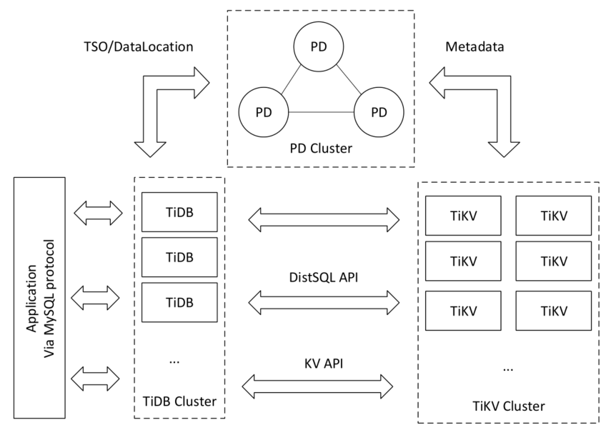

# 分布式数据库系统-鉴赏

## 1.TiDB

TiDB是PingCAP设计的开源分布式HTAP(Hybrid Transactional and Analytical Processing)数据库，支持传统RDBMS的特性，同时吸收NoSQL系统的优点，采用KV系统作为存储节点，获得高性能和可扩展性，其架构如图所示。

TiDB实际上由三个组件构成完整的分布式数据库系统，其中PD(Placement Driver) Server是整个集群的管理组件，主要负责提供全局递增事务时间戳、TiKV的主键范围位置等元信息的存储和TiKV存储数据的调度与负载均衡，TiDB Server是数据库的计算节点，负责SQL的解析、优化、执行等工作，本身无状态，通过负载均衡组件对外提供统一的接入地址。TiKV是系统的存储节点，本身是支持事务的KV数据库，通过mutil-Raft协议实现集群节点间多副本数据的一致性，使用percolator事务模型通过把事务信息保存在key上替代传统2PC的事务管理器，提高了分布式事务的线性扩展能力。类似的系统还包括CockroachDB，同样也是以KV组件作为存储引擎。

TiDB以region为单位将数据分布在TiKV集群的raft组内，一个region包含了一定主键范围内的数据，PD维护了各个Region的TiKV地址信息，当TiKV上发生region分裂后，将会发送请求更新PD的上的region位置信息。TiKV底层存储引擎是RocksDB，使用LSM树替换B+树的避免磁盘随机写入问题。

对于TiDB的查询执行而言，TiDB Server本身无数据，数据需要从TiKV上获取，与TiKV的通信模块是TiDB Server内部的TiClient，它基于gRPC提供KV API和DistSQL API两套接口用于访问存储节点TiKV。其中KV API用于发起已知主键的GET查询请求，而DistSQL用于发起对单表的SCAN请求，一条查询中可能包含多个DistSQL请求，一个DistSQL可能涉及TiKV集群的多个region，每个region又对应一个coprocessor请求，coprocessor是可下压到TiKV的单表操作的执行接口。DistSQL对应的实现接口是copIterator，会并发的发起coprocessor请求，然后等待TiKV返回结果。

## 2. PolarDB

在PolarDB中，使用一写多读的架构，可在同一台机器上部署多个PolarDB实例，重用了MySQL的查询引擎，完成SQL的解析、优化和执行。**Libpfs为用户态的文件系统，提供类POSIX的操作系统文件接口，减少数据库与操作内核上下文切换的的开销。**PolarSwitch为存储系统的客户端，接收Libpfs发送的I/O请求，通过查找与PolarCtrl同步的本地元数据缓存来找出属于块（Chunk）的所有副本的位置。ChunkServer负责存储Chunk并提供对Chunk的随机访问，通过**ParallelRaft**协议完成副本状态复制，并且使用NVMe接口的SSD作为物理存储介质。PolarSwitch与ChunkServer的通信通过RDMA，并且ChunkServer之间也通过RDMA网络进行通信，保证数据副本的一致性。另一个类似的使用共享存储的云服务数据库系统是Aurora，但是**Aurora的主要聚焦在减少网络传输开销和写日志流程的优化，大幅提高了单机写的吞吐量**，而**PolarDB主要改进的是读的吞吐量**。

## 3.OceanBase

