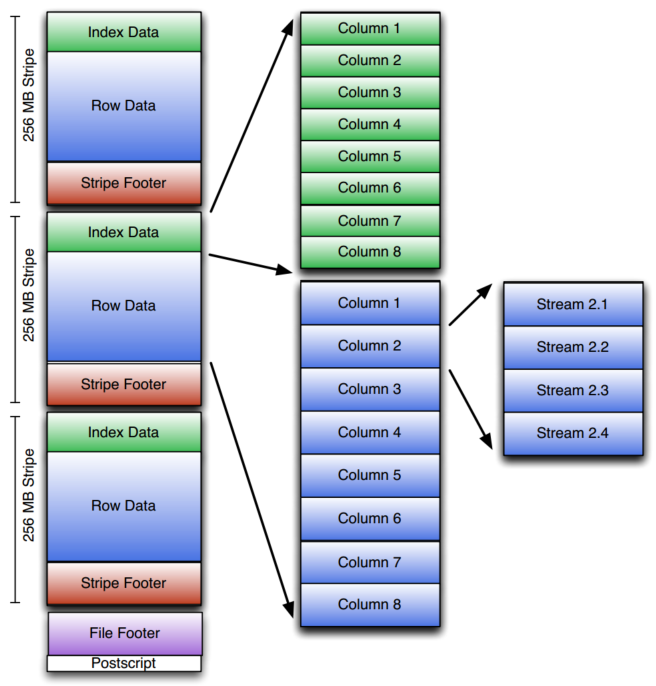

# 列存储(Column-Oriented)数据库系统

[TOC]

## 1. 简介

列存储Column-Oriented，即数据记录按列方式组织column by column，相对于行存储使用tuple by tuple。


列存储出现的背景：

> 列存出现的直接原因，是数据库系统性能与系统在主存储器（例如磁盘）上存储数据并将其移入 CPU 寄存器进行处理的效率直接相关。即IO是数据库系统的瓶颈。


IO改进的其他探索：

- 复杂的索引
- 物化视图
- 垂直和水平分区


列存储的场景：

采用列存储的数据库，通常是一些OLAP负载的数据库，因为列存格式，能够快速扫描、聚合需要的列，倾向于不更新数据。


典型列存储系统：

学术：MonetDB，、VectorWise、C-Store

商业：VectorWise，Vertica


并且许多大数据系统也使用列存储格式：

ClickHouse，Druid，Greenplum，Amazon  Redshift。


一些系统或多或少借鉴列存储的思想：

HBase，Impala，TiDB


## 2. 数据模型

### 2.1 Apache ORC

ORC最初是为了Hive而提出了一种列存格式，取代原始的text，sequencefile(二进制)，现在被一些大数据引擎（spark）接受的开放式数据结构。

旨在解决：

- 改善查询速度
- 存储效率
- 支持hive的复杂类型，新类型
- 一个文件对应一个输出task，降低NameNode元信息管理压力


关键特性：

- 强类型系统
- 高级压缩
- 列投影
- 支持谓词下推
- 向量化
- 支持ACID
- 内置索引
- 支持复杂类型
- 自描述
  - 不依赖于 Hive Metastore 或任何其他外部元数据，解释文件的内容。
    - （非事务ORC表）


支持的数据类型

- Integer
  - boolean (1 bit)
  - tinyint (8 bit)
  - smallint (16 bit)
  - int (32 bit)
  - bigint (64 bit)
- Floating point
  - float
  - double
- String types
  - string
  - char
  - varchar
- Binary blobs
  - binary
- Date/time
  - timestamp
  - timestamp with local time zone
  - date
- Compound types
  - struct
  - list
  - map
  - union

 ORC 文件都是相同类型的逻辑序列，所有类型的字段都允许空值。




文件结构：

- stripe条带化分割
  - 默认256MB （是旧版本，新版本是64MB）
    - 适配HDFS Block块大小
- Footer文件页脚
  - 各条带的位置
  - schema
  - 各列的count，min，max，sum（文件和条带级别），bloom filter。
- Postscript
  - 压缩参数
  - 压缩后footer大小
  - 文件版本

条带结构：

- Data
  - 按列组织的压缩后的数据
  - 每列被序列化为Streams
    - 嵌套类型，直接展平的树形结构，子列也是按列组织。
- Index
  - 粗粒度，默认间隔10, 000行
    - 位置
    - min，max
  - 用于跳过某些行
- Footer
  - 条带内各列的stream 的位置
  - 每列所使用的编码


压缩：

- 轻量级压缩
  - 特定类型（int，string，timestramp等）
  - 低代价
- 通用的压缩
  - none，snappy，lzo，zlib
  - 整个文件使用相同的压缩算法
  - 应用在每个stream，footer
  - 应用在轻量级压缩之后


序列化：

- integer
  - Protobuf 风格变长整形
    - 即先ZigZag，后再Varint编码，细节见[序列化与反序列SerDe笔记](https://github.com/tianjiqx/notes/blob/master/distributed_system/%E5%BA%8F%E5%88%97%E5%8C%96%E4%B8%8E%E5%8F%8D%E5%BA%8F%E5%88%97%E5%8C%96SerDe.md)
  - Run-Length Encding
    -  编码连续相同值[细节笔记](https://github.com/tianjiqx/slides/blob/master/column-store-tutorial.pdf)
  - 具有2个stream
    - bit stream，是否为null
    - data stream 整形流

- String
  - 使用字典编码统一列值
    - 加速谓词过滤
    - 压缩
    - 然后可以使用RLE编码重复行
  - 具有4个stream
    - bit stream，是否为null
    - 字典数据，bytes
    - 每个字典元素的长度，计算offset
    - 数据
- 组合类型
  - Lists
    - 对每个值的items数量进行编码
    - 同样使用RLE
    - 对每个值，用子writer序列化
  - Maps
    - 对每个值的items数量进行编码
    - 使用RLE
    - 使用key，value的子 writer


通用压缩

- 默认zlib，每次压缩大小默认256K
- 压缩块
  - 固定头，3 byte
    - 是否使用了压缩
    - 压缩后的长度  
- 记录压缩后流的位置信息
  - 压缩header的偏移
  - 未压缩的字节数
  - count RLE


列投影：

- 查询时，配置request需要的列的list
  - top-level的列
- 根据条带footer查询需要的列的数据流


ACID支持：

hive acid实现原理，参见 [大数据系统-鉴赏 6.2.2节](https://github.com/tianjiqx/notes/blob/master/big_data_system/%E5%A4%A7%E6%95%B0%E6%8D%AE%E7%B3%BB%E7%BB%9F-%E9%89%B4%E8%B5%8F.md)


ORC reader 对单个文件，最少读取16k，其他根据需要读取。

postscripr-> file Footer -> stripe footer -> col present + data


其他细节

- 元信息，使用Protocol Buffers存储
  - 为了能增删属性
- ORC Reader支持跳过给定行
- 无checksum，HDFS 具有了该功能
- 元信息可以在ORC Writer关闭前，任何时间添加（插入时优化？）


### 2.2 Dremel / Apache Parquet

parquet的目标为了让Hadoop 生态系统中的任何项目都可以使用压缩、高效的列式数据表示的优势。（受支持更多）

- 嵌套数据结构，具有定义和重复级别的 Dremel 编码，优于嵌套名称空间的简单扁平化。

- 支持多种压缩和编码方案
  - 列级别指定压缩方案


文件格式：


- 文件
  - 行组row group
    - 逻辑水平分区，无物理结构，由列块组成
    - 优化读取，推荐大小(512MB-1GB)，HDFS块大小也调大
      - 更大的行组允许更大的列块，支持更大的顺序IO
    - 列块，特定列的数据块
      - 每列一个列块
      - 包含一页，或多页
        - 页，不可分割的单元（压缩和编码）

```
4-byte magic number "PAR1"
<Column 1 Chunk 1 + Column Metadata>
<Column 2 Chunk 1 + Column Metadata>
...
<Column N Chunk 1 + Column Metadata>
<Column 1 Chunk 2 + Column Metadata>
<Column 2 Chunk 2 + Column Metadata>
...
<Column N Chunk 2 + Column Metadata>
...
<Column 1 Chunk M + Column Metadata>
<Column 2 Chunk M + Column Metadata>
...
<Column N Chunk M + Column Metadata>
File Metadata
4-byte length in bytes of file metadata
4-byte magic number "PAR1"
```


元数据，thrift 结构，使用 TCompactProtocol 进行序列化（orc使用 protobuf）。

- 文件元数据
- 列（块）元数据
- 页头元数据


数据类型：

- *BOOLEAN* : 1 位布尔值
- *INT32* : 32 位有符号整数
- *INT64* : 64 位有符号整数
- *INT96* : 96 位有符号整数
- *FLOAT* : IEEE 32 位浮点值
- *DOUBLE*：IEEE 64 位浮点值
- *BYTE_ARRAY*：任意长的字节数组。

嵌套类型（Dremel 编码）：

- 定义级别
  - 指定在列的路径中定义了多少个可选字段
- 重复级别
  - 指定路径中的哪个重复字段具有重复值
    - 完成list这样重复元素

（TODO 理解Dremel ）


NULL值 编码：RLE，例如（0,1000） , 表示1000个NULL值。


编码：

- Delta encoding
  - 有序列，记录增长值
- prefix coding
  - Delta encoding for string
- Dictionary encoding
  - 小集合的列，<60K 个值，（server ip，experiment id等）
- Run length Encoding
  - 连续重复行


错误恢复：

- 每第 N 个行组写入文件元数据，避免最后写文件元数据时发生错误，累积文件元数据


### 2.3 ORC vs Parquet vs Arrow 

主内存列存储 Apache Arrow

磁盘驻留列存储Apache  Parquet/ORC


区别：

一般性能测试，orc压缩与性能更好。orc自己也宣称自己是最小，最快的列存格式。 parquet 支持的引擎更多，更广泛，另外据其宣称，可能在嵌套结构类型上表现更好。

功能上，orc 为hive支持acid（hive orc事务表）。


Parquet 和 ORC，支持高比率压缩算法（snappy，zlib，lz4）

Arrow 专注于矢量化处理和和低开销压缩算法（字典压缩等），批量大小可以更小


(TODO: Databricks  delta lake/lakehouse 在计算引擎对parquet文件处理做的优化)


### 2.4 Schema on Write/Read

Schema-on-Write (RDBMS，OLTP，OLAP):

- 规范数据建模
  - 创建静态的DB Schema
  - 将数据转换为RDBMS
  - 以RDMS格式查询数据
  - 增加列，需要显式的添加，并传播到整个系统（锁表，新数据插入前）
- 适合已知schema模式
- 数据模式验证在写入时
  - 支持辅助数据结构（索引，bloomfilter，minmax统计信息），加快查询速度和精度，定位数据，过滤不必要的磁盘IO，减少CPU计算过滤开销
  - 支持压缩，减少存储空间开销

Schema-on-Read (Hadoop)：

- 描述性数据模型
  - 以原生格式进行拷贝数据（相对于关系数据库的插入）
  -  动态的创建schema+解析器 （定义外表，serde）
  - 以原生格式查询数据，（运行时ETL）
  - 新数据可以随时添加
- 适合未知schema模式
  - 版本控制，对schema的变更（apcahe avro）
  - 读取过程中，更新schema
- 数据模式验证在读取时
  - 加载速度很快，不需要读取、解析或序列化，只是拷贝文件
  - 缺点
    - 数据的缺失，重复，无效数据等问题，从而导致查询结果不准确或不完整


可能的结合方式: 先写Schema-on-Read副本，之后异步转Schema-on-Write副本，并删除（或者保留）Schema-on-Read副本。


## 3. 编码与压缩

### 3.1 lz4 压缩算法

#### 原理

LZ4利用滑动窗口的概念以及一个哈希表来寻找重复的数据模式。当在数据流中发现重复的模式时，LZ4不会再次存储这些数据，而是存储一个“回溯”到之前出现该模式的位置的指针（偏移量）和重复模式的长度。这种指针通常称为匹配（Match）或重复（Literal）。

##### 压缩过程
- 初始化：
初始化一个16KB大小的哈希表，用于存储最近访问的字节序列及其位置。
设置一个滑动窗口，通常不超过64KB，用于在其中寻找重复模式。
数据读取与匹配：
读取输入数据中的一个字节序列。
使用哈希函数计算当前字节序列的哈希值，并查询哈希表中是否存在相同的序列。
如果存在，则获取对应的偏移量（距离当前位置的距离）和最长的匹配长度。
- 编码：
如果找到匹配，将偏移量和匹配长度编码成压缩流的一部分。
如果没有找到匹配，将当前字节序列直接写入压缩流中，这被称为字面量（Literal）。
- 更新哈希表：
在处理完一个字节序列后，更新哈希表，将当前序列及其位置添加进去。
移除超出滑动窗口范围的旧条目。
重复步骤2至4，直到所有输入数据被处理完毕。

##### 解压缩过程
- 读取压缩数据：
从压缩流中读取下一个数据块。

- 解码：
解析读取的数据块，确定其是字面量还是匹配。
如果是字面量，直接将其写入输出缓冲区。
如果是匹配，使用偏移量和长度从之前的输出数据中复制相应的字节序列到输出缓冲区。
重复步骤1至2，直到压缩流结束。


##### 特点
- LZ4使用小的哈希表（16KB），这使得它在内存受限的环境中也能有效运行。
- 偏移量通常限制在64KB以内，这意味着它**适合于压缩具有局部重复性的数据**。
- LZ4的解压缩速度非常快，接近内存拷贝操作的速度。
- LZ4的压缩速度可以通过调整算法中的某些参数来优化，例如增加或减少扫描窗口的大小。
- LZ4因其高速性能而在多种场景下得到广泛应用，包括操作系统内存压缩、网络传输、实时数据处理等。


[LZ4](https://github.com/LuXugang/Lucene-7.x-9.x/blob/master/blog/Lucene/%E5%8E%8B%E7%BC%A9%E5%AD%98%E5%82%A8/LZ4/LZ4Fast.md)


### 3.2 Bitshuffle


- [Doris 实现原理之高效存取 varchar 字符串](https://cloud.baidu.com/article/3319774) 推荐
    - 字典编码,plain 编码 存储 字典页
        - Doris 采用的是试探法，优先先采用字典编码，随着数据增加， 如果字典大小超过一定的阈值退回 plan 编码，目前这个阈值是 dict_page 大小超过 64KB
    - 数字优化：引入 Bitshuffle 算法来对数字按照 bit 重新进行打散排序 提高 lz4 压缩效率
        - Bitshuffle 重新排列一组值以存储每个值的最高有效位，其次是每个值的第二个最高有效位，依此类推。

    - [字符串编码/解码](https://www.cnblogs.com/bitetheddddt/p/15210062.html)
        - 字典编码+bitshuffle+lz4压缩
    


- [Kudu笔记](https://yx91490.github.io/bigdata/kudu/kudu_note.html) 

kudu 列编码方式：

| Column类型                  | 支持的编码方式                       | 默认编码方式     |
| ------------------------- | ----------------------------- | ---------- |
| int8, int16, int32, int64 | plain, bitshuffle, run length | bitshuffle |
| date, unixtime_micros     | plain, bitshuffle, run length | bitshuffle |
| float, double, decimal    | plain, bitshuffle             | bitshuffle |
| bool                      | plain, run length             | run length |
| string, varchar, binary   | plain, prefix, dictionary     | dictionary |

Bitshuffle编码：重新排列一个值块，以存储每个值的最高有效位，然后第二个最高有效位，依此类推。适合具有许多重复值，或者具有高局部相关性的情况，例如连续的浮点值变化不大的列。


## 4. 索引


## 5. Join


## 6. 列散列

对于列存数据库，shuffle数据时，会涉及到将原来在内存中列存格式数据，根据hash条件，重新分段（段数等于机器节点个数），依然是列存格式。（可参考datafusion的hash过程，@tensorbase笔记）

如rust这样的语法，可以通过智能指针共享数据，重新调整结构，免数据拷贝，但是还是需要经过NIC发送到其他节点。根据[IO性能改进技术](https://github.com/tianjiqx/notes/blob/master/performance/IO%E6%80%A7%E8%83%BD%E6%94%B9%E8%BF%9B%E6%8A%80%E6%9C%AF.md) 的linux IO过程，如果是普通的write方式，会涉及将CPU copy，显然内存是离散的，是否会存在cache miss的影响呢。

以[Intel(R) Xeon(R) Platinum 8269CY ](https://ark.intel.com/content/www/cn/zh/ark/products/192474/intel-xeon-platinum-8260-processor-35-75m-cache-2-40-ghz.html) CPU cache L3 大小35.75 MB  [Intel Xeon Platinum 8176](https://www.spec.org/cpu2017/results/res2018q3/cpu2017-20180820-08541.html) L1 CPU cache 32KB L2 1024KB L3  CPU cache 35.75 MB，int64列，1k行的大小是 8  * 1000 = 8KB 大小，不超过L1 的Cache， 因此，因此列存散列，按列进行处理的开销并不大，但是尽量应该在控制在4K行以内。L1 cache 0.5us，而L2 cache在7us，相对还是差距较大。


## 7. 实现

### apache iot  tsfile

| 数据类型    | 推荐编码       | 推荐压缩算法 |
|---------|------------|--------|
| INT32   | TS_2DIFF   | LZ4    |
| INT64   | TS_2DIFF   | LZ4    |
| FLOAT   | GORILLA    | LZ4    |
| DOUBLE  | GORILLA    | LZ4    |
| BOOLEAN | RLE        | LZ4    |
| TEXT    | DICTIONARY | LZ4    |


[more](https://iotdb.apache.org/zh/UserGuide/latest/Basic-Concept/Encoding-and-Compression.html#%E5%9F%BA%E6%9C%AC%E7%BC%96%E7%A0%81%E6%96%B9%E5%BC%8F)


## REF

- [The Design and Implementation of Modern Column-store Database Systems](https://stratos.seas.harvard.edu/files/stratos/files/columnstoresfntdbs.pdf)
- [处理海量数据：列式存储综述（存储篇）](https://zhuanlan.zhihu.com/p/35622907)
- [[笔记] Integrating Compression and Execution in Column-Oriented Database Systems](https://fuzhe1989.github.io/2021/01/08/integrating-compression-and-execution-in-column-oriented-database-systems/)
- [slides:压缩和列存储](https://info290.github.io/slides/19-compression-col-stores.pdf)
- [slides:Column_Store_Tutorial_VLDB09](http://www.cs.umd.edu/~abadi/talks/Column_Store_Tutorial_VLDB09.pdf)
- [slides:column-store-tutorial](https://github.com/tianjiqx/slides/blob/master/column-store-tutorial.pdf)  myself survey on 2019
- [slides:Revisiting Data Compression in Column-Stores-2021](https://cs.ttu.ee/events/medi2021/slides/Slesarev_MEDI2021.pdf)
- [slides:Column-Stores vs. Row-Stores: How Different are they Really?](https://www.slideshare.net/abadid/columnstores-vs-rowstores-how-different-are-they-really)
- [Apache Arrow 与 Parquet 和 ORC：我们真的需要第三个 Apache 项目来表示列数据吗？](http://dbmsmusings.blogspot.com/2017/10/apache-arrow-vs-parquet-and-orc-do-we.html)
- [slides:ORC Deep dive 2020](https://www.slideshare.net/oom65/orc-deep-dive-2020)
- [slides:File Format Benchmarks - Avro, JSON, ORC, & Parquet-2016](https://www.slideshare.net/oom65/file-format-benchmarks-avro-json-orc-parquet)
- [doc: ORC](https://orc.apache.org/docs/)
- [github: apache ORC](https://github.com/apache/orc)  443 stars
- [doc: apache parquet](https://parquet.apache.org/documentation/latest/)  897 stars (都相对很少)
- [github: apache parquet](https://github.com/apache/parquet-format)
- [slides:Efficient Data Storage for Analytics with Apache Parquet 2.0](https://www.slideshare.net/cloudera/hadoop-summit-36479635) 2014
- [再来聊一聊 Parquet 列式存储格式](https://zhuanlan.zhihu.com/p/141908285)  parquet 交互逻辑
- [Parquet与ORC：高性能列式存储格式(收藏](https://www.huaweicloud.com/articles/76e423ad4ee18b909b7788c8d8004d1a.html)
  - tpcds测试，parquet与orc性能差距不大，在3层嵌套格式，查询性能也无太大区别
- [Uber是如何低成本构建开源大数据平台的？](https://www.infoq.cn/article/4SRRiP7ZUhYMoAK7dafQ)
- [Schema-on-Read vs Schema-on-Write](https://luminousmen.com/post/schema-on-read-vs-schema-on-write)
- [What is the difference between schema on Read and Schema on Write?](https://data-flair.training/forums/topic/what-is-the-difference-between-schema-on-read-and-schema-on-write/)
- [什么是 Hadoop 中的 Schema On Read 和 Schema On Write](https://www.geeksforgeeks.org/what-is-schema-on-read-and-schema-on-write-in-hadoop/)


- [2.0 解析系列 | OceanBase 2.0的高级数据压缩特性](https://github.com/alibaba-developer/DataBase/blob/master/OceanBase/2.0%20%E8%A7%A3%E6%9E%90%E7%B3%BB%E5%88%97%20%7C%20OceanBase%202.0%E7%9A%84%E9%AB%98%E7%BA%A7%E6%95%B0%E6%8D%AE%E5%8E%8B%E7%BC%A9%E7%89%B9%E6%80%A7.md)
  - RLE编码
  - 常量编码
  - 差值（数值型）编码 : 连续生成的时间类型数据
  - 差值（定长字符型）编码:  适用于定长的、有确定业务规则的字符型数据，通过构造公共串,将数据中只记录差异部分. 订单号、用户账号
  - 前缀（字符型）编码 


- [压缩算法实验室](https://github.com/compression-algorithm-research-lab)  

- [apache/tsfile](https://github.com/apache/tsfile/blob/develop/README-zh.md)

