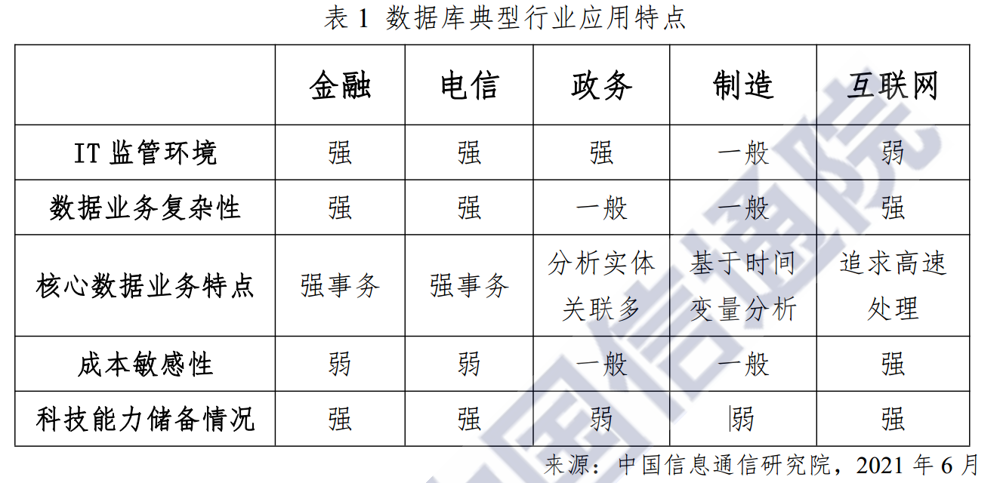

## 数据库-摘抄

## 0. 说明

零散数据库，分布式数据库，大数据系统概念笔记

大多来自网络资源，自身理解，体会较少，需有保留的，怀疑的看。

相关主题多后，整理汇总倒专题笔记中


## 1.多模数据库

多模数据库

扩展模型的方式:

- 新存储方式+新数据模型
  - 原生的存储模型，进行存储和查询
- 原存储方式+新数据模型
  - 各类型，物理存储方式一致，多表组合新的模型（kv，json，用户自定义类型UDT）
  - MySQL、ArangoDB（图）、MongoDB
- 新接口+原存储模型
  - 兼容历史数据，读取成不同类型，SerDe开销
  - Lindorm，Couchbase
- 原存储模型


部署模式

云数据库：

- 云厂商托管的开源数据库
  - 托管传统关系数据MySQL，PostgreSQL、Redis等
- 基于云环境的云原生数据库
  - Aurora、PolarDB


### REF

- [2021中国数据库行业研究报告](https://www.modb.pro/db/68588?ad)

  

## 2.数据库灾备基础知识

RPO（Recovery Point Objective）即数据恢复点目标，主要指的是业务系统所能容忍的数据丢失量。

RTO（Recovery Time Objective）即恢复时间目标，主要指的是所能容忍的业务停止服务的最长时间，也就是从灾难发生到业务系统恢复服务功能所需要的最短时间周期。


## 3.云游戏

云端高性能主机渲染出来的游戏画面经过H.265等编码方案压缩后，通过网络传输到用户的低性能设备上进行解码，把画面还原到本地的显示设备上。再把用户本地的键盘鼠标手柄等游戏输入设备产生的控制指令通过网络传回云端主机。

每秒60帧画面，延时小于30ms，基本可以满足普通玩家的游戏需求。

每秒144帧画面，延时小于15ms，基本可以满足电竞玩家的游戏需求。

基于边缘计算的顺网云电脑，通过在全国每个省都建立至少一个计算中心的方式，来规避互联网网络的延迟，是目前市场上比较成熟的云游戏产品。

作者：知乎#千山一刀


## 4. MPP与批处理比较

#### 概念与特征

MPP:

MPP是由多台SMP服务器通过一定的节点互联网络进行连接，协同工作，完成相同的任务，从用户的角度来看是一个服务器系统。每个节点只访问自己的资源，所以是一种**完全无共享（Share Nothing）结构**。

特点：数据广播，数据重分布

MPP架构特征：

- 任务并行执行;
- 数据分布式存储(本地化);
- 分布式计算;
- 高并发，单个节点并发能力大于300用户;
- 横向扩展，支持集群节点的扩容;
- **Shared Nothing（完全无共享）架构**。

批处理架构:

核心：Map，reduce计算框架。


批处理系统 - 使用场景分钟级、小时级以上的任务，目前很多大型互联网公司都大规模运行这样的系统，稳定可靠，低成本。

MPP系统 - 使用场景秒级、毫秒级以下的任务，主要服务于即席查询场景，对外提供各种数据查询和可视化服务。

#### 比较

相同点：

**批处理架构与MPP架构都是分布式并行处理**，将任务并行的分散到多个服务器和节点上，在每个节点上计算完成后，将各自部分的结果汇总在一起得到最终的结果。

不同点：

批处理架构和MPP架构的不同点可以举例来说：我们执行一个任务，首先这个任务会被分成多个task执行，**对于MapReduce来说，这些tasks被随机的分配在空闲的Executor上（但是会尽力数据本地化，搬计算）；而对于MPP架构的引擎来说，每个处理数据的task被绑定到持有该数据切片的指定Executor上**。

批处理的任务（task）功能性更单一，有很多阶段处理。MPP的任务功能性更丰富，范围更大，对数据处理集中，节点的数据，尽力pipeline处理。


- 批处理的优势：

对于批处理架构来说，**如果某个Executor执行过慢，那么这个Executor会慢慢分配到更少的task执行**，批处理架构有个推测执行策略，推测出某个Executor执行过慢或者有故障，则在接下来分配task时就会较少的分配给它或者直接不分配，这样就不会因为某个节点出现问题而导致集群的性能受限。

- 批处理的缺陷：

任何事情都是有代价的，对于批处理而言，它的优势也造成了它的缺点，**会将中间结果写入到磁盘中**，这严重限制了处理数据的性能。

- MPP的优势：

**MPP架构不需要将中间数据写入磁盘**(不考虑容错，执行失败)，因为一个单一的Executor只处理一个单一的task，因此可以简单直接将数据stream到下一个执行阶段。这个过程称为`pipelining`，它提供了很大的性能提升。

- MPP的缺陷：

对于MPP架构来说，因为task和Executor是绑定的，如果某个Executor执行过慢或故障，将会导致**整个集群的性能就会受限于这个故障节点的执行速度**(所谓木桶的短板效应)，所以MPP架构的最大缺陷就是——**短板效应**。另一点，集群中的节点越多，则某个节点出现问题的概率越大，而一旦有节点出现问题，对于MPP架构来说，将导致整个集群性能受限，所以一般实际生产中**MPP架构的集群节点不易过多**。

**缺少容错机制**，失败则重启。

数据就地计算，某些请求，并发度会受单机限制。


举个例子来说下两种架构的数据落盘：要实现两个大表的join操作，对于批处理而言，如Spark将会写磁盘三次(第一次写入：表1根据`join key`进行shuffle；第二次写入：表2根据`join key`进行shuffle；第三次写入：Hash表写入磁盘)， 而MPP只需要一次写入(Hash表写入)。**这是因为MPP将mapper和reducer同时运行，而MapReduce将它们分成有依赖关系的tasks(DAG),这些task是异步执行的，因此必须通过写入中间数据共享内存来解决数据的依赖**。


#### 将MPP和Batch进行结合

MPP是更快的，但是有两个关键痛点——短板效应和并发限制

MapReduce这样的批处理系统，需要花费时间来存储中间数据到磁盘上

新的**Apache HAWQ**的架构

> 不需要在固定的节点上处理本地存在的数据。
>
> Apache HAWQ提出了”virtual segments”的概念——GreenPlum中的”segment” 是改进版的PostgreSQL数据库中的一个单一实例，它在每个节点上存在一个，并且在每次查询中产生”executor”进程。如果你有一个小的查询，它可以被4个executors执行甚至是一个。如果你有一个大的查询，你可以用100个甚至1000个executor执行。每个查询仍然是以MPP风格对本地数据进行处理，而且不需要将中间数据写入到HDD上，但是”virtual segments”允许executor运行在任何地方。

特性：

[1] 减轻MPP系统的短板问题：因为我们可以动态的添加节点和删除节点。因此，严重的磁盘故障将不会影响整个集群的性能，系统可以拥有比传统MPP更大量级的集群。现在，我们可以暂时的将一个故障节点从集群中移除，那么就不会有更多的executor在上面开始运行。并且，移除节点时不会有停机时间。

[2] 一次查询现在被一个动态数量的executors进行执行，这也就带来了更高的并发度，缓和了MPP系统的限制并加入了batch系统的灵活性。想象一下拥有50个节点的集群，每个节点最多可以运行200个并行的进程。这就意味着你一共拥有了”50*200=10,000”个”execution slot”。你可以对20个查询每个执行500个executor，也可以对200个查询每个执行50个executor，甚至于你可以对1个查询运行10000个executor。在这里是完全灵活可控的。你也可能有一个大的查询要使用4000个segments和600个小的查询每个需要10个executors，这也是可以的。

[3] 数据管道的完美应用：实时的从一个executor中将数据转移到另一个executor中。在执行阶段，单独的查询仍然是MPP的，而不是batch。因此，不需要将中间数据存储到本地磁盘中(无论何时，操作都允许数据管道)。这意味着我们离MPP的速度更近一步了。

[4] 像MPP那样，我们仍然尽可能的使用本地数据来执行查询，这一点可以通过HDFS的short-circuit read(当client和数据在同一节点上，可以通过直接读取本地文件来绕过DataNode，参考HDFS Short-Circuit Local Reads)来实现。每个executor会在拥有该文件最多块数的节点上创建并执行，这也最大化了执行效率。


TODO：MPP的扩展性问题，不宜超过50

> 在一个确定的量级，你的MPP系统将总会有一个节点的磁盘队列出现问题，这将导致该节点的性能降低，从而像上面所说的那样限制整个集群的性能。这也是为什么在这个世界上没有一个MPP集群是超过50个节点服务器的。

OceanBase 是如何支撑双11，打榜tpcds的？类似分库分表,数据切分？读取副本？类似发起推测执行的task？

mpp，批处理融合？


TODO：星环的架构方案

OLAP 分析查询优势（容错，资源利用率，短板效应低），点查询劣势（语法解析时间，DAG图异步执行，结果落盘等时间，比不过MPP架构）


TPC-DS 成绩

当前最新：阿里ADB(AnalyticDB)，transwarp

实际都是spark内核为基础，进行一定的优化。


#### Ref

- [MPP大规模并行处理架构详解](https://mp.weixin.qq.com/s/C3zSGT_u_JbM2H-ayI0BxQ)

- [MPP 的进化：深入理解 Batch 和 MPP 优缺点](https://toutiao.io/posts/2a9ayg/preview)


## 5. 查询优化

（来自毕业论文）

### 5.1 基数估计

基数，即不同值个数NDV。基数估计的重要性在于查询优化器会使用 NDV
来估计连接后表中间结果集的大小，group by 、distinct 后的行数。

在现有的基数估计算法中主要有基于位图（bitmap），排序，哈
希（hashing），采样，位图与哈希的结合以及基于哈希的观察等方法。

位图：N位数值枚举空间，统计1的个数，内存消耗过大，一般结合hash

排序：大数据集，文件排序。精确，时间开销大。

近似统计的方法，均匀哈希方法，，布隆过滤器（需预知最大数量）

直方图：等宽、等深

CountMin-sketch 估计点查询近似和基数估计

实际的大数据系统，大数据存储时，现在普遍在物理存储时，计算每个物理存储文件的没列统计信息行数，min,max值，空值个数，如parquet，orc用于进行谓词下推。


TODO：spark的查询优化器能力如何？猜测，可以根据统计信息决策连接顺序，但是算子的决策。

<解析，计划，调度>

### 5.2 外连接消除

A-left join-B-left join-C and C.id is not null

```
select t1.c1,t2.c1,t3.c1 from  t1 left join t2 on t1.c1=t2.c2 left join t3 on t2.c1=t3.c2 where t3.c3< 5; 
```

由于NULL值拒绝表达式的传递。可以向前传导，因此前一个left join也可以被消去。


### 5.3 谓词下推

出现位置： join on， where子句，having子句

topN，limit 下推 减少数据量，不影响正确性

### 5.4 等价类推

隐含关系，推导条件

- 从列相等关系推断更多过滤器/约束
- 隐含not null条件
- 消除冗余条件


额外需要考虑的是，可能需要重复迭代优化的问题。 有时应用了某一条规则，比如A left join B left join C where  C.c is not null。传播了一次之后，B left join C可以 外连接消除为B inner join C，但是之后又由inner join 推出，B.b is not null，可以再推出A left join B 的消除。链式传递。

所以应用一条逻辑优化的规则，化简的结果可以再次应用以前的规则。（PS：filter下推是一件很正常的事情，应用规则下推时，或许应该原位置的filter仍然保留，以保证再次优化时，还可以使用该条件）


#### REF

- [TiDB 逻辑计划中增强约束传播](https://github.com/pingcap/tidb/blob/master/docs/design/2018-07-22-enhance-propagations.md)
- [MySQL常量传播](https://dev.mysql.com/doc/internals/en/optimizer-constant-propagation.html)


### 5.5 子查询提升

增加连接次序调整空间，更多的优化可能，如等价类推。

### 5.6 相关子查询消除

一次性读内表，减少IO次数

### 5.7 min，max消除

重写为order by，limit 1实现，order by列存在索引时，减少排序，get获取。


### 5.8 关于查询优化设计的新看法


## 8.NewSQL定义

~~Andrew Pavlo 的定义NewSQL针对的系统：~~

- ~~是短暂的（即没有用户停顿）~~  
- ~~使用索引查找获取一小部分数据（即，没有全表扫描或大型分布式连接）~~  
- ~~是重复的（即，使用不同的输入参数执行相同的查询）~~  


oceanbase，tidb


## 9.实时数仓库的进化

实时数仓经历了**三个重要的里程碑**：

- Storm 的出现打破了 MapReduce 的单一计算方式，让业务能够处理 T+0 的数据；
- Lambda 到 Kappa 架构的进化，将离线数仓转化为实时数仓；
- Flink 的出现给出了批流一体更好的实践方式。


## 10. “流批一体”

> 初衷是让开发人员能够用同一套接口实现大数据的流计算和批计算，进而保证处理过程与结果的一致性。
>
> 实时性。

TODO：refine

lamda 架构：并行写入，批处理+流处理中，最后合并视图

kappa架构：只用流计算

Kappa+架构: 流计算框架直读 HDFS 类的数仓数据，一并实现实时计算和历史数据 backfill 计算，不需要为 backfill 作业长期保存日志或者把数据拷贝回消息队列

delta lake架构：支持单表的ACID


### REF

- [为什么阿里云要做流批一体？](https://www.infoq.cn/article/ykkzj6ijzdrzdlls83kg)
- [大数据架构如何做到流批一体？](https://www.infoq.cn/article/uo4pfswlmzbvhq*y2tb9)


## 11.云原生数据库

> 云原生数据库和托管/自建数据库最大的区别就是：
>
> 云原生数据库是面向独立资源的云化，其CPU、内存、存储等均可实现独立的弹性，利用大型云厂商的海量资源池，最大化其资源利用率，降低成本，同时支持独立扩展特定资源，满足多种用户不断变化的业务需求，实现完全的Serverless; 
>
> 而托管数据库还是局限于传统的服务器架构，各项资源等比率的限制在一个范围内，其弹性范围，资源利用率都受到较大的限制，无法充分利用云的红利。
>
> 数据库的设计要充分利用云的基础设施。

云环境特点：高可用，弹性伸缩，安全性，运维成本，价格

当前的网络延迟问题，更适合数据仓库，大查询处理，延迟不，敏感。


> 数据库服务也受益于此体系结构。首先，数据库可以构建在基于虚拟化技术的更安全且易于扩展的环境上，例如Xen [4]，KVM [19]或Docker [26]。其次，可以通过后端存储集群的支持来增强数据库的一些关键功能，例如多个只读实例和检查点，后端存储集群提供快速I / O，数据共享和快照。 --polarFS

### REF

- [云原生数据库-黄东旭](https://pingcap.com/blog-cn/new-ideas-for-designing-cloud-native-database/#%E4%BA%91%E5%8E%9F%E7%94%9F%E6%95%B0%E6%8D%AE%E5%BA%93%E8%AE%BE%E8%AE%A1%E6%96%B0%E6%80%9D%E8%B7%AF)
- [Database · 技术方向 · 下一代云原生数据库详解](http://mysql.taobao.org/monthly/2020/05/01/)
- 知乎：[什么是云原生数据库？](https://www.zhihu.com/question/413933600)
- [CS590：云原生数据系统](https://www.cs.purdue.edu/homes/csjgwang/cloudb/)


## 12.Hash Join实现

### 12.1 hash join 基本原理

对内表构建哈希表，用外表探测获取结果。

内表如果不能完全装下，解决的方式增加partition步骤——grace join，分段连接。

hybrid hash join,改进grace join，每个分区join根据代价选择合适的连接算法。


(hash join 限制，哈希表倾斜度需要不高，否则，链表查找匹配，时间很长，如交行join列null值)


TODO：

并行hash相关等，内存，多核环境下的hash join


### 12.2 数据库hash join实现

TiDB的实现多线程版本的扫描大表，分发给work执行探测连接，并把worker的结果逐一发送给的主线程作为join结果的hash join。


关于内表的选择：

- Left Outer Join：左表是 Outer 表，右表是 Inner 表；
  - left join，左表的每一行都需要保留，join不上的右表设置为null，因此使用左表构建hash表，右表join不上的部分输出为null
- Right Outer Join：跟 Left Outer Join 相反，右表是 Outer 表，左表是 Inner 表；
- Inner Join：优化器估算出的较大表是 Outer 表，较小的表是 Inner 表；
- Semi Join、Anti Semi Join、Left Outer Semi Join 或 Anti Left Outer Semi Join：左表是 Outer 表，右表是 Inner 表。


### 12.3 Spark中的hash join实现

- Broadcast Hash Join: 广播小表（10M）给所有executor，executor对小表构建哈希表，并对处理分区数据，执行探测。
  - 通过driver广播小表可能OOM
  - 无shuffle，也叫map端join

- Shuffle Hash Join: 两表都按join key进行重新分区，相对小的表构建hash表。
  - 有shuffle
  - 针对大表连接

其他的join方式:

- Sort Merge Join: 大表和大表连接，类似merge join。默认比shuffle hash join优先。
  - shuffle：2大表根据joinKey重新分区
  - sort：节点的分区的2表数据排序
  - merge：有序分区数据join并输出。
- Cartesian product join：笛卡尔积连接
  - inner join限制
- Broadcast Nested Loop Join：支持等值和不等值 Join，支持所有的 Join 类型。最后的选择
  - Left Outer Join：广播右表
  - inner join：广播左右两张表

（数据库的merge join，适合join列本身有序，nested loop（index） join，适合内表（大表）有索引的连接）


#### REF

- [哈希连接算法](https://www.javatpoint.com/hash-join-algorithm)
- [hash join 读书笔记](https://oracleblog.org/study-note/study-hash-join/)
- [TiDB 源码阅读系列文章（九）Hash Join](https://pingcap.com/blog-cn/tidb-source-code-reading-9/#tidb-%E6%BA%90%E7%A0%81%E9%98%85%E8%AF%BB%E7%B3%BB%E5%88%97%E6%96%87%E7%AB%A0%E4%B9%9Dhash-join)
- [Spark难点 | Join的实现原理](https://juejin.cn/post/6844903998734991374#heading-0)
- [Spark的五种JOIN方式解析](https://jiamaoxiang.top/2020/11/01/Spark%E7%9A%84%E4%BA%94%E7%A7%8DJOIN%E6%96%B9%E5%BC%8F%E8%A7%A3%E6%9E%90/)


## 13. 计算与存储分离架构优势

1. 计算和存储节点可以使用不同类型的服务器硬件，可以单独定制。例如，计算节点不再需要考虑内存大小与磁盘容量的比率，这在很大程度上取决于应用场景并且难以预测。 
2. 集群中存储节点上的磁盘可以形成单个存储池，从而降低了碎片风险，节点间磁盘使用不平衡以及空间浪费。可以透明地轻松扩展存储群集的容量和吞吐量。 
3. 由于数据都存储在存储集群中，因此计算节点上没有本地持久状态，这使得执行数据库迁移变得更加容易和快捷。由于底层分布式存储系统的数据复制和其他高可用性功能，还可以提高数据可靠性。

#### REF

- PolarFS: An Ultra-low Latency and Failure Resilient Distributed File System for Shared Storage Cloud Database


## 14. 副本复制方案

**Master-Slave**

\- RDBMS 的读写分离即为典型的 Master-Slave 方案

\- 同步复制可保证强一致性但会影响可用性

\- 异步复制可提供高可用性但会降低一致性

**WNR**

\- 主要用于去中心化的分布式系统中。DynamoDB 与 Cassandra 即采用此方案或其变种

\- N 代表总副本数，W 代表每次写操作要保证的最少写成功的副本数，R 代表每次读至少要读取的副本数

\- 当 W+R>N 时，可保证每次读取的数据至少有一个副本拥有最新的数据

\- 多个写操作的顺序难以保证，可能导致多副本间的写操作顺序不一致。Dynamo 通过向量时钟保证最终一致性

**Paxos 及其变种**

\- Google 的 Chubby，Zookeeper 的原子广播协议（Zab），RAFT 等

**Kafka基于 ISR 的数据复制方案**

介于同步复制和异步复制，动态维护ISR，保证同步性能。


## 15. 信通院：2021年数据库发展研究报告

背景：

数据模型扩展，非关系模型（KV，图）

分布式架构逐渐成熟。

**技术趋势**：

- 多模数据库实现一库多用

  - Azure Cosmos DB、 ArangoDB、 SequoiaDB 和 Lindorm 等 

- 统一框架支撑分析与事务混合处理HTAP

  - HTAP 典型产品有 Oracle、 SQL Server、Greenplum、 TiDB、 OceanBase 和 PolarDB。中等规模企业的分析。

- 运用 AI 实现管理自治

  - 机器学习算法，自动管理计算与存储资源、自动防范恶意访问与攻击、主动实现数据库智能调优 

- 充分利用新兴硬件（提性能，降成本）

  - 多处理器（SMP）和多核（MultiCore）
    - 并行处理
  - 大内存（Big Memory） 
    - 实时性
  - 固态硬盘（SSD）
    - 大幅提升数据库系统的 IOPS 和降低延迟
  - 非易失性内存NVM
    - 存储引擎的索引、事物并发控制、日志、垃圾回收模块的应用
  - GPU，FPGA   
    - 特定数据库操作加速，如扫描、谓词过滤、大量数据的排序、 大表关联、 聚集等操作

- 与云基础设施深度结合

  - Gartner 预测到 2022 年全球75%的数据库将托管在云端 
  - 基于云资源部署的传统数据库
  - 基于容器化、微服务、 Serverless 等理念设计的存算分离架构的云原生数据库（亚马逊 AWS、 阿里云、 Snowflake）

- 隐私计算技术助力安全能力提升

  - 当前针对数据所处阶段来制定保护措施  ，数据传输阶段使用安全传输协议 SSL/TLS， 在
    数据持久化存储阶段使用透明存储加密， 在返回结果阶段使用数据脱敏策略等
  - 同态加密等密码学为代表的软件解决方案和以可信执行环境（TEE） 为代表的硬件方案
    - 密码学：基于数学理论的算法来直接对密文数据进行检索与计算  
    - 硬件：将存放于普通环境（REE） 的加密数据传递给 TEE 侧，并在 TEE 侧完成数据解密和计算任务

- 区块链数据库辅助数据存证溯源  

  - BlockchainDB、 BigchainDB 和 ChainSQL 等

  - 容忍拜占庭行为，不可信节点问题

    

**产业发展**：

数据库产品数量分布呈现以关系型为主， 非关系型及混合型数据库为辅的局面 。

员工数量普遍在百人以下。

关系型数据库产品多数基于 MySQL 和 PostgreSQL 二次开发而来。

非关系型数据库产品发展势头良好， 逐渐受到国际认可。时序数据库，浙江智臾和阿里云TSDB。

图数据库能够支撑社交网络，金融反欺诈等互联网与金融场景的关联分析业务，行业关注热度上升。欧若数网 Nebula Graph、 华为云 GraphBase 和百度智能云开源产品 HugeGraph。

**数据库上云**：

云基础设施的发展成熟将接近一半的传统数据库市场转移到了线上。

线上市场呈现快速增长。阿里云、 华为云和腾讯云，公有云份额75.5%。以电商、游戏、短视频等为主营业务的互联网公司是线上数据库的服务对象。

出于对业务特性和生态兼容考虑， 约 83%的云上客户倾向选择 MySQL、 Redis、 MongoDB、 InfluxDB 等开源数据库。  

初创企业和巨头陆续投身开源市场。(TOP都开源)

**数据库服务**：

- 数据库的服务范围主要覆盖规划设计、 实施部署、 运维运营。数据库服务能力成熟度模型。

- 服务市场主要集中在金融、电信、政府、制造、交通五个行业。

- 云计算改变传统服务市场格局。云上数据库服务市场部分将由云计算公司依靠自身资源储备负责。另一部分云计算公司将与线下服务公司进行合作，形成优势互补。

- 服务企业向产品企业转型。分布式云数据库兴起， 数据库运维要求不断提升， 数据库服务商除了提供传统的驻场与远程运维类服务外， 围绕数据库开发、 测试、 运维等环节也提供多种类型的数据库周边工具。  
  - 云和恩墨、 新数科技、 爱可生、 海量数据等为代表的数据库服务商。差异化优势，利用开源数据库推出自有数据库产品。

**领域组织**：

- 官方背景的研究组织

  - 中国计算机学会（CCF） 数据库专业委员  
  - 通信标准化协会大数据技术标准推进委员会（CCSA TC601）  

- 数据库从业人员组织

  - 面向 DBA 的 ACDU、 面向 Oracle 用户的 ACOUG、面向 MySQL 用户的 ACMUG、面向PostgreSQL 用户的中国开源软件推进联盟 PostgreSQL 分会 

- 数据库企业组建 （产品讨论的官方技术社区）

  - 阿里云开发者社区，华为云openGauss 社区、 PingCAP AskTUG 社区、 PostgreSQL 中文社区，可生开源社区、 移动云开发者社区

- 数据库行业信息汇聚第三方技术社区

  - ITPUB、墨天轮、 DBAplus

  

**典型应用行业**：

金融、 电信、 政务、 制造、 互联网五个行业为数据库产品及服务采购份额前五，占比80%。



- 金融行业各类数据库占比为 Oracle 55%、 DB219%、 MySQL 13%、 PostgreSQL 6%，其他 7%。

  大部分存量数据库将向分布式架构升级。

  大量非关系型数据库助力创新业务落地。

  产品选型逐渐倾向国产数据库供应商。

- 政务行业，数字化治理。

  大范围应用空间型、关联型数据库等产品。空间位置和人、 物、 企业等实体的关联关系进行。空间型数据库和图数据库。时空数据库系统，知识图谱。

  利用各类工具组件， 做到数据库应用“平民化”  。

- 制造业

  应用大量时序数据库。工业场景中， 80%以上的监测数据都是实时数据。时序数据库。涛思数据 TDengine。

  逐步向边缘计算发展。IoT。

- 互联网

  电子商务、 社交、 游戏、 音视频、  搜索引擎五类业务合集收入占总收入的比重达 85%。

  利用内存数据库加速业务效率。Redis。

  开源数据库应用更加广泛。科技能力强、 对于成本敏感。

  初创公司利用云数据库促进其快速发展。弹性好、 计费模式便捷、 套件生态好。 架构设计逐渐分布式化、模型构建逐渐场景化。SaaS。典型应用场景。

  

**展望**：

缩小“高要求的存量数据应用需求” 与“仍处于发展初期阶段的供给能力” 之间的差距 。“技术” 和“生态” 。

探索“创新型数据应用需求” 与“数据库技术产品演进路线” 的合理映射关系。


### REF

- [信通院：2021年数据库发展研究报告](http://www.caict.ac.cn/kxyj/qwfb/ztbg/202106/t20210625_379495.htm)

