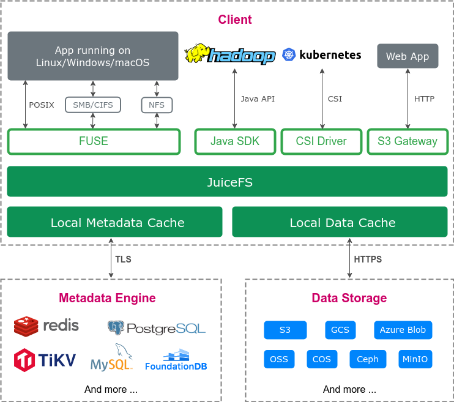
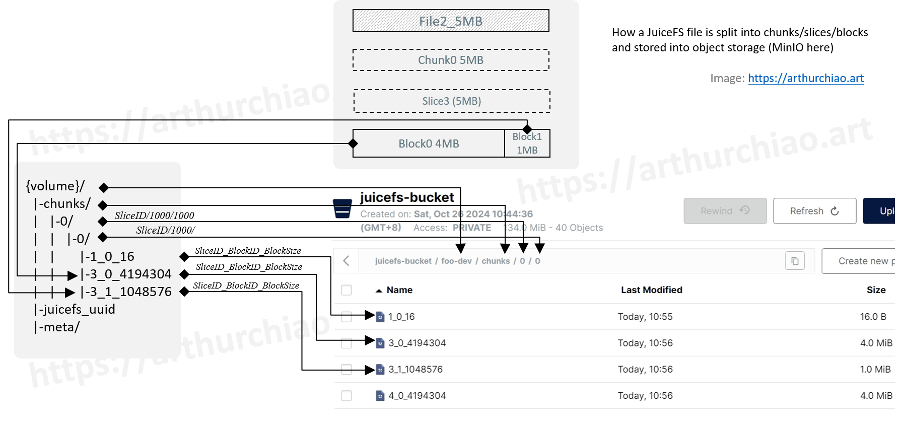
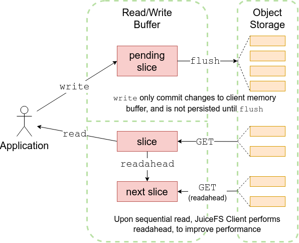
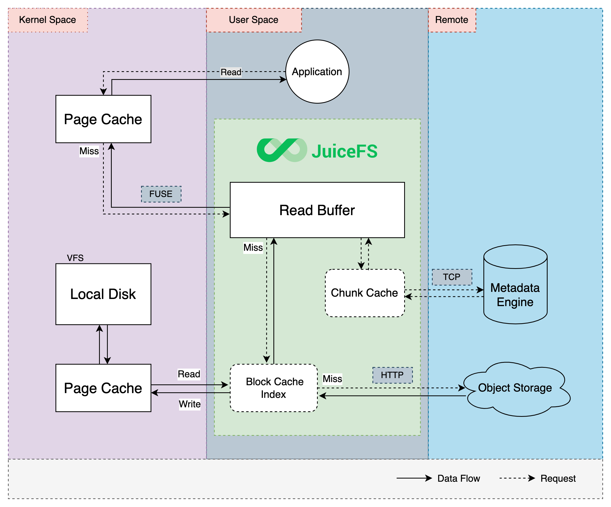

# JuiceFS

[toc]


特性：
- 元数据和数据分离
- 工具链和生态建设相对成熟，具备良好的 POSIX 兼容性和云原生支持（CSI）
- 支持平滑升级，在相同的挂载点再次挂载 JuiceFS 即可实现业务无感的客户端平滑升级
- 数据同步


JuiceFS 企业版，相比社区版它提供了更强的元数据引擎和缓存管理能力。

最大优势，提供 POSIX 协议，直接将应用的存储层，无感迁移到对象存储。


## 使用
```
# 使用你自己所使用的对象存储信息替换下方相关参数
juicefs format --storage oss \
    --bucket https://myjfs.oss-cn-shanghai.aliyuncs.com \
    --access-key ABCDEFGHIJKLMNopqXYZ \
    --secret-key ZYXwvutsrqpoNMLkJiHgfeDCBA \
    sqlite3://myjfs.db myjfs

juicefs mount -d "mysql://root:xx@(ip:port)/jfs" ./data

# 参数优化
juicefs mount --update-fstab --max-uploads=50 --writeback --cache-size 204800 

--update-fstab 启动时自动挂载 JuiceFS

--max-uploads=20 上传并发度，默认为 20。对于粒度为 4M 的写入模式，20 并发已经是很高的默认值，在这样的写入模式下，提高写并发往往需要伴随增大 --buffer-size

--writeback 后台异步上传对象，默认为 false。

--cache-size=102400 缓存对象的总大小；单位为 MiB (默认：102400, 100GB)。客户端读缓存

# 设置垃圾回收时间为0 day，节省空间。默认1day（对于一些应用而言，可能产生数倍，数十倍的数据膨胀）
juicefs config --trash-days=0  ./data


# chunk compact

juicefs compact  ./data

# 查看待 GC信息
juicefs gc "mysql://root:xx@(ip:port)/jfs"


# 清理过期数据
juicefs gc "mysql://root:xx@(ip:port)/jfs" --delete 


# bench

minios 部署在本地节点


juicefs bench -p 20  ./data                                     
Cleaning kernel cache, may ask for root privilege...
  Write big blocks: 20480/20480 [==============================================================]  1562.3/s  used: 13.109206213s
   Read big blocks: 20480/20480 [==============================================================]  4043.3/s  used: 5.065189582s 
Write small blocks: 2000/2000 [==============================================================]  118.9/s   used: 16.820229332s
 Read small blocks: 2000/2000 [==============================================================]  7652.0/s  used: 261.400043ms 
  Stat small files: 2000/2000 [==============================================================]  34748.4/s used: 57.60067ms   
Benchmark finished!
BlockSize: 1.0 MiB, BigFileSize: 1.0 GiB, SmallFileSize: 128 KiB, SmallFileCount: 100, NumThreads: 20
Time used: 52.6 s, CPU: 301.0%, Memory: 161.4 MiB
+------------------+-------------------+----------------+
|       ITEM       |       VALUE       |      COST      |
+------------------+-------------------+----------------+
|   Write big file |     1562.30 MiB/s |   13.11 s/file |
|    Read big file |     4043.78 MiB/s |    5.06 s/file |
| Write small file |     118.9 files/s | 168.20 ms/file |
|  Read small file |    7664.7 files/s |   2.61 ms/file |
|        Stat file |   34938.0 files/s |   0.57 ms/file |
|   FUSE operation | 363091 operations |     0.95 ms/op |
|      Update meta |  63635 operations |     3.73 ms/op |
|       Put object |   7120 operations |    86.75 ms/op |
|       Get object |      0 operations |     0.00 ms/op |
|    Delete object |   4920 operations |     2.06 ms/op |
| Write into cache |   7120 operations |    11.06 ms/op |
|  Read from cache |  19139 operations |    10.21 ms/op |
+------------------+-------------------+----------------+


```


Q & A 
使用 Docker bind mounts 把宿主机上的一个目录挂载到容器中时，权限问题

- 用 root 用户执行 juicefs mount 命令
- 或者在 FUSE 的配置文件，以及挂载命令中增加 allow_other 挂载选项。


数据膨胀？

配置回收时间 juicefs config --trash-days=0，在应用追加写，flush频繁时，可能产生大量的无效对象。连续写时（或者lsm-tree合并？），在原来的slice上修改，导致数据重复。


一致性，崩溃恢复？
juicefs 先写对象存储，后写元信息， 元信息也是事务，基本保证写入的一致性。
 --writeback  客户端缓存开启后，Slice flush 仅需写到本地缓存目录即可返回，数据由后台线程异步上传到对象存储。可能在本地磁盘损坏时，导致数据不一致。


元数据存储：

> 如果使用 redis 做 JuiceFS 元数据存储，按 redis 的运维实践经验，单个实例的内存控制在 32G 比较好，按 JuiceFS 设计的数据结构大约可以存 1亿 inodes，也就是每个 inode 大约消耗 300 bytes。 1亿 × 4MB = 100 M × 4MB = 400 PB ？还是过于理想


## 设计




**JuiceFS 客户端（Client）**：所有文件读写，以及碎片合并、回收站文件过期删除等后台任务，均在客户端中发生。客户端需要同时与对象存储和元数据引擎打交道。

客户端支持多种接入方式：

- **通过 FUSE，JuiceFS 文件系统能够以 POSIX 兼容的方式挂载到服务器，将海量云端存储直接当做本地存储来使用。**
- 通过 Hadoop Java SDK，JuiceFS 文件系统能够直接替代 HDFS，为 Hadoop 提供低成本的海量存储。
- 通过 Kubernetes CSI 驱动，JuiceFS 文件系统能够直接为 Kubernetes 提供海量存储。
- 通过 S3 网关，使用 S3 作为存储层的应用可直接接入，同时可使用 AWS CLI、s3cmd、MinIO client 等工具访问 JuiceFS 文件系统。
- 通过 WebDAV 服务，以 HTTP 协议，以类似 RESTful API 的方式接入 JuiceFS 并直接操作其中的文件。


**数据存储（Data Storage）**：文件将会被切分上传至对象存储服务。JuiceFS 支持几乎所有的公有云对象存储，同时也支持 OpenStack Swift、Ceph、MinIO 等私有化的对象存储。

**元数据引擎（Metadata Engine）**：用于存储文件元数据（metadata），包含以下内容：

- 常规文件系统的元数据：文件名、文件大小、权限信息、创建修改时间、目录结构、文件属性、符号链接、文件锁等。
- 文件数据的索引：文件的数据分配和引用计数、客户端会话等。


[元数据引擎性能测试](https://juicefs.com/docs/zh/community/metadata_engines_benchmark#golang-benchmark-1)


### JuiceFS 数据的设计，如何存储文件

Chunk、Slice、Block:

- Chunk: 每一个文件都由 1 或多个「Chunk」组成，每个 Chunk 最大 64M. Chunk 的存在是为了优化查找定位,实际的文件写入则在「Slice」上进行。（逻辑）
- Slice: Chunk 内的一次连续写入。一个 Slice 代表一次连续写入，隶属于某个 Chunk，并且不能跨越 Chunk 边界，因此 Slice 长度也不会超 64M。slice ID 是全局唯一的；
    - Slice 的重叠问题
        - 如果文件是由一次连贯的顺序写生成，那每个 Chunk 只包含一个 Slice
        - 如果文件是多次追加写，每次追加均调用 flush 触发写入上传，就会产生多个 Slice。
        - 每当写入发生时，客户端都会判断文件的碎片化情况，并异步地运行碎片合并，将一个 Chunk 内的所有 Slice 合并
    - 在对象存储中 slice 也没有对应实际文件
- Block:Slice 切分成固定大小 Block（e.g. 4MB）：并发读写对象存储
    - JuiceFS 将 Slice 进一步拆分成一个个「Block」（默认 4MB），多线程并发写入
    - 连续写：前面 Block 默认都是 4MB，最后一个 Block 剩多少是多少。
    - 追加写：数据不足 4MB 时，最终存入对象存储的也会是一个小于 4M 的 Block。



### 缓存

#### 元数据缓存

作为用户态文件系统，JuiceFS 元数据缓存既通过 FUSE API，以内核元数据缓存的形式进行管理，同时也直接在客户端内存中维护。

- 内核元数据缓存
    - JuiceFS 客户端挂载时，可以控制这些内核元数据缓存：文件属性（attribute，包含文件名、大小、权限、修改时间等信息）、文件项（entry 和 direntry，用来区分文件和目录类型的文件），默认1s
- 客户端内存元数据缓存 （默认不用）
    - 客户端在 open 操作即打开一个文件时，其文件属性会被自动缓存在客户端内存中，这里的属性缓存，不仅包含内核元数据中的文件属性比如文件大小、修改时间信息，还包含 JuiceFS 特有的属性，如文件和 chunk、slice 的对应关系
    - 「关闭再打开（close-to-open）」一致性，open 操作默认需要直接访问元数据引擎，不会利用缓存。

#### 读写缓冲区

读写缓冲区是分配给 JuiceFS 客户端进程的一块内存，通过 --buffer-size 控制着大小，默认 300（单位 MiB）。缓冲区是读写共用的，「写」具有更高的优先级。



预读和预取：
- 预读（readahead）：顺序读文件，在内核的预读之上，JuiceFS 客户端也会发起自己的预读，根据更激进的算法来“猜测”应用接下来要读取的数据范围，然后提前将对象存储对应的数据块下载下来
- 预取（prefetch）：随机读取文件某个块（Block）的一小段，客户端会异步将整个对象存储块下载下来。
    - prefetch 会带来明显的读放大，可以通过 --prefetch=0 禁用该行为


写入

- 显式调用 flush
- 当写入超过块大小（默认 4M），或者在缓冲区停留超过一定时间，触发自动 flush


#### 数据缓存

读请求会依次尝试内核分页缓存、JuiceFS 进程的预读缓冲区、本地磁盘缓存，当缓存中没找到对应数据时才会从对象存储读取，并且会异步写入各级缓存保证下一次访问的性能。




企业功能：[分布式缓存 cache group](https://juicefs.com/docs/zh/cloud/guide/distributed-cache) 

与本地缓存相比，分布式缓存将多个节点的本地缓存聚合成同一个缓存池，提高缓存的命中率。但由于分布式缓存增加了一次网络请求，这导致其在时延上通常稍高于本地缓存，分布式缓存随机读延迟一般是 1-2ms，而本地缓存随机读延迟一般是 0.2-0.5ms。


## 测试

类ES系统的数据目录，直接使用 juicefs，对象存储服务，元数据服务，位于本地时，（聚合）读、写性能基本损失微小。


## REF
- [docs: juicefs](https://juicefs.com/docs/zh/community/introduction/)

- [命令列表](https://juicefs.com/docs/zh/community/command_reference#admin)

- [architecture](https://juicefs.com/docs/zh/community/architecture/)

- [JuiceFS 对比 CephFS](https://juicefs.com/docs/zh/community/comparison/juicefs_vs_cephfs/)

    - 共同点:两者都是高可靠，高性能的弹性分布式文件系统，且均有良好的 POSIX 兼容性
    - 不同点:
        - CephFS,一套完整且独立的系统,所有数据和元数据都会持久化在 Ceph 自己的存储池（RADOS Pool）中
        - JuiceFS 主要实现一个 libjfs 库和 FUSE 客户端程序、Java SDK 等，支持对接多种元数据引擎和对象存储，适合在公有云、私有云或混合云环境下部署。
            - 大数据量下，基于各种分布式K/V引擎（TiKV等，支持事务）存储元信息（inodes）
            - 对象存储等服务存储数据


- [ClickHouse 存算分离架构探索](https://juicefs.com/zh-cn/blog/solutions/clickhouse-disaggregated-storage-and-compute-practice)
    - 冷热温，数据自动迁移

- [ount-data-storage-options 挂载选项](https://juicefs.com/docs/zh/community/command_reference/#mount-data-storage-options)


- [常见问题](https://juicefs.com/docs/zh/community/administration/troubleshooting)

- [直观解读 JuiceFS 的数据和元数据设计（一）：看山是山](https://arthurchiao.art/blog/juicefs-data-metadata-design-illustrative-guide-1-zh/)
- [直观解读 JuiceFS 的数据和元数据设计（二）：看山不是山](https://arthurchiao.art/blog/juicefs-data-metadata-design-illustrative-guide-2-zh/)
- [直观解读 JuiceFS 的数据和元数据设计（三）：看山还是山](https://arthurchiao.art/blog/juicefs-data-metadata-design-illustrative-guide-3-zh/)


- [JuiceFS 读写请求处理流程](https://juicefs.com/docs/zh/community/internals/io_processing/)
    - 写：
        - 在处理写请求时，JuiceFS 先将数据写入 Client 的内存缓冲区，并在其中按 Chunk/Slice 的形式进行管理。
        - Chunk 是根据文件内 offset 按 64 MiB 大小拆分的连续逻辑单元，不同 Chunk 之间完全隔离。
        - 每个 Chunk 内会根据应用写请求的实际情况进一步拆分成 Slice；
        - 当新的写请求与已有的 Slice 连续或有重叠时，会直接在该 Slice 上进行更新，否则就创建新的 Slice。
        - Slice 是启动数据持久化的逻辑单元，其在 flush 时会先将数据按照默认 4 MiB 大小拆分成一个或多个连续的 Block，并作为最小单元上传到对象存储；然后再更新一次元数据，写入新的 Slice 信息。  
    - 读：
        - JuiceFS 支持顺序读和随机读（包括基于 mmap 的随机读）
            - 在处理读请求时会通过对象存储的 GetObject 接口完整读取 Block 对应的对象，也有可能仅仅读取对象中一定范围的数据（比如通过 S3 API 的 Range 参数限定读取范围）。
        - 与此同时异步地进行预读（通过 --prefetch 参数控制预读并发度），预读会将整个对象存储块下载到本地缓存目录，以备后用（如指标图中的第 2 阶段，blockcache 有很高的写入带宽）。显然，在顺序读时，这些提前获取的数据都会被后续的请求访问到，缓存命中率非常高，因此也能充分发挥出对象存储的读取性能。
        - 对于大文件随机读场景，预读的用途可能不大，反而容易因为读放大和本地缓存的频繁写入与驱逐使得系统资源的实际利用率降低。
            - 此时可以考虑用 --prefetch=0 禁用预读。
            - 或者直接禁用缓存（--cache-size=0），并尽可能提高对象存储的读取性能。