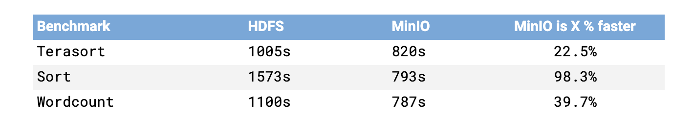
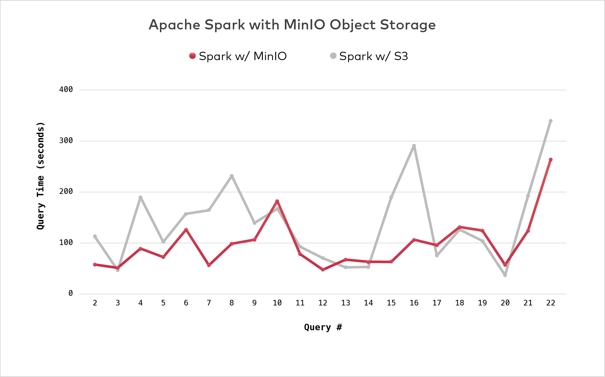
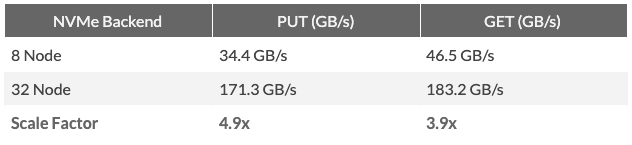
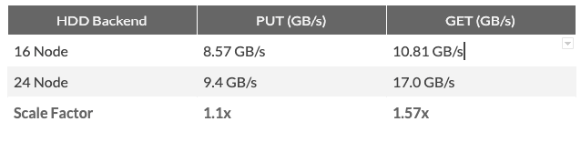

# 对象存储

## 概念

对象存储是一种存储架构，用于处理非结构化数据。它以对象为单位来存储数据，每个对象包括数据本身（即实际的内容）、元数据（描述数据的信息）以及一个全局唯一的标识符。

对象存储系统通常用于存储图片、音频、视频、备份文件等大量的非结构化数据。
这种存储方式与传统的文件存储和块存储有显著的不同。文件存储以文件系统为基础，数据被组织在文件夹中，而块存储则将数据存储在固定大小的块中，这些块可以被随机读写。对象存储则更加灵活，可以更容易地扩展，并且适合存储大量的数据。

对象存储系统，一般使用纠删码机制而非副本，可以利用多节点，多磁盘提供更高的可靠性。


## AWS S3（Simple Storage Service）


## CubeFS

CubeFS（中文“储宝”）是一个开源云原生文件存储系统，由云原生计算基金会（CNCF）托管作为孵化项目。

CubeFS 可以用作数据中心文件系统、数据湖存储基础设施以及私有或混合云存储。特别是，CubeFS 实现了数据库和 AI/ML 应用程序的存储/计算架构的分离。

特性：

- POSIX、HDFS、S3等多种访问协议以及自带的REST API
- 高度可扩展、强一致性的元数据服务
- 大/小文件和顺序/随机写入的性能优化
- 多租户支持，具有更好的资源利用率和租户隔离
- 通过多级缓存实现混合云 I/O 加速
- 灵活的存储策略、高性能复制或低成本擦除编码


### REF

- [github: cubefs](https://github.com/cubefs/cubefs)


## MinIO

MinIO 是一个高性能、S3 兼容的对象存储，在 GNU AGPLv3 许可证下开源。
号称可用的最快的对象存储。

特性：

- 通过复制和纠删码机制，保护数据免受节点故障影响，确保数据持久性和可用性。
    - 避免 3 副本冗余存储
    - MinIO 通过按对象的内联擦除编码来保护数据，该编码以汇编代码编写，以提供尽可能高的性能。 MinIO 使用 Reed-Solomon 代码将对象条带化为数据和奇偶校验块 - 尽管这些块可以配置为任何所需的冗余级别。

- S3 Select API
  - MinIO 开发了 S3 Select API 的 SIMD 加速版本，本质上是直接嵌入到对象存储中的 SQL 查询功能。用户可以对其对象执行 SELECT 查询，并检索对象的相关子集，而不必下载整个对象。借助 S3 Select API，应用程序现在可以仅下载满足给定 SELECT 查询的对象的特定子集。通过减少带宽需求、优化计算和内存资源，这可以直接转化为效率和性能，这意味着可以使用相同的计算资源并行运行更多作业。随着工作完成得更快，分析师和领域专家的利用率就会更高。此功能适用于 CSV、JSON 和 Parquet 格式的对象，并且对压缩对象也有效。

- BitRot Protection 位腐烂保护
  - MinIO 的 SIMD 加速实现 HighwayHash 算法可确保它永远不会返回损坏的数据 - 它可以即时捕获并修复损坏的对象。

- Encryption
  - 使用 AES-256-GCM、ChaCha20-Poly1305 和 AES-CBC 支持服务器端和客户端加密。
  - 使用密钥管理系统 (KMS) 或加密密钥管理系统 (CKMS) 来支持 SSE-S3

- 存储桶和对象的不变性
- 存储桶和对象版本控制
- 可扩展性
  - MinIO 通过服务器池横向扩展。每个服务器池都是一组独立的节点，拥有自己的计算、网络和存储资源。在多租户配置中，每个租户都是单个命名空间中的服务器池集群，与其他租户的服务器池完全隔离。
- 备份
  -  MinIO 的连续复制功能支持主动-主动复制、主动-被动复制以及备份和灾难恢复用途
  - 使用近同步复制在存储桶上发生任何变化后立即更新对象。

- 元数据架构
  - MinIO 没有单独的元数据存储。所有操作均以对象级粒度以原子方式执行，具有强一致性。

- Sidekick负载平衡
  - 作为一个小型 sidecar 进程与每个客户端应用程序一起运行。这样，应用程序就可以直接与服务器通信，而无需额外的物理跃点。

场景：
- 图片、音视频对象
- 不可变数据文件，日志文件


docker-compose启动

```docker-compose.yaml
version: "3"
services:
  minio:
    container_name: minio
    image: quay.io/minio/minio:latest
    restart: always
    ports:
      - '19000:9000'
      - '19001:9001'
    volumes:
      - ./data:/data
    command: server /data --console-address ":9001"

```

mc 客户端
```
# myminio 创建的对象存储服务 别名
# list buckets and objects
mc ls myminio 

```


技术文档，详细见源码 docs 的设计


性能：

什么使MinIO更快？

- 只提供对象。没有将对象附加到文件或块体系结构上。多层会导致复杂性。复杂性导致延迟。
- 不使用元数据数据库。对象和元数据通过单个原子操作一起写入。其他方法具有多个步骤，并且多个步骤会导致延迟。
- SIMD（单指令多数据）加速
- 将Go +汇编语言结合起来，通过针对任务执行C类性能

对比 hdfs




对比S3



NVMe和HDD对比



- 单个NVMe驱动器的最大持续吞吐量为读取〜3.5 GB /秒，写入〜2.5 GB /秒。这实际上意味着只需要4个NVMe驱动器即可饱和16个PCIe 2.0通道（最大16x PCIe 2.0带宽为8GB /秒）
    - 读写线性扩展



- HDD驱动器，最大持续单个硬盘驱动器的吞吐量〜两个250 MB /秒读取和写入。要使16个PCIe 2.0通道达到饱和，需要大约32个HDD以最高性能同时工作。
    - 16增加到24: 读取性能几乎呈线性增长。写入性能的提高少于线性的，可能是由于基准测试驱动器上的巨大负载导致随机I/O增加。


如何设计的查找对象？

- 扁平化命名空间
  - MinIO 使用扁平的命名空间来存储对象，而不是传统的目录结构。每个对象都有一个唯一的键（Key），这个键直接映射到存储位置。这种设计避免了复杂的目录遍历，提升了查找效率。
  - “/” 模拟结构化层次

-  分布式哈希表（DHT）
  - MinIO 使用分布式哈希表（DHT）来管理对象的元数据和位置信息。每个对象的键通过哈希算法映射到特定的节点，查询时只需计算哈希值即可快速定位对象所在的节点。

- 元数据嵌入对象
  - MinIO 将元数据（如对象名称、大小、创建时间等）直接嵌入到对象中，而不是存储在单独的元数据数据库中。读取对象时，元数据会随对象一起加载，减少了额外的元数据查询开销。

- 内存缓存
  - 使用内存缓存来存储热点对象的元数据和位置信息，避免频繁的磁盘访问

- 对象分片
  - 对于大对象，MinIO 会将其分片存储在不同的节点上，查找时可以通过并行读取分片来加速访问。


### REF

- [minio/minio](https://github.com/minio/minio)
- [docs zh](https://www.minio.org.cn/docs/minio/container/index.html)

- [mc client](https://min.io/docs/minio/linux/reference/minio-mc.html#quickstart)

- [概念](https://www.minio.org.cn/docs/minio/container/administration/concepts.html)

- [官方基准测试](https://resources.minio.org.cn/?cid=2) （2019）

- [minio/warp](https://github.com/minio/warp) 基准测试tool

- [minio:blogs](https://blog.min.io/tag/benchmarks/)

- [打破 HDFS 速度障碍——对象存储的首创](https://blog.minio.org.cn/hdfsbenchmark)
    - hdfs 计算和数据同时放置在同一节点上，克服了网络对数据访问缓慢的限制,每个数据节点的容量限制为最大100 TB
        - 对象存储使用密度更高的存储服务器，Cisco UCS S3260存储服务器或Seagate Exos AP 4U100。这些服务器每台服务器以及100 GbE网卡可以容纳超过PB的可用容量。


## seaweedfs

[seaweedfs](https://github.com/seaweedfs/seaweedfs)


## 支持面向对象存储的系统

- presto 借助 Hive 连接器，读取和写入存储在 S3 上的表
    - trino 增加 s3 文件系统支持


## REF


- [[VLDB'22] CloudJump: 存储层上云优化](http://47.241.45.216/2023/01/01/VLDB-22-CloudJump-optimizing-cloud-databases-for-cloud-storages/)


- [CubeFS 文件系统架构 设计及应用｜Data Infra 研究社第20期](https://www.bilibili.com/video/BV1XCafe8ECS/)
