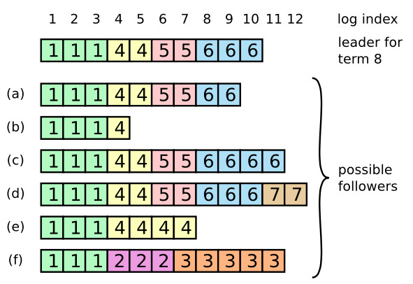

# Raft笔记

[toc]

## 1.Raft是什么？

Raft 是一种为了**管理复制日志**的**一致性算法**。

不同于Paxos算法直接从分布式一致性问题出发推导出来，Raft算法则是从**多副本状态机**的角度提出，用于管理多副本状态机的日志复制。

组成模块：

1. Leader选举（Leader election）
2. 日志同步（Log replication）
3. 安全性（Safety）
4. 日志压缩（Log compaction）
5. 成员变更（Membership change）等

Raft算法使用了**更强的假设**来减少了需要考虑的状态，使之变的易于理解和实现。

#### 1.1 复制（副本）状态机（Replicated State Machine）

复制状态机：一组服务器上的状态机产生相同状态的副本，并且在一些机器宕掉的情况下也可以继续运行。

复制状态机在分布式系统中被用于解决**容错**的问题，使用一个独立的的复制状态机去管理大规模系统的领导选举和存储配置信息并且在领导人宕机的情况下能够正常对外服务，如chubby，zookeeper。

复制状态机通常都是基于**复制日志**实现的，每一个服务器存储一个包含一系列指令的日志，并且按照日志的顺序进行执，相同的日志和执行顺序保证了每个状态机的一致。

使用一致性算法用来保证日志的相同，一致性算法的特性：

- 安全性保证（绝对不会返回一个错误的结果）：在非拜占庭错误情况下，包括网络延迟、分区、丢
  包、冗余和乱序等错误都可以保证正确。  
- 可用性：集群中只要有大多数的机器可运行并且能够相互通信、和客户端通信，就可以保证可用。
  因此，一个典型的包含 5 个节点的集群可以容忍两个节点的失败。服务器被停止就认为是失败。他
  们当有稳定的存储的时候可以从状态中恢复回来并重新加入集群。  
- 不依赖时序来保证一致性：物理时钟错误或者极端的消息延迟只有在最坏情况下才会导致可用性问
  题。  
- 通常情况下，一条指令可以尽可能快的在集群中大多数节点响应一轮远程过程调用时完成。小部分
  比较慢的节点不会影响系统整体的性能。  

#### 1.2 Raft作者认为Paxos的缺点

- 可理解性，单决策 Paxos 算法不够直观，构成多决策 Paxos 增加了很多错综复杂的规则。
- 缺乏标准的实现，实践的系统，与paxos结构不一致。在Paxos算法描述和实现现实系统中间有着巨大的鸿沟。最终的系统建立在一种没有经过证明的算法之上。  

#### 1.3 Raft的动机

- 一个完整的现实系统基础实现

- 任何情况下都是安全的，大多数情况下是可用的

- 操作是高效的

- 最重要的**可理解性**，以便根据现实需求对Raft进行扩展。

  如何达到可理解性：

  - 问题分解，分解为可被解决的、可解释的和可理解的子问题（leader选举问题，日志同步问题，安全信证明）
  - 削减状态空间数量，减少状态空间。例如限制日志不允许存在空洞paxos允许，限制日志间的不一致状态的可能；使用**随机化方法**（随机的超时时间），简化leader选举，虽然增加了不确定性。

## 2.Raft中的角色和作用

- **Leader**：接受所有客户端请求，并向Follower同步请求日志，当日志同步到大多数节点上后告诉Follower提交日志。
- **Follower**：接受并持久化Leader同步的日志，在Leader告知日志可以提交之后，提交日志。绝大多数的服务器在大多数时间下都处于跟随者的状态，这些服务器完全处于被动状态，它们不会发起任何 RPC 调用，它们所做的只是对其他服务器发起的 RPC 调用做出响应。
- **Candidate**：它是处于领导者（Leader）与跟随者（Follower）之间的一种状态，它在只在选举新领导者的过程中临时出现。在系统处于普通状态下，只会有一个领导者，其他的服务器都是跟随者。

## 3.Raft是否可能存在多个leader？若存在，有什么影响？

任意一个term最多一个真正的leader，在网络分裂的情况下可能存在多个leader。

不影响一致性，由于分区情况下，即使是leader，在无法达成多数派同意时，无法提交日志。

## 4. Raft中角色的变化关系

Follower响应其他服务器的请求。如果Follower超时没有收到Leader的消息，它会成为一个Candidate并且开始一次Leader选举。收到大多数服务器投票的Candidate会成为新的Leader。Leader在宕机之前会一直保持Leader的状态。

## 5.Raft概念和具体协议

#### 5.1 状态（State）：

所有服务器上的持久性状态
(在响应RPC请求之前,已经更新到了稳定的存储设备)

| 参数        | 解释                                                         |
| ----------- | ------------------------------------------------------------ |
| currentTerm | 服务器已知最新的任期（在服务器首次启动的时候初始化为0，单调递增） |
| votedFor    | 当前任期内收到选票的候选者id 如果没有投给任何候选者 则为空   |
| log[]       | 日志条目;每个条目包含了**用于状态机的命令**，以及领导者接收到该条目时的**任期**（第一个索引为1） |

所有服务器上的易失性状态

| 参数        | 解释                                                         |
| ----------- | ------------------------------------------------------------ |
| commitIndex | 已知**已提交**的最高的日志条目的索引（初始值为0，单调递增）  |
| lastApplied | 已经被**应用**到状态机的最高的日志条目的索引（初始值为0，单调递增） |

领导者（服务器）上的易失性状态
(**选举后已经重新初始化**)

| 参数         | 解释                                                         |
| ------------ | ------------------------------------------------------------ |
| nextIndex[]  | 对于每一台服务器，发送到该服务器的下一个日志条目的索引（初始值为领导者最后的日志条目的索引+1） |
| matchIndex[] | 对于每一台服务器，已知的已经复制到该服务器的最高日志条目的索引（初始值为0，单调递增） |

#### 5.2 追加条目RPC（AppendEntries RPC）

被**领导者调用**，用于日志条目的复制，同时也被当做**心跳**使用

参数：

| 参数         | 解释                                                         |
| ------------ | ------------------------------------------------------------ |
| term         | 领导者的任期                                                 |
| leaderId     | 领导者ID 因此跟随者可以对客户端进行重定向（译者注：跟随者根据领导者id把客户端的请求重定向到领导者，比如有时客户端把请求发给了跟随者而不是领导者） |
| prevLogIndex | 紧邻新日志条目之前的那个日志条目的索引                       |
| prevLogTerm  | 紧邻新日志条目之前的那个日志条目的任期                       |
| entries[]    | 需要被保存的日志条目（被当做心跳使用是 则日志条目内容为空；为了提高效率可能一次性发送多个） |
| leaderCommit | 领导者的已知已提交的最高的日志条目的索引                     |

结果

| 返回值  | 解释                                                         |
| ------- | ------------------------------------------------------------ |
| term    | 当前任期,对于领导者而言 它会更新自己的任期                   |
| success | 结果为真 如果跟随者所含有的条目和preLogIndex以及preLogTerm匹配上了 |

接收者的实现：

1. 返回假 如果领导者的任期 < 接收者的当前任期（译者注：这里的接收者是指跟随者或者候选者）（原文5.1 节）

   ***这里可以忽略旧leader发送的rpc调用和接收到的新条目***

2. 返回假 如果接收者日志中没有包含这样一个条目 即该条目的任期在preLogIndex上能和prevLogTerm匹配上
   （译者注：在接收者日志中 如果能找到一个和preLogIndex以及prevLogTerm一样的索引和任期的日志条目 则返回真 否则返回假）（原文5.3 节）

   *确保追加的日志，之前的状态和leader日志信息一致。*

3. 如果一个已经存在的条目和新条目（译者注：即刚刚接收到的日志条目）发生了冲突（因为索引相同，任期不同），那么就删除这个已经存在的条目以及它之后的所有条目 （原文5.3 节）

   ***删除本地的日志条目与leader发送的日志条目冲突的日志，应用新收到的日志信息，可能相同，是在发生了leader重新选举，leader需要重新发送未提交的日志***

4. 追加日志中尚未存在的任何新条目

5. 如果领导者的已知已经提交的最高的日志条目的索引 > 接收者的已知已经提交的最高的日志条目的索引 
   则把 接收者的已知已经提交的最高的日志条目的索引 重置为 领导者的已知已经提交的最高的日志条目的索引 或者是 上一个新条目的索引 取两者的最小值

   ***Follower的已知的已提交的日志索引信息更新***

#### 5.3 请求投票 RPC（RequestVote RPC）

由候选人负责调用用来征集选票（5.2 节）

| 参数         | 解释                         |
| ------------ | ---------------------------- |
| term         | 候选人的任期号               |
| candidateId  | 请求选票的候选人的 Id        |
| lastLogIndex | 候选人的最后日志条目的索引值 |
| lastLogTerm  | 候选人最后日志条目的任期号   |

| 返回值      | 解释                                       |
| ----------- | ------------------------------------------ |
| term        | 当前任期号，以便于候选人去更新自己的任期号 |
| voteGranted | 候选人赢得了此张选票时为真                 |

接收者实现：

1. 如果`term < currentTerm`返回 false （原文5.2 节）
2. 如果 votedFor 为空或者为 candidateId，并且候选人的日志至少和自己一样新，那么就投票给他（原文5.2 节，原文5.4 节）

#### 5.4 所有服务器需遵守的规则

所有服务器：

* 如果`commitIndex > lastApplied`，那么就 lastApplied 加一，并把`log[lastApplied]`应用到状态机中（原文5.3 节）

  ***安全应用已提交日志到状态机***

* 如果接收到的 RPC 请求或响应中，任期号`T > currentTerm`，那么就令 currentTerm 等于 T，并切换状态为跟随者（原文5.1 节）

  ***Leader切换为Follower的情形：发生分区后，分区内的节点term+1，另一个分区的leader仍然保持leader身份，当前term不变，接收到新rpc请求（选主或分区内节点选出新主后的同步日志）***

跟随者（原文5.2 节）：

* 响应来自候选人和领导者的请求
* 如果在超过选举超时时间的情况之前没有收到**当前领导人**（即该领导人的任期需与这个跟随者的当前任期相同）的心跳/附加日志，或者是给某个候选人投了票，就自己变成候选人

候选人（原文5.2 节）：

* 在转变成候选人后就立即开始选举过程
  * 自增当前的任期号（currentTerm）
  * 给自己投票
  * 重置选举超时计时器
  * 发送请求投票的 RPC 给其他所有服务器
* 如果接收到大多数服务器的选票，那么就变成领导人
* 如果接收到来自新的领导人的附加日志 RPC，转变成跟随者
* 如果选举过程超时，再次发起一轮选举

领导人：

* 一旦成为领导人：发送空的附加日志 RPC（心跳）给其他所有的服务器；在一定的空余时间之后不停的重复发送，以阻止跟随者超时（原文5.2 节）

* 如果接收到来自客户端的请求：附加条目到本地日志中，在条目被应用到状态机后响应客户端（原文5.3 节）

* 如果对于一个跟随者，最后日志条目的索引值大于等于 nextIndex，那么：发送从 nextIndex 开始的所有日志条目：
  * 如果成功：更新相应跟随者的 nextIndex 和 matchIndex
  
  * 如果因为日志不一致而失败，减少 nextIndex 重试
  
    ***这里需要减少nextIndex是？？见8.3节叙述***
  
* 如果存在一个满足`N > commitIndex`的 N，并且大多数的`matchIndex[i] ≥ N`成立，并且`log[N].term == currentTerm`成立，那么令 commitIndex 等于这个 N （原文5.3 和 原文5.4 节）

  ***日志已经同步到大多数节点，并且是当前term，日志可提交***

  

  #### 5.5 Raft特性

  

| 特性             | 解释                                                         |
| ---------------- | ------------------------------------------------------------ |
| 选举安全特性     | 对于一个给定的任期号，最多只会有一个领导人被选举出来（原文5.2 节） |
| 领导人只附加原则 | 领导人绝对不会删除或者覆盖自己的日志，只会增加（原文5.3 节，注：对于可能被覆盖的候选者，不会被选择为leader） |
| 日志匹配原则     | 如果两个日志在相同的索引位置的日志条目的任期号相同，那么我们就认为这个日志从头到这个索引位置之间全部完全相同（原文5.3 节） |
| 领导人完全特性   | 如果某个日志条目在某个任期号中已经被提交，那么这个条目必然出现在更大任期号的所有领导人中（原文5.4 节，注：即不存在的节点不会选为leader） |
| 状态机安全特性   | 如果一个领导人已经将给定的索引值位置的日志条目应用到状态机中，那么其他任何的服务器在这个索引位置不会应用一个不同的日志（原文5.4.3 节） |

## 6. 任期（Terms）的概念

在Raft中时间被划分为一个个递增的任期，作为逻辑时钟。每个任期，长度任意，包含选举（election），以及若成功选举出leader后的普通操作时间两个部分，选举失败即进入下一个任期。

注意：

- 每个任期最多有一个leader即任期可能没有leader，若系统同时存在多个leader，则一定在不同的任期
- 每个服务节点会维持当前的任期值，与接收到的消息的任期进行比较，若自身过期，将更新自己的任期
- 候选人或者领导者发现自己的任期号过期，将变成follower
- 节点收到的过期消息，将直接拒绝 

## 7.Leader选举

Raft 使用一种心跳机制来触发领导人选举。

初始化启动，所有节点启动角色都是follower。

leader周期性的向所有follower发送心跳包维持租约，保证自己是leader。

 follower继续保持着跟随者状态只要他从领导人或者候选者处接收到有效的 RPCs；如果一个跟随者在一段时
间里没有接收到任何消息，也就是**选举超时**，讲发起选举以选出新的领导者。  

 选举的过程：

- follower先要增加自己的当前任期号并且转换到候选人状态 
- 并行向其他服务器节点发送请求投票的RPCs为自己投票，可能的情形：
  - 自己赢得选举：从大多数节点获取到了同一个任期的选票
    - 每个服务器每个任期，最多投一张选票，先来先服务（FIFS）原则
    - 成为leader后，将发送心跳给其他节点，建立自己的权威
  - 其他服务器成为leader
    - 等待投票过程，从其他服务器收到他是leader的追加条目RPCs，且任期号不小于自身的任期，将自己转为follower状态，否则继续维持候选人状态
  - 一段时间（固定150ms-300ms区间的随机值），没有任何人获胜
    - 多个follower同时成为候选者
    - 增加当前任期号，随机重试，开始新一轮选举

> 注意，此时的Leader选举还不够完善，需要参考9.1节

## 8. 日志复制

客户端请求，执行指令，Leader将指令作为一条新的日志附加到日志文件，然后并行发起追加日志条目的RPCs给其他服务器，复制这条日志条目，当这条日志条目被安全复制，leader应用日志到状态机中，然后返回执行结果。

#### 8.1 日志的匹配特性

- 如果在不同的日志（不同服务器上的日志）中的两个条目拥有**相同的索引和任期号**，那么他们存储了相同的指令。  

  怎么保证？***Leader最多在一个任期里在指定的一个日志索引位置创建一条日志条目，同时日志条目在日志中的位置也从来不会改变。***

- 如果在不同的日志中的两个条目拥有相同的索引和任期号，那么他们之前的所有日志条目也全部相同。  

  保证：***追加日志条目的RPCs，会校验之前的日志索引位置和任期是否符合追加日志条目的之前索引和任期是否符合，不符合拒绝。那么，由数据归纳法可证，特性成立。***

#### 8.2 什么情况下，追加日志条目的RPCs的校验日志一致性不通过？

Leader崩溃，以及follower跟着崩溃情况加剧。

Follower 可能丢失新Leader的日志条目，或拥有新Leader没有的日志，或者都发生。丢失或者多出日志条目可能会持续多个任期。

>当一个领导人成功当选时，跟随者可能是任何情况（a-f）。每一个盒子表示是一个日志条目；里面的数字表示任期号。跟随者可能会缺少一些日志条目（a-b），可能会有一些未被提交的日志条目（c-d），或者两种情况都存在（e-f）。
>
>例如，场景 f 可能会这样发生，某服务器在任期2 的时候是领导人，已附加了一些日志条目到自己的日志中，但在提交之前就崩溃了；很快这个机器就被重启了，在任期 3 重新被选为领导人，并且又增加了一些日志条目到自己的日志中；在任期 2 和任期 3 的日志被提交之前，这个服务器又宕机了，并且在接下来的几个任期里一直处于宕机状态。  

#### 8.3 日志不一致的处理？

Leader处理不一致是通过强制跟随者直接复制自己的日志来解决，即follower扔掉自己的日志。

领导人必须找到最后两者达成一致的地方，然后删除从那个点之后的所有日志条目，发送自己的日志给跟随者。  

领导人针对每一个跟随者维护了一个 **nextIndex**，这表示下一个需要发送给跟随者的日志条目的索引地址。  当一个领导人刚获得权力的时候，他初始化所有的 nextIndex 值为自己的最后一条日志的 index 加 1 ，如果一个跟随者的日志和领导人不一致，那么在下一次的附加日志RPC 时的一致性检查就会失败。在**被跟随者拒绝之后，领导人就会减小 nextIndex 值并进行重试**。最终nextIndex 会在某个位置使得领导人和跟随者的日志达成一致。  这时就会把跟随者冲突的日志条目全部删除并且加上领导人的日志。一旦附加日志 RPC 成功，那么跟随者的日志就会和领导人保持一致，并且在接下来的任期里一直继续保持。  

而**领导人从来不会覆盖或者删除自己的日志**。

## 9. 安全性

现在的机制，仍然存在的问题：

> *一个跟随者可能会进入不可用状态同时领导人已经提交了若干的日志条目，然后这个跟随者可能会被选举为领导人并且覆盖这些日志条目。*导致不同的状态机可能会执行不同的指令序列。  

这个问题的解决，是在选举Leader时，增加限制条件，这一限制保证了任何的领导人对于给定的任期号，都拥有了之前任期的所有被提交的日志条目。  

#### 9.1 Leader选举的限制条件

Raft 使用投票的方式来阻止一个候选人赢得选举除非这个候选人包含了所有已经提交的日志条目。

请求投票 RPC 实现了这样的限制：**RPC 中包含了候选人的日志信息，然后投票人会拒绝掉那些日志没有自己新的投票请求。**  

候选人为了赢得选举必须联系集群中的大部分节点，这意味着每一个已经提交的日志条目在这些服务器节点中肯定存在于至少一个节点上。如果候选人的日志至少和大多数的服务器节点一样新，那么他一定持有了所有已经提交的日志条目。（离散数学XD）

新的判断：

- Raft 通过比较两份日志中最后一条日志条目的索引值和任期号定义谁的日志比较新。 
- 如果两份日志最后的条目的任期号不同，那么任期号大的日志更加新。如果两份日志最后的条目任期号相同，那么日志比较长的那个就更加新。   

#### 9.2 日志的提交时机

> 领导人知道一条当前任期内的日志记录是可以被提交的，只要它被存储到了大多数的服务器上。如果一个领导人在提交日志条目之前崩溃了，未来后续的领导人会继续尝试复制这条日志记录。  
>
> 然而，一个领导人不能断定一个之前任期里的日志条目被保存到大多数服务器上的时候就一定已经提交了,如下图所示被大多数同步的日志，仍然可能被覆盖。

> 如图的时间序列展示了为什么领导人无法决定对老任期号的日志条目进行提交。在 (a) 中，S1 是领导者，部分的复制了索引位置 2 的日志条目。在 (b) 中，S1 崩溃了，然后 S5 在任期 3 里通过 S3、S4 和自己的选票赢得选举，然后从客户端接收了一条不一样的日志条目放在了索引 2 处。然后到 (c)，S5 又崩溃了；S1 重新启动，选举成功，开始复制日志。在这时，来自任期 2 的那条日志已经被复制到了集群中的大多数机器上，但是还没有被提交。
>
> 如果 S1 在 (d) 中又崩溃了，S5 可以重新被选举成功（通过来自 S2，S3 和 S4 的选票），然后覆盖了他们在索引 2 处的日志。反之，如果在崩溃之前，S1 把自己主导的新任期里产生的日志条目复制到了大多数机器上，就如 (e) 中那样，那么在后面任期里面这些新的日志条目就会被提交（因为 S5 就不可能选举成功）。 这样在同一时刻就同时保证了，之前的所有老的日志条目就会被提交。

**Raft 永远不会通过计算副本数目的方式去提交一个之前任期内的日志条目。**只有领导人**当前任期里的日志条目**通过计算副本数目可以被提交**；一旦当前任期的日志条目以这种方式被提交，那么由于日志匹配特性，之前的日志条目也都会被间接的提交。**在某些情况下，领导人可以安全的知道一个老的日志条目是否已经被提交（例如，该条目是否存储到所有服务器上），但是 Raft 为了简化问题使用一种更加保守的方法。

即，之前任期未提交的时候的日志，必须等到当前任期的日志一起提交。

##### Leader如何知道已提交的日志？

Raft 中通过领导人在任期开始的时候提交一个空白的没有任何操作的日志条目到日志中去来实现。  

#### 9.3 Leader的完全特性证明

> **反证法**。
>
> 假设任期 T 的领导人（领导人 T）在任期内提交了一条日志条目，但是这条日志条目没有被存储到未来某个任期的领导人的日志中。
>
> 设大于 T 的最小任期 U 的领导人 U 没有这条日志条目。  

> 图：如果 S1 （任期 T 的领导者）提交了一条新的日志在它的任期里，然后 S5 在之后的任期 U 里被选举为领导人，然后至少会有一个机器，如 S3，既拥有来自 S1 的日志，也给 S5 投票了。

1. 在领导人 U 选举的时候一定没有那条被提交的日志条目（领导人从不会删除或者覆盖任何条目）。
2. 领导人 T 复制这条日志条目给集群中的大多数节点，同时，领导人 U 从集群中的大多数节点赢得了选票。因此，至少有一个节点（投票者、选民）同时接受了来自领导人 T 的日志条目，并且给领导人 U 投票了，如上图所示。这个投票者是产生这个矛盾的关键。
3. 这个投票者必须在给领导人 U 投票之前先接受了从领导人 T 发来的已经被提交的日志条目；否则他就会拒绝来自领导人 T 的附加日志请求（因为此时他的任期号会比 T 大）。
4. 投票者在给领导人 U 投票时依然保存有这条日志条目，因为任何中间的领导人都包含该日志条目（根据上述的假设），领导人从不会删除条目，并且跟随者只有在和领导人冲突的时候才会删除条目。
5. 投票者把自己选票投给领导人 U 时，领导人 U 的日志必须和投票者自己一样新。这就导致了两者矛盾之一。
6. 首先，如果投票者和领导人 U 的最后一条日志的任期号相同，那么领导人 U 的日志至少和投票者一样长，所以领导人 U 的日志一定包含所有投票者的日志。这是另一处矛盾，因为投票者包含了那条已经被提交的日志条目，但是在上述的假设里，领导人 U 是不包含的。
7. 除此之外，领导人 U 的最后一条日志的任期号就必须比投票人大了。此外，他也比 T 大，因为投票人的最后一条日志的任期号至少和 T 一样大（他包含了来自任期 T 的已提交的日志）。创建了领导人 U 最后一条日志的之前领导人一定已经包含了那条被提交的日志（根据上述假设，领导人 U 是第一个不包含该日志条目的领导人）。所以，根据日志匹配特性，领导人 U 一定也包含那条被提交的日志，这里产生矛盾。
8. 这里完成了矛盾。因此，所有比 T 大的领导人一定包含了所有来自 T 的已经被提交的日志。
9. **日志匹配原则保证了未来的领导人也同时会包含被间接提交的条目**。

#### 9.4 跟随者和候选人崩溃  

如果跟随者或者候选人崩溃了，那么后续发送给他们的 RPCs 都会失败。Raft 中处理这种失败就是简单的通过无限的重试，直至机器重启成功。

如果服务器在完成了一个 RPC，但是还没有响应的时候崩溃了，那么在他重新启动之后就会再次收到同样的请求。Raft 的 RPCs 都是**幂等**的，所以这样重试不会造成任何问题  。

#### 9.5 时间和可用性  

Raft的安全性不依赖时间：整个系统不能因为某些事件运行的比预期快一点或者慢一点
就产生了错误的结果。  

可用性依赖时间，需要足够的时间选举，过长的选举时间，导致无法快速检测异常，快速恢复。

> 广播时间（broadcastTime）  <<  选举超时时间（electionTimeout） <<  平均故障间隔时间（MTBF）
>
> 广播时间大约是 0.5 毫秒到 20 毫秒，取决于存储的技术  
>
> 选举超时时间可能需要在 10 毫秒到 500 毫秒之间
>
> 平均故障间隔时间在几个月甚至更长

## 10. 如何处理集群成员的变化

> 通常我们不能接受，**服务停机**和手动**操作失误**的风险，需要自动化配置的改变。

> **直接从一种配置转到新的配置是十分不安全的。**集群配额从 3 台机器变成了 5 台。存在这样的一个时间点，两个不同的领导人在同一个任期里都可以被选举成功。一个是通过旧的配置，一个通过新的配置。  

Raft解决方法——过渡配置（共同一致）：集群先切换到一个过渡的配置（共同一致），一旦共同一致已经被提交了，那么系统就切换到新的配置上 。

* 日志条目被复制给集群中新、老配置的所有服务器。
* 新、旧配置的服务器都可以成为领导人。
* 达成一致（针对选举和提交）**需要分别在两种配置上获得大多数的支持**。

集群配置在复制日志中以特殊的日志条目来存储和通信 。

注：当服务器确认当前领导人存在时，服务器会忽略请求投票 RPCs。特别的，当服务器在当前最小选举超时时间内收到一个请求投票 RPC，他不会更新当前的任期号或者投出选票。

## 11. 日志压缩

常见日志压缩方式，快照：整个系统的状态都以快照的形式写入到稳定的持久化存储中，然后到那个时间点之前的日志全部丢弃。

每个服务器独立的创建快照，只包括已经被提交的日志。主要的工作包括将状态机的状态写入到快照中。Raft 也包含一些少量的元数据到快照中：**最后被包含索引**指的是被快照取代的最后的条目在日志中的索引值（状态机最后应用的日志），**最后被包含的任期**指的是该条目的任期号。保留这些数据是为了支持快照后紧接着的第一个条目的附加日志请求时的一致性检查。

Leader可能发送自己的快照信息给Follower，如果日志落后过多，leader已经合并的日志。

为什么不用快照，代替日志？

发送快照会浪费网络带宽并且延缓了快照处理的时间，本地根据日志生成快照更合适。

 

## 12. 客户端交互

Raft 中的客户端发送所有请求给领导人，确定leader是随机挑选一个服务器，通过该服务器告知leader位置，leader崩溃，重复该过程。  

#### 12.1 线性化语义实现

线性化语义：每一次操作立即执行，只执行一次，在他调用和收到回复之间。

> 问题：如果领导人在提交了这条日志之后，但是在响应客户端之前崩溃了，那么客户端会和新的领导人重试这条指令，导致这条命令就被再次执行了。

解决方案就是客户端对于每一条指令都赋予一个**唯一的序列号**。然后，状态机跟踪每条指令最新的序列号和相应的响应。如果接收到一条指令，它的序列号已经被执行了，那么就立即返回结果，而不重新执行指令。  

#### 12.2只读操作的线性化保障

> Leader直接处理只读操作的问题：Leader响应时leader身份作废，出现脏数据。 

- 领导人必须有关于被提交日志的最新信息。  

  Raft 中通过领导人在任期开始的时候提交一个空白的没有任何操作的日志条目。  

- 领导人在处理只读的请求之前必须检查自己是否已经被废黜了 。

  Raft 中通过让领导人在响应只读请求之前，先和集群中的大多数节点交换一次心跳信息来处理这个问题。  

## 13. 性能

#### 13.1 选举过程的收敛速度

只需要在选举超时时间上使用很少的随机化就可以大大避免选票被瓜分 。

通过增加 50 毫秒的随机化时间，最坏的完成情况（1000 次尝试）只要 513 毫秒  

#### 13.2 leader宕机后，最小系统宕机时间

通过减少选举超时时间可以减少系统的宕机时间。在选举超时时间为 12-24 毫秒的情况下，只需要平均 35 毫秒就可以选举出新的领导人（最长的一次花费了 152 毫秒） 。

 建议： 150-300 毫秒  

## 14. 与其他一致性协议的优势

与paxos区别：强leader特性

> 注意Leader选举与基本的一致性协议是正交的：领导人选举仅仅是性能优化的手段，而且不是
> 一致性所必须要求的  

与VR，Zookeeper区别：虽然都是强Leader，但是Raft 比 VR 和 ZooKeeper 拥有更少的机制因为 Raft 尽可能的减少了非领导人的功能。

## 参考资料

1.官网https://raft.github.io/（raft模拟器）

2.中文[翻译地址](https://github.com/maemual/raft-zh_cn/blob/master/raft-zh_cn.md)

3.[Raft 实现日志复制同步](https://www.cnblogs.com/richaaaard/p/6351705.html)(原作者的slide解析文章)

4.[Paxos、Raft分布式一致性最佳实践](https://www.zhihu.com/column/paxos)
