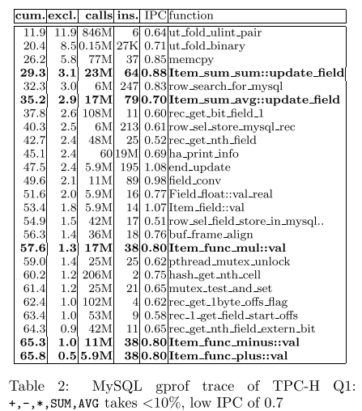
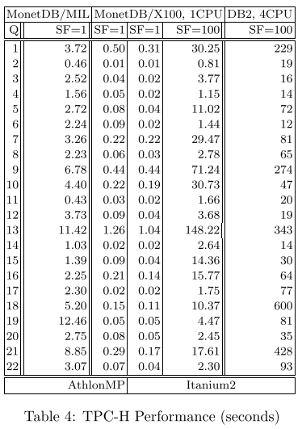
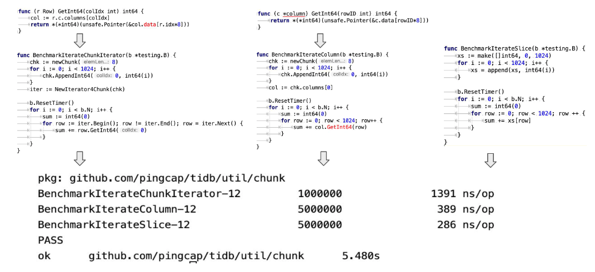
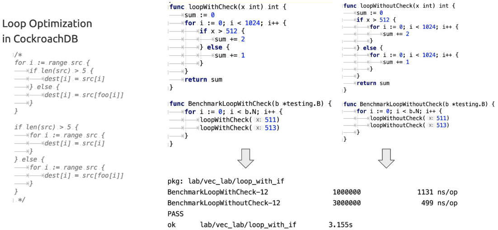

# 向量化执行

## 1. 概念

**Vectorized Execution** 向量化执行

- 最早使用在monetDB， 和商业版本VectorWise；Quickstep
- 与火山式迭代模型一样，矢量化使用基于**拉**的迭代，但是每次next调用都会获取一个元组块而不是一个元组，这会分摊迭代器调用开销
  - 解释执行
- 在实际的查询处理过程中，往往会在一个或多个具体类型（静态类型）列上执行原语操作（一批，按列执行），例如计算一个integer vector的hash值
- 使用code generation（代码生成）技术来解决静态类型带来的code explosion（代码爆炸）问题
  - 生成各种类型的计算原语，例如ADD (int , int)，ADD(int , long)


**Compiled / data-centric code generation  execution** 编译执行、代码生成

- 思想：减少需要执行的指令，让通用的代码变得专用
- （数据库中）HyPer开创，支持的系统Spark，Peloton，apache drill
- 每个关系运算符实现基于**推送**的接口（produce和consume）
  - produce和consume不是直接处理元组，而是为给定查询生成代码
  - 类似，深度遍历查询计划树，在第一次访问时调用produce，在处理完所有子项后在上次访问时使用consume
- 生成的代码具体化用于查询的特定数据类型，并将非阻塞关系运算符管道中的所有运算符融合到单个（可能是嵌套的）循环中。
  - 然后将该生成的代码编译为有效的机器代码（例如，LLVM的IR）
    - 预先编译，将大量虚函数调用，非确定性寻址，多个operator合并编译成一个可执行机器code，指令可pipeline执行
      - 代价：编译开销 ms级
    - LLVM 提供IR，最终被后端编译成优化过的机器码


## 2. 基本原理

主要参考论文：

[Everything You Always Wanted to Know About Compiled and Vectorized Queries But Were Afraid to Ask](https://www.vldb.org/pvldb/vol11/p2209-kersten.pdf)


### 2.1 Vectorized Execution

向量化执行的主要原理是在按列组织的数据上批量执行。

通过批量操作，分摊数据库解释执行的开销。

**hash join**

- `probeHash_` 表达式为每个joinkey列，调用一个原语来对joinkey列进行散列，并将散列写入输出vector
  - 原语操作，对单列，多列需要多次调用，取交集？
- 连接函数，使用该vector从hashtable中生成候选位置
- 然后，`compareKeys_`检查所有候选位置是否相等
  - `compareKeys_` 是build side的joinkey？


**SIMD指令集**

> AVX512 指令集，每个周期可以执行两个 512 位 SIMD 操作。
>
> 使用 AVX-512 每个周期可以处理 32 个 32 位的值，而标量代码限制为每个周期 4 个值。效率提升8倍。


**SIMD对选择和hash探测的影响:**

- 选择
  - 实现：
    - 比较指令生成一个掩码，将其传递给压缩存储 (COMPRESSSTORE) 指令，跨 SIMD 通道工作，并将掩码选择的位置写入内存
  - 基准测试，8k的int32，恰好装进L1的数据缓存，单个小于常量的过滤，性能提升8.4倍
    - 与simd指令自身效率符合预期，完美利用了simd
  - 但是在具有多个过滤条件时（Q6， 4个selections），只获得了1.4倍的加速
    - 
    - 原因：
      - 选择向量导致的稀疏数据加载
        - 除第一个选择原语外，后续的选择原语都需要从不连续的内存中搜集，导致整体性能不到8倍而是接近3倍（40%的选择性下）
      - 步幅太大导致的缓存未命中
        - 步幅：经过过滤后，需要的数据的内存块的间隔，随着选择率降低而增大
        - 由于大部分时间都在等待内存数据，导致 SIMD 指令作用下降
        - 
          - 可以看出随着选择率变大，l1-miss 的时钟周期数降低
          - l1 cache miss 占总的时钟周期很高
          - 完全扫描时，simd比标量计算使用的时钟周期少的优势，更明显。在50%选择率时，基本一致了，更低反而略有下降。
  
- 散列连接探测
  - 应用simd
    - 计算hash值
      - Murmur2，由算术运算组成
    - 在hashTable中查找
      - 使用收集、压缩存储和掩码应用于对哈希表的查找
      - 
        - hash可以提升2.3x
        - 收集1.1x
        - 总体join提升1.4x
        - 而在tpc-h测试集上提升几乎为0（10%）
          - 随着工作集的增长，执行成本主要由内存延迟决定， **SIMD仅在所有数据都适合缓存时才有用**
          - （也即，类似于计算引擎再快，而被底层扫描文件block了，整体性能还是没有多少提升）


- 单独的编译器的自动向量化，也几乎不会产生任何收益


TODO：自适应查询执行


### 2.2 Compiled Execution

编译执行的主要原理是为SQL查询生成低级代码，将查询管道的所有相邻非阻塞运算符融合到一个紧密循环中。


**hash join**

将其中一个输入的所有元组放进hash表中，多个join条件时，多列生成组合key。

探测时，对另一张表，同样使用该方法，生成key。


**并行性**

- VectorWise使用Exchange 算子，查询处理运算符（如聚合和连接）不感知并行性
  - 7.2X 提升
- HyPer 使用morsel-driven 并行性，连接和聚合使用共享哈希表，并明确感知并行性
  -  能够实现更好的局部性、负载平衡以及可扩展性
  - 11.7x 提升


- Tectorwise实现morsel-driven：
  - 为每个worker创建执行算子和资源，并且算子可以创建公式状态的实例，以进行通信
    - 如共享hash table
  - pipeline breaking 算子，强制执行子任务的全局顺序。hash table构建完毕后才能探测


实验结果：

- Q1,Q3,Q9 加速比，提升8，9倍
- Q6受内存带宽限制
- Q18受写入带宽限制
- 超线程（10*2）后，加速比更加接近
- 总结：扩展性都很好，都可以充分支持并行化


关于SIMD 扩展材料：

- [Rethinking SIMD Vectorization for In-Memory Databases - 论文笔记](https://zhuanlan.zhihu.com/p/432895054)
- [Rethinking SIMD Vectorization for In-Memory Databases 论文阅读笔记](https://github.com/rsy56640/paper-reading/tree/master/%E6%95%B0%E6%8D%AE%E5%BA%93/content/Rethinking%20SIMD%20Vectorization%20for%20In-Memory%20Databases) 


TODO：基于push 、 pull的编译


### 2.3 Vectorized vs Compiled 

> Tectorwise 执行的指令明显更多（高达 2.4 倍）并且通常有更多的 L1 数据缓存未命中（高达 3.3 倍

Vectorized Execution将所有操作分解为简单的步骤，并且必须在这些步骤之间实现中间结果，从而产生额外的指令和缓存访问。

Compiled Execution通常可以将中间结果保存在 CPU 寄存器中，从而以更少的指令执行相同的操作


> 对于较大的数据（和哈希表）大小，Tectorwise 的连接优势增加了 40%
>
> 向量化在隐藏缓存未命中延迟方面更好，Tectorwise 的哈希表探测代码只是一个简单的循环，只执行哈希表探测，因此 CPU 的乱序引擎可以提前推测并生成许多未完成的负载，减少CPU 停止等待内存的周期数。（hash计算，hash表无法完全装载进cpu cache，产生缓存未命中，因此，对于重连接的查询，向量化表现更好）
>
> Typer 的代码有更复杂的循环，每个循环可以包含用于扫描、选择、哈希表探测、聚合等的代码，每个 CPU 的乱序窗口会更快地被复杂的循环填满，因此它们产生的未完成负载更少。


>  Tectorwise 通常执行更多每周期指令 (IPC)，比Typer高出40%, 但是在tpc-h q1上性能慢了Typer 74%，因为执行的指令是2倍。IPC反映了Tectorwise 的提供了cpu利用率，但是并不一定会提高性能。


OLAP性能方面

- **计算**：编译执行更擅长，将数据保存在寄存器中，需要执行的指令更少
  - 编译代码，一次性处理所有列的谓词，而向量化一批只能处理一列的谓词，多列的谓词时需要多次处理，所以指令更多。
- **并行数据访问**：向量化执行在生成并行缓存未命中方面稍好一些，在访问大型哈希表以进行聚合或连接的内存绑定查询中具有一些优势
- **SIMD**：收益很小，因为大多数操作都受内存访问成本的支配
- **并行化**：矢量化引擎和基于编译的引擎都可以在多核 CPU 上很好地扩展
- **硬件平台**：不占主导地位
  - arm，intel

其他

- 编译
  - OLTP，可以创建快速存储过程
  - 语言支持，可以无缝集成用不同语言编写的代码
- 向量化
  - 编译时间，原语是预编译的
  - profiling分析，运行时可以归属于原语
  - 适应性，执行原语可以mid-fligh（飞行途中？）交换


**简单总结：**

向量化和编译执行，两种执行引擎性能差异一般不大，基于编译的引擎在计算量大的查询中具有优势，而向量化引擎更擅长隐藏缓存未命中延迟，例如hash连接。


TODO：

编译执行与向量化执行是正交的，可以融合在一起。例如Impala。


编译和矢量化的结合，能够获得更好的结果，编译应该与按块的查询项结合。

“循环编译”（将查询的核心编译成一个循环，在元组上进行迭代）技术可能不如普通矢量化，因为

-  (i) SIMD 对齐
- (ii) 避免分支错误预测的能力
-  (iii)并行内存访问

这时应该将编译拆分为多个循环，实现中间向量化结果。


## 3.原型系统/论文

### 3.1 MonetDB/X100

**动机**：

数据库系统在现代CPU上的IPC（每周期指令数）很低的原因。

研究内容：

- 基于tpc-h测试集分析，分析查询处理器的设计准则
- 基于准则设计了MonetDB/X100
  - 基于向量化的执行，tpc-h 100G提升了1-2个数量级（X100）

**Introduction**

- 现代CPU支持并行计算的能力
  - 流水线（指令并行）
  - 超标量（硬件资源复制）
- 数据库系统在现代CPU上的IPC（每周期指令数）很低
  - 10% 的真正有效工作研究
    - 消耗在其他组件（事务，加锁等）功能完成
  - 执行本身的低效，未能利用CPU的并行性
    - 架构本身，迭代器模型Volcano原因，解释执行开销
  - 具体测试商业DBMS   IPC为0.7，而科学计算（矩阵乘法）可以达到 2.
- MonetDB/MIL 系统在算子之间对全列数据做物化，受到内存带宽的严重限制, 导致 CPU 效率急剧下降. 
  - 全列数据量超过CPU cache大小，因此受限与内存带宽
  - MonetDB/X100 实际是对 tuple-at-a-time 和 column-at-a-time 的折中，减少Volcano迭代额外开销，又利用CPU cache。

- CPU 性能提升原理
  - 频率提升得益于工艺改进，晶体管延迟减小，每条指令可以在更短的时钟周期完成（纵向）
  - 流水线技术，将 CPU 指令的工作划分为更多阶段，使单位时间完成指令数更多（横向）
    - 但是近来也已经无法提升再细分下去了（2004年，Pentium4 已经有 31 个流水线级）
    - 单核瓶颈，转向多核
  - 流水线的缺点
    -  如果一条指令需要前一条指令的结果，则不能在它之后立即将其推入流水线，而必须等到第一条指令通过流水线
      - 指令乱序执行，可以改善利用空闲流水
    - 分支预测失败问题（if-else），丢弃管道所有治疗，重新开始，导致浪费 数十个CPU时钟周期

- CPU 执行的所有指令中约有 30% 是内存加载和存储
  - 因此只有数据在CPU的缓存时，CPU才能以其最大吞吐量运行，否则只能空等
    - 访问内存 50ns  = 180 cycle  in 3.6 Ghz

**TPC-H分析**

Q1:

```sql
SELECT l_returnflag
	,l_linestatus
	,sum(l_quantity) AS sum_qty
	,sum(l_extendedprice) AS sum_base_price
	,sum(l_extendedprice * (1 - l_discount)) AS sum_disc_price
	,sum(l_extendedprice * (1 - l_discount) * (1 + l_tax)) AS sum_charge
	,avg(l_quantity) AS avg_qty
	,avg(l_extendedprice) AS avg_price
	,avg(l_discount) AS avg_disc
	,count(*) AS count_order
FROM lineitem
WHERE l_shipdate <= DATE '1998-12-01' - interval '[DELTA]' day(3)
GROUP BY l_returnflag
	,l_linestatus
ORDER BY l_returnflag
	,l_linestatus;
```

- project有大量的表达式计算
  - 两个列与常量的减法，一个列与常量的加法、三个列与列的乘法
    - 子表达式消除，可以消除一个减法
  - 八个聚合：四个 SUM、三个 AVG和一个 COUNT
    - 子表达式消除，可以消除3个AVG（sum/count 来代替）
- 选择条件过滤很差, 对于 6M 的 lineitem 行, 过滤后还有 5.9M

- Group by 分组结果很少(4组)， 可以使用 hash table可以完全放在在 CPU cache 中
  - 对两个单字符列分组

表达式解释执行结果

- 第一列是第二列的累计和
- 第二列表示占总执行时间的百分比
- 第三列表示调用次数
- 第四列表示每次调用的平均指令数
- 第四列表示每次调用的IPC（每时钟周期完成指令数）



结果分析：

- 粗体表示的5个表达式计算操作，低于总执行时间的 10%
- IPC低于1，最低为0.7
- 28% 的执行时间被用于聚合的哈希表中的创建和查找
- 剩余的 62% 的执行时间
  - 主要分布在像`rec get nth field`的函数，字段拷贝和输出上
  - `pthread mutex unlock, mutex_test_and_set`,缓冲区分配等只起次要作用

- `Item func mul::val` 用了38个指令/ 0.8 = 49 个时钟周期 
  - 而MIPS处理器理论上可以平均每3个周期完成一次`*(double,double)`, 与理论值慢了10X以上
    - 可能的解释，没有循环流水线，4个操作需要相互等待，平均指令延迟为 5 个周期，产生20个周期成本
    - 其余的 49 个周期用于跳入routine，以及压入和弹出堆栈

（其他系统类似）

MonetDB MIL，完全列存运算的结果：

- 带宽 (BW)（以 MB/s 为单位）
- SF=0.001 时，数据可以完全放到CPU缓存
- MIL statement是20个函数调用完成query1功能


分析：

- SF=1，MonetDB 带宽卡在 500MB/s，达到硬件瓶颈
- SF=0.001，可以完全在CPU 缓存中运行时，带宽可以达到 1.5GB/s 以上

避免了元组一次解释开销占据90%时间，但是由于cpu无法完全cache，导致CPU性能受限与内存带宽。

同时，要大量的磁盘，来维持磁盘IO带宽需要满足内存的1.5GB/s。 


基线性能：手写UDF，硬编码实现，可以降到0.22s， 而monetdb/MIL 需要3.72s， monetdb/x100 需要0.5s 


**X100向量化执行引擎**

- 列式存储在磁盘
  - 1MB块
  - 不可变，增量更新
  - 
- 列式内存格式（可能使用压缩）
  - 1000 作为一个向量操作单元
- 基于cache处理
  - 显式的内存加载数据到cpu缓存，cpu缓存写到内存
- 提供CPU向量化原语
  - 例如project，agg等运算
  - 提供为整个表达式子树而不是单个函数编译矢量化原语工具（编译执行的思想）
    - 复合原语，效率更高2X以上，基于CPU寄存器传递计算数据，比load/store更快
  - 向量大小固定，能够允许C 编译器应用激进的循环流水线（TODO 理解背后）
- SQL
  - 允许使用一个表达式生成的向量作为另一个表达式的输入，而数据在 CPU 缓存中
- 向量化的计算原语的执行
  - selection 数组，选择向量，避免复制到新的连续块
  -  每个执行原语只针对特定类型的定长列数组做计算，不关心对 tuple 的解析或者列的类型
  - 原语模版生成了数百个向量化原语
  - 避免在原语中使用分支

query1向量化执行例子，可以参考[知乎-卡比卡比的翻译](https://zhuanlan.zhihu.com/p/430203013)

**实验结果**

- 每个时钟周期指令数IPC没有再统计（why？）每个函数平均时钟周期数，很低。乘法每个元组2.2个周期处理，而mysql需要49个周期。
- 带宽很高，原语处理的大部分数据来自 CPU 缓存中的向量


与DB2官方结果的比较（硬件环境有一点差别，但是monetdb 综合基本一致或者更差）



- 1k-4k 的大小基本性能最好，超过8k的向量大小*40B，超高跟L1，L2的总缓存大小320KB后性能迅速下降

### 3.2 Hyper

[Efficiently Compiling Efficient Query Plans for Modern Hardware](https://15721.courses.cs.cmu.edu/spring2019/papers/19-compilation/p539-neumann.pdf)


### 3.3 Vectorization vs. Compilation

[Vectorization vs. Compilation in Query Execution](https://15721.courses.cs.cmu.edu/spring2016/papers/p5-sompolski.pdf)


**Introduction**

- 数据库声明式查询语言的灵活性，通常使用解释执行引擎，遵循迭代器模型Volcano，基于pull遍历算子树
  - 表达式同时也是需要解释执行


## 4.实现

支持 向量化执行的系统：

- 数据库OLTP
  - polardb-x
  - cockroachdb
  - tidb
- OLAP
  - impala
  - spark
  - StarRocks


### 4.1 TiDB/CRDB

行存格式迭代，列存格式迭代和原始硬编码（slice结构）性能对比：



If指令的开销（2X，即使没有分支预测失败）：



CRDB:

```golang
// Vec is an interface that represents a column vector that's accessible by
// Go native types.
type Vec interface {
	// Type returns the type of data stored in this Vec. Consider whether
	// CanonicalTypeFamily() should be used instead.
	Type() *types.T
	// CanonicalTypeFamily returns the canonical type family of data stored in
	// this Vec.
	CanonicalTypeFamily() types.Family
	// IsBytesLike returns true if this data is stored with a flat bytes
	// representation.
	IsBytesLike() bool

	// Bool returns a bool list.
	Bool() Bools
	// Int16 returns an int16 slice.
	Int16() Int16s
	// Int32 returns an int32 slice.
	Int32() Int32s
	// Int64 returns an int64 slice.
	Int64() 
}

// memColumn is a simple pass-through implementation of Vec that just casts
// a generic interface{} to the proper type when requested.
type memColumn struct {
	t                   *types.T
	canonicalTypeFamily types.Family
	col                 Column
	nulls               Nulls
}

func (m *memColumn) Bool() Bools {
	return m.col.(Bools)
}
func (m *memColumn) Int16() Int16s {
	return m.col.(Int16s) // Int16s is a slice of int16.  => type Int16s []int16

}
func (m *memColumn) Int32() Int32s {
	return m.col.(Int32s)
}
func (m *memColumn) Int64() Int64s {
	return m.col.(Int64s)
}

// 批，多个Vec的集合
// Batch is the type that columnar operators receive and produce. It
// represents a set of column vectors (partial data columns) as well as
// metadata about a batch, like the selection vector (which rows in the column
// batch are selected).
type Batch interface {
	// Length returns the number of values in the columns in the batch.
	Length() int
	// SetLength sets the number of values in the columns in the batch. Note
	// that if the selection vector will be set or updated on the batch, it must
	// be set **before** setting the length.
	SetLength(int)
	// ColVec returns the ith Vec in this batch.
	ColVec(i int) Vec
	// ColVecs returns all of the underlying Vecs in this batch.
	ColVecs() []Vec
	// Selection, if not nil, returns the selection vector on this batch: a
	// densely-packed list of the *increasing* indices in each column that have
	// not been filtered out by a previous step.
	Selection() []int
	// SetSelection sets whether this batch is using its selection vector or not.
	SetSelection(bool)
	// AppendCol appends the given Vec to this batch.
	AppendCol(Vec)
	// ReplaceCol replaces the current Vec at the provided index with the
	// provided Vec. The original and the replacement vectors *must* be of the
	// same type.
}

type MemBatch struct {
	// length is the length of batch or sel in tuples.
	length int
	// capacity is the maximum number of tuples that can be stored in this
	// MemBatch.
	capacity int
	// b is the slice of columns in this batch.
	b []Vec
	// bytesVecIdxs stores the indices of all vectors of Bytes type in b. Bytes
	// vectors require special handling, so rather than iterating over all
	// vectors and checking whether they are of Bytes type we store this slice
	// separately.
	bytesVecIdxs util.FastIntSet
	useSel       bool
	// sel is - if useSel is true - a selection vector from upstream. A
	// selection vector is a list of selected tuple indices in this memBatch's
	// columns (tuples for which indices are not in sel are considered to be
	// "not present").
	sel []int
}
//pkg/sql/colexec/colexecsel/selection_ops.eg.go
// 模板生成的vec计算算子的定义
type selLTInt64Int16Op struct {
	selOpBase
}
// int64 < int16 的Vec vec计算
func (p *selLTInt64Int16Op) Next() coldata.Batch {
	// In order to inline the templated code of overloads, we need to have a
	// `_overloadHelper` local variable of type `execgen.OverloadHelper`.
	_overloadHelper := p.overloadHelper
	// However, the scratch is not used in all of the selection operators, so
	// we add this to go around "unused" error.
	_ = _overloadHelper
  // 迭代所有的batch
	for {
		batch := p.Input.Next()
		if batch.Length() == 0 {
			return batch
		}
		// 获取要计算的列
		vec1 := batch.ColVec(p.col1Idx)
		vec2 := batch.ColVec(p.col2Idx)
		col1 := vec1.Int64()
		col2 := vec2.Int16()
		n := batch.Length()

		var idx int
    // 检查是否存在null值
		if vec1.MaybeHasNulls() || vec2.MaybeHasNulls() {
			nulls := vec1.Nulls().Or(vec2.Nulls())
			if sel := batch.Selection(); sel != nil {
				sel = sel[:n]
				for _, i := range sel {
          // 需要先判断对应位置是否为null
					if nulls.NullAt(i) {
						continue
					}
					var cmp bool
					arg1 := col1.Get(i)
					arg2 := col2.Get(i)

          // ...
        }
      }
    }
  }
  else { // 无null值
    	// 检查是否有selection
			if sel := batch.Selection(); sel != nil {
				sel = sel[:n]
        // 基于selection 进行计算
				for _, i := range sel {
					var cmp bool
					arg1 := col1.Get(i)
					arg2 := col2.Get(i)
					{
						var cmpResult int
						{
							a, b := int64(arg1), int64(arg2)
							if a < b {
								cmpResult = -1
							} else if a > b {
								cmpResult = 1
							} else {
								cmpResult = 0
							}
						}

						cmp = cmpResult < 0
					}
					// 收集满足 < 的offset
					if cmp {
						sel[idx] = i
						idx++
					}
				}// end for
			} // end if 
    else {
      // 创建selection
      batch.SetSelection(true)
			sel := batch.Selection()
    }
    if idx > 0 {
			batch.SetLength(idx)
			return batch
		}
}
```

不足：

- 只有少量的表达式支持向量化
  - `pkg/sql/colexec/xxx_tmpl.go` 定义了表达式模板
- SQL任何存在非向量化的表达式时，都将导致整个计划无法向量化
- 不支持并行执行


**向量化的join执行**

- Merge Join
  - probe阶段： 计算join key vec 匹配 offset ，按值
  - matrializing 阶段：
    - Left  *  len(right)  => left Col
    - Right  * len(left) => right Col


## REF

论文：

- [MonetDB/X100: Hyper-Pipelining Query Execution](http://cidrdb.org/cidr2005/papers/P19.pdf)
  - [论文翻译、笔记-知乎-卡比卡比](https://zhuanlan.zhihu.com/p/430203013)
- [Vectorization vs. Compilation in Query Execution](https://15721.courses.cs.cmu.edu/spring2016/papers/p5-sompolski.pdf)
- [Everything You Always Wanted to Know About Compiled and Vectorized Queries But Were Afraid to Ask](https://www.vldb.org/pvldb/vol11/p2209-kersten.pdf)
- [Efficiently Compiling Efficient Query Plans for Modern Hardware](https://15721.courses.cs.cmu.edu/spring2019/papers/19-compilation/p539-neumann.pdf)
  - [论文阅读-知乎-platoneko](https://zhuanlan.zhihu.com/p/430211068)
- Materialization Strategies in a Column-Oriented DBMS
- Rethinking SIMD Vectorization for In-Memory Databases
- Breaking the Memory Wall in MonetDB
- Relaxed Operator Fusion for In-Memory Databases: Making Compilation, Vectorization, and Prefetching Work Together At Last


扩展材料：

- [十分钟成为 Contributor 系列 | 助力 TiDB 表达式计算性能提升 10 倍](https://pingcap.com/zh/blog/10mins-become-contributor-of-tidb-20190916)
  - 为函数实现`vectorized()` 和 `vecEvalXType()` 按chunk进行处理，并输出结果，支持向量化执行表达式（表达式中所有的函数都执行向量化(2+6)*3，即MultiplyInt， PlusInt都需要实现向量化方法）
- [十分钟成为 Contributor 系列 | TiDB 向量化表达式活动第二弹](https://zhuanlan.zhihu.com/p/85553472) 
- [[面向guard编程系列] 2. 一元guard的使用： 一个避免静态代码爆炸的C++ idiom，用于OLAP向量化执行引擎的开发](https://zhuanlan.zhihu.com/p/338241036) 
  - C++ 代码生成，向量化执行的代码，guard 审计合法的类型
- [数据库计算引擎的优化技术：向量化执行与代码生成](https://zhuanlan.zhihu.com/p/100933389) 
- [每次都需要解释大量指令？使用 PolarDB-X 向量化引擎](https://zhuanlan.zhihu.com/p/354572485)
  - 2021.10.20 开源：[ApsaraDB](https://github.com/ApsaraDB)/**[galaxysql](https://github.com/ApsaraDB/galaxysql)**
  - （与Pandora-matrix实现类似）
  - batch ，vector，selection数据结构
    - selection数组用于延迟物化，避免每次过滤后，直接在原vector上操作，重新拷贝数据
  - 向量化原语
  - 短路求值
    - case when
- [PolarDB-X 向量化引擎的类型绑定与代码生成](https://zhuanlan.zhihu.com/p/357520668) 
  - 上下文构建
    - 确定表达式的输入输出类型，分配原语
    - 为原语分配向量
    - 原语代码生成
  - 处理
    - 表达式绑定
      - 表达式树前序遍历，函数签名，实例化向量化原语
    - 静态类型系统
      - 自顶向下的表达式类型推导
    - 代码模板
- [cockroachdb:how-we-built-a-vectorized-execution-engine](https://www.cockroachlabs.com/blog/how-we-built-a-vectorized-execution-engine/)
  - 底层存储是kv，非列式，OLTP数据库
  - 在磁盘读取行后，转换为批的列存数据格式，再输入到向量化执行引擎
  - 使用代码生成来减轻向量化执行引擎的维护负担
    - 向量化执行后，分析性能瓶颈在类型转换，类型断言开销上，因此改进是通过代码生成具体类型（不手写重复代码，使用模板，go不支持泛型），提升2倍。（代码量膨胀。rust零成本抽象呢，编译后，知道使用具体的类型，某些方面可能更容易达到高性能，而无需代码生成？宏？）
    - 批处理+模板化代码，比原来提升5.5
    - 进一步优化，多层循环，更改循环顺序，影响
      - 分支预测
      - 流水线
    - 最终提升20倍。基准测试cpu时间提升70倍，tpch测试提升4倍（磁盘时间占比最大，降低了整体的加速比）
  - (该文章包含golang pprof 分析过程)
- [slides: Vectorized Query Execution in Apache Spark at Facebook](https://databricks.com/session/vectorized-query-execution-in-apache-spark-at-facebook) 2019
  - vector at a time + whole stage CodeGen
  - 提升8x的读10M 行单列的表
  - 提升3.5x的读写10M 行单列的表
- [查询编译综述](https://zhuanlan.zhihu.com/p/60965109)

- [rsy56640 - 论文笔记 - Query](https://github.com/rsy56640/paper-reading/blob/master/%E6%95%B0%E6%8D%AE%E5%BA%93/README.md#index)

- [slides: CRDB/TIDB vectorized exectution](https://github.com/qw4990/blog/blob/master/database/slides/CRDBVectorizedExecution.pdf)


相关课程：

- [MIT 6.172: Performance Engineering of Software Systems (Fall 2018)](https://ocw.mit.edu/courses/electrical-engineering-and-computer-science/6-172-performance-engineering-of-software-systems-fall-2018)
  - [【MIT公开课】6.172 软件性能工程 · 2018年秋](https://www.bilibili.com/video/BV1wA411h7N7/) B站


