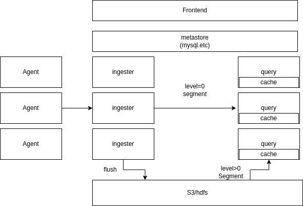
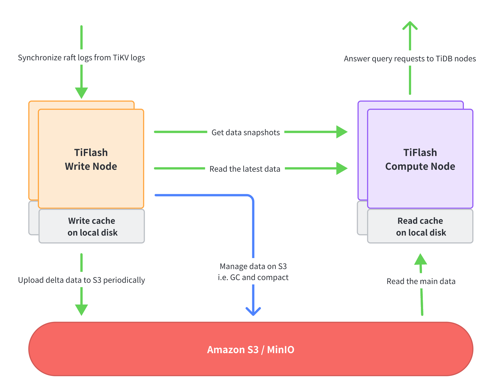
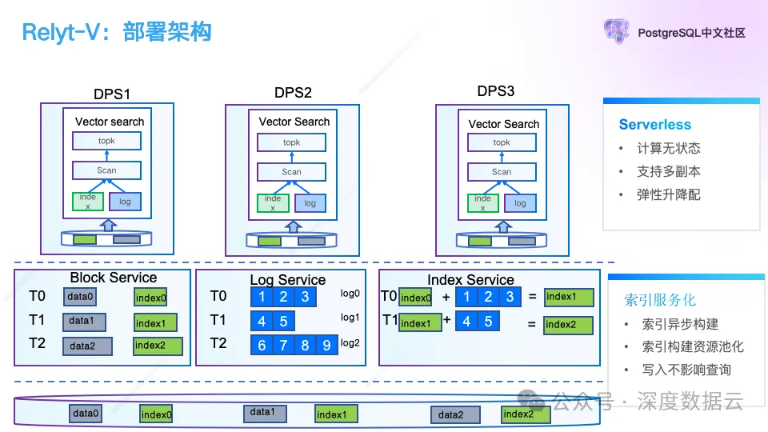
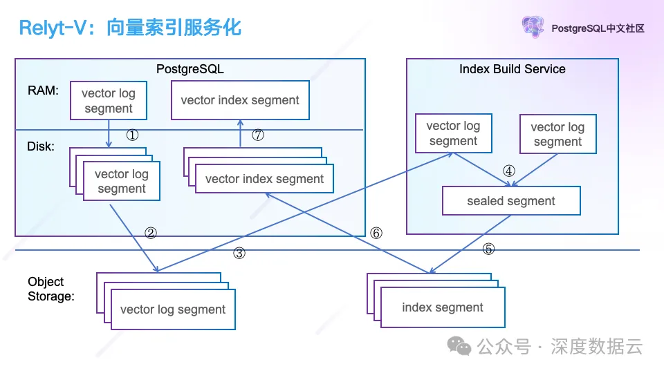
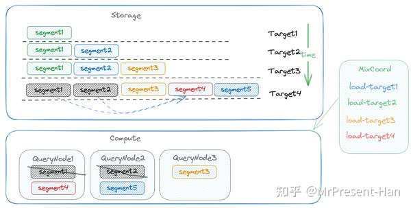
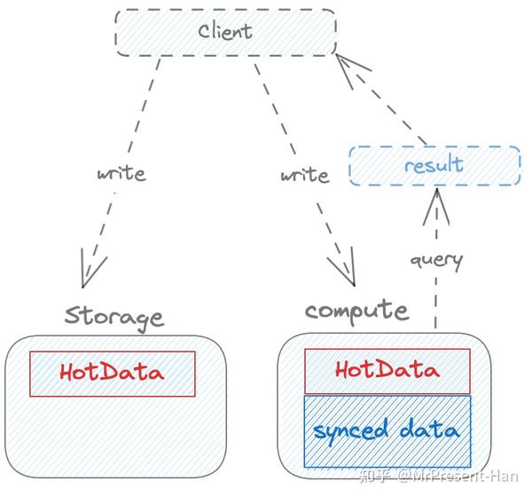
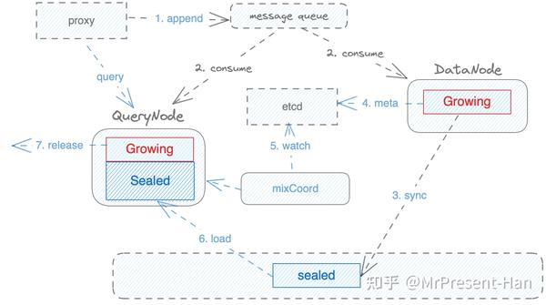

# 存算分离

## 趋势

- 学术界：新硬件（CXL）关注内存解耦，原生分离架构的系统
- 工业界：现有系统的存算分离实现，典型应用场景（OLAP） 云原生架构

### 网络改善

硬件：

- Basic/Foundational NIC
  
  - Usually 1Gbps – 25Gbps
  - Relies on CPU for protocol processing – ≥ 30% server

- Smart NIC
  
  - ≥ 50Gbps
  - Offload network protocol processing
  - Have their own processor, memory & OS

- DPU
  
  - Smart NIC + security + storage
  - Custom chips and/or FPGAs  

T. Döring et al., SmartNICs: Current Trends in Research and Industry, 2020
https://www.net.in.tum.de/fileadmin/TUM/NET/NET-2021-05-1/NET-2021-05-1_05.pdf

软件：

- High overhead of TCP
  - 100+ GB
- Low-overhead protocol
  - RDMA (Infiniband, RoCE)
  - CXL(Compute Express Link)
- Efficient RPC protocol – higher level
  - ack ？ udp协议？

RDMA

- Copies data from application memory to NIC
- Copies data across the network
- Requires handling of cache coherence (in some configurations)
- Requires a CPU/controller at memory nodes

CXL

- Does not copy data into NIC buffers
- Does not copy data across the network, accesses remote memory
- Provides a hardware supported coherent cache
- No need for CPU/controller at memory nodes

8x RDMA

1 L. Barroso, et al. Attack of the Killer Microseconds. Commun. ACM, 2017.
2 J. Ousterhout. It’s Time to Replace TCP in the Datacenter, arXiv 2210.00714, 2023.
D. Gouk, et al. Direct Access, High Performance Memory Disaggregation with DirectCXL. Proc. USENIX ATC, 2022.

#### REF

- Disaggregated & Heterogeneous Platform for Data Management . cs848-w2024

## 问题

### shared-nothing架构下的LSM-based 数据库

- 不同分片数据不均衡，某些热点数据处理压力大
- 后台进行flush/compaction或者数据迁移时产生的抖动
- 内存是昂贵的开销
  - DRAM is an expensive resource in the cloud – 50% of server cost on Azure
  - Memory utilization is low in the (current) cloud

### 存算分离优势

- 性能提升
  - 独立,弹性扩展：存算分离允许计算资源和存储资源独立扩展，这意味着可以根据业务需求单独增加计算能力或存储容量，从而优化整体性能。
  - 读写分离：负载互相不影响，资源隔离。（tiflash）
  - 资源利用率高：计算和存储任务被分配给专门设计的资源池，计算池专注于处理查询，存储池专注于高效数据存储（内存池）
- 可靠性增强    
  - 数据高可用：在存算分离架构中，数据存储在高可靠的专业存储系统中，即使计算节点故障，数据依然安全，确保业务连续性。
  - 故障容忍：高端存储系统设计有高故障容忍能力，减少硬件冗余需求，提升整体可靠性。
  - 计算节点快速恢复、扩展：无需恢复数据
- 降低成本：通过灵活扩展计算和存储资源，可以降低系统的整体成本

### 存算分离难点

- 网络延迟：计算节点和存储节点之间的通信需要通过网络进行，网络状况直接影响写入、查询响应速度
  
  - 缓存、压缩
  - 近数计算  near-data computing， log-as-the-database

- 资源共享
  
  - 分布式共享存储、共享内存的可以被计算节点使用（内存的一致性、并发控制）
  - 弹性扩展

- 数据近实时、一致性（not all system need）

## 实现

### OLTP

- Amazon Aurora
- Microsoft Socrates
- Google AlloyDB
- Alibaba PolarDB
  - PolarFS

### OLAP

- Snowflake
  
  - 存储层
    - 基于S3的高可用和持久行
      - 慢，但是廉价和可用
      - 计算节点依赖缓存
    - Partition table into file
      - 文件大小 16MB
    - PAX hybrid columnar storage format
    - 所有计算节点可以访问所有存储数据
  - 计算层
    - Virtual Warehouse (VW)，MPP
    - Elasticity
  - 控制层
    - 元信息，计划，访问控制

- Amazon Redshift

- databend

- starrock

- tiflash

### 组件

广泛的架构组件设计

- Compute Node 计算节点（leader,workers）
- cache 数据缓存
- metadata 元信息
  - 文件管理
- Storage Node 存储节点（可选）
  - 数据过滤
  - 共享存储数据管理:compact 
  - eg. TiFlash Write Node
- 共享存储（OSS,HDFS）、文件系统
  - 冷数据 parquet 文件存储格式 

### 思考

- 存储引擎的必要性与位置
  - 数据过滤计算，访问文件，写入处理
  - 单独服务 （tiflash） or 计算存储一体
- 对象存储中的数据内容
  - 索引，元数据
    - 多版本
  - block 大小，segment文件块 or 列文件块
  - 原始segment or parquet
  - 移除WAL(副本依赖共享存储)

### 系统设计

一个类OLAP系统存算分离架构设计

- agent 采集节点
- frontend 前端， web页面 
-  metastore 元信息缓存 （S3 上所有文件信息、分片等）
- ingester 写入节点
- query 查询节点，无状态
  - 查询数据  ingester 上 L0 级别信息 + 共享存储上持久化信息
- cache 缓存
  - 共享存储上持久化缓存的文件块

#### 写入流程
1. ingester 接收写入请求，并写入本地和副本
  a. 可以考虑 openDAL  库写文件
  b. 依然支持多副本、WAL 容错	
2. 后台异步将Level > 0 级别的数据flush到对象存储
  a. Level > 0 的数据是经过合并的数据
3. 并更新元信息

#### 读取
query 节点处理查询请求，无状态节点，都可以作为协调者节点，接收查询请求，将任务提交到其他节点处理，但是支持缓存 共享存储上的文件块。

当前并行执行框架是基于volcano 插入 xchange 的并行执行模型，而Morsel-Driven numa-aware并行执行模型，将计算任务迁移到数据位置，并且对后续算子处理缓存数据友好。为了避免缓存数据失效，split 切分时，也需要注意节点是否有数据缓存。

查询请求中Scan 请求（包括下推的filter）将被分发2次
- ingester 只搜索 L0 数据，并查询过滤条件并返回
- query 节点，根据磁盘缓存数据，按照数据亲和执行task
  - 无数据缓存、单点任务过多，其他query节点将远程读共享存储数据并过滤
非Scan执行算子，只会调度query节点执行（减少ingester节点读压力）

#### 数据缓存
缓存共享存储上的数据，应当优先将索引，元信息等缓存，其次数据文件块。
缓存淘汰策略  FIFO-like 可能比 LRU-like 更好

#### 共享存储上文件设计
L0文件的compact后的文件
- 相关索引文件
- 数据文件分块，尽量按列
- 数据文件块索引

## REF

### 学术

- [cs848-w2024](https://ozsu.github.io/cs848-w2024/Schedule.html) slides 推荐

- [SIGMOD23_DisaggregatedDB_Slides](https://www.cs.purdue.edu/homes/csjgwang/pubs/SIGMOD23_DisaggregatedDB_Slides.pdf)
  
  - [papaer](https://www.cs.purdue.edu/homes/csjgwang/pubs/SIGMOD23_Tutorial_DisaggregatedDB.pdf)

- [ASPLOS2020 Hailstorm: Disaggregated Compute and Storage for Distributed LSM-based Databases 笔记](https://zhuanlan.zhihu.com/p/381280016)
  
  - 计算/存储资源的解耦合
  - 存储池化（small block（1MB））
    - 在各shard下的storage engine引入一层shared-storage的存储层进行池化，分摊了io开销和消除io热点，消除数据倾斜和单机disk的瓶颈
  - Compaction/flush任务的均衡调度
    - 提供task调度功能，将compaction/flush任务根据io/cpu负载在不同分片中进行调度
    - HailStorm Agent类似于一个compaction/flush任务的scheduler，把io/cpu intensive的task分发到利用率比较低的节点上
    - 计算层的compaction offloading用于减缓cpu load
  - 基于文件系统操作（FSClient）
    - storage engine中对compaction/flushing是对文件进行操作的
    - 文件系统提供如mmap 内存映射方法
  - 元数据存储
    - 每个文件通过全局唯一的uuid来识别
    - 每个文件的block顺序存储，方便定位
    - 每个hailstorm client存储着文件路径和uuid的映射（全局元信息）
  - 读优化
    - 读取比写入时，block的粒度会更小，来减少传输的latency和读放大
    - compaction/flush操作则使用默认的block粒度来保证写入性能
  - 容错
    - LSM用WAL实现崩溃恢复保证数据一致性
    - 分布式数据库通过跨机器/跨机架/跨AZ/跨数据中心的备份来保持高可用
    - rack： RAID保证冗余
    - 文件的metadata存储在本地（bad, pg,mysql 主备，etcd等）

### 实践

- [ClickHouse 存算分离架构探索](https://zhuanlan.zhihu.com/p/357451583) 
- [ClickHouse 存算分离改造：小红书自研云原生数据仓库实践](https://zhuanlan.zhihu.com/p/654858066)

- [全新存算分离架构——[SIGMOD2021] PolarDB Serverless: A Cloud Native Database for Disaggregated Data Centers 笔记](https://zhuanlan.zhihu.com/p/382109937)

- [存算分离/DB on K8s 论文/blog收集](https://zhuanlan.zhihu.com/p/377755864)

- [存算分离下写性能提升10倍以上，EMR Spark引擎是如何做到的？](https://zhuanlan.zhihu.com/p/272202352) 

- [TiFlash 存算分离架构与 S3 支持](https://docs.pingcap.com/zh/tidb/stable/tiflash-disaggregated-and-s3#tiflash-%E5%AD%98%E7%AE%97%E5%88%86%E7%A6%BB%E6%9E%B6%E6%9E%84%E4%B8%8E-s3-%E6%94%AF%E6%8C%81)
  
  - 存算分离架构中，TiFlash 原有进程的不同部分的功能，被拆分到两种不同的节点
    - TiFlash Write Node
      - 负责接收 TiKV 的 Raft logs 数据，将数据转换成列存格式，并每隔一小段时间将这段时间的所有数据更新打包上传到 S3 中
      - 管理 S3 上的数据，比如不断整理数据使之具有更好的查询性能，以及删除无用的数据等
    - TiFlash Compute Node 
      - 负责执行从 TiDB 节点发过来的查询请求
        - 首先访问 Write Node 以获取数据的快照 (data snapshots)
        - 然后分别从 Write Node 读取最新的数据（即尚未上传到 S3 的数据）
        - 从 S3 读取剩下的大部分数据
      - Compute Node 利用本地磁盘（通常是 NVMe SSD）来作为数据文件的缓存，从而避免相同的数据反复从远端（Write Node 或者 S3）读取，以提高查询性能
        

- [StarRocks 存算分离 Data Cache 二三事](https://zhuanlan.zhihu.com/p/695673099)
  
  - Cache V1: File Cache,  LRU 淘汰, 同时写入对象存储和本地 Cache
    - 缺点：
      - 空间效率低， 可能访问只有部分列数
      - Cache Miss 时代价大
      - 淘汰效率低， 在本地文件系统上 list 上百万甚至千万的文件
      - Cache Disk 不均衡，将某个分区映射到特定的磁盘，数据分区大小不均衡导致磁盘使用不均
  - Cache V2: Block Cache（StarCache ）
    - 以特定大小 Block （典型大小如 1MB）为缓存单位的新型 Cache 系统
    - 80% 磁盘空间阈值

- [兼顾降本与增效，我们对存算分离的设计与思考](https://zhuanlan.zhihu.com/p/630277812) StarRocks
  
  - 构建了一个统一的存算分离平台——StarOS， StarOS 的调度中枢负责计算任务调度
    - 基于 StarOS, 构建 StarRocks
    - FE
      - Compaction：将用户的历史版本合并为一个更大的版本以提高查询性能
        - 得益于存算分离的数据共享能力，FE 可以选择将 Compaction 任务发往任意 BE 节点执行
        - TODO 专用集群，避免干扰集群
    - BE/cache
  - 存储
    - 后端存储方式
      - 兼容 AWS S3 协议的对象存储系统
      - 传统数据中心部署的 HDFS
    - StarRocks 存算分离数据文件格式与存算一体相同，数据按照 Segment 文件组织，StarRocks 各种索引技术在存算分离表中也同样复用
    - 数据多版本
      - 每个数据版本包含 Tablet Meta 和 Tablet Data 文件，并且都写入后端对象存储
        - TabletMeta 文件内记录了该版本所有的数据文件索引
        - Tablet Data 文件仍然按照 Segment 文件格式组织
      - BE 节点需要访问某个Tablet 时，会先根据版本号从后端存储加载对应的 Tablet Meta 文件，然后再根据索引访问相应的数据文件
  - 缓存
    - 使用磁盘（Local Disk） 来缓存热点数据
  - 对比
    - 写入：随着并发提升，存算分离表的写入吞吐仍在不断提升，直到最终达到了 BE 节点的网络带宽瓶颈
    - 查询
      - 存算分离版本在缓存完全命中情况下，其总体性能已经追平存算一体（428s VS 423s）1.01X
      - 完全访问冷数据情况下，通过预读等优化手段，也很好地将冷数据查询性能衰退控制在一个合理范围内（668s VS 428s）  1.57X

- [万字长文|从AIGC典型客户实践揭秘云原生向量数据库内核设计与智能创新](https://mp.weixin.qq.com/s/KPN-JoICYnTf-wyB-Rmoig) 向量数据库的存算分离
  
  - 迭代过程：
    
    - 在PostgreSQL上实现了类似pgvector的向量索引插件，支持了高维向量的高效检索，支持了向量数据的实时更新等基础功能
      
      - 基于段页式存储的HNSW索引，3次遍历图索引
      - 问题：段页式存储带来的加锁访问开销占据了整个执行时间的1/3，大量随机图查询造成大量Shared Buffer页面申请淘汰
    
    - 基于Huge-Block的自研向量索引
      
      - 把向量索引的数据按照1GB大小为一块来申请
    
    - Relyt-V架构
      
      - DWSU 数仓服务单元 包含多种DPS数据处理服务集群，DPS共享一份数据，一个DPS为读写集群，其它DPS为只读集群
        
        - Hybrid DPS提供了数据实时写入，实时分析的能力，Extreme DPS提供了极速Ad Hoc查询，交互式分析能力，Spark DPS提供了离线分析，以及Vector DPS提供向量和全文的检索能力
      
      - Vector DPS
        
        - 典型的数据库架构，包含各种SQL计算和存储的实现， 支持的索引，包含B-tree、全文、JSON和向量索引
        
        - 计算层是PostgreSQL集群，负责向量的写入和查询
        
        - 中间层的Block Service提供PostgreSQL的Page回放和读服务，Log Service提供WAL日志的持久化服务，Index Service提供向量索引的构建服务
          
          - 索引的服务化能力，提供索引的异步构建能力，同时索引构建不会影响上层计算的读写请求
        
        - 底层是对象存储，提供数据的持久化能力。
        
        - 存算分离改造
          
          - 从它的WAL日志做了Hook，把WAL日志路由到Log Server，并通过Paxos协议保证WAL日志的高可靠
          - PostgreSQL读写Page做了Hook，读Page路由到Block Server，Block Server从Log Server拉取WAL日志会回放成Page
          - Log Server和Block Server定期会把自己的数据同步到对象存储持久化
          - 持久化完成后，Log Server和Block Server就可以安全的清理自己的WAL日志和本地文件
            
        
        - 弹性Serverless
          
          - Block Server的迁移（负载），PG重试读取Page
          - Log Server 通过多副本的增减实现副本跨节点的迁移，有状态的网络中断、进程重启，通过QEMU实现的虚拟机实现进程的迁移，通过VXLAN的网络虚拟化能力，解决迁移过程中网络不中断的问题
        
        - 向量索引服务化
          
          - LSM的向量索引存储引擎
          - 按需拉起Index Build Service，通过从对象存储同步Vector数据来实现向量索引的构建
          
          

- [Elasticsearch 存算分离技术浅析与最佳实践](https://cloud.tencent.com/developer/article/2301790) 基于 es 的可搜索快照

- [Elasticsearch 存算分离功能 POC 方案](https://cloud.tencent.com/developer/article/2354578)
  - 支持将索引数据下沉、卸载到远程共享存储，副本和主分片共享一份数据，本地仅保留少量meta数据，降低磁盘占用。

- Milvus
  - [Milvus 存算分离系列-1：milvus架构简介](https://zhuanlan.zhihu.com/p/654044762)  描述基本读写流程，datanode 分片 segment 上传 oss，query node 下载  
  - [Milvus存算分离系列-2: target机制](https://zhuanlan.zhihu.com/p/654283186) 存算分离架构下保证数据（近，秒级别）实时可见&&数据完整性
    - 数据实时更新
      -  target 机制，可读segment的集合target，mixCoord会定期检查target状态，当发现存在新的target的时候，就会命令compute节点load新的segment以供client查询，从而保证新写入的数据能被client正确查询到
        - compact （target的更新：load、offload） 
          - PS：Milvus  由于在对象存储之后compact导致的问题，对于OLAP,时序数据库不支持更新情况下，完全可以先合并小segement 在上传到oss，不需要面临数据一致性问题，即 l0 数据在本地，l1级别数据在oss
        
        - target 状态更新机制
      - 数据新鲜度
        - way1：存算双读，将存储节点的热数据和计算节点上synced数据
          - bad：存储节点会受到计算负载的影响
        - **存算双写**: 同一份数据，既写入存储节点，又写入计算节点，但数据准备好后，再移除本地growing segment
         
          - bad: 数据冗余, 增加计算节点内存开销
          - 选择双写原因：向量的查询计算量很大，cpu资源比较紧张，而存储节点的cpu需求则比较低，计算需求&&资源都集中在计算节点
        

- [ClickHouse 存算分离架构探索](https://cloud.tencent.com/developer/article/2109545)

- [Kudu: Storage for Fast Analytics on Fast Data](http://47.241.45.216/2022/10/30/Kudu-Storage-for-Fast-Analytics-on-Fast-Data/)

- [云原生存算分离数据库Neon的架构决策](https://zhuanlan.zhihu.com/p/656131188)