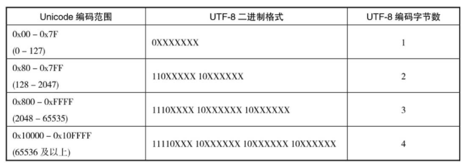
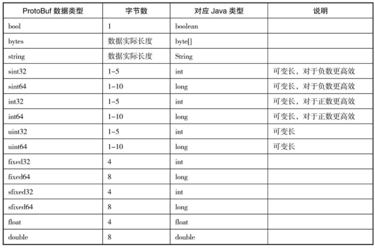
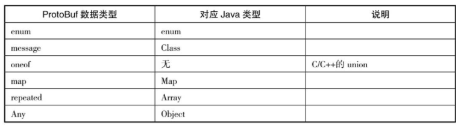
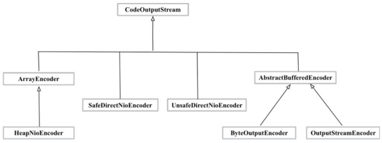
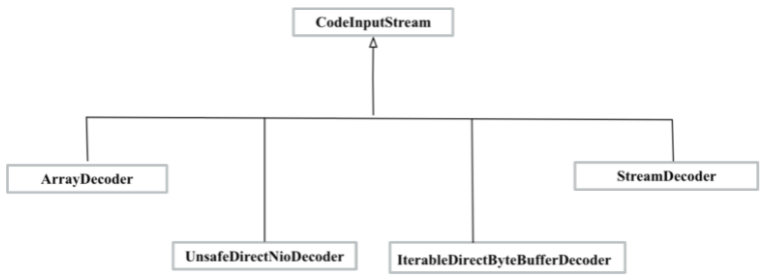

# 序列化与反序列化SerDe

[TOC]

## 1.基础概念

### 1.1 字符编码

ASCII（American Standard Code for InformationInterchange，美国信息交换标准代码）

- 8位
- 128字符
- 扩展ASCII
  - 从128开始
  - 特殊符号字符、外来语字母和图形符号

GB2312编码

- 2个字节来表示汉字
  - 每个字节的取值范围为［129-255］
- 1个字节表示英文字符
- <127 字符兼容ASCII编码兼容

GBK编码

- GB2312的扩充，增加不常见的简体字、繁体字
- 单字节、双字节

GB18030

- GBK的扩充，增加了对日文、韩文、藏文、蒙文等文字的支持
- 四字节编码的码位收录了中日韩扩展的6582个汉字（对应Unicode码范围：0x3400-0x4db5）

 Unicode字符集

- 全世界所有的字符的唯一数字编码
- 字符编码格式：U+ 十六进制
  - U+4E2D “中”

- 编码方式，物理存储方式
  - UTF-32，UTF-16，UTF-8

UTF-32编码

- 四字节
- 字符编码直接转换为二进制数

UTF-16编码

- 变长字节
- U+0000到U+FFFF之间的字符，用2个字节表示
- U+10000到U+10FFFF之间的字符，用4个字节表示

UTF-8编码

- 变长字节
- 兼容ASCII
- 
- 编码规则
  - 根据Unicode编码，确定二进制格式
  - 将Unicode编码的二进制序列依次从低位向高位填充到二进制格式模板，得到UTF-8编码

Base64编码

- 处理非英文字符（不可打印字符等）
- 基于8 bit分割，转换可打印字符
- 工具
  - jdk1.8 java.util.Base64
    - 性能优于commons-codec

### 1.2 Varint编码

现实使用整数过程中，小整数类型，使用频率远高于大整数。

系统之间进行数据传输的时候，发送了很多0，浪费资源。

编码规则：

每个字节最高位表示编码是否继续，如果最高位为1，表示接下来的字节仍然是该数字的一部分；如果最高位为0，表示编码结束。

每个字节里的其余7位表示数据值，小端对齐（低位字节补齐到高位）。

- 整数先和0x10取与，判断右移7位后数值是否大于0。
- 取整数最低7位，如果步骤1）结果大于0，在最高位补1，否则在最高位补0，和最低7位凑成1个字节。
- 整数执行右移7位。


特点：

- 减少较小正整数的字节数
- 较大正整数（0x7FFF FFFF）需要5字节表示
- 负整数，需要5个字节来表示


### 1.3 ZigZag编码

ZigZag将有符号整数统一映射为无符号整数，再通过Varint编码规则达到数据压缩的效果。

编码：

- 将整数补码最高位移到最低位。
  - 负数绝对值越小，其补码的前值1越多，映射无符号整数后值越大，Varint编码后字节越多。
    - 1，0x0000 0001 -> 0x0000 0002
    - -1 ，0xFFFF FFFF -> 0xFFFF FFFF 
- 对于负数，除符号位外(已经移到末尾)，其他位取反；正数不变，得到ZigZag编码
  - 1，0x0000 0001 -> 0x0000 0002
    - 原正整数，左移一位，即映射后都乘以2，相对于原始直接Varint，小正整数的受益范围减少。
  - -1，0xFFFF FFFF -> 0xFFFF FFFF  -> 0x 0000 0001
  - -2，0xFFFF FFFE ->  0xFFFF FFFD  -> 0x 0000 0003
    - 原负整数，间隔插在正整数之间，ZigZag编码实际上是将小负整数也纳入短字节的编码中。

- 算法：

  - `(n<<1)^(n>>31)`

    - 正数 0 的 异或不变，负数全1的异或是取反

      

特点：

- 将有符号整数，映射为无符号整数，同时正负数都间隔依次增大。

ZigZag编码机制被用于Thrift、Protocol Buffer、Avro等序列化方案中。

### 1.4 序列化和反序列化

网络通信协议，使用的都是二进制数据流，序列化和反序列化（SerDe）协议用于将结构化内存对象/消息与二进制数据流进行相互转换。


分类：

- IDL（Interface Description Language，接口描述语言）
  - Thrift、Protocol Buffer、Avro等
  - 需要完整的规约和框架实现
  - 组件：
    - IDL描述文件
      - .thrift后缀文件
      - .proto后缀文件
    - IDL文件编译器
      - 根据IDL文件生成具有序列化/反序列化功能的代码文件
      - thrift命令，protoc命令
    - Stub/Skeleton代码
      - 编译期生成的客户端和服务端
- 非IDL
  - JSON，XML
  - 自描述，解析速度慢


如果只是完成，将结构化内存对象/消息与二进制数据流进行相互转换，开发人员直接写成对的Ser/De即可。但是缺点是，需要考虑兼容性，对每个对象，编写大量重复的代码，不易维护。

Protocol Buffer此类框架，可以提供更加完善、快捷的SerDe解决方案。


但是需要注意，Ser/De 并非必须的，[apache arrow](https://github.com/tianjiqx/notes/blob/master/big_data_system/Apache%20Arrow.md)作为一个跨语言的内存数据开发平台，能够跨语言，程序间直接交换内存数据格式，而不需要SerDe。(通过规范数据格式，各语言的库实现，完成对数据的直接处理，免除数据的格式转换)


## 2.java序列化

Java序列化是自JDK 1.1开始就自带的序列化方案，为Java程序之间共享数据提供的解决方案。

### 2.1 实现方式

- 自定义类实现Serializable
  - serialVersionUID 对象版本，有默认值，但是建议显式声明。
    - static+final
  - 对象可序列化声明，ObjectOutputStream/ObjectInputStream 定义了对java各种类型的对象的序列化和反序列化方法
  - 默认的方法进行SerDe
  - transient  关键字，忽略不需要序列化的方法
  - static 关键字，类全局成员，不会被序列化
    - 注意：不同JVM进程中的静态变量值可能不同
- 自定义类实现Serializable，添加readObject和writeObject方法（非Serializable的方法）
  - 自定义序列化和反序列化，选择自己需要保存的成员，顺序，或者**用于抛出子类不可序列化**
  - 可见性没有限制
- 自定义类实现Externalizable，重写readExternal方法和writeExternal方法
  - 是对Serializable的扩展，完全显示的声明成员变量是否需要序列化，或者抛出不可序列化异常，必须重写。
    - 优先级优于readObject和writeObject方法
    - Serializable需要利用大量的反射来找到祖先类到当前类的是否存在writeObject，readObject方法
    - 而Externalizable，因为必须实现readExternal方法和writeExternal，可以更加简洁直接调用
  - 需要定义无参构造函数
  - 可见性没有限制


Externalizable序列化/反序列化hook

- writeReplace方法
  - 序列化写入时拦截并替换成一个自定义的对象
- readResolve方法
  - 反序列化拦截并替换成自定义的对象。
  - 应用，枚举类型的反序列化。保证是同一个对象。


特点：

- 使用简单（只Serializable即可）
- 性能和压缩效果一般
- 只能jvm语言共享，无法跨语言


## 3. Protocol Buffer

Protocol Buffer是Google提供的跨语言、跨平台的二进制序列化方案，可用于数据存储、数据交换等场景。

### 3.1 数据类型



复杂数据类型：



默认值：

- bool 默认值false

- 字符类型，空字符串
- 整形，0
- 浮点型，0.0f/d
- 复杂类型，null


### 3.2 proto文件

文件格式：

- 以.proto为文件后缀，文件名字使用匈牙利命名法，如student_info.proto
- 每一行长度在80个字符以内
- 每一行语句以分号结尾
- 缩进2个空格——使用空格，不使用Tab符号
- 文件和目录的命名使用ASCII字符
- 使用UNIX-style的换行格式（\n）

文件内容：

- 文件最开始为License
- 文件概要说明
- 语法版本，指定proto2或proto3
  - `syntax = "proto3";`
- 包名，多级包名通过“.”字符分割
  - `package store_meta;`
- import依赖的proto文件，按字典顺序指定
  - `import "common.proto";`
- proto生成代码的参数选项，比如是否多个文件、代码生成路径
  - `option java_package = "com.xx.common";`

复杂类型对象

- message/enum/oneof对象定义 使用驼峰法，第一个字母大写。和Java类名定义规则一致

  - ```
    message Db {
      int64 db_id = 1;
      // Every modification has a corresponding unique ver.
      int64 ver = 20;
      map<string, int64> table_name_to_id = 2;
      map<int64, Table> tables = 3;
    }
    ```

- 字段名定义采用匈牙利命名法

  - `[ "repeated" ] type fieldName "=" fieldNumber [ "[" fieldOptions "]" ] ";"`


proto生成对象，Builder模式。

- 多参数设置
- 参数有默认值，按需设置
- 隐藏类内部设计


### 3.3 实现方式

CodeOutputStream提供了一组wirte接口来实现不同类型数据的序列化操作。



Tag-Length-Value数据格式

- tag是fieldNumber和字段内容类型的bit组合
  - fieldNumber 字段序号
- length，字段长度（变长类型）
- value，字段值


parseFrom系列接口完成反序列化。

CodeInputStream提供二进制序列化的输入流。




### 3.4 高级特性

extension

ProtoBuf不支持message对象的继承关系，extension机制可以完成复用（proto2支持）。

```protobuf
message Animal {
	required string name = 1;
	extensions 100 to 200; //100-2000的字段用于扩展，占位符
}

extend Anima {
	optoma double height =100; //定义扩展字段
}
```

```java
Animal.Builder builder = Animal.newBuilder();
builder.setName("birad");
builder.setExtension(TestExtensionProto.height,100d);

// to bytes
byte[] bytes = builder.build().toByteArray();

// parseFrom
ExtensionRegistry registry = ExtnsionRegistry.newInstance();
registry.add(TestExtensionProto.height);
Animal animal = Animal.parseFrom(bytes,registry);
```


proto3引入了Any，依赖其他proto文件的message对象，但又不想直接import依赖文件。


ProtoBuf应用开发：

- 定义proto文件
- 编译生成对应的代码
- 通过生成的代码里的特定方法完成序列化和反序列化


### 3.5 兼容性

兼容性是如何做到的？

向前兼容：默认值，字段序号

向后兼容：忽略属性，字段序号


更新规范：

- 不要改变已有字段的字段编号
- 当你增加一个新的字段的时候，老系统序列化后的数据依然可以被你的新的格式所解析，只不过你需要处理新加字段的缺省值。 老系统也能解析你信息的值，新加字段只不过被丢弃了
- 字段也可以被移除，但是建议你Reserved这个字段，避免将来会使用这个字段
  - Reserved可以用来指明此message不使用某些字段，也就是忽略这些字段。
- int32, uint32, int64, uint64 和 bool类型都是兼容的
- sint32 和 sint64兼容，但是不和其它整数类型兼容
- string 和 bytes兼容，如果 bytes 是合法的UTF-8 bytes的话
- 嵌入类型和bytes兼容，如果bytes包含一个消息的编码版本的话
- fixed32和sfixed32, fixed64和sfixed64
- enum和int32, uint32, int64, uint64格式兼容
- 把单一一个值改变成一个新的oneof类型的一个成员是安全和二进制兼容的。把一组字段变成一个新的oneof字段也是安全的，如果你确保这一组字段最多只会设置一个。把一个字段移动到一个已存在的oneof字段是不安全的


## REF

- [深入理解序列化与反序列化-潘洪安-2020](https://weread.qq.com/web/reader/810324e07210fc018104ee1kc81322c012c81e728d9d180)
- [Why Externalizable when read/writeObject method are there in serializable duplicate](https://stackoverflow.com/questions/49532046/why-externalizable-when-read-writeobject-method-are-there-in-serializable)
- [github:google protobuf](https://github.com/protocolbuffers/protobuf)
- [protobuf tutorials](https://developers.google.com/protocol-buffers/docs/tutorials)
- [Protobuf 终极教程](https://colobu.com/2019/10/03/protobuf-ultimate-tutorial-in-go/)
- [深入理解 ProtoBuf 原理与工程实践（概述）](https://segmentfault.com/a/1190000039158535)
- [protobuf 向前兼容向后兼容](https://www.cnblogs.com/i80386/p/4362720.html)

扩展阅读材料：

- [gRPC（1）：入门及简单使用（go）](https://www.cnblogs.com/Hui4401/p/14941137.html)

