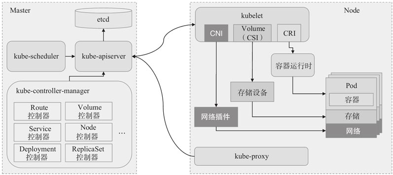

# Kubernetes-笔记

[toc]

## 1. 背景

定义：

**Kubernetes是用于自动部署，扩展和管理容器化应用程序的开源系统。**（生产级别的容器编排系统）

起源于google的Borg系统，在社区的参与（创意和实践）下发展壮大。

面向的问题：

- 现代的 Web 服务，用户希望应用程序能够 24/7 全天候使用
- 开发人员希望每天可以多次发布部署新版本的应用程序

容器化改进了这些问题，但是大规模的容器集群运维成为难题，k8s即用来管理容器集群的工具。


针对大规模尺度（星际尺度）

- google每周运行数十亿个容器，在运维团队不扩展情况下，扩展系统的规模。

特性：

- 自动化上线和回滚
  - 对于应用或配置的更改，分步骤的上线，不会停机所有的实例。
  - 出现问题，回滚所做更改。
- 服务发现和负载均衡
  - 应用程序无需修改，即可使用陌生服务
  - k8s为容器提供ip和dns名称，并使各个容器的负载均衡
    - 自动的负载均衡，可选，应用组件绑定部署，实际有时便于跟踪分析问题。
- 存储编排
  - 自动挂载所选存储系统
    - 本地存储
      - 磁盘
    - 公有云提供商所提供的存储
      - AWS
    - 网络存储系统
      - NFS，Ceph
- 自动装箱
  - 根据资源需求（CPU，RAM）和其他约束自动放置容器，同时避免影响可用性。
  - 高资源需求和低资源需求混合部署，提供资源利用率。
- 水平扩缩
  - 提供命令，UI，或者基于CPU负载自动地对程序进行扩缩
- 自我修复
  - 重新启动失败的容器，自动重试
  - 在节点死亡时替换并重新调度容器
  - 杀死不响应用户定义的健康检查的容器
  - 在容器状态未准备好时，不暴露给客户端
- 秘钥和配置管理
  - Kubernetes允许你存储和管理敏感信息，例如密码、OAuth 令牌和 ssh 密钥。
  - 可以在不重建容器镜像的情况下部署和更新密钥和应用程序配置，
  - 也无需在堆栈配置中暴露密钥。
- 批量执行
  - 支持定义Jobs，批量执行
- ipv4/ipv6支持
  - 为 Pod 和 Service 分配 IPv4 和 IPv6 地址


服务部署的发展：

物理机部署->虚拟化部署（虚拟机VM）-> 容器化部署（应用共享操作系统，但是有独立的文件系统、CPU、内存、进程空间）

容器化优势：

> - 敏捷应用程序的创建和部署：与使用 VM 镜像相比，提高了容器镜像创建的简便性和效率。
> - 持续开发、集成和部署：通过快速简单的回滚（由于镜像不可变性），支持可靠且频繁的容器镜像构建和部署。
> - 关注开发与运维的分离：在构建/发布时而不是在部署时创建应用程序容器镜像， 从而将应用程序与基础架构分离。
> - 可观察性：不仅可以显示操作系统级别的信息和指标，还可以显示应用程序的运行状况和其他指标信号。
> - 跨开发、测试和生产的环境一致性：在便携式计算机上与在云中相同地运行。
> - 跨云和操作系统发行版本的可移植性：可在 Ubuntu、RHEL、CoreOS、本地、 Google Kubernetes Engine 和其他任何地方运行。
> - 以应用程序为中心的管理：提高抽象级别，从在虚拟硬件上运行 OS 到使用逻辑资源在 OS 上运行应用程序。
> - 松散耦合、分布式、弹性、解放的微服务：应用程序被分解成较小的独立部分， 并且可以动态部署和管理 - 而不是在一台大型单机上整体运行。
> - 资源隔离：可预测的应用程序性能。
> - 资源利用：高效率和高密度。（无VM中间开销）

**关于编排：**

Kubernetes非传统意义上的编排系统，实际上它消除了编排的需要。

传统编排：执行A，再执行B，再执行C。

Kubernetes 包含一组独立的、可组合的控制过程， 这些过程连续地将当前状态驱动到所提供的所需状态。 


**关于DevOps、无运维:**

K8S对硬件做抽象，将自身暴露为平台，用于部署和运行应用程序。

**“Kubernetes is the new Linux”**


## 2.架构

### 2.1 架构


Kubernetes集群：由一组被称作**节点**的机器（可以是虚拟机）组成。

节点：管理节点，工作节点。

工作节点：运行Kubernetes 所管理的容器化应用。（至少一个工作节点）。

应用以**Pod**形式部署,一个应用可以拆分成多个Pod，一个Pod代表一组（1+个）容器，通过指定Pod的副本数，进行横向扩展。

**K8S的架构：**

主从结构。

- 包含一系列组件的控制平面(控制面板)Control Plane（master）
  - 用于管理集群的工作节点和Pod
    - 调度，检查和响应集群事件
  - 组件可以运行在单个master节点，也可以复制，以支持高可用的集群部署
    - 支持自托管
      - 运行在K8S集群本身上
  - 管理节点
    - 一般为了避免业务应用的负载影响，不再作为工作节点
- 节点代理kubelet（主要的节点组件）（slave）
  - 工作节点

**控制平面Control Plane：**

- **kube-apiserver** API服务器
  - 负责提供 HTTP API，以供用户、集群中的不同部分和集群外部组件相互通信。
    - 用户请求及其他系统组件与集群交互的**唯一入口**
  - 查询和操纵 Kubernetes API 中对象（例如：Pod、Namespace、ConfigMap 和 Event）的状态。
    - 提供etcd的封装接口API
    - 集群访问控制
      - 客户端身份验证（Authentication）和授权（Authorization）
      - 资源准入控制（Admission Control）
  - 无状态，可横向扩展
    - 通过Haproxy或负载均衡器 进行协同工作（负载均衡器也可以配置使用多个，避免单点故障）
    
      
- etcd

  - etcd 是兼具一致性和高可用性的键值数据库
  - 保存 Kubernetes 所有集群数据（状态）
    - Node、Service、Pod 的状态和元数据，以及配置数据等
- **kube-scheduler**
  - 监视新创建的、未指定运行节点的Pods（用户要求运行的一组容器），选择节点让Pod在上面运行
  - 调度Pod的过程
    - 调度周期，选择最优节点
    - 绑定周期，通知API Server
- **kube-controller-manager** (cm)
  
  - 统一管理各个控制器的进程
    - 各控制器完成故障检测、自动扩展、滚动更新等功能；
  - 控制器
    - 节点控制器（Node Controller）: 负责在节点出现故障时进行通知和响应
    - 任务控制器（Job controller）: 监测代表一次性任务的 Job 对象，然后创建 Pods 来运行这些任务直至完成
    - 端点控制器（Endpoints Controller）: 填充端点(Endpoints)对象(即加入 Service 与 Pod)
    - 服务帐户和令牌控制器（Service Account & Token Controllers）: 为新的命名空间创建默认帐户和 API 访问令牌
- cloud-controller-manager（ccm）
  - 云平台交互控制器管理
  - 控制器
    - 节点控制器（Node Controller）: 用于在节点终止响应后检查云提供商以确定节点是否已被删除
    - 路由控制器（Route Controller）: 用于在底层云基础架构中设置路由
    - 服务控制器（Service Controller）: 用于创建、更新和删除云提供商负载均衡器

**节点代理组件：**

- **kubelet**

  - 节点的代理，负责维护容器的生命周期，同时也负责 Volume（CSI）和网络（CNI）的管理
  - 容器执行层，Pod和Node API的主要实现者
    - 接收PodSpecs，确保这些PodSpecs中描述的容器处于运行状态且健康。
    - 负责启动容器的守护进程
      - 启动时，向API Server 处创建一个Node 对象来注册自身的节点信息
- kube-proxy
  - 网络代理
  - 为Service 提供 cluster 内部的服务发现和负载均衡
  - DNS查找服务，服务使用静态IP，保证即使容器被迁移，客户端依然能够连接到容器服务。
    - 负载均衡，宕机等情况导致迁移
- Container Runtime
  - 负责运行容器，镜像管理。
  - 支持
    - docker
    - containerd
    - DRI-O
    - 实现Kubernetes CRI 容器运行环境接口的

其他架构图：





### 2.2 概念

#### 2.2.1 容器技术

**基于linux容器技术的组件隔离原理**：

- linux名字空间（namespace）
  - 多种名字空间类型，每种隔离一组特定的资源
    - Mount(mnt)
    - Process ID(pid)
    - Network(net)
    - Inter-process communicaion(ipd)
    - UTS
    - User ID(user)
  - 用于隔离进程
    - 进程只能看到同一个命名空间下的资源
- linux控制组cgroups
  - 用于限制进程的可用资源（CPU，内存，网络带宽等）
    - CPU
      - 限制cpu使用时间
        - cpu.shares、cpu.cfs_period_us 和cpu.cfs_quota_us
    - blkio
      - 对块设备访问控制I/O


**docker 容器平台：**

Docker是一个打包、分发和运行应用程序的平台。

打包应用的库和依赖，打包整个操作系统的文件系统。

使容器能在不同机器之 间移植的系统。

- 镜像images
  - 打包的应用程序及其所依赖的环境
    - 文件系统，元数据（可执行文件路径）
  - 可共享镜像层，但是只读
  - 镜像层之上的可写层，写拷贝

- 镜像仓库Registries
  - 共享镜像

- 容器Containers
  - 基于镜像创建的进程，只能访问和使用分配给它的资源


容器技术的优势：

- 解决不同应用对环境的需求（操作系统，依赖库、各个版本）


#### **2.2.2 API对象（Kubernetes Objects）**

操作 Kubernetes 对象，都需要使用Kubernets API，所以也叫 API对象。

API 对象是 Kubernetes 集群中的**管理操作单元**。  

通过引入新的API 对象，来支持新功能的管理操作。

API 对象是持久化的实体， 表示整个集群的状态。描述：

- 哪些容器化应用在运行（以及在哪些节点上）
- 可以被应用使用的资源
- 关于应用运行时表现的策略，比如重启策略、升级策略，以及容错策略

API对象的通过`.yaml`文件来声明， `kubectl` 在发起 API 请求时，将这些信息转换成 JSON 格式。

API 对象：

- 元数据 metadata
  - 用来标识对象
  - namespace
  - name
  - uid
  - labels
- 规范（规约）spec
  - 描述了期望的状态
    - 例如，期望通过复制控制器 Replication Controller设置的 Pod 副本数为3  
- 状态 status
  - 描述系统当前达到的状态
  - 由 Kubernetes 系统和组件设置并更新

Deployment，ReplicaSet，Service，Job，DaemonSet，StatefulSet，这些都是API对象

例子：application/deployment.yaml

```yaml
apiVersion: apps/v1  #必须，创建该对象所使用的 Kubernetes API 的版本
kind: Deployment     #必须，想要创建的对象的类别
metadata: 			 #必须，唯一性标识
  name: nginx-deployment
spec:				 #必须，嵌套结构
  selector:			 # 如何查找要管理的Pods
    matchLabels:
      app: nginx
  replicas: 2 # tells deployment to run 2 pods matching the template
  template:
  	# Pod 模板 - start
    metadata:
      labels:		# 标签 app: nginx 
        app: nginx
    spec:
      containers:
      - name: nginx
        image: nginx:1.14.2
        ports:
        - containerPort: 80
   # Pod 模板 - end
```

创建Deployment命令：

```shell
kubectl apply -f https://k8s.io/examples/controllers/nginx-deployment.yaml
```


#### 2.2.3 Pod

Pod是代表一组并置的容器（也可以是单个容器）。

一个Pod的容器，都运行在同一个节点上。

一个容器一个进程的最佳实践。（进程崩溃，自动重启，记录错误，都是单进程更好处理。）

Pod也可以被当做是多进程的容器，同时运行一些密切相关的进程，提供（几乎）完全相同的环境，又保持一定的隔离性。

- 共享network，UTS名字空间（PID）,存储卷volumne
  - 相同的IP，端口空间
- 隔离的文件系统

Pod是K8S中的基本构建模块。

Pod视为独立的机器。

Pod之间共享IP地址空间（无NAT），通过ip地址相互通信。

专用的网络实现，基于真实链路。（与实际网络拓扑无关）

应用的Pod的设计实践：分层的应用，每层使用一个Pod。（例如Web服务Pod，数据库服务Pod）

（Pod的代价很低，分割到多个Pod中，便于扩缩）

Pod是最重要的**API对象**。

一般情况下，用户通过更上层的控制器来完成Pod的管理，上层的控制器包括Deployment、DaemonSet以及StatefulSet，这些也叫做工作负载（Workloads）。

- Deployment 和 ReplicaSet 。 管理无状态应用，Deployment 中的所有 Pod 都是相互等价的，并且在需要的时候被换掉。Deployment 内部使用ReplicaSet。
- StatefulSet。管理有状态应用。将StatefulSet每个Pod与某个PV对应起来。
- DaemonSet。定义节点本地支撑的Pod。与节点一一对应。
- Job和CronJob。 定义一些一直运行到结束并停止的任务。Job用来表达的是一次性的任务，而 CronJob会根据其时间规划反复运行。
- 定制资源定义（CRD），用户（第三方）扩展的负载资源（如TiDB Operator定义的CRD），完成原本不是 Kubernetes 核心功能的工作。


每个Pod 都有一个唯一的ip地址，即使在同一个node上。

#### 2.2.4 Replica & ReplicaSet

Pod的副本，被称为 Replica。

ReplicationController 或 ReplicaSet 会监控和保证活动副本的数量。

RC是Kubernetes 较早期的技术概念，只适用于长期服务型的业务类型。

RS是新并版本的RC。

一般不直接使用该对象，而是使用Deployment来完成副本管理。


#### 2.2.5 Deployment

表示运行在集群中的应用。在 Pod 这个抽象上更为上层的一个抽象。

- Pod 的副本数目管理（扩缩容）
- Pod 的版本控制（更新、回滚）

Deployment管理ReplicaSet，ReplicaSet管理Pod。


滚动升级：

- 将应用中的每个独立的服务作为一个Pod来定义
- 将Pod包在Deployment（自愈、扩缩容）
  - 副本数、镜像、网络端口。滚动升级细节
- 修复bug之类，需要升级
- 修改Deployment的YAML文件，将镜像版本更新并重新POST到APIServer
- Kubernetes基于新镜像的Pod创建了一个新的ReplicaSet
  - 每次Kubernetes增加新ReplicaSet（新版镜像）中的Pod数量的时候，都会相应地减少旧ReplicaSet（旧版镜像）中的Pod数量
- 旧版的ReplicaSet暂停，并且不再管理任何Pod，但是仍然保留了所有的配置信息（可以用于回滚）
  - 回滚，逆过程，旧版的ReplicaSet增加pod，新ReplicaSet减少pod


#### 2.2.6 Service

逻辑抽象，定义了Pod 的逻辑集和访问 Pod 的协议。

Service与Pod之间是通过Label和Label筛选器（selector）松耦合在一起。

Service 提供了一个或者多个 Pod 实例的稳定访问地址。

- 负载均衡
- 容错（Pod失效）


服务类型：

- ClusterIP
  - 默认
  - ClusterIP Service拥有固定的IP地址和端口号，并且仅能够从集群内部访问得到
    - ClusterIP、端口号和Service名称会注册到集群的DNS服务
  - Pod（应用的微服务）知道Service的名称，就能够解析对应的ClusterIP，进而连接到所需的Pod
- NodePort
  - 在ClusterIP的基础上增加了从集群外部访问能力
    - 增加从集群外部访问到Service的端口NodePort


创建Kubernetes Service的命令: `kubectl expose`

每一个Service都有一个与其同名的Endpoint对象。

Endpoint对象，维护着所有与该Service匹配的动态的Pod列表。

`kubectl get ep <serviceName>`  

`kubectl  describe ep <serviceName> `


#### 2.2.7 Job

Job 是 Kubernetes ⽤来控制批处理型任务的 API 对象。

运行一次性任务，Pod内的任务成功结束时，不重启容器。


#### 2.2.8 DaemonSet & StatefulSet

DaemonSet ：

功能：在每个节点上运行一个Pod。

存储，日志，监控服务。

StatefulSet：

管理有状态的Pods集合的部署、扩缩， 并为这些 Pod 提供持久存储和持久标识符。

特性：

- 稳定的、唯一的网络标识符。
  - 标识与Pod绑定，无论调度到那个节点
- 稳定的、持久的存储。
- 有序的、优雅的部署和缩放。
  - 0..N-1 的创建，N-1...0的删除（不会跳过）。
  - 应用缩放时，之前的所有Pod必须是Running 和 Ready 状态
    - 副本数从3调整到1，2已终止，0运行失败，不会终止1。
- 有序的、自动的滚动更新。

```yaml
apiVersion: v1
kind: Service   # 集群外访问的服务
metadata:
  name: nginx
  labels:
    app: nginx
spec:
  ports:
  - port: 80
    name: web
  clusterIP: None
  selector:
    app: nginx
---
apiVersion: apps/v1
kind: StatefulSet # 有状态pod集合
metadata:
  name: web
spec:
  selector: # 识别需要操作Pods的选择器
    matchLabels:
      app: nginx # has to match .spec.template.metadata.labels
  serviceName: "nginx"
  replicas: 3 # by default is 1
  template:  # Pod
    metadata:
      labels:
        app: nginx # has to match .spec.selector.matchLabels
    spec:
      terminationGracePeriodSeconds: 10
      containers:
      - name: nginx
        image: k8s.gcr.io/nginx-slim:0.8
        ports:
        - containerPort: 80
          name: web
        volumeMounts:  # 挂载PVC
        - name: www
          mountPath: /usr/share/nginx/html
  volumeClaimTemplates:  # 定义PVC
  - metadata:
      name: www
    spec:
      accessModes: [ "ReadWriteOnce" ]
      storageClassName: "my-storage-class" # 根据存储类创建PV
      resources:
        requests:
          storage: 1Gi
```


#### 2.2.9 Volumne

**Volume（卷）** 是Pod中能够被多个容器访问的共享目录。  

用于处理容器奔溃，文件丢失，同一个Pod中多个容器共享文件。

- 声明Pod中的容器可以访问文件目录

- 可以被挂载在 Pod 中一个或者多个容器的指定路径下面。
  - 每个Pod需要独立指定卷的挂载位置

- 支持多种类型的Volume，
  - 例如GlusterFS、 Ceph等先进的分布式文件系统 。

指定AWS EBS卷的Pod实例

```yaml
apiVersion: v1
kind: Pod
metadata:
  name: test-ebs
spec:
  containers:
  - image: k8s.gcr.io/test-webserver
    name: test-container
    // 声明卷挂载位置
    volumeMounts:
    - mountPath: /test-ebs
      name: test-volume
  volumes:
  - name: test-volume
    # 此 AWS EBS 卷必须已经存在，awsElasticBlockStore是卷类型
    awsElasticBlockStore:
      volumeID: "<volume-id>"
      fsType: ext4
```


**configMap**卷

提供向 Pod 注入配置数据的方法。

允许将配置文件与镜像文件分离，以使容器化的应用程序具有可移植性。

创建ConfigMap

```shell
# 创建本地目录
mkdir -p configure-pod-container/configmap/

# 将实例文件下载到 `configure-pod-container/configmap/` 目录
wget https://kubernetes.io/examples/configmap/game.properties -O configure-pod-container/configmap/game.properties
wget https://kubernetes.io/examples/configmap/ui.properties -O configure-pod-container/configmap/ui.properties

# 基于文件创建configmap
kubectl create configmap game-config --from-file=configure-pod-container/configmap/

# 查看
kubectl describe configmaps game-config
```

```yaml
apiVersion: v1
kind: Pod
metadata:
  name: configmap-pod
spec:
  containers:
    - name: test
      image: busybox
      volumeMounts:
        - name: config-vol
          mountPath: /etc/config
  volumes:
    - name: config-vol
      # 也需要先创建
      configMap:
        name: log-config
        items:
          # 存储在log_level条目中的所有内容,都被挂载到Pod的/etc/config/log_level路径下
          - key: log_level
            path: log_level
```

HostPath卷

将主机节点文件系统上的文件或目录挂载到你的Pod中。

```
apiVersion: v1
kind: Pod
metadata:
  name: test-pd
spec:
  containers:
  - image: k8s.gcr.io/test-webserver
    name: test-container
    volumeMounts:
    - mountPath: /test-pd
      name: test-volume
  volumes:
  - name: test-volume
    hostPath:
      # 宿主上目录位置
      path: /data
      # 此字段为可选，Directory，在给定路径上必须存在的目录
      # DirectoryOrCreate，给定路径不存在是创建，755，具有与 kubelet 相同的组和属主信息
      type: Directory
```


容器存储接口CSI，容器编排系统定义的标准接口，用来将任意存储系统暴露给它们的容器工作负载。


**持久卷（Persistent Volume）**是集群中的一块存储，可以由管理员事先提供，或者使用存储类（Storage Class）来动态提供。

普通的 Volume 一样，拥有独立于任何使用 PV 的 Pod 的生命周期。不会被销毁，容器重启期间数据不丢失。

持久卷申请（PersistentVolumeClaim，PVC）表达的是用户对存储的请求（特定的大小和访问模式）。申请使用PV资源。

Pod 将 PVC 申请当做存储卷来使用。

应用开发人员使用PV和PVC，只需要告诉Kubernetes需要什么样的存储资源，而不必关心真正的空间从哪里分配、如何访问等底层细节信息，而不是V来进行管理（分离K8S集群管理和应用开发人员职责）。

PV卷的提供方式：

- 静态
  - 集群管理员创建若干 PV 卷，些卷对象带有真实存储信息，对集群用户可见
- 动态
  - 若静态PV卷无法与用户的 PersistentVolumeClaim 匹配， 集群将尝试基于StorageClass，为该PVC动态提供一个存储卷
    - 要求PVC请求的某个StorageClass已经存在

将 PVC 对象删除，可以回收PV资源。

PVC扩展，部分卷如awsElasticBlockStore 可以扩展，默认启用。

```yaml
apiVersion: v1
kind: PersistentVolume  # PV
metadata:
  name: pv0003
spec:
  capacity:	# 容量
    storage: 5Gi
  volumeMode: Filesystem # 卷模式Filesystem，会挂载到Pod的某个目录，另外一种Block，原始块设备
  accessModes: # 访问模式
    - ReadWriteOnce # 被一个节点以读写方式挂载，Once一个，Many多个，表示可以绑定到多个PVC
  persistentVolumeReclaimPolicy: Recycle # 回收策略，Recycle -- 基本擦除，rm -rf /thevolume/*
  storageClassName: slow # 特定类的PV卷只能绑定到请求该类存储卷的 PVC，未指定则只能绑定未指定存储类的PVC
  mountOptions:
    - hard
    - nfsvers=4.1
  nfs: # 卷类型是nfs
    path: /tmp
    server: 172.17.0.2
```


卷的阶段：

- Available（可用）-- 卷是一个空闲资源，尚未绑定到任何PVC；
- Bound（已绑定）-- 该卷已经绑定到某PVC；
- Released（已释放）-- 所绑定的PVC已被删除，但是资源尚未被集群回收
- Failed（失败）-- 卷的自动回收操作失败


```yaml
apiVersion: v1
kind: PersistentVolumeClaim  # PVC
metadata:
  name: myclaim
spec:
  accessModes:
    - ReadWriteOnce		# 访问模式，与PV相同
  volumeMode: Filesystem # 卷模式，与PV相同
  resources:  # 资源
    requests:
      storage: 8Gi  # 8G容量
  storageClassName: slow # 存储类，与PV相同
  selector:  # 过滤候选PV
    matchLabels:
      release: "stable"
    matchExpressions:
      - {key: environment, operator: In, values: [dev]}
```


StorageClass存储类

存储映射策略。

关键字段

- provisioner存储制备器
  - 指定卷插件制备PV
  - 包含存储来源？
- parameters
  - 描述存储类的卷（这里不指定大小，卷大小在PVC使用StorageClass时，通过资源描述）
    - 类型（标准磁盘，ssd）
- reclaimPolicy
  - 回收策略

```yaml
apiVersion: storage.k8s.io/v1
kind: StorageClass
metadata:
  name: standard
provisioner: kubernetes.io/aws-ebs  # 存储制备器
parameters: # 卷的参数
  type: gp2
reclaimPolicy: Retain # 回收策略，销毁
allowVolumeExpansion: true
mountOptions:
  - debug
volumeBindingMode: Immediate
```


使用存储卷的过程：

- 创建PV
- 创建PVC
- 在PodSpec中定义使用的卷（pvc）
- 挂载到一个容器的路径上


#### 2.2.10 Kubectl

命令行工具，用于与 Kubernetes 集群和其中的 pod 通信。

- 查看集群的状态
- 列出所有pod
- 进入pod
- 添加使用yaml文件定义资源对象到集群

常用命令：

- **kubectl get** - 列出资源
- **kubectl describe** - 显示有关资源的详细信息
- **kubectl logs** - 打印 pod 和其中容器的日志
- **kubectl exec** - 在 pod 中的容器上执行命令


相应的，Kubernetes Dashboard是一个基于Web的K8S集群信息可视化组件。

功能：

- 部署容器化的应用
- 监控应用的状态
- 执行故障排查任务
- 管理Kubernetes的各种资源
  - Node、Pod、Deployment、Job、DaemonSet等


#### 2.2.11 Ingress & Egress

进入 Kubernetes pod 的流量称为 Ingress，而从 pod 到集群外的出站流量称为 egress。


#### 2.2.12 Namespace

虚拟的隔离Pod。操作管理，显示。

初始：

- 默认命名空间 default 

- 系统命名空间 kube-system


#### 2.2.13 服务网格Service Mesh

用于管理服务之间的网络流量，云原生的网络基础设施层。


## 3.部署应用

### 3.1 在Kubernetes中运行应用  

- 将应用打包进一个或多个容器镜像
- 镜像推送到镜像仓库
- 将应用的描述发布到 Kubemetes API 服务器
  - 描述
    - 容器（组件）镜像，应用组件关联
    - 哪些组件需要同时运行在同一个节点上和哪些组件不需要同时运行
    - 哪个暴露IP地址，对外提供服务的组件
-  Kubemetes API 服务器根据描述，创建Pods
- 调度器kube-scheduler，调度pod到可用的工作节点上
  - 基于每组需要的资源、节点存在的未分配的资源
- 工作节点上的Kubelet 将从镜像仓库拉取镜像并运行容器


三组pod，pod的数字是副本数，pod可以包含多个容器。


### 3.2 在K8S中开发部署应用

#### 3.2.1 移传统应⽤到Kubernetes步骤

Spark on YARN  迁移步骤示例


迁移步骤：

- 将原有应⽤拆解为服务
  - YARN
    - ResourceManager  
    - NodeManager  
  - Spark
- 制作镜像
  - hadoop（yarn） 
    - yarn的两个服务使用相同的镜像，但是通过后面配置启动不同的服务
  - Spark
- 定义 k8s yaml 文件
  - 使用Service 和 StatefulSet
    - yarn-nm-statefulset.yaml  
    - yarn-rm-statefulset.yaml  
    - yarn-cluster-namespace.yaml  
    - kube-yarn-ingress.yaml  暴露到集群外
    - spark-statefulset.yaml
- Bootstrap 脚本
  - Pod的启动文件
- ConfigMaps
  - 配置文件挂载


### 3.3 Kubernetes的包管理器Helm

应用包管理器Helm，类似linux操作系统的包管理器，apt，yum。

原因：通过命令行，一个个的yaml文件的管理数十、数百的应用服务、pod等，太过繁琐。并且各个服务具有复杂的服务依赖关系。

概念：

- chart
  - 创建一个应用的信息集合，包括各种Kubernetes对象的配置模板、参数定义、依赖关系、文档说明等。
  - 应用部署的自包含逻辑单元。
  - Helm中的包。
    - 通常整个chart被打成tar包
- release
  - 是chart的运行实例，代表了一个正在运行的应用。
  - chart能够多次安装到同一个集群，每次安装都是一个release。


Helm组件：

- Helm客户端
  - 本地开发chart
  - 管理chart仓库
    - 搜索、拉取、保存和更新chart
  - 与Tiller服务器交互
    - 在远程Kubernetes集群上安装chart
    - 查看release信息
    - 升级或卸载已有的release
- Tiller服务器
  - 处理Helm客户端的请求，与Kubernetes API Server交互。
    - 通过chart构建release
    - 跟踪release的状态
    - 通过API Server升级或卸载已有的release
  - 作为容器化应用运行在Kubernetes Cluster中


基本使用：

- 搜索（查找charts）
  - `helm search hub/repo <chartname>` 从artifact hub 查询/本地helm客户端仓库查找
- 安装（charts，产生release）
  - `helm install<releasename> <chartname>|chartsource `  chartsource可以是本地压缩包，URL
  - 后台按一定顺序，安装各个定义的K8S资源对象
    - `helm status <releasename>`
- 升级（release）
  - `helm upgrade -f <file.yaml> <releasename> <chartsname> ` 升级到 chart 的新版本，或是修改 release 的配置
  - `helm rollback <releasename> <reversion>` 回滚relase的版本，初始值为1
- 卸载（release）
  - `helm uninstall <releasename>`


## 4.组件详细

### 4.1 API Server

API Server是控制平面的核心。

API 服务器负责提供 HTTP API，以供用户、集群中的不同部分和集群外部组件相互通信。

通过`kubectl` 命令行接口、`kubeadmin`工具，执行查询、操作 API对象。


#### RESTFul

REST（Representational State Transfer）是现代客户端应用程序通过HTTP协议与HTTP Server通信的机制，也是目前最流行的API设计规范。

支持基本的CRUD操作。

Kubernetes使用go语言实现一种RESTFul框架go-restful。


- Container：HTTPServer
  - WebService：一组不同服务
    - Router ：根据HTTP请求的URL路由到对应的处理函数


#### gRPC

Google开源的RPC服务框架。

特性：

- 支持多语言实现（java，go，c++）
  - 支持跨语言通信
- Protocol Buffers作为IDL（Interface DescriptionLanguage）语言，用于结构化数据的序列化和反序列化。
  - SerDe RPC调用过程请求信息/ 

kube-apiserver架构设计:


- APIExtensionsServer API扩展服务
  - 提供CRD自定义资源服务
  - CustomResourceDefinitions
  - extensionsapiserver.Scheme资源注册表
- AggregatorServer API聚合服务
  - merics等
- KubeAPIServer API核心服务
  - 内置核心资源服务，Pod，Service等对象的管理
- GenericAPIServer 底层服务
  - 将Kubernetes资源与REST API进行映射


### 4.2 Controllers


### 4.3 Kubelt


### 4.4 Scheduler


**Pod创建流程：**


## 5.设计哲学

### 5.1 对象的通用设计原则

API：

- Kubernetes 将业务模型化，这些对象的操作都以API 的形式发布出来
  - 因此其所有API 设计都是声明式的
- 所有API对象应该是互补和可组合的
  - 通过组合关系构建的系统
  - 不封装API，提供泛操作
- 高层 API 以操作意图为基础设计
  - K8S业务需求（调度管理容器的操作）出发
- API 操作复杂度应该与对象数量成线性或接近线性比例
  - 系统的规模扩展性
- API 对象状态不能依赖于网络连接状态
- 尽量避免让操作机制依赖于全局状态
- API 对象的内部表示与任何一个 API 版本分离
  - 内部结构能够表达所有版本化API对象
    - 前向、后向兼容

[API 变更](https://git.k8s.io/community/contributors/devel/sig-architecture/api_changes.md#readme)、[API 废弃策略](https://kubernetes.io/zh/docs/reference/using-api/deprecation-policy/)

控制器：

- 控制器的行为应该是可重入和幂等
  - 通过幂等的控制器使得系统一致朝用户期望状态努力，且结果稳定
- 控制逻辑应该只依赖于当前状态
- 假设任何错误的可能，并做容错处理
- 模块在出错后，可以自动恢复


### 5.2 声明式设计Declarative  

一种软件设计理念和做法：

我们向一个工具描述我们想要让一个事物达到的目标状态，由这个工具自己内部去figure out如何令这个事物达到目标状态。

典型：SQL、YAML

在 Kubernetes 中，使用YAML文件定义对象，服务的拓扑结构、状态。


好处：

- 简单，使用者无需关心过程细节。
- 自我描述的文档


相对比的是过程式、命令式，描述动作。


### 5.3 分层架构


- 核心层：Kubernetes 最核心的功能，对外提供 API 构建高层的应用，对内提供插件式应用执行环境
  - 容器运行时接口CRI
  - 容器网络接口CNI
  - 容器存储接口CSI
  - 镜像仓库
  - 云服务
  - 身份服务
- 应用层：部署（无状态应用、有状态应用、批处理任务、集群应用等）和路由（服务发现、DNS 解析等）
- 管理层：系统度量（如基础设施、容器和网络的度量），自动化（如自动扩展、动态 Provision 等）以及策略管理（RBAC、Quota、PSP、NetworkPolicy 等）
- 接口层：kubectl 命令行工具、客户端 SDK 以及集群联邦
- 生态系统：在接口层之上的庞大容器集群管理调度的生态系统，可以划分为两个范畴
  - Kubernetes 外部：日志、监控、配置管理、CI、CD、Workflow、FaaS、OTS 应用、ChatOps 等
  - Kubernetes 内部：CRI、CNI、CVI、镜像仓库、Cloud Provider、集群自身的配置和管理等


### 5.4 模型设计


### 5.5 控制器模式


### 5.6 高可用

- 自身组件，依赖etcd 服务解决高可用问题。
- Pod
  - 数据、配置与容器分离，定期检查Pod状态，重启故障Pod
- Node
  - Pod 分散部署在各个工作Node上
- Cluster
  - Federation 机制


## 6.Kubernetes Operator

 Kubernetes Operator是由CoreOS开发的Kubernetes扩展特性，目标是通过定义一系列CRD(自定义资源)和实现控制器，将特定领域的应用程序运维技术和知识(如部署方法、监控、故障恢复等)通过代码的方式固化下来。


数据库系统通过Operator进行自动运维管理的例子：[TiDB Operator](https://docs.pingcap.com/zh/tidb-in-kubernetes/stable/tidb-operator-overview)。

主要的作用：

- 部署
  - 在K8S集群上部署TiDB集群
    - 公有云环境、私有环境
- 访问
  - k8s统一的pod信息管理，查看所有节点上的pod状态，进入pod
- TiDB 集群扩缩容
- TiDB 集群升级
  - 滚动升级
  - 例如对环境，依赖发生升级，只需要更新image即可，物理机环境完全无需关心调整
- TiDB 集群配置变更
- 配置 TiDB 集群故障自动转移
- 监控 TiDB 集群
  - Dashboard
- 查看 TiDB 日志


容器环境性能与host环境，QPS，网络latency 差距微弱，容器开销成本极低。


系统上K8S优缺点：

优点：

- 核心优势在于机器资源的利用（如果机器资源已经K8S化），可以运行多种其他应用，部署其他应用。
  - 对于大数据生态而言，各个系统、组件很多，确实是很适合。
- 运维（管理，扩缩，升级，环境依赖）方便。
  - 动态扩缩（业务无需停机）
    - 无状态Pod副本数有K8S管理
    - 有状态的Pod的扩缩，还是需要operator实现相关逻辑
  - 资源隔离
    - CPU，内存，IO限制，不影响其他业务
  - 高可用，自动节点的容错

缺点：

- 开发人员技术栈增加学习负担
  - 需要学习系统如何上K8S
  - K8S自身系统的运维，docker，k8s崩溃问题解决（重启大法）
- 容器环境，带来的一些系统需要额外设计考量。
  - 存储，路径地址
  - 组件间通信。

对于小规模集群环境，系统的机器资源是专用的情况下，额外上K8S，收益下降。


官方[operator hub ](https://operatorhub.io/)


### 6.1 TiDB Operator


- 自定义资源CRD（Helm Chart）
  - TidbCluster 用于描述用户期望的 TiDB 集群
  - TidbMonitor 用于描述用户期望的 TiDB 集群监控组件
  - TidbInitializer 用于描述用户期望的 TiDB 集群初始化 Job
  - Backup 用于描述用户期望的 TiDB 集群备份 Job
  - Restore 用于描述用户期望的 TiDB 集群恢复 Job
  - BackupSchedule 用于描述用户期望的 TiDB 集群周期性备份 Job
  - TidbClusterAutoScaler 用于描述用户期望的 TiDB 集群自动伸缩规则
- tidb-controller-manager 自定义控制器
  - 完成TidbCluster的描述，驱动TiDB 集群满足期望状态
  - 控制器通过循环不断比对被控制对象的期望状态与实际状态，并通过自定义的逻辑驱动被控制对象达到期望状态。  
- tidb-scheduler K8S调度器扩展
  - 完成TiDB集群拓扑特有的调度逻辑
    - 为保证高可用，任一Node 不能调度超过 TiDB 集群半数以上的 TiKV 实例
  - 物理部署的一个Pod内包含两个容器
    -  原生kube-scheduler
    - 扩展tidb-scheduler
      - 调度过程，实际是先经过tidb-scheduler根据规则对节点过滤，最后经kube-scheduler调度。
- tidb-admission-webhook 动态准入控制器
  - 完成Pod、StatefulSet 等相关资源的修改、验证与运维


工作流程：


- 用户通过 kubectl 创建 `TidbCluster` 和其他 CR 对象，比如 `TidbMonitor` 等；
- TiDB Operator 会 watch `TidbCluster` 以及其它相关对象，基于集群的实际状态不断调整 PD、TiKV、TiDB 或者 Monitor 等组件的 `StatefulSet`、`Deployment` 和 `Service` 等对象；
- Kubernetes 的原生控制器根据 `StatefulSet`、`Deployment`、`Job` 等对象创建更新或删除对应的 `Pod`；
- PD、TiKV、TiDB 的 `Pod` 声明中会指定使用 `tidb-scheduler` 调度器，`tidb-scheduler` 会在调度对应 `Pod` 时应用TiDB 的特定调度逻辑。


功能：

基于这样的声明式控制流程，TiDB Operator 能够自动进行集群节点健康检查和故障恢复。

部署、升级、扩缩容等操作，可以通过修改 `TidbCluster` 对象声明完成。


## 7. Play on K8S

因为硬件需求很低，所以使用[minikube](https://minikube.sigs.k8s.io/docs/start/) 来体验学习K8S。

```shell
# 开启docker服务
sudo systemctl start docker
# 添加当前用户到docker 用户组
sudo usermod -aG docker $USER && newgrp docker

# 可能VM Ubuntu环境
# 下载docker-machine-driver-vmware linux版本，并添加到path


# 安装minikube
curl -LO https://storage.googleapis.com/minikube/releases/latest/minikube_latest_amd64.deb
sudo dpkg -i minikube_latest_amd64.deb

# 启动, 网络情况不好
minikube start

# 建议直接使用官网https://kubernetes.io/zh/docs/tutorials/kubernetes-basics/create-cluster/cluster-interactive/ 教程查看


# 查看集群信息
kubectl cluster-info

# 查看节点信息
kubectl get nodes

# 查看部署
kubectl get deployments

# 查看pods
kubectl get pods

# 通过API访问 pod
curl http://localhost:8001/api/v1/namespaces/default/pods/$POD_NAME/

# 列出env
kubectl exec $POD_NAME -- env

# 进入pod
kubectl exec -it $POD_NAME -- bash

# 列出服务
kubectl get services

# 暴露应用作为NodePort服务，提供集群外访问能力
kubectl expose deployment/kubernetes-bootcamp --type="NodePort" --port 8080

# 查看服务描述
kubectl describe services/kubernetes-bootcamp

# 列出指定标签的服务
kubectl get services -l app=kubernetes-bootcamp

# 查看RS，创建Deployment自动创建的同名RS
kubectl get rs

# 扩展pod副本数
kubectl scale deployments/kubernetes-bootcamp --replicas=4

# 查看pod，并显示ip
kubectl get pods -o wide

# 更新image，（自动滚动升级）
kubectl set image deployments/kubernetes-bootcamp kubernetes-bootcamp=jocatalin/kubernetes-bootcamp:v2

# 滚动升级状态/回滚
kubectl rollout status deployments/kubernetes-bootcamp
kubectl rollout undo deployments/kubernetes-bootcamp
```


## REF

- [kubernetes 官网](https://kubernetes.io/)
- [K8S 官方中文文档](https://kubernetes.io/zh/docs/concepts/)
- [github 社区](https://github.com/kubernetes/community.git) 架构、设计方案
- [Kubernetes生产化实践之路-孟凡杰](https://weread.qq.com/web/reader/cbe32c6072226556cbea464kc81322c012c81e728d9d180) 2020
- Kubernetes in Action
- Kubernetes进阶实战（第2版）-马永亮-2021
- [CloudNative学习笔记](https://github.com/skyao/learning-cloudnative)
- Kubernetes权威指南 第4版
- [Kubernetes Handbook——Kubernetes 中文指南/云原生应用架构实践手册](https://jimmysong.io/kubernetes-handbook/)
- [Istio 服务网格](https://jimmysong.io/istio-handbook/)
- Kubernetes源码剖析-郑东旭-2020
- [TiDB Operator](https://docs.pingcap.com/zh/tidb-in-kubernetes/stable/tidb-operator-overview)
- [阿里云：云原生技术公开课](https://edu.aliyun.com/roadmap/cloudnative)
- [Kubernetes修炼手册-奈吉尔·波尔顿-2021](https://weread.qq.com/web/reader/faa3296072462dc6faa52bfkc81322c012c81e728d9d180)
- [tidb-operator](https://docs.pingcap.com/zh/tidb-in-kubernetes/stable)
- [TiDB Operator 源码阅读 (一) 序](https://pingcap.com/zh/blog/tidb-operator-source-code-1)
- [分布式计算引擎 Flink/Spark on k8s 的实现对比以及实践](https://zhuanlan.zhihu.com/p/404171594)
- [使用Golang构建一个高可用的Kubernetes Operator](https://zhuanlan.zhihu.com/p/400890229)
- [Helm 官网](https://helm.sh/zh/) helm 概念与教材

