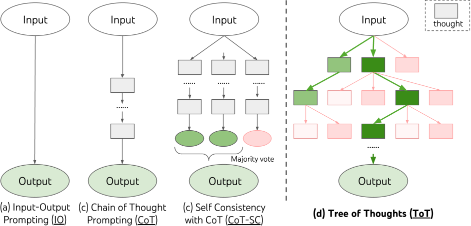
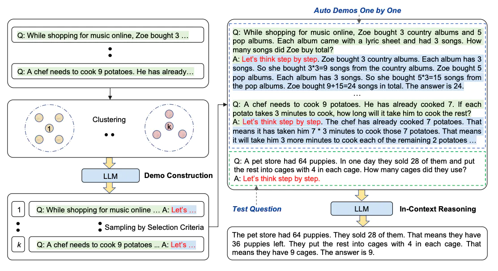
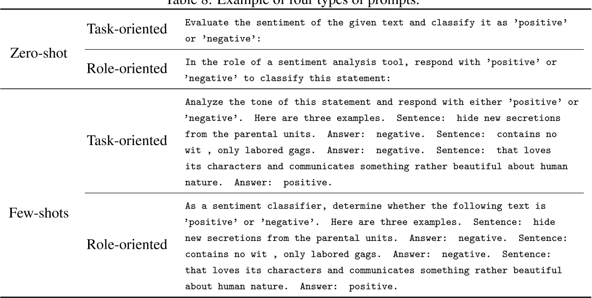

## Prompt

提示工程


- zero-shot 依赖模型本身
- frew-shot 外部注入例子


prompt的经验：
- Few-shot prompt通常有比较好的效果
    - 可能问题，偏见（对分类问题而言，生成问题，只有例子准确与否问题）。
- 角色扮演，有时可以提高其在特定任务上的性能
- 在推理任务中使用CoT/给模型时间去思考
    - 指定完成任务所需的步骤
    - 指导模型在下结论之前找出一个自己的解法
- 使用特定的输入输出格式，  使用分隔符(``` 等)清晰地表示输入的不同部分
    - 以下评论的作者是否表达了愤怒？评论用三个反引号分隔。给出是或否的答案。评论文本: \```{lamp_review_zh}```
- 善用温度temperature变量
    - 当其值为0时，表明模型输出结果是确定的，通常用于决定性任务，如分类、预测等；
    - 当其值>0时，越大，则表明模型随机性越强，适合生成任务。


- CoT 思维链

    - Few-shot CoT: 它是通过一些示例来提示模型，每个示例都包含手动编写（或模型生成的）高质量推理链。
    ```
    Question: Tom and Elizabeth have a competition to climb a hill. Elizabeth takes 30 minutes to climb the hill. Tom takes four times as long as Elizabeth does to climb the hill. How many hours does it take Tom to climb up the hill?
    Answer: It takes Tom 30*4 = <<30*4=120>>120 minutes to climb the hill.
    It takes Tom 120/60 = <<120/60=2>>2 hours to climb the hill.
    So the answer is 2.
    ===
    Question: Jack is a soccer player. He needs to buy two pairs of socks and a pair of soccer shoes. Each pair of socks cost $9.50, and the shoes cost $92. Jack has $40. How much more money does Jack need?
    Answer: The total cost of two pairs of socks is $9.50 x 2 = $<<9.5*2=19>>19.
    The total cost of the socks and the shoes is $19 + $92 = $<<19+92=111>>111.
    Jack need $111 - $40 = $<<111-40=71>>71 more.
    So the answer is 71.
    ===
    Question: Marty has 100 centimeters of ribbon that he must cut into 4 equal parts. Each of the cut parts must be divided into 5 equal parts. How long will each final cut be?
    Answer:
    ```
    - Zero-shot CoT：使用自然语言语句等明确鼓励模型首先生成推理链，然后提示产生答案
        - Let's think step by step
        - Therefore, the answer is
        - Let's work this out it a step by step to be sure we have the right answer

- ToT 思维树




- Auto-CoT 



对问题进行多样性采样，并通过LLM生成推理链来构建演示demonstrations， 步骤：

- 对问题进行聚类(Question Clustering):将给定问题集合Q利用Sentence-BERT编码后进行K-means聚类,得到k个问题簇。
- 采样生成demonstrations(Demonstration Sampling): 对每个簇i,选择代表性问题q,利用GPT-3的zero-shot prompting生成该问题的reasoning chain (包含rationale和answer)。如果生成的rationale和answer满足一定规则(例如长度不超过阈值),则将其作为该簇的demonstration di。
- 利用生成的k个demonstration [d1, d2, ..., dk]进行in-context学习:将demonstrations和测试问题concat起来作为GPT-3的输入,生成测试问题的reasoning chain。

主要思想是:
(1) 问题聚类可以产生语义上不同的问题,有利于生成reasoning skills不同的demonstrations。
(2) zero-shot prompting可以自动生成rationale,但可能存在错误。采样不同簇的代表问题,可以降低错误率的影响。
(3) 设定一定规则筛选生成的rationale,可以过滤错误较多的长语句,提高质量。

```
rationale指的是问题解决过程中的中间推理步骤。
在CoT(Chain of Thought)提示中,会要求语言模型生成一个系列的中间推理步骤(rationale),以解释最终的答案是如何得出的。
例如,对于算术问题"小明有5个苹果,得到2个苹果,现在他有几个苹果?",一个可能的rationale是:
"小明原先有5个苹果。他又得到了2个苹果。所以现在他总共有5+2=7个苹果。"
这个rationale详细解释了如何从问题描述 step by step 推导出答案7,充当了问题解决过程的解释和佐证。
所以在CoT提示任务中,要求语言模型不仅输出最终答案,还需输出解决过程的rationale,以证明其进行了逻辑推理而不是盲猜。
```

## REF

- books:

  - [Prompt 学习指南](https://prompt-guide.xiniushu.com/) 推荐
    - [Learn Prompting](https://learnprompting.org/docs/intro) 英文原版
  - [吴恩达《ChatGPT Prompt Engineering for Developers》课程中文版](https://prompt-engineering.
    - [《ChatGPT Prompt Engineering for Developers》中文笔](https://cloud.tencent.com/developer/article/2286467)

- [Prompt Engineering Guide](https://github.com/dair-ai/Prompt-Engineering-Guide) awesome 概念，prompt 相关论文


- blogs:
  - [Prompt 编写模式：如何将思维框架赋予机器](https://github.com/prompt-engineering/prompt-patterns) 模式:特定指令（By specific）,指令模板（Instruction Template）,代理模式(By proxy),示例模式（By demonstration） 等
    - 即零样本 (ZS)、少样本 (FS)、面向角色的提示和面向任务的prompt
    - [理解 Prompt：基于编程、绘画、写作的 AI 探索与总结](https://github.com/prompt-engineering/understand-prompt)

  - [OpenAI Cookbook](https://github.com/openai/openai-cookbook)
    
  - [LangChain AI Handbook](https://www.pinecone.io/learn/series/langchain/langchain-prompt-templates/)
  
  - [Lilian Weng's blog](https://lilianweng.github.io/posts/2023-03-15-prompt-engineering/)
    - 在与指令模型交互时，我们应该详细描述任务需求，尽量具体和精确，避免说“不做某事”，而是指定要做什么
    - 解释所需的受众是另一种给出指示的明智方式,For example to produce education materials for kids
    
  - [《大模型时代的科研》之2: Prompt Engineering (提示词工程)](https://zhuanlan.zhihu.com/p/631922240)


  - [PromptBench](https://arxiv.org/abs/2306.04528) 
    - 当前llm中对对抗性提示的鲁棒性普遍缺乏，词级攻击(即使是同义词)证明了最有效的(33%的性能下降)
    - few-shot 鲁棒性优于 zero-shot
    - 面向角色的提示在 SST-2（情感分析） 和 QQP （等价句子）数据集中表现出更高的鲁棒性，而面向任务的提示在 MRPC（句子解释）、QNLI、SQuAD V2（自然语言推理） 和 IWSLT 数据集中更有弹性。
      - 面向任务的prompt：明确描述了模型需要执行的任务，即鼓励模型仅根据其预训练知识生成特定于任务的输出。
      - 
    - 模型鲁棒性比较：UL2 在鲁棒性方面明显优于其他模型，其次是 T5 和 ChatGPT，Vicuna 表现出最小的鲁棒性
      - UL2 和 T5 对情感分类 (SST-2)、大多数 NLI 任务和阅读理解 (SQuAD V2) 的攻击的脆弱性较小。
      - UL2 在翻译任务中表现出色，而 ChatGPT 在某些 自然语言推理 NLI 任务中表现出鲁棒性
    - 句子级攻击，为什么比单词攻击更好？注意力分布更加维持在关键词，保证了结果正确。
    - 对攻击更加敏感的单词：在 CoLA 任务中，带有“动作”、“回答”和“检测”的提示似乎不太容易受到影响。但是带有“分析”、“答案”和“评估”等单词的提示似乎更容易受到攻击。
      - 处理：1.输入预处理，拼写检查 2.结合低质量数据，训练中包含低质量的问题，提升弹性 3.微调
    

- [Yao, Shunyu, et al. Tree of Thoughts: Deliberate Problem Solving with Large Language Models](https://arxiv.org/pdf/2305.10601.pdf)
    - ToT 允许 LM 通过考虑多个不同的推理路径和自我评估选择来决定下一个动作过程来执行深思熟虑的决策，以及在做出全局选择时展望未来或回溯。
    - ToT 在需要非平凡规划或搜索的三个新任务上显着提高了语言模型的问题解决能力：24, Creative Writing 和 Mini Crosswords 的游戏.


