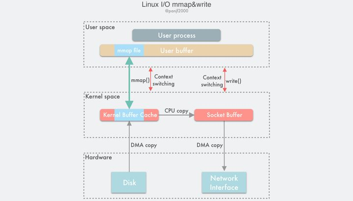
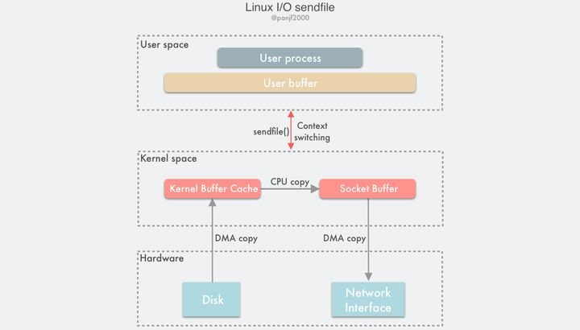
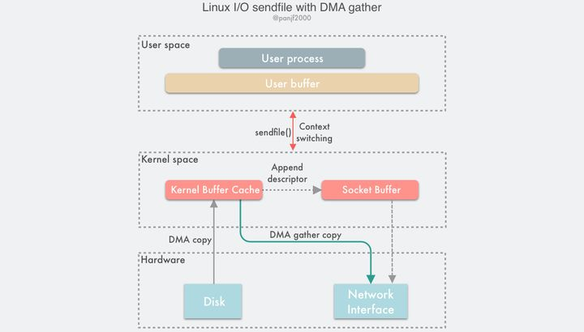
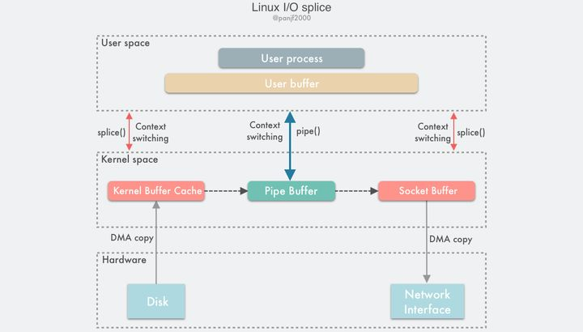
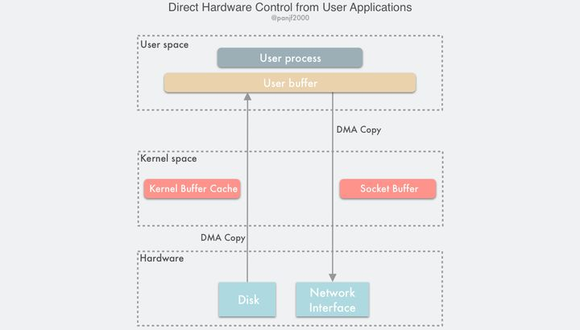
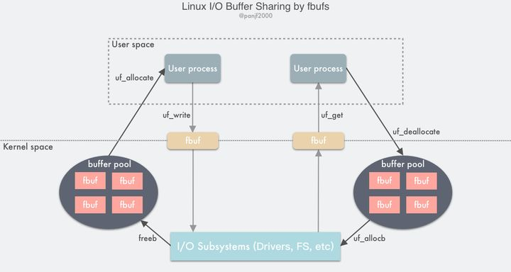

# IO性能改进技术

[TOC]

## 1. Zero-copy 零拷贝

### 1.1 Zero-copy定义

> Zero-copy指，计算机执行操作时，CPU不需要先将数据从某处内存复制到另一个特定区域。
>
> 通常用于通过网络传输文件时节省CPU周期和内存带宽。

操作系统的相关的组件：驱动程序，文件系统，网络协议栈。

- 节省CPU周期，减少或无CPU拷贝
- 减少用户空间与内核空间切换次数

远程直接内存访问（RDMA）协议深度依赖零复制技术。

### 1.2 实现方式

- 共用缓冲区
  - 指示通道子系统将数据块从一个文件或设备读入缓冲区，然后从同一缓冲区写入另一个缓冲区，而无需移动数据。
  - 依赖：
    - 硬件DMA直接内存访问进行复制
      - DMA 代替CPU作用
    - 硬件[内存管理单元](https://en.wikipedia.org/wiki/Memory_management_unit)(MMU)的内存映射mmap功能
      - 翻译虚拟存储器地址到物理内存地址
- 指针传递
  - [异构系统架构](https://en.wikipedia.org/wiki/Heterogeneous_System_Architecture)(HSA)，让CPU 和 GPU的统一地址空间[（统一内存访问UMA）](https://en.wikipedia.org/wiki/Uniform_memory_access)，使CPU和GPU以及其他处理器传递指针方式共享数据

### 1.3 内存映射mmap

Linux 内核给每个进程都提供了一个独立的虚拟地址空间，并且这个地址空间是连续的。

虚拟地址空间

- 内核空间
  - 访问：内核态
  - 大小
    - 32位   1G （0xC000 0000 ~ 0xFFFF FFFF）
    - 64位  128T
- 用户空间
  - 访问：用户态
  - 大小
    - 32位 3G
    - 64位 128T
  - 分段（地址从低到到高）
    - 只读段
      - 代码，常量
    - 数据段
      - 全局变量
    - 堆
      - 动态分配的内存，从低地址开始向上增长
      - C  malloc()
        - 小块brk() ，释放时缓存重用
        - 大块（>128K），使用内存映射 mmap() 
        - 通过 malloc() 申请内存后，内存并不会立即分配，在首次访问时，才通过缺页中断分配内存
    - 文件映射
      - 动态库、共享内存等，从高地址开始向下增长
      - C mmap()， 释放直接归还系统
        - 由于立即释放，不缓存容易发生缺页中断
    - 栈
      - 局部变量和函数调用的上下文
      - 大小固定，一般是 8 MB

进程的虚拟地址空间远大于实际物理内存地址空间

内存映射，指将**虚拟内存地址**映射到**物理内存地址**。

方式：内存管理单元 MMU的页表

linux mmap方法：将文件物理地址和进程虚拟地址进行映射。

作用：

- 匿名映射
  - 父子进程共享内存
- 磁盘文件映射进程的虚拟地址空间（手动管理文件加载）
  - 减少一次内存拷贝，文件的页不用先拷贝到内核缓存区，而是直接拷贝到用户空间的缓冲区

mmap 文件回收：

使用mmap映射时指定MAP_LOCKED参数：指定此参数后mmap()函数会调用mlock()将内存区域锁定，防止被换出到磁盘。

### 1.4 Linux I/O 读写

#### 1.4.1 mmap() & write()

- 用户进程调用 `mmap()`，从用户态陷入内核态，将内核缓冲区映射到用户缓存区；
- DMA 控制器将数据从硬盘拷贝到内核缓冲区；
- `mmap()` 返回，上下文从内核态切换回用户态；
- 用户进程调用 `write()`，尝试把文件数据写到内核里的套接字缓冲区，再次陷入内核态；
- CPU 将内核缓冲区中的数据拷贝到的套接字缓冲区；
- DMA 控制器将数据从套接字缓冲区拷贝到网卡完成数据传输；
- `write()` 返回，上下文从内核态切换回用户态。

优点：

- 节省一半内存缓冲区空间
- 减少一次CPU拷贝
  - 内核态到用户态
- 合计
  - 用户态和内核态的切换4次
  - 2 次 DMA 拷贝+ 1次CPU拷贝

缺点：

- 仍然存在一次CPU拷贝
- 内存映射开销
  - 修改页表，用内核缓冲区里的文件数据汰换掉当前TLB里的缓存

#### 1.4.2 sendfile()

@since Linux2.1

`sendfile()` 将 `mmap()` + `write()` 系统调用合并成一个系统调用。Windows 对应 `TransmitFile()`。

- 用户进程调用 `sendfile()` 从用户态陷入内核态；
- DMA 控制器将数据从硬盘拷贝到内核缓冲区；
- CPU 将内核缓冲区中的数据拷贝到套接字缓冲区；
- DMA 控制器将数据从套接字缓冲区拷贝到网卡完成数据传输；
- `sendfile()` 返回，上下文从内核态切换回用户态

优点：

- 减少2次用户态和内核态的上下文切换开销
- 合计
  - 用户态和内核态的切换2次
  - 2 次 DMA 拷贝和 1 次 CPU 拷贝

应用：静态文件服务器

大文件传输：`sendfile64`

缺点：

- 未标准化， 在Linux 上的接口实现与其他类 Unix 系统的实现并不相同
- 存在CPU拷贝，污染CPU的高速缓存

#### 1.4.3 sendfile() with DMA Scatter/Gather Copy

@since linux 2.4

需要网卡支持SG-DMA。

- 用户进程调用 `sendfile()`，从用户态陷入内核态；
- DMA 控制器使用 scatter 功能把数据从硬盘拷贝到内核缓冲区进行离散存储；
- CPU 把包含内存地址和数据长度的缓冲区描述符拷贝到套接字缓冲区，DMA 控制器能够根据这些信息生成网络包数据分组的报头和报尾
- DMA 控制器根据缓冲区描述符里的内存地址和数据大小，使用 scatter-gather 功能开始从内核缓冲区收集离散的数据并组包，最后直接把网络包数据拷贝到网卡完成数据传输；
- `sendfile()` 返回，上下文从内核态切换回用户态。

优点：

- 无CPU拷贝（元信息拷贝，忽略不计），无CPU参与，不污染CPU 的高速缓存
- 合计
  - 用户态和内核态的切换2次
  - 2 次 DMA 拷贝

缺点：

- 需要新硬件支持
- 输入文件描述符只能指向文件

#### 1.4.4 splice()

@since linux 2.6.17

与 `sendfile()` 类似但是可以实现在任意类型的两个文件描述符时之间传输数据。

- 用户进程调用 `pipe()`，从用户态陷入内核态，创建匿名单向管道，`pipe()` 返回，上下文从内核态切换回用户态；
- 用户进程调用 `splice()`，从用户态陷入内核态；
- DMA 控制器将数据从硬盘拷贝到内核缓冲区，从管道的写入端"拷贝"（内存地址指针的拷贝）进管道，`splice()` 返回，上下文从内核态回到用户态；
- 用户进程再次调用 `splice()`，从用户态陷入内核态；
- 内核把数据从管道的读取端"拷贝"到套接字缓冲区，DMA 控制器将数据从套接字缓冲区拷贝到网卡；
- `splice()` 返回，上下文从内核态切换回用户态。

优点：

- 真正完全无CPU拷贝
- 使用管道pipe软件实现，而非新硬件，依赖更低
- 合计
  - 用户态和内核态的切换6次
  - 2 次 DMA 拷贝

#### 1.4.5 send() with MSG_ZEROCOPY

@since linux 4.14  （tcp） 5.0 （UDP）

基本原理：

通过 `send()` 把数据在用户缓冲区中的分段指针发送到 socket 中去，利用 page pinning 页锁定机制锁住用户缓冲区的内存页，然后利用 DMA 直接在用户缓冲区通过内存地址指针进行数据读取，实现零拷贝

详细：**[paper](https://netdevconf.org/2.1/papers/netdev.pdf)**

优点：

- 支持用户缓冲区的数据
  - 前面的，只能处理原始文件，不能加工数据（使用文件描述符）

缺点：

- 只适用于大文件
  - 有page pinning 页锁定和等待缓冲区释放消息通知开销
- 异步发送数据，需要额外调用 `poll()` 和 `recvmsg()` 系统调用等待 buffer 被释放，会导致多次用户态和内核态的上下文切换
- MSG_ZEROCOPY 目前只支持发送端，接收端暂不支持。

#### 1.4.6 绕过内核直接IO

两种实现方式：

- 用户直接访问硬件
  - 思想：取消硬件抽象，直接与硬件沟通。
  - 应用：MPI 高性能通信，统一内存访问UMA。
  - 缺点：
    - 避免频繁用户空间的数据缓冲区内存页必须进行 page pinning（页锁定）的开销，需要分配和注册一个持久的内存池，用于数据缓冲
- 内核控制访问硬件
  - 内核会控制 DMA 引擎去替用户进程做缓冲区的数据传输
  - 依赖新硬件

#### 1.4.7 内核缓冲区和用户缓冲区之间的传输优化

硬件设备之间的数据可以通过 DMA 进行传输，只适用于那些用户进程不需要直接处理数据的场景，比如静态文件服务器或者是直接转发数据的代理服务器。

更广泛的场景是：

用户缓冲区和内核缓冲区之间的数据传输

（在用户进程内处理数据，然后再发送）

##### 1.4.7.1 动态重映射与写时复制 (Copy-on-Write)

改善对（内核）共享缓存区的data race。使用写时复制代替同步阻塞读写共享的缓冲区。

使用写时复制，用户进程读取磁盘文件进行数据处理最后写到网卡的过程：

- 用内存映射技术让用户缓冲区和内核缓冲区共享了一段内存地址并标记为只读 (read-only)，避免数据拷贝
- 把数据写到网卡时，用户进程使用异步写的方式，系统调用直接返回
- 内核进行异步进行数据传输。
- 发生新进程写共享缓冲区，产生cow事件，把数据复制到自己的缓冲区去修改。
  - 新进程尝试写只读内存页，MMU抛出异常，内核处理异常，为该进程分配一份物理内存并复制数据到此内存地址，重新向 MMU 发出执行该进程的写操作。

优点：

- 节省内存
- 减少数据拷贝

缺点：

- 只适合读多写少场景， COW 事件开销远大于一次CPU拷贝开销。

##### 1.4.7.2 缓冲区共享 (Buffer Sharing)

- 发送方用户进程调用 `uf_allocate` 从自己的 buffer pool 获取一个 fbuf 缓冲区，往其中填充内容之后调用 `uf_write` 向内核区发送指向 fbuf 的文件描述符；
- I/O 子系统接收到 fbuf 之后，调用 `uf_allocb` 从接收方用户进程的 buffer pool 获取一个 fubf 并用接收到的数据进行填充，然后向用户区发送指向 fbuf 的文件描述符；
- 接收方用户进程调用 `uf_get` 接收到 fbuf，读取数据进行处理，完成之后调用 `uf_deallocate` 把 fbuf 放回自己的 buffer pool。

缺点：

- 依赖于用户进程、操作系统内核、以及 I/O 子系统协作，尚未成熟

### 1.5 程序支持

- linux 内核系统调用
  - sendfile、sendfile64以及splice
- windows
  - TransmitFile API
- 编程语言
  - Java NIO
    - java.nio.channels
    - FileChannel transferTo/transferTo 
  - C/C++
    - mmap()
  - go
  - rust

## REF

- [wiki:Zero-copy](https://en.wikipedia.org/wiki/Zero-copy)
-  [Zero Copy I: User-Mode Perspective in Linux Journal - January 1, 2003](http://www.linuxjournal.com/article/6345?page=0,0)
- [【Linux应用编程】mmap内存映射](https://blog.csdn.net/qq_20553613/article/details/105183418)  mmap demo
- [15 | 基础篇：Linux内存是怎么工作的？](http://www.gcjlovecl.ltd/12-Linux%E6%80%A7%E8%83%BD%E4%BC%98%E5%8C%96%E5%AE%9E%E6%88%98/03-%E5%86%85%E5%AD%98%E6%80%A7%E8%83%BD%E7%AF%87%20%288%E8%AE%B2%29/15%E4%B8%A8%E5%9F%BA%E7%A1%80%E7%AF%87%EF%BC%9ALinux%E5%86%85%E5%AD%98%E6%98%AF%E6%80%8E%E4%B9%88%E5%B7%A5%E4%BD%9C%E7%9A%84%EF%BC%9F.html)  虚拟地址空间，内存映射
- [Linux 中 mmap() 函数的内存映射问题理解？](https://www.zhihu.com/question/48161206/answer/110418693)
- [mmap文件映射方式导致系统平响异常情况分析](http://gao-xiao-long.github.io/2017/04/27/mmap-page-out/)
- [阿里二面：什么是mmap？](https://mp.weixin.qq.com/s/czMlM6xuuyq2XlU_FB9aVQ)
- [认真分析mmap：是什么 为什么 怎么用](https://www.cnblogs.com/huxiao-tee/p/4660352.html)
- [Linux I/O 原理和 Zero-copy 技术全面揭秘](https://zhuanlan.zhihu.com/p/308054212) linux io读写
- [原来 8 张图，就可以搞懂「零拷贝」了](https://www.cnblogs.com/xiaolincoding/p/13719610.html)  pagecahe, 异步IO

