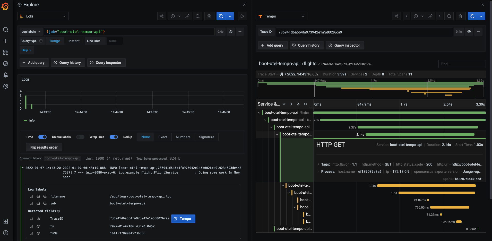
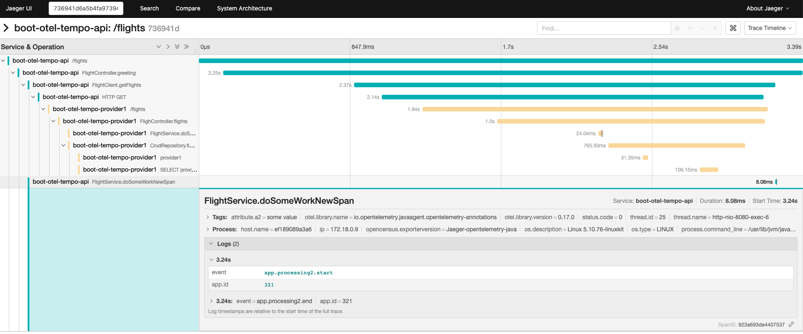
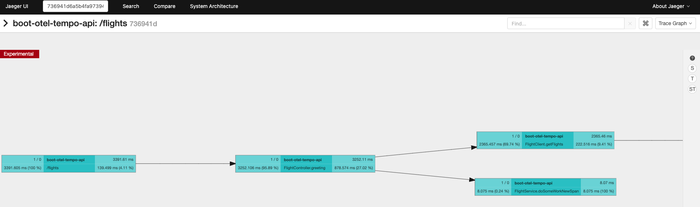
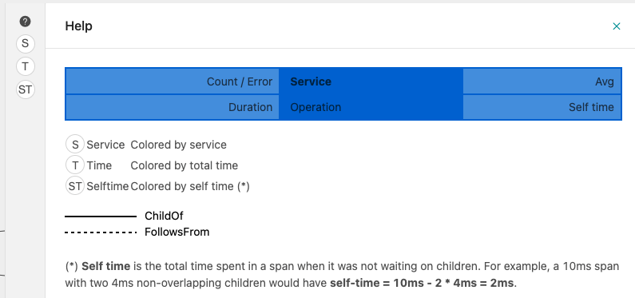
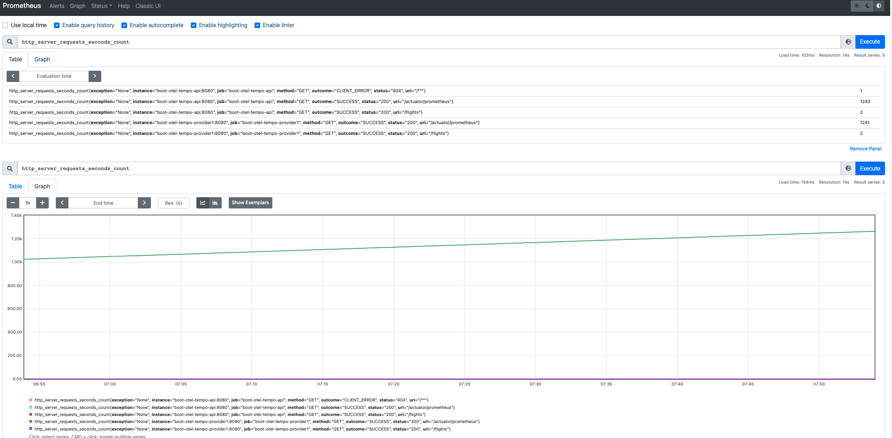
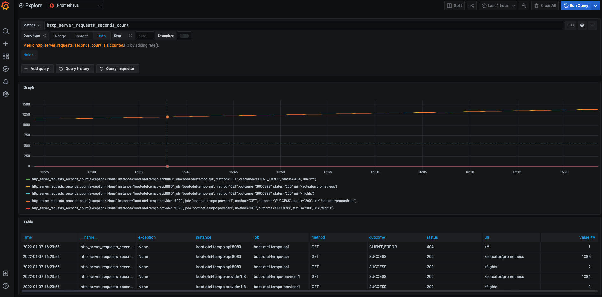

# OpenTelemetry笔记

## 1. 简介

OpenTelemetry 是 CNCF 合并 OpenTracing 和 OpenCensus 项目时创建的开源可观察性框架。

- OpenTracing 为流行平台提供“一致的、富有表现力的、与供应商无关的API” 。

- Google 创建的 OpenCensus 项目提供 “特定语言库的集合，用于检测应用程序、收集统计数据（指标）和将数据导出到受支持的后端”。


组件：

- 跨语言规范
  - （每个语言依然需要自己定义规范的接口）
- 收集、转换和导出遥测数据的工具
- 每个语言的 SDK
- 自动检测和 contrib 包


其优势在于，通过 Context 中的trace id 提供统一的可观察性，联系 tracing，metrics， logging。

## 2. 规约

- **API：**定义用于生成和关联跟踪 trace 、度量 metrics 和日志 logging 数据的数据类型和操作。
- **SDK：**定义特定于语言的 API 实现的要求。此处还定义了配置、数据处理和导出概念。
- **数据：**定义遥测后端可以提供支持的 OpenTelemetry Line Protocol (OTLP) 和与供应商无关的语义约定。
  - 所有 OpenTelemetry SDK 都支持 OTLP 协议 。
  - 该协议可用于将数据发送到 OpenTelemetry Collector，这是一个独立的二进制进程，可以作为服务实例的代理或 sidecar 运行，也可以在单独的主机上运行。
  - 然后可以将收集器配置为将此数据转发和导出到您选择的分析工具。


### 2.1 trace

- `Span`
  - 跨度，表示跟踪中的单个操作
  - 通过 `SpanBuilder. startSpan() `方法创建，而 SpanBuilder 通过 Tracer 获取，并开始
  - `Span.end() `方法结束
  - 成员
    - span 名字
      - 例如，get_account， account _ id = 42作为span 的属性
    - `SpanKind` span 类型
      - 描述 Span、它的父级和它的子级之间的关系
    - 不可变的`SpanContext` 唯一标识 span
    - 父 `SpanContext` 或 null
    - 开始，结束时间戳
    - 属性
    - Links 到其他Span 的列表（父，孩子）
    - 带时间戳的 event 列表
    - Status 状态
  - 关键方法(处理记录status，不能在end() 调用后再调用下面的方法)
    - `SpanContext getSpanContext();` 获取 SpanContext
    - `Span addEvent(String name, Attributes attributes);` 添加事件
      - 事件 `Event`
        - 事件名称
        - 事件事件戳（可用户自定义，可超过span 时间戳）
        - 0或多个属性描述事件
    - `<T> Span setAttribute(AttributeKey<T> key, T value);` 添加属性
    - `void end(long timestamp, TimeUnit unit);` 结束 Span
- `SpanBuilder`
  - Span 的构造器
  - 设置 Span 属性
    -  父 SpanContext
    - 链接（并行执行的跟踪 ）到SpanContext
    - 属性（实现不提供访问属性的公有接口，除了SpanContext）
      - string , long/double/boolean 
      - AttributeKey\<T> key, T value
    - 开始时间戳
- `SpanContext`
  - 跨度上下文包含必须传播到子跨度和跨进程边界的状态。
  - 符合 W3C TraceContext 规范
    - 包含两个标识符—— TraceId 和 SpanId ——以及一组通用的 TraceFlags 和系统特定的 TraceState 值。
      - TraceId，SpanId String 类型
- `Context`
  - 传播机制（传播 Span ），它在 API 边界和逻辑关联的执行单元之间承载执行范围的值。
  - 功能
    - 提取 span 从 Context
    - 插入 span 到Context
- `Tracer` 
  - `SpanBuilder spanBuilder(String spanName);` 获取 span 创建器
  - 不负责配置，而由 TracerProvider 负责
- `TracerProvider`
  - 包含任何配置的有状态对象
  - 一般全局，但是允许多个实例
  - `Tracer get(String instrumentationName, String instrumentationVersion);` 获取 tracer
    - instrumentationName 标识检测库 例如 io.opentelemetry.contrib.mongodb


### 2.2 metrics

- `MeterProvider`
  - 提供 Meters
  - 包含任何配置的有状态对象，全局对象，允许创建多个
  - 方法
    - `Meter get(String instrumentationName);`  获取 Meter
- `Meter`
  - 仪表，负责创建 Instruments
  - 方法，提供各种仪器的构建器
    - `LongCounterBuilder counterBuilder(String name);` 创建一个（非负增量）计数器构建器
      - 计算字节数，请求数量，错误数量等
    - `LongUpDownCounterBuilder upDownCounterBuilder(String name);` 创建一个升降计数器构建器，支持增量和减量
      - 活跃的请求数量，队列中项目的数量
    - `DoubleHistogramBuilder histogramBuilder(String name);` 创建一个直方图构建器，报告有统计意义的任意值，总数，百分位数等（只有同步类型）
      - 请求持续时间，响应载荷 payload 大小
    - `DoubleGaugeBuilder gaugeBuilder(String name);` 创建一个测量构建器，Measurement 表示通过度量 API 向 SDK 报告的数据点。
- `Instrument` 
  - 仪器，用于报告测量结果
  - 成员
    - 名字
    - 类型
    - 单位
    - 描述
  - 分类
    - 同步
      - 与业务逻辑一同调用，例如计数器
    - 异步
      - 注册回调函数方式更新
- `Measurement`
  - 测量，通过 Metrics API 向 SDK 报告的数据点。
  - 成员
    - 值
    - 属性


### 2.3 并发

对于支持并发执行的语言，trace API 提供了特定的保证和安全性，并非所有 API 函数都可以安全地并发调用。

- **TracerProvider** - 所有方法都可以安全地同时调用。

- **Tracer** - 所有方法都可以安全地同时调用。

- **Span** - **Span 的**所有方法都可以安全地同时调用。
- **事件**- 事件是不可变的，可以安全地同时使用。
- **链接**- 链接是不可变的，可以安全地同时使用。

Metrics API 提供了特定的保证和安全。

- **MeterProvider** - 所有方法都可以安全地同时调用。

- **Meter** - 所有方法都可以安全地同时调用。

- **Instrument** - 任何 Instrument 的所有方法都可以安全地同时调用。


## 3. 收集器Collector

[OpenTelemetry  Collector](https://github.com/open-telemetry/opentelemetry-collector)  是一个与平台无关的代理，可以接收、处理和导出遥测数据。它支持接收多种格式的遥测数据（例如，OTLP、Jaeger、Prometheus 以及许多商业/专有工具）并将数据发送到一个或多个后端。

它还支持在导出之前处理和过滤遥测数据。[Collector contrib](https://github.com/open-telemetry/opentelemetry-collector-contrib) 包带来对更多数据格式和供应商后端的支持。


组件：

- receivers：如何将数据导入到收集器中；可以是基于推或拉的
- processors: 如何处理接收到的数据
- exporters: 将接收到的数据发送到哪里；这些可以是基于推或拉的


## 4. 语言SDK 

- [open-telemetry/opentelemetry-go](https://github.com/open-telemetry/opentelemetry-go)
- [open-telemetry/opentelemetry-cpp](https://github.com/open-telemetry/opentelemetry-cpp)

- [open-telemetry/opentelemetry-java](https://github.com/open-telemetry/opentelemetry-java)
- [open-telemetry/opentelemetry-rust](https://github.com/open-telemetry/opentelemetry-rust)


## 5. 自动Instrumentation

OpenTelemetry为许多库提供自动检测，以便应用开发者可以追踪到第三方依赖库的检测数据。

[注册表](https://opentelemetry.io/registry/)


## 6. open-telemetry/opentelemetry-java使用

#### **6.1 grade 配置**

```grade
implementation(platform("io.opentelemetry:opentelemetry-bom:1.9.1"))
implementation('io.opentelemetry:opentelemetry-api:1.9.1')
implementation('io.opentelemetry:opentelemetry-sdk:1.9.1')
implementation('io.opentelemetry:opentelemetry-exporter-otlp:1.9.1')
```

#### **6.2 基本例子**

```java
// 可以在这里设置时间获取器
SdkTracerProvider sdkTracerProvider =
  SdkTracerProvider.builder()
  .addSpanProcessor(
  BatchSpanProcessor.builder(OtlpGrpcSpanExporter.builder().build()).build())
  .build();

OpenTelemetry openTelemetry =
  OpenTelemetrySdk.builder()
  .setTracerProvider(sdkTracerProvider)
  .setPropagators(ContextPropagators.create(W3CTraceContextPropagator.getInstance()))
  .buildAndRegisterGlobal();

// 获取tracer
Tracer tracer = openTelemetry.getTracer("instrumentation-test", "1.0.0");

Span span = tracer.spanBuilder("my span").startSpan();
// 设置属性
span.setAttribute("Attribute 1", "first attribute value");
// put the span into the current Context
try (Scope scope = span.makeCurrent()) {
  // your use case
} catch (Throwable t) {
  span.setStatus(StatusCode.ERROR, "Change it to your error message");
} finally {
  span.end(); // closing the scope does not end the span, this has to be done manually
}

// 创建时指定时间
Span span =
  tracer.spanBuilder("my span").setStartTimestamp(start, TimeUnit.NANOSECONDS).startSpan();
// put the span into the current Context
try (Scope scope = span.makeCurrent()) {
  // your use case
} catch (Throwable t) {
  span.setStatus(StatusCode.ERROR, "Change it to your error message");
} finally {
  span.end(
    end,
    TimeUnit.NANOSECONDS); // closing the scope does not end the span, this has to be done
  // manually
}

/*
性能微基准测试，通过 tracer 创建 span 开销
Benchmark                                                  (LOOPS)  Mode  Cnt     Score     Error  Units
OpenTelemetryBenchmark.perfCreateSpan                      1000000  avgt    5   428.728 ±  62.724  ms/op
OpenTelemetryBenchmark.perfCreateSpanWithCpuTimeNanos      1000000  avgt    5  3459.132 ± 454.878  ms/op
OpenTelemetryBenchmark.perfCreateSpanWithCurrentTimeNanos  1000000  avgt    5   473.822 ± 156.281  ms/op
*/
```

实现类说明:

- `SdkTracerProvider` 
  - sdk 实现的`TracerProvider` 用于创建 tracer
  - 成员
    - `Clock` span 时间获取对象
      - 默认，` JavaVersionSpecific.get().currentTimeNanos();`
    - `IdGenerator`  SpanId，TraceId id 生成器
    - `Resource` 应用身份标识等资源
    - `Supplier<SpanLimits>` span属性限制提供器（最大值长度，属性数量，事件数，连接数等）
    - `Sampler` span的采样器
    - `List<SpanProcessor>` span 处理器列表
      - 处理器，用于处理 span 同步 hook 操作，例如将其发送到 exporter
- `BatchSpanProcessor`
  - Sdk 实现的 `SpanProcessor` ，用于将批量的 span 发送到 Exporter  
- `OtlpGrpcSpanExporter` 
  - sdk 实现的的 `SpanExporter`，通过 gRPC 使用 OpenTelemetry's protobuf （OTLP）导出 span 
- `W3CTraceContextPropagator`
  - sdk 实现的`ContextPropagators` 用于从context 中提取或注入 Span


数据结构:

- Resource（资源）： 代表应用程序的执行环境中的资源，如主机、进程、服务等。Resource 对象包含有关资源的属性，例如类型、标识符等。资源的例子可能包括计算资源、网络资源或其他相关的环境信息。

- Spans： 跨度是跟踪系统中的基本数据单元，表示应用程序执行路径中的一段时间。它可以包含有关操作的信息，例如开始时间、结束时间、操作名称、上下文信息等。

- ResourceSpans： 是将资源和相应的跨度数据组合在一起的结构。它表示在特定资源上执行的一组跨度。这有助于组织和关联跨度数据，使其能够更好地反映应用程序的执行上下文和资源关系。


#### **6.3 API 使用**

```java
// 1.创建基本的 Span
Span span = tracer.spanBuilder("my span").startSpan();
// put the span into the current Context
try (Scope scope = span.makeCurrent()) {
	// your use case
	...
} catch (Throwable t) {
    span.setStatus(StatusCode.ERROR, "Change it to your error message");
} finally {
    span.end(); // closing the scope does not end the span, this has to be done manually
}

// 2. 创建嵌套的 Span
// 2.1 手动
void parentOne() {
  Span parentSpan = tracer.spanBuilder("parent").startSpan();
  try {
    childOne(parentSpan);
  } finally {
    parentSpan.end();
  }
}

void childOne(Span parentSpan) {
  Span childSpan = tracer.spanBuilder("child")
  			// 手动链接父 Span
        .setParent(Context.current().with(parentSpan))
        .startSpan();
  try {
    // do stuff
  } finally {
    childSpan.end();
  }
}
// 2.2 线程内自动
void parentTwo() {
  Span parentSpan = tracer.spanBuilder("parent").startSpan();
  try(Scope scope = parentSpan.makeCurrent()) {
    childTwo();
  } finally {
    parentSpan.end();
  }
}
void childTwo() {
  Span childSpan = tracer.spanBuilder("child")
    // NOTE: setParent(...) is not required;
    // `Span.current()` is automatically added as the parent
    .startSpan();
  try(Scope scope = childSpan.makeCurrent()) {
    // do stuff
  } finally {
    childSpan.end();
  }
}

// 2.3 跨进程跟踪
Span childRemoteParent = tracer.spanBuilder("Child").setParent(remoteContext).startSpan();

// 2.4 跨服务跟踪
// Extract the SpanContext and other elements from the request.
Context extractedContext = openTelemetry.getPropagators().getTextMapPropagator()
  .extract(Context.current(), httpExchange, getter);
try (Scope scope = extractedContext.makeCurrent()) {
  // Automatically use the extracted SpanContext as parent.
  Span serverSpan = tracer.spanBuilder("GET /resource")
    .setSpanKind(SpanKind.SERVER)
    .startSpan();
  try {
    // Add the attributes defined in the Semantic Conventions
    serverSpan.setAttribute(SemanticAttributes.HTTP_METHOD, "GET");
    serverSpan.setAttribute(SemanticAttributes.HTTP_SCHEME, "http");
    serverSpan.setAttribute(SemanticAttributes.HTTP_HOST, "localhost:8080");
    serverSpan.setAttribute(SemanticAttributes.HTTP_TARGET, "/resource");
    // Serve the request
    ...
  } finally {
    serverSpan.end();
  }

// 2.5 从 context 获取 Span
Span span = Span.fromContext(context)  

// 3. Span Attributes 属性
// 一些通用属性，具有规约
Span span = tracer.spanBuilder("/resource/path").setSpanKind(SpanKind.CLIENT).startSpan();
span.setAttribute("http.method", "GET"); // 操作属性
span.setAttribute("http.url", url.toString()); //结果属性

  
// 4. Span 事件
span.addEvent("Init");  // 自动使用当前时间作为添加的事件的时间戳
span.addEvent("process", attributes, timestamp, NANOSECONDS); // 指定事件属性，时间戳  
span.addEvent("End");   // 事件可以携带零个或多个Span Attributes  
  
// 5. 链接 Span 与其他有因果关系的 Span  
Span child = tracer.spanBuilder("childWithLink")
        .addLink(parentSpan1.getSpanContext())
        .addLink(parentSpan2.getSpanContext())
        .addLink(parentSpan3.getSpanContext())
        .addLink(remoteSpanContext)
    .startSpan();  
  
// 6. 指标 Metrics  
// Gets or creates a named meter instance
Meter meter = meterProvider.meterBuilder("instrumentation-library-name")
        .setInstrumentationVersion("1.0.0")
        .build();

// Build counter e.g. LongCounter
LongCounter counter = meter
      .counterBuilder("processed_jobs")
      .setDescription("Processed jobs")
      .setUnit("1")
      .build();

// It is recommended that the API user keep a reference to a Bound Counter for the entire time or
// call unbind when no-longer needed.
BoundLongCounter someWorkCounter = counter.bind(Attributes.of(stringKey("Key"), "SomeWork"));


// Record data
someWorkCounter.add(123);

// Alternatively, the user can use the unbounded counter and explicitly
// specify the labels set at call-time:
counter.add(123, Attributes.of(stringKey("Key"), "SomeWork"));
```

#### 6.4 boot-opentelemetry-tempo

[boot-opentelemetry-tempo](https://github.com/mnadeem/boot-opentelemetry-tempo) 是 opentelemetry-java 的一个演示例子， 可以观察 opentelemetry 与其他项目集成的效果。

- 用于监控和警报的[Prometheus](https://prometheus.io/)

- 用于分布式日志记录的[Loki](https://grafana.com/oss/loki/)
- 分布式追踪后端 [Grafana Tempo](https://grafana.com/oss/tempo/)内部使用[Jaeger](https://www.jaegertracing.io/)
  - 存储和查询跟踪
- 用于可视化的[Grafana](https://grafana.com/)

快速本地部署(MacOS)：

```
1. 安装 docker， 直接官网 https://docs.docker.com/desktop/mac/install/ 下载 dep 包

2. 安装 docker-compose
brew install docker-compose

3. 克隆， 编译 image
git clone git@github.com:mnadeem/boot-opentelemetry-tempo.git
cd boot-opentelemetry-tempo
mvn clean package docker:build

4. 启动
docker-compose up
```


效果展示：



[Grafana 探索](http://localhost:3000/explore)，根据 logki 查询 `{job="boot-otel-tempo-api"}`  日志

```
2022-01-07 14:43:20	
2022-01-07 00:43:19.888  INFO [boot-otel-tempo-api,736941d6a5b4fa973942e1a5d0026ca9,923a693de4407537] 7 --- [nio-8080-exec-6] i.o.example.flight.FlightService         : Doing some work In New span 
```

Tempo 弹框展示 日志对应的 TraceID 为 `736941d6a5b4fa973942e1a5d0026ca9` tracing 内容。

解释：

- 跟踪服务：`boot-otel-tempo-api: /flights`   绿色
  - 耗时 3.39 s
  - 生成 11 个 Span
  - Span 详情
    - Tags 记录了一些属性（http 属性，线程属性，用户自定义属性） 
      - net.peer.port 49012 端口号
      - span.kind  "server" 服务端 Span
      - attribute.a2 "some value" 用户自定义属性
    - Process 
      - host.name "d4bbe002a683"
      - ip "172.18.0.7"
      - process.pid 6
      - process.runtime.ddescription "IcedTea OpenJDK 64-Bit Server VM 25.212-b04" JDK 版本信息
    - Logs （手动创建的 Span ）
      - 记录了事件
        - event "app.processing2.start"  事件名
        - app.id "321" 事件属性
  - 调用子服务：`boot-otel-tempo-provider1: /flights` 黄色


也可以在 Jaeger 页面查看 tracing 内容，感觉更友好。默认时间轴显示，其他格式

- Graph 从左到右的树形调用
  - 耗时百分比，孩子和自身耗时比例
-  JSON json 格式

http://localhost:16686/trace/736941d6a5b4fa973942e1a5d0026ca9

时间轴：



图形显示：






**prometheus 展示 metrics ：**[link](http://localhost:9090/graph?g0.expr=&g0.tab=1&g0.stacked=0&g0.range_input=1h)

查询 指标名为 `http_server_requests_seconds_count` (其他指标，如 `http_server_requests_seconds_sum`) 结果：

- 表格形式
  - 相同指标名，但有不同 labels 的单独作为一个指标
  - 可指定时间范围
- 图形形式
  - 显示指定时间范围内指标变化情况




通过 [Grafana](http://localhost:3000/explore?orgId=1&left=["now-1h","now","Prometheus",{"expr":"http_server_requests_seconds_count","requestId":"Q-0a6b4a46-2eeb-428a-b98d-0170a5fe4900-0A"}])  展示 metrics (推荐) ：




(TODO: more prometheus 通过 Grafana 展示)


#### 6.5 HBase

[HBASE-22120](https://issues.apache.org/jira/browse/HBASE-22120) 使用 OpenTelemetry 替换 HTrace  跟踪系统。

- RPC 系统添加了 OpenTelemtry 支持，所有 rpc 方法都将在客户端和服务器端进行跟踪
- 除了扫描和协处理器相关的方法外，Table 接口中的大多数方法也被跟踪
  - 由于现在扫描实现始终是“异步预取”，我们还没有找到合适的方法来表示前台和后台跨度之间的这种关系。
  - 服务器端，由于同样的原因，我们只使用一个 span 来记录 WAL 同步操作的时间，而没有跟踪到后台同步线程。


## REF

- [OpenTelemetry](https://opentelemetry.io/)
- [Github: open-telemetry/opentelemetry-java](https://github.com/open-telemetry/opentelemetry-java)
  - [boot-opentelemetry-tempo](https://github.com/mnadeem/boot-opentelemetry-tempo)
- [Prometheus 实战](https://songjiayang.gitbooks.io/prometheus/content/)
  - [Grafana 使用](https://songjiayang.gitbooks.io/prometheus/content/visualiztion/grafana.html)

