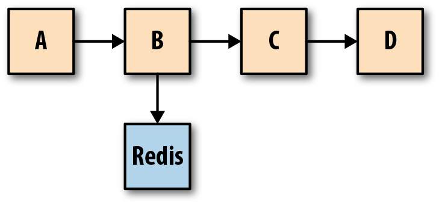

# 分布式系统的可观测性Observability

## 1. 概念

可观测性Observability，是衡量一个**系统的内部状态**可以从其外部**输出**的知识中**推断**出来的程度。

软件系统中的可观察性取决于记录、监控和跟踪不同服务器、应用程序进程、数据进程和硬件进程的能力。

通常使用[logging](https://en.wikipedia.org/wiki/Log_file)和[tracing](https://en.wikipedia.org/wiki/Tracing_(software))等技术来提高系统的可观测性。


> Lack of observability is like driving with closed eyes: You can’t tell how close you are to a disaster. The faster you are driving and the busier the road, the more you should watch out.


### 1.1 Tracing&Metrics&logging

日志logging、指标merics和跟踪tracing通常被称为可观察性observability的三大支柱。

#### **Event Logs**

一个*事件日志*是发生在时间离散事件的不可变，时间戳记录。

形式：

- 纯文本，text
- 结构化数据，如json
- 二进制
  - Protobuf 格式的日志、用于复制和时间点恢复的 MySQL 二进制日志、systemd 日志日志、pflogBSD 防火墙日志pf

事件日志，能够提供在平均值和百分比情况下不会浮出水面的长尾的有价值的上下文信息，有助于发现分布式系统组件所表现出的**突发**和**不可预测的行为**。

分析复杂的分布式系统中，发现的特定组件发生的特定时间，需要确定触发原因，需要的工作：

- 从特定系统中由高级metrics或日志事件确定的症状开始
- 推断跨分布式体系结构的不同组件的请求生命周期
- 反复地询问关于系统各部分之间交互的问题

traces和metrics是建立在日志之上的抽象，正交，一个是以请求为中心(traces) ，另一个是以系统为中心(metrics)。

日志的优缺点：

- 优点

  - 最容易生成，也容易检测（grep关键字）
    - 已经有各种各种日志框架，如log4j

- 缺点

  - 由于日志记录的开销而导致性能欠佳

    - 解决方式，智能采样

  - 日志消息也可能丢失

  - 原始日志被规范化，过滤，存储在ES，BigQuery中，但是可能由于ES无法跟上对扔向它的大量数据的索引，导致显示无法真实反映系统的情况

    - 将日志处理作为流处理问题

  - 需要日志的分析工具（splunk）进一步处理

    - > 企业期望：筛选出用户总共查看本文不到100次的异常值国家
      >
      > 实际软件工程师需要通过分析工具
      >
      > =》 筛选器用于执行超过100个数据库查询的异常值页面加载。
      >
      > =》只显示从法国加载的页面，加载时间超过10秒

#### **Metrics**

指标Metrics是一段时间内测量的数据的数字表示。

指标可以利用数学建模和预测，获得系统在当前和未来的时间间隔内的行为。

由于**数字**可以被存储、处理、压缩和检索而优化，因此度量能够更长时间地保留数据，并且更容易查询。

使得指标非常适合于构建反映历史趋势的**仪表板**。

指标，还允许逐渐降低数据分辨率，经过一段时间后，数据可以聚合成每天或每周的频率。


> *A Prometheus metric sample* 
>
> 旧有的时序数据库，最大的缺点是无法很好地进行探索性分析或过滤的度量标准的识别，典型的是层次metrics模型和缺乏标签的旧版本Graphite。
>
> 现代的metrics系统，都使用一个metric 名字，和有标签的键值对来表示，使其具有更高的维度，便于分析。


指标Metrics对比事件日志的优势：

- metrics传输和存储的开销是恒定的
  - 指标的成本不会随着用户流量或任何其他可能导致数据急剧上升的系统活动而同步增加
  - metrics的存储成本只是随着标签值的排列而增加
- 更具有数学、概率和统计转换的可塑性
  - 抽样、聚合、概括和相关性
  - 更适合于报告系统的总体健康状况
- 更适合触发警报
  - 效率，可靠性
    - 只需要在内存中运行查询，而不需从ES等分布式系统中进行统计分析查询

指标Metrics的缺点：

- 与日志一样，都是系统范围的，无法理解特定系统外的信息
  - 而为请求分类，打上系统外的标签，会导致存储开销的增加

- 多组件的连接
  - 同样的问题，若使用UUID等作为标签，现有的系统的性能随着数据量增加而降低

**metric和log可以理解单个系统(有状态和无状态)的性能和行为，但它们不足以理解遍历多个系统的请求的生命周期。**

分布式跟踪技术解决了跨多个系统使请求的生命周期的可见性的问题。

#### **Tracing**

跟踪tracing是通过分布式系统对端到端请求流，进行编码的一系列**因果相关的分布式事件**的表示。

单个跟踪可以提供请求所经过的路径以及请求的结构的可见性。

基本思想：

**标识**在应用程序、代理、框架、库、运行时、中间件以及请求路径中的任何其他东西中**特定的点**(函数调用或 RPC 边界或并发的段，如线程、延续或队列)

- 执行流中的分叉(操作系统线程或绿线程)
- 穿过网络或进程边界的跳跃




> 一个请求流的跟踪表示
>
> 一个跟踪是spans（跨度）的有向无环图DAG
>
> spans之间的边，被称为引用Reference。


收集这些信息并重构执行流，同时保留因果关系以便进行回顾性分析和故障排除，这样可以更好地理解请求的生命周期。

了解了整个请求生命周期，就可以调试跨越多个服务的请求，从而查明延迟或资源利用率增加的来源。

Zipkin 和 Jaeger 是两个最流行的兼容 opentracing 的开源分布式跟踪解决方案


Tracing的挑战：

- 在现有基础设施中进行改造
- 开发人员仅仅检测他们的代码是不够的，项目可能依赖额外工具的开放源码框架或库
  - 多语言体系结构

- 性能成本问题
  - 通过采样控制，控制请求是否需要被tracing

#### Service Meshes

Service Meshes 服务网格。服务网格的数据平面Data planes在代理层实现了追踪和统计信息的收集，这使得人们可以将单个服务视为黑匣子，但是仍然可以在整个网格中获得统一和全面的可观察性。

作为网格一部分的应用程序，仍然需要将头文件转发到网格中的下一跳，但是不需要额外的检测。

流行的服务网格工具Lyft。


### 1.2 CNCF observability

**CNCF 可观测性技术雷达**


>技术雷达：
>
>Adopt 采纳： CNCF 最终用户社区可以明确推荐这项技术。我们已经在许多团队中长期使用它，并且证明它是稳定和有用的。
>
>trial 评判：CNCF 最终用户社区已成功使用它，我们建议您仔细研究该技术。
>
>Assess 评估：CNCF 最终用户社区已经尝试过，我们发现它很有希望。当您对项目中的技术有特定需求时，我们建议您查看这些项目。


**CNCF TAG Observability** 

- 用于检测、收集、处理、存储、查询、管理和关联观察数据（例如指标、日志记录/事件、跟踪跨度和云原生工作负载分析）的方法。
- 使用**分布式跟踪工具**观察微服务之间的一系列调用，以了解时间花在哪里。
- 在企业级管理可观察性工具和系统的复杂性、运营成本和资源消耗。
- 有意义的警报、查询和操作仪表板的最佳实践，包括如何管理规则、定义、阈值和策略等内容。
- 开发人员、运营商、站点可靠性工程师 (SRE)、IT 工程师和其他参与者如何理解、处理和推理分布式云原生系统。
- 包含新颖且富有洞察力的方法来利用可观察性数据的项目，例如：
  - ML、模型训练、贝叶斯网络和其他支持异常和入侵检测的数据科学技术。
  - 将资源消耗与成本数据相关联，以降低云原生基础架构的总成本
  - 使用服务网格、协调器和其他指标源公开的可观察性数据来通知持续部署工具（例如 Canary Predicates/Judges）。
- 客观策划和生成与向最终用户提供可观察性工具/系统有关的案例研究。
- 围绕可观察性及其持续改进的最佳实践，例如事后分析、运行手册
- 提供指导并促进可观察性解决方案之间的互操作性，而无需尝试强制执行某一特定标准。
- 促进对 SLI/KPI、服务目标和内部/外部承诺等可观察性的先决条件和基石的理解。


## 2. 分布式系统实践

### 2.1 Prometheus

开源的metrics（指标）和 alerting（告警） 监控解决方案。

#### 特性

- 高纬度数据模型-时间序列
  - 时间戳，指标名称和一组字符串键值对标签，样本值float64
  
  - ```
    <--------------- metric ---------------------><-timestamp -><-value->
    http_request_total{status="200", method="GET"}@1434417560938 => 94355
    ```
  
- 查询
  - PromQL 对收集的时间序列数据进行切片和切块，生成临时图表和警告alerts
    - `rate(http_requests_total[5m])` HTTP请求量的增长率
    - `topk(10, http_requests_total)` 当前系统中，访问量前10的HTTP地址
  
- 可视化数据模式
  - 浏览器
  - [grafana](https://grafana.com/docs/grafana/latest/getting-started/getting-started/)
  - 控制台
  
- 存储
  - 样本数据以时间序列形式存储在内存和本地磁盘
  - 功能分片shard，联邦federation进行扩展
  
- 部署
  - 每个server独立，单机
  
- 告警
  - 通知用户
  
- 集成
  - 支持第三方数据桥接到Prometheus显示
    - 系统统计信息，Docker,HAproxy,StatD, JMX指标

[thanos](https://thanos.io/) 高可用，长期存储的Prometheus，支持全局查询视图和指标的无限保留（基于对象存储）。


#### 组件

- Prometheus Server
  - 负责实现对监控数据的获取，存储以及查询
    - 静态配置管理监控目标
    - 使用Service Discovery方式动态管理监控目标，并获取数据
  - 提供了自定义的PromQL语言，实现对数据的查询以及分析
  - 内置的Express Browser UI，可以直接通过PromQL实现数据的查询以及可视化
- Exporter
  - 将监控数据采集的端点通过HTTP服务的形式暴露给Prometheus Server
  - 分类
    - 直接采集，Exporter 内置对Prometheus监控的支持，如cAdvisor，Kubernetes，Etcd，Gokit，TiDB等
    - 间接采集


Prometheus metrics类型：

- Counter（计数器）
  - 只增不减（除非系统发生重置）
  - 示例，http_requests_total，node_cpu，通常以_total 作为后缀
- Gauge（仪表盘）
  - Gauge类型的指标侧重于反应系统的当前状态， 样本数据可增可减
  - 示例，node_memory_MemFree（主机当前空闲的内容大小）、node_memory_MemAvailable（可用内存大小）
  - `delta(cpu_temp_celsius{host="zeus"}[2h])`   CPU温度在两个小时内的差异
  - `predict_linear(node_filesystem_free{job="node"}[1h], 4 * 3600)`  预测系统磁盘空间在4个小时之后的剩余情况
- Histogram（直方图）
  - 用于统计和分析样本的分布情况
  - 弥补CPU的平均使用率，页面的平均响应时间等长尾样本的影响
  - 显示不同区间内样本的个数，区间通过标签len进行定义，以及count，sum
  - 也可以通过histogram_quantile()函数 计算分位数
- Summary（摘要）
  - 用于统计和分析样本的分布情况
  - 百分位数，0.5，0.9，0.99，以及count，sum


[prometheus client-java](git@github.com:prometheus/client_java.git) 提供 jvm  版本 Prometheus metrics 的定义，相对于OpenTelemetry，提供了对 metrics的值的可访问性，OpenTelemetry-java 提供其 OpenTelemetry 的metrics 到 Prometheus metrics 的转换。


#### [常见的可观察性策略](https://grafana.com/docs/grafana/latest/best-practices/common-observability-strategies/)

- USE， 适合基础架构中的硬件资源，例如 CPU、内存和网络设备。
  - **利用率 -**资源繁忙的时间百分比，例如节点 CPU 使用率
  - **饱和度 -**资源必须完成的工作量，通常是队列长度或节点负载
  - **错误 -**错误事件的计数
- RED，适用于服务，尤其是微服务环境。对于每项服务，通过检测代码公开每个组件的这些指标。
  - **速率 -**每秒请求数
  - **错误 -**失败的请求数
  - **持续时间 -**这些请求所花费的时间，延迟测量的分布
- Google SRE 四个系统指标
  - **延迟 - 处理**请求所花费的时间
  - **流量 -**对您的系统有多少需求
  - **错误 -**失败的请求率
  - **饱和度——**你的系统有多“满”


### 2.2 OpenMetrics

OpenMetrics 开放指标，一种规范，以几乎 100% 向后兼容的方式构建并扩展在[Prometheus 展示格式](https://prometheus.io/docs/instrumenting/exposition_formats/)。


### 2.3 Jeager

Jaeger由Uber 创建，是一个受 Google Dapper 论文和 OpenZipkin 社区启发的开源分布式跟踪系统。它可用于跟踪基于微服务的架构，包括分布式上下文传播、分布式事务监控、根本原因分析、服务依赖分析和性能/延迟优化。 2019 年从CNCF毕业。


### 2.4 OpenTelemetry

OpenTelemetry 是 CNCF 合并 OpenTracing 和 OpenCensus 项目时创建的开源可观察性框架。

OpenTracing 为流行平台提供“一致的、富有表现力的、与供应商无关的API” 

Google 创建的 OpenCensus 项目提供 “特定语言库的集合，用于检测应用程序、收集统计数据（指标）和将数据导出到受支持的后端。”


##  REF

- [wiki: Observability](https://en.wikipedia.org/wiki/Observability)
- [Metrics, Tracing, and Logging - Peter Bourgon](https://peter.bourgon.org/blog/2017/02/21/metrics-tracing-and-logging.html)
- [wiki: CNCF](https://en.wikipedia.org/wiki/Cloud_Native_Computing_Foundation) 云原生计算基金会
- [distributed systems observability](https://www.oreilly.com/library/view/distributed-systems-observability/9781492033431/ch04.html)
  - free e-book
- [What was observability again?](https://elastisys.com/what-was-observability-again/)
- [CNCF：可观测性技术雷达](https://radar.cncf.io/2020-09-observability) 2020.09
  - [CNCF 技术雷达概览](https://radar.cncf.io/overview)
- [做出让人爱不释手的基础软件：可观测性和可交互性](https://pingcap.com/zh/blog/how-to-develop-an-infrasoft-observability-and-interactivity)
- [我眼中的分布式系统可观测性](https://pingcap.com/zh/blog/observability-of-distributed-system)
  - [TiDB 4.0 新特性前瞻（一）拍个 CT 诊断集群热点问题 ](https://pingcap.com/zh/blog/tidb-4.0-key-visualizer) key visualizer
- [prometheus](https://prometheus.io/) 
  - [github: prometheus](https://github.com/prometheus/prometheus)
- [github: OpenMetrics](https://github.com/OpenObservability/OpenMetrics)
- [OpenTelemetry](https://opentelemetry.io/)
- ["Everything You Wanted to Know About Distributed Tracing" ](https://github.com/keyvanakbary/learning-notes/blob/master/talks/everything-you-wanted-to-know-about-distributed-tracing.md) by Hungai Kevin Amuhinda 笔记，标题夸张了，不如直接看open telemetry 官网介绍
  - [youtube](https://www.youtube.com/watch?v=HSgb7gOO1Ig)
  - [slides](https://www.slideshare.net/KevinHungai/everything-you-wanted-to-know-about-distributed-tracing)
- [slides: introduction_to_distributed_tracing](https://qconsp.com/sp2018/system/files/presentation-slides/introduction_to_distributed_tracing.pdf) 微服务，ziplin
- [slides: Distributed Tracing](https://www.usenix.org/sites/default/files/conference/protected-files/lisa17_slides_cotton.pdf) 125 pages
- [github: awesome-observability](https://github.com/adriannovegil/awesome-observability)
- [microsoft: 监控云应用的最佳实践](https://docs.microsoft.com/en-us/azure/architecture/best-practices/monitoring)
- [opentracing 中文版翻译-吴晟](https://wu-sheng.gitbooks.io/opentracing-io/content/)
- [github: apache skywalking](https://github.com/apache/skywalking) 基于opentracing
- [SkyWalking 极简入门](https://skywalking.apache.org/zh/2020-04-19-skywalking-quick-start/)
- [Apache SkyWalking：使用分析解决分布式跟踪的盲点](https://skywalking.apache.org/blog/2020-04-13-apache-skywalking-profiling/#the-limitations-of-the-profile-method)
  - 在发现某个span长于预期之后，应该怎样做？添加更细粒度的span？
    - profiile
      - 合并线程转储（thread dumps）以估计线程转储中显示的每个方法的执行时间
      - 线程转储周期设置10ms
- [Service Mesh 中的可观察性实践](https://zhuanlan.zhihu.com/p/145524861)
  - SkyWalking vs OpenTelemetry  
    - 在agent 埋点差异不大，SkyWalking开启更久，提供对跟踪事件的更多的下游处理组件
    - profiile 功能，有些用，但是开销问题？
    - SkyWalking的官方示例， 使用了OpenTelemetry 来将 Istio 控制平面指标，Kubernetes 监控指标导入自身
    - OpenTelemetry 提供了代码自动注入、其他三方库的集成
    - 综上，应用内部埋点应该使用OpenTelemetry，外部可视化等可以尝试SkyWalking
- [可观察性统一方案-SLS兼容OpenTelemetry](https://developer.aliyun.com/article/766070)
- [Clickhouse OpenTelemtry支持](https://clickhouse.com/docs/zh/operations/opentelemetry/)
  - Clickhouse接受 HTTP 和本机协议上的跟踪上下文标头，为查询执行的某些阶段添加一些跨度，将它们存储在`system.opentelemetry_span_log`表中，并将跟踪上下文传播到远程 ClickHouse 服务器和 URL 引擎。
    - [issues#5182](https://github.com/ClickHouse/ClickHouse/issues/5182)
  - [system-tables/opentelemetry_span_log](https://github.com/ClickHouse/ClickHouse/blob/master/docs/zh/operations/system-tables/opentelemetry_span_log.md)
- [clickhouse query profilier](https://clickhouse.com/docs/zh/operations/optimizing-performance/sampling-query-profiler/)
  - 对执行线程执行的方法进行采样
- [Query-performance-analysis](https://sudonull.com/post/25704-Query-performance-analysis-in-ClickHouse-Yandex-Report-Yandex-Blog)
  - Query log 查询执行各种各样的指标 - 打开文件的次数、压缩块的数量、衬线缓存中的命中次数等
- [prometheus-book](https://yunlzheng.gitbook.io/prometheus-book/)
- [TiDB 监控框架概述](https://docs.pingcap.com/zh/tidb/stable/tidb-monitoring-framework)
- [Google SRE book](https://sre.google/sre-book/table-of-contents/)
- [spark monitoring](https://spark.apache.org/docs/latest/monitoring.html)
  - 基于[Dropwizard 指标库](http://metrics.dropwizard.io/4.2.0)  收集内存，jvm信息
- [深度解析｜基于 eBPF 的 Kubernetes 一站式可观测性系统](https://zhuanlan.zhihu.com/p/494316281)

