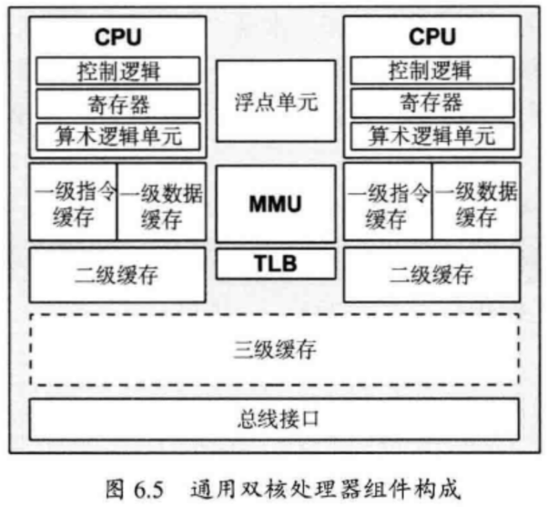

# 性能之巅-笔记

[TOC]

## 1.CPU

### 1.1 术语

- 处理器：物理芯片
- 核：独立CPU实例
- 硬件线程：在一个核上同时执行多个线程（超线程），每个线程是一个独立的CPU实例。
- CPU指令：单个CPU操作，如算术运算，内存IO，逻辑控制等
- 逻辑CPU：虚拟处理器，操作系统可调度的CPU实例。也即使用超线程技术，所使用的CPU实例
- 调度器：分配CPU给线程运行的内核子系统
- 运行队列：等待CPU服务的可运行线程队列

### 1.2 CPU模型

**架构**

单处理器，四核，8硬件线程。每个核，2个超线程。

操作系统，会将其视为8个逻辑CPU。

处理器组件

- P-cache：预取缓存，每个物理CPU一个
- W-cache：写缓存，每个物理CPU一个
- 时钟：CPU时钟信号生成器
- 时间戳计数器，为高精度时间，由时钟递增
- 微代码ROM：快速把指令转化为电路信号
- 温度传感器：温度监控
- 网络接口



**CPU内存缓存**

缓存自顶向下，空间越来越大，速度越来越慢。

- CPU寄存器
- 三级缓存（L1，L2，L3）
  - L1 缓存，现行流行的大小仍然是32KB指令+32KB数据缓存，每核  0.5ns
  - L2  1MB（指令+数据）  7 ns  (分支预测失败5ns)
  - L3 38.5 MB（指令+数据）  CPU共享
  - 问题：
    - 缓存一致性，内存中的数据可能被某个CPU修改，其他CPU需要知道缓存拷贝已经失效
- 主存
  - 60ns ， 也有指标100ns
- 存储设备（HDD，SSD）
  - HDD  256KB   12ms
  - SSD 4KB  120us
    - intel Optane  4KB 平均 接近最低的12us ，但P99 接近100us

REF: 

- [Intel Xeon Platinum 8176](https://www.spec.org/cpu2017/results/res2018q3/cpu2017-20180820-08541.html)  2018 年发布
- [性能分析-笔记](https://github.com/tianjiqx/notes/blob/master/performance/%E6%80%A7%E8%83%BD%E5%88%86%E6%9E%90-%E7%AC%94%E8%AE%B0.md)

**CPU运行队列**

多处理器系统，内核通常会为每个CPU提供一个运行队列，并且使线程每次放到同一个队列中，便于利用CPU缓存。同时避免，使用全局队列，被CPU共享时，需要对队列同步（mutex）的开销。

运行队列中的线程状态是：就绪运行

CPU上的线程状态：运行

- 调度器时延
  - 在队列中花在等待CPU运行的时间，也称队列时延，分发器队列时延
- CPU饱和度
  - 100% 使用的CPU是被称之为饱和的，此时线程会有调度器时延，等待CPU运行

### 1.3 概念

- 时钟频率
  - 每秒运行的时钟周期个数
  - 5GHz  每秒运行50亿个时钟周期
  - 更高的时钟周期不一定会提高性能——取决于CPU周期究竟做了什么。
    - 应该看完成的指令数
- 指令
  - 通过功能单元完成
  - 功能单元：指令预取，解码，执行，内存访问，寄存器写回
- 指令流水线
  - 同时激活多个功能单元，分别处理流水执行多条不同指令
- 指令宽度
  - 同一个类型的功能单元，硬件复制，以支持多指令，被称为超标量
  - 现代CPU一般宽度为3,4
    - 结合流水线和超标量技术，每个周期最多可以完成3,4个指令
- CPI 每指令周期数
  - 代表指令处理效率，但不代表指令本身的效率
  - 每周期指令数 IPC，其倒数
  - **CPI高，表示CPU经常停滞**，通常再访问内存
    - 因此，提高CPU频率，在访问内存情况下，只会产生更多的停滞周期，指令完成速率不变
  - 内存访问密集的负载，性能的提高
    - 更快的内存（DRAM）
    - 提高内存本地性（软件配置） ？
    - 减少内存IO次数
  - 范围：<1 ~ >10
- **CPU使用率**
  - 一段时间内CPU实例忙与执行工作的时间比例，百分比表示
  - CPU使用率的测量，包括所有活动的时钟周期，**包括内存停滞周期**
    - 有可能出现经常停滞等待IO，而导致高使用率
- 用户时间
  - CPU花在执行用户态应用程序代码的时间
- 内核时间
  - CPU花在执行内核态代码的时间
  - 包括
    - 系统调用
    - 内核线程
    - 中断
- 用户时间/内核时间
  - 计算密集型 接近 99/1
    - 图像处理，基因组学，数据分析
  - IO密集型  系统调用较多
    - 执行内核代码，进行IO操作
    - 进行网络IO的web服务  70/30
- 饱和度
  - 100% 使用的CPU是被称之为饱和
  - 云计算的虚拟化技术，可以控制CPU使用，即使没有达到100%，可运行的线程必须等待轮到使用的机会
  - 饱和运行的CPU，可以让更高优先级的工作抢占当前线程
- 抢占
  - 高优先级的线程，抢占当前正在运行的线程的CPU，并执行自己，节省队列时延
- 优先级反转
  - 低优先级的线程拥有了一项资源，从而阻塞高优先级线程运行的情况
    - 应当避免

- 多进程、多线程
  - fork() 进程
  - 不同进程可以exit()独立释放自己的内存，线程通过系统分配器，多线程竞争CPU，导致内存碎片化
    - 过多的线程同步和内存本地性下降可能导致性能下降
- 字长
  - 32/64 bits  
  - 整数大小，寄存器宽度
  - 地址空间大小，数据通路宽度
  - 编译相关优化，也会根据字长调整


MMU：虚拟地址，物理地址转换

可参考 [IO性能改进技术](https://github.com/tianjiqx/notes/blob/master/performance/IO%E6%80%A7%E8%83%BD%E6%94%B9%E8%BF%9B%E6%8A%80%E6%9C%AF.md) 介绍

- 互联
  - 多处理器架构，处理器（CPU）通过共享系统总线或者专用互联网络连接（intel QPI， amd HT）
    - 专用互联网络连接，可以提供无竞争的访问，比共享总线带宽更高
  - 可以连接处理器之外的组件，如IO控制器

- **CPU 性能计数器 CPC**
  - 别名性能测量点计数器PIC，性能监控单元PMU、硬件事件，性能监控事件
  - 计数器
    - CPU周期
    - CPU指令
    - 一二三级缓存访问：命中、未命中
    - 浮点单元：操作
    - 内存I/O：读、写、停止周期
    - 资源I/O：读、写、停止周期

### 1.4 方法

#### 1.4.1 工具法

利用工具，检查关键项指标

- `uptime`： 平均负载，超过CPU数量通常代表CPU饱和
  - load average: 0.00, 0.00, 0.00
    - 系统平均负载，统计最近1，5，15分钟的系统平均负载
- `vmstat`：每秒运行vmstat，检查空闲队列
  - `vmstat -SM 1 100`  每秒，总共采样100次， 内存以M为单位
  - **Procs（进程）**:
    - r: 运行队列中进程数量，可运行线程总数
    - b: 等待IO的进程数量
  - Memory（内存）:
    - swpd: 使用虚拟内存大小
    - free: 可用内存大小
    - buff: 用作缓冲的内存大小
    - cache: 用作缓存的内存大小
  - Swap:
    - si: 每秒从交换区写到内存的大小
    - so: 每秒写入交换区的内存大小
  - IO：（现在的Linux版本块的大小为1024bytes）
    - bi: 每秒读取的块数
    - bo: 每秒写入的块数
  - system：
    - in: 每秒中断数，包括时钟中断
    - cs: 每秒上下文切换数
  - **CPU字段（百分比）**
    - us: 用户进程执行时间(user time)
    - sy: 系统进程执行时间(system time)
    - id: 空闲时间(包括IO等待时间) 
      - id + us + sy = 100
    - wa: 等待IO时间
    - st: 偷取，CPU在虚拟化的环境下在其他租户上的开销
- `mpstat` : 检查单个热点CPU，挑出可能的线程扩展性问题
- `top/prstat`: 查看CPU消耗高的进程和用户
- `pidstat/prstat`: 把CPU消耗高的进程，分解为用户和系统时间
- `perf/dtrace/stap/oprofile`: 从用户或者内核时间，再分析CPU使用的堆栈跟踪，分析使用CPU的原因
- `perf/cpustat`:  测量CPI
  - CPI高，表示CPU经常停滞

#### 1.4.2 USE方法

性能调查的早期使用。

对每个CPU，检查

- 使用率
  - CPU繁忙时间
- 饱和度
  - 可运行线程排队程度
- 错误
  - CPU错误 ？


#### 1.4.3 负载特征归纳

负载特征，用于支持容量规划，基准测试，模拟负载。

CPU负载特征：

- 平均负载（使用率+饱和度）
- 用户时间：系统时间
  - CPU密集  or IO 密集
- 系统调用频率
- 自愿上下文切换频率
- 中断频率

例子：一台应用服务器，白天系统负载为2-8，取决于活跃客户数。用户时间/系统时间比例为60/40，即I/O 密集型负载，每秒执行100K次系统调用，高频率的自愿上下文切换。


多个核时，可以具体分析到某个特定CPU，发现问题。


#### 1.4.4 性能监控

发现一段时间内活跃的问题和行为模式。关键指标

- 使用率：繁忙百分比
  - 应该对每个CPU分别监控，以发现线程的扩展性问题
  - 记录云环境，CPU使用限制的量
  - 监控间隔，理想是1s一次，但是1s内也可能有爆发
- 饱和度：从系统负载推算出来的运行队列长度，或者线程调度延时的数值
  - 用于监控到，是否在短时间的波动


### 1.5 分析工具

- `uptime `平均负载
  - 汇总了正在允许的线程数（使用率）和正在排队的线程数（饱和度）计算得出
    - 使用率+线程调度时延
  - 平均负载 大于 CPU数量，表示CPU不足以服务线程，有线程在等待
  - linux目前，将不可中断状态执行磁盘IO也计入平均负载，导致该值，不一定完全代表CPU余量，饱和度。负载可能在CPU，磁盘IO间变化。因此推荐通过`vmstat(1)` 和 `mpstat(1)` 观察
- `vmstat`
- `mpstat`
  - 多处理器统计信息，可以报告每个cpu的统计信息
  - `mpstat -P ALL 1 10`  打印所有的CPU报告，间隔1s，打印10次，最后一次打印平均时间
    - -P 可以指定逻辑CPU id，0起始
    - `CPU    %usr   %nice    %sys %iowait    %irq   %soft  %steal  %guest  %gnice   %idle`
  - 字段：
    - **%usr**  用户态时间
    - %nice 以nice有限集运行的进程用户态时间
    - **%sys** 系统态时间
    - %iowait  磁盘I/O 等待
    - %irq  硬件中断CPU用量
      - irq/total * 100%
    - %soft 软件中断CPU用量
    - %steal 耗费在其他租户上时间
    - %guest 花在访客虚拟机上的时间
    - **%idle** CPU除去等待磁盘IO操作外的因为任何原因而空闲的时间闲置时间(%) 

常见情况：单CPU满，跑单线程，其余CPU空闲。

- `sar`
  - `sar -P ALL -u`  CPU相关，与mpstat 相同
    - `-q`  等待数+运行数，与vmstat r列相同
  - `sar -u [ <时间间隔> [ <次数> ] ]`

- `top`
  - 其他`htop`
- `pidstat` 按进程，线程打印CPU用量，区分用户态和系统态
  - `pidstat 1`
- `time` 运行命令，并记录CPU用量
  - real  全部时间，包括IO等待，user + sys < real
    - 多次运行可能real下降，因为文件缓存，无IO阻塞了
  - user 用户态
  - sys 系统态

- `DTrace` 分析用户级，内核级代码的CPU用量，跟踪函数执行，CPU交叉调用，中断，内核调度器
- `SystemTap` 跟踪调度时间
- `perf` 性能计数器，CPU调用路径
  - `perf stat <cmd>`


## 磁盘

### iotop
似于 top 的交互式系统监视工具，专门用于监控磁盘 I/O 使用情况。

```shell
sudo iotop

# 批处理模式（命令行模式） -b
sudo iotop -b -n 10 -d 5

```

- 顶部信息： 显示系统的总 I/O 使用情况。
- 进程列表： 显示当前系统中所有进程的 I/O 活动。
- 底部信息： 显示 iotop 的快捷键提示。

快捷键

- 左 / 右箭头键：调整排序字段。
- r：切换显示进程实际 I/O 活动。
- o：切换显示仅当前 I/O 活动进程。
- p：切换显示进程模式。
- a：切换显示累计 I/O 模式。
- q：退出 iotop。


- [交互式系统监视工具 iotop](https://blog.csdn.net/g310773517/article/details/141638424)


### sar 
```
sar -d [interval] [count]

-d 表示监控 块设备

- interval: 采样间隔时间（秒）。

- count: 采样次数。
 
```


### dd 测试磁盘读写性能

- 写入
time dd if=/dev/zero of=/mnt/disk1 bs=4k count=1000 oflag=dsync
直接写磁盘，无缓存，更能衡量高负载情况读写磁盘性能
oflag=direct

- 读取
time dd if=/mnt/disk1 of=/dev/null bs=4k count=1000 iflag=dsync


## REF

- 性能之巅  洞悉系统、企业与云计算  Brendan Gregg ， 俆章宁译
-  [Intel Xeon Platinum 8176](https://www.spec.org/cpu2017/results/res2018q3/cpu2017-20180820-08541.html)
- [性能分析-笔记](https://github.com/tianjiqx/notes/blob/master/performance/%E6%80%A7%E8%83%BD%E5%88%86%E6%9E%90-%E7%AC%94%E8%AE%B0.md)
- [Standard Performance Evaluation Corporation#CPU](https://www.spec.org/benchmarks.html#cpu)
- [uptime](https://man.linuxde.net/uptime)
- [vmstat](https://linuxtools-rst.readthedocs.io/zh_CN/latest/tool/vmstat.html)
- [mpstat](https://wsgzao.github.io/post/mpstat/)
- [sar](https://linuxtools-rst.readthedocs.io/zh_CN/latest/tool/sar.html)
- [perf](https://www.brendangregg.com/perf.html)
- [系统级性能分析工具perf的介绍与使用](https://www.cnblogs.com/arnoldlu/p/6241297.html)

扩展材料：

- [Linux性能优化：CPU篇](https://zhuanlan.zhihu.com/p/180402964)
- [Linux问题分析与性能优化](https://book.aikaiyuan.com/linux/www.lijiaocn.com/linux/chapter1/index.html)
- [Linux性能调优指南](https://lihz1990.gitbooks.io/transoflptg/content/) IBM redbooks
  - [书栈连接](https://www.bookstack.cn/read/transoflptg/0.md)
- [[肝] linux系统分析之工具大全(观测，性能分析等)](https://zhuanlan.zhihu.com/p/526432016)
 - atop,dstat,pidstat