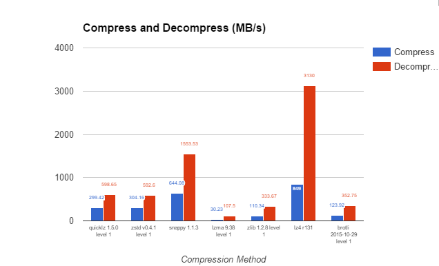
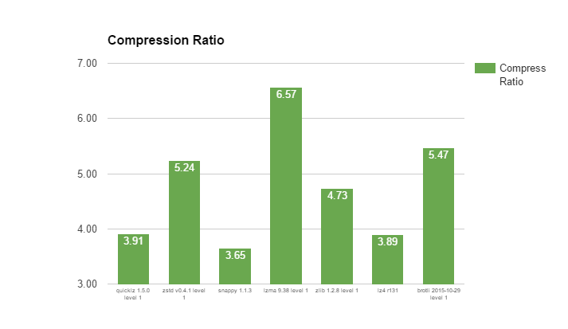

# 性能分析-笔记

[TOC]

## 1.时延

REF：[Latency Numbers Every Programmer Should Know](https://gist.github.com/jboner/2841832/raw/7e5cb7f173d0b59820f63cc6d489ec4f449bc126/latency.txt)

## 2. 带宽

### 2.1 内存

内存带宽计算公式：

**内存带宽=内存等效频率\*内存位宽/8**  MB/s

举例，6-channel DDR4-2400 ECC REG 192GB DRAMs的内存带宽为（6*2400*64/8 MB/s= 6 * 19200 MB/s = 6 * 18.75 GB = 112.5 GB/s）

### 2.2 磁盘

  机械硬盘读写速度：5400 r/s 60-90MB， 7200 r/s 130-190MB

  固态盘SSD: 

- stat2.0 r:225MB/S  w:71MB/S 
- stat3.0 r: 311MB/S,  根据近期文章 ，有更新说 理论到达 750Mb/s， 有效在600MB/s (**0.5GB/s**)
- NVMe :  r/w  2000 MB/s  / 1260 MB/s, 也是相当多的版本，还是使用保守一点的数据吧
- intel Optane： r /w  2,700 / 2,200 MB/s

磁盘的带宽 = 磁盘数量 * 单盘的读写速度

[NVMe 与 SSD：速度、存储和要避免的错误](https://www.promax.com/blog/nvme-vs-ssd-speed-storage-mistakes-to-avoid)

[how-fast-are-nvme-speeds](https://www.enterprisestorageforum.com/hardware/how-fast-are-nvme-speeds/)

[best ssd 2021](https://www.digitaltrends.com/computing/best-ssds/)

[io_uring、AIO 和现代存储设备之旅](https://clickhouse.tech/blog/en/2021/reading-from-external-memory/)

### 2.3 网络

同集群，广泛使用的1000Mb/s（1Gbps），10 000Mb/s（10Gbps） 连接。 

阿里云，最近ECS服务器，可选网络带宽，最大达到 64 Gbps（4GB/s）。

## 3. 压缩/解压

[通用数据库压缩算法评估'2016](https://www.percona.com/blog/2016/04/13/evaluating-database-compression-methods-update/) 

[lz4](https://github.com/lz4/lz4) 的最新2021测试对比， 解压速度已经达到4.8GB/s

|  Compressor             | Ratio   | Compression | Decompression |
|  ----------             | -----   | ----------- | ------------- |
|  memcpy                 |  1.000  | 13700 MB/s  |  13700 MB/s   |
|**LZ4 default (v1.9.0)** |**2.101**| **780 MB/s**| **4970 MB/s** |
|  LZO 2.09               |  2.108  |   670 MB/s  |    860 MB/s   |
|  QuickLZ 1.5.0          |  2.238  |   575 MB/s  |    780 MB/s   |
|  Snappy 1.1.4           |  2.091  |   565 MB/s  |   1950 MB/s   |
| [Zstandard] 1.4.0 -1    |  2.883  |   515 MB/s  |   1380 MB/s   |
|  LZF v3.6               |  2.073  |   415 MB/s  |    910 MB/s   |
| [zlib] deflate 1.2.11 -1|  2.730  |   100 MB/s  |    415 MB/s   |
|**LZ4 HC -9 (v1.9.0)**   |**2.721**|    41 MB/s  | **4900 MB/s** |
| [zlib] deflate 1.2.11 -6|  3.099  |    36 MB/s  |    445 MB/s   |

[zlib](http://www.zlib.net/)
[Zstandard](http://www.zstd.net/)

The benchmark uses [lzbench], from @inikep compiled with GCC v8.2.0 on Linux 64-bits (Ubuntu 4.18.0-17).
The reference system uses a Core i7-9700K CPU @ 4.9GHz (w/ turbo boost).
Benchmark evaluates the compression of reference [Silesia Corpus](http://sun.aei.polsl.pl/~sdeor/index.php?page=silesia) in single-thread mode.

LZ4 is also compatible and optimized for x32 mode,
for which it provides additional speed performance.

