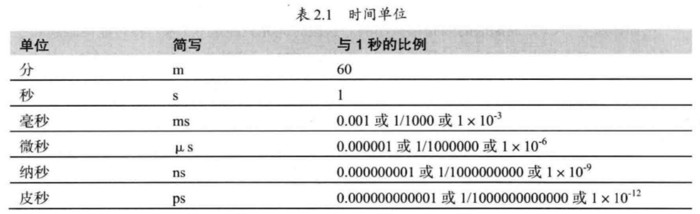
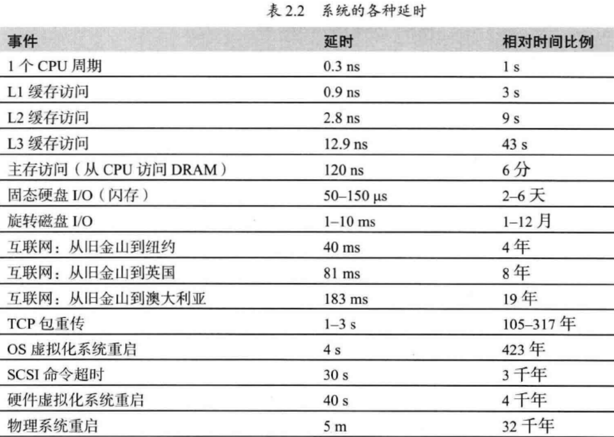

# 性能分析-笔记

[TOC]

## 1.延时


```
Latency Comparison Numbers (~2012)
----------------------------------
L1 cache reference                           0.5 ns
Branch mispredict                            5   ns
L2 cache reference                           7   ns                      14x L1 cache
Mutex lock/unlock                           25   ns
Main memory reference                      100   ns                      20x L2 cache, 200x L1 cache
Compress 1K bytes with Zippy             3,000   ns        3 us
Send 1K bytes over 1 Gbps network       10,000   ns       10 us
Read 4K randomly from SSD*             150,000   ns      150 us          ~1GB/sec SSD
Read 1 MB sequentially from memory     250,000   ns      250 us
Round trip within same datacenter      500,000   ns      500 us
Read 1 MB sequentially from SSD*     1,000,000   ns    1,000 us    1 ms  ~1GB/sec SSD, 4X memory
Disk seek                           10,000,000   ns   10,000 us   10 ms  20x datacenter roundtrip
Read 1 MB sequentially from disk    20,000,000   ns   20,000 us   20 ms  80x memory, 20X SSD
Send packet CA->Netherlands->CA    150,000,000   ns  150,000 us  150 ms
```

REF：[Latency Numbers Every Programmer Should Know](https://gist.github.com/jboner/2841832/raw/7e5cb7f173d0b59820f63cc6d489ec4f449bc126/latency.txt)

(旧数据，L2相当于现在的L3)

时间单位：



系统延时：




```
Core i7 Xeon 5500 Series Data Source Latency (approximate)               [Pg. 22]

local  L1 CACHE hit,                              ~4 cycles (   2.1 -  1.2 ns )
local  L2 CACHE hit,                             ~10 cycles (   5.3 -  3.0 ns )
local  L3 CACHE hit, line unshared               ~40 cycles (  21.4 - 12.0 ns )
local  L3 CACHE hit, shared line in another core ~65 cycles (  34.8 - 19.5 ns )
local  L3 CACHE hit, modified in another core    ~75 cycles (  40.2 - 22.5 ns )

remote L3 CACHE (Ref: Fig.1 [Pg. 5])        ~100-300 cycles ( 160.7 - 30.0 ns )

local  DRAM                                                   ~60 ns
remote DRAM                                                  ~100 ns
```

REF：[Approximate cost to access various caches and main memory?](https://stackoverflow.com/questions/4087280/approximate-cost-to-access-various-caches-and-main-memory)


## 2. 带宽

### 2.1 内存

内存带宽计算公式：

**内存带宽=内存等效频率\*内存位宽/8**  MB/s

举例，6-channel DDR4-2400 ECC REG 192GB DRAMs的内存带宽为（6 \* 2400 \* 64 / 8 MB/s= 6 * 19200 MB/s = 6  \* 18.75 GB = 112.5 GB/s）


“内存墙” 问题：

- 内存带宽 (100 GB/s)
- 内存时延（100ns）


**原始数据与计算数据**：

对数据进行计算，如sum，count，min，max操作，理论上单点的速度，受限于将原始数据拷贝到cpu计算内存带宽。使用向量化等技术，原始数据若在CPU cache时，可以突破内存带宽，此时受限于CPU cache的带宽。

向量化改进性能，使某一个操作，算子处理速度，超过内存带宽，是对原始数据量的多次计算，使用产生的计算输入数据进行作为处理数据量，非物理上越过内存墙。

因此，理论上，单节点内存带宽，在112.5 GB/s 时，最多对uint32类型的数据求和，计算 112.5 GB / 4B ，最多处理30 198 988 800 （约302亿行）。（若对数据进行编码，减少内存使用，平均1B大小表示，则可至1200亿行）


### 2.2 磁盘

**顺序访问**

 机械硬盘读写速度：5400 r/s 60-90MB， 7200 r/s 130-190MB

 固态盘SSD: 

- stat2.0 r:225MB/S  w:71MB/S 
- stat3.0 r: 311MB/S,  根据近期文章 ，有更新说 理论到达 750Mb/s， 有效在600MB/s (**0.5GB/s**)
- NVMe :  r/w  2000 MB/s  / 1260 MB/s, 也是相当多的版本，还是使用保守一点的数据吧
- intel Optane： r /w  2,700 / 2,200 MB/s

磁盘的带宽 = 磁盘数量 * 单盘的读写速度


**随机访问**

- 随机读取的最佳块大小是 HDD 256 KB，NVMe 和 SATA SSD 4 KB，英特尔傲腾 8 KB
  - HDD
    - 小于256KB，寻道时间远大于数据传输时间，单次访问延迟一致，**平均12ms** 
      - 简单估算时，一般把256KB 随机访问时间设置为**10ms**
    - 不调大块大小，为了更好的提高缓存利用率。免cache冷数据
  - SATA SSD
    - 读取大小为 4 KB 的块平均需要 **140 us**，并且随着块大小的增加，时间增长呈线性。
    - 从 SSD 读取 4 KB 块的 HDD 相比，速度快 80 倍
    - 对于 256 KB 块，SSD 比 HDD 快十倍
    - 当块大小足够大（4MB）时，SSD 仅比 HDD 快两倍
  - NVMe SSD
    - 延迟优于SATA SSD
    - 4 KB 的块大小，平均时间仅改善了一点（**120 us**？），但 99 个百分位数要低两倍
    - 读1MB不到1ms，而STAT SSD 需要3ms
  - 英特尔傲腾Optane
    - 最小延迟为 **12 us**，比 NVMe SSD 低 10 倍（100us）。平均延迟比 HDD低1000 倍（12ms）
      - 小块(4kb)读取延迟有相当大的波动：即使平均时间非常低且接近最小延迟，但最大延迟甚至 99 个百分点都明显更差（接近100us）


#### REF

- [NVMe 与 SSD：速度、存储和要避免的错误](https://www.promax.com/blog/nvme-vs-ssd-speed-storage-mistakes-to-avoid)

- [how-fast-are-nvme-speeds](https://www.enterprisestorageforum.com/hardware/how-fast-are-nvme-speeds/)

- [best ssd 2021](https://www.digitaltrends.com/computing/best-ssds/)

- [io_uring、AIO 和现代存储设备之旅](https://clickhouse.tech/blog/en/2021/reading-from-external-memory/)

### 2.3 网络

同集群，广泛使用的1000Mb/s（1Gbps），10 000Mb/s（10Gbps） 连接。 

阿里云，最近ECS服务器，可选网络带宽，最大达到 64 Gbps（4GB/s）。


## 3. 压缩/解压

[通用数据库压缩算法评估'2016](https://www.percona.com/blog/2016/04/13/evaluating-database-compression-methods-update/) 


[lz4](https://github.com/lz4/lz4) 的最新2021测试对比， 解压速度已经达到4.8GB/s

|  Compressor             | Ratio   | Compression | Decompression |
|  ----------             | -----   | ----------- | ------------- |
|  memcpy                 |  1.000  | 13700 MB/s  |  13700 MB/s   |
|**LZ4 default (v1.9.0)** |**2.101**| **780 MB/s**| **4970 MB/s** |
|  LZO 2.09               |  2.108  |   670 MB/s  |    860 MB/s   |
|  QuickLZ 1.5.0          |  2.238  |   575 MB/s  |    780 MB/s   |
|  Snappy 1.1.4           |  2.091  |   565 MB/s  |   1950 MB/s   |
| [Zstandard] 1.4.0 -1    |  2.883  |   515 MB/s  |   1380 MB/s   |
|  LZF v3.6               |  2.073  |   415 MB/s  |    910 MB/s   |
| [zlib] deflate 1.2.11 -1|  2.730  |   100 MB/s  |    415 MB/s   |
|**LZ4 HC -9 (v1.9.0)**   |**2.721**|    41 MB/s  | **4900 MB/s** |
| [zlib] deflate 1.2.11 -6|  3.099  |    36 MB/s  |    445 MB/s   |

[zlib](http://www.zlib.net/)
[Zstandard](http://www.zstd.net/)

The benchmark uses [lzbench], from @inikep compiled with GCC v8.2.0 on Linux 64-bits (Ubuntu 4.18.0-17).
The reference system uses a Core i7-9700K CPU @ 4.9GHz (w/ turbo boost).
Benchmark evaluates the compression of reference [Silesia Corpus](http://sun.aei.polsl.pl/~sdeor/index.php?page=silesia) in single-thread mode.

LZ4 is also compatible and optimized for x32 mode,
for which it provides additional speed performance.


## 4.性能分析实践

1. 生成一个有20张缩略图（每张256KB）的页面需要的时间？

- 顺序读取图片，然后生成压缩图
  - 磁盘随机读取10ms，假设缩略图生成速度30MB/s
  - 30 * （ 10ms +  256KB/30MB/s  ）= 560 ms
- 并行，一次性发30个请求，每个请求读取图片，然后生成缩略图
  - 10ms + 256KB/ 30MB/s = 10ms + 8 ms = 18 ms
    - 这里假设每个图片单独disk，计算缩略时，也有单独的CPU，忽略缓存

2. 1GB的4字节整数，执行一次快速排序需要的时间？

   根据Jeff Dean的排序性能分析方法：

   排序时间 = 比较时间 + 内存访问时间

   比较时间 约等于 分支预测错误时间 （分支预测错误5ns 是L1 cache读时间0.5ns的10倍）

   待比较的个数：1GB（2^30）数据，即2^28  个整数

   比较次数：快速排序O(nlogn)，2^28 * log (2^28) = 2^33

   约1/2 发生分支预测错误（不考虑相等）

   比较时间 5ns * 2^33 / 2 = 21s

   快速排序每一轮排序，都需要扫描一遍内存，假设内存顺序访问性能为4GB/s （感觉这个现在看低了，现在服务器6通道，已经达到100GB/s）

   内存访问时间为28×1GB/4GB=7s

   最后，单线程排序1GB 4字节整数总时间约为28s。

3. BigTable系统性能分析

   操作：

   - 单行操作：基于主键的CRUD
   - 多行：主键范围扫描

   系统配置：

   同一个机架下40台服务器（8核，24GB内存，10路15000转SATA硬盘）

   表格：

   每行数据1KB，64KB 一个数据块，不压缩。

   **随机读取（无缓存）：**

   预估：1KB/ item * 300 items/s = 300KB/s   即300QPS

   bigtable每次随机读取64KB的数据块，CPU处理后返回用户需要的一行数据（1KB）。

   磁盘：ChunkServer的磁盘IOPS，单SATA盘约100,10路，则为总为1000 IOPS。考虑负载均衡，设置为300。

   网络：在同一个机架，网络假设为1Gbps，那么最大支持1Gb/s/ (64 * 8 Kb) = 512K 块

   实际若单点300的QPS，那么每秒的读取数据量为300×64KB=19.2MB，网络远远不是瓶颈。

   **随机读取（内存）**：

   内存服务，QPS一般在10W，考虑网络发送小数据有较多overhead且Bigtable内存操作CPU开销，单点，估计QPS为20000。

   预估：1KB/item *  20000 items/s = 20 MB/s

   **顺序写：**

   1KB/item×8000item/s=8MB/s， 单点8000QPS

   由于写副本（3X-10X），网络会成为瓶颈。

   **顺序读（扫描）：**

   1KB/item×30000item/s=30MB/s，单点30000QPS

   Tablet Server读取底层GFS的带宽，估计为30MB/s。

   （以上QPS是BigTable设计目标）

[wiki:IOPS](https://zh.wikipedia.org/zh-cn/IOPS) （顺序访问一般每块128KB，随机4KB）

From:[大规模分布式存储系统：原理与架构实战'2013](https://weread.qq.com/web/reader/2fa32a80597ca72fa76b61fkc81322c012c81e728d9d180) 3.2 节

